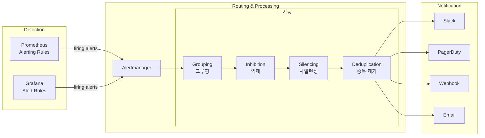
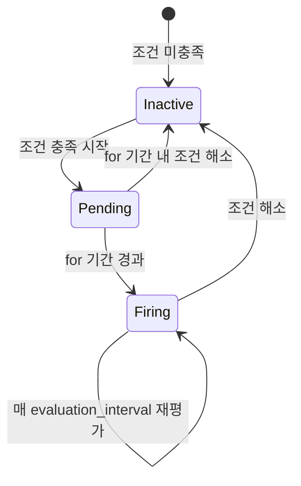
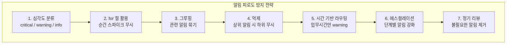

# Alerting 파이프라인 구축

Prometheus alerting rules, Alertmanager, Grafana ngalert 3가지 알림 경로를 비교하고, 라우팅 트리/사일런싱/그루핑/억제(Inhibition) 설정, Slack/PagerDuty/Webhook 연동, 그리고 알림 피로도 관리 전략까지 전체 파이프라인을 구축한다.

## 목차
- [1. 핵심 개념 (What)](#1-핵심-개념-what)
- [2. 왜 알아야 하는가 (Why)](#2-왜-알아야-하는가-why)
- [3. 내부 구현 분석 (How)](#3-내부-구현-분석-how)
- [4. 실전 예제](#4-실전-예제)
- [5. 정리](#5-정리)

---

## 1. 핵심 개념 (What)

알림 파이프라인은 **"무엇을 감지할 것인가"** (Alerting Rules)와 **"어떻게 전달할 것인가"** (Alertmanager/Notification)로 나뉜다.

### 3가지 알림 경로 비교

| 항목 | Prometheus Rules + Alertmanager | Grafana Alerting (ngalert) |
|------|-------------------------------|---------------------------|
| 규칙 정의 | YAML 파일 (rule_files) | Grafana UI 또는 Provisioning |
| 평가 엔진 | Prometheus 자체 | Grafana 내장 엔진 |
| 알림 라우팅 | Alertmanager (독립 서비스) | Grafana 내장 또는 외부 AM |
| 데이터소스 | Prometheus만 | 모든 Grafana 데이터소스 |
| 고가용성 | AM 클러스터링 | Grafana HA + 외부 AM |
| 장점 | 성숙도 높음, 표준 | 멀티 데이터소스, UI 편의성 |
| 단점 | 파일 기반 관리 | 상대적으로 복잡한 설정 |

### 전체 파이프라인 아키텍처



---

## 2. 왜 알아야 하는가 (Why)

| 문제 | 원인 | 해결 |
|------|------|------|
| 새벽 3시 불필요한 알림 | 라우팅/시간 기반 규칙 없음 | time_intervals + 심각도별 라우팅 |
| 같은 알림 수십 개 동시 발생 | 그루핑 미설정 | `group_by` 설정 |
| 네트워크 장애 시 모든 알림 폭발 | 억제 규칙 없음 | Inhibition rules |
| 배포 중 알림 발생 | 사일런싱 미사용 | Silence API 자동화 |
| 알림 피로 → 무시 | 임계값/for 절 미조정 | 단계별 에스컬레이션 |

**알림 피로도(Alert Fatigue)** 는 운영팀이 너무 많은 알림에 지쳐 중요한 알림마저 무시하게 되는 현상이다. 이를 방지하는 것이 알림 파이프라인 설계의 핵심 목표다.

---

## 3. 내부 구현 분석 (How)

### 3.1 Prometheus Alerting Rules



**Alert 상태 전이:**
- **Inactive**: 조건 미충족 (정상)
- **Pending**: 조건 충족, `for` 대기 중
- **Firing**: `for` 기간 경과, Alertmanager에 전송 중

### 3.2 Alertmanager 라우팅 트리

라우팅은 트리 구조로 동작한다. 알림이 들어오면 루트부터 시작해 가장 구체적인 매칭 라우트를 찾는다.

```
alertmanager.yml 라우팅 트리 예시:

route (root)                          ← 기본 receiver: 'slack-default'
├── match: severity=critical          ← receiver: 'pagerduty-critical'
│   ├── match: team=platform          ← receiver: 'pagerduty-platform'
│   └── match: team=backend           ← receiver: 'pagerduty-backend'
├── match: severity=warning           ← receiver: 'slack-warning'
│   └── match: team=frontend          ← receiver: 'slack-frontend'
└── match: alertname=Watchdog         ← receiver: 'null' (heartbeat)
```

**라우팅 매칭 규칙:**
1. 루트 라우트에서 시작
2. 자식 라우트를 순서대로 매칭
3. `continue: true`가 아니면 첫 매칭에서 중단
4. 자식이 없거나 매칭 실패 시 현재 노드의 receiver 사용

### 3.3 그루핑 (Grouping)

```
group_by: ['alertname', 'cluster', 'service']

Before grouping (5개 알림):
  Alert 1: {alertname="HighErrorRate", cluster="prod", service="api", instance="10.0.0.1"}
  Alert 2: {alertname="HighErrorRate", cluster="prod", service="api", instance="10.0.0.2"}
  Alert 3: {alertname="HighErrorRate", cluster="prod", service="api", instance="10.0.0.3"}
  Alert 4: {alertname="HighLatency",   cluster="prod", service="api", instance="10.0.0.1"}
  Alert 5: {alertname="HighErrorRate", cluster="prod", service="web", instance="10.0.1.1"}

After grouping (3개 그룹):
  Group A: {alertname="HighErrorRate", cluster="prod", service="api"} → 3개 알림
  Group B: {alertname="HighLatency",   cluster="prod", service="api"} → 1개 알림
  Group C: {alertname="HighErrorRate", cluster="prod", service="web"} → 1개 알림

→ Slack 알림 3개 발송 (인스턴스별이 아닌 그룹별)
```

**타이밍 파라미터:**
- `group_wait`: 그룹 첫 알림 후 추가 알림 대기 (기본 30s)
- `group_interval`: 그룹 업데이트 간격 (기본 5m)
- `repeat_interval`: 동일 알림 반복 전송 간격 (기본 4h)

### 3.4 억제 (Inhibition)

상위 알림이 firing이면 하위 알림을 억제한다.

```yaml
# 클러스터 다운 시 개별 노드 알림 억제
inhibit_rules:
  - source_matchers:
      - severity="critical"
    target_matchers:
      - severity="warning"
    equal: ['cluster', 'service']

# 예시:
# Source (firing): {alertname="ClusterDown", severity="critical", cluster="prod", service="api"}
# Target (억제됨): {alertname="HighLatency", severity="warning", cluster="prod", service="api"}
# → cluster와 service가 동일하므로 warning 알림 억제
```

### 3.5 사일런싱 (Silencing)

특정 조건의 알림을 일시적으로 무시한다.

```bash
# API로 Silence 생성 (배포 중 30분 억제)
curl -X POST http://alertmanager:9093/api/v2/silences \
  -H "Content-Type: application/json" \
  -d '{
    "matchers": [
      {
        "name": "service",
        "value": "api",
        "isRegex": false
      },
      {
        "name": "severity",
        "value": "warning",
        "isRegex": false
      }
    ],
    "startsAt": "2026-02-19T10:00:00Z",
    "endsAt": "2026-02-19T10:30:00Z",
    "createdBy": "deploy-bot",
    "comment": "Scheduled deployment - suppressing warnings"
  }'

# 활성 Silence 목록 조회
curl -s http://alertmanager:9093/api/v2/silences | python3 -m json.tool

# Silence 삭제
curl -X DELETE http://alertmanager:9093/api/v2/silence/{silence_id}
```

---

## 4. 실전 예제

### 4.1 전체 파이프라인 Docker Compose

```yaml
# docker-compose.yml
services:
  prometheus:
    image: prom/prometheus:v3.2.1
    container_name: prometheus
    command:
      - '--config.file=/etc/prometheus/prometheus.yml'
      - '--web.enable-lifecycle'
      - '--storage.tsdb.retention.time=15d'
    volumes:
      - ./config/prometheus.yml:/etc/prometheus/prometheus.yml:ro
      - ./rules:/etc/prometheus/rules:ro
      - prometheus_data:/prometheus
    ports:
      - "9090:9090"
    restart: unless-stopped

  alertmanager:
    image: prom/alertmanager:v0.28.1
    container_name: alertmanager
    command:
      - '--config.file=/etc/alertmanager/alertmanager.yml'
      - '--storage.path=/alertmanager'
      - '--web.external-url=http://alertmanager:9093'
      # 클러스터링 (HA 구성 시)
      # - '--cluster.peer=alertmanager-2:9094'
    volumes:
      - ./config/alertmanager.yml:/etc/alertmanager/alertmanager.yml:ro
      - ./config/alertmanager_templates:/etc/alertmanager/templates:ro
      - alertmanager_data:/alertmanager
    ports:
      - "9093:9093"
    restart: unless-stopped

  grafana:
    image: grafana/grafana:11.5.2
    container_name: grafana
    environment:
      - GF_SECURITY_ADMIN_USER=admin
      - GF_SECURITY_ADMIN_PASSWORD=changeme
      # Grafana Alerting 설정
      - GF_UNIFIED_ALERTING_ENABLED=true
      - GF_ALERTING_ENABLED=false
    volumes:
      - grafana_data:/var/lib/grafana
      - ./grafana/provisioning:/etc/grafana/provisioning:ro
    ports:
      - "3000:3000"
    restart: unless-stopped

  # 테스트용 앱
  app:
    image: quay.io/brancz/prometheus-example-app:v0.5.0
    container_name: example-app
    ports:
      - "8080:8080"

  # Webhook 수신 테스트용
  webhook-receiver:
    image: tarampampam/webhook-tester:2
    container_name: webhook-receiver
    ports:
      - "8888:8080"

volumes:
  prometheus_data:
  alertmanager_data:
  grafana_data:
```

### 4.2 Prometheus 설정 (prometheus.yml)

```yaml
global:
  scrape_interval: 15s
  evaluation_interval: 15s
  external_labels:
    cluster: 'production'
    region: 'ap-northeast-2'

alerting:
  alertmanagers:
    - static_configs:
        - targets: ['alertmanager:9093']
      # 알림 전송 타임아웃
      timeout: 10s

rule_files:
  - '/etc/prometheus/rules/*.yml'

scrape_configs:
  - job_name: 'prometheus'
    static_configs:
      - targets: ['localhost:9090']

  - job_name: 'alertmanager'
    static_configs:
      - targets: ['alertmanager:9093']

  - job_name: 'app'
    static_configs:
      - targets: ['app:8080']
```

### 4.3 Alerting Rules (rules/alerts.yml)

```yaml
groups:
  # SLO 기반 알림
  - name: slo_alerts
    rules:
      # 에러율 SLO 위반 (목표: 99.9%)
      - alert: HighErrorRate
        expr: |
          sum(rate(http_requests_total{status=~"5.."}[5m])) by (job)
          /
          sum(rate(http_requests_total[5m])) by (job)
          > 0.001
        for: 5m
        labels:
          severity: critical
          team: backend
        annotations:
          summary: "High error rate on {{ $labels.job }}"
          description: |
            Error rate is {{ $value | humanizePercentage }} (threshold: 0.1%).
            Current 5xx rate exceeds SLO target of 99.9%.
          runbook_url: "https://wiki.example.com/runbooks/high-error-rate"
          dashboard_url: "https://grafana.example.com/d/golden-signals?var-service={{ $labels.job }}"

      # 지연시간 SLO 위반 (P95 < 500ms)
      - alert: HighLatencyP95
        expr: |
          histogram_quantile(0.95,
            sum(rate(http_request_duration_seconds_bucket[5m])) by (le, job)
          ) > 0.5
        for: 10m
        labels:
          severity: warning
          team: backend
        annotations:
          summary: "High P95 latency on {{ $labels.job }}"
          description: "P95 latency is {{ $value | humanizeDuration }}."

  # 인프라 알림
  - name: infrastructure_alerts
    rules:
      # 인스턴스 다운
      - alert: InstanceDown
        expr: up == 0
        for: 3m
        labels:
          severity: critical
        annotations:
          summary: "Instance {{ $labels.instance }} is down"
          description: "{{ $labels.job }}/{{ $labels.instance }} has been down for more than 3 minutes."

      # 디스크 고갈 예측 (24시간 이내)
      - alert: DiskWillFillIn24h
        expr: |
          predict_linear(
            node_filesystem_avail_bytes{mountpoint="/"}[6h], 24*3600
          ) < 0
        for: 30m
        labels:
          severity: warning
          team: platform
        annotations:
          summary: "Disk will fill within 24 hours on {{ $labels.instance }}"
          description: "Current available: {{ $value | humanize1024 }}B"

      # 메모리 사용률 높음
      - alert: HighMemoryUsage
        expr: |
          (1 - node_memory_MemAvailable_bytes / node_memory_MemTotal_bytes) > 0.9
        for: 15m
        labels:
          severity: warning
          team: platform
        annotations:
          summary: "High memory usage on {{ $labels.instance }}"
          description: "Memory usage is above 90%."

      # Prometheus TSDB 용량 경고
      - alert: PrometheusTSDBHighDiskUsage
        expr: |
          (prometheus_tsdb_storage_blocks_bytes + prometheus_tsdb_wal_storage_size_bytes)
          / 1024 / 1024 / 1024 > 8
        for: 1h
        labels:
          severity: warning
          team: platform
        annotations:
          summary: "Prometheus TSDB using {{ $value | printf \"%.1f\" }}GB"

  # Watchdog (데드맨 스위치)
  - name: watchdog
    rules:
      - alert: Watchdog
        expr: vector(1)
        labels:
          severity: none
        annotations:
          summary: "Alerting pipeline heartbeat"
          description: "This alert fires continuously to verify the alerting pipeline is functional."
```

### 4.4 Alertmanager 설정 (alertmanager.yml)

```yaml
# alertmanager.yml
global:
  resolve_timeout: 5m
  slack_api_url: 'https://hooks.slack.com/services/T00000/B00000/XXXXX'
  pagerduty_url: 'https://events.pagerduty.com/v2/enqueue'

# 알림 메시지 템플릿
templates:
  - '/etc/alertmanager/templates/*.tmpl'

# 라우팅 트리
route:
  receiver: 'slack-default'
  group_by: ['alertname', 'cluster', 'service']
  group_wait: 30s
  group_interval: 5m
  repeat_interval: 4h

  routes:
    # Watchdog → null receiver (사일런트 하트비트)
    - match:
        alertname: Watchdog
      receiver: 'null'

    # Critical → PagerDuty (즉시 알림)
    - match:
        severity: critical
      receiver: 'pagerduty-critical'
      group_wait: 10s
      repeat_interval: 1h
      routes:
        # 플랫폼 팀 Critical
        - match:
            team: platform
          receiver: 'pagerduty-platform'
        # 백엔드 팀 Critical
        - match:
            team: backend
          receiver: 'pagerduty-backend'

    # Warning → Slack (업무시간만)
    - match:
        severity: warning
      receiver: 'slack-warning'
      group_wait: 1m
      repeat_interval: 12h
      active_time_intervals:
        - business-hours

# 억제 규칙
inhibit_rules:
  # Critical이 firing이면 동일 서비스의 Warning 억제
  - source_matchers:
      - severity="critical"
    target_matchers:
      - severity="warning"
    equal: ['alertname', 'cluster', 'service']

  # InstanceDown이 firing이면 해당 인스턴스의 다른 알림 억제
  - source_matchers:
      - alertname="InstanceDown"
    target_matchers:
      - severity=~"warning|info"
    equal: ['instance']

# 시간 간격 정의
time_intervals:
  - name: business-hours
    time_intervals:
      - weekdays: ['monday:friday']
        times:
          - start_time: '09:00'
            end_time: '18:00'

# 수신자 정의
receivers:
  # Null receiver (Watchdog 등 무시할 알림)
  - name: 'null'

  # Slack 기본 채널
  - name: 'slack-default'
    slack_configs:
      - channel: '#alerts-default'
        send_resolved: true
        title: '{{ template "slack.title" . }}'
        text: '{{ template "slack.text" . }}'
        actions:
          - type: button
            text: 'Runbook'
            url: '{{ (index .Alerts 0).Annotations.runbook_url }}'
          - type: button
            text: 'Dashboard'
            url: '{{ (index .Alerts 0).Annotations.dashboard_url }}'

  # Slack Warning 채널
  - name: 'slack-warning'
    slack_configs:
      - channel: '#alerts-warning'
        send_resolved: true
        color: '{{ if eq .Status "firing" }}warning{{ else }}good{{ end }}'
        title: '{{ template "slack.title" . }}'
        text: '{{ template "slack.text" . }}'

  # PagerDuty Critical (일반)
  - name: 'pagerduty-critical'
    pagerduty_configs:
      - routing_key: 'PAGERDUTY_ROUTING_KEY'
        severity: critical
        description: '{{ template "pagerduty.description" . }}'
        details:
          firing: '{{ template "pagerduty.firing" . }}'

  # PagerDuty Platform 팀
  - name: 'pagerduty-platform'
    pagerduty_configs:
      - routing_key: 'PLATFORM_TEAM_ROUTING_KEY'
        severity: critical

  # PagerDuty Backend 팀
  - name: 'pagerduty-backend'
    pagerduty_configs:
      - routing_key: 'BACKEND_TEAM_ROUTING_KEY'
        severity: critical

  # Webhook (커스텀 연동)
  - name: 'webhook-custom'
    webhook_configs:
      - url: 'http://webhook-receiver:8080/alert'
        send_resolved: true
        max_alerts: 10
        http_config:
          basic_auth:
            username: 'alertmanager'
            password: 'secret'
```

### 4.5 Slack 알림 템플릿

```go
{{/* alertmanager_templates/slack.tmpl */}}

{{ define "slack.title" -}}
[{{ .Status | toUpper }}{{ if eq .Status "firing" }}:{{ .Alerts.Firing | len }}{{ end }}] {{ .GroupLabels.SortedPairs.Values | join " " }}
{{- end }}

{{ define "slack.text" -}}
{{ range .Alerts }}
*Alert:* {{ .Annotations.summary }}
*Severity:* `{{ .Labels.severity }}`
*Description:* {{ .Annotations.description }}
{{ if .Annotations.runbook_url }}*Runbook:* <{{ .Annotations.runbook_url }}|View>{{ end }}
{{ if .Annotations.dashboard_url }}*Dashboard:* <{{ .Annotations.dashboard_url }}|View>{{ end }}
*Details:*
{{ range .Labels.SortedPairs }}  - *{{ .Name }}:* `{{ .Value }}`
{{ end }}
{{ end }}
{{- end }}
```

### 4.6 배포 시 자동 Silence 스크립트

```bash
#!/bin/bash
# deploy-silence.sh - 배포 시 자동으로 Silence 생성/삭제

ALERTMANAGER_URL="http://alertmanager:9093"
SERVICE="$1"
DURATION_MINUTES="${2:-30}"

create_silence() {
    local start_time=$(date -u +"%Y-%m-%dT%H:%M:%SZ")
    local end_time=$(date -u -v+${DURATION_MINUTES}M +"%Y-%m-%dT%H:%M:%SZ" 2>/dev/null \
        || date -u -d "+${DURATION_MINUTES} minutes" +"%Y-%m-%dT%H:%M:%SZ")

    SILENCE_ID=$(curl -s -X POST "${ALERTMANAGER_URL}/api/v2/silences" \
        -H "Content-Type: application/json" \
        -d "{
            \"matchers\": [{
                \"name\": \"service\",
                \"value\": \"${SERVICE}\",
                \"isRegex\": false
            }, {
                \"name\": \"severity\",
                \"value\": \"warning|info\",
                \"isRegex\": true
            }],
            \"startsAt\": \"${start_time}\",
            \"endsAt\": \"${end_time}\",
            \"createdBy\": \"deploy-bot\",
            \"comment\": \"Auto-silence during deployment of ${SERVICE}\"
        }" | python3 -c "import sys,json; print(json.load(sys.stdin)['silenceID'])")

    echo "Silence created: ${SILENCE_ID}"
    echo "${SILENCE_ID}" > /tmp/silence-${SERVICE}.id
}

delete_silence() {
    if [ -f /tmp/silence-${SERVICE}.id ]; then
        local sid=$(cat /tmp/silence-${SERVICE}.id)
        curl -s -X DELETE "${ALERTMANAGER_URL}/api/v2/silence/${sid}"
        rm /tmp/silence-${SERVICE}.id
        echo "Silence deleted: ${sid}"
    fi
}

case "${3:-create}" in
    create) create_silence ;;
    delete) delete_silence ;;
    *) echo "Usage: $0 <service> [duration_minutes] [create|delete]" ;;
esac
```

### 4.7 알림 규칙 테스트

```yaml
# rules/alerts_test.yml
rule_files:
  - alerts.yml

evaluation_interval: 15s

tests:
  # HighErrorRate 알림 테스트
  - interval: 15s
    input_series:
      - series: 'http_requests_total{job="api", status="200"}'
        values: '0+100x20'
      - series: 'http_requests_total{job="api", status="500"}'
        values: '0+5x20'

    alert_rule_test:
      - eval_time: 5m
        alertname: HighErrorRate
        exp_alerts:
          - exp_labels:
              severity: critical
              team: backend
              job: api
            exp_annotations:
              summary: "High error rate on api"

  # InstanceDown 알림 테스트
  - interval: 15s
    input_series:
      - series: 'up{job="app", instance="10.0.0.1:8080"}'
        values: '1 1 1 1 0 0 0 0 0 0 0 0 0 0 0 0 0 0 0 0'

    alert_rule_test:
      - eval_time: 4m
        alertname: InstanceDown
        exp_alerts:
          - exp_labels:
              severity: critical
              job: app
              instance: "10.0.0.1:8080"
```

```bash
# 테스트 실행
promtool test rules rules/alerts_test.yml

# Alertmanager 설정 검증
amtool check-config config/alertmanager.yml

# 라우팅 테스트 (어떤 receiver로 가는지 확인)
amtool config routes test \
  --config.file=config/alertmanager.yml \
  severity=critical team=backend

# 기대 출력: pagerduty-backend
```

### 4.8 알림 피로도 관리 전략



**실천 규칙:**

| 규칙 | 설명 |
|------|------|
| Critical은 즉시 행동 필요 | PagerDuty + On-call 호출 |
| Warning은 업무시간에 처리 | Slack 채널 전송, `for: 10m` 이상 |
| 모든 알림에 runbook_url | 대응 절차 문서 링크 필수 |
| `for` 절 최소 3-5분 | 순간 스파이크에 의한 오탐 방지 |
| repeat_interval 충분히 길게 | Critical: 1h, Warning: 12h |
| 월간 알림 리뷰 | 한 달간 발생한 알림 분석, 불필요한 것 제거 |
| Watchdog 알림 유지 | 파이프라인 정상 동작 확인용 데드맨 스위치 |

---

## 5. 정리

| 구성 요소 | 역할 | 핵심 설정 |
|-----------|------|-----------|
| Alerting Rules | 이상 감지 | `expr`, `for`, `labels`, `annotations` |
| Alertmanager Route | 알림 라우팅 | `group_by`, `match`, `receiver` |
| Grouping | 관련 알림 묶기 | `group_wait`, `group_interval` |
| Inhibition | 상위 알림 시 하위 억제 | `source_matchers`, `target_matchers`, `equal` |
| Silencing | 일시적 알림 무시 | API로 생성, 배포 자동화 |
| Time Intervals | 시간 기반 라우팅 | `active_time_intervals`, `mute_time_intervals` |
| Receivers | 알림 전달 | Slack, PagerDuty, Webhook, Email |

### 파이프라인 구축 체크리스트

1. **Alerting Rules에 `for` 절 설정** - 최소 3분, 순간 스파이크 방지
2. **모든 알림에 severity 레이블** - critical / warning / info 3단계
3. **annotations에 runbook_url 필수** - 대응 절차 문서화
4. **group_by 설정** - 최소 `['alertname', 'cluster', 'service']`
5. **Inhibition 규칙 추가** - critical 시 warning 억제
6. **Watchdog 알림 설정** - 파이프라인 헬스체크
7. **배포 시 Silence 자동화** - CI/CD에 silence 스크립트 통합
8. **월간 알림 리뷰** - 오탐/미탐 분석, 임계값 조정

---
*참고: Prometheus v3.2.x, Alertmanager v0.28.x, Grafana v11.5.x*
