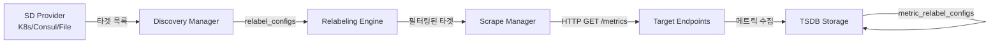
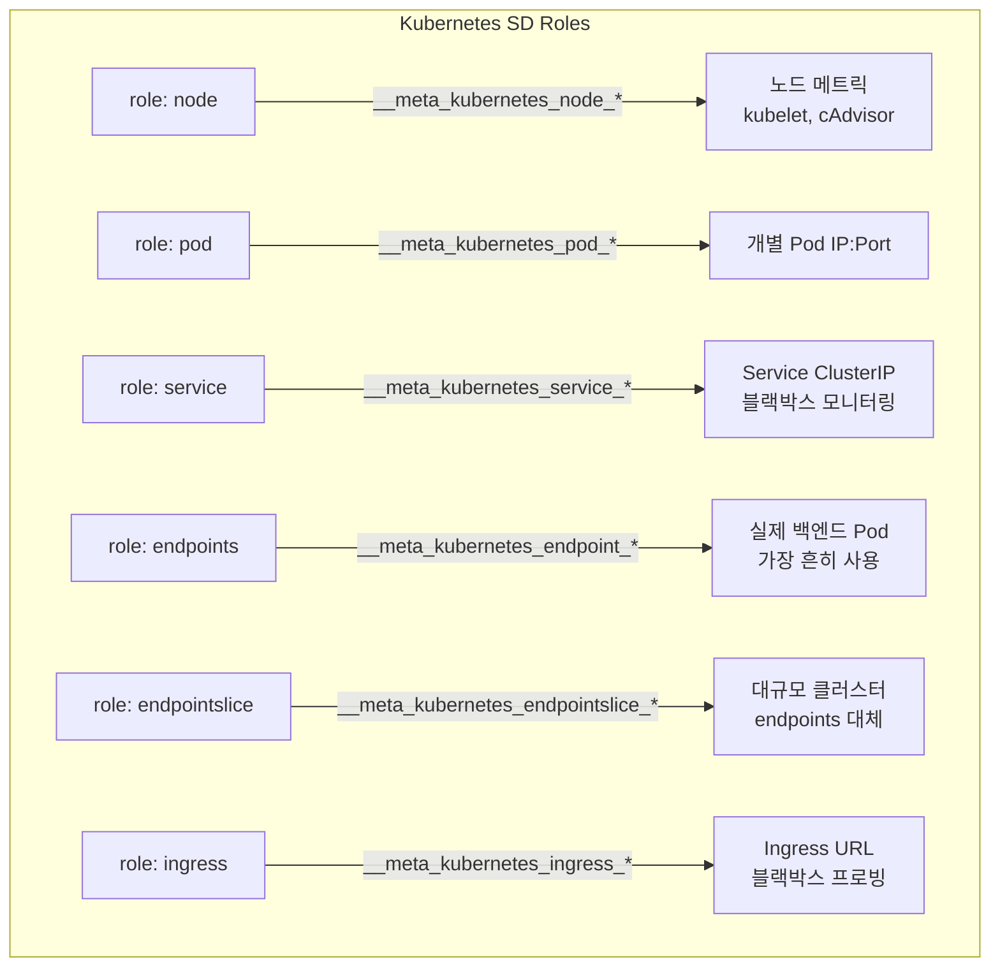
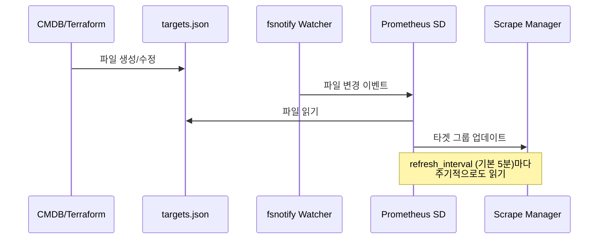
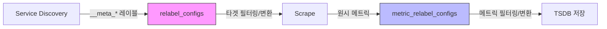

# Service Discovery 실전 구성

Prometheus가 모니터링 대상을 자동으로 찾고 관리하는 Service Discovery 메커니즘의 실전 구성 방법을 다룬다. Kubernetes SD, File SD, Consul SD, HTTP SD와 Relabeling 전략을 실제 운영 환경 기준으로 설명한다.

## 목차
- [1. 핵심 개념 (What)](#1-핵심-개념-what)
- [2. 왜 알아야 하는가 (Why)](#2-왜-알아야-하는가-why)
- [3. 내부 구현 분석 (How)](#3-내부-구현-분석-how)
- [4. 실전 예제](#4-실전-예제)
- [5. 정리](#5-정리)

---

## 1. 핵심 개념 (What)

### Service Discovery란?

Service Discovery는 Prometheus가 스크랩 대상(target)을 **자동으로 발견**하는 메커니즘이다. `static_configs`로 IP를 하드코딩하는 대신, 인프라 API를 통해 동적으로 타겟을 찾는다.

Prometheus 소스코드(`discovery/discovery.go`)에서 모든 SD는 `Discoverer` 인터페이스를 구현한다:

```go
// discovery/discovery.go
type Discoverer interface {
    Run(ctx context.Context, up chan<- []*targetgroup.Group)
}
```

### 지원하는 SD 메커니즘

| SD 유형 | 소스 | 사용 환경 |
|---------|------|----------|
| `kubernetes_sd_configs` | K8s API Server | Kubernetes 클러스터 |
| `file_sd_configs` | 로컬 JSON/YAML 파일 | 범용 (CMDB 연동) |
| `consul_sd_configs` | Consul API | HashiCorp 스택 |
| `http_sd_configs` | HTTP 엔드포인트 | Custom API 연동 |
| `dns_sd_configs` | DNS SRV/A 레코드 | 전통적 인프라 |
| `ec2_sd_configs` | AWS EC2 API | AWS 환경 |

### Discovery 흐름



---

## 2. 왜 알아야 하는가 (Why)

### Static Config의 한계

```yaml
# 이렇게 하면 안 된다
scrape_configs:
  - job_name: 'my-app'
    static_configs:
      - targets: ['10.0.1.1:8080', '10.0.1.2:8080', '10.0.1.3:8080']
```

- Pod가 재시작되면 IP가 바뀐다
- Auto-scaling으로 인스턴스 수가 동적으로 변한다
- 수백 개 서비스를 수동 관리하는 것은 불가능하다

### SD가 해결하는 문제

1. **자동 타겟 등록/해제**: Pod 생성/삭제 시 자동 반영
2. **메타데이터 기반 분류**: label, annotation으로 타겟 자동 분류
3. **환경 일관성**: dev/staging/prod 동일한 설정으로 운영
4. **운영 부담 최소화**: 인프라 변경 시 Prometheus 설정 수정 불필요

---

## 3. 내부 구현 분석 (How)

### 3.1 Kubernetes SD

Prometheus Kubernetes SD는 K8s API Server의 Watch 메커니즘을 사용하여 리소스 변경을 실시간으로 감지한다.

#### 소스 코드 구조 (`/tmp/prometheus/discovery/kubernetes/`)

```
kubernetes/
├── kubernetes.go      # SDConfig, Role 정의, Discovery 생성
├── pod.go             # Pod role 구현 (SharedIndexInformer)
├── node.go            # Node role 구현
├── service.go         # Service role 구현
├── endpoints.go       # Endpoints role 구현
├── endpointslice.go   # EndpointSlice role 구현
├── ingress.go         # Ingress role 구현
└── metrics.go         # SD 내부 메트릭
```

#### SDConfig 구조 (소스 기반)

```go
// discovery/kubernetes/kubernetes.go:106-114
type SDConfig struct {
    APIServer          config.URL              `yaml:"api_server,omitempty"`
    Role               Role                    `yaml:"role"`
    KubeConfig         string                  `yaml:"kubeconfig_file"`
    HTTPClientConfig   config.HTTPClientConfig `yaml:",inline"`
    NamespaceDiscovery NamespaceDiscovery      `yaml:"namespaces,omitempty"`
    Selectors          []SelectorConfig        `yaml:"selectors,omitempty"`
    AttachMetadata     AttachMetadataConfig    `yaml:"attach_metadata,omitempty"`
}
```

#### 6가지 Role 비교



| Role | 타겟 주소 | 주요 메타 레이블 | 용도 |
|------|----------|-----------------|------|
| `node` | `<NodeIP>:<KubeletPort>` | `__meta_kubernetes_node_name`, `_label_*` | kubelet, node-exporter |
| `pod` | `<PodIP>:<ContainerPort>` | `__meta_kubernetes_pod_name`, `_container_*` | 사이드카 직접 스크랩 |
| `service` | `<ServiceIP>:<ServicePort>` | `__meta_kubernetes_service_name` | 블랙박스 프로빙 |
| `endpoints` | `<PodIP>:<EndpointPort>` | `__meta_kubernetes_endpoint_*` + pod/service 메타 | **가장 일반적** |
| `endpointslice` | `<PodIP>:<Port>` | `__meta_kubernetes_endpointslice_*` | K8s 1.21+ 대규모 |
| `ingress` | `<IngressHost>` | `__meta_kubernetes_ingress_*` | URL 프로빙 |

#### Pod role 내부 동작 (소스 기반)

```go
// discovery/kubernetes/pod.go
type Pod struct {
    podInf                cache.SharedIndexInformer  // K8s Watch 메커니즘
    nodeInf               cache.SharedInformer
    withNodeMetadata      bool
    namespaceInf          cache.SharedInformer
    withNamespaceMetadata bool
    store                 cache.Store
    logger                *slog.Logger
    queue                 *workqueue.Typed[string]   // 이벤트 큐
}
```

Pod informer가 K8s API를 Watch하고, 변경 이벤트(Add/Update/Delete)를 큐에 넣어 비동기로 처리한다.

### 3.2 File SD

파일 기반 SD는 가장 단순하면서도 유연한 방식이다. 외부 시스템(CMDB, Terraform)이 JSON/YAML 파일을 생성하면 Prometheus가 이를 읽는다.

#### 소스 코드 분석

```go
// discovery/file/file.go:56-59
type SDConfig struct {
    Files           []string       `yaml:"files"`
    RefreshInterval model.Duration `yaml:"refresh_interval,omitempty"`  // 기본 5분
}
```

파일 변경 감지는 `fsnotify`를 사용한다. 파일 패턴은 `*.json`, `*.yml`, `*.yaml`만 허용:

```go
// discovery/file/file.go:43
patFileSDName = regexp.MustCompile(`^[^*]*(\*[^/]*)?\.(json|yml|yaml|JSON|YML|YAML)$`)
```

#### File SD 동작 흐름



### 3.3 Consul SD

HashiCorp Consul의 서비스 카탈로그를 사용하여 타겟을 발견한다.

```go
// discovery/consul/consul.go:76-80
var DefaultSDConfig = SDConfig{
    TagSeparator:     ",",
    Scheme:           "http",
    Server:           "localhost:8500",
    AllowStale:       true,
}
```

주요 메타 레이블: `__meta_consul_service`, `__meta_consul_tags`, `__meta_consul_dc`, `__meta_consul_node`

### 3.4 HTTP SD

커스텀 API 서버에서 타겟 목록을 가져오는 범용 방식이다.

```go
// discovery/http/http.go:55-59
type SDConfig struct {
    HTTPClientConfig config.HTTPClientConfig `yaml:",inline"`
    RefreshInterval  model.Duration          `yaml:"refresh_interval,omitempty"`  // 기본 60초
    URL              string                  `yaml:"url"`
}
```

HTTP SD는 JSON 응답(`application/json`)만 허용하며, File SD와 동일한 타겟 그룹 형식을 사용한다.

### 3.5 Relabeling 전략

Relabeling은 SD가 발견한 타겟의 메타 레이블을 가공하여 **스크랩 여부 결정**, **레이블 변환**, **타겟 필터링**을 수행한다.

#### relabel_configs vs metric_relabel_configs



| 구분 | `relabel_configs` | `metric_relabel_configs` |
|------|-------------------|--------------------------|
| 실행 시점 | 스크랩 **전** | 스크랩 **후**, 저장 전 |
| 대상 | 타겟 레이블 (`__meta_*`) | 수집된 메트릭 레이블 |
| 용도 | 타겟 필터링, 레이블 매핑 | 메트릭 드롭, 레이블 정리 |
| 성능 영향 | 불필요한 스크랩 방지 | 저장 공간 절약 |

#### Relabel Action 종류

| Action | 설명 | 사용 빈도 |
|--------|------|----------|
| `replace` | 레이블 값 치환 (기본값) | 매우 높음 |
| `keep` | 매칭되는 타겟만 유지 | 높음 |
| `drop` | 매칭되는 타겟 제거 | 높음 |
| `labelmap` | 레이블 이름 변환 | 중간 |
| `labeldrop` | 레이블 제거 | 중간 |
| `labelkeep` | 지정 레이블만 유지 | 낮음 |
| `hashmod` | 해시 기반 샤딩 | 낮음 |

---

## 4. 실전 예제

### 4.1 Kubernetes SD - Pod 자동 발견

annotation 기반으로 스크랩 대상을 자동 결정하는 가장 일반적인 패턴:

```yaml
# prometheus.yml
scrape_configs:
  - job_name: 'kubernetes-pods'
    kubernetes_sd_configs:
      - role: pod
        namespaces:
          names:
            - default
            - production
            - staging

    relabel_configs:
      # prometheus.io/scrape: "true" annotation이 있는 Pod만 스크랩
      - source_labels: [__meta_kubernetes_pod_annotation_prometheus_io_scrape]
        action: keep
        regex: true

      # 커스텀 메트릭 경로 지원
      - source_labels: [__meta_kubernetes_pod_annotation_prometheus_io_path]
        action: replace
        target_label: __metrics_path__
        regex: (.+)

      # 커스텀 포트 지원
      - source_labels: [__address__, __meta_kubernetes_pod_annotation_prometheus_io_port]
        action: replace
        regex: ([^:]+)(?::\d+)?;(\d+)
        replacement: $1:$2
        target_label: __address__

      # 스키마(http/https) 지원
      - source_labels: [__meta_kubernetes_pod_annotation_prometheus_io_scheme]
        action: replace
        target_label: __scheme__
        regex: (https?)

      # 유용한 레이블 매핑
      - source_labels: [__meta_kubernetes_namespace]
        action: replace
        target_label: namespace

      - source_labels: [__meta_kubernetes_pod_name]
        action: replace
        target_label: pod

      - source_labels: [__meta_kubernetes_pod_label_app]
        action: replace
        target_label: app

      - source_labels: [__meta_kubernetes_pod_node_name]
        action: replace
        target_label: node
```

대응하는 Pod 매니페스트:

```yaml
# deployment.yaml
apiVersion: apps/v1
kind: Deployment
metadata:
  name: my-app
spec:
  template:
    metadata:
      annotations:
        prometheus.io/scrape: "true"
        prometheus.io/port: "8080"
        prometheus.io/path: "/metrics"
      labels:
        app: my-app
    spec:
      containers:
        - name: my-app
          image: my-app:latest
          ports:
            - containerPort: 8080
              name: http-metrics
```

### 4.2 Kubernetes SD - Node & Endpoints

```yaml
scrape_configs:
  # Node 메트릭 (kubelet)
  - job_name: 'kubelet'
    kubernetes_sd_configs:
      - role: node
    scheme: https
    tls_config:
      ca_file: /var/run/secrets/kubernetes.io/serviceaccount/ca.crt
    bearer_token_file: /var/run/secrets/kubernetes.io/serviceaccount/token
    relabel_configs:
      - action: labelmap
        regex: __meta_kubernetes_node_label_(.+)

  # cAdvisor 메트릭
  - job_name: 'cadvisor'
    kubernetes_sd_configs:
      - role: node
    scheme: https
    tls_config:
      ca_file: /var/run/secrets/kubernetes.io/serviceaccount/ca.crt
    bearer_token_file: /var/run/secrets/kubernetes.io/serviceaccount/token
    metrics_path: /metrics/cadvisor
    relabel_configs:
      - action: labelmap
        regex: __meta_kubernetes_node_label_(.+)

  # Endpoints (서비스별 Pod 스크랩)
  - job_name: 'kubernetes-endpoints'
    kubernetes_sd_configs:
      - role: endpoints
    relabel_configs:
      - source_labels:
          - __meta_kubernetes_service_annotation_prometheus_io_scrape
        action: keep
        regex: true
      - source_labels:
          - __meta_kubernetes_service_name
        action: replace
        target_label: service
      - source_labels:
          - __meta_kubernetes_namespace
        action: replace
        target_label: namespace
```

### 4.3 File SD - CMDB 연동

```yaml
# prometheus.yml
scrape_configs:
  - job_name: 'file-sd-targets'
    file_sd_configs:
      - files:
          - '/etc/prometheus/targets/*.json'
          - '/etc/prometheus/targets/*.yml'
        refresh_interval: 30s
```

JSON 형식 타겟 파일:

```json
[
  {
    "targets": ["10.0.1.10:9090", "10.0.1.11:9090"],
    "labels": {
      "env": "production",
      "team": "platform",
      "service": "api-gateway",
      "__metrics_path__": "/metrics"
    }
  },
  {
    "targets": ["10.0.2.20:9100"],
    "labels": {
      "env": "production",
      "team": "infra",
      "service": "node-exporter"
    }
  }
]
```

YAML 형식 타겟 파일:

```yaml
# targets/database.yml
- targets:
    - "db-primary.internal:9187"
    - "db-replica-1.internal:9187"
    - "db-replica-2.internal:9187"
  labels:
    env: production
    service: postgres
    role: database
```

자동 생성 스크립트 (CMDB -> File SD):

```bash
#!/bin/bash
# cmdb-to-filesd.sh - CMDB API에서 타겟 파일 자동 생성
CMDB_API="https://cmdb.internal/api/v1/servers"
OUTPUT="/etc/prometheus/targets/cmdb.json"

curl -s "$CMDB_API" | jq '[
  .servers[] |
  select(.monitoring_enabled == true) |
  {
    targets: ["\(.ip):\(.metrics_port // 9090)"],
    labels: {
      env: .environment,
      team: .team,
      service: .service_name,
      dc: .datacenter
    }
  }
]' > "${OUTPUT}.tmp" && mv "${OUTPUT}.tmp" "$OUTPUT"
```

### 4.4 Consul SD

```yaml
scrape_configs:
  - job_name: 'consul-services'
    consul_sd_configs:
      - server: 'consul.internal:8500'
        services:
          - 'api'
          - 'web'
          - 'worker'
        tags:
          - 'prometheus'
        datacenter: 'dc1'

    relabel_configs:
      # Consul 서비스 이름을 job 레이블로
      - source_labels: [__meta_consul_service]
        action: replace
        target_label: job

      # Consul 태그를 레이블로 변환
      - source_labels: [__meta_consul_tags]
        regex: .*,env=([^,]+),.*
        action: replace
        target_label: env

      # 데이터센터 레이블
      - source_labels: [__meta_consul_dc]
        action: replace
        target_label: datacenter

      # 건강하지 않은 서비스 제외
      - source_labels: [__meta_consul_health]
        action: keep
        regex: passing
```

### 4.5 HTTP SD

```yaml
# prometheus.yml
scrape_configs:
  - job_name: 'http-sd'
    http_sd_configs:
      - url: 'https://sd-api.internal/v1/targets'
        refresh_interval: 30s
        authorization:
          type: Bearer
          credentials_file: /etc/prometheus/sd-api-token
```

HTTP SD API 서버 예제 (Python):

```python
# sd_api.py - HTTP SD API 서버
from flask import Flask, jsonify
import boto3

app = Flask(__name__)

@app.route('/v1/targets')
def targets():
    """File SD 호환 형식으로 타겟 반환"""
    ec2 = boto3.client('ec2')
    instances = ec2.describe_instances(
        Filters=[{'Name': 'tag:monitoring', 'Values': ['enabled']}]
    )

    target_groups = []
    for reservation in instances['Reservations']:
        for instance in reservation['Instances']:
            if instance['State']['Name'] != 'running':
                continue
            tags = {t['Key']: t['Value'] for t in instance.get('Tags', [])}
            target_groups.append({
                'targets': [f"{instance['PrivateIpAddress']}:9100"],
                'labels': {
                    'instance_id': instance['InstanceId'],
                    'instance_type': instance['InstanceType'],
                    'env': tags.get('Environment', 'unknown'),
                    'service': tags.get('Service', 'unknown'),
                }
            })

    return jsonify(target_groups)

if __name__ == '__main__':
    app.run(host='0.0.0.0', port=8080)
```

### 4.6 실전 Relabel 레시피

#### 특정 네임스페이스만 스크랩

```yaml
relabel_configs:
  - source_labels: [__meta_kubernetes_namespace]
    action: keep
    regex: (production|staging)
```

#### Prometheus 샤딩 (hashmod)

대규모 환경에서 여러 Prometheus 인스턴스로 타겟을 분산:

```yaml
relabel_configs:
  # 3개 Prometheus 샤드 중 shard 0
  - source_labels: [__address__]
    modulus: 3
    target_label: __tmp_hash
    action: hashmod
  - source_labels: [__tmp_hash]
    regex: ^0$
    action: keep
```

#### 불필요한 고카디널리티 메트릭 드롭

```yaml
metric_relabel_configs:
  # go_* 메트릭 제거
  - source_labels: [__name__]
    regex: go_.*
    action: drop

  # 고카디널리티 히스토그램 버킷 제거
  - source_labels: [__name__]
    regex: apiserver_request_duration_seconds_bucket
    action: drop

  # 특정 레이블 제거 (카디널리티 감소)
  - regex: instance
    action: labeldrop
```

#### Pod label을 Prometheus label로 매핑

```yaml
relabel_configs:
  # app.kubernetes.io/name -> app_name
  - source_labels: [__meta_kubernetes_pod_label_app_kubernetes_io_name]
    action: replace
    target_label: app_name

  # 모든 kubernetes label을 k8s_ 접두사로 매핑
  - action: labelmap
    regex: __meta_kubernetes_pod_label_(.+)
    replacement: k8s_$1
```

---

## 5. 정리

### SD 유형 선택 가이드

| 환경 | 권장 SD | 이유 |
|------|---------|------|
| Kubernetes | `kubernetes_sd_configs` | 네이티브 API 연동, Watch 기반 실시간 |
| VM/베어메탈 + CMDB | `file_sd_configs` | CMDB에서 파일 자동 생성 |
| HashiCorp 스택 | `consul_sd_configs` | Consul 카탈로그 직접 연동 |
| 커스텀 인프라 | `http_sd_configs` | API 서버 구현으로 유연한 연동 |
| AWS/GCP/Azure | 클라우드별 SD | 클라우드 API 네이티브 연동 |

### Relabeling 핵심 원칙

| 원칙 | 설명 |
|------|------|
| **relabel_configs 우선** | 불필요한 타겟은 스크랩 전에 제거 |
| **metric_relabel_configs는 보조** | 스크랩 후 메트릭 필터링에만 사용 |
| **annotation 기반 자동화** | `prometheus.io/scrape` 패턴 적극 활용 |
| **카디널리티 관리** | labelmap 사용 시 레이블 수 폭발 주의 |
| **hashmod로 샤딩** | 단일 Prometheus 한계 시 수평 분산 |

### Kubernetes SD Role 선택 기준

| 시나리오 | 권장 Role |
|----------|-----------|
| 일반적인 애플리케이션 메트릭 | `endpoints` 또는 `endpointslice` |
| kubelet / cAdvisor | `node` |
| 사이드카 패턴 직접 스크랩 | `pod` |
| Ingress URL 프로빙 | `ingress` |
| Service VIP 블랙박스 테스트 | `service` |

---

*참고: Prometheus v3.x, Kubernetes 1.28+, Consul 1.17+ 기준*
