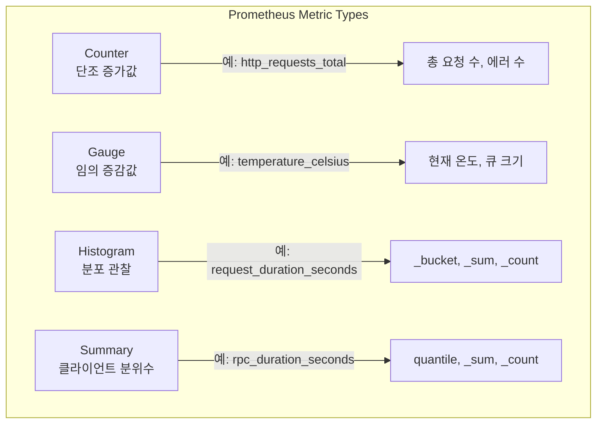
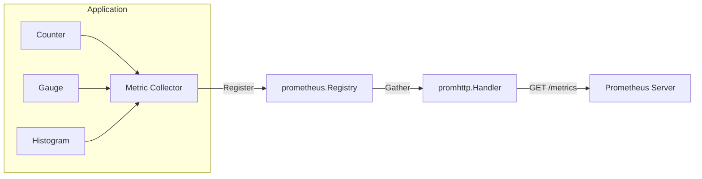
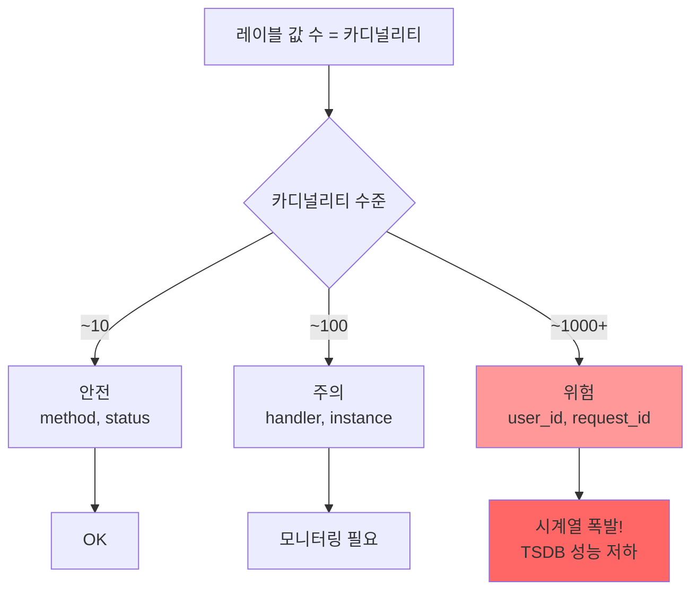
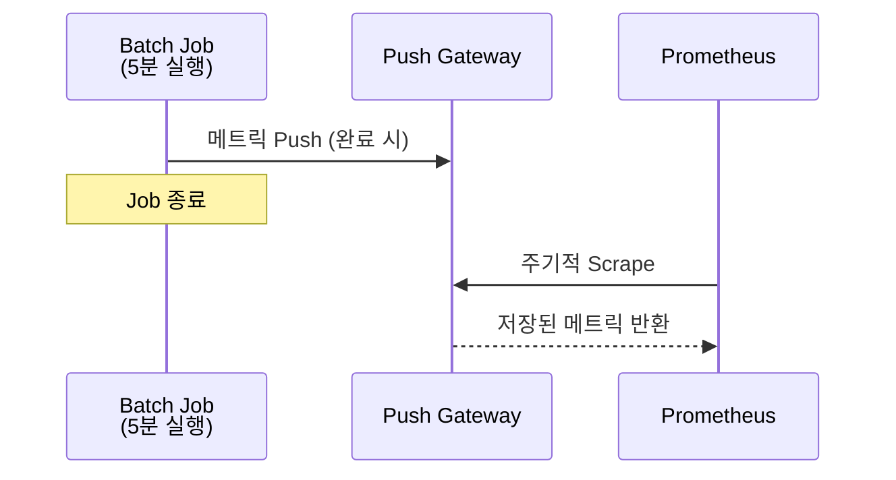

# 애플리케이션 Instrumentation

애플리케이션에 Prometheus 메트릭을 내장하는 Instrumentation 방법을 Go, Java, Python 언어별로 다룬다. Custom Metrics 설계 원칙, 네이밍 컨벤션, 카디널리티 관리, Exemplar 연동, Push Gateway까지 실전 운영 기준으로 설명한다.

## 목차
- [1. 핵심 개념 (What)](#1-핵심-개념-what)
- [2. 왜 알아야 하는가 (Why)](#2-왜-알아야-하는가-why)
- [3. 내부 구현 분석 (How)](#3-내부-구현-분석-how)
- [4. 실전 예제](#4-실전-예제)
- [5. 정리](#5-정리)

---

## 1. 핵심 개념 (What)

### Instrumentation이란?

Instrumentation은 애플리케이션 코드에 **메트릭 수집 지점을 삽입**하는 행위다. Prometheus 클라이언트 라이브러리를 사용해 비즈니스 로직과 시스템 상태를 메트릭으로 노출한다.

### 4가지 메트릭 타입



| 타입 | 특성 | 사용 시나리오 |
|------|------|-------------|
| Counter | 단조 증가, 리셋 시 0 | 요청 수, 에러 수, 처리량 |
| Gauge | 증가/감소 가능 | 온도, 메모리, 활성 연결 수 |
| Histogram | 서버사이드 분위수 계산 | 응답 시간, 요청 크기 |
| Summary | 클라이언트사이드 분위수 | 스트리밍 분위수 (비권장) |

### 클라이언트 라이브러리 생태계

| 언어 | 라이브러리 | 특징 |
|------|-----------|------|
| Go | `prometheus/client_golang` | 공식, 네이티브 지원 |
| Java | Micrometer + `SimpleMeterRegistry` | Spring Boot Actuator 통합 |
| Python | `prometheus_client` | 공식, 멀티프로세스 지원 |
| Node.js | `prom-client` | 커뮤니티, 기본 메트릭 자동 수집 |
| Rust | `prometheus-client` | 공식, zero-cost abstractions |

---

## 2. 왜 알아야 하는가 (Why)

### 인프라 메트릭의 한계

node-exporter, cAdvisor 같은 인프라 메트릭만으로는 **비즈니스 문제**를 진단할 수 없다:

- CPU 사용률은 정상인데 주문 실패율이 높다
- 메모리는 충분한데 특정 API 응답이 느리다
- 네트워크에 문제가 없는데 결제 타임아웃이 발생한다

### Instrumentation이 해결하는 문제

1. **비즈니스 가시성**: 주문 수, 결제 성공률, 장바구니 전환율 등
2. **SLI/SLO 측정**: 응답 시간 p99, 에러율, 가용성 직접 측정
3. **근본 원인 분석**: 어떤 핸들러가 느린지, 어떤 DB 쿼리가 병목인지
4. **용량 계획**: 실제 처리량 기반 스케일링 결정

### RED Method & USE Method

```
RED Method (서비스 관점):
  R - Rate:     초당 요청 수
  E - Errors:   에러 요청 수
  D - Duration: 요청 처리 시간

USE Method (리소스 관점):
  U - Utilization: 리소스 사용률
  S - Saturation:  리소스 포화도
  E - Errors:      리소스 에러 수
```

---

## 3. 내부 구현 분석 (How)

### 3.1 Go - prometheus/client_golang

Go는 Prometheus의 네이티브 언어로, 가장 완전한 클라이언트를 제공한다.

#### 기본 구조



#### 완전한 HTTP 서버 예제

```go
package main

import (
    "math/rand"
    "net/http"
    "time"

    "github.com/prometheus/client_golang/prometheus"
    "github.com/prometheus/client_golang/prometheus/promauto"
    "github.com/prometheus/client_golang/prometheus/promhttp"
)

var (
    // Counter: 총 요청 수
    httpRequestsTotal = promauto.NewCounterVec(
        prometheus.CounterOpts{
            Name: "http_requests_total",
            Help: "Total number of HTTP requests",
        },
        []string{"method", "handler", "status"},
    )

    // Histogram: 응답 시간 분포
    httpRequestDuration = promauto.NewHistogramVec(
        prometheus.HistogramOpts{
            Name:    "http_request_duration_seconds",
            Help:    "HTTP request duration in seconds",
            Buckets: []float64{0.001, 0.005, 0.01, 0.05, 0.1, 0.5, 1, 5},
        },
        []string{"method", "handler"},
    )

    // Gauge: 현재 처리 중인 요청 수
    httpRequestsInFlight = promauto.NewGauge(
        prometheus.GaugeOpts{
            Name: "http_requests_in_flight",
            Help: "Number of HTTP requests currently being processed",
        },
    )

    // 비즈니스 메트릭: 주문 금액 합계
    orderAmountTotal = promauto.NewCounter(
        prometheus.CounterOpts{
            Name: "order_amount_total",
            Help: "Total order amount in KRW",
        },
    )
)

func instrumentHandler(handler string, next http.HandlerFunc) http.HandlerFunc {
    return func(w http.ResponseWriter, r *http.Request) {
        start := time.Now()
        httpRequestsInFlight.Inc()
        defer httpRequestsInFlight.Dec()

        // 상태 코드 캡처를 위한 ResponseWriter 래퍼
        wrapped := &statusRecorder{ResponseWriter: w, status: 200}
        next(wrapped, r)

        duration := time.Since(start).Seconds()
        status := http.StatusText(wrapped.status)

        httpRequestsTotal.WithLabelValues(r.Method, handler, status).Inc()
        httpRequestDuration.WithLabelValues(r.Method, handler).Observe(duration)
    }
}

type statusRecorder struct {
    http.ResponseWriter
    status int
}

func (r *statusRecorder) WriteHeader(status int) {
    r.status = status
    r.ResponseWriter.WriteHeader(status)
}

func handleOrder(w http.ResponseWriter, r *http.Request) {
    // 비즈니스 로직 시뮬레이션
    time.Sleep(time.Duration(rand.Intn(100)) * time.Millisecond)
    amount := float64(rand.Intn(100000))
    orderAmountTotal.Add(amount)
    w.WriteHeader(http.StatusOK)
    w.Write([]byte("order created"))
}

func main() {
    http.HandleFunc("/api/orders", instrumentHandler("/api/orders", handleOrder))
    http.Handle("/metrics", promhttp.Handler())
    http.ListenAndServe(":8080", nil)
}
```

### 3.2 Java - Micrometer + Spring Boot Actuator

Spring Boot 환경에서는 Micrometer가 사실상 표준이다.

#### Spring Boot 설정

```xml
<!-- pom.xml -->
<dependencies>
    <dependency>
        <groupId>org.springframework.boot</groupId>
        <artifactId>spring-boot-starter-actuator</artifactId>
    </dependency>
    <dependency>
        <groupId>io.micrometer</groupId>
        <artifactId>micrometer-registry-prometheus</artifactId>
    </dependency>
</dependencies>
```

```yaml
# application.yml
management:
  endpoints:
    web:
      exposure:
        include: prometheus,health,info
  metrics:
    export:
      prometheus:
        enabled: true
    tags:
      application: ${spring.application.name}
      environment: ${ENVIRONMENT:local}
```

#### Custom Metrics 예제

```java
import io.micrometer.core.annotation.Timed;
import io.micrometer.core.instrument.*;
import org.springframework.stereotype.Service;

@Service
public class OrderService {

    private final Counter orderCounter;
    private final Timer orderProcessingTimer;
    private final DistributionSummary orderAmountSummary;
    private final AtomicInteger activeOrders;

    public OrderService(MeterRegistry registry) {
        // Counter: 주문 수
        this.orderCounter = Counter.builder("orders_total")
            .description("Total number of orders")
            .tag("type", "create")
            .register(registry);

        // Timer: 주문 처리 시간 (Histogram 기반)
        this.orderProcessingTimer = Timer.builder("order_processing_duration_seconds")
            .description("Order processing duration")
            .publishPercentileHistogram()
            .sla(Duration.ofMillis(100), Duration.ofMillis(500), Duration.ofSeconds(1))
            .register(registry);

        // DistributionSummary: 주문 금액 분포
        this.orderAmountSummary = DistributionSummary.builder("order_amount")
            .description("Order amount distribution")
            .baseUnit("krw")
            .publishPercentileHistogram()
            .register(registry);

        // Gauge: 활성 주문 수
        this.activeOrders = registry.gauge("orders_active",
            new AtomicInteger(0));
    }

    @Timed(value = "order_create_seconds", description = "Time to create order")
    public Order createOrder(OrderRequest request) {
        activeOrders.incrementAndGet();
        try {
            Order order = processOrder(request);
            orderCounter.increment();
            orderAmountSummary.record(request.getAmount());
            return order;
        } finally {
            activeOrders.decrementAndGet();
        }
    }

    public Order processOrder(OrderRequest request) {
        return orderProcessingTimer.record(() -> {
            // 비즈니스 로직
            return doProcess(request);
        });
    }
}
```

#### Custom MeterBinder (재사용 가능한 메트릭 모듈)

```java
import io.micrometer.core.instrument.Gauge;
import io.micrometer.core.instrument.MeterRegistry;
import io.micrometer.core.instrument.binder.MeterBinder;

public class ConnectionPoolMetrics implements MeterBinder {

    private final HikariDataSource dataSource;

    public ConnectionPoolMetrics(HikariDataSource dataSource) {
        this.dataSource = dataSource;
    }

    @Override
    public void bindTo(MeterRegistry registry) {
        Gauge.builder("db_pool_active_connections",
                dataSource, ds -> ds.getHikariPoolMXBean().getActiveConnections())
            .description("Active database connections")
            .register(registry);

        Gauge.builder("db_pool_idle_connections",
                dataSource, ds -> ds.getHikariPoolMXBean().getIdleConnections())
            .description("Idle database connections")
            .register(registry);

        Gauge.builder("db_pool_pending_threads",
                dataSource, ds -> ds.getHikariPoolMXBean().getThreadsAwaitingConnection())
            .description("Threads waiting for connection")
            .register(registry);
    }
}
```

### 3.3 Python - prometheus_client

```python
# app.py
from prometheus_client import (
    Counter, Gauge, Histogram, Summary,
    generate_latest, CONTENT_TYPE_LATEST,
    CollectorRegistry, multiprocess
)
from flask import Flask, request, Response
import time
import functools

app = Flask(__name__)

# Counter: 총 요청 수
REQUEST_COUNT = Counter(
    'http_requests_total',
    'Total HTTP request count',
    ['method', 'endpoint', 'status']
)

# Histogram: 응답 시간
REQUEST_LATENCY = Histogram(
    'http_request_duration_seconds',
    'HTTP request duration in seconds',
    ['method', 'endpoint'],
    buckets=[0.005, 0.01, 0.025, 0.05, 0.1, 0.25, 0.5, 1.0, 2.5, 5.0]
)

# Gauge: 활성 요청 수
REQUESTS_IN_PROGRESS = Gauge(
    'http_requests_in_progress',
    'Number of requests in progress',
    ['method', 'endpoint']
)

# 비즈니스 메트릭
ITEMS_PROCESSED = Counter(
    'items_processed_total',
    'Total items processed',
    ['item_type', 'status']
)

QUEUE_SIZE = Gauge(
    'processing_queue_size',
    'Current size of processing queue'
)


def track_metrics(endpoint):
    """데코레이터: 엔드포인트 메트릭 자동 수집"""
    def decorator(func):
        @functools.wraps(func)
        def wrapper(*args, **kwargs):
            method = request.method
            REQUESTS_IN_PROGRESS.labels(method=method, endpoint=endpoint).inc()
            start_time = time.time()

            try:
                response = func(*args, **kwargs)
                status = response[1] if isinstance(response, tuple) else 200
                REQUEST_COUNT.labels(
                    method=method, endpoint=endpoint, status=status
                ).inc()
                return response
            except Exception as e:
                REQUEST_COUNT.labels(
                    method=method, endpoint=endpoint, status=500
                ).inc()
                raise
            finally:
                duration = time.time() - start_time
                REQUEST_LATENCY.labels(
                    method=method, endpoint=endpoint
                ).observe(duration)
                REQUESTS_IN_PROGRESS.labels(
                    method=method, endpoint=endpoint
                ).dec()
        return wrapper
    return decorator


@app.route('/api/items', methods=['POST'])
@track_metrics('/api/items')
def process_item():
    item_type = request.json.get('type', 'unknown')
    try:
        # 비즈니스 로직
        result = do_process(request.json)
        ITEMS_PROCESSED.labels(item_type=item_type, status='success').inc()
        return {'status': 'ok'}, 200
    except Exception as e:
        ITEMS_PROCESSED.labels(item_type=item_type, status='error').inc()
        return {'error': str(e)}, 500


@app.route('/metrics')
def metrics():
    return Response(
        generate_latest(),
        mimetype=CONTENT_TYPE_LATEST
    )


if __name__ == '__main__':
    app.run(host='0.0.0.0', port=8080)
```

#### 멀티프로세스 모드 (gunicorn)

```python
# gunicorn_config.py
import os
from prometheus_client import multiprocess

# 멀티프로세스 환경에서 메트릭 공유 디렉토리
os.environ['PROMETHEUS_MULTIPROC_DIR'] = '/tmp/prometheus_multiproc'

def child_exit(server, worker):
    multiprocess.mark_process_dead(worker.pid)
```

```python
# metrics_endpoint.py (멀티프로세스용)
from prometheus_client import CollectorRegistry, multiprocess, generate_latest

def metrics_app(environ, start_response):
    registry = CollectorRegistry()
    multiprocess.MultiProcessCollector(registry)
    data = generate_latest(registry)
    start_response('200 OK', [('Content-Type', 'text/plain')])
    return [data]
```

### 3.4 Custom Metrics 설계 원칙

#### 네이밍 컨벤션

```
<namespace>_<subsystem>_<name>_<unit>

예시:
  myapp_http_requests_total          (Counter - _total 접미사)
  myapp_http_request_duration_seconds (Histogram - 단위 접미사)
  myapp_db_connections_active         (Gauge - 현재 상태)
  myapp_queue_messages_total          (Counter)
```

| 규칙 | 예시 | 설명 |
|------|------|------|
| snake_case 사용 | `http_request_duration` | CamelCase 금지 |
| 단위를 접미사로 | `_seconds`, `_bytes`, `_total` | 기본 단위 사용 (초, 바이트) |
| Counter는 `_total` | `requests_total` | 단조 증가 메트릭 |
| 기본 단위 사용 | 초(seconds), 바이트(bytes) | 밀리초, KB 사용 금지 |

#### 카디널리티 관리



**카디널리티 폭발 방지 원칙:**

1. user_id, session_id, request_id 등 고유 식별자를 레이블로 사용하지 않는다
2. 무한히 증가하는 값을 레이블로 사용하지 않는다
3. 레이블 조합의 총 시계열 수를 예측한다: `시계열 = 메트릭 x label1_values x label2_values x ...`
4. 경험 법칙: 단일 메트릭의 시계열이 1,000을 넘으면 재설계한다

### 3.5 Exemplar 연동 (Trace-Metric Bridge)

Exemplar는 메트릭 샘플에 Trace ID를 첨부하여 메트릭에서 트레이스로의 직접 네비게이션을 가능하게 한다.


#### Go Exemplar 예제

```go
import (
    "github.com/prometheus/client_golang/prometheus"
    "go.opentelemetry.io/otel/trace"
)

func handleRequest(w http.ResponseWriter, r *http.Request) {
    start := time.Now()
    span := trace.SpanFromContext(r.Context())

    // 비즈니스 로직 처리
    processRequest(r)

    duration := time.Since(start).Seconds()

    // Exemplar로 Trace ID 첨부
    httpRequestDuration.WithLabelValues(r.Method, "/api/orders").(prometheus.ExemplarObserver).
        ObserveWithExemplar(duration, prometheus.Labels{
            "traceID": span.SpanContext().TraceID().String(),
        })
}
```

### 3.6 Push Gateway

Pull 기반 Prometheus가 스크랩할 수 없는 배치 작업, 단기 실행 잡에 사용한다.



#### Push Gateway 사용 예제 (Python)

```python
from prometheus_client import CollectorRegistry, Counter, Gauge, push_to_gateway
import time

# 별도 레지스트리 사용 (기본 메트릭 제외)
registry = CollectorRegistry()

BATCH_DURATION = Gauge(
    'batch_job_duration_seconds',
    'Duration of batch job',
    registry=registry
)

RECORDS_PROCESSED = Counter(
    'batch_records_processed_total',
    'Records processed by batch job',
    ['status'],
    registry=registry
)

BATCH_LAST_SUCCESS = Gauge(
    'batch_job_last_success_timestamp',
    'Timestamp of last successful batch run',
    registry=registry
)

def run_batch():
    start = time.time()
    try:
        processed = 0
        for record in fetch_records():
            try:
                process(record)
                RECORDS_PROCESSED.labels(status='success').inc()
                processed += 1
            except Exception:
                RECORDS_PROCESSED.labels(status='error').inc()

        BATCH_LAST_SUCCESS.set_to_current_time()
    finally:
        BATCH_DURATION.set(time.time() - start)
        # Push Gateway에 전송
        push_to_gateway(
            'pushgateway.internal:9091',
            job='nightly-etl',
            registry=registry
        )

if __name__ == '__main__':
    run_batch()
```

**Push Gateway 주의사항:**
- 일반적인 장기 실행 서비스에는 사용하지 않는다
- `push_to_gateway`(전체 교체) vs `pushadd_to_gateway`(추가) 구분
- Push Gateway가 단일 장애점(SPOF)이 된다
- 타임스탬프가 Push 시점이 아닌 Scrape 시점으로 기록된다

---

## 4. 실전 예제

### 4.1 SLI/SLO 메트릭 설계

```go
// SLI: 가용성 (성공 요청 비율)
var httpRequestsTotal = promauto.NewCounterVec(
    prometheus.CounterOpts{
        Name: "http_requests_total",
        Help: "Total HTTP requests",
    },
    []string{"method", "handler", "code"},
)

// SLI: 지연시간 (요청 처리 시간)
var httpRequestDuration = promauto.NewHistogramVec(
    prometheus.HistogramOpts{
        Name:    "http_request_duration_seconds",
        Help:    "HTTP request duration",
        // SLO 임계값에 맞춘 버킷 설계
        Buckets: []float64{0.01, 0.05, 0.1, 0.25, 0.5, 1.0, 2.5},
    },
    []string{"method", "handler"},
)
```

SLO 쿼리 예시:

```promql
# 가용성 SLO: 99.9% (30일 윈도우)
1 - (
  sum(rate(http_requests_total{code=~"5.."}[30d]))
  /
  sum(rate(http_requests_total[30d]))
)

# 지연시간 SLO: p99 < 500ms
histogram_quantile(0.99, sum(rate(http_request_duration_seconds_bucket[5m])) by (le))
```

### 4.2 미들웨어 패턴 (Go)

```go
// middleware.go - 재사용 가능한 메트릭 미들웨어
func PrometheusMiddleware(next http.Handler) http.Handler {
    return http.HandlerFunc(func(w http.ResponseWriter, r *http.Request) {
        if r.URL.Path == "/metrics" || r.URL.Path == "/health" {
            next.ServeHTTP(w, r)
            return
        }

        timer := prometheus.NewTimer(
            httpRequestDuration.WithLabelValues(r.Method, r.URL.Path),
        )
        defer timer.ObserveDuration()

        wrapped := &statusRecorder{ResponseWriter: w, status: 200}
        next.ServeHTTP(wrapped, r)

        httpRequestsTotal.WithLabelValues(
            r.Method, r.URL.Path, fmt.Sprintf("%d", wrapped.status),
        ).Inc()
    })
}
```

---

## 5. 정리

### 언어별 클라이언트 라이브러리 비교

| 항목 | Go | Java (Micrometer) | Python |
|------|----|--------------------|--------|
| 패키지 | `client_golang` | `micrometer-registry-prometheus` | `prometheus_client` |
| 메트릭 노출 | `promhttp.Handler()` | Spring Actuator 자동 | `generate_latest()` |
| 자동 등록 | `promauto` 패키지 | `@Timed`, `@Counted` | 기본 레지스트리 자동 |
| Exemplar 지원 | 네이티브 | Micrometer 1.10+ | 제한적 |
| 멀티프로세스 | N/A (goroutine) | N/A (스레드) | `multiprocess` 모듈 |
| 기본 메트릭 | Go runtime | JVM, Tomcat, HikariCP | Python GC, Platform |

### Custom Metrics 설계 체크리스트

| 항목 | 확인 |
|------|------|
| snake_case 네이밍 규칙 준수 | |
| Counter에 `_total` 접미사 | |
| 기본 단위(초, 바이트) 사용 | |
| 레이블 카디널리티 < 1000 | |
| 고유 식별자(user_id 등) 레이블 미사용 | |
| Histogram 버킷이 SLO 임계값 포함 | |
| 비즈니스 메트릭(RED) 포함 | |

### 메트릭 타입 선택 가이드

| 측정 대상 | 메트릭 타입 | 예시 |
|----------|------------|------|
| 이벤트 발생 횟수 | Counter | `requests_total`, `errors_total` |
| 현재 상태값 | Gauge | `connections_active`, `queue_size` |
| 시간/크기 분포 | Histogram | `request_duration_seconds` |
| 스트리밍 분위수 | Summary | 특수한 경우에만 사용 |

---

*참고: prometheus/client_golang v1.20+, Micrometer 1.13+, prometheus_client 0.21+ 기준*
