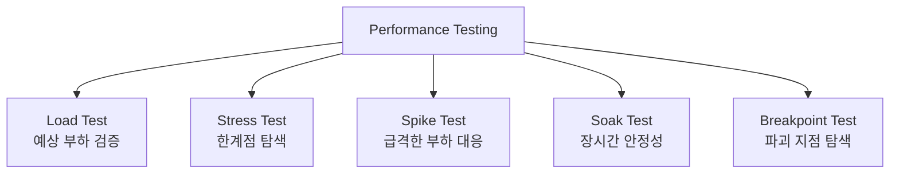
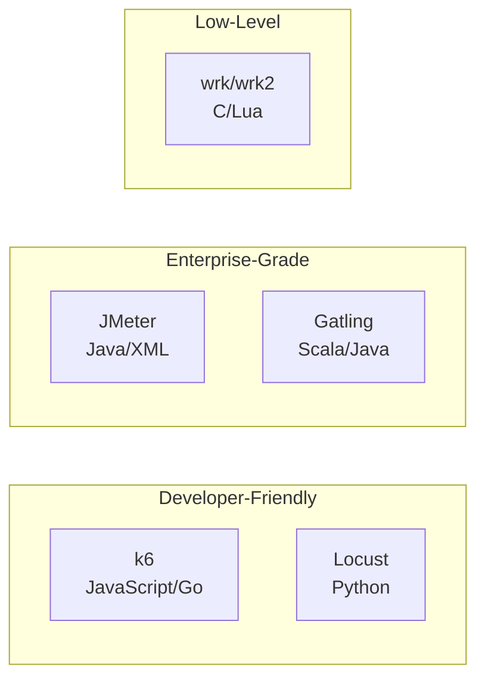
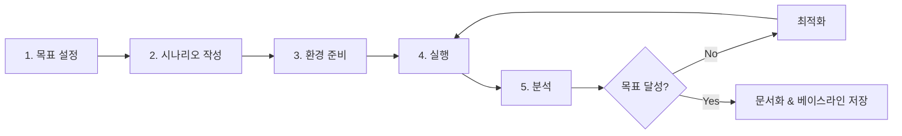

# Stress Test 도구 & 방법론

애플리케이션의 성능 한계와 병목 지점을 파악하기 위한 부하 테스트 도구 5종(k6, JMeter, wrk, Locust, Gatling)을 비교하고, 테스트 설계 방법론과 핵심 성능 지표를 체계적으로 다룬다.

## 목차
- [1. 핵심 개념 (What)](#1-핵심-개념-what)
- [2. 왜 알아야 하는가 (Why)](#2-왜-알아야-하는가-why)
- [3. 내부 구현 분석 (How)](#3-내부-구현-분석-how)
- [4. 실전 예제](#4-실전-예제)
- [5. 정리](#5-정리)

---

## 1. 핵심 개념 (What)

### Stress Test란?

Stress Test(부하 테스트)는 시스템에 **의도적으로 부하를 가하여** 성능 특성, 한계점, 병목 구간을 파악하는 테스트 기법이다. 넓은 의미의 Performance Testing 안에 여러 하위 유형이 포함된다.

### 부하 테스트 유형



| 유형 | 부하 패턴 | 목적 | 기간 |
|------|----------|------|------|
| **Load Test** | 예상 트래픽 수준 | 정상 운영 검증 | 5-15분 |
| **Stress Test** | 예상의 150-200% | 한계점 확인 | 10-30분 |
| **Spike Test** | 급격한 증가/감소 | 탄력성 검증 | 5-10분 |
| **Soak Test** | 일정 부하 유지 | 메모리 누수, 장기 안정성 | 2-24시간 |
| **Breakpoint Test** | 점진적 증가 | 파괴 지점 탐색 | 무제한 |

### 핵심 성능 지표 (4 Golden Signals)

```
Throughput   : 초당 처리량 (RPS - Requests Per Second)
Latency      : 응답 시간 (p50, p90, p95, p99)
Error Rate   : 에러 비율 (%)
Saturation   : 리소스 포화도 (CPU, Memory, Connection Pool)
```

---

## 2. 왜 알아야 하는가 (Why)

### 프로덕션 장애의 70%는 부하 관련

- "개발 환경에서는 잘 되는데 프로덕션에서 느려요"
- "블랙프라이데이에 서버가 다운됐어요"
- "배포 후 점점 응답이 느려져요 (메모리 누수)"

### 부하 테스트가 해결하는 문제

1. **용량 계획**: 서버 몇 대가 필요한가?
2. **병목 식별**: DB? 네트워크? 애플리케이션 코드?
3. **SLA 검증**: "p99 < 200ms" 약속을 지킬 수 있는가?
4. **회귀 감지**: 새 배포가 성능을 저하시켰는가?
5. **장애 대응**: 트래픽 급증 시 어떤 컴포넌트가 먼저 무너지는가?

---

## 3. 내부 구현 분석 (How)

### 3.1 5대 부하 테스트 도구 비교



#### 상세 비교표

| 항목 | k6 | Locust | JMeter | Gatling | wrk |
|------|-----|--------|--------|---------|-----|
| 언어 | JavaScript (ES6) | Python | Java (XML/GUI) | Scala/Java | C + Lua |
| 아키텍처 | Go 엔진 + JS 런타임 | Python 코루틴 | Java 스레드 | Akka Actor | C 멀티스레드 |
| 리소스 효율 | 매우 높음 | 높음 | 낮음 | 높음 | 최고 |
| 프로토콜 | HTTP/1.1, HTTP/2, WebSocket, gRPC | HTTP, 커스텀 | HTTP, FTP, JDBC, SOAP 등 | HTTP, WebSocket, JMS | HTTP/1.1 |
| CI/CD 통합 | 우수 (CLI 네이티브) | 좋음 | 보통 (XML 기반) | 좋음 (sbt/maven) | 우수 (단순) |
| Prometheus 연동 | 네이티브 (remote write) | Exporter 필요 | Exporter 플러그인 | InfluxDB/Graphite | 없음 |
| 분산 실행 | k6-operator (K8s) | 내장 (master-worker) | JMeter Remote | Gatling Enterprise | 없음 |
| GUI | k6 Studio | Web UI (내장) | 데스크톱 GUI | Gatling Enterprise | 없음 |
| 학습 곡선 | 낮음 | 낮음 | 중간 | 높음 | 매우 낮음 |
| 적합 시나리오 | CI/CD 통합, 개발자 주도 | 복잡한 시나리오, 빠른 프로토타이핑 | 레거시/엔터프라이즈 | 대규모 시뮬레이션 | 단순 벤치마크 |

### 3.2 부하 패턴 유형

#### Ramp-up (점진적 증가)

```
VUs
100 |          ____________
    |         /            \
 50 |        /              \
    |       /                \
  0 |______/                  \______
    0    1min   3min   5min   7min
```

```javascript
// k6 ramp-up 패턴
export const options = {
  stages: [
    { duration: '1m', target: 50 },   // 1분간 50 VU까지 증가
    { duration: '3m', target: 100 },  // 3분간 100 VU 유지
    { duration: '1m', target: 0 },    // 1분간 0으로 감소
  ],
};
```

#### Spike (급격한 증가)

```
VUs
500 |       ___
    |      / | \
    |     /  |  \
100 |____/   |   \____
    0   30s  1m  1m30s
```

```javascript
// k6 spike 패턴
export const options = {
  stages: [
    { duration: '30s', target: 100 },  // 워밍업
    { duration: '10s', target: 500 },  // 스파이크!
    { duration: '30s', target: 500 },  // 스파이크 유지
    { duration: '10s', target: 100 },  // 회복
    { duration: '1m', target: 100 },   // 안정화 확인
  ],
};
```

#### Soak (장시간 지속)

```
VUs
100 |   _________________________________
    |  /                                 \
 50 | /                                   \
    |/                                     \
  0 |______________________________________
    0        2h          6h          8h
```

#### Breakpoint (파괴점 탐색)

```
VUs
??? |                              X (시스템 붕괴)
    |                           /
    |                        /
    |                     /
    |                  /
    |               /
    |            /
    |         /
    |      /
  0 |_____/
    0    5m   10m   15m   20m   25m
```

```javascript
// k6 breakpoint 패턴
export const options = {
  executor: 'ramping-arrival-rate',
  stages: [
    { duration: '2m', target: 100 },   // 100 RPS
    { duration: '2m', target: 200 },   // 200 RPS
    { duration: '2m', target: 500 },   // 500 RPS
    { duration: '2m', target: 1000 },  // 1000 RPS
    { duration: '2m', target: 2000 },  // 2000 RPS - 어디서 무너지나?
  ],
  preAllocatedVUs: 500,
  maxVUs: 2000,
};
```

### 3.3 테스트 설계 방법론



#### Step 1: 목표 설정

```yaml
# 테스트 목표 정의서
performance_requirements:
  throughput:
    target_rps: 1000
    description: "초당 1000 요청 처리"
  latency:
    p50: 50ms
    p90: 100ms
    p95: 200ms
    p99: 500ms
  error_rate:
    max: 0.1%
  availability:
    target: 99.9%

test_scenario:
  concurrent_users: 500
  test_duration: 10m
  ramp_up: 2m
```

#### Step 2: 시나리오 작성

실제 사용자 행동 패턴을 모방한다:

```
사용자 시나리오 예시:
1. 로그인 (POST /api/auth/login)     - 비중 10%
2. 상품 목록 (GET /api/products)      - 비중 40%
3. 상품 상세 (GET /api/products/:id)  - 비중 30%
4. 장바구니 추가 (POST /api/cart)     - 비중 15%
5. 주문 생성 (POST /api/orders)       - 비중 5%
```

#### Step 3: 환경 준비

- 프로덕션과 동일한(또는 비례축소한) 환경
- 테스트 데이터 준비 (seed data)
- 모니터링 시스템 활성화
- 외부 의존성 Mock 또는 격리

#### Step 4-5: 실행 & 분석

핵심 분석 관점:

| 관점 | 확인 사항 |
|------|----------|
| Throughput | RPS가 목표를 달성하는가? |
| Latency | p99가 SLA 이내인가? |
| Error Rate | 에러가 급증하는 지점은? |
| Resource | CPU/Memory 포화 시점은? |
| Bottleneck | DB? Network? App? |

---

## 4. 실전 예제

### 4.1 k6 실전 스크립트

```javascript
// stress-test.js - 실전 부하 테스트 스크립트
import http from 'k6/http';
import { check, group, sleep } from 'k6';
import { Counter, Rate, Trend } from 'k6/metrics';

// 커스텀 메트릭 정의
const orderSuccessRate = new Rate('order_success_rate');
const orderDuration = new Trend('order_duration', true);
const errorCount = new Counter('error_count');

// 테스트 설정
export const options = {
  scenarios: {
    // 시나리오 1: 일반 브라우징 (70%)
    browsing: {
      executor: 'ramping-vus',
      startVUs: 0,
      stages: [
        { duration: '1m', target: 50 },
        { duration: '3m', target: 100 },
        { duration: '1m', target: 0 },
      ],
      exec: 'browsing',
    },
    // 시나리오 2: 주문 플로우 (30%)
    ordering: {
      executor: 'ramping-vus',
      startVUs: 0,
      stages: [
        { duration: '1m', target: 20 },
        { duration: '3m', target: 50 },
        { duration: '1m', target: 0 },
      ],
      exec: 'ordering',
    },
  },
  thresholds: {
    http_req_duration: ['p(95)<500', 'p(99)<1000'],  // ms
    http_req_failed: ['rate<0.01'],                    // 1% 미만
    order_success_rate: ['rate>0.95'],                 // 95% 이상
  },
};

const BASE_URL = __ENV.BASE_URL || 'http://localhost:8080';

// 시나리오 1: 브라우징
export function browsing() {
  group('Browse Products', () => {
    // 상품 목록 조회
    const listRes = http.get(`${BASE_URL}/api/products`, {
      tags: { name: 'GET /api/products' },
    });
    check(listRes, {
      'product list status 200': (r) => r.status === 200,
      'product list has items': (r) => JSON.parse(r.body).length > 0,
    });

    sleep(1);

    // 상품 상세 조회
    const products = JSON.parse(listRes.body);
    if (products.length > 0) {
      const productId = products[Math.floor(Math.random() * products.length)].id;
      const detailRes = http.get(`${BASE_URL}/api/products/${productId}`, {
        tags: { name: 'GET /api/products/:id' },
      });
      check(detailRes, {
        'product detail status 200': (r) => r.status === 200,
      });
    }
  });

  sleep(Math.random() * 3 + 1); // 1-4초 대기 (사용자 think time)
}

// 시나리오 2: 주문 플로우
export function ordering() {
  group('Order Flow', () => {
    // 1. 로그인
    const loginRes = http.post(`${BASE_URL}/api/auth/login`, JSON.stringify({
      username: `user${Math.floor(Math.random() * 1000)}`,
      password: 'testpass',
    }), {
      headers: { 'Content-Type': 'application/json' },
      tags: { name: 'POST /api/auth/login' },
    });

    if (loginRes.status !== 200) {
      errorCount.add(1);
      return;
    }

    const token = JSON.parse(loginRes.body).token;
    const authHeaders = {
      'Content-Type': 'application/json',
      'Authorization': `Bearer ${token}`,
    };

    sleep(1);

    // 2. 장바구니 추가
    const cartRes = http.post(`${BASE_URL}/api/cart`, JSON.stringify({
      product_id: Math.floor(Math.random() * 100) + 1,
      quantity: Math.floor(Math.random() * 3) + 1,
    }), {
      headers: authHeaders,
      tags: { name: 'POST /api/cart' },
    });

    sleep(2);

    // 3. 주문 생성
    const orderStart = Date.now();
    const orderRes = http.post(`${BASE_URL}/api/orders`, JSON.stringify({
      payment_method: 'card',
    }), {
      headers: authHeaders,
      tags: { name: 'POST /api/orders' },
    });

    const orderTime = Date.now() - orderStart;
    orderDuration.add(orderTime);

    const success = check(orderRes, {
      'order created': (r) => r.status === 201,
    });

    orderSuccessRate.add(success);
    if (!success) {
      errorCount.add(1);
    }
  });

  sleep(Math.random() * 5 + 2);
}

// 테스트 결과 요약
export function handleSummary(data) {
  return {
    'stdout': textSummary(data, { indent: ' ', enableColors: true }),
    'results/summary.json': JSON.stringify(data, null, 2),
  };
}

import { textSummary } from 'https://jslib.k6.io/k6-summary/0.0.3/index.js';
```

### 4.2 Locust 실전 스크립트

```python
# locustfile.py - Python 기반 부하 테스트
from locust import HttpUser, task, between, events
import json
import random
import logging

logger = logging.getLogger(__name__)


class EcommerceUser(HttpUser):
    """이커머스 사용자 시뮬레이션"""
    wait_time = between(1, 5)  # 1-5초 대기

    def on_start(self):
        """사용자 세션 시작 시 로그인"""
        response = self.client.post("/api/auth/login", json={
            "username": f"user{random.randint(1, 1000)}",
            "password": "testpass"
        })
        if response.status_code == 200:
            self.token = response.json()["token"]
            self.headers = {
                "Authorization": f"Bearer {self.token}",
                "Content-Type": "application/json"
            }
        else:
            self.token = None
            self.headers = {"Content-Type": "application/json"}

    @task(40)  # 가중치 40 - 가장 빈번한 요청
    def browse_products(self):
        """상품 목록 조회"""
        with self.client.get("/api/products",
                           name="/api/products",
                           catch_response=True) as response:
            if response.status_code == 200:
                products = response.json()
                if len(products) == 0:
                    response.failure("Empty product list")
                else:
                    response.success()
            else:
                response.failure(f"Status {response.status_code}")

    @task(30)  # 가중치 30
    def view_product_detail(self):
        """상품 상세 조회"""
        product_id = random.randint(1, 100)
        self.client.get(f"/api/products/{product_id}",
                       name="/api/products/:id")

    @task(15)  # 가중치 15
    def add_to_cart(self):
        """장바구니 추가"""
        if not self.token:
            return
        self.client.post("/api/cart",
                        json={
                            "product_id": random.randint(1, 100),
                            "quantity": random.randint(1, 3)
                        },
                        headers=self.headers,
                        name="/api/cart")

    @task(5)  # 가중치 5 - 가장 드문 요청
    def create_order(self):
        """주문 생성"""
        if not self.token:
            return
        with self.client.post("/api/orders",
                            json={"payment_method": "card"},
                            headers=self.headers,
                            name="/api/orders",
                            catch_response=True) as response:
            if response.status_code == 201:
                response.success()
            elif response.status_code == 200:
                response.success()
            else:
                response.failure(f"Order failed: {response.status_code}")

    @task(10)
    def search_products(self):
        """상품 검색"""
        keywords = ["phone", "laptop", "headphone", "keyboard", "mouse"]
        keyword = random.choice(keywords)
        self.client.get(f"/api/products/search?q={keyword}",
                       name="/api/products/search")


class AdminUser(HttpUser):
    """관리자 시뮬레이션 (별도 사용자 클래스)"""
    wait_time = between(5, 10)
    weight = 1  # 전체 사용자 중 비율

    @task
    def check_dashboard(self):
        self.client.get("/api/admin/dashboard",
                       name="/api/admin/dashboard")

    @task
    def check_orders(self):
        self.client.get("/api/admin/orders?status=pending",
                       name="/api/admin/orders")
```

Locust 실행:

```bash
# 웹 UI 모드
locust -f locustfile.py --host=http://localhost:8080

# Headless 모드 (CI/CD)
locust -f locustfile.py \
  --host=http://localhost:8080 \
  --headless \
  --users 100 \
  --spawn-rate 10 \
  --run-time 5m \
  --csv=results/load_test \
  --html=results/report.html
```

### 4.3 wrk 벤치마크 스크립트

```bash
# 기본 벤치마크
wrk -t12 -c400 -d30s http://localhost:8080/api/products

# Lua 스크립트로 POST 요청
wrk -t4 -c100 -d60s -s post.lua http://localhost:8080/api/orders
```

```lua
-- post.lua
wrk.method = "POST"
wrk.headers["Content-Type"] = "application/json"

counter = 0

request = function()
    counter = counter + 1
    local body = string.format(
        '{"product_id": %d, "quantity": %d}',
        math.random(1, 100),
        math.random(1, 3)
    )
    return wrk.format(nil, nil, nil, body)
end

done = function(summary, latency, requests)
    io.write("------------------------------\n")
    io.write(string.format("Total requests: %d\n", summary.requests))
    io.write(string.format("Total errors:   %d\n", summary.errors.status))
    io.write(string.format("RPS:           %.2f\n", summary.requests / summary.duration * 1e6))
    io.write(string.format("Avg latency:   %.2f ms\n", latency.mean / 1000))
    io.write(string.format("p99 latency:   %.2f ms\n", latency:percentile(99) / 1000))
end
```

---

## 5. 정리

### 도구 선택 가이드

| 요구사항 | 추천 도구 | 이유 |
|----------|-----------|------|
| CI/CD 파이프라인 통합 | k6 | CLI 네이티브, threshold 내장 |
| 빠른 프로토타이핑 | Locust | Python으로 즉시 작성 |
| 복잡한 프로토콜 (SOAP, JDBC) | JMeter | 다양한 프로토콜 지원 |
| 대규모 시뮬레이션 | Gatling | Actor 기반 고효율 |
| 단순 HTTP 벤치마크 | wrk | 최소 오버헤드 |
| Prometheus 연동 | k6 | 네이티브 remote write |

### 부하 패턴 선택 기준

| 검증 목표 | 부하 패턴 | 기간 |
|----------|----------|------|
| 일반 성능 검증 | Load (Ramp-up) | 5-15분 |
| 시스템 한계 확인 | Stress | 10-30분 |
| 이벤트/프로모션 대비 | Spike | 5-10분 |
| 메모리 누수 탐지 | Soak | 2-24시간 |
| 스케일링 기준 수립 | Breakpoint | 가변 |

### 테스트 설계 체크리스트

| 단계 | 확인 항목 |
|------|----------|
| 목표 | RPS, 지연시간, 에러율 수치 목표 정의 |
| 시나리오 | 실제 사용자 행동 패턴 반영 |
| 데이터 | 프로덕션 규모의 테스트 데이터 준비 |
| 환경 | 프로덕션 동등 환경 구성 |
| 모니터링 | 메트릭 수집 체계 활성화 |
| 기준선 | 이전 테스트 결과와 비교 |
| 보고서 | 결과 분석 및 개선 사항 문서화 |

---

*참고: k6 v0.54+, Locust 2.31+, JMeter 5.6+, Gatling 3.11+, wrk 4.2+ 기준*
