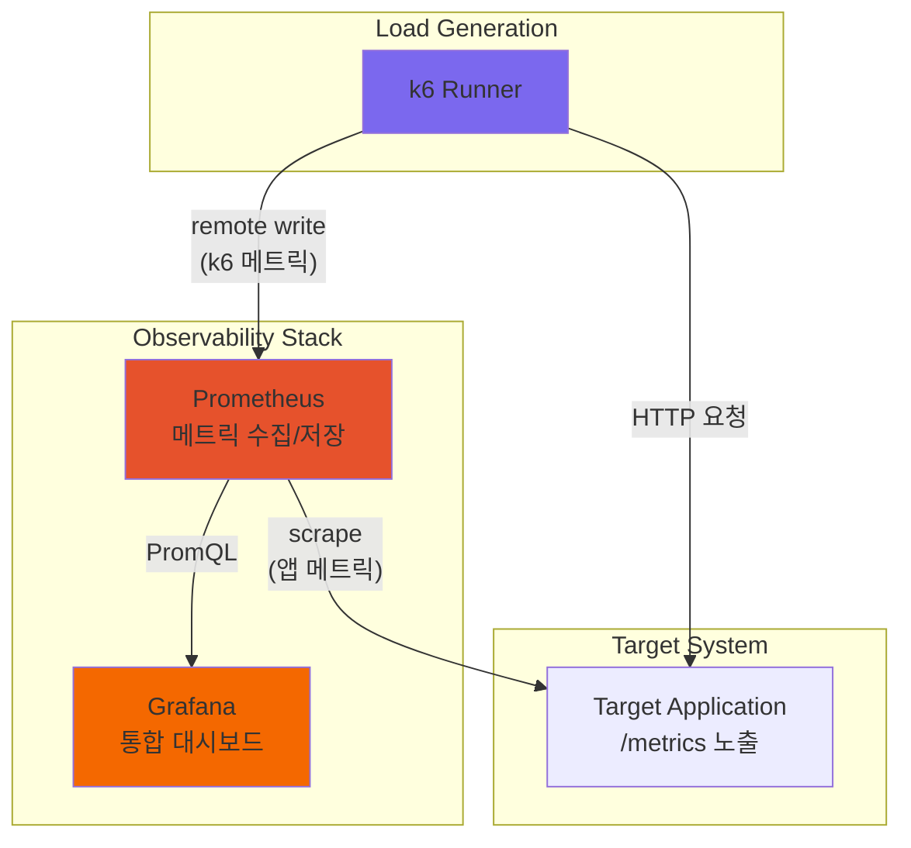
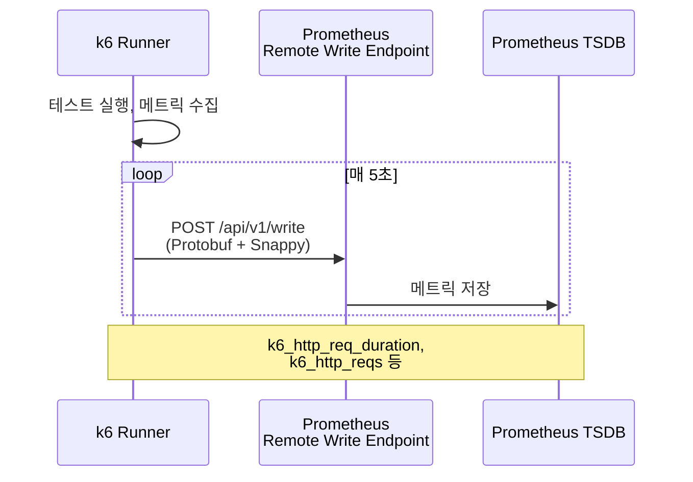
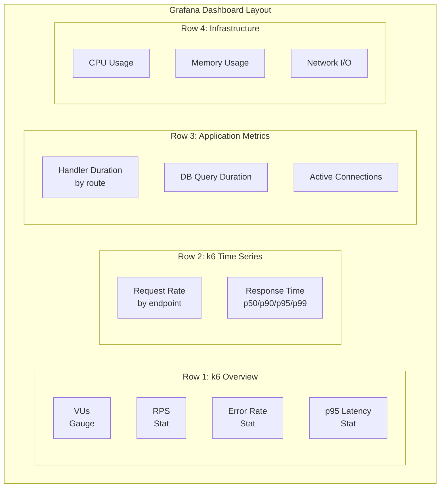

# Stress Test + Observability 통합

부하 테스트와 Observability 스택을 통합하여 테스트 중 실시간으로 시스템 상태를 관찰하는 아키텍처를 구축한다. k6-Prometheus Remote Write 연동, 통합 Grafana 대시보드, Docker Compose 기반 전체 스택 구성을 실전 코드로 다룬다.

## 목차
- [1. 핵심 개념 (What)](#1-핵심-개념-what)
- [2. 왜 알아야 하는가 (Why)](#2-왜-알아야-하는가-why)
- [3. 내부 구현 분석 (How)](#3-내부-구현-분석-how)
- [4. 실전 예제](#4-실전-예제)
- [5. 정리](#5-정리)

---

## 1. 핵심 개념 (What)

### 왜 통합하는가?

부하 테스트 도구의 결과만으로는 **시스템 내부에서 무슨 일이 벌어지는지** 알 수 없다. k6가 "p99 지연시간 2초"를 보고하더라도, 그 원인이 DB인지 네트워크인지 애플리케이션인지 알려면 Observability 데이터가 필요하다.

### 통합 아키텍처



### 통합으로 얻는 것

| 데이터 소스 | 제공하는 정보 | 예시 |
|------------|-------------|------|
| k6 메트릭 | 클라이언트 관점 성능 | RPS, 응답시간, 에러율 |
| 앱 메트릭 | 서버 내부 상태 | 핸들러별 지연, DB 커넥션 풀 |
| 인프라 메트릭 | 리소스 사용량 | CPU, Memory, Network I/O |
| **통합 뷰** | **상관관계 분석** | **"RPS 1000에서 DB 풀 포화"** |

---

## 2. 왜 알아야 하는가 (Why)

### 분리된 도구의 한계

k6 결과만 보면:
```
✓ http_req_duration ... avg=245ms p(95)=890ms p(99)=2100ms
✗ http_req_failed .... 3.2%
```

"왜 p99가 2초인가?"에 대한 답이 없다. 통합 대시보드에서 동일 시간대를 보면:

- **앱 메트릭**: `db_query_duration_seconds{query="findOrder"} p99 = 1.8s` -- DB 쿼리가 병목
- **인프라 메트릭**: `node_cpu_seconds_total` 사용률 92% -- CPU 포화
- **DB 메트릭**: `pg_stat_activity_count` = 최대 풀 크기 도달

### 통합이 필요한 시나리오

1. **성능 병목 식별**: k6 지연시간 + 앱 핸들러별 지연시간 상관분석
2. **용량 계획**: RPS 증가에 따른 리소스 사용량 그래프
3. **SLO 검증**: 부하 상태에서 SLI 목표 달성 여부 실시간 확인
4. **회귀 테스트**: 배포 전후 동일 부하에서의 성능 비교

---

## 3. 내부 구현 분석 (How)

### 3.1 k6 Prometheus Remote Write

k6는 `K6_PROMETHEUS_RW_SERVER_URL` 환경변수 또는 `--out` 플래그로 Prometheus에 직접 메트릭을 전송한다.

#### 동작 원리



#### k6 메트릭 -> Prometheus 매핑

| k6 메트릭 | Prometheus 메트릭 | 타입 |
|-----------|------------------|------|
| `http_reqs` | `k6_http_reqs_total` | Counter |
| `http_req_duration` | `k6_http_req_duration_*` | Trend -> Histogram |
| `http_req_failed` | `k6_http_req_failed_total` | Rate -> Counter |
| `vus` | `k6_vus` | Gauge |
| `vus_max` | `k6_vus_max` | Gauge |
| `iterations` | `k6_iterations_total` | Counter |
| `data_sent` | `k6_data_sent_total` | Counter |
| `data_received` | `k6_data_received_total` | Counter |

#### k6 실행 명령

```bash
# Prometheus Remote Write로 메트릭 전송
k6 run \
  --out experimental-prometheus-rw \
  -e K6_PROMETHEUS_RW_SERVER_URL=http://prometheus:9090/api/v1/write \
  -e K6_PROMETHEUS_RW_TREND_AS_NATIVE_HISTOGRAM=true \
  stress-test.js
```

### 3.2 Prometheus 설정

```yaml
# prometheus.yml
global:
  scrape_interval: 5s      # 부하 테스트 중 짧은 간격
  evaluation_interval: 5s

# k6 remote write 수신을 위한 설정
# Prometheus --web.enable-remote-write-receiver 플래그 필요

scrape_configs:
  # 타겟 애플리케이션 메트릭
  - job_name: 'target-app'
    static_configs:
      - targets: ['app:8080']
    metrics_path: /metrics
    scrape_interval: 5s

  # Prometheus 자체 메트릭
  - job_name: 'prometheus'
    static_configs:
      - targets: ['localhost:9090']

  # Node Exporter (인프라 메트릭)
  - job_name: 'node-exporter'
    static_configs:
      - targets: ['node-exporter:9100']
```

### 3.3 통합 Grafana 대시보드 설계



---

## 4. 실전 예제

### 4.1 Docker Compose 전체 스택

```yaml
# docker-compose.yml
version: '3.8'

services:
  # ============================
  # Target Application
  # ============================
  app:
    build: ./app
    ports:
      - "8080:8080"
    environment:
      - DB_HOST=postgres
      - DB_PORT=5432
      - DB_NAME=testdb
      - DB_USER=postgres
      - DB_PASS=postgres
    depends_on:
      postgres:
        condition: service_healthy

  # ============================
  # Database
  # ============================
  postgres:
    image: postgres:16-alpine
    environment:
      POSTGRES_DB: testdb
      POSTGRES_USER: postgres
      POSTGRES_PASSWORD: postgres
    volumes:
      - ./init.sql:/docker-entrypoint-initdb.d/init.sql
    healthcheck:
      test: ["CMD-SHELL", "pg_isready -U postgres"]
      interval: 5s
      timeout: 5s
      retries: 5

  # ============================
  # Observability Stack
  # ============================
  prometheus:
    image: prom/prometheus:v3.1.0
    command:
      - '--config.file=/etc/prometheus/prometheus.yml'
      - '--web.enable-remote-write-receiver'    # k6 remote write 수신
      - '--storage.tsdb.retention.time=7d'
      - '--web.enable-lifecycle'
    ports:
      - "9090:9090"
    volumes:
      - ./prometheus/prometheus.yml:/etc/prometheus/prometheus.yml
      - prometheus_data:/prometheus

  grafana:
    image: grafana/grafana:11.4.0
    ports:
      - "3000:3000"
    environment:
      - GF_SECURITY_ADMIN_USER=admin
      - GF_SECURITY_ADMIN_PASSWORD=admin
      - GF_AUTH_ANONYMOUS_ENABLED=true
      - GF_AUTH_ANONYMOUS_ORG_ROLE=Viewer
    volumes:
      - ./grafana/provisioning:/etc/grafana/provisioning
      - ./grafana/dashboards:/var/lib/grafana/dashboards
      - grafana_data:/var/lib/grafana
    depends_on:
      - prometheus

  node-exporter:
    image: prom/node-exporter:v1.8.2
    ports:
      - "9100:9100"
    command:
      - '--path.rootfs=/host'
    volumes:
      - '/:/host:ro'

volumes:
  prometheus_data:
  grafana_data:
```

### 4.2 Grafana Provisioning

```yaml
# grafana/provisioning/datasources/datasource.yml
apiVersion: 1

datasources:
  - name: Prometheus
    type: prometheus
    access: proxy
    url: http://prometheus:9090
    isDefault: true
    editable: true
```

```yaml
# grafana/provisioning/dashboards/dashboard.yml
apiVersion: 1

providers:
  - name: 'default'
    orgId: 1
    folder: 'Load Testing'
    type: file
    disableDeletion: false
    editable: true
    options:
      path: /var/lib/grafana/dashboards
      foldersFromFilesStructure: true
```

### 4.3 통합 Grafana 대시보드 JSON

```json
{
  "dashboard": {
    "title": "k6 + Application Performance",
    "tags": ["k6", "load-test", "performance"],
    "timezone": "browser",
    "refresh": "5s",
    "time": {
      "from": "now-15m",
      "to": "now"
    },
    "panels": [
      {
        "title": "Active Virtual Users",
        "type": "gauge",
        "gridPos": { "h": 6, "w": 4, "x": 0, "y": 0 },
        "targets": [
          {
            "expr": "k6_vus",
            "legendFormat": "VUs"
          }
        ],
        "fieldConfig": {
          "defaults": {
            "thresholds": {
              "steps": [
                { "color": "green", "value": null },
                { "color": "yellow", "value": 50 },
                { "color": "red", "value": 100 }
              ]
            }
          }
        }
      },
      {
        "title": "Request Rate (RPS)",
        "type": "stat",
        "gridPos": { "h": 6, "w": 4, "x": 4, "y": 0 },
        "targets": [
          {
            "expr": "sum(rate(k6_http_reqs_total[1m]))",
            "legendFormat": "RPS"
          }
        ],
        "fieldConfig": {
          "defaults": {
            "unit": "reqps"
          }
        }
      },
      {
        "title": "Error Rate",
        "type": "stat",
        "gridPos": { "h": 6, "w": 4, "x": 8, "y": 0 },
        "targets": [
          {
            "expr": "sum(rate(k6_http_req_failed_total[1m])) / sum(rate(k6_http_reqs_total[1m])) * 100",
            "legendFormat": "Error %"
          }
        ],
        "fieldConfig": {
          "defaults": {
            "unit": "percent",
            "thresholds": {
              "steps": [
                { "color": "green", "value": null },
                { "color": "yellow", "value": 1 },
                { "color": "red", "value": 5 }
              ]
            }
          }
        }
      },
      {
        "title": "p95 Response Time",
        "type": "stat",
        "gridPos": { "h": 6, "w": 4, "x": 12, "y": 0 },
        "targets": [
          {
            "expr": "histogram_quantile(0.95, sum(rate(k6_http_req_duration_seconds_bucket[1m])) by (le))",
            "legendFormat": "p95"
          }
        ],
        "fieldConfig": {
          "defaults": {
            "unit": "s"
          }
        }
      },
      {
        "title": "Throughput by Endpoint",
        "type": "timeseries",
        "gridPos": { "h": 8, "w": 12, "x": 0, "y": 6 },
        "targets": [
          {
            "expr": "sum(rate(k6_http_reqs_total[30s])) by (name)",
            "legendFormat": "{{name}}"
          }
        ],
        "fieldConfig": {
          "defaults": {
            "unit": "reqps"
          }
        }
      },
      {
        "title": "Response Time Distribution",
        "type": "timeseries",
        "gridPos": { "h": 8, "w": 12, "x": 12, "y": 6 },
        "targets": [
          {
            "expr": "histogram_quantile(0.50, sum(rate(k6_http_req_duration_seconds_bucket[30s])) by (le))",
            "legendFormat": "p50"
          },
          {
            "expr": "histogram_quantile(0.90, sum(rate(k6_http_req_duration_seconds_bucket[30s])) by (le))",
            "legendFormat": "p90"
          },
          {
            "expr": "histogram_quantile(0.95, sum(rate(k6_http_req_duration_seconds_bucket[30s])) by (le))",
            "legendFormat": "p95"
          },
          {
            "expr": "histogram_quantile(0.99, sum(rate(k6_http_req_duration_seconds_bucket[30s])) by (le))",
            "legendFormat": "p99"
          }
        ],
        "fieldConfig": {
          "defaults": {
            "unit": "s"
          }
        }
      },
      {
        "title": "Application: Handler Duration",
        "type": "timeseries",
        "gridPos": { "h": 8, "w": 8, "x": 0, "y": 14 },
        "targets": [
          {
            "expr": "histogram_quantile(0.95, sum(rate(http_request_duration_seconds_bucket[30s])) by (handler, le))",
            "legendFormat": "{{handler}} p95"
          }
        ],
        "fieldConfig": {
          "defaults": {
            "unit": "s"
          }
        }
      },
      {
        "title": "Application: Error Rate by Handler",
        "type": "timeseries",
        "gridPos": { "h": 8, "w": 8, "x": 8, "y": 14 },
        "targets": [
          {
            "expr": "sum(rate(http_requests_total{status=~'5..'}[30s])) by (handler) / sum(rate(http_requests_total[30s])) by (handler) * 100",
            "legendFormat": "{{handler}}"
          }
        ],
        "fieldConfig": {
          "defaults": {
            "unit": "percent"
          }
        }
      },
      {
        "title": "Application: In-Flight Requests",
        "type": "timeseries",
        "gridPos": { "h": 8, "w": 8, "x": 16, "y": 14 },
        "targets": [
          {
            "expr": "http_requests_in_flight",
            "legendFormat": "in-flight"
          }
        ]
      },
      {
        "title": "Infrastructure: CPU Usage",
        "type": "timeseries",
        "gridPos": { "h": 8, "w": 8, "x": 0, "y": 22 },
        "targets": [
          {
            "expr": "100 - (avg(rate(node_cpu_seconds_total{mode='idle'}[30s])) * 100)",
            "legendFormat": "CPU %"
          }
        ],
        "fieldConfig": {
          "defaults": {
            "unit": "percent",
            "max": 100
          }
        }
      },
      {
        "title": "Infrastructure: Memory Usage",
        "type": "timeseries",
        "gridPos": { "h": 8, "w": 8, "x": 8, "y": 22 },
        "targets": [
          {
            "expr": "(1 - node_memory_MemAvailable_bytes / node_memory_MemTotal_bytes) * 100",
            "legendFormat": "Memory %"
          }
        ],
        "fieldConfig": {
          "defaults": {
            "unit": "percent",
            "max": 100
          }
        }
      },
      {
        "title": "Infrastructure: Network I/O",
        "type": "timeseries",
        "gridPos": { "h": 8, "w": 8, "x": 16, "y": 22 },
        "targets": [
          {
            "expr": "rate(node_network_receive_bytes_total{device!='lo'}[30s])",
            "legendFormat": "Receive"
          },
          {
            "expr": "rate(node_network_transmit_bytes_total{device!='lo'}[30s])",
            "legendFormat": "Transmit"
          }
        ],
        "fieldConfig": {
          "defaults": {
            "unit": "Bps"
          }
        }
      }
    ]
  }
}
```

### 4.4 k6 테스트 스크립트 (Prometheus 연동)

```javascript
// k6/stress-test.js
import http from 'k6/http';
import { check, group, sleep } from 'k6';
import { Counter, Rate, Trend } from 'k6/metrics';

// 커스텀 메트릭 (Prometheus에도 전송됨)
const orderErrors = new Counter('order_errors');
const orderSuccess = new Rate('order_success_rate');

export const options = {
  scenarios: {
    load_test: {
      executor: 'ramping-vus',
      startVUs: 0,
      stages: [
        { duration: '1m', target: 20 },    // 워밍업
        { duration: '3m', target: 50 },    // 부하 증가
        { duration: '5m', target: 100 },   // 최대 부하
        { duration: '3m', target: 50 },    // 감소
        { duration: '1m', target: 0 },     // 종료
      ],
    },
  },
  thresholds: {
    http_req_duration: ['p(95)<500'],
    http_req_failed: ['rate<0.05'],
    order_success_rate: ['rate>0.95'],
  },
};

const BASE_URL = __ENV.BASE_URL || 'http://app:8080';

export default function () {
  // 상품 목록 조회
  group('Browse', () => {
    const res = http.get(`${BASE_URL}/api/products`, {
      tags: { name: 'GET /api/products' },
    });
    check(res, { 'products OK': (r) => r.status === 200 });
    sleep(1);
  });

  // 주문 생성 (30% 확률)
  if (Math.random() < 0.3) {
    group('Order', () => {
      const res = http.post(
        `${BASE_URL}/api/orders`,
        JSON.stringify({
          product_id: Math.floor(Math.random() * 100) + 1,
          quantity: 1,
        }),
        {
          headers: { 'Content-Type': 'application/json' },
          tags: { name: 'POST /api/orders' },
        }
      );

      const success = check(res, { 'order created': (r) => r.status === 201 });
      orderSuccess.add(success);
      if (!success) orderErrors.add(1);
    });
  }

  sleep(Math.random() * 2 + 1);
}
```

### 4.5 전체 실행 워크플로우

```bash
#!/bin/bash
# run-load-test.sh - 전체 부하 테스트 실행 스크립트

set -e

echo "=== 1. 스택 시작 ==="
docker compose up -d prometheus grafana app node-exporter postgres
echo "서비스 시작 대기 (15초)..."
sleep 15

echo "=== 2. 서비스 상태 확인 ==="
curl -sf http://localhost:9090/-/ready > /dev/null && echo "Prometheus: OK" || echo "Prometheus: FAIL"
curl -sf http://localhost:3000/api/health > /dev/null && echo "Grafana: OK" || echo "Grafana: FAIL"
curl -sf http://localhost:8080/health > /dev/null && echo "App: OK" || echo "App: FAIL"

echo "=== 3. k6 부하 테스트 실행 ==="
docker run --rm \
  --network=host \
  -v "$(pwd)/k6:/scripts" \
  -e K6_PROMETHEUS_RW_SERVER_URL=http://localhost:9090/api/v1/write \
  -e K6_PROMETHEUS_RW_TREND_AS_NATIVE_HISTOGRAM=true \
  -e BASE_URL=http://localhost:8080 \
  grafana/k6:latest run \
  --out experimental-prometheus-rw \
  /scripts/stress-test.js

echo "=== 4. 결과 확인 ==="
echo "Grafana 대시보드: http://localhost:3000/d/k6-load-test"
echo "Prometheus: http://localhost:9090"

echo "=== 5. 정리 (선택) ==="
echo "docker compose down -v  # 스택 종료 및 데이터 삭제"
```

### 4.6 분석 PromQL 쿼리 모음

```promql
# === k6 메트릭 분석 ===

# 초당 요청 수 (RPS)
sum(rate(k6_http_reqs_total[1m]))

# 엔드포인트별 RPS
sum(rate(k6_http_reqs_total[1m])) by (name)

# 응답 시간 분위수
histogram_quantile(0.95, sum(rate(k6_http_req_duration_seconds_bucket[1m])) by (le))

# 에러율
sum(rate(k6_http_req_failed_total[1m])) / sum(rate(k6_http_reqs_total[1m])) * 100

# 현재 VU 수
k6_vus

# === 앱 메트릭과 상관분석 ===

# k6 RPS vs 앱 핸들러 처리량 비교
# Panel A: sum(rate(k6_http_reqs_total[1m]))
# Panel B: sum(rate(http_requests_total[1m]))

# 앱 응답시간이 급증하는 RPS 구간 식별
# k6 RPS 그래프와 앱 p95 그래프를 같은 시간축으로 비교

# === 인프라 상관분석 ===

# CPU 사용률과 에러율 동시 관찰
# Panel A: 100 - avg(rate(node_cpu_seconds_total{mode="idle"}[1m])) * 100
# Panel B: sum(rate(k6_http_req_failed_total[1m])) / sum(rate(k6_http_reqs_total[1m])) * 100
```

---

## 5. 정리

### 통합 아키텍처 구성 요소

| 컴포넌트 | 역할 | 포트 |
|----------|------|------|
| k6 | 부하 생성 + 메트릭 전송 | - |
| Target App | 테스트 대상 + /metrics 노출 | 8080 |
| Prometheus | 메트릭 수집/저장/Remote Write 수신 | 9090 |
| Grafana | 통합 대시보드 | 3000 |
| Node Exporter | 인프라 메트릭 | 9100 |

### k6 Prometheus 연동 체크리스트

| 항목 | 설정 |
|------|------|
| Prometheus Remote Write 활성화 | `--web.enable-remote-write-receiver` |
| k6 output 설정 | `--out experimental-prometheus-rw` |
| Remote Write URL | `K6_PROMETHEUS_RW_SERVER_URL` |
| Native Histogram 활성화 | `K6_PROMETHEUS_RW_TREND_AS_NATIVE_HISTOGRAM=true` |
| scrape_interval 단축 | 부하 테스트 중 `5s` 권장 |

### 대시보드 설계 원칙

| 원칙 | 설명 |
|------|------|
| 위에서 아래로 | k6 개요 -> 앱 메트릭 -> 인프라 순서 |
| 동일 시간축 | 모든 패널이 같은 시간 범위 공유 |
| 상관관계 가시화 | RPS 증가와 리소스 사용률을 나란히 배치 |
| 임계값 표시 | SLO 기준선을 대시보드에 표시 |
| 자동 새로고침 | 테스트 중 5초 간격 자동 새로고침 |

### 테스트 결과 분석 프레임워크

```
1. k6 결과 요약 확인
   - Threshold 통과 여부
   - p95/p99 지연시간
   - 에러율

2. 시간대별 상관분석
   - 지연시간 급증 구간 식별
   - 해당 구간의 앱 메트릭 확인
   - 해당 구간의 인프라 메트릭 확인

3. 병목 식별
   - CPU 포화? -> 수평 확장 또는 코드 최적화
   - Memory 부족? -> 메모리 누수 또는 캐시 조정
   - DB 병목? -> 쿼리 최적화, 커넥션 풀 조정
   - Network? -> 페이로드 크기, 커넥션 재사용

4. 개선 후 재테스트
   - 동일 시나리오로 Before/After 비교
```

---

*참고: k6 v0.54+ (experimental-prometheus-rw), Prometheus v3.x (remote write receiver), Grafana 11.x 기준*
