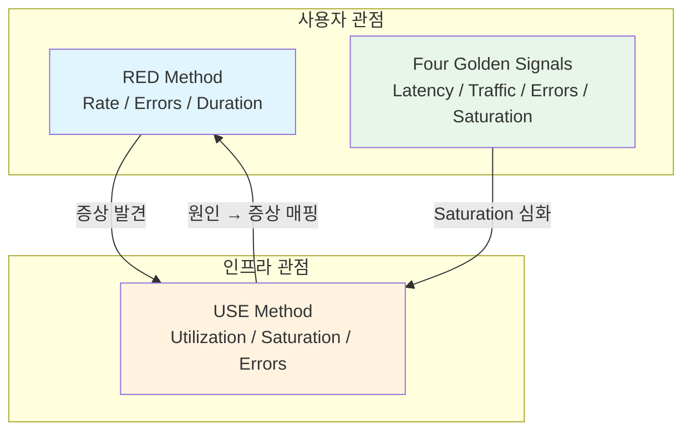
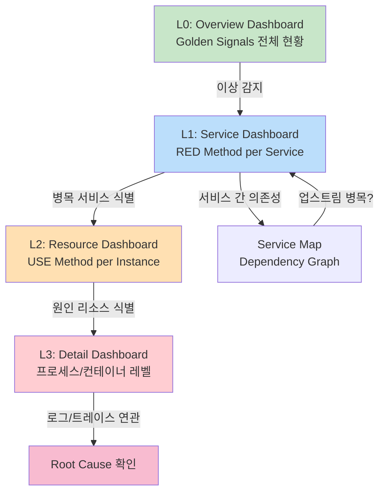

# 성능 병목 분석

Prometheus 메트릭과 Grafana 대시보드를 활용하여 시스템 성능 병목을 체계적으로 진단하는 방법론과 실전 트러블슈팅 워크플로우를 다룬다.

## 목차
- [1. 핵심 개념 (What)](#1-핵심-개념-what)
- [2. 왜 알아야 하는가 (Why)](#2-왜-알아야-하는가-why)
- [3. 내부 구현 분석 (How)](#3-내부-구현-분석-how)
- [4. 실전 예제](#4-실전-예제)
- [5. 정리](#5-정리)

---

## 1. 핵심 개념 (What)

성능 병목 분석은 시스템에서 가장 느리거나 과부하 상태인 구간을 찾아내는 과정이다. Observability 영역에서는 세 가지 핵심 방법론이 표준으로 사용된다.

### RED Method

Tom Wilkie가 제안한 마이크로서비스 중심 방법론이다.

| 지표 | 설명 | 대상 |
|------|------|------|
| **R**ate | 초당 요청 수 | 서비스 엔드포인트 |
| **E**rrors | 실패한 요청 비율 | 서비스 엔드포인트 |
| **D**uration | 요청 처리 시간(지연) | 서비스 엔드포인트 |

RED는 **사용자 관점**에서 서비스 건강 상태를 파악하는 데 초점을 맞춘다. 외부에서 관찰 가능한 증상을 측정한다.

### USE Method

Brendan Gregg가 제안한 인프라 리소스 중심 방법론이다.

| 지표 | 설명 | 대상 |
|------|------|------|
| **U**tilization | 리소스 사용률 (%) | CPU, 메모리, 디스크, 네트워크 |
| **S**aturation | 대기열 길이 / 초과 작업량 | 리소스별 대기 큐 |
| **E**rrors | 리소스 에러 이벤트 수 | 하드웨어/소프트웨어 에러 |

USE는 **인프라 관점**에서 리소스 병목을 진단한다. 내부 원인을 분석하는 데 적합하다.

### Google Four Golden Signals

Google SRE 핸드북에서 정의한 서비스 모니터링의 네 가지 핵심 신호이다.

| 신호 | 설명 |
|------|------|
| **Latency** | 요청 처리에 걸리는 시간 (성공/실패 구분) |
| **Traffic** | 시스템에 대한 수요량 (HTTP req/s, 트랜잭션/s) |
| **Errors** | 실패한 요청 비율 |
| **Saturation** | 시스템이 얼마나 "가득 찬" 상태인지 |

### 방법론 간의 관계



## 2. 왜 알아야 하는가 (Why)

### 실무에서 흔한 실수

1. **메트릭 과다 수집**: 방법론 없이 "가능한 모든 것"을 수집하면 카디널리티 폭발과 스토리지 비용 증가로 이어진다.
2. **증상과 원인 혼동**: CPU 사용률이 높다(USE)는 것이 반드시 사용자 응답 지연(RED)을 의미하지 않는다. 방법론은 이 두 관점을 분리한다.
3. **대시보드 무질서**: 체계적 분석 프레임워크 없이 만든 대시보드는 장애 시 "어디를 봐야 하는지" 모른다.

### 방법론의 실무 가치

- **RED**: "서비스에 문제가 있는가?" 를 빠르게 판단
- **USE**: "어떤 리소스가 원인인가?" 를 체계적으로 추적
- **Golden Signals**: 두 방법론을 통합하여 SLO 기반 알림 체계 구축

## 3. 내부 구현 분석 (How)

### 3.1 RED Method PromQL 구현

#### Rate (요청률)

```promql
# 전체 HTTP 요청률 (5분 이동 평균)
sum(rate(http_requests_total[5m])) by (service)

# 엔드포인트별 요청률
sum(rate(http_requests_total[5m])) by (service, handler, method)
```

#### Errors (에러율)

```promql
# 에러 비율 (%) - 5xx 응답
sum(rate(http_requests_total{status_code=~"5.."}[5m])) by (service)
/
sum(rate(http_requests_total[5m])) by (service)
* 100

# 에러율이 5% 초과인 서비스 필터링
(
  sum(rate(http_requests_total{status_code=~"5.."}[5m])) by (service)
  /
  sum(rate(http_requests_total[5m])) by (service)
) > 0.05
```

#### Duration (지연시간)

```promql
# p50 응답 시간
histogram_quantile(0.50,
  sum(rate(http_request_duration_seconds_bucket[5m])) by (le, service)
)

# p99 응답 시간
histogram_quantile(0.99,
  sum(rate(http_request_duration_seconds_bucket[5m])) by (le, service)
)

# Apdex Score (목표 응답시간 0.5초 기준)
(
  sum(rate(http_request_duration_seconds_bucket{le="0.5"}[5m])) by (service)
  +
  sum(rate(http_request_duration_seconds_bucket{le="2.0"}[5m])) by (service)
)
/ 2
/
sum(rate(http_request_duration_seconds_count[5m])) by (service)
```

### 3.2 USE Method PromQL 구현

#### CPU

```promql
# Utilization - CPU 사용률
1 - avg(rate(node_cpu_seconds_total{mode="idle"}[5m])) by (instance)

# Saturation - CPU 런큐 길이 (로드 평균 / CPU 코어 수)
node_load1 / count without(cpu) (node_cpu_seconds_total{mode="idle"})

# Errors - CPU 관련 에러 (dmesg에서 추출, 커스텀 익스포터 필요)
node_cpu_core_throttles_total
```

#### Memory

```promql
# Utilization - 메모리 사용률
1 - (node_memory_MemAvailable_bytes / node_memory_MemTotal_bytes)

# Saturation - 스왑 사용량 (0이면 정상)
rate(node_vmstat_pswpin[5m]) + rate(node_vmstat_pswpout[5m])

# Errors - OOM 킬러 발동 횟수
increase(node_vmstat_oom_kill[1h])
```

#### Disk I/O

```promql
# Utilization - 디스크 사용률 (IO 시간 비율)
rate(node_disk_io_time_seconds_total[5m])

# Saturation - 디스크 대기 큐 길이
rate(node_disk_io_time_weighted_seconds_total[5m])

# Errors - 디스크 에러
rate(node_disk_io_now[5m])
```

#### Network

```promql
# Utilization - 네트워크 대역폭 사용률 (1Gbps 기준)
rate(node_network_receive_bytes_total{device="eth0"}[5m]) * 8 / 1e9

# Saturation - 드롭된 패킷
rate(node_network_receive_drop_total{device="eth0"}[5m])

# Errors - 네트워크 에러
rate(node_network_receive_errs_total{device="eth0"}[5m])
+ rate(node_network_transmit_errs_total{device="eth0"}[5m])
```

### 3.3 Grafana 병목 진단 워크플로우



**3단계 Drill-down 전략**:

1. **Overview (L0)**: 전체 시스템의 Golden Signals를 한눈에. 어떤 서비스에 문제가 있는지 빠르게 파악.
2. **Service (L1)**: 해당 서비스의 RED 메트릭 상세 분석. 어떤 엔드포인트에서 에러/지연이 발생하는지.
3. **Resource (L2)**: 해당 인스턴스의 USE 메트릭. CPU, 메모리, 디스크, 네트워크 중 어떤 리소스가 병목인지.

### 3.4 Grafana 패널 설정 예시

#### RED Dashboard - JSON 모델

```json
{
  "panels": [
    {
      "title": "Request Rate",
      "type": "timeseries",
      "targets": [
        {
          "expr": "sum(rate(http_requests_total[5m])) by (service)",
          "legendFormat": "{{service}}"
        }
      ],
      "fieldConfig": {
        "defaults": {
          "unit": "reqps",
          "custom": {
            "drawStyle": "line",
            "fillOpacity": 10
          }
        }
      }
    },
    {
      "title": "Error Rate (%)",
      "type": "timeseries",
      "targets": [
        {
          "expr": "sum(rate(http_requests_total{status_code=~\"5..\"}[5m])) by (service) / sum(rate(http_requests_total[5m])) by (service) * 100",
          "legendFormat": "{{service}}"
        }
      ],
      "fieldConfig": {
        "defaults": {
          "unit": "percent",
          "thresholds": {
            "steps": [
              { "value": 0, "color": "green" },
              { "value": 1, "color": "yellow" },
              { "value": 5, "color": "red" }
            ]
          }
        }
      }
    },
    {
      "title": "Request Duration (p99)",
      "type": "timeseries",
      "targets": [
        {
          "expr": "histogram_quantile(0.99, sum(rate(http_request_duration_seconds_bucket[5m])) by (le, service))",
          "legendFormat": "{{service}}"
        }
      ],
      "fieldConfig": {
        "defaults": {
          "unit": "s"
        }
      }
    }
  ]
}
```

## 4. 실전 예제

### 시나리오 1: CPU Saturation 진단

**증상**: API 서비스의 p99 응답 시간이 평소 200ms에서 2초로 급증.

**Step 1 - RED 확인**:
```promql
# 응답 시간 급증 확인
histogram_quantile(0.99,
  sum(rate(http_request_duration_seconds_bucket{service="api"}[5m])) by (le)
)

# 요청률은 정상 범위인지 확인
sum(rate(http_requests_total{service="api"}[5m]))
```

**Step 2 - USE로 원인 추적**:
```promql
# CPU Utilization - 높은 사용률 확인
1 - avg(rate(node_cpu_seconds_total{mode="idle", instance=~"api-.*"}[5m])) by (instance)

# CPU Saturation - 런큐 확인 (1 이상이면 포화)
node_load1{instance=~"api-.*"}
/ ignoring(cpu) count without(cpu) (node_cpu_seconds_total{mode="idle", instance=~"api-.*"})

# 프로세스별 CPU 사용량 (process-exporter 필요)
topk(5,
  rate(namedprocess_namegroup_cpu_seconds_total{instance=~"api-.*"}[5m])
)
```

**Step 3 - Root Cause**:
```promql
# GC pressure 확인 (Go 서비스)
rate(go_gc_duration_seconds_sum{service="api"}[5m])
/
rate(go_gc_duration_seconds_count{service="api"}[5m])

# Goroutine 수 급증 확인
go_goroutines{service="api"}
```

**결론**: Goroutine 누수로 인한 GC pressure 증가 -> CPU Saturation -> 응답 지연.

---

### 시나리오 2: Memory Leak 진단

**증상**: 서비스가 주기적으로 OOM Kill 당하며 재시작됨.

**Step 1 - 패턴 확인**:
```promql
# 컨테이너 메모리 사용량 추이 (톱니파 패턴 = leak + restart)
container_memory_working_set_bytes{container="payment-service"}

# OOM Kill 이벤트 확인
increase(kube_pod_container_status_restarts_total{container="payment-service"}[1h])
```

**Step 2 - 메모리 증가율 분석**:
```promql
# 시간당 메모리 증가율 (leak 속도 측정)
deriv(container_memory_working_set_bytes{container="payment-service"}[1h])

# 메모리 limit 대비 사용률
container_memory_working_set_bytes{container="payment-service"}
/
container_spec_memory_limit_bytes{container="payment-service"}
```

**Step 3 - Heap 분석 (Go/Java)**:
```promql
# Go heap 사용량
go_memstats_heap_inuse_bytes{service="payment-service"}

# Go heap 오브젝트 수
go_memstats_heap_objects{service="payment-service"}

# Java JVM heap (JMX exporter)
jvm_memory_used_bytes{area="heap", service="payment-service"}
```

**알림 규칙 설정**:
```yaml
groups:
  - name: memory-leak-detection
    rules:
      - alert: MemoryLeakSuspected
        expr: |
          deriv(container_memory_working_set_bytes[2h]) > 1e6
          and
          container_memory_working_set_bytes
          / container_spec_memory_limit_bytes > 0.7
        for: 30m
        labels:
          severity: warning
        annotations:
          summary: "메모리 누수 의심: {{ $labels.container }}"
          description: >
            {{ $labels.container }}의 메모리가 시간당
            {{ $value | humanize }}B씩 증가 중. 현재 limit의 70% 이상 사용.
```

---

### 시나리오 3: Network Bottleneck 진단

**증상**: 마이크로서비스 간 gRPC 호출 타임아웃 빈발.

**Step 1 - RED로 범위 좁히기**:
```promql
# gRPC 에러율 (서비스 간 통신)
sum(rate(grpc_server_handled_total{grpc_code!="OK"}[5m])) by (grpc_service, grpc_method)
/
sum(rate(grpc_server_handled_total[5m])) by (grpc_service, grpc_method)

# gRPC 응답 시간
histogram_quantile(0.99,
  sum(rate(grpc_server_handling_seconds_bucket[5m])) by (le, grpc_service)
)
```

**Step 2 - 네트워크 USE 분석**:
```promql
# 네트워크 수신 대역폭 사용률
rate(node_network_receive_bytes_total{device!~"lo|veth.*"}[5m]) * 8

# 패킷 드롭 (Saturation 지표)
rate(node_network_receive_drop_total[5m]) > 0

# TCP 재전송 (네트워크 품질 지표)
rate(node_netstat_Tcp_RetransSegs[5m])
/
rate(node_netstat_Tcp_OutSegs[5m])

# conntrack 테이블 포화도
node_nf_conntrack_entries / node_nf_conntrack_entries_limit
```

**Step 3 - DNS/Service Discovery 확인**:
```promql
# CoreDNS 응답 시간
histogram_quantile(0.99,
  sum(rate(coredns_dns_request_duration_seconds_bucket[5m])) by (le)
)

# DNS 에러율
sum(rate(coredns_dns_responses_total{rcode="SERVFAIL"}[5m]))
/
sum(rate(coredns_dns_responses_total[5m]))
```

**결론**: conntrack 테이블 포화 -> 새 커넥션 생성 불가 -> gRPC 타임아웃. `nf_conntrack_max` 값 증가로 해결.

## 5. 정리

### 방법론 선택 가이드

| 상황 | 방법론 | 첫 번째 확인 메트릭 |
|------|--------|---------------------|
| "사용자가 느리다고 합니다" | RED / Golden Signals | `http_request_duration_seconds` |
| "서버가 느려졌습니다" | USE | `node_cpu_seconds_total`, `node_memory_*` |
| "서비스가 불안정합니다" | RED + USE 병행 | Error Rate -> Resource Saturation |
| "SLO 기반 알림 설계" | Golden Signals | Latency + Error Budget |

### 진단 워크플로우 체크리스트

| 단계 | 행동 | 도구 |
|------|------|------|
| 1. 증상 파악 | Golden Signals / RED 확인 | L0 Overview Dashboard |
| 2. 범위 좁히기 | 서비스/엔드포인트 식별 | L1 Service Dashboard |
| 3. 원인 분석 | USE Method로 리소스 분석 | L2 Resource Dashboard |
| 4. 근본 원인 | 프로세스/코드 레벨 분석 | 로그, 트레이스, 프로파일링 |
| 5. 검증 | 수정 후 메트릭 정상화 확인 | 동일 대시보드 |

### 핵심 PromQL 패턴 요약

| 목적 | PromQL 패턴 |
|------|-------------|
| 요청률 | `sum(rate(counter[5m])) by (label)` |
| 에러율 | `errors / total * 100` |
| 백분위 지연 | `histogram_quantile(0.99, sum(rate(bucket[5m])) by (le))` |
| 리소스 사용률 | `1 - avg(rate(idle[5m]))` |
| 증가 추세 | `deriv(gauge[1h])` |
| Top-K | `topk(5, metric)` |

---
*참고: Prometheus 2.x, Grafana 10.x, node_exporter 1.x 기준*
