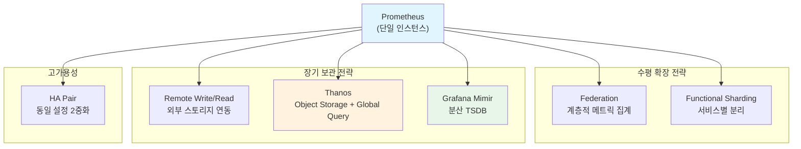
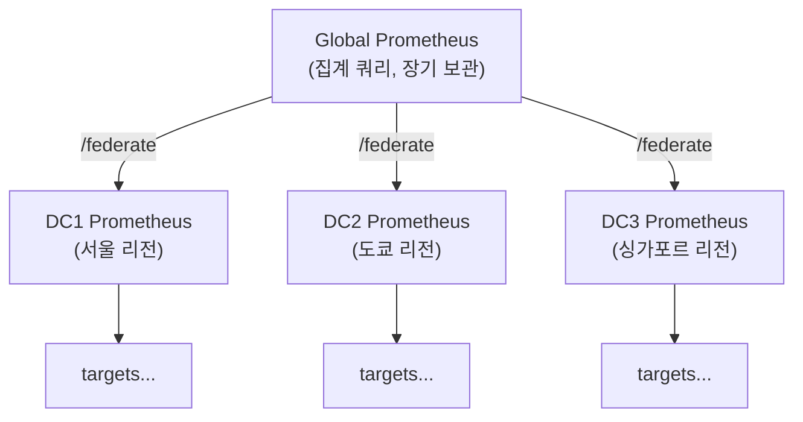
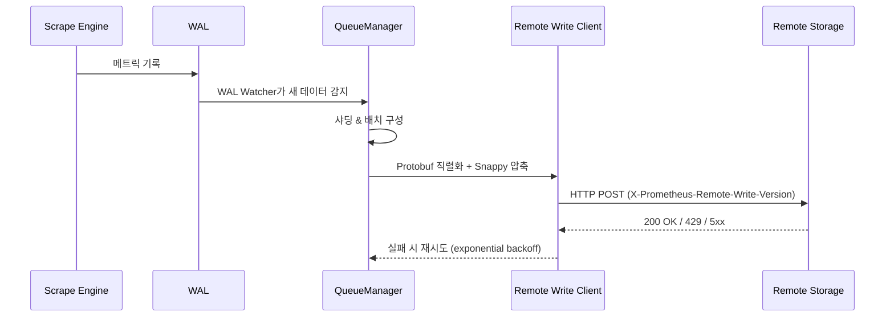
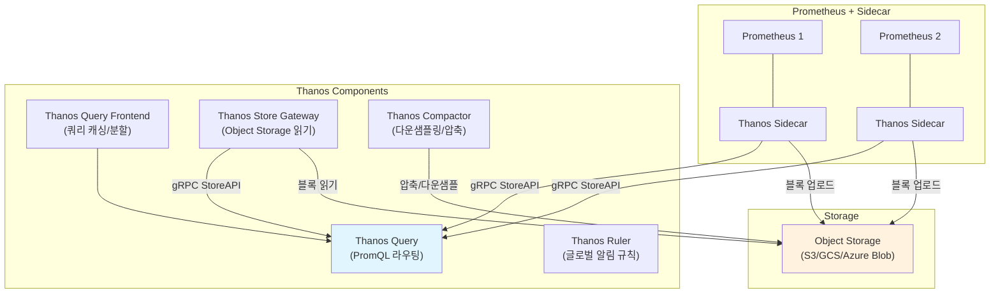
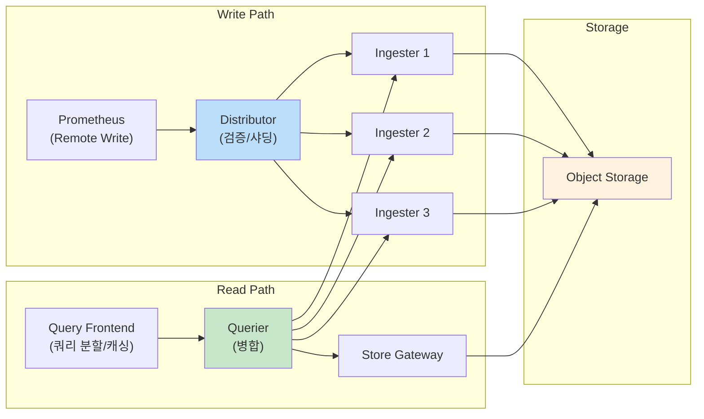

# Prometheus 운영 & 스케일링

단일 Prometheus 인스턴스의 한계를 넘어 대규모 환경에서 안정적으로 메트릭을 수집, 저장, 쿼리하기 위한 Federation, Remote Write/Read, Thanos, Mimir 아키텍처와 운영 전략을 다룬다.

## 목차
- [1. 핵심 개념 (What)](#1-핵심-개념-what)
- [2. 왜 알아야 하는가 (Why)](#2-왜-알아야-하는가-why)
- [3. 내부 구현 분석 (How)](#3-내부-구현-분석-how)
- [4. 실전 예제](#4-실전-예제)
- [5. 정리](#5-정리)

---

## 1. 핵심 개념 (What)

### 단일 Prometheus의 한계

Prometheus는 로컬 TSDB에 메트릭을 저장하는 단일 노드 시스템이다. 다음과 같은 한계가 있다:

| 제약 | 설명 |
|------|------|
| **수직 확장 한계** | 단일 노드의 CPU, 메모리, 디스크 I/O 한계 |
| **장기 보관 어려움** | 로컬 디스크 용량 제한, 기본 리텐션 15일 |
| **고가용성 부재** | 단일 장애점(SPOF), 네이티브 클러스터링 없음 |
| **글로벌 뷰 부재** | 여러 Prometheus 인스턴스의 데이터를 통합 쿼리 불가 |

### 스케일링 전략 개요



## 2. 왜 알아야 하는가 (Why)

### 규모별 운영 시나리오

| 규모 | Active Time Series | 전략 |
|------|-------------------|------|
| 소규모 (팀) | < 100K | 단일 Prometheus + 로컬 스토리지 |
| 중규모 (부서) | 100K ~ 1M | Federation + Functional Sharding |
| 대규모 (조직) | 1M ~ 10M | Thanos 또는 Mimir |
| 초대규모 (엔터프라이즈) | 10M+ | Mimir (멀티테넌트) |

### 실무 의사결정 포인트

- **"6개월 전 데이터를 쿼리해야 합니다"** -> 장기 보관 전략 필요 (Thanos/Mimir)
- **"여러 클러스터의 메트릭을 한 곳에서 보고 싶습니다"** -> Global View 필요 (Federation/Thanos Query)
- **"Prometheus가 다운되면 알림이 안 옵니다"** -> HA 구성 필요
- **"팀별로 독립적인 메트릭 저장소가 필요합니다"** -> 멀티테넌시 (Mimir)

## 3. 내부 구현 분석 (How)

### 3.1 Federation

Federation은 한 Prometheus가 다른 Prometheus의 메트릭을 스크레이핑하는 방식이다.

#### Hierarchical Federation



**Global Prometheus 설정**:

```yaml
# prometheus-global.yml
scrape_configs:
  - job_name: 'federate-dc1'
    honor_labels: true
    metrics_path: '/federate'
    params:
      'match[]':
        # 집계된 메트릭만 가져오기 (카디널리티 제어)
        - '{__name__=~"job:.*"}'
        - '{__name__=~"instance:.*"}'
        # 핵심 서비스 메트릭
        - 'up{job=~"api|payment|order"}'
    static_configs:
      - targets:
          - 'prometheus-dc1:9090'
        labels:
          datacenter: 'seoul'

  - job_name: 'federate-dc2'
    honor_labels: true
    metrics_path: '/federate'
    params:
      'match[]':
        - '{__name__=~"job:.*"}'
        - '{__name__=~"instance:.*"}'
    static_configs:
      - targets:
          - 'prometheus-dc2:9090'
        labels:
          datacenter: 'tokyo'
```

#### Cross-Service Federation

서비스별로 Prometheus를 분리하고, 서비스 간 의존성 메트릭만 교차 수집한다:

```yaml
# payment-service prometheus가 order-service 메트릭 참조
scrape_configs:
  - job_name: 'federate-order-service'
    honor_labels: true
    metrics_path: '/federate'
    params:
      'match[]':
        - 'grpc_server_handled_total{grpc_service="OrderService"}'
        - 'grpc_server_handling_seconds_bucket{grpc_service="OrderService"}'
    static_configs:
      - targets: ['prometheus-order:9090']
```

### 3.2 Remote Write/Read

Prometheus의 Remote Write 프로토콜은 메트릭 데이터를 외부 시스템으로 전송하는 표준 인터페이스이다. Prometheus 소스코드의 `storage/remote/client.go`에서 HTTP 클라이언트를 통해 Protobuf + Snappy 압축된 데이터를 전송한다.

#### Remote Write 동작 흐름



QueueManager(`storage/remote/queue_manager.go`)가 핵심 역할을 한다. EWMA(Exponentially Weighted Moving Average) 기반으로 동적 샤드 수를 조절하며, 재시도 로직을 관리한다.

**Remote Write 설정**:

```yaml
# prometheus.yml
remote_write:
  - url: "http://mimir:9009/api/v1/push"
    # 큐 설정
    queue_config:
      capacity: 10000          # 인메모리 큐 크기
      max_shards: 200          # 최대 병렬 전송 수
      min_shards: 1            # 최소 병렬 전송 수
      max_samples_per_send: 2000
      batch_send_deadline: 5s
      min_backoff: 30ms
      max_backoff: 5s
      retry_on_http_429: true

    # 메트릭 필터링 (불필요한 메트릭 제외)
    write_relabel_configs:
      - source_labels: [__name__]
        regex: 'go_.*'
        action: drop
      - source_labels: [__name__]
        regex: 'prometheus_.*'
        action: drop

remote_read:
  - url: "http://mimir:9009/prometheus/api/v1/read"
    read_recent: false  # 최근 데이터는 로컬 TSDB 사용
```

### 3.3 Thanos 아키텍처

Thanos는 기존 Prometheus에 사이드카를 붙여 확장하는 방식이다. 변경 최소화로 도입할 수 있다.



**핵심 컴포넌트 역할**:

| 컴포넌트 | 역할 | 스케일링 |
|----------|------|----------|
| **Sidecar** | Prometheus 옆에서 블록 업로드 + StoreAPI 제공 | Prometheus당 1개 |
| **Store Gateway** | Object Storage의 과거 데이터 읽기 | 수평 확장 가능 |
| **Query** | 여러 StoreAPI 소스를 통합 쿼리 | 수평 확장 가능 |
| **Query Frontend** | 쿼리 캐싱, 범위 분할, 재시도 | 수평 확장 가능 |
| **Compactor** | 블록 압축, 다운샘플링 (5m, 1h) | 단일 인스턴스 |
| **Ruler** | 글로벌 범위 Recording/Alert 규칙 | 수평 확장 가능 |

**Thanos Sidecar 설정 예시**:

```yaml
# docker-compose.yml (발췌)
services:
  prometheus:
    image: prom/prometheus:v2.51.0
    command:
      - '--config.file=/etc/prometheus/prometheus.yml'
      - '--storage.tsdb.path=/prometheus'
      - '--storage.tsdb.min-block-duration=2h'  # Sidecar 업로드와 일치
      - '--storage.tsdb.max-block-duration=2h'
      - '--web.enable-lifecycle'
    volumes:
      - prometheus-data:/prometheus

  thanos-sidecar:
    image: quay.io/thanos/thanos:v0.34.0
    command:
      - sidecar
      - '--tsdb.path=/prometheus'
      - '--prometheus.url=http://prometheus:9090'
      - '--objstore.config-file=/etc/thanos/bucket.yml'
      - '--grpc-address=0.0.0.0:10901'
    volumes:
      - prometheus-data:/prometheus

  thanos-query:
    image: quay.io/thanos/thanos:v0.34.0
    command:
      - query
      - '--store=thanos-sidecar:10901'
      - '--store=thanos-store:10901'
      - '--query.replica-label=replica'  # HA 중복 제거

  thanos-store:
    image: quay.io/thanos/thanos:v0.34.0
    command:
      - store
      - '--objstore.config-file=/etc/thanos/bucket.yml'
      - '--data-dir=/var/thanos/store'
```

**Object Storage 설정 (bucket.yml)**:

```yaml
type: S3
config:
  bucket: "thanos-metrics"
  endpoint: "s3.ap-northeast-2.amazonaws.com"
  access_key: "${AWS_ACCESS_KEY_ID}"
  secret_key: "${AWS_SECRET_ACCESS_KEY}"
```

### 3.4 Grafana Mimir 아키텍처

Mimir는 처음부터 분산 시스템으로 설계되어, Prometheus Remote Write를 통해 멀티테넌트 메트릭 저장소를 제공한다.



**핵심 컴포넌트**:

| 컴포넌트 | 역할 |
|----------|------|
| **Distributor** | Remote Write 수신, 유효성 검증, 해시링 기반 Ingester 라우팅 |
| **Ingester** | 인메모리에 최근 데이터 저장, 주기적으로 Object Storage에 블록 업로드 |
| **Querier** | PromQL 쿼리 실행, Ingester + Store Gateway 결과 병합 |
| **Query Frontend** | 쿼리 분할(시간 범위), 결과 캐싱, 큐잉 |
| **Store Gateway** | Object Storage의 과거 블록 읽기 |
| **Compactor** | 블록 압축, 인덱스 최적화, 리텐션 적용 |

**Mimir 단일 바이너리 모드 설정**:

```yaml
# mimir-config.yaml
target: all  # 단일 바이너리 (개발/소규모 환경)

server:
  http_listen_port: 9009
  grpc_listen_port: 9095

common:
  storage:
    backend: s3
    s3:
      endpoint: s3.ap-northeast-2.amazonaws.com
      bucket_name: mimir-metrics
      access_key_id: ${AWS_ACCESS_KEY_ID}
      secret_access_key: ${AWS_SECRET_ACCESS_KEY}

limits:
  max_global_series_per_user: 1500000
  ingestion_rate: 100000
  ingestion_burst_size: 200000
  max_label_names_per_series: 30
  max_label_value_length: 2048

blocks_storage:
  tsdb:
    dir: /data/tsdb
  bucket_store:
    sync_dir: /data/tsdb-sync

compactor:
  data_dir: /data/compactor
  sharding_ring:
    kvstore:
      store: memberlist
```

### 3.5 리텐션 & 스토리지 용량 계획

#### 용량 산정 공식

```
디스크 사용량 = active_series * scrape_interval * bytes_per_sample * retention_seconds

예시:
  500,000 시리즈 * (1/15s) * 1.5 bytes * (15일 * 86400s)
  = 500,000 * 0.067 * 1.5 * 1,296,000
  ≈ 65 GB
```

#### Prometheus 리텐션 설정

```yaml
# 시간 기반 리텐션
--storage.tsdb.retention.time=30d

# 크기 기반 리텐션 (우선 적용)
--storage.tsdb.retention.size=100GB
```

### 3.6 Prometheus 자체 모니터링

Prometheus 자신의 건강 상태를 모니터링하기 위한 핵심 메트릭:

```promql
# 스크레이프 성공률
scrape_samples_scraped / scrape_series_added

# 활성 시리즈 수
prometheus_tsdb_head_series

# 메모리 사용량
process_resident_memory_bytes{job="prometheus"}

# WAL 크기
prometheus_tsdb_wal_storage_size_bytes

# 쿼리 성능
rate(prometheus_engine_query_duration_seconds_sum[5m])
/ rate(prometheus_engine_query_duration_seconds_count[5m])

# Remote Write 지연
prometheus_remote_storage_highest_timestamp_in_seconds
- ignoring(remote_name, url)
prometheus_remote_storage_queue_highest_sent_timestamp_seconds

# 샘플 수집률
rate(prometheus_tsdb_head_samples_appended_total[5m])

# 스크레이프 대상 개수
count(up)
```

**자체 모니터링 알림 규칙**:

```yaml
groups:
  - name: prometheus-self-monitoring
    rules:
      - alert: PrometheusHighMemory
        expr: process_resident_memory_bytes{job="prometheus"} > 8e9
        for: 10m
        labels:
          severity: warning
        annotations:
          summary: "Prometheus 메모리 사용량 8GB 초과"

      - alert: PrometheusRemoteWriteLag
        expr: >
          (prometheus_remote_storage_highest_timestamp_in_seconds
           - ignoring(remote_name, url)
           prometheus_remote_storage_queue_highest_sent_timestamp_seconds) > 300
        for: 5m
        labels:
          severity: critical
        annotations:
          summary: "Remote Write 지연 5분 초과"

      - alert: PrometheusTSDBHeadSeriesHigh
        expr: prometheus_tsdb_head_series > 2e6
        for: 15m
        labels:
          severity: warning
        annotations:
          summary: "Active time series 200만 초과"
```

## 4. 실전 예제

### 예제 1: Thanos 기반 멀티클러스터 모니터링

```yaml
# thanos-query.yml - 여러 클러스터 통합
services:
  thanos-query:
    image: quay.io/thanos/thanos:v0.34.0
    command:
      - query
      - '--store=dnssrv+_grpc._tcp.thanos-sidecar.prod-kr.svc.cluster.local'
      - '--store=dnssrv+_grpc._tcp.thanos-sidecar.prod-jp.svc.cluster.local'
      - '--store=dnssrv+_grpc._tcp.thanos-store.monitoring.svc.cluster.local'
      - '--query.replica-label=replica'
      - '--query.replica-label=prometheus_replica'
      - '--query.auto-downsampling'
    ports:
      - "9090:10902"
```

**Grafana에서 Thanos Query를 데이터소스로 연결**:

```yaml
apiVersion: 1
datasources:
  - name: Thanos
    type: prometheus
    access: proxy
    url: http://thanos-query:10902
    jsonData:
      httpMethod: POST
      customQueryParameters: 'max_source_resolution=auto'
```

### 예제 2: Remote Write 기반 Mimir 연동

```yaml
# prometheus.yml - 프로덕션 Remote Write 설정
remote_write:
  - url: "https://mimir.internal/api/v1/push"
    headers:
      X-Scope-OrgID: "team-backend"  # 멀티테넌트 식별자

    queue_config:
      capacity: 15000
      max_shards: 50
      min_shards: 5
      max_samples_per_send: 5000
      batch_send_deadline: 5s

    # 중요 메트릭만 장기 보관
    write_relabel_configs:
      # Go 런타임 메트릭 제외
      - source_labels: [__name__]
        regex: 'go_(gc|memstats|threads|info)_.*'
        action: drop
      # 고카디널리티 라벨 제거
      - regex: 'instance'
        action: labeldrop
      # 녹화 규칙 결과만 전송 (선택적)
      # - source_labels: [__name__]
      #   regex: '(job|instance):.*'
      #   action: keep

    tls_config:
      cert_file: /etc/prometheus/tls/client.crt
      key_file: /etc/prometheus/tls/client.key
      ca_file: /etc/prometheus/tls/ca.crt
```

### 예제 3: HA Pair 구성

```yaml
# prometheus-ha-a.yml
global:
  external_labels:
    cluster: production-kr
    replica: a  # HA 식별자

# prometheus-ha-b.yml
global:
  external_labels:
    cluster: production-kr
    replica: b  # HA 식별자

# 나머지 설정은 동일 (같은 scrape_configs)
```

Thanos Query에서 `--query.replica-label=replica`로 중복 제거:

```
동일한 시리즈가 replica=a, replica=b에서 오면
Thanos Query가 하나만 선택하여 중복 없는 결과 반환
```

## 5. 정리

### 스케일링 전략 비교

| 전략 | 장점 | 단점 | 적합 규모 |
|------|------|------|-----------|
| **Federation** | 간단한 설정, 추가 인프라 불필요 | 글로벌 쿼리 한계, 카디널리티 증폭 위험 | 중규모 |
| **Thanos** | 기존 Prometheus 활용, 무제한 리텐션 | 운영 복잡성, Compactor 단일점 | 대규모 |
| **Mimir** | 네이티브 멀티테넌시, 높은 처리량 | 자체 클러스터 운영 필요 | 대~초대규모 |
| **Remote Write** | 유연한 백엔드 선택, 표준 프로토콜 | 네트워크 의존성, 지연 가능성 | 모든 규모 |
| **HA Pair** | 간단한 이중화 | 스토리지 2배, 쿼리 중복 | 모든 규모 |

### 용량 계획 요약

| 항목 | 계산/기준 |
|------|-----------|
| 디스크 | `series * (1/interval) * 1.5B * retention_sec` |
| 메모리 | active_series * ~4KB (head block) |
| CPU | 쿼리 동시성 * 쿼리 복잡도에 비례 |
| 네트워크 | Remote Write: ~1.5B/sample * ingestion_rate |

### 핵심 자체 모니터링 메트릭

| 메트릭 | 임계값 | 의미 |
|--------|--------|------|
| `prometheus_tsdb_head_series` | > 2M 주의 | 카디널리티 관리 필요 |
| `process_resident_memory_bytes` | > 80% of limit | 메모리 부족 위험 |
| Remote Write lag | > 5분 | 네트워크/백엔드 병목 |
| `rate(prometheus_tsdb_head_samples_appended_total[5m])` | 급감 시 | 스크레이프 실패 의심 |

---
*참고: Prometheus 2.51.x, Thanos 0.34.x, Grafana Mimir 2.12.x 기준*
