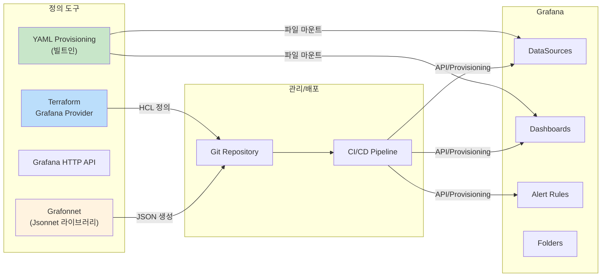
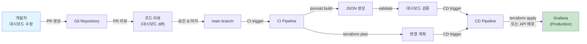

# Grafana 운영 & Provisioning

Grafana의 YAML 기반 프로비저닝, Dashboard as Code, Terraform Provider, GitOps 워크플로우, API 활용, 멀티테넌시 관리를 통해 운영 자동화와 일관성을 확보하는 방법을 다룬다.

## 목차
- [1. 핵심 개념 (What)](#1-핵심-개념-what)
- [2. 왜 알아야 하는가 (Why)](#2-왜-알아야-하는가-why)
- [3. 내부 구현 분석 (How)](#3-내부-구현-분석-how)
- [4. 실전 예제](#4-실전-예제)
- [5. 정리](#5-정리)

---

## 1. 핵심 개념 (What)

### Provisioning이란?

Grafana Provisioning은 데이터소스, 대시보드, 알림 규칙 등을 **코드(YAML/JSON)로 정의**하여 Grafana 시작 시 자동으로 적용하는 메커니즘이다. Grafana 소스코드(`pkg/services/provisioning/provisioning.go`)에서 `ProvisioningServiceImpl`이 시작 시 다음 순서로 프로비저닝을 실행한다:

1. **DataSources** 프로비저닝
2. **Plugins** 프로비저닝
3. **Alerting** 프로비저닝
4. **Dashboards** 프로비저닝 (파일 변경 감지 폴링 포함)

### Provisioning vs. API vs. UI

| 방식 | 적합한 용도 | 변경 추적 | 자동화 |
|------|------------|-----------|--------|
| **YAML Provisioning** | 환경 초기 설정, IaC | Git 관리 | 기동 시 자동 적용 |
| **HTTP API** | 동적 변경, CI/CD 파이프라인 | API 호출 로그 | 스크립트/파이프라인 |
| **UI** | 탐색적 대시보드 개발, 임시 변경 | 수동 export 필요 | 없음 |

### Dashboard as Code 도구 생태계



## 2. 왜 알아야 하는가 (Why)

### 수동 관리의 문제점

1. **환경 불일치**: dev/staging/production 환경의 대시보드가 다르다.
2. **변경 이력 부재**: "누가 언제 무엇을 바꿨는지" 추적 불가.
3. **재현 불가**: 장애 시 Grafana 재설치하면 모든 대시보드를 처음부터 다시 만들어야 한다.
4. **코드 리뷰 불가**: UI에서 만든 대시보드는 PR 리뷰를 할 수 없다.

### Provisioning의 실무 가치

- **Infrastructure as Code**: 모든 설정이 Git에 버전 관리
- **환경 일관성**: 동일한 정의 파일로 모든 환경에 배포
- **재해 복구**: Grafana 인스턴스 교체 시 자동 복원
- **협업**: PR 기반 대시보드 변경 프로세스

## 3. 내부 구현 분석 (How)

### 3.1 YAML 기반 Provisioning

Grafana는 `conf/provisioning/` 디렉토리 아래의 YAML 파일을 읽어 리소스를 프로비저닝한다.

#### 디렉토리 구조

```
/etc/grafana/provisioning/
├── datasources/
│   ├── prometheus.yaml
│   ├── loki.yaml
│   └── tempo.yaml
├── dashboards/
│   ├── provider.yaml
│   └── json/
│       ├── overview.json
│       ├── services/
│       │   ├── api-service.json
│       │   └── payment-service.json
│       └── infrastructure/
│           ├── nodes.json
│           └── kubernetes.json
├── alerting/
│   ├── contact-points.yaml
│   ├── notification-policies.yaml
│   └── alert-rules.yaml
└── plugins/
    └── plugins.yaml
```

#### DataSource Provisioning

```yaml
# provisioning/datasources/prometheus.yaml
apiVersion: 1

deleteDatasources:
  - name: Old-Prometheus
    orgId: 1

datasources:
  - name: Prometheus
    type: prometheus
    access: proxy
    url: http://prometheus:9090
    uid: prometheus-main
    isDefault: true
    editable: false  # UI에서 수정 불가 (IaC 원칙)
    jsonData:
      httpMethod: POST
      timeInterval: '15s'
      exemplarTraceIdDestinations:
        - name: traceID
          datasourceUid: tempo-main

  - name: Prometheus-LongTerm
    type: prometheus
    access: proxy
    url: http://thanos-query:10902
    uid: prometheus-longterm
    jsonData:
      httpMethod: POST
      customQueryParameters: 'max_source_resolution=auto'

  - name: Loki
    type: loki
    access: proxy
    url: http://loki:3100
    uid: loki-main
    jsonData:
      derivedFields:
        - datasourceUid: tempo-main
          matcherRegex: '"traceID":"(\w+)"'
          name: TraceID
          url: '$${__value.raw}'

  - name: Tempo
    type: tempo
    access: proxy
    url: http://tempo:3200
    uid: tempo-main
    jsonData:
      tracesToLogs:
        datasourceUid: loki-main
        filterByTraceID: true
```

#### Dashboard Provisioning

```yaml
# provisioning/dashboards/provider.yaml
apiVersion: 1

providers:
  - name: 'default'
    orgId: 1
    folder: 'Provisioned'
    folderUid: 'provisioned'
    type: file
    disableDeletion: true     # UI에서 삭제 불가
    updateIntervalSeconds: 30  # 파일 변경 감지 간격
    allowUiUpdates: false      # UI 수정 불가
    options:
      path: /etc/grafana/provisioning/dashboards/json
      foldersFromFilesStructure: true  # 디렉토리 → 폴더 매핑
```

`foldersFromFilesStructure: true` 설정 시 파일 시스템 구조가 Grafana 폴더에 매핑된다:

```
json/
├── services/        →  Grafana 폴더: "services"
│   └── api.json
└── infrastructure/  →  Grafana 폴더: "infrastructure"
    └── nodes.json
```

#### Alerting Provisioning

```yaml
# provisioning/alerting/contact-points.yaml
apiVersion: 1

contactPoints:
  - orgId: 1
    name: slack-oncall
    receivers:
      - uid: slack-oncall-1
        type: slack
        settings:
          url: "${SLACK_WEBHOOK_URL}"
          recipient: "#oncall-alerts"
          title: |
            {{ template "slack.default.title" . }}
          text: |
            {{ template "slack.default.text" . }}

# provisioning/alerting/notification-policies.yaml
apiVersion: 1

policies:
  - orgId: 1
    receiver: slack-oncall
    group_by: ['alertname', 'service']
    group_wait: 30s
    group_interval: 5m
    repeat_interval: 4h
    routes:
      - receiver: pagerduty-critical
        matchers:
          - severity = critical
        continue: false
      - receiver: slack-oncall
        matchers:
          - severity = warning
```

### 3.2 Dashboard as Code (Grafonnet / Jsonnet)

Grafonnet은 Grafana 대시보드를 Jsonnet으로 프로그래밍 방식으로 생성하는 라이브러리이다.

#### Jsonnet 기본 예제

```jsonnet
// dashboards/api-service.jsonnet
local grafana = import 'github.com/grafana/grafonnet/gen/grafonnet-latest/main.libsonnet';
local dashboard = grafana.dashboard;
local panel = grafana.panel;
local prometheus = grafana.query.prometheus;

local datasource = {
  type: 'prometheus',
  uid: 'prometheus-main',
};

// RED Method 패널 정의
local requestRatePanel =
  panel.timeSeries.new('Request Rate')
  + panel.timeSeries.queryOptions.withTargets([
    prometheus.new(
      datasource.uid,
      'sum(rate(http_requests_total{service="api"}[5m])) by (handler)'
    )
    + prometheus.withLegendFormat('{{ handler }}'),
  ])
  + panel.timeSeries.standardOptions.withUnit('reqps')
  + panel.timeSeries.gridPos.withW(8)
  + panel.timeSeries.gridPos.withH(8);

local errorRatePanel =
  panel.timeSeries.new('Error Rate')
  + panel.timeSeries.queryOptions.withTargets([
    prometheus.new(
      datasource.uid,
      |||
        sum(rate(http_requests_total{service="api",status_code=~"5.."}[5m])) by (handler)
        /
        sum(rate(http_requests_total{service="api"}[5m])) by (handler) * 100
      |||
    )
    + prometheus.withLegendFormat('{{ handler }}'),
  ])
  + panel.timeSeries.standardOptions.withUnit('percent')
  + panel.timeSeries.gridPos.withW(8)
  + panel.timeSeries.gridPos.withH(8)
  + panel.timeSeries.gridPos.withX(8);

local latencyPanel =
  panel.timeSeries.new('p99 Latency')
  + panel.timeSeries.queryOptions.withTargets([
    prometheus.new(
      datasource.uid,
      |||
        histogram_quantile(0.99,
          sum(rate(http_request_duration_seconds_bucket{service="api"}[5m])) by (le, handler)
        )
      |||
    )
    + prometheus.withLegendFormat('{{ handler }}'),
  ])
  + panel.timeSeries.standardOptions.withUnit('s')
  + panel.timeSeries.gridPos.withW(8)
  + panel.timeSeries.gridPos.withH(8)
  + panel.timeSeries.gridPos.withX(16);

// 대시보드 조합
dashboard.new('API Service - RED')
+ dashboard.withUid('api-service-red')
+ dashboard.withTags(['service', 'api', 'red'])
+ dashboard.withRefresh('30s')
+ dashboard.withPanels([
  requestRatePanel,
  errorRatePanel,
  latencyPanel,
])
```

**빌드 명령**:

```bash
# Jsonnet → JSON 변환
jsonnet -J vendor dashboards/api-service.jsonnet > provisioning/dashboards/json/api-service.json
```

### 3.3 Terraform Grafana Provider

```hcl
# providers.tf
terraform {
  required_providers {
    grafana = {
      source  = "grafana/grafana"
      version = "~> 3.0"
    }
  }
}

provider "grafana" {
  url  = "http://grafana:3000"
  auth = var.grafana_api_key
}

# 폴더 생성
resource "grafana_folder" "services" {
  title = "Services"
  uid   = "services"
}

# 데이터소스 생성
resource "grafana_data_source" "prometheus" {
  type = "prometheus"
  name = "Prometheus"
  uid  = "prometheus-main"
  url  = "http://prometheus:9090"

  json_data_encoded = jsonencode({
    httpMethod   = "POST"
    timeInterval = "15s"
  })
}

# 대시보드 배포
resource "grafana_dashboard" "api_service" {
  folder    = grafana_folder.services.id
  overwrite = true

  config_json = file("${path.module}/dashboards/api-service.json")
}

# 알림 Contact Point
resource "grafana_contact_point" "slack" {
  name = "slack-oncall"

  slack {
    url     = var.slack_webhook_url
    channel = "#oncall-alerts"
  }
}

# 알림 정책
resource "grafana_notification_policy" "default" {
  contact_point = grafana_contact_point.slack.name
  group_by      = ["alertname", "service"]

  policy {
    contact_point = grafana_contact_point.slack.name
    matcher {
      label = "severity"
      match = "="
      value = "warning"
    }
  }
}
```

### 3.4 GitOps 워크플로우



**CI/CD 파이프라인 예시 (GitHub Actions)**:

```yaml
# .github/workflows/grafana-dashboards.yml
name: Grafana Dashboard Deploy

on:
  push:
    branches: [main]
    paths:
      - 'dashboards/**'
      - 'provisioning/**'
  pull_request:
    paths:
      - 'dashboards/**'

jobs:
  validate:
    runs-on: ubuntu-latest
    steps:
      - uses: actions/checkout@v4

      - name: Install jsonnet
        run: |
          go install github.com/google/go-jsonnet/cmd/jsonnet@latest

      - name: Build dashboards
        run: |
          mkdir -p output
          for f in dashboards/*.jsonnet; do
            jsonnet -J vendor "$f" > "output/$(basename "$f" .jsonnet).json"
          done

      - name: Validate JSON
        run: |
          for f in output/*.json; do
            python3 -c "import json; json.load(open('$f'))" || exit 1
          done

  deploy:
    needs: validate
    if: github.ref == 'refs/heads/main'
    runs-on: ubuntu-latest
    steps:
      - uses: actions/checkout@v4

      - name: Setup Terraform
        uses: hashicorp/setup-terraform@v3

      - name: Terraform Plan
        run: terraform plan -out=tfplan
        env:
          TF_VAR_grafana_api_key: ${{ secrets.GRAFANA_API_KEY }}

      - name: Terraform Apply
        run: terraform apply tfplan
```

### 3.5 Grafana API 활용

```bash
# 대시보드 목록 조회
curl -s -H "Authorization: Bearer ${GRAFANA_API_KEY}" \
  http://grafana:3000/api/search?type=dash-db | jq '.[] | {uid, title}'

# 대시보드 JSON 내보내기
curl -s -H "Authorization: Bearer ${GRAFANA_API_KEY}" \
  http://grafana:3000/api/dashboards/uid/api-service-red | jq '.dashboard'

# 대시보드 가져오기 (import)
curl -s -X POST \
  -H "Authorization: Bearer ${GRAFANA_API_KEY}" \
  -H "Content-Type: application/json" \
  -d '{
    "dashboard": '"$(cat api-service.json)"',
    "folderId": 0,
    "overwrite": true
  }' \
  http://grafana:3000/api/dashboards/db

# 데이터소스 상태 확인
curl -s -H "Authorization: Bearer ${GRAFANA_API_KEY}" \
  http://grafana:3000/api/datasources | jq '.[] | {name, type, url}'

# 폴더 생성
curl -s -X POST \
  -H "Authorization: Bearer ${GRAFANA_API_KEY}" \
  -H "Content-Type: application/json" \
  -d '{"title": "Production", "uid": "production"}' \
  http://grafana:3000/api/folders
```

### 3.6 멀티테넌시 & 조직 관리

Grafana는 Organization 단위로 멀티테넌시를 지원한다.

```bash
# 조직 생성
curl -s -X POST \
  -H "Authorization: Basic $(echo -n admin:admin | base64)" \
  -H "Content-Type: application/json" \
  -d '{"name": "Team Backend"}' \
  http://grafana:3000/api/orgs

# 조직별 데이터소스 프로비저닝
```

```yaml
# provisioning/datasources/team-backend.yaml
apiVersion: 1

datasources:
  - name: Prometheus
    type: prometheus
    access: proxy
    url: http://mimir:9009/prometheus
    orgId: 2  # Team Backend 조직
    jsonData:
      httpHeaderName1: X-Scope-OrgID
    secureJsonData:
      httpHeaderValue1: team-backend
```

**RBAC 설정 (grafana.ini)**:

```ini
[auth]
# 기본 역할 설정
auto_assign_org = true
auto_assign_org_id = 1
auto_assign_org_role = Viewer

[users]
# 사용자가 조직을 만들 수 없도록
allow_org_create = false

[security]
# 관리자 계정 강화
admin_user = admin
disable_gravatar = true
```

## 4. 실전 예제

### 예제 1: 완전한 프로비저닝 프로젝트 구조

```
grafana-config/
├── provisioning/
│   ├── datasources/
│   │   ├── prometheus.yaml
│   │   ├── loki.yaml
│   │   └── tempo.yaml
│   ├── dashboards/
│   │   ├── provider.yaml
│   │   └── json/
│   │       ├── overview.json
│   │       └── services/
│   │           └── api.json
│   └── alerting/
│       ├── contact-points.yaml
│       └── notification-policies.yaml
├── dashboards/        # Jsonnet 소스
│   ├── lib/
│   │   └── common.libsonnet
│   ├── api-service.jsonnet
│   └── payment-service.jsonnet
├── terraform/
│   ├── main.tf
│   ├── variables.tf
│   └── dashboards.tf
├── Makefile
├── jsonnetfile.json   # Jsonnet 패키지 관리
└── Dockerfile
```

**Makefile**:

```makefile
.PHONY: build validate deploy

JSONNET_FILES := $(wildcard dashboards/*.jsonnet)
JSON_OUTPUT := $(patsubst dashboards/%.jsonnet,provisioning/dashboards/json/%.json,$(JSONNET_FILES))

build: $(JSON_OUTPUT)

provisioning/dashboards/json/%.json: dashboards/%.jsonnet
	@mkdir -p $(dir $@)
	jsonnet -J vendor $< > $@

validate: build
	@echo "Validating JSON files..."
	@for f in provisioning/dashboards/json/*.json; do \
		python3 -c "import json; json.load(open('$$f'))" && echo "OK: $$f" || exit 1; \
	done

deploy: validate
	cd terraform && terraform apply -auto-approve
```

### 예제 2: 대시보드 백업/복원 스크립트

```bash
#!/bin/bash
# backup-dashboards.sh - Grafana 대시보드 백업

GRAFANA_URL="http://grafana:3000"
API_KEY="${GRAFANA_API_KEY}"
BACKUP_DIR="./backup/$(date +%Y%m%d)"

mkdir -p "$BACKUP_DIR"

# 모든 대시보드 UID 조회
UIDS=$(curl -s -H "Authorization: Bearer ${API_KEY}" \
  "${GRAFANA_URL}/api/search?type=dash-db" | jq -r '.[].uid')

# 대시보드별 JSON 백업
for uid in $UIDS; do
  TITLE=$(curl -s -H "Authorization: Bearer ${API_KEY}" \
    "${GRAFANA_URL}/api/dashboards/uid/${uid}" | jq -r '.dashboard.title')

  FILENAME=$(echo "$TITLE" | tr ' /' '-_' | tr '[:upper:]' '[:lower:]')

  curl -s -H "Authorization: Bearer ${API_KEY}" \
    "${GRAFANA_URL}/api/dashboards/uid/${uid}" | \
    jq '.dashboard | del(.id, .version)' > "${BACKUP_DIR}/${FILENAME}.json"

  echo "Backed up: ${TITLE} -> ${FILENAME}.json"
done

echo "Backup completed: ${BACKUP_DIR}"
```

## 5. 정리

### Provisioning 방식 비교

| 방식 | 적합 시나리오 | 학습 곡선 | 유연성 |
|------|-------------|-----------|--------|
| **YAML Provisioning** | 초기 설정, 정적 환경 | 낮음 | 낮음 |
| **Grafonnet/Jsonnet** | 대규모 대시보드 관리, 재사용 | 높음 | 높음 |
| **Terraform Provider** | IaC 통합, 멀티 환경 | 중간 | 높음 |
| **HTTP API** | 동적 변경, 스크립팅 | 낮음 | 높음 |
| **UI** | 프로토타이핑, 탐색적 분석 | 없음 | 높음 |

### 운영 체크리스트

| 항목 | 권장 설정 |
|------|-----------|
| 대시보드 프로비저닝 | `allowUiUpdates: false`, `disableDeletion: true` |
| 데이터소스 | `editable: false` (프로비저닝된 경우) |
| 변경 관리 | Git + PR 리뷰 + CI/CD |
| 백업 | API 기반 주기적 백업 + Git 저장 |
| 멀티테넌시 | Organization 분리 + RBAC |
| 시크릿 | 환경변수(`${}`) 또는 HashiCorp Vault 연동 |

### Grafana 내부 프로비저닝 실행 순서

| 순서 | 리소스 | 실패 시 동작 |
|------|--------|-------------|
| 1 | DataSources | 시작 실패 (치명적) |
| 2 | Plugins | 시작 실패 (치명적) |
| 3 | Alerting | 시작 실패 (치명적) |
| 4 | Dashboards | 폴더 생성 실패만 허용, 그 외 시작 실패 |

---
*참고: Grafana 10.x, Terraform Grafana Provider 3.x, Grafonnet (latest) 기준*
