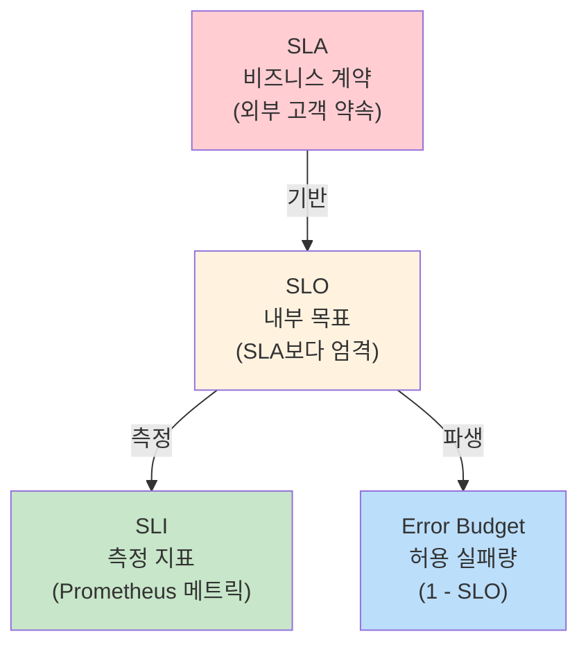
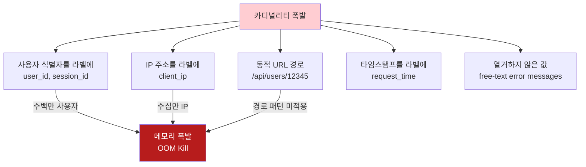
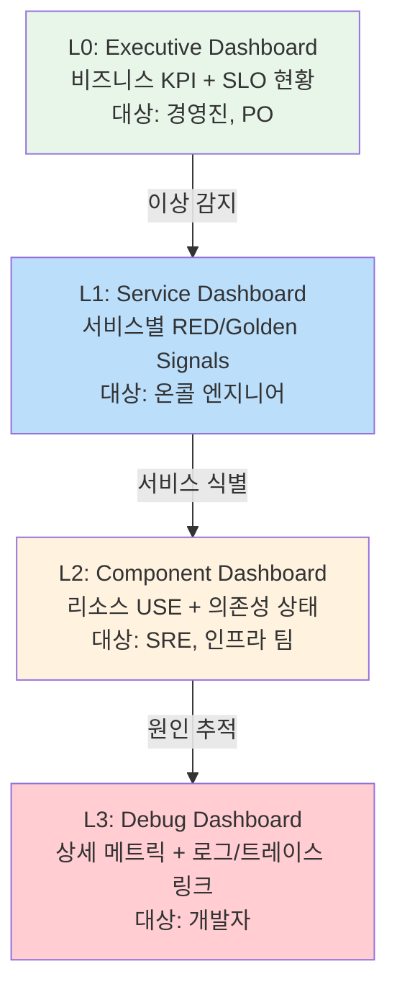
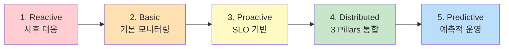

# Observability Best Practices

SLI/SLO/SLA 설계, 카디널리티 관리, 라벨 컨벤션, 대시보드 계층 구조, 성숙도 모델을 통해 Observability 체계를 조직에 체계적으로 도입하고 운영하기 위한 종합 가이드이다.

## 목차
- [1. 핵심 개념 (What)](#1-핵심-개념-what)
- [2. 왜 알아야 하는가 (Why)](#2-왜-알아야-하는가-why)
- [3. 내부 구현 분석 (How)](#3-내부-구현-분석-how)
- [4. 실전 예제](#4-실전-예제)
- [5. 정리](#5-정리)

---

## 1. 핵심 개념 (What)

### SLI / SLO / SLA

Google SRE 방법론에서 정의한 서비스 신뢰성 계층 구조이다.

| 개념 | 정의 | 예시 |
|------|------|------|
| **SLI** (Service Level Indicator) | 서비스 품질을 측정하는 정량적 지표 | "요청의 99%가 200ms 이내에 응답" |
| **SLO** (Service Level Objective) | SLI에 대한 목표 값 | "p99 응답 시간 < 200ms (30일 기준)" |
| **SLA** (Service Level Agreement) | SLO를 포함하는 비즈니스 계약 | "99.9% 가용성 미달 시 크레딧 제공" |



### 카디널리티 (Cardinality)

라벨 조합으로 생성되는 고유한 시계열(time series) 수이다. Prometheus 성능의 핵심 제약 요소이다.

```
카디널리티 = label_1_values * label_2_values * ... * label_n_values

예: http_requests_total{method, handler, status, instance}
    = 4 methods * 50 handlers * 10 statuses * 20 instances
    = 40,000 시리즈
```

### Observability의 Three Pillars + 확장

| Pillar | 도구 | 용도 |
|--------|------|------|
| **Metrics** | Prometheus, Mimir | 시스템 상태의 정량적 추이 |
| **Logs** | Loki, Elasticsearch | 이벤트의 상세 맥락 |
| **Traces** | Tempo, Jaeger | 분산 요청 흐름 추적 |
| **Profiles** | Pyroscope, Parca | 코드 레벨 성능 분석 (확장) |

## 2. 왜 알아야 하는가 (Why)

### 흔한 Anti-Patterns

| Anti-Pattern | 문제 | 해결 |
|-------------|------|------|
| 모든 것을 모니터링 | 카디널리티 폭발, 비용 증가 | SLI 기반 핵심 메트릭 선별 |
| 임의 임계값 알림 | 알림 피로, 무시 | SLO + Error Budget 기반 알림 |
| 대시보드 난립 | "어떤 대시보드를 봐야 하지?" | 계층적 대시보드 구조 |
| 사후 대응만 | 반복되는 장애 패턴 | 성숙도 모델 기반 개선 |

### Best Practice의 비즈니스 가치

- **SLO 기반 의사결정**: "기능 개발 vs. 안정성 투자" 를 Error Budget으로 정량화
- **카디널리티 관리**: Prometheus/Mimir 리소스 비용 최적화
- **대시보드 표준화**: 온콜 엔지니어의 MTTR(Mean Time To Resolve) 단축

## 3. 내부 구현 분석 (How)

### 3.1 SLI/SLO 설계

#### SLI 유형별 PromQL

**가용성 SLI (Availability)**:

```promql
# 성공한 요청 비율
sum(rate(http_requests_total{status_code!~"5.."}[30d]))
/
sum(rate(http_requests_total[30d]))
```

**지연 SLI (Latency)**:

```promql
# 목표 시간(300ms) 이내 응답 비율
sum(rate(http_request_duration_seconds_bucket{le="0.3"}[30d]))
/
sum(rate(http_request_duration_seconds_count[30d]))
```

**정확성 SLI (Correctness)**:

```promql
# 올바른 응답 비율 (비즈니스 검증 메트릭)
sum(rate(api_responses_correct_total[30d]))
/
sum(rate(api_responses_total[30d]))
```

**처리량 SLI (Throughput)**:

```promql
# 큐 처리 성공률
sum(rate(queue_messages_processed_total{result="success"}[30d]))
/
sum(rate(queue_messages_received_total[30d]))
```

#### Error Budget 계산

```promql
# SLO: 99.9% 가용성 (30일 윈도우)
# Error Budget = 1 - 0.999 = 0.1% = 30일 * 24h * 60m * 0.001 = 43.2분

# 남은 Error Budget (%)
1 - (
  (1 - (
    sum(rate(http_requests_total{status_code!~"5.."}[30d]))
    /
    sum(rate(http_requests_total[30d]))
  ))
  /
  (1 - 0.999)
)
```

**Error Budget 기반 알림**:

```yaml
groups:
  - name: slo-error-budget
    rules:
      # Error Budget 소진 속도 기반 알림 (Multiwindow Multi-Burn-Rate)

      # 빠른 소진 (1시간 내 5% 소진) - 긴급
      - alert: ErrorBudgetFastBurn
        expr: |
          (
            1 - (sum(rate(http_requests_total{status_code!~"5.."}[1h]))
            / sum(rate(http_requests_total[1h])))
          ) > (14.4 * (1 - 0.999))
          and
          (
            1 - (sum(rate(http_requests_total{status_code!~"5.."}[5m]))
            / sum(rate(http_requests_total[5m])))
          ) > (14.4 * (1 - 0.999))
        for: 2m
        labels:
          severity: critical
          slo: availability
        annotations:
          summary: "Error Budget 빠른 소진 감지"
          description: "현재 에러율이 SLO 대비 14.4배. 1시간 내 Error Budget 5% 소진 예상."

      # 느린 소진 (6시간 내 5% 소진) - 경고
      - alert: ErrorBudgetSlowBurn
        expr: |
          (
            1 - (sum(rate(http_requests_total{status_code!~"5.."}[6h]))
            / sum(rate(http_requests_total[6h])))
          ) > (6 * (1 - 0.999))
          and
          (
            1 - (sum(rate(http_requests_total{status_code!~"5.."}[30m]))
            / sum(rate(http_requests_total[30m])))
          ) > (6 * (1 - 0.999))
        for: 15m
        labels:
          severity: warning
          slo: availability
```

### 3.2 카디널리티 관리

#### 카디널리티 폭발 원인



#### 방지 전략

**1. Relabel Config로 필터링**:

```yaml
# prometheus.yml
scrape_configs:
  - job_name: 'api-service'
    metric_relabel_configs:
      # 고카디널리티 라벨 제거
      - source_labels: [user_id]
        action: labeldrop

      # URL 경로 정규화
      - source_labels: [handler]
        regex: '/api/users/[0-9]+'
        target_label: handler
        replacement: '/api/users/:id'

      # 불필요한 메트릭 제거
      - source_labels: [__name__]
        regex: 'go_(gc|memstats)_.*'
        action: drop
```

**2. Recording Rules로 집계**:

```yaml
groups:
  - name: cardinality-reduction
    rules:
      # instance 라벨을 제거한 집계 메트릭 생성
      - record: job:http_requests_total:rate5m
        expr: sum(rate(http_requests_total[5m])) by (job, handler, method, status_code)

      # 상세 메트릭은 짧은 리텐션, 집계 메트릭은 긴 리텐션
      - record: job:http_request_duration_seconds:p99
        expr: |
          histogram_quantile(0.99,
            sum(rate(http_request_duration_seconds_bucket[5m])) by (job, le)
          )
```

**3. 카디널리티 모니터링**:

```promql
# 전체 활성 시리즈 수
prometheus_tsdb_head_series

# Job별 시리즈 수
count by (job) ({__name__!=""})

# 메트릭 이름별 시리즈 수 (Top 10)
topk(10, count by (__name__) ({__name__!=""}))

# 라벨별 고유 값 수
count(count by (handler) (http_requests_total))
```

### 3.3 라벨 네이밍 컨벤션

#### 메트릭 네이밍 규칙

| 규칙 | 예시 | 설명 |
|------|------|------|
| snake_case 사용 | `http_request_duration_seconds` | camelCase 금지 |
| 단위 접미사 | `_seconds`, `_bytes`, `_total` | 단위를 메트릭 이름에 포함 |
| `_total` 접미사 | `http_requests_total` | Counter 타입 필수 |
| `_info` 접미사 | `build_info{version="1.2"}` | 정적 정보 노출 |
| 접두사로 도메인 구분 | `myapp_http_requests_total` | 네임스페이스 충돌 방지 |

#### 라벨 네이밍 규칙

| 규칙 | 좋은 예 | 나쁜 예 |
|------|---------|---------|
| snake_case | `status_code` | `statusCode`, `StatusCode` |
| 열거 가능한 값 | `method="GET"` | `path="/api/users/123"` |
| 일관된 이름 | 모든 메트릭에서 `service` | 어떤 건 `svc`, 어떤 건 `service_name` |
| 의미 있는 이름 | `environment="production"` | `env="prod"` (축약 비권장) |

#### 표준 라벨 세트

```yaml
# 권장 표준 라벨
labels:
  # 서비스 식별
  service: "payment-api"        # 서비스 이름
  environment: "production"     # 환경 (production/staging/development)
  cluster: "ap-northeast-2"     # 클러스터/리전

  # 인프라 식별
  instance: "10.0.1.5:8080"     # 자동 할당
  job: "payment-api"            # 스크레이프 설정 이름
  namespace: "payment"          # Kubernetes 네임스페이스

  # 요청 분류
  method: "POST"                # HTTP 메서드
  handler: "/api/v1/payments"   # 엔드포인트 (정규화된)
  status_code: "200"            # HTTP 상태 코드
```

### 3.4 대시보드 계층 구조



#### L0: Executive Dashboard 구성

| 패널 | 데이터 | 시각화 |
|------|--------|--------|
| 전체 가용성 | SLI 가용성 (30일) | Stat (큰 숫자) |
| Error Budget 잔량 | Error Budget (%) | Gauge |
| 핵심 서비스 상태 | 서비스별 UP/DOWN | Status Map |
| 비즈니스 메트릭 | 주문 수, 매출, MAU | Time Series |

#### L1: Service Dashboard 구성

| 패널 | PromQL | 시각화 |
|------|--------|--------|
| Request Rate | `sum(rate(http_requests_total[5m])) by (service)` | Time Series |
| Error Rate | `errors / total * 100` | Time Series + Threshold |
| Latency (p50/p95/p99) | `histogram_quantile(...)` | Time Series |
| SLO Compliance | Error Budget 계산 | Stat + Gauge |
| Top Errors | `topk(5, sum by (status_code, handler) (...))` | Table |

#### L2: Component Dashboard 구성

| 패널 | 대상 | 시각화 |
|------|------|--------|
| CPU/Memory/Disk | node_exporter 메트릭 | Time Series |
| Pod Status | kube_pod_* 메트릭 | Status Map |
| DB Connection Pool | HikariCP / pgbouncer 메트릭 | Gauge |
| Cache Hit Rate | Redis/Memcached 메트릭 | Stat |
| Queue Depth | Kafka/RabbitMQ 메트릭 | Time Series |

### 3.5 Observability 성숙도 모델

| 단계 | 이름 | 특징 | 도구 |
|------|------|------|------|
| **1** | Reactive | 사용자 신고로 장애 인지, 수동 로그 확인 | 로그 파일, SSH |
| **2** | Basic Monitoring | 인프라 메트릭 수집, 임계값 기반 알림 | Prometheus + Grafana 기본 |
| **3** | Proactive | SLO 기반 알림, 대시보드 계층 구조, 자동 대응 | SLO 알림, Recording Rules |
| **4** | Distributed Tracing | 3 Pillars 통합, 메트릭-로그-트레이스 연관 분석 | Prometheus + Loki + Tempo |
| **5** | Predictive | ML 기반 이상 탐지, 자동 스케일링, Chaos Engineering | AIOps, Continuous Profiling |



## 4. 실전 예제

### 예제 1: SLO 기반 모니터링 구축

**Step 1 - SLI/SLO 정의서**:

```yaml
# slo-definitions.yaml
services:
  - name: payment-api
    slos:
      - name: availability
        description: "결제 API 가용성"
        sli:
          type: availability
          metric: http_requests_total
          good_filter: '{status_code!~"5.."}'
          total_filter: '{}'
        objective: 99.95    # 99.95% 가용성
        window: 30d
        # Error Budget: 0.05% = 21.6분/30일

      - name: latency
        description: "결제 API 응답 시간"
        sli:
          type: latency
          metric: http_request_duration_seconds
          threshold: 0.5    # 500ms
        objective: 99.0     # 99%의 요청이 500ms 이내
        window: 30d
```

**Step 2 - Recording Rules**:

```yaml
groups:
  - name: payment-api-slo
    interval: 30s
    rules:
      # SLI: 가용성
      - record: sli:payment_api:availability
        expr: |
          sum(rate(http_requests_total{service="payment-api",status_code!~"5.."}[5m]))
          /
          sum(rate(http_requests_total{service="payment-api"}[5m]))

      # SLI: 지연 (500ms 이내 비율)
      - record: sli:payment_api:latency
        expr: |
          sum(rate(http_request_duration_seconds_bucket{service="payment-api",le="0.5"}[5m]))
          /
          sum(rate(http_request_duration_seconds_count{service="payment-api"}[5m]))

      # Error Budget 잔량 (30일 윈도우)
      - record: slo:payment_api:error_budget_remaining
        expr: |
          1 - (
            (1 - sli:payment_api:availability)
            /
            (1 - 0.9995)
          )

      # Burn Rate (1시간 윈도우)
      - record: slo:payment_api:burn_rate_1h
        expr: |
          (1 - (
            sum(rate(http_requests_total{service="payment-api",status_code!~"5.."}[1h]))
            /
            sum(rate(http_requests_total{service="payment-api"}[1h]))
          ))
          /
          (1 - 0.9995)
```

**Step 3 - Grafana SLO Dashboard**:

```json
{
  "title": "Payment API - SLO Dashboard",
  "uid": "payment-slo",
  "panels": [
    {
      "title": "Availability SLI (30d)",
      "type": "stat",
      "targets": [{ "expr": "sli:payment_api:availability" }],
      "fieldConfig": {
        "defaults": {
          "unit": "percentunit",
          "thresholds": {
            "steps": [
              { "value": 0, "color": "red" },
              { "value": 0.999, "color": "yellow" },
              { "value": 0.9995, "color": "green" }
            ]
          }
        }
      }
    },
    {
      "title": "Error Budget Remaining",
      "type": "gauge",
      "targets": [{ "expr": "slo:payment_api:error_budget_remaining" }],
      "fieldConfig": {
        "defaults": {
          "unit": "percentunit",
          "min": 0,
          "max": 1,
          "thresholds": {
            "steps": [
              { "value": 0, "color": "red" },
              { "value": 0.25, "color": "yellow" },
              { "value": 0.5, "color": "green" }
            ]
          }
        }
      }
    },
    {
      "title": "Burn Rate (1h)",
      "type": "timeseries",
      "targets": [{ "expr": "slo:payment_api:burn_rate_1h" }],
      "fieldConfig": {
        "defaults": {
          "custom": {
            "thresholdsStyle": { "mode": "line" }
          },
          "thresholds": {
            "steps": [
              { "value": 1, "color": "green" },
              { "value": 6, "color": "yellow" },
              { "value": 14.4, "color": "red" }
            ]
          }
        }
      }
    }
  ]
}
```

### 예제 2: 카디널리티 감사 대시보드

```promql
# 전체 시리즈 수 추이
prometheus_tsdb_head_series

# 메트릭별 시리즈 수 Top 20
topk(20, count by (__name__) ({__name__!=""}))

# Job별 시리즈 수
sort_desc(count by (job) ({__name__!=""}))

# 최근 24시간 시리즈 증가율
delta(prometheus_tsdb_head_series[24h])

# Ingestion Rate (초당 샘플 수)
rate(prometheus_tsdb_head_samples_appended_total[5m])
```

**카디널리티 알림**:

```yaml
groups:
  - name: cardinality-alerts
    rules:
      - alert: HighCardinalityMetric
        expr: count by (__name__) ({__name__!=""}) > 10000
        for: 10m
        labels:
          severity: warning
        annotations:
          summary: "고카디널리티 메트릭 감지: {{ $labels.__name__ }}"
          description: "{{ $labels.__name__ }}의 시리즈 수: {{ $value }}. 라벨 검토 필요."

      - alert: TotalSeriesHigh
        expr: prometheus_tsdb_head_series > 1e6
        for: 15m
        labels:
          severity: warning
        annotations:
          summary: "전체 활성 시리즈 100만 초과"
```

### 예제 3: 조직 도입 로드맵

**Phase 1 (1-2개월): Foundation**
```
목표: 기본 인프라 모니터링 구축
- Prometheus + node_exporter 배포
- Grafana 기본 대시보드 (node, kubernetes)
- 핵심 서비스 UP/DOWN 알림
- 성숙도: Level 1 → Level 2
```

**Phase 2 (3-4개월): Service Monitoring**
```
목표: 서비스 레벨 모니터링 확립
- 애플리케이션 메트릭 계측 (RED Method)
- SLI/SLO 정의 (핵심 서비스 2-3개)
- Recording Rules 작성
- 대시보드 계층 구조 (L0/L1)
- 라벨 네이밍 컨벤션 정립
- 성숙도: Level 2 → Level 3
```

**Phase 3 (5-6개월): Advanced Observability**
```
목표: 3 Pillars 통합
- Loki 도입 (구조화 로깅)
- Tempo 도입 (분산 트레이싱)
- 메트릭 → 로그 → 트레이스 상관관계 설정
- Error Budget 기반 알림 전환
- 대시보드 계층 완성 (L0~L3)
- 성숙도: Level 3 → Level 4
```

**Phase 4 (6개월+): Scale & Optimize**
```
목표: 스케일링 및 최적화
- Thanos/Mimir 도입 (장기 보관, 멀티클러스터)
- Grafana Provisioning & GitOps
- 카디널리티 거버넌스 (감사 대시보드 + 알림)
- Continuous Profiling (Pyroscope)
- 성숙도: Level 4 → Level 5
```

## 5. 정리

### SLO 설계 가이드라인

| 원칙 | 설명 |
|------|------|
| 사용자 여정 기반 | 내부 메트릭이 아닌 사용자 경험을 측정 |
| 단순하게 시작 | 처음엔 가용성 + 지연 SLO 2개로 시작 |
| SLO > SLA | 내부 목표는 외부 계약보다 엄격하게 |
| Error Budget 활용 | 안정성 vs. 기능 개발의 균형 도구 |
| 정기 리뷰 | 월 1회 SLO 달성률 및 Error Budget 소진 리뷰 |

### 카디널리티 관리 체크리스트

| 항목 | 권장 |
|------|------|
| 라벨 값 상한 | 라벨당 고유 값 < 100 |
| 전체 시리즈 | 단일 Prometheus < 2M |
| 메트릭당 시리즈 | < 10,000 |
| 금지 라벨 | user_id, session_id, ip_address, timestamp |
| 모니터링 | `prometheus_tsdb_head_series` 상시 감시 |

### 대시보드 계층 구조 요약

| 레벨 | 대상 | 내용 | 갱신 주기 |
|------|------|------|-----------|
| L0 Executive | 경영진/PO | SLO, 비즈니스 KPI | 1분 |
| L1 Service | 온콜 엔지니어 | RED/Golden Signals | 30초 |
| L2 Component | SRE/인프라 | USE Method | 15초 |
| L3 Debug | 개발자 | 상세 메트릭, 로그/트레이스 링크 | 15초 |

### 전체 커리큘럼 연결 지도

| 주제 | 관련 문서 | 핵심 연결 |
|------|-----------|-----------|
| 메트릭 수집 | 기초편 (PromQL, Scrape) | SLI 메트릭 정의의 기반 |
| 알림 규칙 | 기초편 (Alerting) | SLO Error Budget 알림으로 진화 |
| 성능 분석 | 09-performance-bottleneck-analysis | RED/USE Method의 실전 적용 |
| 스케일링 | 10-prometheus-scaling-operations | 카디널리티 관리, 장기 보관 |
| Provisioning | 11-grafana-provisioning-operations | 대시보드 계층 구조의 코드화 |

---
*참고: Google SRE Workbook, Prometheus 2.x, Grafana 10.x, OpenTelemetry 1.x 기준*
