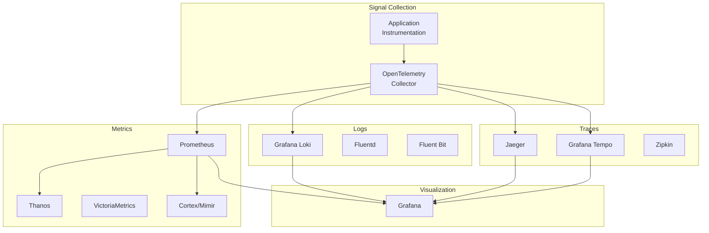
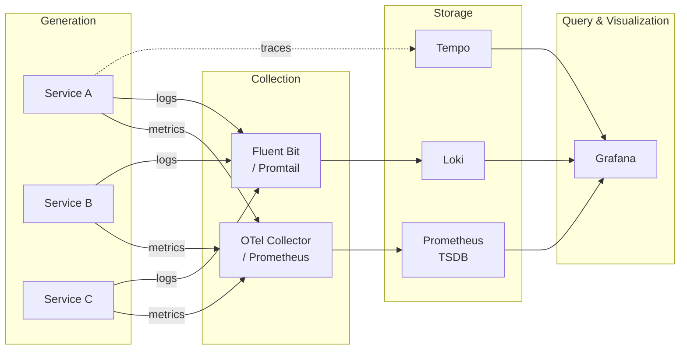

# Observability 개론

현대 분산 시스템에서 "시스템 내부 상태를 외부 출력으로 추론할 수 있는 능력"인 Observability의 핵심 개념, 3대 축(Metrics, Logs, Traces), 그리고 CNCF 생태계를 심층 분석한다.

## 목차
- [1. 핵심 개념 (What)](#1-핵심-개념-what)
- [2. 왜 알아야 하는가 (Why)](#2-왜-알아야-하는가-why)
- [3. 내부 구현 분석 (How)](#3-내부-구현-분석-how)
- [4. 실전 예제](#4-실전-예제)
- [5. 정리](#5-정리)

---

## 1. 핵심 개념 (What)

### Monitoring vs Observability

**Monitoring**은 "미리 정의한 질문에 대한 답"을 제공하는 수동적 접근이다. CPU 사용률이 80%를 넘으면 알림을 보내는 것이 전형적인 모니터링이다.

**Observability**는 "미리 예측하지 못한 질문에도 답할 수 있는 능력"을 의미한다. 제어 이론(Control Theory)에서 유래한 용어로, 시스템의 외부 출력(external outputs)만으로 내부 상태(internal state)를 추론할 수 있는 시스템 속성을 뜻한다.

| 구분 | Monitoring | Observability |
|------|-----------|---------------|
| 질문 유형 | 사전 정의된 질문 (known-unknowns) | 임의의 질문 (unknown-unknowns) |
| 접근 방식 | 대시보드 + 알림 | 탐색(exploration) + 상관 분석 |
| 데이터 소스 | 주로 메트릭 | Metrics + Logs + Traces 통합 |
| 적합한 환경 | 모놀리식/예측 가능한 시스템 | 마이크로서비스/분산 시스템 |
| 장애 대응 | "무엇이" 고장났는지 감지 | "왜" 고장났는지 분석 가능 |

### Observability의 3대 축 (Three Pillars)

```
┌─────────────────────────────────────────────────────────┐
│                    Observability                         │
│                                                         │
│   ┌──────────┐    ┌──────────┐    ┌──────────┐         │
│   │ Metrics  │    │   Logs   │    │  Traces  │         │
│   │          │    │          │    │          │         │
│   │ 숫자형    │    │ 이벤트형  │    │ 요청 흐름  │         │
│   │ 시계열    │    │ 비정형    │    │ 분산 추적  │         │
│   │ 데이터    │    │ 텍스트    │    │ 데이터    │         │
│   └──────────┘    └──────────┘    └──────────┘         │
│        │               │               │               │
│        └───────────────┼───────────────┘               │
│                        │                               │
│              상관 분석 (Correlation)                     │
└─────────────────────────────────────────────────────────┘
```

#### 1) Metrics (메트릭)

시간에 따른 숫자 값의 시계열(time series) 데이터다. 시스템의 상태를 정량적으로 표현한다.

- **특징**: 고정된 스키마, 높은 압축률, 저장 비용 효율적
- **용도**: 알림(alerting), 트렌드 분석, 용량 계획
- **예시**: `http_requests_total`, `process_cpu_seconds_total`
- **도구**: Prometheus, Datadog, InfluxDB, VictoriaMetrics

#### 2) Logs (로그)

특정 시점에 발생한 이벤트를 텍스트 형태로 기록한 데이터다.

- **특징**: 비정형/반정형 데이터, 풍부한 컨텍스트, 저장 비용 높음
- **용도**: 디버깅, 감사(audit), 장애 원인 분석
- **예시**: `{"level":"error","msg":"connection refused","service":"payment","trace_id":"abc123"}`
- **도구**: Loki, Elasticsearch, Fluentd, Splunk

#### 3) Traces (추적)

분산 시스템에서 하나의 요청이 여러 서비스를 거치는 전체 경로를 추적한 데이터다.

- **특징**: Span의 트리 구조, TraceID로 연결, 인과 관계 표현
- **용도**: 지연 시간 분석, 병목 지점 식별, 서비스 의존성 파악
- **예시**: `TraceID: abc123 → [API Gateway: 2ms] → [Auth Service: 15ms] → [DB: 50ms]`
- **도구**: Jaeger, Zipkin, Tempo, AWS X-Ray

### 최근 추가되는 시그널

전통적인 3대 축 외에도 Observability 영역은 확장되고 있다:

- **Profiles** (Continuous Profiling): 함수 수준의 CPU/메모리 사용량 분석 (Pyroscope, Parca)
- **Events**: 배포, 설정 변경 등 이산적 시스템 이벤트
- **RUM** (Real User Monitoring): 실제 사용자 경험 데이터

---

## 2. 왜 알아야 하는가 (Why)

### 마이크로서비스의 복잡성 폭발

모놀리식 아키텍처에서는 하나의 프로세스를 디버깅하면 됐다. 하지만 마이크로서비스 아키텍처에서 하나의 사용자 요청은 수십 개의 서비스를 거친다. 서비스 수가 N개일 때 잠재적 장애 지점은 O(N^2)로 증가한다.

### MTTR(Mean Time To Recovery) 단축

Observability의 궁극적 목표는 MTTR 단축이다:

```
장애 감지 (Detection)    ─── Metrics + Alerting
  │
  ▼
원인 분석 (Diagnosis)     ─── Logs + Traces 상관 분석
  │
  ▼
복구 (Recovery)          ─── 근본 원인 기반 정확한 조치
  │
  ▼
예방 (Prevention)        ─── 패턴 분석 + 용량 계획
```

### 실무에서의 가치

1. **경보 피로(Alert Fatigue) 감소**: 의미 있는 메트릭 기반 알림으로 불필요한 경보 제거
2. **SLO/SLI 기반 운영**: 비즈니스 목표에 맞춘 서비스 수준 지표 관리
3. **비용 최적화**: 리소스 사용량의 정량적 분석을 통한 인프라 비용 절감
4. **장애 사후 분석(Postmortem)**: 정확한 데이터 기반의 체계적 장애 분석

---

## 3. 내부 구현 분석 (How)

### CNCF Observability Landscape



### OpenTelemetry (OTel) 개요

OpenTelemetry는 CNCF의 두 번째로 활발한 프로젝트로, Observability 데이터의 수집/전송을 위한 통합 표준이다.

#### OTel의 핵심 컴포넌트

```
┌──────────────────────────────────────────────────────┐
│                  OpenTelemetry                        │
│                                                      │
│  ┌─────────┐  ┌──────────┐  ┌──────────────────┐   │
│  │   API   │  │   SDK    │  │   Collector      │   │
│  │         │  │          │  │                  │   │
│  │ Spec/   │  │ 구현체    │  │  Receiver →     │   │
│  │ 인터페이스│  │ + Export │  │  Processor →    │   │
│  │         │  │          │  │  Exporter        │   │
│  └─────────┘  └──────────┘  └──────────────────┘   │
│                                                      │
│  ┌──────────────────────────────────────────────┐   │
│  │         OTLP (OpenTelemetry Protocol)         │   │
│  │     gRPC / HTTP를 통한 표준 전송 프로토콜        │   │
│  └──────────────────────────────────────────────┘   │
└──────────────────────────────────────────────────────┘
```

| 컴포넌트 | 역할 |
|---------|------|
| **API** | 언어별 계측 인터페이스 (vendor-agnostic) |
| **SDK** | API의 구현체, Span/Metric 처리 및 내보내기 |
| **Collector** | 데이터 수신(Receiver), 처리(Processor), 내보내기(Exporter) 파이프라인 |
| **OTLP** | 시그널 전송을 위한 표준 와이어 프로토콜 |

#### OTel과 Prometheus의 관계

OpenTelemetry는 Prometheus와 상호 보완적 관계를 가진다:

- **OTel SDK** → Prometheus Exporter로 메트릭 노출 가능
- **OTel Collector** → Prometheus Remote Write로 메트릭 전송 가능
- **Prometheus** → OTLP receiver로 OTel 메트릭 수신 가능 (실험적)
- **OpenMetrics** 표준이 두 프로젝트를 연결하는 공통 기반

### Observability 파이프라인 아키텍처



---

## 4. 실전 예제

### 예제 1: Go 애플리케이션에 OpenTelemetry 계측 추가

```go
package main

import (
    "context"
    "log"
    "net/http"
    "time"

    "go.opentelemetry.io/otel"
    "go.opentelemetry.io/otel/exporters/prometheus"
    "go.opentelemetry.io/otel/metric"
    sdkmetric "go.opentelemetry.io/otel/sdk/metric"
    promclient "github.com/prometheus/client_golang/prometheus/promhttp"
)

func main() {
    // Prometheus exporter 설정
    exporter, err := prometheus.New()
    if err != nil {
        log.Fatalf("failed to create prometheus exporter: %v", err)
    }

    // MeterProvider 생성
    provider := sdkmetric.NewMeterProvider(
        sdkmetric.WithReader(exporter),
    )
    otel.SetMeterProvider(provider)

    // 메트릭 생성
    meter := otel.Meter("myapp")
    requestCounter, _ := meter.Int64Counter(
        "http_requests_total",
        metric.WithDescription("Total number of HTTP requests"),
    )
    requestDuration, _ := meter.Float64Histogram(
        "http_request_duration_seconds",
        metric.WithDescription("HTTP request duration in seconds"),
    )

    // HTTP 핸들러
    http.HandleFunc("/api", func(w http.ResponseWriter, r *http.Request) {
        start := time.Now()
        defer func() {
            duration := time.Since(start).Seconds()
            requestCounter.Add(r.Context(), 1)
            requestDuration.Record(r.Context(), duration)
        }()
        w.WriteHeader(http.StatusOK)
        w.Write([]byte("OK"))
    })

    // /metrics 엔드포인트 노출
    http.Handle("/metrics", promclient.Handler())
    log.Fatal(http.ListenAndServe(":8080", nil))
}
```

### 예제 2: 3대 축을 연결하는 Grafana 대시보드 구성 (docker-compose)

```yaml
# docker-compose.yml
version: '3.8'

services:
  prometheus:
    image: prom/prometheus:v3.2.1
    volumes:
      - ./prometheus.yml:/etc/prometheus/prometheus.yml
    ports:
      - "9090:9090"

  loki:
    image: grafana/loki:3.4.2
    ports:
      - "3100:3100"
    command: -config.file=/etc/loki/local-config.yaml

  tempo:
    image: grafana/tempo:2.7.1
    ports:
      - "3200:3200"    # tempo
      - "4317:4317"    # otlp grpc
    command: ["-config.file=/etc/tempo/tempo.yaml"]

  grafana:
    image: grafana/grafana:11.5.2
    ports:
      - "3000:3000"
    environment:
      - GF_AUTH_ANONYMOUS_ENABLED=true
      - GF_AUTH_ANONYMOUS_ORG_ROLE=Admin
    volumes:
      - ./grafana/provisioning:/etc/grafana/provisioning
```

```yaml
# grafana/provisioning/datasources/datasources.yaml
apiVersion: 1

datasources:
  - name: Prometheus
    type: prometheus
    access: proxy
    url: http://prometheus:9090
    isDefault: true

  - name: Loki
    type: loki
    access: proxy
    url: http://loki:3100

  - name: Tempo
    type: tempo
    access: proxy
    url: http://tempo:3200
```

### 예제 3: Prometheus의 기본 scrape 설정

```yaml
# prometheus.yml
global:
  scrape_interval: 15s
  evaluation_interval: 15s

scrape_configs:
  - job_name: 'myapp'
    static_configs:
      - targets: ['app:8080']

  - job_name: 'node-exporter'
    static_configs:
      - targets: ['node-exporter:9100']
```

---

## 5. 정리

| 항목 | 설명 |
|------|------|
| **Observability** | 외부 출력으로 시스템 내부 상태를 추론하는 능력 |
| **Monitoring과의 차이** | Monitoring은 known-unknowns, Observability는 unknown-unknowns 대응 |
| **Metrics** | 시계열 숫자 데이터 — 알림, 트렌드, 용량 계획 |
| **Logs** | 이벤트 텍스트 데이터 — 디버깅, 감사, 원인 분석 |
| **Traces** | 분산 요청 경로 데이터 — 지연 분석, 병목 식별 |
| **OpenTelemetry** | 3대 축을 통합하는 CNCF 표준 계측/수집 프레임워크 |
| **CNCF 스택** | Prometheus(Metrics) + Loki(Logs) + Tempo(Traces) + Grafana(Visualization) |
| **핵심 가치** | MTTR 단축, SLO 기반 운영, 비용 최적화 |

---
*참고: OpenTelemetry v1.34+ (Stable), Prometheus v3.2.x, Grafana v11.5.x 기준*
