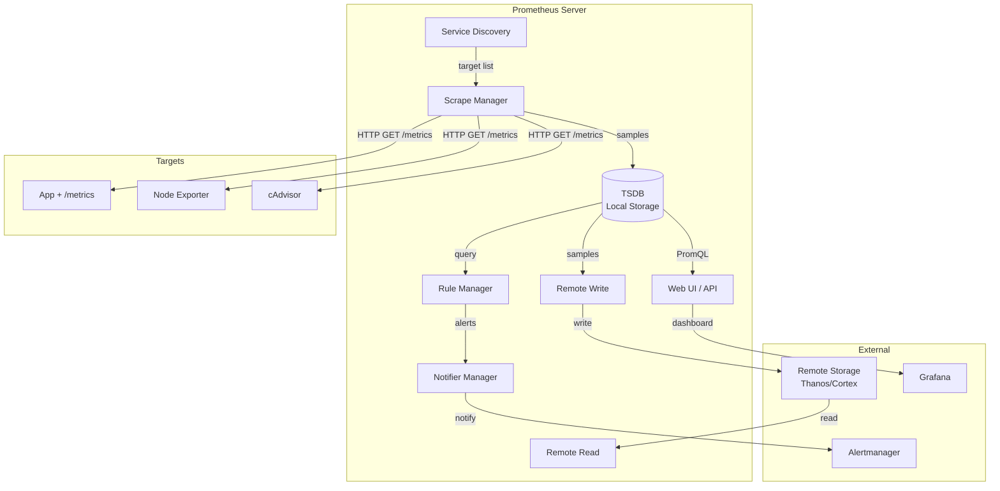
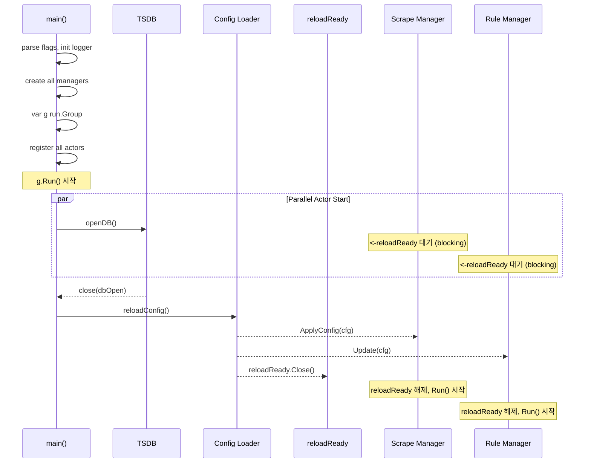

# Prometheus 아키텍처 전체 조감도

Prometheus의 Pull-based 설계 철학, `oklog/run.Group` 기반 컴포넌트 오케스트레이션, `cmd/prometheus/main.go` 부팅 순서를 소스코드 수준에서 상세 분석한다.

## 목차
- [1. 핵심 개념 (What)](#1-핵심-개념-what)
- [2. 왜 알아야 하는가 (Why)](#2-왜-알아야-하는가-why)
- [3. 내부 구현 분석 (How)](#3-내부-구현-분석-how)
- [4. 실전 예제](#4-실전-예제)
- [5. 정리](#5-정리)

---

## 1. 핵심 개념 (What)

### Pull-based vs Push-based

Prometheus의 가장 핵심적인 설계 결정은 **Pull-based** 모델이다.

```
Push-based (StatsD, Graphite):        Pull-based (Prometheus):

  App ──push──▶ Collector              Prometheus ──GET /metrics──▶ App
  App ──push──▶ Collector              Prometheus ──GET /metrics──▶ App
  App ──push──▶ Collector              Prometheus ──GET /metrics──▶ App

  앱이 메트릭을 능동적으로 전송          Prometheus가 주기적으로 수집
```

| 특성 | Pull-based | Push-based |
|------|-----------|-----------|
| 타겟 상태 감지 | 스크래핑 실패 = 타겟 다운 | 별도 health check 필요 |
| 네트워크 방향 | Prometheus → 타겟 | 타겟 → 수집기 |
| 부하 제어 | Prometheus가 주도 (간격 조절) | 타겟이 주도 (폭주 위험) |
| 디버깅 | 브라우저로 `/metrics` 직접 확인 | 패킷 캡처 필요 |
| NAT/방화벽 | 타겟에 접근 가능해야 함 | 수집기에 접근 가능해야 함 |
| 짧은 수명 작업 | Pushgateway 필요 | 자연스럽게 처리 |

### Prometheus 고수준 아키텍처



### 핵심 컴포넌트 요약

| 컴포넌트 | 역할 | 소스 위치 |
|---------|------|----------|
| **Scrape Manager** | 타겟 스크래핑 관리 | `scrape/manager.go` |
| **Discovery Manager** | Service Discovery 실행 | `discovery/manager.go` |
| **TSDB** | 시계열 데이터 로컬 저장소 | `tsdb/` |
| **Rule Manager** | Recording/Alerting rules 평가 | `rules/manager.go` |
| **Notifier** | Alertmanager로 알림 전송 | `notifier/notifier.go` |
| **Web Handler** | HTTP API + UI 서빙 | `web/handler.go` |
| **Remote Storage** | Remote Write/Read | `storage/remote/` |

---

## 2. 왜 알아야 하는가 (Why)

### 운영 문제 해결을 위한 아키텍처 이해

Prometheus 운영 시 자주 만나는 문제들은 아키텍처 이해 없이는 해결하기 어렵다:

1. **메모리 폭증**: TSDB의 head block 구조, 시계열 카디널리티 관계 이해 필요
2. **스크래핑 지연**: Scrape Manager의 타겟 동기화, jitter offset 메커니즘 이해 필요
3. **설정 리로드 실패**: Config reload chain의 순서와 실패 전파 경로 파악 필요
4. **HA 구성**: 각 컴포넌트의 상태 특성(stateful/stateless) 이해 필요

### 확장과 커스터마이징

Prometheus의 플러그인 아키텍처를 이해하면:
- 커스텀 Service Discovery 구현 가능
- Remote Write/Read 백엔드 교체 가능
- PromQL 쿼리 엔진 최적화 가능

---

## 3. 내부 구현 분석 (How)

### oklog/run.Group 기반 Actor 모델

Prometheus는 `oklog/run.Group`을 사용하여 여러 독립적인 컴포넌트(actor)를 관리한다. 이 패턴의 핵심 규칙은 **하나의 actor가 종료되면, 나머지 모든 actor의 interrupt 함수가 호출**된다는 것이다.

```go
// oklog/run.Group의 핵심 구조
type Group struct {
    actors []actor
}

type actor struct {
    execute   func() error      // 메인 로직
    interrupt func(error)        // 종료 요청
}
```

#### `cmd/prometheus/main.go`의 run.Group Actors (line 1133+)

```go
var g run.Group
```

`cmd/prometheus/main.go`에서 등록되는 actor들은 다음과 같다:

```
┌─────────────────────────────────────────────────────────┐
│                   run.Group Actors                       │
│                                                         │
│  1. Termination Handler                                 │
│     execute:   SIGTERM/SIGINT 대기                       │
│     interrupt: cancel 채널 닫기, web=Stopping 설정        │
│                                                         │
│  2. Scrape Discovery Manager                            │
│     execute:   discoveryManagerScrape.Run()              │
│     interrupt: cancelScrape()                           │
│                                                         │
│  3. Notify Discovery Manager                            │
│     execute:   discoveryManagerNotify.Run()              │
│     interrupt: cancelNotify()                           │
│                                                         │
│  4. Rule Manager (server mode only)                     │
│     execute:   <-reloadReady; ruleManager.Run()         │
│     interrupt: ruleManager.Stop()                       │
│                                                         │
│  5. Scrape Manager                                      │
│     execute:   <-reloadReady; scrapeManager.Run(syncCh) │
│     interrupt: scrapeManager.Stop()                     │
│                                                         │
│  6. Tracing Manager                                     │
│     execute:   <-reloadReady; tracingManager.Run()      │
│     interrupt: tracingManager.Stop()                    │
│                                                         │
│  7. Reload Handler (SIGHUP + web reload + auto-reload)  │
│     execute:   <-reloadReady; SIGHUP/web/tick 대기       │
│     interrupt: cancel 채널로 종료                        │
│                                                         │
│  8. Initial Configuration Loading                       │
│     execute:   <-dbOpen; reloadConfig(); reloadReady    │
│     interrupt: cancel 채널 닫기                          │
│                                                         │
│  9. TSDB (server mode only)                             │
│     execute:   openDB(); close(dbOpen); <-cancel        │
│     interrupt: db.Close()                               │
│                                                         │
│  10. Web Handler                                        │
│     execute:   webHandler.Run(listeners, webConfig)     │
│     interrupt: 리스너 닫기                               │
│                                                         │
│  11. Notifier Manager                                   │
│     execute:   <-reloadReady; notifierManager.Run()     │
│     interrupt: notifierManager.Stop()                   │
│                                                         │
│  12. Remote Storage (optional)                          │
│     execute:   remoteStorage.Run(); close(dbOpen)       │
│     interrupt: remoteStorage.Close()                    │
└─────────────────────────────────────────────────────────┘
```

### 부팅 순서 상세 분석



핵심 부팅 흐름:

1. **플래그 파싱 및 로거 초기화**: `kingpin` 기반 CLI 인자 파싱
2. **매니저 인스턴스 생성**: scrapeManager, ruleManager, notifierManager 등
3. **run.Group에 actor 등록**: 각 컴포넌트를 (execute, interrupt) 쌍으로 등록
4. **g.Run() 호출**: 모든 actor의 execute 함수를 goroutine으로 시작
5. **TSDB 초기화**: `openDB()` → `close(dbOpen)` 시그널
6. **초기 설정 로딩**: `reloadConfig()` 호출 → 각 매니저에 `ApplyConfig()`
7. **reloadReady 해제**: 대기 중이던 Scrape Manager, Rule Manager 등이 시작
8. **Web Handler Ready**: `SetReady(web.Ready)` → 요청 수락 시작

### 설정 리로드 체인 (`config/config.go`)

설정 리로드는 3가지 트리거로 발생한다:

```
트리거:
  1. SIGHUP 시그널
  2. Web API: POST /-/reload
  3. Auto-reload (파일 체크섬 변경 감지)

      │
      ▼
reloadConfig(configFile, ...)
      │
      ▼
config.LoadFile(filename)     ← config/config.go:LoadFile
      │
      ▼
순차적으로 reloaders 호출:
  ├── remoteStorage.ApplyConfig()
  ├── webHandler.ApplyConfig()
  ├── discoveryManagerScrape.ApplyConfig()
  ├── discoveryManagerNotify.ApplyConfig()
  ├── scrapeManager.ApplyConfig()    ← 스크래핑 설정 갱신
  ├── ruleManager.Update()           ← 룰 파일 재로딩
  └── notifierManager.ApplyConfig()  ← 알림 설정 갱신
```

#### Config 구조체 (`config/config.go`)

```go
type Config struct {
    GlobalConfig   GlobalConfig      `yaml:"global"`
    Runtime        RuntimeConfig     `yaml:"runtime,omitempty"`
    AlertingConfig AlertingConfig    `yaml:"alerting,omitempty"`
    RuleFiles      []string          `yaml:"rule_files,omitempty"`
    ScrapeConfigs  []*ScrapeConfig   `yaml:"scrape_configs,omitempty"`
    RemoteWriteConfigs []*RemoteWriteConfig `yaml:"remote_write,omitempty"`
    RemoteReadConfigs  []*RemoteReadConfig  `yaml:"remote_read,omitempty"`
    OTLPConfig     OTLPConfig        `yaml:"otlp,omitempty"`
}
```

#### GlobalConfig 기본값

```go
DefaultGlobalConfig = GlobalConfig{
    ScrapeInterval:     model.Duration(1 * time.Minute),
    ScrapeTimeout:      model.Duration(10 * time.Second),
    EvaluationInterval: model.Duration(1 * time.Minute),
    MetricNameValidationScheme: model.UTF8Validation,
    MetricNameEscapingScheme:   model.AllowUTF8,
}
```

### Agent Mode

Prometheus v2.32+에서 도입된 Agent Mode는 로컬 TSDB 없이 Remote Write만 수행하는 경량 모드다:

```go
// config/config.go:LoadFile (line 134+)
if agentMode {
    // alerting, rule_files, remote_read 필드 사용 불가
    if len(cfg.AlertingConfig.AlertmanagerConfigs) > 0 { ... }
    if len(cfg.RuleFiles) > 0 { ... }
    if len(cfg.RemoteReadConfigs) > 0 { ... }
}
```

```
Server Mode:                        Agent Mode:
┌──────────────────┐               ┌──────────────────┐
│ Service Discovery│               │ Service Discovery│
│ Scrape Manager   │               │ Scrape Manager   │
│ TSDB             │               │ WAL (only)       │
│ Rule Manager     │               │ Remote Write     │
│ Notifier         │               └──────────────────┘
│ Web UI           │                제외: TSDB, Rules,
│ Remote Write/Read│                     Alerting, UI
└──────────────────┘
```

---

## 4. 실전 예제

### 예제 1: Prometheus 전체 설정 파일

```yaml
# prometheus.yml
global:
  scrape_interval: 15s
  scrape_timeout: 10s
  evaluation_interval: 15s
  external_labels:
    cluster: production
    region: ap-northeast-2

# Recording rules & alerting rules
rule_files:
  - "rules/*.yml"

# Alertmanager 연결
alerting:
  alertmanagers:
    - static_configs:
        - targets: ['alertmanager:9093']

# Scrape 대상 설정
scrape_configs:
  # Prometheus 자체 메트릭
  - job_name: 'prometheus'
    static_configs:
      - targets: ['localhost:9090']

  # Kubernetes Pod 자동 발견
  - job_name: 'kubernetes-pods'
    kubernetes_sd_configs:
      - role: pod
    relabel_configs:
      - source_labels: [__meta_kubernetes_pod_annotation_prometheus_io_scrape]
        action: keep
        regex: true
      - source_labels: [__meta_kubernetes_pod_annotation_prometheus_io_path]
        action: replace
        target_label: __metrics_path__
        regex: (.+)
      - source_labels: [__address__, __meta_kubernetes_pod_annotation_prometheus_io_port]
        action: replace
        regex: ([^:]+)(?::\d+)?;(\d+)
        replacement: $1:$2
        target_label: __address__

  # Node Exporter (file-based SD)
  - job_name: 'node-exporter'
    file_sd_configs:
      - files:
          - 'targets/nodes/*.json'
        refresh_interval: 5m

# Remote Write (장기 저장)
remote_write:
  - url: "http://thanos-receive:19291/api/v1/receive"
    queue_config:
      max_samples_per_send: 5000
      batch_send_deadline: 5s
```

### 예제 2: 설정 리로드 확인

```bash
# 방법 1: SIGHUP 시그널
kill -HUP $(pidof prometheus)

# 방법 2: HTTP API
curl -X POST http://localhost:9090/-/reload

# 리로드 성공 여부 확인
curl -s http://localhost:9090/api/v1/status/config | jq '.status'

# 리로드 메트릭으로 확인
curl -s http://localhost:9090/metrics | grep prometheus_config_last_reload
# prometheus_config_last_reload_successful 1
# prometheus_config_last_reload_success_timestamp_seconds 1.708300000e+09
```

### 예제 3: Agent Mode 실행

```bash
# Agent Mode로 Prometheus 시작
prometheus \
  --enable-feature=agent \
  --config.file=prometheus-agent.yml \
  --storage.agent.path=/tmp/prometheus-agent
```

```yaml
# prometheus-agent.yml
global:
  scrape_interval: 15s

scrape_configs:
  - job_name: 'myapp'
    static_configs:
      - targets: ['app:8080']

# Agent Mode에서는 remote_write 필수
remote_write:
  - url: "http://mimir:9009/api/v1/push"
```

---

## 5. 정리

| 항목 | 설명 |
|------|------|
| **Pull-based 모델** | Prometheus가 타겟에 HTTP GET 요청 → 타겟 상태 자동 감지, 부하 제어 용이 |
| **oklog/run.Group** | 모든 컴포넌트를 (execute, interrupt) 쌍으로 관리, 하나 종료 시 전체 graceful shutdown |
| **부팅 순서** | TSDB 초기화 → Config 로딩 → reloadReady 해제 → 각 매니저 Run() |
| **Actor 수** | 10+ actors (Termination, Discovery x2, Scrape, Rule, Tracing, Reload, Config, TSDB, Web, Notifier, Remote) |
| **설정 리로드** | SIGHUP / HTTP POST / Auto-reload → reloadConfig() → 각 매니저 ApplyConfig() 순차 호출 |
| **Config 구조** | global, scrape_configs, rule_files, alerting, remote_write/read |
| **Agent Mode** | TSDB/Rules/Alerting 없이 Scrape + Remote Write만 수행하는 경량 모드 |

---
*참고: Prometheus v3.2.x, oklog/run v1.1.0, `cmd/prometheus/main.go` line 1133+ 기준*
