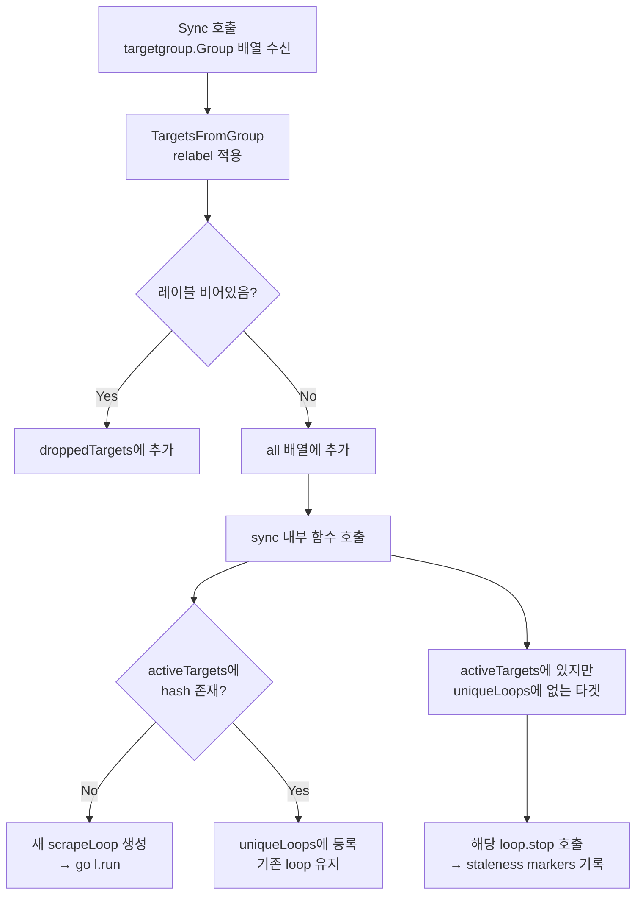
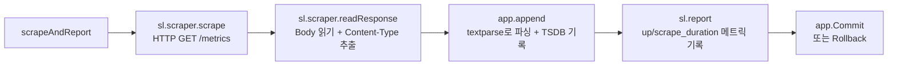

# Prometheus Scraping 내부 구현

Prometheus 스크래핑 엔진의 3계층 구조(Manager → scrapePool → scrapeLoop)와 HTTP GET → textparse → Appender 파이프라인, 해시 기반 jitter offset, 타겟 동기화 메커니즘을 소스코드 수준에서 분석한다.

## 목차
- [1. 핵심 개념 (What)](#1-핵심-개념-what)
- [2. 왜 알아야 하는가 (Why)](#2-왜-알아야-하는가-why)
- [3. 내부 구현 분석 (How)](#3-내부-구현-분석-how)
- [4. 실전 예제](#4-실전-예제)
- [5. 정리](#5-정리)

---

## 1. 핵심 개념 (What)

### 스크래핑(Scraping) 정의

스크래핑은 Prometheus가 모니터링 대상(target)의 `/metrics` 엔드포인트에 HTTP GET 요청을 보내 메트릭 데이터를 수집하는 과정이다. 이 과정은 단순한 HTTP 요청이 아니라, 타겟 발견 → 레이블 가공 → HTTP 요청 → 텍스트 파싱 → 저장소 기록이라는 복잡한 파이프라인으로 구성된다.

### 3계층 구조 개요

```
┌──────────────────────────────────────────────────────────┐
│                    scrape.Manager                         │
│  - 전체 스크래핑 생명주기 관리                               │
│  - config 변경 시 scrapePool 생성/삭제                      │
│  - Discovery Manager로부터 타겟셋 수신                      │
│                                                          │
│  ┌────────────────────────────────────────────────────┐  │
│  │              scrapePool (per job_name)             │  │
│  │  - 동일 job의 모든 타겟 관리                          │  │
│  │  - HTTP 클라이언트 공유                               │  │
│  │  - 타겟 동기화 (Sync)                                │  │
│  │                                                    │  │
│  │  ┌──────────┐ ┌──────────┐ ┌──────────┐           │  │
│  │  │scrapeLoop│ │scrapeLoop│ │scrapeLoop│  ...      │  │
│  │  │ target A │ │ target B │ │ target C │           │  │
│  │  │ (1 gortn)│ │ (1 gortn)│ │ (1 gortn)│           │  │
│  │  └──────────┘ └──────────┘ └──────────┘           │  │
│  └────────────────────────────────────────────────────┘  │
│                                                          │
│  ┌────────────────────────────────────────────────────┐  │
│  │              scrapePool (another job)              │  │
│  │  ...                                               │  │
│  └────────────────────────────────────────────────────┘  │
└──────────────────────────────────────────────────────────┘
```

---

## 2. 왜 알아야 하는가 (Why)

### 스크래핑 문제 진단

프로덕션 환경에서 자주 발생하는 문제들:

1. **"context deadline exceeded"**: 타임아웃보다 응답이 느린 타겟 → `scrape_timeout` 조정 필요
2. **"sample limit exceeded"**: 한 번의 스크래핑에서 반환되는 시계열 수 초과 → `sample_limit` 설정
3. **"server returned HTTP status 503"**: 타겟 서버의 일시적 부하 → 재시도 아님, 다음 interval까지 대기
4. **스크래핑 간격 불균일**: jitter offset 동작 원리 이해 필요
5. **메모리 증가**: 새 타겟 추가 시 시계열 카디널리티 폭발 → scrapePool.Sync() 모니터링

### 커스텀 Exporter 개발 시 필수 지식

Exporter를 개발할 때 스크래핑 엔진의 동작을 이해해야 한다:
- 응답 시간이 `scrape_timeout`을 초과하면 안 됨
- Content-Type 헤더가 올바르게 설정되어야 함
- 타겟 다운 시 staleness marker 처리 메커니즘

---

## 3. 내부 구현 분석 (How)

### Manager 구조체 (`scrape/manager.go`)

```go
// Manager maintains a set of scrape pools and manages start/stop
// cycles when receiving new target groups from the discovery manager.
type Manager struct {
    opts           *Options
    logger         *slog.Logger
    appendable     storage.Appendable
    appendableV2   storage.AppendableV2

    graceShut      chan struct{}
    offsetSeed     uint64              // HA 환경에서 스크래핑 분산을 위한 시드

    mtxScrape      sync.Mutex
    scrapeConfigs  map[string]*config.ScrapeConfig  // job_name → config
    scrapePools    map[string]*scrapePool            // job_name → pool
    targetSets     map[string][]*targetgroup.Group   // job_name → groups

    triggerReload  chan struct{}
    metrics        *scrapeMetrics
    buffers        *pool.Pool
}
```

### Manager.Run() — 이벤트 루프 (`scrape/manager.go:160`)

```go
func (m *Manager) Run(tsets <-chan map[string][]*targetgroup.Group) error {
    go m.reloader()           // 별도 goroutine에서 reload 처리
    for {
        select {
        case ts := <-tsets:   // Discovery Manager로부터 타겟셋 수신
            m.updateTsets(ts)
            select {
            case m.triggerReload <- struct{}{}: // reload 트리거
            default:                            // 이미 대기 중이면 스킵
            }
        case <-m.graceShut:
            return nil
        }
    }
}
```

### Reload 메커니즘 (`scrape/manager.go:186`)

```go
func (m *Manager) reloader() {
    reloadIntervalDuration := m.opts.DiscoveryReloadInterval
    if reloadIntervalDuration == 0 {
        reloadIntervalDuration = 5 * time.Second  // 기본 5초 throttle
    }

    ticker := time.NewTicker(time.Duration(reloadIntervalDuration))
    for {
        select {
        case <-m.graceShut:
            return
        case <-ticker.C:
            select {
            case <-m.triggerReload:
                m.reload()   // 실제 reload 수행
            case <-m.graceShut:
                return
            }
        }
    }
}
```

핵심: triggerReload는 **버퍼 크기 1의 채널**이다. 여러 타겟셋 업데이트가 빠르게 들어와도, 5초 간격의 ticker가 실제 reload를 throttle한다.

### Manager.reload() — Pool 생성과 타겟 동기화 (`scrape/manager.go:211`)

```go
func (m *Manager) reload() {
    m.mtxScrape.Lock()
    var wg sync.WaitGroup
    for setName, groups := range m.targetSets {
        if _, ok := m.scrapePools[setName]; !ok {
            // 새로운 job → scrapePool 생성
            sp, err := newScrapePool(scrapeConfig, ...)
            m.scrapePools[setName] = sp
        }
        wg.Add(1)
        go func(sp *scrapePool, groups []*targetgroup.Group) {
            sp.Sync(groups)  // 병렬로 타겟 동기화
            wg.Done()
        }(m.scrapePools[setName], groups)
    }
    m.mtxScrape.Unlock()
    wg.Wait()
}
```

### scrapePool 구조체 (`scrape/scrape.go:84`)

```go
type scrapePool struct {
    appendable     storage.Appendable
    appendableV2   storage.AppendableV2
    logger         *slog.Logger
    ctx            context.Context
    cancel         context.CancelFunc
    options        *Options

    config         *config.ScrapeConfig
    client         *http.Client             // 풀 내 공유 HTTP 클라이언트
    loops          map[uint64]loop           // target hash → scrapeLoop
    activeTargets  map[uint64]*Target        // target hash → Target
    droppedTargets []*Target

    symbolTable    *labels.SymbolTable       // 레이블 문자열 인터닝
    metrics        *scrapeMetrics
    buffers        *pool.Pool
    offsetSeed     uint64
}
```

### scrapePool.Sync() — 타겟 동기화 (`scrape/scrape.go:399`)



핵심 코드:

```go
func (sp *scrapePool) sync(targets []*Target) {
    uniqueLoops := make(map[uint64]loop)

    for _, t := range targets {
        hash := t.hash()
        if _, ok := sp.activeTargets[hash]; !ok {
            // 새 타겟: scrapeLoop 생성
            l := sp.newLoop(scrapeLoopOptions{
                target:  t,
                scraper: &targetScraper{...},
                cache:   newScrapeCache(sp.metrics),
                ...
            })
            sp.activeTargets[hash] = t
            sp.loops[hash] = l
            uniqueLoops[hash] = l
        }
    }

    // 사라진 타겟: loop 중지
    for hash := range sp.activeTargets {
        if _, ok := uniqueLoops[hash]; !ok {
            go sp.loops[hash].stop()  // staleness markers 기록
            delete(sp.loops, hash)
            delete(sp.activeTargets, hash)
        }
    }

    // 새 loop 시작
    for _, l := range uniqueLoops {
        if l != nil {
            go l.run(nil)
        }
    }
}
```

### Target.hash() — 타겟 식별 (`scrape/target.go:144`)

```go
func (t *Target) hash() uint64 {
    h := fnv.New64a()
    fmt.Fprintf(h, "%016d", t.labels.Hash())
    h.Write([]byte(t.URL().String()))
    return h.Sum64()
}
```

타겟 식별은 **레이블 해시 + URL 문자열**의 FNV-1a 해시로 결정된다. 동일한 타겟이 다른 Discovery 소스에서 발견되어도 같은 hash를 가지므로 중복이 방지된다.

### Target.offset() — 해시 기반 Jitter (`scrape/target.go:155`)

```go
func (t *Target) offset(interval time.Duration, offsetSeed uint64) time.Duration {
    now := time.Now().UnixNano()

    var (
        base   = int64(interval) - now%int64(interval)
        offset = (t.hash() ^ offsetSeed) % uint64(interval)
        next   = base + int64(offset)
    )

    if next > int64(interval) {
        next -= int64(interval)
    }
    return time.Duration(next)
}
```

이 함수가 중요한 이유:

```
offsetSeed = FQDN + external_labels 기반 해시

타겟 A: hash=100, interval=15s → offset = (100 ^ seed) % 15s = 3.2s
타겟 B: hash=200, interval=15s → offset = (200 ^ seed) % 15s = 11.7s
타겟 C: hash=300, interval=15s → offset = (300 ^ seed) % 15s = 7.1s

결과: 15초 간격 안에서 스크래핑 시점이 고르게 분산됨
```

```
시간축:
0s      3.2s    7.1s    11.7s   15s
├───────┼───────┼───────┼───────┤
        A       C       B       (첫 scrape)
        A       C       B       (두번째 scrape)
```

HA 환경에서 `offsetSeed`가 다른 두 Prometheus 서버는 동일한 타겟에 대해 **다른 시점에** 스크래핑한다. 이로 인해 타겟의 부하가 분산된다.

### scrapeLoop 구조체 (`scrape/scrape.go:831`)

```go
type scrapeLoop struct {
    ctx            context.Context
    cancel         func()
    stopped        chan struct{}
    cache          *scrapeCache

    interval       time.Duration
    timeout        time.Duration
    scraper        scraper          // HTTP 요청 수행자

    appendable     storage.Appendable
    appendableV2   storage.AppendableV2
    buffers        *pool.Pool
    offsetSeed     uint64
    symbolTable    *labels.SymbolTable
    metrics        *scrapeMetrics

    sampleLimit    int
    honorLabels    bool
    honorTimestamps bool
    // ...
}
```

### scrapeLoop.run() — 메인 루프 (`scrape/scrape.go:1243`)

```go
func (sl *scrapeLoop) run(errc chan<- error) {
    // 1단계: jitter offset만큼 대기
    select {
    case <-time.After(sl.scraper.offset(sl.interval, sl.offsetSeed)):
        // offset 경과 후 시작
    case <-sl.ctx.Done():
        close(sl.stopped)
        return
    }

    var last time.Time
    alignedScrapeTime := time.Now().Round(0)
    ticker := time.NewTicker(sl.interval)

    for {
        // 2단계: 타임스탬프 정렬 (TSDB 압축 최적화)
        scrapeTime := time.Now().Round(0)
        if AlignScrapeTimestamps {
            tolerance := min(sl.interval/100, ScrapeTimestampTolerance)
            for scrapeTime.Sub(alignedScrapeTime) >= sl.interval {
                alignedScrapeTime = alignedScrapeTime.Add(sl.interval)
            }
            if scrapeTime.Sub(alignedScrapeTime) <= tolerance {
                scrapeTime = alignedScrapeTime
            }
        }

        // 3단계: 스크래핑 + 보고
        last = sl.scrapeAndReport(last, scrapeTime, errc)

        // 4단계: 다음 tick 대기
        select {
        case <-sl.ctx.Done(): break mainLoop
        case <-ticker.C:
        }
    }

    // 5단계: 종료 시 staleness markers 기록
    sl.endOfRunStaleness(last, ticker, sl.interval)
    close(sl.stopped)
}
```

### scrapeAndReport() — 핵심 파이프라인 (`scrape/scrape.go:1322`)



상세 흐름:

```go
func (sl *scrapeLoop) scrapeAndReport(last, appendTime time.Time,
                                       errc chan<- error) time.Time {
    start := time.Now()
    app := sl.appender()  // TSDB Appender 획득

    // 1. HTTP GET 요청
    scrapeCtx, cancel := context.WithTimeout(sl.parentCtx, sl.timeout)
    resp, scrapeErr := sl.scraper.scrape(scrapeCtx)

    // 2. 응답 바디 읽기
    if scrapeErr == nil {
        b := sl.buffers.Get(sl.lastScrapeSize).([]byte)
        buf := bytes.NewBuffer(b)
        contentType, scrapeErr = sl.scraper.readResponse(scrapeCtx, resp, buf)
    }
    cancel()

    // 3. 텍스트 파싱 → TSDB 기록
    if scrapeErr == nil {
        b = buf.Bytes()
        total, added, seriesAdded, appErr = app.append(b, contentType, appendTime)
    }

    // 4. 리포트 메트릭 기록 (up, scrape_duration_seconds, etc.)
    sl.report(app, appendTime, time.Since(start), total, added, ...)

    // 5. Commit or Rollback
    if err != nil {
        app.Rollback()
    } else {
        app.Commit()
    }

    return start
}
```

### 스크래핑 리포트 메트릭

매 스크래핑마다 자동으로 기록되는 메트릭:

| 메트릭 | 타입 | 설명 |
|--------|------|------|
| `up` | Gauge | 1 = 스크래핑 성공, 0 = 실패 |
| `scrape_duration_seconds` | Gauge | 스크래핑 소요 시간 |
| `scrape_samples_scraped` | Gauge | 스크래핑한 총 샘플 수 |
| `scrape_samples_post_metric_relabeling` | Gauge | metric_relabel 후 샘플 수 |
| `scrape_series_added` | Gauge | 새로 추가된 시계열 수 |
| `scrape_body_size_bytes` | Gauge | 응답 바디 크기 |

### Manager.setOffsetSeed() — HA 스크래핑 분산 (`scrape/manager.go:248`)

```go
func (m *Manager) setOffsetSeed(labels labels.Labels) error {
    h := fnv.New64a()
    hostname, err := osutil.GetFQDN()
    fmt.Fprintf(h, "%s%s", hostname, labels.String())
    m.offsetSeed = h.Sum64()
    return nil
}
```

offsetSeed는 `FQDN + external_labels`의 해시다. 이를 통해:
- 동일 서버의 재시작 시: 같은 seed → 동일한 스크래핑 타이밍 유지
- HA 쌍의 두 서버: 다른 hostname → 다른 seed → 스크래핑 시점 분산

### Staleness Handling

타겟이 사라지거나 시계열이 더 이상 노출되지 않으면, Prometheus는 **staleness marker** (NaN with stale bit)를 기록한다:

```
시간:  t0       t1       t2       t3
값:    100      200      NaN(stale)  (쿼리에서 제외됨)
                         ↑
                   타겟 사라짐 또는
                   시계열이 더 이상 노출 안 됨
```

이 처리는 `scrapeLoop.endOfRunStaleness()`와 scrapeCache의 이전 시계열 추적을 통해 구현된다.

---

## 4. 실전 예제

### 예제 1: 스크래핑 상태 모니터링 쿼리

```promql
# 스크래핑 실패한 타겟 목록
up == 0

# job별 스크래핑 성공률
avg by (job) (up) * 100

# 스크래핑 소요 시간 상위 5개 타겟
topk(5, scrape_duration_seconds)

# 스크래핑 타임아웃에 근접한 타겟 (타임아웃의 80% 이상 소요)
scrape_duration_seconds / on(instance, job)
  group_left scrape_timeout_seconds > 0.8

# 시계열 카디널리티 모니터링 (job별)
sum by (job) (scrape_samples_scraped)

# 새로 추가된 시계열 급증 감지
rate(scrape_series_added[5m]) > 100
```

### 예제 2: 스크래핑 관련 설정 튜닝

```yaml
scrape_configs:
  - job_name: 'heavy-exporter'
    scrape_interval: 30s       # 무거운 exporter는 간격 늘리기
    scrape_timeout: 25s        # interval보다 짧아야 함
    sample_limit: 50000        # 시계열 폭발 방지
    body_size_limit: 50MB      # 응답 크기 제한
    label_limit: 30            # 레이블 수 제한
    label_name_length_limit: 200
    label_value_length_limit: 200

    # 불필요한 메트릭 제거로 카디널리티 절감
    metric_relabel_configs:
      - source_labels: [__name__]
        regex: 'go_.*'
        action: drop
      - source_labels: [__name__]
        regex: 'promhttp_.*'
        action: drop

    static_configs:
      - targets: ['heavy-exporter:9100']

  - job_name: 'lightweight-app'
    scrape_interval: 10s
    scrape_timeout: 5s

    # /metrics 외의 경로 지정
    metrics_path: '/internal/prometheus'

    # 커스텀 파라미터 전달
    params:
      format: ['prometheus']

    static_configs:
      - targets: ['app1:8080', 'app2:8080']
```

### 예제 3: 스크래핑 디버깅

```bash
# 타겟의 /metrics 엔드포인트 직접 확인
curl -s http://target:8080/metrics | head -20

# Content-Type 헤더 확인 (파서 선택에 영향)
curl -s -I http://target:8080/metrics | grep -i content-type

# Prometheus API로 타겟 상태 확인
curl -s http://localhost:9090/api/v1/targets | \
  jq '.data.activeTargets[] | {
    instance: .labels.instance,
    health: .health,
    lastError: .lastError,
    lastScrapeDuration: .lastScrapeDuration
  }'

# 특정 타겟의 메트릭 메타데이터 확인
curl -s http://localhost:9090/api/v1/targets/metadata?match_target='{job="myapp"}' | \
  jq '.data[] | {metric: .metric, type: .type, help: .help}'

# Prometheus 자체의 스크래핑 내부 메트릭
curl -s http://localhost:9090/metrics | grep -E '^prometheus_target_'
# prometheus_target_interval_length_seconds
# prometheus_target_scrape_pool_targets
# prometheus_target_scrape_pools_total
# prometheus_target_sync_length_seconds
```

---

## 5. 정리

| 계층 | 소스 파일 | 역할 |
|------|----------|------|
| **Manager** | `scrape/manager.go` | Discovery로부터 타겟셋 수신, scrapePool 생성/삭제, config 적용 |
| **scrapePool** | `scrape/scrape.go` | 동일 job의 타겟들 관리, HTTP 클라이언트 공유, 타겟 Sync |
| **scrapeLoop** | `scrape/scrape.go` | 개별 타겟 1:1 goroutine, ticker 기반 주기적 스크래핑 |
| **Target** | `scrape/target.go` | 타겟 메타데이터, hash 기반 식별, offset 계산 |

| 메커니즘 | 설명 |
|---------|------|
| **Jitter Offset** | `(target.hash ^ offsetSeed) % interval` → 스크래핑 시점 분산 |
| **Timestamp Alignment** | 2ms tolerance 이내 시 정렬 → TSDB 압축 효율 향상 |
| **Throttled Reload** | 5초 간격 ticker + buffer-1 채널 → 고빈도 타겟 업데이트 제어 |
| **Staleness Markers** | 타겟 사라짐 시 NaN(stale bit) 기록 → 쿼리에서 자동 제외 |
| **Target Hash** | FNV-1a(labels.Hash + URL) → 타겟 중복 방지 및 안정적 식별 |

| 파이프라인 단계 | 함수/구조체 |
|-------------|-----------|
| HTTP GET | `targetScraper.scrape()` |
| Body 읽기 | `targetScraper.readResponse()` |
| 텍스트 파싱 | `textparse.New()` → Parser.Next()/Series() |
| TSDB 기록 | `storage.Appender.Append()` / `AppenderV2.Append()` |
| 메트릭 리포트 | `scrapeLoop.report()` → up, scrape_duration_seconds |
| 커밋/롤백 | `Appender.Commit()` / `Appender.Rollback()` |

---
*참고: Prometheus v3.2.x, `scrape/manager.go`, `scrape/scrape.go`, `scrape/target.go` 기준*
