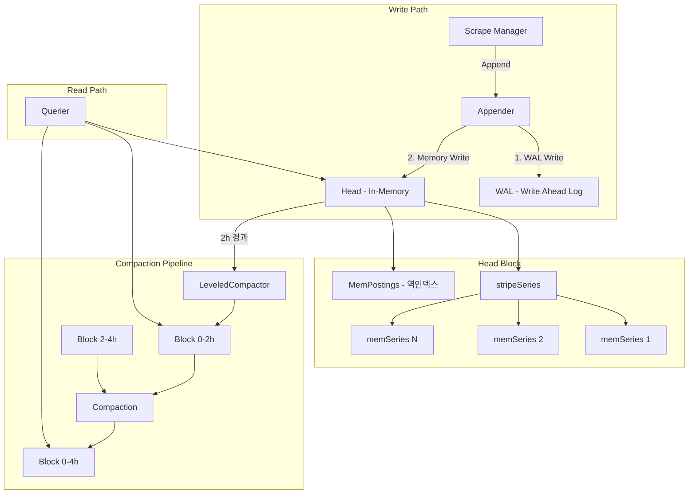

# Prometheus TSDB 내부 구현

Prometheus의 시계열 데이터베이스(TSDB)는 Head(인메모리) -> WAL -> Block(디스크) 3단계 파이프라인으로 동작하며, 효율적인 시계열 압축과 인덱싱을 통해 대규모 메트릭 수집을 처리한다.

## 목차
- [1. 핵심 개념 (What)](#1-핵심-개념-what)
- [2. 왜 알아야 하는가 (Why)](#2-왜-알아야-하는가-why)
- [3. 내부 구현 분석 (How)](#3-내부-구현-분석-how)
- [4. 실전 예제](#4-실전-예제)
- [5. 정리](#5-정리)

---

## 1. 핵심 개념 (What)

Prometheus TSDB는 시계열 데이터에 특화된 임베디드 스토리지 엔진이다. Facebook의 Gorilla 논문에서 영감을 받은 XOR 인코딩과 LSM-Tree에서 영감을 받은 블록 기반 구조를 결합하여, 높은 쓰기 처리량과 효율적인 디스크 사용량을 동시에 달성한다.

### 핵심 구성 요소

| 구성 요소 | 역할 | 위치 |
|-----------|------|------|
| **Head** | 최근 2시간의 인메모리 데이터 | `tsdb/head.go` |
| **WAL** | Write-Ahead Log, 크래시 복구용 | `tsdb/wlog/` |
| **Block** | 디스크에 영속화된 불변 데이터 블록 | `tsdb/block.go` |
| **Compactor** | 블록 병합 및 최적화 | `tsdb/compact.go` |
| **Index** | 역인덱스 (MemPostings, Postings) | `tsdb/index/` |

### DB 구조체

```go
// tsdb/db.go
type DB struct {
    dir    string
    locker *tsdbutil.DirLocker
    logger *slog.Logger
    opts   *Options

    mtx    sync.RWMutex
    blocks []*Block          // 디스크 블록 목록
    head   *Head             // 인메모리 Head

    compactc chan struct{}    // Compaction 트리거 채널
    donec    chan struct{}    // 종료 시그널
    stopc    chan struct{}    // 중지 시그널

    cmtx        sync.Mutex   // Compaction/Deletion 동기화
    autoCompact bool

    oooWasEnabled atomic.Bool // Out-of-Order 지원 여부
}
```

---

## 2. 왜 알아야 하는가 (Why)

### 실무에서의 TSDB 문제 시나리오

1. **메모리 급증**: Head에 너무 많은 시계열이 적재되면 OOM이 발생한다. `stripeSeries`의 동작 원리를 알아야 원인을 파악할 수 있다.
2. **쿼리 지연**: Compaction이 제대로 이루어지지 않으면 블록이 파편화되어 쿼리 성능이 저하된다.
3. **WAL 재생 시간**: 재시작 시 WAL replay에 수십 분이 걸릴 수 있다. WAL 세그먼트 크기와 Head 청크 스냅샷의 관계를 이해해야 한다.
4. **Out-of-Order 샘플**: 네트워크 지연으로 인한 시간 역전 샘플 처리를 위해 OOO 메커니즘을 알아야 한다.
5. **디스크 사용량 관리**: 블록의 Retention 정책과 Compaction 알고리즘을 이해해야 디스크 사용량을 예측할 수 있다.

---

## 3. 내부 구현 분석 (How)

### 3.1 전체 아키텍처



### 3.2 Head 구조체 상세

Head는 최근 데이터를 인메모리에 보관하는 TSDB의 핵심이다.

```go
// tsdb/head.go
type Head struct {
    chunkRange    atomic.Int64    // 청크 시간 범위 (기본 2h)
    numSeries     atomic.Uint64   // 현재 시계열 수
    minTime       atomic.Int64    // 가장 오래된 샘플 시간
    maxTime       atomic.Int64    // 가장 최근 샘플 시간
    lastSeriesID  atomic.Uint64   // 마지막 시계열 ID

    wal, wbl *wlog.WL            // WAL, WBL(Write Behind Log for OOO)

    series   *stripeSeries       // 시계열 해시맵 (동시성 제어)
    postings *index.MemPostings  // 인메모리 역인덱스

    chunkDiskMapper *chunks.ChunkDiskMapper  // Head 청크 디스크 매핑
}
```

### 3.3 stripeSeries - 동시성 해시맵

`stripeSeries`는 시계열 데이터에 대한 동시성 접근을 처리하는 샤딩된 해시맵이다. 기본 `StripeSize`는 2^14(16384)개의 스트라이프로 구성되어, lock contention을 최소화한다.

```
stripeSeries 구조:
+------------------+------------------+------------------+
| Stripe 0         | Stripe 1         | ... Stripe 16383 |
| mutex + map      | mutex + map      | mutex + map      |
| seriesID -> *ms  | seriesID -> *ms  | seriesID -> *ms  |
+------------------+------------------+------------------+

Lookup: seriesID % StripeSize -> Stripe Index
```

각 스트라이프는 독립적인 `sync.RWMutex`를 가지므로, 서로 다른 스트라이프의 시계열에 대한 읽기/쓰기가 동시에 수행될 수 있다.

### 3.4 Write Path 상세

샘플이 Append되는 전체 흐름을 추적한다.

```
1. initAppender.Append(ref, labels, t, v)
   |
   +-> Head.initTime(t)          // 첫 샘플일 때 minTime/maxTime 초기화
   +-> Head.appender()           // headAppender 생성

2. headAppender.Append(ref, labels, t, v)
   |
   +-> getOrCreate(hash, labels)  // stripeSeries에서 memSeries 조회/생성
   +-> 버퍼에 샘플 추가 (commit 전)

3. headAppender.Commit()
   |
   +-> WAL.Log(records)          // WAL에 레코드 기록
   +-> memSeries.append(t, v)   // 인메모리 청크에 샘플 추가
   +-> MemPostings.Add(ref, labels)  // 역인덱스 업데이트
```

### 3.5 WAL (Write-Ahead Log)

WAL은 `tsdb/wlog/` 패키지에 구현되어 있으며, 크래시 복구를 위해 모든 쓰기를 디스크에 먼저 기록한다.

- **세그먼트 크기**: 기본 128MB (`DefaultSegmentSize`)
- **레코드 타입**: Series, Samples, Tombstones, Exemplars, Histograms, Metadata
- **압축**: Snappy 또는 Zstd 지원 (`WALCompression` 옵션)

```
WAL 디렉토리 구조:
data/
  wal/
    00000000  (128MB 세그먼트)
    00000001
    00000002
    checkpoint.000005/  (체크포인트)
```

### 3.6 역인덱스 - MemPostings

`MemPostings`는 레이블 이름/값 쌍에서 시계열 ID(SeriesRef) 목록으로의 매핑을 제공한다.

```
MemPostings 구조:

Label("job", "prometheus") -> [1, 5, 12, 34, ...]
Label("instance", "localhost:9090") -> [1, 5, ...]
Label("__name__", "up") -> [1, 2, 3, ...]

쿼리: up{job="prometheus"}
  -> Postings("__name__", "up") ∩ Postings("job", "prometheus")
  -> [1, 5]  (교집합)
```

Postings 리스트는 정렬되어 있어 교집합 연산을 O(n+m)에 수행할 수 있다.

### 3.7 청크 인코딩

Prometheus는 시계열 데이터를 청크 단위로 압축 인코딩한다.

| 인코딩 타입 | 대상 | 알고리즘 | 압축률 |
|------------|------|---------|--------|
| XOR Float | float64 샘플 | Gorilla XOR 인코딩 | ~1.37 bytes/sample |
| Varbit Integer | 타임스탬프 | 가변 길이 정수 인코딩 | ~0.5 bytes/sample |
| Histogram | Native Histogram | 커스텀 인코딩 | 가변 |

XOR 인코딩은 연속된 float64 값의 XOR 결과에서 leading zeros와 trailing zeros를 제거하여 극적인 압축률을 달성한다.

### 3.8 Block 구조와 Compaction

Head의 데이터가 `MinBlockDuration`(기본 2시간)을 초과하면, `LeveledCompactor`가 이를 디스크 Block으로 영속화한다.

```
Block 디렉토리 구조:
data/
  01BKGV7JBM69T2G1BGBGM6KB12/  (ULID)
    meta.json     # 블록 메타데이터 (시간 범위, 샘플 수 등)
    chunks/       # 청크 데이터 파일
      000001
    index         # 인덱스 파일 (Postings, Symbol table)
    tombstones    # 삭제 마커
```

**Compaction 알고리즘 (LeveledCompactor)**:

```go
// tsdb/compact.go
type LeveledCompactor struct {
    ranges    []int64           // [2h, 6h, 18h, 54h, ...] 지수적 범위
    chunkPool chunkenc.Pool
    mergeFunc storage.VerticalChunkSeriesMergeFunc
}
```

Compaction은 지수적 범위를 사용하여 블록을 병합한다:

```
ExponentialBlockRanges(2h, steps=4, stepSize=3):
  -> [2h, 6h, 18h, 54h]

Level 0: [0-2h] [2-4h] [4-6h]  -> Compact -> [0-6h]
Level 1: [0-6h] [6-12h] [12-18h] -> Compact -> [0-18h]
Level 2: [0-18h] [18-36h] [36-54h] -> Compact -> [0-54h]
```

### 3.9 Out-of-Order (OOO) 샘플 처리

Prometheus 2.39부터 Out-of-Order 샘플 수집을 지원한다.

```go
// tsdb/db.go - Options
type Options struct {
    // OutOfOrderTimeWindow는 OOO 허용 범위
    OutOfOrderTimeWindow int64
    // OutOfOrderCapMax는 OOO 청크의 최대 샘플 수
    OutOfOrderCapMax     int64
}
```

OOO 샘플은 별도의 WBL(Write Behind Log)에 기록되고, 별도의 OOO Head 청크에 저장된다. 쿼리 시 일반 Head 데이터와 OOO 데이터가 병합된다.

```
OOO 처리 흐름:
1. Append(t, v) where t < head.maxTime
2. OutOfOrderTimeWindow 범위 내인지 확인
3. WBL에 기록
4. OOO 청크에 저장 (별도 m-map 영역)
5. Compaction 시 일반 블록과 병합
```

---

## 4. 실전 예제

### 예제 1: TSDB 옵션 튜닝

```yaml
# prometheus.yml
storage:
  tsdb:
    # WAL 압축 활성화 (디스크 I/O 감소)
    wal-compression: true

    # Out-of-Order 수집 허용 (10분)
    out-of-order-time-window: 10m

    # 보존 기간
    retention.time: 30d
    retention.size: 50GB

    # 최소 블록 기간 (기본 2h)
    min-block-duration: 2h
    # 최대 블록 기간 (기본 31h for 2h blocks)
    max-block-duration: 31h
```

### 예제 2: TSDB 상태 모니터링 PromQL 쿼리

```promql
# Head 시계열 수 모니터링
prometheus_tsdb_head_series

# Head 청크 수
prometheus_tsdb_head_chunks

# WAL 손상 횟수
prometheus_tsdb_wal_corruptions_total

# Compaction 소요 시간
rate(prometheus_tsdb_compaction_duration_seconds_sum[5m])

# 블록 수
prometheus_tsdb_blocks_loaded

# Out-of-Order 샘플 수
rate(prometheus_tsdb_out_of_order_samples_total[5m])

# Head GC에 의해 제거된 시계열 수
rate(prometheus_tsdb_head_series_removed_total[5m])

# 메모리 사용량 관련
prometheus_tsdb_head_chunks_storage_size_bytes
prometheus_tsdb_storage_blocks_bytes
```

### 예제 3: TSDB 디버깅 - tsdb tool 사용

```bash
# TSDB 블록 목록 확인
promtool tsdb list /path/to/prometheus/data

# 블록 분석
promtool tsdb analyze /path/to/prometheus/data/<block-ulid>

# WAL 덤프
promtool tsdb dump-openmetrics /path/to/prometheus/data

# TSDB 벤치마크
promtool tsdb bench write /path/to/prometheus/data
```

---

## 5. 정리

| 구성 요소 | 역할 | 핵심 특성 |
|-----------|------|----------|
| **Head** | 인메모리 활성 데이터 | 최근 2h, stripeSeries로 동시성 제어 |
| **WAL** | 크래시 복구 | 128MB 세그먼트, Snappy/Zstd 압축 |
| **MemPostings** | 인메모리 역인덱스 | Label -> SeriesRef 매핑, 정렬된 Postings |
| **XOR Encoding** | float64 청크 압축 | Gorilla 논문 기반, ~1.37 bytes/sample |
| **Block** | 디스크 영속 데이터 | 불변, ULID 식별, meta.json + chunks/ + index |
| **LeveledCompactor** | 블록 병합 | 지수적 범위 [2h, 6h, 18h, ...] |
| **OOO Handling** | 시간 역전 샘플 | WBL 분리 기록, OOO 전용 청크 |
| **DB** | 전체 TSDB 관리 | Head + Blocks + Compaction 오케스트레이션 |

### 핵심 기본값

| 파라미터 | 기본값 | 소스 |
|---------|--------|------|
| `DefaultBlockDuration` | 2h | `tsdb/db.go` |
| `WALSegmentSize` | 128MB | `tsdb/wlog/` |
| `RetentionDuration` | 15d | `tsdb/db.go` |
| `StripeSize` | 16384 | `tsdb/db.go` |
| `SamplesPerChunk` | 120 | `tsdb/db.go` |
| `OutOfOrderCapMax` | 32 | `tsdb/db.go` |

---
*참고: Prometheus v3.x (Go 1.22+), tsdb 패키지 기준*
