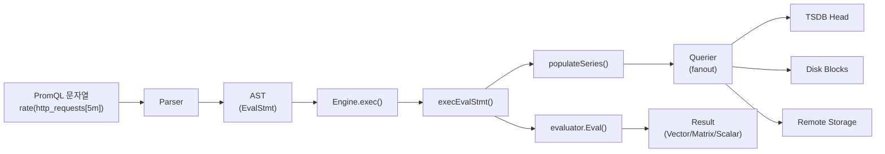

# PromQL 엔진 내부 구현

PromQL 엔진은 Parser -> AST -> Engine.exec() -> evaluator 파이프라인으로 쿼리를 처리하며, fanout.Querier를 통해 로컬과 리모트 저장소를 투명하게 병합한다.

## 목차
- [1. 핵심 개념 (What)](#1-핵심-개념-what)
- [2. 왜 알아야 하는가 (Why)](#2-왜-알아야-하는가-why)
- [3. 내부 구현 분석 (How)](#3-내부-구현-분석-how)
- [4. 실전 예제](#4-실전-예제)
- [5. 정리](#5-정리)

---

## 1. 핵심 개념 (What)

PromQL(Prometheus Query Language)은 시계열 데이터에 대한 함수형 쿼리 언어다. PromQL 엔진은 이 언어를 파싱, 분석, 실행하는 전체 파이프라인을 담당한다. 텍스트 쿼리 문자열을 받아 AST(Abstract Syntax Tree)로 변환하고, 스토리지에서 데이터를 가져와 연산을 수행한 뒤 결과를 반환한다.

### 쿼리 타입

| 타입 | 설명 | 반환 타입 |
|------|------|----------|
| **Instant Query** | 단일 시점의 값 | Vector 또는 Scalar |
| **Range Query** | 시간 범위에 대한 값 | Matrix |

### 데이터 타입

```go
// promql/value.go
type (
    Scalar  struct{ T int64; V float64 }        // 스칼라 값
    String  struct{ T int64; V string }          // 문자열
    Vector  []Sample                              // 즉시 벡터 (시점 하나)
    Matrix  []Series                              // 범위 벡터 (시간 범위)
    Sample  struct{ Metric labels.Labels; T int64; F float64; H *histogram.FloatHistogram }
    Series  struct{ Metric labels.Labels; Floats []FPoint; Histograms []HPoint }
)
```

---

## 2. 왜 알아야 하는가 (Why)

1. **쿼리 성능 최적화**: 엔진이 쿼리를 어떻게 실행하는지 알면, 느린 쿼리를 구조적으로 개선할 수 있다.
2. **메모리 제한 이해**: `--query.max-samples` 플래그가 내부에서 어떻게 동작하는지 알아야 `ErrTooManySamples` 에러를 해결할 수 있다.
3. **LookbackDelta 이해**: staleness 처리 메커니즘을 모르면 그래프에 빈 구간이 나타나는 이유를 설명할 수 없다.
4. **함수 동작 원리**: `rate()`, `increase()` 등의 함수가 내부에서 보간(interpolation)을 사용하는 이유를 이해해야 정확한 값을 해석할 수 있다.
5. **Remote Storage 통합**: fanout Querier가 로컬/리모트 데이터를 병합하는 방식을 알아야 하이브리드 환경을 설계할 수 있다.

---

## 3. 내부 구현 분석 (How)

### 3.1 전체 쿼리 실행 파이프라인



### 3.2 Engine 구조체

```go
// promql/engine.go
type Engine struct {
    logger                   *slog.Logger
    metrics                  *engineMetrics
    timeout                  time.Duration      // 쿼리 타임아웃
    maxSamplesPerQuery       int                // 최대 샘플 수 제한
    activeQueryTracker       QueryTracker       // 동시 쿼리 추적
    lookbackDelta            time.Duration      // Staleness delta (기본 5m)
    noStepSubqueryIntervalFn func(int64) int64  // 서브쿼리 기본 간격
    enableDelayedNameRemoval bool               // __name__ 지연 제거
    parser                   parser.Parser      // PromQL 파서
}
```

### 3.3 쿼리 생성 - NewInstantQuery / NewRangeQuery

```go
// promql/engine.go
func (ng *Engine) NewInstantQuery(ctx context.Context, q storage.Queryable,
    opts QueryOpts, qs string, ts time.Time) (Query, error) {

    pExpr, qry := ng.newQuery(q, qs, opts, ts, ts, 0)  // start == end, interval == 0

    // Active Query 추적에 등록
    finishQueue, err := ng.queueActive(ctx, qry)
    defer finishQueue()

    // 파싱
    expr, err := ng.parser.ParseExpr(qs)

    // @ modifier, negative offset 등 유효성 검증
    ng.validateOpts(expr)

    // 전처리 (offset 조정 등)
    *pExpr, err = PreprocessExpr(expr, ts, ts, 0)

    return qry, err
}
```

Instant Query는 `start == end`, `interval == 0`으로 설정된 Range Query의 특수한 경우이다.

### 3.4 Engine.exec() - 쿼리 실행 진입점

```go
// promql/engine.go
func (ng *Engine) exec(ctx context.Context, q *query) (parser.Value, annotations.Annotations, error) {
    ng.metrics.currentQueries.Inc()
    defer ng.metrics.currentQueries.Dec()

    // 타임아웃 설정
    ctx, cancel := context.WithTimeout(ctx, ng.timeout)
    q.cancel = cancel

    // Active Query 큐에 등록 (동시성 제한)
    finishQueue, err := ng.queueActive(ctx, q)
    defer finishQueue()

    // Statement 타입에 따라 분기
    switch s := q.Statement().(type) {
    case *parser.EvalStmt:
        return ng.execEvalStmt(ctx, q, s)  // 핵심 실행 경로
    case parser.TestStmt:
        return nil, nil, s(ctx)
    }
}
```

### 3.5 execEvalStmt() - 핵심 평가 로직

```go
// promql/engine.go
func (ng *Engine) execEvalStmt(ctx context.Context, query *query, s *parser.EvalStmt) (...) {
    // 1단계: 쿼리 준비 - 시간 범위 계산 및 시계열 로드
    mint, maxt := FindMinMaxTime(s)
    querier, err := query.queryable.Querier(mint, maxt)
    ng.populateSeries(ctxPrepare, querier, s)

    // 2단계: @ modifier 오프셋 조정
    setOffsetForAtModifier(timeMilliseconds(s.Start), s.Expr)

    // 3단계: Instant Query (start == end)
    if s.Start.Equal(s.End) && s.Interval == 0 {
        evaluator := &evaluator{
            startTimestamp: start,
            endTimestamp:   start,
            interval:       1,
            maxSamples:     ng.maxSamplesPerQuery,
            lookbackDelta:  s.LookbackDelta,
        }
        val, warnings, err := evaluator.Eval(ctx, s.Expr)
        // Vector/Scalar/Matrix로 변환 후 반환
    }

    // 4단계: Range Query
    evaluator := &evaluator{
        startTimestamp: timeMilliseconds(s.Start),
        endTimestamp:   timeMilliseconds(s.End),
        interval:       durationMilliseconds(s.Interval),
        maxSamples:     ng.maxSamplesPerQuery,
    }
    val, warnings, err := evaluator.Eval(ctx, s.Expr)
    // Matrix로 반환
}
```

### 3.6 evaluator - AST 트리 워커

evaluator는 AST 노드를 재귀적으로 순회하며 각 노드의 값을 계산한다. 주요 노드 타입과 처리 방식:

```
AST 노드 타입별 처리:

VectorSelector  -> storage에서 시계열 조회, LookbackDelta 적용
MatrixSelector  -> 범위 내 모든 샘플 로드
AggregateExpr   -> sum, avg, count 등 집계 연산
Call            -> rate(), histogram_quantile() 등 함수 호출
BinaryExpr      -> 벡터 간 이항 연산 (+, -, *, /, and, or, unless)
ParenExpr       -> 괄호 (재귀 평가)
UnaryExpr       -> 단항 연산 (-)
SubqueryExpr    -> 서브쿼리 (내부적으로 Range Query 실행)
```

### 3.7 fanout Querier - 스토리지 병합

```go
// storage/fanout.go
type fanout struct {
    logger      *slog.Logger
    primary     Storage       // 로컬 TSDB
    secondaries []Storage     // Remote Storage들
}

func (f *fanout) Querier(mint, maxt int64) (Querier, error) {
    primary, err := f.primary.Querier(mint, maxt)

    secondaries := make([]Querier, 0, len(f.secondaries))
    for _, storage := range f.secondaries {
        querier, _ := storage.Querier(mint, maxt)
        secondaries = append(secondaries, querier)
    }

    // MergeQuerier: primary 에러는 fatal, secondary 에러는 warning
    return NewMergeQuerier([]Querier{primary}, secondaries, ChainedSeriesMerge), nil
}
```

fanout의 핵심 원칙:
- **Primary(TSDB)** 에러: 쿼리 전체가 실패
- **Secondary(Remote)** 에러: 해당 결과만 제외, warning으로 반환
- 병합은 `ChainedSeriesMerge`로 같은 시계열의 샘플을 시간순으로 합침

### 3.8 LookbackDelta와 Staleness

```
LookbackDelta = 5m (기본값)

시간축: -----|-----|-----|-----|-----|----->
             t-10m t-8m  t-5m  t-3m  t(now)
샘플:              *           *
                   ^           ^
                   |           |
                   lookback 범위 내

쿼리 시점 t에서:
- t-3m의 샘플이 있으므로 이 값을 반환
- 만약 가장 최근 샘플이 t-6m이면? -> lookbackDelta(5m) 초과 -> stale -> 값 없음
```

### 3.9 rate() 함수 내부 구현

```go
// promql/functions.go - rate/increase의 핵심 로직

// 보간(interpolation) 함수
func interpolate(p1, p2 FPoint, t int64, isCounter bool) float64 {
    y1 := p1.F
    y2 := p2.F
    if isCounter && y2 < y1 {
        y1 = 0  // 카운터 리셋 처리
    }
    return y1 + (y2-y1)*float64(t-p1.T)/float64(p2.T-p1.T)
}
```

`rate()` 계산 과정:

```
rate(http_requests_total[5m]) 를 시점 t에서 평가:

1. [t-5m, t] 범위의 모든 샘플 수집
2. 첫 번째 샘플과 마지막 샘플을 범위 경계로 보간
3. (보간된 마지막 값 - 보간된 첫 값) / 시간 차이(초)
4. 카운터 리셋 감지 시 보정

이것이 rate()가 정확히 정수가 아닌 값을 반환하는 이유다.
```

---

## 4. 실전 예제

### 예제 1: 쿼리 성능 분석

```promql
# 현재 실행 중인 쿼리 수
prometheus_engine_queries

# 쿼리 단계별 소요 시간 (p99)
histogram_quantile(0.99,
  rate(prometheus_engine_query_duration_histogram_seconds_bucket[5m])
)

# 쿼리당 로드된 샘플 수
rate(prometheus_engine_query_samples_total[5m])

# 쿼리 타임아웃 발생 여부 확인
increase(prometheus_engine_query_duration_seconds_count{slice="inner_eval"}[1h])
```

### 예제 2: LookbackDelta 커스터마이징

```yaml
# prometheus.yml
global:
  # 기본 5m -> 10m으로 변경 (느린 scrape 간격 환경)
  query_lookback_delta: 10m
```

```go
// 프로그래밍 방식으로 엔진 생성
engine := promql.NewEngine(promql.EngineOpts{
    Logger:             logger,
    Reg:                prometheus.DefaultRegisterer,
    MaxSamples:         50000000,     // 쿼리당 최대 5천만 샘플
    Timeout:            2 * time.Minute,
    LookbackDelta:      10 * time.Minute,
    EnableAtModifier:   true,
    EnableNegativeOffset: true,
})
```

### 예제 3: 쿼리별 LookbackDelta 설정

```promql
# 특정 쿼리에서만 lookback delta를 변경
# Prometheus HTTP API 사용
# GET /api/v1/query?query=up&time=2024-01-01T00:00:00Z&lookback_delta=10m
```

---

## 5. 정리

| 단계 | 구성 요소 | 역할 | 소스 파일 |
|------|----------|------|----------|
| **파싱** | `parser.Parser` | 문자열 -> AST 변환 | `promql/parser/` |
| **전처리** | `PreprocessExpr` | @ modifier, offset 조정 | `promql/engine.go` |
| **큐잉** | `QueryTracker` | 동시 쿼리 제한 | `promql/engine.go` |
| **준비** | `populateSeries` | 스토리지에서 시계열 로드 | `promql/engine.go` |
| **평가** | `evaluator.Eval` | AST 순회하며 값 계산 | `promql/engine.go` |
| **스토리지** | `fanout.Querier` | 로컬 + 리모트 병합 | `storage/fanout.go` |

### 핵심 기본값

| 파라미터 | 기본값 | 설명 |
|---------|--------|------|
| `LookbackDelta` | 5m | Staleness 판단 기준 |
| `Timeout` | 2m | 쿼리 타임아웃 |
| `MaxSamples` | 50,000,000 | 쿼리당 최대 샘플 수 |
| `maxPointsSliceSize` | 5,000 | 풀링된 포인트 슬라이스 최대 크기 |

### 쿼리 실행 흐름 요약

```
문자열 -> Parser -> AST -> Engine.exec()
  -> execEvalStmt()
    -> FindMinMaxTime() -> Querier(mint, maxt)
    -> populateSeries() (시계열 사전 로드)
    -> evaluator.Eval() (AST 재귀 순회)
      -> VectorSelector: storage lookup + lookbackDelta
      -> MatrixSelector: range sample load
      -> Call: rate(), sum(), histogram_quantile()...
      -> BinaryExpr: vector matching
    -> Result 반환 (Vector/Matrix/Scalar)
```

---
*참고: Prometheus v3.x, promql 패키지 기준*
