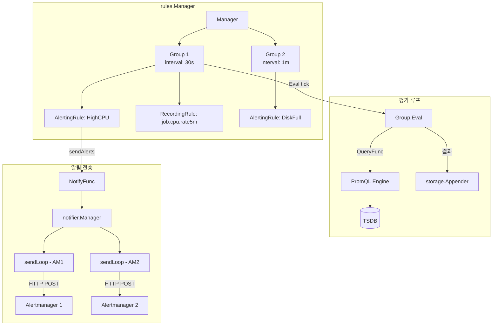

# Prometheus Alerting & Rules 내부 구현

Prometheus의 Rules 시스템은 rules.Manager가 Group 단위로 AlertingRule과 RecordingRule을 주기적으로 평가하며, 알림 상태 전이(pending -> firing)와 notifier.Manager를 통한 Alertmanager 전송까지의 전체 파이프라인을 관리한다.

## 목차
- [1. 핵심 개념 (What)](#1-핵심-개념-what)
- [2. 왜 알아야 하는가 (Why)](#2-왜-알아야-하는가-why)
- [3. 내부 구현 분석 (How)](#3-내부-구현-분석-how)
- [4. 실전 예제](#4-실전-예제)
- [5. 정리](#5-정리)

---

## 1. 핵심 개념 (What)

Prometheus는 두 가지 유형의 규칙을 지원한다:

| 규칙 타입 | 설명 | 용도 |
|-----------|------|------|
| **Recording Rule** | PromQL 결과를 새 시계열로 저장 | 자주 사용되는 복잡한 쿼리 사전 계산 |
| **Alerting Rule** | PromQL 조건이 참일 때 알림 생성 | 이상 상태 감지 및 알림 전송 |

### 핵심 구조

```go
// rules/manager.go
type Manager struct {
    opts   *ManagerOptions
    groups map[string]*Group  // 규칙 그룹 맵 (GroupKey -> Group)
    mtx    sync.RWMutex
}

// rules/group.go
type Group struct {
    name     string
    file     string
    interval time.Duration    // 평가 주기
    rules    []Rule           // AlertingRule 또는 RecordingRule 목록
    opts     *ManagerOptions
}

// Rule 인터페이스
type Rule interface {
    Name() string
    Labels() labels.Labels
    Eval(ctx, queryOffset, ts, queryFunc, externalURL, limit) (Vector, error)
    SetHealth(RuleHealth)
    SetLastError(error)
}
```

### Alert 상태 전이

```go
// rules/alerting.go
const (
    StateUnknown  AlertState = iota  // 아직 평가되지 않음
    StateInactive                     // 조건 미충족
    StatePending                      // 조건 충족, for 대기 중
    StateFiring                       // 조건 충족, for 경과 -> 발화
)
```

---

## 2. 왜 알아야 하는가 (Why)

1. **for 절 동작 이해**: `for: 5m` 설정이 어떻게 pending -> firing 전이를 제어하는지 알아야 알림 지연을 정확히 예측할 수 있다.
2. **Recording Rule 최적화**: 어떤 쿼리를 Recording Rule로 추출할지, 평가 주기를 어떻게 설정할지 판단할 수 있다.
3. **알림 누락 디버깅**: notifier.Manager의 큐 관리와 배치 전송 메커니즘을 알아야 알림이 누락되는 원인을 찾을 수 있다.
4. **Group 평가 순서**: 같은 Group 내 규칙들의 평가 순서와 의존성을 이해해야 올바른 규칙 구성을 할 수 있다.
5. **ALERTS/ALERTS_FOR_STATE 메트릭**: 알림 규칙이 생성하는 합성 시계열의 의미를 이해해야 알림 상태를 쿼리할 수 있다.

---

## 3. 내부 구현 분석 (How)

### 3.1 전체 아키텍처



### 3.2 Group.run() - 평가 루프

```go
// rules/group.go
func (g *Group) run(ctx context.Context) {
    // 1. 슬롯 정렬: 일관된 평가 시점을 위해 초기 대기
    evalTimestamp := g.EvalTimestamp(time.Now().UnixNano()).Add(g.interval)
    <-time.After(time.Until(evalTimestamp))

    // 2. Ticker 기반 주기적 평가
    tick := time.NewTicker(g.interval)

    // 3. 첫 번째 평가
    g.evalIterationFunc(ctx, g, evalTimestamp)

    // 4. 복원이 필요하면 두 번째 평가 후 for 상태 복원
    if g.shouldRestore {
        // ... 두 번째 평가 실행
        g.RestoreForState(time.Now())
    }

    // 5. 메인 루프
    for {
        select {
        case <-g.done:
            return
        case <-tick.C:
            missed := (time.Since(evalTimestamp) / g.interval) - 1
            if missed > 0 {
                g.metrics.IterationsMissed.Add(float64(missed))
            }
            evalTimestamp = evalTimestamp.Add((missed + 1) * g.interval)
            g.evalIterationFunc(ctx, g, evalTimestamp)
        }
    }
}
```

**EvalTimestamp 슬롯 정렬**: 각 Group은 이름과 파일의 해시를 사용하여 평가 시점을 interval 내에서 랜덤하게 오프셋한다. 이를 통해 모든 Group이 동시에 평가되는 것을 방지한다.

```go
func (g *Group) EvalTimestamp(startTime int64) time.Time {
    offset := int64(g.hash() % uint64(g.interval))
    adjNow := startTime - offset
    base := adjNow - (adjNow % int64(g.interval))
    next := base + offset
    return time.Unix(0, next).UTC()
}
```

### 3.3 DefaultEvalIterationFunc

```go
// rules/manager.go
func DefaultEvalIterationFunc(ctx context.Context, g *Group, evalTimestamp time.Time) {
    g.metrics.IterationsScheduled.Inc()

    start := time.Now()
    g.Eval(ctx, evalTimestamp)          // 핵심: 모든 규칙 평가
    timeSinceStart := time.Since(start)

    g.metrics.IterationDuration.Observe(timeSinceStart.Seconds())
    g.updateRuleEvaluationTimeSum()
    g.setEvaluationTime(timeSinceStart)
    g.setLastEvaluation(start)
    g.setLastEvalTimestamp(evalTimestamp)
}
```

### 3.4 Group.Eval() - 규칙 순차/병렬 평가

```go
// rules/group.go
func (g *Group) Eval(ctx context.Context, ts time.Time) {
    eval := func(i int, rule Rule, cleanup func()) {
        // 1. PromQL로 규칙 평가
        vector, err := rule.Eval(ctx, ruleQueryOffset, ts,
            g.opts.QueryFunc, g.opts.ExternalURL, g.Limit())

        if err != nil {
            rule.SetHealth(HealthBad)
            return
        }
        rule.SetHealth(HealthGood)

        // 2. AlertingRule이면 알림 전송
        if ar, ok := rule.(*AlertingRule); ok {
            ar.sendAlerts(ctx, ts, g.opts.ResendDelay, g.interval, g.opts.NotifyFunc)
        }

        // 3. 결과를 TSDB에 기록
        app := g.opts.Appendable.Appender(ctx)
        for _, s := range vector {
            app.Append(0, s.Metric, s.T, s.F)
        }
        app.Commit()

        // 4. stale 시계열 처리
        // 이전 평가에서 있었지만 이번에 없는 시계열 -> stale marker
    }

    // 규칙을 순차적으로 또는 concurrent-rule-eval 플래그에 따라 병렬로 평가
    for i, rule := range g.rules {
        eval(i, rule, nil)
    }
}
```

### 3.5 AlertingRule.Eval() - 알림 평가 상세

```go
// rules/alerting.go
func (r *AlertingRule) Eval(ctx context.Context, queryOffset time.Duration,
    ts time.Time, query QueryFunc, externalURL *url.URL, limit int) (promql.Vector, error) {

    // 1. PromQL 실행
    res, err := query(ctx, r.vector.String(), ts.Add(-queryOffset))

    // 2. 결과에서 Alert 객체 생성
    alerts := make(map[uint64]*Alert, len(res))
    for _, smpl := range res {
        // 템플릿 확장 (labels, annotations)
        lb.Reset(smpl.Metric)
        lb.Del(labels.MetricName)
        r.labels.Range(func(l labels.Label) {
            lb.Set(l.Name, expand(l.Value))  // Go 템플릿 확장
        })

        lbs := lb.Labels()
        h := lbs.Hash()
        alerts[h] = &Alert{
            Labels:   lbs,
            ActiveAt: ts,
            State:    StatePending,
            Value:    smpl.F,
        }
    }

    // 3. 기존 활성 알림과 병합
    r.activeMtx.Lock()
    for h, a := range alerts {
        if alert, ok := r.active[h]; ok && alert.State != StateInactive {
            alert.Value = a.Value           // 값만 업데이트
            alert.Annotations = a.Annotations
            continue
        }
        r.active[h] = a  // 새 알림 등록
    }

    // 4. 더 이상 매칭되지 않는 알림 처리
    for fp, a := range r.active {
        if _, ok := resultFPs[fp]; !ok {
            // keepFiringFor 처리
            if a.State == StateFiring && r.keepFiringFor > 0 {
                if ts.Sub(a.KeepFiringSince) < r.keepFiringFor {
                    keepFiring = true
                }
            }

            if a.State == StatePending || resolvedRetention 초과 {
                delete(r.active, fp)  // 알림 제거
            }
            if !keepFiring {
                a.State = StateInactive
                a.ResolvedAt = ts
            }
        }

        // 5. for 절 평가: pending -> firing 전이
        if a.State == StatePending && ts.Sub(a.ActiveAt) >= r.holdDuration {
            a.State = StateFiring
            a.FiredAt = ts
        }

        // 6. ALERTS, ALERTS_FOR_STATE 시계열 생성
        vec = append(vec, r.sample(a, ts))
        vec = append(vec, r.forStateSample(a, ts, float64(a.ActiveAt.Unix())))
    }

    return vec, nil
}
```

### 3.6 Alert 상태 전이 다이어그램

```
                     조건 충족
    Inactive ──────────────────> Pending
        ^                          |
        |                          | ts - ActiveAt >= holdDuration (for 절)
        |                          v
        |   조건 미충족         Firing
        +<─────────────────────────+
            (resolvedRetention 후 제거)

    keepFiringFor 동작:
    Firing ──조건 미충족──> Firing (keepFiringFor 기간 동안 유지)
                              |
                              | keepFiringFor 초과
                              v
                           Inactive
```

### 3.7 RecordingRule.Eval()

```go
// rules/recording.go
func (rule *RecordingRule) Eval(ctx context.Context, queryOffset time.Duration,
    ts time.Time, query QueryFunc, _ *url.URL, limit int) (promql.Vector, error) {

    // PromQL 실행
    vector, err := query(ctx, rule.vector.String(), ts.Add(-queryOffset))

    // 메트릭 이름과 레이블 덮어쓰기
    for i := range vector {
        sample := &vector[i]
        lb.Reset(sample.Metric)
        lb.Set(labels.MetricName, rule.name)  // 규칙 이름을 메트릭 이름으로
        rule.labels.Range(func(l labels.Label) {
            lb.Set(l.Name, l.Value)
        })
        sample.Metric = lb.Labels()
    }

    return vector, nil
}
```

Recording Rule은 단순히 PromQL 결과의 메트릭 이름을 규칙 이름으로 교체하고 추가 레이블을 붙여 TSDB에 기록한다.

### 3.8 notifier.Manager - Alertmanager 전송

```go
// notifier/manager.go
type Manager struct {
    opts          *Options
    alertmanagers map[string]*alertmanagerSet  // AM 세트 관리
    metrics       *alertMetrics
}

type Options struct {
    QueueCapacity   int           // 알림 큐 크기
    DrainOnShutdown bool          // 종료 시 큐 비우기
    ExternalLabels  labels.Labels // 외부 레이블
    RelabelConfigs  []*relabel.Config
    MaxBatchSize    int           // 배치 크기 (기본 256)
}
```

### 3.9 sendLoop - 배치 전송 최적화

각 Alertmanager 엔드포인트에 대해 독립적인 `sendLoop`가 실행된다.

```go
// notifier/sendloop.go
type sendLoop struct {
    alertmanagerURL string
    queue           []*Alert      // 알림 큐
    hasWork         chan struct{}  // 작업 신호
    stopped         chan struct{}
    opts            *Options
}

func (s *sendLoop) loop() {
    for {
        select {
        case <-s.stopped:
            return
        case <-s.hasWork:
            s.sendOneBatch()          // 배치 전송
            if s.queueLen() > 0 {
                s.notifyWork()        // 큐에 남은 항목이 있으면 계속 전송
            }
        }
    }
}

func (s *sendLoop) nextBatch() []*Alert {
    if len(s.queue) > s.opts.MaxBatchSize {
        alerts := s.queue[:maxBatchSize]   // MaxBatchSize(256)개씩 잘라서
        s.queue = s.queue[maxBatchSize:]
        return alerts
    }
    alerts := s.queue
    s.queue = s.queue[:0]
    return alerts
}

func (s *sendLoop) sendAll(alerts []*Alert) bool {
    // JSON 인코딩 (Alertmanager API v2)
    payload, _ := json.Marshal(alertsToOpenAPIAlerts(alerts))

    // HTTP POST 전송
    ctx, cancel := context.WithTimeout(context.Background(), s.cfg.Timeout)
    s.sendOne(ctx, s.client, s.alertmanagerURL, payload)
}
```

### 3.10 큐 오버플로우 처리

```go
// notifier/sendloop.go
func (s *sendLoop) add(alerts ...*Alert) {
    // 큐 용량 초과 시 오래된 알림부터 삭제
    if d := (len(s.queue) + len(alerts)) - s.opts.QueueCapacity; d > 0 {
        s.logger.Warn("Alert notification queue full, dropping alerts", "count", d)
        s.queue = s.queue[d:]  // 앞에서부터(오래된 것) 삭제
    }
    s.queue = append(s.queue, alerts...)
}
```

---

## 4. 실전 예제

### 예제 1: Alerting Rule 설정

```yaml
# alert_rules.yml
groups:
  - name: instance-health
    interval: 30s
    rules:
      # 인스턴스 다운 감지
      - alert: InstanceDown
        expr: up == 0
        for: 5m
        labels:
          severity: critical
        annotations:
          summary: "Instance {{ $labels.instance }} is down"
          description: "{{ $labels.instance }} of job {{ $labels.job }} has been down for more than 5 minutes."

      # 높은 CPU 사용률
      - alert: HighCPUUsage
        expr: |
          100 - (avg by(instance) (rate(node_cpu_seconds_total{mode="idle"}[5m])) * 100) > 80
        for: 10m
        keep_firing_for: 5m
        labels:
          severity: warning
        annotations:
          summary: "High CPU usage on {{ $labels.instance }}"
          description: "CPU usage is {{ $value | printf \"%.1f\" }}%"
```

### 예제 2: Recording Rule 설정

```yaml
# recording_rules.yml
groups:
  - name: http-recording
    interval: 30s
    rules:
      # 자주 사용되는 쿼리를 사전 계산
      - record: job:http_requests:rate5m
        expr: sum by(job) (rate(http_requests_total[5m]))

      - record: job:http_request_duration:p99
        expr: histogram_quantile(0.99, sum by(job, le) (rate(http_request_duration_seconds_bucket[5m])))

      # 에러율 계산
      - record: job:http_errors:ratio_rate5m
        expr: |
          sum by(job) (rate(http_requests_total{status=~"5.."}[5m]))
          /
          sum by(job) (rate(http_requests_total[5m]))
```

### 예제 3: Rules 평가 모니터링

```promql
# 규칙 평가 소요 시간
prometheus_rule_group_duration_seconds

# 규칙 평가 실패 횟수
rate(prometheus_rule_evaluation_failures_total[5m])

# 그룹별 규칙 수
prometheus_rule_group_rules

# 평가 놓친 횟수 (평가가 interval보다 오래 걸림)
rate(prometheus_rule_group_iterations_missed_total[5m])

# 알림 큐 길이
prometheus_notifications_queue_length

# Alertmanager 전송 실패
rate(prometheus_notifications_errors_total[5m])

# 알림 전송 지연
prometheus_notifications_latency_seconds

# 활성 알림 확인 (ALERTS 합성 시계열)
ALERTS{alertstate="firing"}

# for 상태 확인 (ALERTS_FOR_STATE 합성 시계열)
ALERTS_FOR_STATE{alertname="InstanceDown"}
```

---

## 5. 정리

| 구성 요소 | 역할 | 소스 파일 |
|----------|------|----------|
| **rules.Manager** | 모든 규칙 그룹 관리, 설정 리로드 | `rules/manager.go` |
| **Group** | 규칙 집합, 주기적 평가 루프 실행 | `rules/group.go` |
| **AlertingRule** | PromQL 평가 -> Alert 상태 관리 | `rules/alerting.go` |
| **RecordingRule** | PromQL 평가 -> 새 시계열 기록 | `rules/recording.go` |
| **notifier.Manager** | Alertmanager 연결 및 전송 관리 | `notifier/manager.go` |
| **sendLoop** | 개별 AM에 대한 배치 전송 루프 | `notifier/sendloop.go` |

### Alert 상태 전이 타이밍

| 전이 | 조건 | 소요 시간 |
|------|------|----------|
| Inactive -> Pending | PromQL 조건 첫 충족 | 즉시 (다음 평가 시점) |
| Pending -> Firing | `ts - ActiveAt >= holdDuration` | `for` 값 (기본 0) |
| Firing -> Inactive | 조건 미충족 | 즉시 (keepFiringFor 없을 때) |
| Inactive -> 삭제 | `resolvedRetention` 초과 | 15분 |
| Firing -> Firing(유지) | `keepFiringFor` 기간 내 | `keep_firing_for` 값 |

### 합성 시계열

| 메트릭 이름 | 설명 | 레이블 |
|------------|------|--------|
| `ALERTS` | 활성 알림 (pending/firing) | `alertname`, `alertstate`, 규칙 레이블 |
| `ALERTS_FOR_STATE` | for 절 상태 추적 | `alertname`, 규칙 레이블 |

### 핵심 기본값

| 파라미터 | 기본값 | 설명 |
|---------|--------|------|
| `Group.interval` | 1m | 규칙 평가 주기 |
| `resolvedRetention` | 15m | 해소된 알림 유지 기간 |
| `DefaultMaxBatchSize` | 256 | Alertmanager 배치 전송 크기 |
| `resendDelay` | 1m | 알림 재전송 간격 |
| `DrainOnShutdown` | false | 종료 시 큐 비우기 여부 |

---
*참고: Prometheus v3.x, rules/notifier 패키지 기준*
