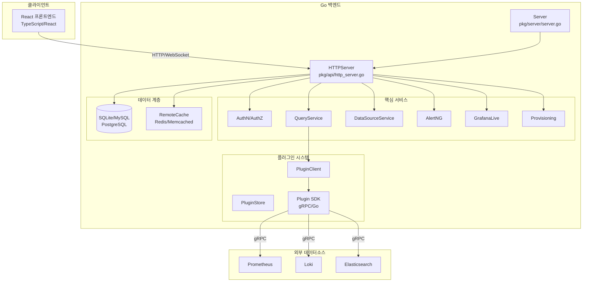
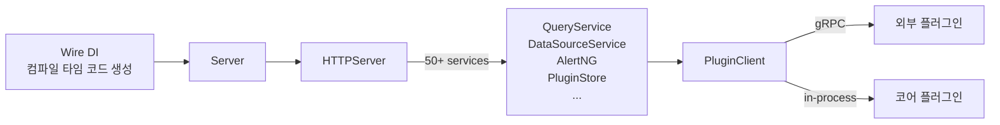

# Grafana 아키텍처 전체 조감도

Grafana는 Go 백엔드와 React 프론트엔드의 이중 구조로 설계된 관측성 플랫폼이다. Wire 기반 의존성 주입, HTTPServer 중앙 오케스트레이터, Plugin SDK 추상화 계층이 핵심 아키텍처 기둥을 형성한다.

## 목차
- [1. 핵심 개념 (What)](#1-핵심-개념-what)
- [2. 왜 알아야 하는가 (Why)](#2-왜-알아야-하는가-why)
- [3. 내부 구현 분석 (How)](#3-내부-구현-분석-how)
- [4. 실전 예제](#4-실전-예제)
- [5. 정리](#5-정리)

---

## 1. 핵심 개념 (What)

### Grafana의 정체성

Grafana는 단순한 대시보드 도구가 아니라, 50+ 서비스가 조합된 **관측성 플랫폼**이다. 핵심 설계 원칙은 다음과 같다:

- **Go 백엔드 + React 프론트엔드**: 백엔드는 Go로 작성되어 HTTP API, 인증, 데이터소스 프록시, 알림 엔진을 담당하고, 프론트엔드는 React/TypeScript로 대시보드 렌더링과 사용자 인터랙션을 처리한다.
- **Wire 기반 의존성 주입(DI)**: Google의 Wire를 사용해 컴파일 타임에 의존성 그래프를 해소한다.
- **Plugin-First 아키텍처**: 데이터소스, 패널, 앱 모두 플러그인으로 추상화되어 있으며, 코어 데이터소스(Prometheus, Loki 등)도 동일한 Plugin SDK 인터페이스를 구현한다.

### 주요 컴포넌트

| 컴포넌트 | 역할 | 소스 위치 |
|----------|------|-----------|
| `Server` | 전체 라이프사이클 관리 | `pkg/server/server.go` |
| `HTTPServer` | API 라우팅 및 서비스 오케스트레이션 | `pkg/api/http_server.go` |
| `Plugin` | 데이터소스/패널/앱 추상화 | `pkg/plugins/plugins.go` |
| `BackgroundServiceRegistry` | 백그라운드 서비스 관리 | `pkg/registry/` |

---

## 2. 왜 알아야 하는가 (Why)

### 실무 관점에서의 중요성

1. **커스텀 플러그인 개발**: Grafana Plugin SDK를 활용하려면 요청이 어떻게 플러그인까지 전달되는지 이해해야 한다.
2. **성능 트러블슈팅**: 느린 대시보드 로딩이 백엔드 쿼리 파이프라인 문제인지, 프론트엔드 렌더링 문제인지 구별할 수 있다.
3. **운영 안정성**: `Server.Shutdown()`의 graceful shutdown 메커니즘을 이해하면 무중단 배포를 설계할 수 있다.
4. **확장 아키텍처 설계**: HTTPServer에 50+ 서비스가 주입되는 구조를 이해하면, 자체 서비스를 어디에 어떻게 추가할지 판단할 수 있다.

---

## 3. 내부 구현 분석 (How)

### 3.1 전체 아키텍처 다이어그램



### 3.2 Server 구조체 - 전체 라이프사이클 관리

`Server`는 Grafana 프로세스의 최상위 엔트리포인트이다.

```go
// pkg/server/server.go:89-111
type Server struct {
    context       context.Context
    log           log.Logger
    cfg           *setting.Cfg
    shutdownOnce  sync.Once
    isInitialized bool
    mtx           sync.Mutex

    HTTPServer          *api.HTTPServer
    roleRegistry        accesscontrol.RoleRegistry
    provisioningService provisioning.ProvisioningService
    backgroundServiceRegistry registry.BackgroundServiceRegistry
    tracerProvider            *tracing.TracingService
    features                  featuremgmt.FeatureToggles
    managerAdapter            *adapter.ManagerAdapter

    // ...
}
```

**핵심 라이프사이클 메서드:**

- `Server.Init()`: PID 파일 작성, 메트릭 초기화, 고정 역할 등록, 프로비저닝 초기화
- `Server.Run()`: OpenTelemetry span 시작, systemd 알림(`READY=1`), `managerAdapter.Run(ctx)`로 모든 백그라운드 서비스 기동
- `Server.Shutdown()`: `sync.Once`로 단 한 번만 실행, graceful shutdown

```go
// pkg/server/server.go:141-150
func (s *Server) Run() error {
    if err := s.Init(); err != nil {
        return err
    }
    ctx, span := s.tracerProvider.Start(s.context, "server.Run")
    defer span.End()
    s.notifySystemd("READY=1")
    return s.managerAdapter.Run(ctx)
}
```

### 3.3 HTTPServer - 50+ 서비스 주입 오케스트레이터

`HTTPServer`는 Grafana 아키텍처의 핵심 허브로, **50개 이상의 서비스가 생성자를 통해 주입**된다.

```go
// pkg/api/http_server.go:119-227 (주요 필드 발췌)
type HTTPServer struct {
    log              log.Logger
    web              *web.Mux

    // 인증 & 접근 제어
    AccessControl    accesscontrol.AccessControl
    AuthTokenService auth.UserTokenService
    authnService     authn.Service

    // 데이터 서비스
    DataSourceCache  datasources.CacheService
    queryDataService query.Service
    DataProxy        *datasourceproxy.DataSourceProxyService

    // 플러그인 시스템
    pluginClient     plugins.Client
    pluginStore      pluginstore.Store
    pluginInstaller  plugins.Installer

    // 알림
    AlertNG          *ngalert.AlertNG

    // 대시보드 & 폴더
    DashboardService dashboards.DashboardService
    folderService    folder.Service

    // 실시간 기능
    Live             *live.GrafanaLive

    // ... 50+ more services
}
```

`ProvideHTTPServer()` 함수의 시그니처만 확인해도 주입되는 서비스의 규모를 알 수 있다 -- 약 80개의 파라미터를 받는다.

### 3.4 라우트 등록 시스템

`registerRoutes()` 메서드는 Grafana의 모든 HTTP 엔드포인트를 정의한다.

```go
// pkg/api/api.go:62-606 (구조 요약)
func (hs *HTTPServer) registerRoutes() {
    // 미들웨어 정의
    reqSignedIn := middleware.ReqSignedIn
    authorize := ac.Middleware(hs.AccessControl)

    r := hs.RouteRegister

    // 뷰 라우트 (HTML 페이지)
    r.Get("/", reqSignedIn, hs.Index)
    r.Get("/login", hs.LoginView)
    r.Get("/d/:uid", reqSignedIn, hs.Index)  // 대시보드

    // API 라우트
    r.Group("/api", func(apiRoute routing.RouteRegister) {
        // 쿼리 파이프라인
        apiRoute.Post("/ds/query",
            authorize(ac.EvalPermission(datasources.ActionQuery)),
            hs.getDSQueryEndpoint())

        // 데이터소스 CRUD
        apiRoute.Group("/datasources", func(dsRoute routing.RouteRegister) {
            dsRoute.Get("/", authorize(...), routing.Wrap(hs.GetDataSources))
            dsRoute.Post("/", authorize(...), routing.Wrap(hs.AddDataSource))
            // ...
        })

        // 대시보드
        apiRoute.Group("/dashboards", func(dashRoute routing.RouteRegister) {
            dashRoute.Get("/uid/:uid", authorize(...), routing.Wrap(hs.GetDashboard))
            // ...
        })
    }, reqSignedIn)
}
```

**라우트 등록 패턴:**
1. 미들웨어 체인: `authorize(permission)` -> `routing.Wrap(handler)`
2. 그룹 기반 네스팅: `/api` 아래 `/datasources`, `/dashboards` 등
3. RBAC 통합: `ac.EvalPermission()`으로 세분화된 권한 검사

### 3.5 미들웨어 스택

```go
// pkg/api/http_server.go:636-701 (핵심 미들웨어 순서)
func (hs *HTTPServer) addMiddlewaresAndStaticRoutes() {
    m := hs.web
    m.Use(requestmeta.SetupRequestMetadata())   // 요청 메타데이터
    m.Use(middleware.RequestTracing(...))         // OpenTelemetry 트레이싱
    m.Use(middleware.RequestMetrics(...))         // Prometheus 메트릭
    m.UseMiddleware(hs.LoggerMiddleware.Middleware()) // 로깅
    m.UseMiddleware(middleware.Recovery(...))     // 패닉 복구
    m.UseMiddleware(hs.Csrf.Middleware())         // CSRF 방어
    // 정적 파일 서빙
    hs.mapStatic(m, hs.Cfg.StaticRootPath, "build", "public/build")
    // 헬스 체크 엔드포인트
    m.Use(hs.healthzHandler)                     // /healthz
    m.Use(hs.apiHealthHandler)                   // /api/health
    m.Use(hs.metricsEndpoint)                    // /metrics
    // 인증 컨텍스트
    m.UseMiddleware(hs.ContextHandler.Middleware) // 세션/토큰 파싱
}
```

### 3.6 Plugin 시스템

플러그인은 `Plugin` 구조체로 표현되며, 4가지 타입이 있다:

```go
// pkg/plugins/plugins.go:31-68
type Plugin struct {
    JSONData                // plugin.json 메타데이터
    FS        FS            // 파일시스템 접근
    Class     Class         // "core" 또는 "external"
    Signature SignatureStatus
    client    backendplugin.Plugin  // gRPC 백엔드 클라이언트
    // ...
}

// 플러그인 타입
const (
    TypeDataSource Type = "datasource"  // 데이터소스 (Prometheus, Loki 등)
    TypePanel      Type = "panel"       // 시각화 패널
    TypeApp        Type = "app"         // 앱 플러그인
    TypeRenderer   Type = "renderer"    // 렌더링 엔진
)
```

**PluginClient 인터페이스** -- 모든 백엔드 플러그인이 구현해야 하는 계약:

```go
// pkg/plugins/plugins.go:473-482
type PluginClient interface {
    backend.QueryDataHandler        // 쿼리 실행
    backend.CheckHealthHandler      // 헬스 체크
    backend.CallResourceHandler     // 리소스 호출
    backend.StreamHandler           // 스트리밍
    backend.AdmissionHandler        // K8s-style admission
    backend.ConversionHandler       // 버전 변환
    backend.CollectMetricsHandler   // 메트릭 수집
}
```

### 3.7 Wire 기반 의존성 주입 흐름



Wire는 `ProvideHTTPServer()`, `ProvideService()` 같은 Provider 함수를 분석하여 의존성 그래프를 자동으로 해소한다. 런타임 리플렉션 없이 컴파일 타임에 모든 주입 코드가 생성되므로 타입 안전성이 보장된다.

---

## 4. 실전 예제

### 예제 1: Grafana 서버 시작 흐름 추적

```
1. main()
   └─> server.New(opts, cfg, httpServer, ...)
       └─> Server.Init()
           ├─> writePIDFile()
           ├─> metrics.SetEnvironmentInformation()
           ├─> roleRegistry.RegisterFixedRoles()
           └─> provisioningService.RunInitProvisioners()
       └─> Server.Run()
           ├─> tracerProvider.Start("server.Run")
           ├─> notifySystemd("READY=1")
           └─> managerAdapter.Run(ctx)
               └─> 모든 BackgroundService.Run() 병렬 실행
                   ├─> HTTPServer.Run()
                   ├─> AlertNG.Run()
                   ├─> GrafanaLive.Run()
                   └─> ... (기타 백그라운드 서비스)
```

### 예제 2: HTTP 요청 처리 흐름 (대시보드 쿼리)

```
POST /api/ds/query
│
├─ 미들웨어 체인
│  ├─ RequestTracing (OpenTelemetry span 시작)
│  ├─ RequestMetrics (Prometheus 카운터 증가)
│  ├─ LoggerMiddleware (요청 로깅)
│  ├─ Recovery (패닉 복구)
│  ├─ CSRF (POST 요청 검증)
│  ├─ ContextHandler (인증 토큰 파싱)
│  └─ AccessControl (RBAC 권한 검사)
│
├─ 라우트 핸들러
│  └─ getDSQueryEndpoint()
│     └─ QueryService.QueryData()
│        ├─ parseMetricRequest()  (쿼리 파싱)
│        ├─ 단일 DS → pluginClient.QueryData()
│        └─ 다중 DS → executeConcurrentQueries()
│
└─ 응답: backend.QueryDataResponse
```

### 예제 3: Grafana 설정 파일과 아키텍처 매핑

```ini
# grafana.ini

[server]
http_port = 3000          # HTTPServer.Run() 리스닝 포트
protocol = http           # HTTPServer.getListener() 분기

[database]
type = postgres            # SQLStore (db.DB) 구현체 선택
host = localhost:5432

[unified_alerting]
enabled = true             # AlertNG.IsDisabled() 반환값 결정
execute_alerts = true      # AlertNG.Run()에서 스케줄러 기동 여부

[plugins]
enable_alpha = true        # PluginStore 로딩 시 알파 플러그인 포함

[feature_toggles]
enable = pluginStoreServiceLoading  # Server.Init() 분기
```

### 예제 4: 커스텀 미들웨어 추가 방법

```go
// HTTPServer에 커스텀 미들웨어를 추가하는 패턴
func (hs *HTTPServer) AddMiddleware(middleware web.Handler) {
    hs.middlewares = append(hs.middlewares, middleware)
}

// 사용 예시: 특정 헤더 검사 미들웨어
func CustomHeaderMiddleware() web.Handler {
    return func(c *web.Context) {
        if c.Req.Header.Get("X-Custom-Auth") == "" {
            c.Resp.WriteHeader(http.StatusUnauthorized)
            return
        }
    }
}
```

---

## 5. 정리

| 구분 | 핵심 내용 |
|------|----------|
| **아키텍처 패턴** | Go 백엔드 + React 프론트엔드 이중 구조 |
| **DI 프레임워크** | Google Wire (컴파일 타임 의존성 주입) |
| **서버 엔트리포인트** | `Server` struct (`pkg/server/server.go`) |
| **API 오케스트레이터** | `HTTPServer` struct (50+ 서비스 주입) |
| **라우트 등록** | `registerRoutes()` (`pkg/api/api.go`) |
| **미들웨어 순서** | Tracing -> Metrics -> Logging -> Recovery -> CSRF -> Auth -> RBAC |
| **플러그인 타입** | DataSource, Panel, App, Renderer |
| **플러그인 통신** | 코어: in-process / 외부: gRPC (hashicorp/go-plugin) |
| **라이프사이클** | Init() -> Run() -> Shutdown() (graceful, `sync.Once`) |
| **헬스 체크** | `/healthz` (200 OK), `/api/health` (DB 상태 포함) |

---

*참고: Grafana v11.x (2024-2025), Go 1.23+, React 18+, Wire v0.6+, grafana-plugin-sdk-go v0.228+*
