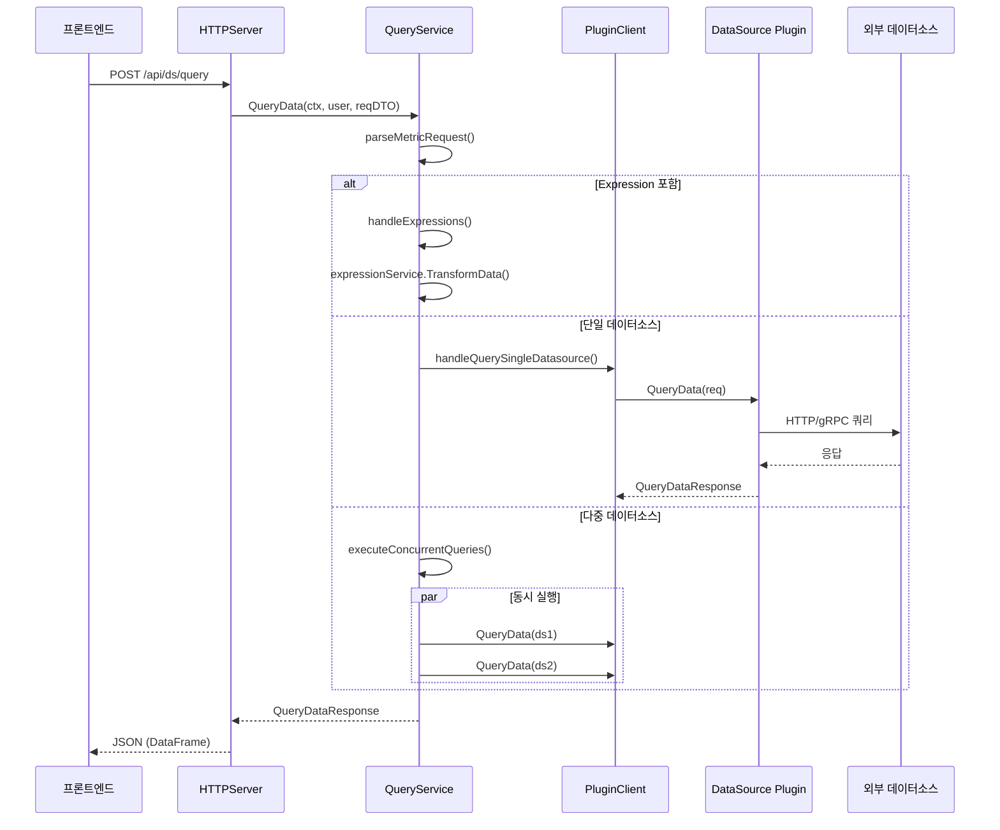

# Grafana 데이터소스 & 쿼리 파이프라인

Grafana의 쿼리 파이프라인은 프론트엔드 요청을 데이터소스 플러그인으로 라우팅하는 핵심 경로이다. `/api/ds/query` 모던 경로와 레거시 프록시 경로의 이중 구조, 서버사이드 Expression 엔진, DataFrame 데이터 모델을 분석한다.

## 목차
- [1. 핵심 개념 (What)](#1-핵심-개념-what)
- [2. 왜 알아야 하는가 (Why)](#2-왜-알아야-하는가-why)
- [3. 내부 구현 분석 (How)](#3-내부-구현-분석-how)
- [4. 실전 예제](#4-실전-예제)
- [5. 정리](#5-정리)

---

## 1. 핵심 개념 (What)

### 쿼리 파이프라인이란?

Grafana에서 대시보드 패널이 데이터를 표시하려면, 사용자의 쿼리가 다음 경로를 거친다:

1. **프론트엔드** -> HTTP POST `/api/ds/query`
2. **QueryService** -> 쿼리 파싱 & 데이터소스 식별
3. **PluginClient** -> 백엔드 플러그인으로 쿼리 전달
4. **DataSource Plugin** -> 외부 데이터소스(Prometheus, Loki 등) 쿼리 실행
5. **DataFrame** -> 표준화된 응답 형식으로 프론트엔드 반환

### 두 가지 쿼리 경로

| 경로 | 엔드포인트 | 설명 |
|------|-----------|------|
| **모던 경로** | `POST /api/ds/query` | QueryService -> pluginClient.QueryData() |
| **레거시 프록시** | `ANY /api/datasources/proxy/:id/*` | HTTP 프록시로 직접 전달 (deprecating) |

### DataSource 모델

```go
// pkg/services/datasources/models.go:45-77
type DataSource struct {
    ID       int64          // 내부 ID
    OrgID    int64          // 조직 ID
    Name     string         // 표시 이름
    Type     string         // "prometheus", "loki" 등
    Access   DsAccess       // "proxy" 또는 "direct"
    URL      string         // 데이터소스 URL
    UID      string         // 고유 식별자
    JsonData *simplejson.Json  // 데이터소스별 설정
    SecureJsonData map[string][]byte  // 암호화된 설정
    // ...
}
```

---

## 2. 왜 알아야 하는가 (Why)

1. **쿼리 성능 최적화**: `concurrentQueryLimit`를 이해하면 멀티 데이터소스 대시보드의 병목을 해소할 수 있다.
2. **Expression 활용**: 서버사이드 Expression(`$A > 100`)을 활용해 여러 데이터소스의 결과를 하나의 쿼리로 조합할 수 있다.
3. **커스텀 데이터소스 개발**: QueryData() 인터페이스와 DataFrame 변환 과정을 이해하면 자체 데이터소스 플러그인을 개발할 수 있다.
4. **디버깅**: 쿼리 실패 시 어느 계층에서 오류가 발생했는지 추적할 수 있다.

---

## 3. 내부 구현 분석 (How)

### 3.1 쿼리 파이프라인 전체 흐름



### 3.2 QueryService (ServiceImpl)

`QueryService`는 쿼리 파이프라인의 핵심 오케스트레이터이다.

```go
// pkg/services/query/query.go:84-95
type ServiceImpl struct {
    cfg                        *setting.Cfg
    dataSourceCache            datasources.CacheService
    expressionService          *expr.Service
    dataSourceRequestValidator validations.DataSourceRequestValidator
    pluginClient               plugins.Client
    pCtxProvider               *plugincontext.Provider
    log                        log.Logger
    concurrentQueryLimit       int  // runtime.NumCPU() 기본값
}
```

**핵심 메서드 `queryData()`의 분기 로직:**

```go
// pkg/services/query/query.go:104-127
func (s *ServiceImpl) queryData(ctx context.Context, user identity.Requester,
    skipDSCache bool, reqDTO dtos.MetricRequest, supportLocaltimeRange bool) (*backend.QueryDataResponse, error) {

    parsedReq, err := s.parseMetricRequest(ctx, user, skipDSCache, reqDTO, supportLocaltimeRange)
    if err != nil {
        return nil, err
    }

    // 분기 1: Expression이 포함된 경우
    if parsedReq.hasExpression || fromAlert {
        return s.handleExpressions(ctx, user, parsedReq)
    }
    // 분기 2: 단일 데이터소스
    if len(parsedReq.parsedQueries) == 1 {
        return s.handleQuerySingleDatasource(ctx, user, parsedReq)
    }
    // 분기 3: 다중 데이터소스 (동시 실행)
    return s.executeConcurrentQueries(ctx, user, skipDSCache, reqDTO, parsedReq.parsedQueries)
}
```

### 3.3 쿼리 파싱 (parseMetricRequest)

```go
// pkg/services/query/query.go:388-464
func (s *ServiceImpl) parseMetricRequest(...) (*parsedRequest, error) {
    req := &parsedRequest{
        hasExpression: false,
        parsedQueries: make(map[string][]parsedQuery),
        dsTypes:       make(map[string]bool),
    }

    for _, query := range reqDTO.Queries {
        // 1. 데이터소스 식별 (UID 기반)
        ds, err := s.getDataSourceFromQuery(ctx, user, skipDSCache, query, datasourcesByUid)

        // 2. Expression 여부 판단
        if expr.NodeTypeFromDatasourceUID(ds.UID) != expr.TypeDatasourceNode {
            req.hasExpression = true
        }

        // 3. parsedQuery 생성
        pq := parsedQuery{
            datasource: ds,
            query: backend.DataQuery{
                TimeRange:     backend.TimeRange{From: ..., To: ...},
                RefID:         query.Get("refId").MustString("A"),
                MaxDataPoints: query.Get("maxDataPoints").MustInt64(100),
                Interval:      time.Duration(query.Get("intervalMs").MustInt64(1000)) * time.Millisecond,
                QueryType:     query.Get("queryType").MustString(""),
                JSON:          modelJSON,
            },
        }
        req.parsedQueries[ds.UID] = append(req.parsedQueries[ds.UID], pq)
    }
    return req, nil
}
```

### 3.4 데이터소스 식별 전략

```go
// pkg/services/query/query.go:466-508
func (s *ServiceImpl) getDataSourceFromQuery(...) (*datasources.DataSource, error) {
    // 우선순위 1: datasource.uid 필드
    uid := query.Get("datasource").Get("uid").MustString()

    // 우선순위 2: Expression 타입 확인
    if kind := expr.NodeTypeFromDatasourceUID(uid); kind != expr.TypeDatasourceNode {
        return expr.DataSourceModelFromNodeType(kind)
    }

    // 우선순위 3: Grafana 내장 데이터소스
    if uid == grafanads.DatasourceUID {
        return grafanads.DataSourceModel(user.GetOrgID()), nil
    }

    // 우선순위 4: UID로 캐시 조회
    if uid != "" {
        return s.dataSourceCache.GetDatasourceByUID(ctx, uid, user, skipDSCache)
    }

    // 우선순위 5: 레거시 datasourceId (deprecated)
    id := query.Get("datasourceId").MustInt64(0)
    if id > 0 {
        return s.dataSourceCache.GetDatasource(ctx, id, user, skipDSCache)
    }

    return nil, ErrInvalidDatasourceID
}
```

### 3.5 동시 쿼리 실행 (Multi-DataSource)

Mixed 데이터소스 쿼리에서는 `errgroup`을 사용하여 동시에 실행한다:

```go
// pkg/services/query/query.go:144-217
func (s *ServiceImpl) executeConcurrentQueries(...) (*backend.QueryDataResponse, error) {
    g, ctx := errgroup.WithContext(ctx)
    g.SetLimit(s.concurrentQueryLimit)  // CPU 코어 수 기본
    rchan := make(chan splitResponse, len(queriesbyDs))

    for _, queries := range queriesbyDs {
        g.Go(func() error {
            subDTO := reqDTO.CloneWithQueries(rawQueries)
            defer recoveryFn(subDTO.Queries)  // 패닉 복구

            ctxCopy := contexthandler.CopyWithReqContext(ctx)
            subResp, err := s.QueryData(ctxCopy, user, skipDSCache, subDTO)
            if err == nil {
                rchan <- splitResponse{subResp.Responses, header}
            } else {
                rchan <- buildErrorResponses(err, subDTO.Queries)
            }
            return nil
        })
    }

    g.Wait()
    close(rchan)

    // 결과 병합
    resp := backend.NewQueryDataResponse()
    for result := range rchan {
        for refId, dataResponse := range result.responses {
            resp.Responses[refId] = dataResponse
        }
    }
    return resp, nil
}
```

### 3.6 단일 데이터소스 쿼리 실행

```go
// pkg/services/query/query.go:291-334
func (s *ServiceImpl) handleQuerySingleDatasource(...) (*backend.QueryDataResponse, error) {
    queries := parsedReq.getFlattenedQueries()
    ds := queries[0].datasource

    // URL 검증
    if err := s.dataSourceRequestValidator.Validate(ds.URL, ds.JsonData, nil); err != nil {
        return nil, datasources.ErrDataSourceAccessDenied
    }

    req := &backend.QueryDataRequest{
        Headers: map[string]string{},
        Queries: []backend.DataQuery{},
    }

    for _, q := range queries {
        req.Queries = append(req.Queries, q.query)
    }

    // 쿼리 서비스 분기: 단일 테넌트 vs K8s 쿼리 서비스
    qsDsClient, ok, err := s.qsDatasourceClientBuilder.BuildClient(ds.Type, ds.UID)
    if !ok {
        // 단일 테넌트: 플러그인 직접 호출
        pCtx, _ := s.pCtxProvider.GetWithDataSource(ctx, ds.Type, user, ds)
        req.PluginContext = pCtx
        return s.pluginClient.QueryData(ctx, req)
    } else {
        // K8s 쿼리 서비스 경로
        k8sReq, _ := expr.ConvertBackendRequestToDataRequest(req)
        return qsDsClient.QueryData(ctx, *k8sReq)
    }
}
```

### 3.7 Expression 처리

Expression은 서버사이드에서 여러 쿼리 결과를 조합/변환하는 기능이다:

```go
// pkg/services/query/query.go:250-288
func (s *ServiceImpl) handleExpressions(...) (*backend.QueryDataResponse, error) {
    exprReq := expr.Request{
        Queries: []expr.Query{},
        User:    user,
        OrgId:   user.GetOrgID(),
    }

    for _, pq := range parsedReq.getFlattenedQueries() {
        exprReq.Queries = append(exprReq.Queries, expr.Query{
            JSON:          pq.query.JSON,
            RefID:         pq.query.RefID,
            DataSource:    pq.datasource,
            TimeRange:     expr.AbsoluteTimeRange{From: ..., To: ...},
        })
    }

    // TransformData가 DAG(Directed Acyclic Graph)를 구성하여
    // 데이터소스 쿼리 실행 -> Expression 평가 순서로 처리
    return s.expressionService.TransformData(ctx, time.Now(), &exprReq)
}
```

### 3.8 DataFrame 데이터 구조

모든 쿼리 결과는 `data.Frame`(DataFrame)으로 표준화된다:

```mermaid
graph TD
    subgraph "QueryDataResponse"
        Responses[Responses map<br/>key: RefID]
    end

    subgraph "DataResponse"
        Frames[data.Frames<br/>[]data.Frame]
        Error[Error]
        Status[Status Code]
    end

    subgraph "data.Frame"
        Name[Name string]
        Fields[Fields<br/>[]data.Field]
        Meta[FrameMeta]
    end

    subgraph "data.Field"
        FName[Name string]
        FType[Type FieldType]
        Labels[Labels map]
        Values[Values []any]
    end

    Responses --> DataResponse
    DataResponse --> Frames
    Frames --> Name
    Frames --> Fields
    Frames --> Meta
    Fields --> FName
    Fields --> FType
    Fields --> Labels
    Fields --> Values
```

### 3.9 레거시 프록시 경로

```go
// pkg/api/api.go:422-436 (라우트 등록)
// 모던 경로와 달리 HTTP 요청을 데이터소스 URL로 직접 프록시
datasourceRoute.Any("/proxy/uid/:uid",
    authorize(ac.EvalPermission(datasources.ActionQuery)),
    hs.ProxyDataSourceRequestWithUID)
datasourceRoute.Any("/proxy/uid/:uid/*",
    authorize(ac.EvalPermission(datasources.ActionQuery)),
    hs.ProxyDataSourceRequestWithUID)
```

레거시 프록시는 `DataSourceProxyService`가 HTTP reverse proxy로 동작하여, 요청을 데이터소스의 원본 API로 직접 전달한다. Expression, 멀티 데이터소스 등 고급 기능을 지원하지 않으며, 점진적으로 모던 경로(`/api/ds/query`)로 전환 중이다.

### 3.10 요청 헤더 전파

QueryService는 디버깅과 라우팅을 위한 커스텀 헤더를 정의한다:

```go
// pkg/services/query/query.go:34-44
const (
    HeaderPluginID       = "X-Plugin-Id"       // 라우팅용
    HeaderDatasourceUID  = "X-Datasource-Uid"  // 로드 밸런싱용
    HeaderDashboardUID   = "X-Dashboard-Uid"   // 디버깅용
    HeaderPanelID        = "X-Panel-Id"         // 디버깅용
    HeaderDashboardTitle = "X-Dashboard-Title"  // 부하 식별용
    HeaderFromExpression = "X-Grafana-From-Expr" // Expression 쿼리 식별
)
```

---

## 4. 실전 예제

### 예제 1: 프론트엔드에서 보내는 쿼리 요청

```json
POST /api/ds/query
{
  "from": "now-1h",
  "to": "now",
  "queries": [
    {
      "refId": "A",
      "datasource": {
        "uid": "prometheus-uid",
        "type": "prometheus"
      },
      "expr": "rate(http_requests_total[5m])",
      "range": true,
      "maxDataPoints": 1000,
      "intervalMs": 15000
    },
    {
      "refId": "B",
      "datasource": {
        "uid": "__expr__",
        "type": "__expr__"
      },
      "type": "math",
      "expression": "$A > 100"
    }
  ]
}
```

이 요청의 내부 처리 흐름:
1. `parseMetricRequest()`: `__expr__` UID 감지 -> `hasExpression = true`
2. `handleExpressions()` 호출
3. `expressionService.TransformData()`:
   - 먼저 RefID "A"의 Prometheus 쿼리 실행
   - 그 결과에 "B"의 math expression 적용
4. 최종 응답에 "A"와 "B" 모두 포함

### 예제 2: concurrentQueryLimit 튜닝

```ini
# grafana.ini
[query]
# 기본값은 runtime.NumCPU()
# 데이터소스가 느린 경우 늘릴 수 있음
concurrent_query_limit = 20
```

```go
// 내부에서 이 값이 어떻게 사용되는지:
// pkg/services/query/query.go:63
concurrentQueryLimit: cfg.SectionWithEnvOverrides("query").
    Key("concurrent_query_limit").MustInt(runtime.NumCPU()),

// errgroup의 동시 실행 제한
// pkg/services/query/query.go:145-146
g, ctx := errgroup.WithContext(ctx)
g.SetLimit(s.concurrentQueryLimit)
```

### 예제 3: 커스텀 백엔드 데이터소스 플러그인 구현

```go
package main

import (
    "context"
    "github.com/grafana/grafana-plugin-sdk-go/backend"
    "github.com/grafana/grafana-plugin-sdk-go/data"
)

type MyDatasource struct{}

func (d *MyDatasource) QueryData(ctx context.Context, req *backend.QueryDataRequest) (*backend.QueryDataResponse, error) {
    response := backend.NewQueryDataResponse()

    for _, q := range req.Queries {
        // 1. 쿼리 JSON 파싱
        // 2. 외부 API 호출
        // 3. DataFrame으로 변환
        frame := data.NewFrame("response",
            data.NewField("time", nil, []time.Time{time.Now()}),
            data.NewField("value", nil, []float64{42.0}),
        )
        response.Responses[q.RefID] = backend.DataResponse{
            Frames: data.Frames{frame},
        }
    }
    return response, nil
}

func (d *MyDatasource) CheckHealth(ctx context.Context, req *backend.CheckHealthRequest) (*backend.CheckHealthResult, error) {
    return &backend.CheckHealthResult{
        Status:  backend.HealthStatusOk,
        Message: "Data source is working",
    }, nil
}
```

---

## 5. 정리

| 구분 | 핵심 내용 |
|------|----------|
| **모던 쿼리 경로** | `POST /api/ds/query` -> QueryService -> pluginClient.QueryData() |
| **레거시 프록시** | `/api/datasources/proxy/:id/*` -> HTTP reverse proxy (deprecating) |
| **쿼리 분기 로직** | Expression -> handleExpressions() / 단일 DS -> handleQuerySingleDatasource() / 다중 DS -> executeConcurrentQueries() |
| **동시 실행 제한** | `concurrent_query_limit` (기본: CPU 코어 수), errgroup.SetLimit() |
| **데이터소스 식별** | UID 우선 -> Expression 확인 -> 내장 DS -> 캐시 조회 -> ID 폴백 |
| **Expression 엔진** | `expr.Service.TransformData()`, DAG 기반 파이프라인 |
| **응답 형식** | `backend.QueryDataResponse` -> `data.Frame` (DataFrame) |
| **요청 헤더** | X-Plugin-Id, X-Datasource-Uid, X-Dashboard-Uid (디버깅/라우팅) |
| **DS 모델** | Type, URL, UID, JsonData, SecureJsonData |
| **패닉 복구** | `recoveryFn()`으로 개별 쿼리 패닉이 전체 요청을 죽이지 않음 |

---

*참고: Grafana v11.x, grafana-plugin-sdk-go v0.228+, backend.QueryDataRequest/Response API*
