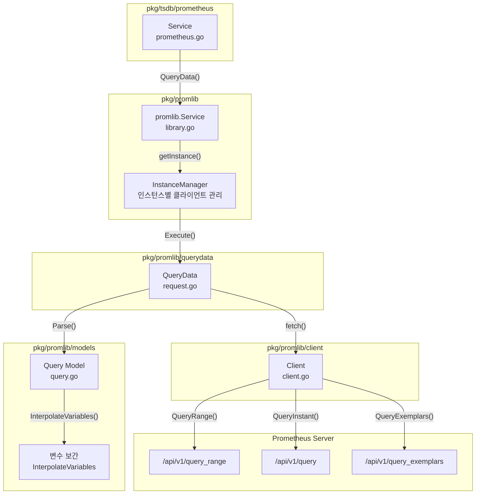
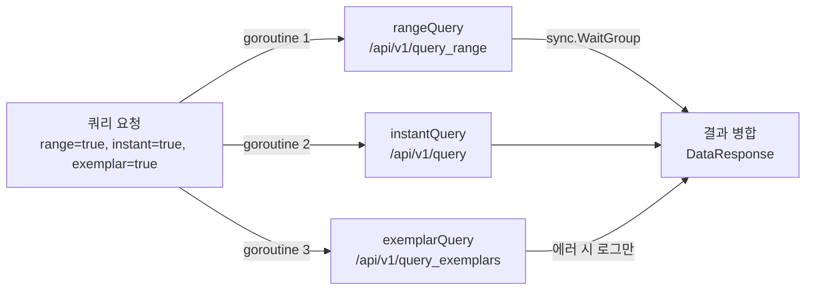

# Grafana-Prometheus 연동 내부 구현

Grafana의 Prometheus 데이터소스는 기본 Go Prometheus 클라이언트 대신 커스텀 HTTP 클라이언트를 사용하며, range/instant/exemplar 쿼리를 병렬 실행하고, 템플릿 변수 보간을 서버사이드에서 처리한다. 이 문서에서는 쿼리 실행부터 DataFrame 변환까지의 전체 경로를 소스코드 레벨로 분석한다.

## 목차
- [1. 핵심 개념 (What)](#1-핵심-개념-what)
- [2. 왜 알아야 하는가 (Why)](#2-왜-알아야-하는가-why)
- [3. 내부 구현 분석 (How)](#3-내부-구현-분석-how)
- [4. 실전 예제](#4-실전-예제)
- [5. 정리](#5-정리)

---

## 1. 핵심 개념 (What)

### Prometheus 데이터소스의 구조

Grafana의 Prometheus 연동은 3계층으로 분리되어 있다:

| 계층 | 패키지 | 역할 |
|------|--------|------|
| **진입점** | `pkg/tsdb/prometheus/` | Grafana Wire DI 통합, Azure/SigV4 인증 확장 |
| **코어 라이브러리** | `pkg/promlib/` | 인스턴스 관리, QueryData 오케스트레이션 |
| **쿼리 실행** | `pkg/promlib/querydata/` | 병렬 쿼리 실행, 응답 파싱, DataFrame 변환 |
| **HTTP 클라이언트** | `pkg/promlib/client/` | 커스텀 Prometheus API 클라이언트 |

### 왜 커스텀 클라이언트인가?

```go
// pkg/promlib/client/client.go:23-25
// Client is a custom Prometheus client. Reason for this is that Prom Go client
// serializes response into its own objects, we have to go through them and then
// serialize again into DataFrame which isn't very efficient.
```

표준 Prometheus Go 클라이언트(`prometheus/client_golang`)는 응답을 자체 모델 객체로 역직렬화한다. Grafana는 이를 다시 DataFrame으로 변환해야 하므로, **이중 직렬화 오버헤드**가 발생한다. 커스텀 클라이언트는 HTTP 응답을 직접 DataFrame으로 파싱하여 성능을 크게 개선했다.

### 쿼리 타입

```go
// pkg/promlib/models/query.go:148-154
const (
    RangeQueryType    TimeSeriesQueryType = "range"     // 시계열 범위 쿼리
    InstantQueryType  TimeSeriesQueryType = "instant"   // 특정 시점 쿼리
    ExemplarQueryType TimeSeriesQueryType = "exemplar"  // Exemplar 쿼리
)
```

---

## 2. 왜 알아야 하는가 (Why)

1. **성능 최적화**: `$__rate_interval` vs `$__interval`의 차이를 이해하면 PromQL 쿼리 성능을 극적으로 개선할 수 있다.
2. **병렬 실행 이해**: range + instant + exemplar 쿼리가 동시에 실행되는 구조를 알면, 대시보드 로딩 패턴을 최적화할 수 있다.
3. **디버깅**: 쿼리가 실패할 때 HTTP 클라이언트 레벨에서의 타임아웃, 인증, URL 조합 등을 정확히 추적할 수 있다.
4. **변수 보간**: `$__interval`, `$__rate_interval`, `$__range` 등의 변수가 어떤 값으로 치환되는지 정확히 파악할 수 있다.

---

## 3. 내부 구현 분석 (How)

### 3.1 전체 아키텍처



### 3.2 진입점: Service (pkg/tsdb/prometheus)

```go
// pkg/tsdb/prometheus/prometheus.go:16-26
type Service struct {
    lib *promlib.Service
}

func ProvideService(httpClientProvider *sdkhttpclient.Provider) *Service {
    plog := backend.NewLoggerWith("logger", "tsdb.prometheus")
    return &Service{
        lib: promlib.NewService(httpClientProvider, plog, extendClientOpts),
    }
}

// 모든 호출을 promlib로 위임
func (s *Service) QueryData(ctx context.Context, req *backend.QueryDataRequest) (*backend.QueryDataResponse, error) {
    return s.lib.QueryData(ctx, req)
}
```

`extendClientOpts`는 Azure 인증과 AWS SigV4 서명을 HTTP 클라이언트에 추가하는 확장 포인트이다:

```go
// pkg/tsdb/prometheus/prometheus.go:60-82
func extendClientOpts(ctx context.Context, settings backend.DataSourceInstanceSettings,
    clientOpts *sdkhttpclient.Options, plog log.Logger) error {
    // AWS SigV4 설정
    if clientOpts.SigV4 != nil {
        clientOpts.SigV4.Service = "aps"
    }
    // Azure 인증 설정
    if azureSettings.AzureAuthEnabled {
        azureauth.ConfigureAzureAuthentication(settings, azureSettings, clientOpts, ...)
    }
    return nil
}
```

### 3.3 인스턴스 관리: promlib.Service

```go
// pkg/promlib/library.go:32-39
func NewService(httpClientProvider *sdkhttpclient.Provider, plog log.Logger, extendOptions ExtendOptions) *Service {
    return &Service{
        im:     datasource.NewInstanceManager(newInstanceSettings(httpClientProvider, plog, extendOptions)),
        logger: plog,
    }
}
```

`InstanceManager`는 데이터소스 설정이 변경될 때마다 새 인스턴스를 생성하고 기존 인스턴스를 정리한다. 각 인스턴스는 독립적인 HTTP 클라이언트와 QueryData 핸들러를 가진다:

```go
// pkg/promlib/library.go:50-88
func newInstanceSettings(...) datasource.InstanceFactoryFunc {
    return func(ctx context.Context, settings backend.DataSourceInstanceSettings) (instancemgmt.Instance, error) {
        // 1. HTTP Transport 옵션 생성
        opts, _ := client.CreateTransportOptions(ctx, settings, log)

        // 2. 확장 옵션 적용 (Azure, SigV4 등)
        extendOptions(ctx, settings, opts, log)

        // 3. HTTP 클라이언트 생성
        httpClient, _ := httpClientProvider.New(*opts)

        // 4. QueryData 핸들러 생성 (커스텀 클라이언트 포함)
        qd, _ := querydata.New(httpClient, settings, log, featureToggles)

        // 5. Resource 핸들러 생성 (label values, series 등)
        r, _ := resource.New(httpClient, settings, log)

        return instance{queryData: qd, resource: r}, nil
    }
}
```

### 3.4 쿼리 실행: QueryData.Execute()

```go
// pkg/promlib/querydata/request.go:95-123
func (s *QueryData) Execute(ctx context.Context, req *backend.QueryDataRequest) (*backend.QueryDataResponse, error) {
    fromAlert := req.Headers["FromAlert"] == "true"
    result := backend.QueryDataResponse{Responses: backend.Responses{}}

    concurrentQueryCount, err := req.PluginContext.GrafanaConfig.ConcurrentQueryCount()
    if err != nil {
        concurrentQueryCount = 10  // 기본값 10
    }

    // 모든 쿼리를 병렬 실행 (concurrentQueryCount 제한)
    _ = concurrency.ForEachJob(ctx, len(req.Queries), concurrentQueryCount, func(ctx context.Context, idx int) error {
        query := req.Queries[idx]
        r := s.handleQuery(ctx, query, fromAlert)
        if r != nil {
            m.Lock()
            result.Responses[query.RefID] = *r
            m.Unlock()
        }
        return nil
    })

    return &result, nil
}
```

### 3.5 개별 쿼리 처리: handleQuery -> fetch

```go
// pkg/promlib/querydata/request.go:125-140
func (s *QueryData) handleQuery(ctx context.Context, bq backend.DataQuery, fromAlert bool) *backend.DataResponse {
    // 1. 쿼리 모델 파싱 + 변수 보간
    query, err := models.Parse(ctx, s.log, span, bq, s.TimeInterval, s.intervalCalculator, fromAlert)
    // 2. fetch 실행 (range + instant + exemplar 병렬)
    return s.fetch(traceCtx, s.client, query)
}
```

### 3.6 병렬 fetch: range + instant + exemplar

이것이 Prometheus 통합의 핵심이다. 하나의 쿼리가 최대 3개의 HTTP 요청으로 분할되어 **동시에** 실행된다:

```go
// pkg/promlib/querydata/request.go:142-196
func (s *QueryData) fetch(traceCtx context.Context, client *client.Client, q *models.Query) *backend.DataResponse {
    dr := &backend.DataResponse{Frames: data.Frames{}}
    var wg sync.WaitGroup
    var m sync.Mutex

    // Instant 쿼리 (동시 실행)
    if q.InstantQuery {
        wg.Add(1)
        go func() {
            defer wg.Done()
            res := s.instantQuery(traceCtx, client, q)
            m.Lock()
            addDataResponse(&res, dr)
            m.Unlock()
        }()
    }

    // Range 쿼리 (동시 실행)
    if q.RangeQuery {
        wg.Add(1)
        go func() {
            defer wg.Done()
            res := s.rangeQuery(traceCtx, client, q)
            m.Lock()
            addDataResponse(&res, dr)
            m.Unlock()
        }()
    }

    // Exemplar 쿼리 (동시 실행, 에러 시 로그만 남김)
    if q.ExemplarQuery {
        wg.Add(1)
        go func() {
            defer wg.Done()
            res := s.exemplarQuery(traceCtx, client, q)
            m.Lock()
            if res.Error != nil {
                // Exemplar 실패는 전체 쿼리를 실패시키지 않음
                logger.Error("Exemplar query failed", "query", q.Expr, "err", res.Error)
            }
            dr.Frames = append(dr.Frames, res.Frames...)
            m.Unlock()
        }()
    }

    wg.Wait()
    return dr
}
```



### 3.7 커스텀 HTTP 클라이언트

```go
// pkg/promlib/client/client.go:26-31
type Client struct {
    doer         doer       // http.Client 래핑
    method       string     // GET 또는 POST (기본: POST)
    baseUrl      string     // Prometheus 서버 URL
    queryTimeout string     // 쿼리 타임아웃
}
```

**Range Query 요청 구성:**

```go
// pkg/promlib/client/client.go:37-55
func (c *Client) QueryRange(ctx context.Context, q *models.Query) (*http.Response, error) {
    tr := q.TimeRange()
    qv := map[string]string{
        "query": q.Expr,
        "start": formatTime(tr.Start),
        "end":   formatTime(tr.End),
        "step":  strconv.FormatFloat(tr.Step.Seconds(), 'f', -1, 64),
    }
    if c.queryTimeout != "" {
        qv["timeout"] = c.queryTimeout
    }
    req, _ := c.createQueryRequest(ctx, "api/v1/query_range", qv)
    return c.doer.Do(req)
}
```

**Instant Query 요청 -- TimeRange 정렬하지 않음:**

```go
// pkg/promlib/client/client.go:57-74
func (c *Client) QueryInstant(ctx context.Context, q *models.Query) (*http.Response, error) {
    // 주의: Instant 쿼리는 TimeRange 정렬을 사용하지 않음
    // q.TimeRange()는 step에 맞춰 정렬하므로 시점이 왜곡됨
    // 대신 q.End를 직접 사용
    qv := map[string]string{"query": q.Expr, "time": formatTime(q.End)}
    req, _ := c.createQueryRequest(ctx, "api/v1/query", qv)
    return c.doer.Do(req)
}
```

**POST vs GET:**

```go
// pkg/promlib/client/client.go:115-136
func (c *Client) createQueryRequest(ctx context.Context, endpoint string, qv map[string]string) (*http.Request, error) {
    if strings.ToUpper(c.method) == http.MethodPost {
        u, _ := c.createUrl(endpoint, nil)
        v := make(url.Values)
        for key, val := range qv {
            v.Set(key, val)
        }
        return createRequest(ctx, c.method, u, strings.NewReader(v.Encode()))
    }
    // GET: 쿼리 파라미터로 전달
    u, _ := c.createUrl(endpoint, qv)
    return createRequest(ctx, c.method, u, http.NoBody)
}
```

POST 요청 시 `Content-Type: application/x-www-form-urlencoded`를 설정하고, `Idempotency-Key` 헤더를 nil로 설정하여 Go HTTP 라이브러리의 자동 재시도를 활성화한다.

### 3.8 쿼리 모델 파싱과 변수 보간

```go
// pkg/promlib/models/query.go:207-292
func Parse(ctx context.Context, log glog.Logger, span trace.Span, query backend.DataQuery,
    dsScrapeInterval string, intervalCalculator intervalv2.Calculator, fromAlert bool) (*Query, error) {

    model := &internalQueryModel{}
    json.Unmarshal(query.JSON, model)

    // 1. Step 계산
    calculatedStep, _ := calculatePrometheusInterval(
        model.Interval, dsScrapeInterval,
        int64(model.IntervalMS), model.IntervalFactor,
        query, intervalCalculator)

    // 2. 변수 보간 ($__interval, $__rate_interval 등)
    timeRange := query.TimeRange.To.Sub(query.TimeRange.From)
    expr := InterpolateVariables(model.Expr, query.Interval, calculatedStep,
        model.Interval, dsScrapeInterval, timeRange)

    // 3. 알림에서는 Exemplar 비활성화
    if fromAlert {
        model.Exemplar = false
    }

    // 4. 기본값: range=true (레거시 호환)
    if !model.Instant && !model.Range {
        model.Range = true
    }

    return &Query{
        Expr: expr, Step: calculatedStep,
        InstantQuery: model.Instant, RangeQuery: model.Range, ExemplarQuery: model.Exemplar,
    }, nil
}
```

### 3.9 템플릿 변수 상세 분석

```go
// pkg/promlib/models/query.go:124-145
// 내장 변수 목록
const (
    varInterval       = "$__interval"          // 계산된 step (예: 15s)
    varIntervalMs     = "$__interval_ms"       // 밀리초 (예: 15000)
    varRange          = "$__range"             // 시간 범위 (예: 3600s)
    varRangeS         = "$__range_s"           // 초 단위 (예: 3600)
    varRangeMs        = "$__range_ms"          // 밀리초 (예: 3600000)
    varRateInterval   = "$__rate_interval"     // rate() 최적 간격
    varRateIntervalMs = "$__rate_interval_ms"  // rate() 간격 밀리초
)
```

**`$__rate_interval` 계산 로직:**

```go
// pkg/promlib/models/query.go:361-377
func calculateRateInterval(queryInterval time.Duration, requestedMinStep string) time.Duration {
    scrape := requestedMinStep
    if scrape == "" {
        scrape = "15s"  // 기본 scrape 간격
    }
    scrapeIntervalDuration, _ := gtime.ParseIntervalStringToTimeDuration(scrape)

    // rate_interval = max(queryInterval + scrapeInterval, 4 * scrapeInterval)
    rateInterval := time.Duration(int64(math.Max(
        float64(queryInterval+scrapeIntervalDuration),
        float64(4)*float64(scrapeIntervalDuration),
    )))
    return rateInterval
}
```

**변수 보간 실행:**

```go
// pkg/promlib/models/query.go:386-427
func InterpolateVariables(expr string, queryInterval time.Duration, calculatedStep time.Duration,
    requestedMinStep string, dsScrapeInterval string, timeRange time.Duration) string {

    rangeMs := timeRange.Milliseconds()
    rangeSRounded := int64(math.Round(float64(rangeMs) / 1000.0))

    // $__rate_interval 계산
    rateInterval := calculateRateInterval(queryInterval, requestedMinStep)

    // 변수 치환
    expr = strings.ReplaceAll(expr, "$__interval_ms", strconv.FormatInt(...))
    expr = strings.ReplaceAll(expr, "$__interval", gtime.FormatInterval(calculatedStep))
    expr = strings.ReplaceAll(expr, "$__range_ms", strconv.FormatInt(rangeMs, 10))
    expr = strings.ReplaceAll(expr, "$__range_s", strconv.FormatInt(rangeSRounded, 10))
    expr = strings.ReplaceAll(expr, "$__range", strconv.FormatInt(rangeSRounded, 10)+"s")
    expr = strings.ReplaceAll(expr, "$__rate_interval_ms", ...)
    expr = strings.ReplaceAll(expr, "$__rate_interval", rateInterval.String())

    // ${} 문법도 동일하게 처리
    expr = strings.ReplaceAll(expr, "${__interval}", ...)
    // ...
    return expr
}
```

---

## 4. 실전 예제

### 예제 1: $__rate_interval 사용과 계산 결과

```promql
# 쿼리:
rate(http_requests_total[$__rate_interval])

# 조건:
# - 시간 범위: 1시간 (3600s)
# - maxDataPoints: 1000
# - scrape_interval: 15s

# 계산 과정:
# 1. queryInterval = 3600s / 1000 = 3.6s
# 2. calculatedStep = max(3.6s, safeInterval) -> 15s (최소 scrape 간격)
# 3. rate_interval = max(15s + 15s, 4 * 15s) = max(30s, 60s) = 60s

# 결과:
rate(http_requests_total[60s])
```

### 예제 2: $__interval vs $__rate_interval 비교

```promql
# $__interval: 단순히 계산된 step 값
# 같은 조건에서 $__interval = 15s
avg_over_time(metric[$__interval])
# -> avg_over_time(metric[15s])

# $__rate_interval: rate/increase 함수에 최적화
# 항상 4 * scrape_interval 이상을 보장
rate(metric[$__rate_interval])
# -> rate(metric[60s])  -- 최소 4 scrape를 커버
```

### 예제 3: 알림 쿼리에서의 동작 차이

```go
// 알림 평가 시 fromAlert = true
// pkg/promlib/models/query.go:270-272
if fromAlert {
    model.Exemplar = false  // Exemplar 비활성화
}
```

알림 평가에서는:
- Exemplar 쿼리가 항상 비활성화됨 (불필요한 오버헤드 제거)
- range + instant만 실행 (설정에 따라)

### 예제 4: Prometheus 데이터소스 설정 매핑

```json
// 데이터소스 설정 (JsonData)
{
    "httpMethod": "POST",        // Client.method
    "timeInterval": "15s",       // scrape interval
    "queryTimeout": "60s",       // Client.queryTimeout
    "httpHeaderName1": "X-Scope-OrgID",
    "httpHeaderValue1": "tenant-1"
}
```

```go
// 내부에서 이 값들이 어떻게 사용되는지:
// pkg/promlib/querydata/request.go:62-63
httpMethod, _ := maputil.GetStringOptional(jsonData, "httpMethod")
if httpMethod == "" {
    httpMethod = http.MethodPost  // 기본값: POST
}

// pkg/promlib/querydata/request.go:77
promClient := client.NewClient(httpClient, httpMethod, settings.URL, queryTimeout)
```

---

## 5. 정리

| 구분 | 핵심 내용 |
|------|----------|
| **커스텀 클라이언트** | 표준 Prom 클라이언트 대신 직접 HTTP 호출 -> DataFrame 파싱 (이중 직렬화 제거) |
| **병렬 실행** | range + instant + exemplar를 `sync.WaitGroup`으로 동시 실행 |
| **Exemplar 에러 처리** | Exemplar 쿼리 실패 시 로그만 남기고 나머지 결과는 정상 반환 |
| **$__rate_interval** | `max(queryInterval + scrapeInterval, 4 * scrapeInterval)` |
| **$__interval** | `max(calculatedInterval, safeInterval) * intervalFactor` |
| **기본 HTTP 메서드** | POST (application/x-www-form-urlencoded) |
| **인스턴스 관리** | InstanceManager가 설정 변경 시 자동 재생성 |
| **Instant 시점** | `q.End` 직접 사용 (TimeRange 정렬 안 함 -- 시점 왜곡 방지) |
| **알림에서의 차이** | Exemplar 항상 비활성화 |
| **인증 확장** | Azure AD, AWS SigV4 -- `extendClientOpts` 콜백 패턴 |

---

*참고: Grafana v11.x, pkg/promlib (promlib), Prometheus HTTP API v1, grafana-plugin-sdk-go v0.228+*
