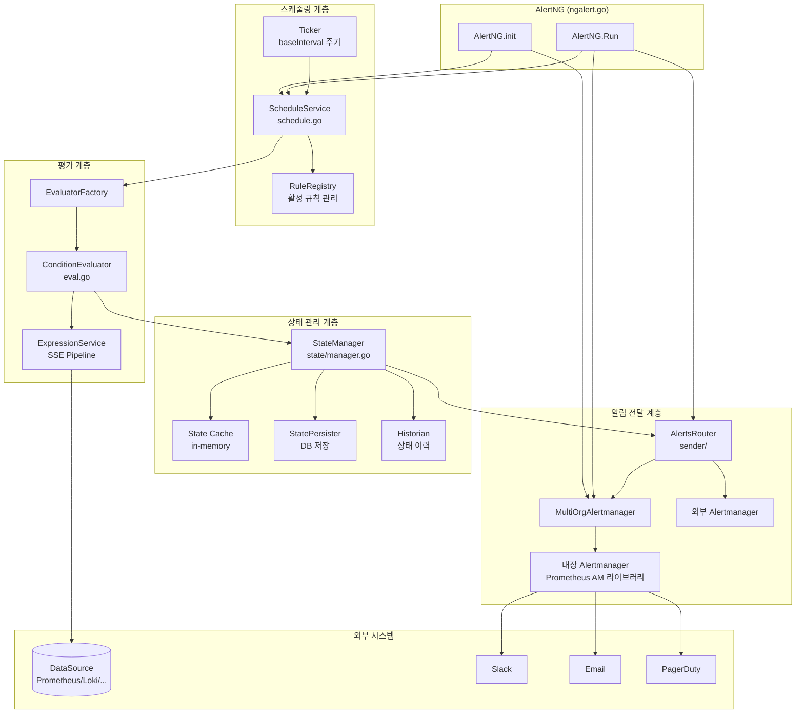
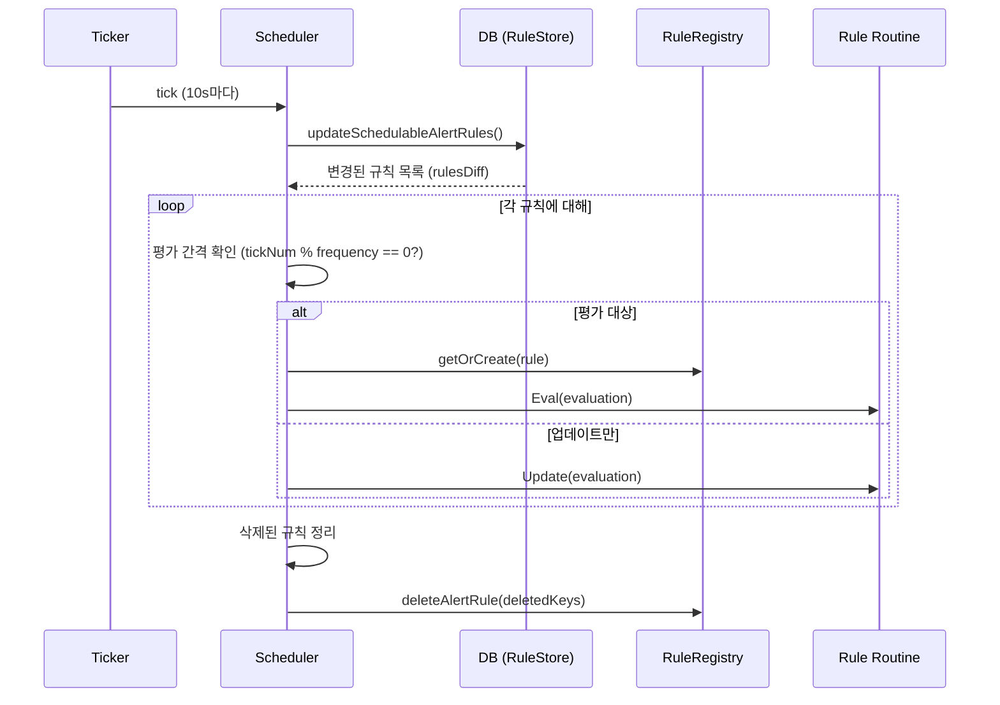
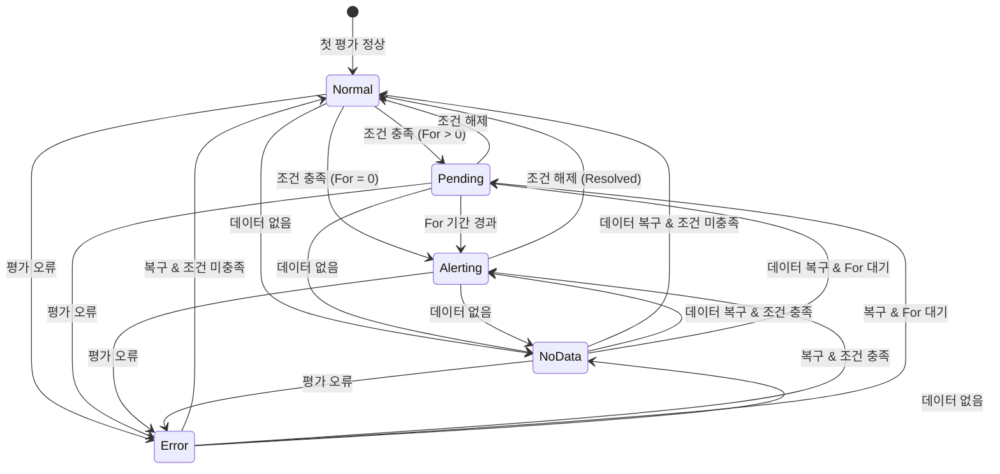

# Grafana Alerting (ngalert) 내부 구현

Grafana의 통합 알림 시스템(ngalert)은 ScheduleService 틱커 루프, eval 패키지의 조건 평가, StateManager의 상태 전이, 내장 Alertmanager의 알림 라우팅으로 구성된다. 이 문서에서는 alert rule 정의부터 사용자 알림 전달까지의 전체 경로를 소스코드 레벨로 분석한다.

## 목차
- [1. 핵심 개념 (What)](#1-핵심-개념-what)
- [2. 왜 알아야 하는가 (Why)](#2-왜-알아야-하는가-why)
- [3. 내부 구현 분석 (How)](#3-내부-구현-분석-how)
- [4. 실전 예제](#4-실전-예제)
- [5. 정리](#5-정리)

---

## 1. 핵심 개념 (What)

### ngalert란?

ngalert(Next Generation Alerting)은 Grafana 8.0에서 도입된 통합 알림 시스템이다. 기존 대시보드 기반 알림을 대체하며, 다음과 같은 특징이 있다:

- **다중 데이터소스 지원**: 하나의 alert rule에서 여러 데이터소스의 결과를 조합 가능
- **서버사이드 평가**: 대시보드 없이도 독립적으로 알림 규칙 평가
- **Prometheus Alertmanager 호환**: Prometheus Alertmanager 라이브러리를 내장하여 알림 라우팅, 그룹핑, 억제 기능 제공
- **상태 머신 기반**: Normal -> Pending -> Alerting -> Resolved 상태 전이

### 주요 컴포넌트

| 컴포넌트 | 패키지 | 역할 |
|----------|--------|------|
| **AlertNG** | `pkg/services/ngalert/` | 전체 알림 시스템 오케스트레이터 |
| **ScheduleService** | `pkg/services/ngalert/schedule/` | 틱커 기반 규칙 평가 스케줄링 |
| **EvaluatorFactory** | `pkg/services/ngalert/eval/` | 데이터소스 쿼리 + 조건 평가 |
| **StateManager** | `pkg/services/ngalert/state/` | 알림 상태 전이 관리 |
| **MultiOrgAlertmanager** | `pkg/services/ngalert/notifier/` | 내장 Alertmanager |
| **AlertsRouter** | `pkg/services/ngalert/sender/` | 알림 라우팅 (내장/외부 AM) |

---

## 2. 왜 알아야 하는가 (Why)

1. **알림 누락 디버깅**: 알림이 발생하지 않을 때, 스케줄러 -> 평가기 -> 상태 관리자 -> Alertmanager 중 어디에서 문제인지 정확히 추적할 수 있다.
2. **평가 간격 최적화**: `BaseInterval`, `MinRuleInterval`, `JitterStrategy`를 이해하면 대규모 알림 규칙에서의 부하를 분산할 수 있다.
3. **상태 전이 이해**: Pending 기간, NoData/Error 처리 정책을 정확히 파악하여 불필요한 알림을 줄일 수 있다.
4. **HA 모드 운영**: 다중 Grafana 인스턴스에서 알림 중복/누락을 방지하는 아키텍처를 이해할 수 있다.

---

## 3. 내부 구현 분석 (How)

### 3.1 전체 아키텍처



### 3.2 AlertNG: 전체 오케스트레이터

```go
// pkg/services/ngalert/ngalert.go:139-184
type AlertNG struct {
    Cfg               *setting.Cfg
    FeatureToggles    featuremgmt.FeatureToggles
    DataSourceCache   datasources.CacheService
    ExpressionService *expr.Service
    Metrics           *metrics.NGAlert
    Log               log.Logger

    // 핵심 컴포넌트
    schedule          schedule.ScheduleService
    stateManager      *state.Manager
    MultiOrgAlertmanager *notifier.MultiOrgAlertmanager
    AlertsRouter      *sender.AlertsRouter
    ImageService      image.ImageService

    // 스토리지
    store             *store.DBstore
    InstanceStore     state.InstanceStore

    // API
    Api               *api.API
}
```

**AlertNG.Run()** -- 3개의 고루틴이 동시 실행:

```go
// pkg/services/ngalert/ngalert.go:616-635
func (ng *AlertNG) Run(ctx context.Context) error {
    children, subCtx := errgroup.WithContext(ctx)

    // 1. MultiOrgAlertmanager 실행 (알림 수신 및 라우팅)
    children.Go(func() error {
        return ng.MultiOrgAlertmanager.Run(subCtx)
    })

    // 2. AlertsRouter 실행 (내장/외부 AM 라우팅)
    children.Go(func() error {
        return ng.AlertsRouter.Run(subCtx)
    })

    // 3. 스케줄러 실행 (규칙 평가 루프)
    if ng.Cfg.UnifiedAlerting.ExecuteAlerts {
        children.Go(func() error {
            runner := &evaluationRunner{ng: ng}
            return runner.run(subCtx)
        })
    }
    return children.Wait()
}
```

### 3.3 AlertNG.init(): 초기화 순서

```go
// pkg/services/ngalert/ngalert.go:186-543 (핵심 초기화 흐름)
func (ng *AlertNG) init() error {
    // 1. MultiOrgAlertmanager 생성 및 초기 동기화
    moa, _ := notifier.NewMultiOrgAlertmanager(...)
    ng.MultiOrgAlertmanager = moa
    moa.LoadAndSyncAlertmanagersForOrgs(initCtx)  // warm-up

    // 2. AlertsRouter 생성 및 초기 동기화
    alertsRouter := sender.NewAlertsRouter(moa, ng.store, ...)
    alertsRouter.SyncAndApplyConfigFromDatabase(initCtx)  // warm-up
    ng.AlertsRouter = alertsRouter

    // 3. 평가기 팩토리 생성
    evalFactory := eval.NewEvaluatorFactory(ng.Cfg.UnifiedAlerting, ng.DataSourceCache, ng.ExpressionService)

    // 4. 스케줄러 설정
    ng.schedCfg = schedule.SchedulerCfg{
        RetryConfig: schedule.RetryConfig{
            MaxAttempts:         ng.Cfg.UnifiedAlerting.MaxAttempts,
            InitialRetryDelay:   ng.Cfg.UnifiedAlerting.InitialRetryDelay,
            MaxRetryDelay:       ng.Cfg.UnifiedAlerting.MaxRetryDelay,
            RandomizationFactor: ng.Cfg.UnifiedAlerting.RandomizationFactor,
        },
        BaseInterval:    ng.Cfg.UnifiedAlerting.BaseInterval,
        MinRuleInterval: ng.Cfg.UnifiedAlerting.MinInterval,
        EvaluatorFactory: evalFactory,
        AlertSender:     alertsRouter,
        // ...
    }

    // 5. StateManager 생성
    history, _ := configureHistorianBackend(...)
    ng.stateManager = state.NewManager(stateManagerCfg, statePersister)

    // 6. 스케줄러 생성
    ng.schedule = schedule.NewScheduler(ng.schedCfg, ng.stateManager)

    // 7. API 등록
    ng.Api = &api.API{...}
    ng.Api.RegisterAPIEndpoints(ng.Metrics.GetAPIMetrics())

    return nil
}
```

### 3.4 ScheduleService: 틱커 루프

스케줄러는 `baseInterval`(기본 10s) 간격으로 틱을 발생시키고, 각 틱에서 평가할 규칙을 결정한다.

```go
// pkg/services/ngalert/schedule/schedule.go:62-112
type schedule struct {
    baseInterval    time.Duration        // 최소 평가 간격 (기본 10s)
    registry        ruleRegistry         // 활성 규칙 루틴 관리
    retryConfig     RetryConfig          // 재시도 설정
    clock           clock.Clock          // 시간 소스
    evaluatorFactory eval.EvaluatorFactory
    ruleStore       RulesStore
    stateManager    *state.Manager
    alertsSender    AlertsSender
    schedulableAlertRules alertRulesRegistry  // 평가 대상 규칙
    metrics         *metrics.Scheduler
    minRuleInterval time.Duration
    jitterEvaluations JitterStrategy
}
```

**Run() -> schedulePeriodic():**

```go
// pkg/services/ngalert/schedule/schedule.go:177-186
func (sch *schedule) Run(ctx context.Context) error {
    sch.log.Info("Starting scheduler", "tickInterval", sch.baseInterval, "maxAttempts", sch.retryConfig.MaxAttempts)
    t := ticker.New(sch.clock, sch.baseInterval, sch.metrics.Ticker, sch.log)
    defer t.Stop()
    if err := sch.schedulePeriodic(ctx, t); err != nil {
        sch.log.Error("Failure while running the rule evaluation loop", "error", err)
    }
    return nil
}

// pkg/services/ngalert/schedule/schedule.go:248-269
func (sch *schedule) schedulePeriodic(ctx context.Context, t *ticker.T) error {
    dispatcherGroup, ctx := errgroup.WithContext(ctx)
    for {
        select {
        case tick := <-t.C:
            start := time.Now().Round(0)
            sch.metrics.BehindSeconds.Set(start.Sub(tick).Seconds())

            sch.processTick(ctx, dispatcherGroup, tick)

            sch.metrics.SchedulePeriodicDuration.Observe(time.Since(start).Seconds())
        case <-ctx.Done():
            return dispatcherGroup.Wait()
        }
    }
}
```

### 3.5 processTick: 틱당 처리 로직



```go
// pkg/services/ngalert/schedule/schedule.go:278-427 (핵심 로직 요약)
func (sch *schedule) processTick(ctx context.Context, dispatcherGroup *errgroup.Group, tick time.Time) (...) {
    tickNum := tick.Unix() / int64(sch.baseInterval.Seconds())

    // 1. DB에서 규칙 변경사항 동기화
    rulesDiff, _ := sch.updateSchedulableAlertRules(ctx)
    alertRules, folderTitles := sch.schedulableAlertRules.all()

    // 2. 이전 틱에 있던 규칙 vs 현재 규칙 비교
    registeredDefinitions := sch.registry.keyMap()

    for _, item := range alertRules {
        key := item.GetKey()

        // 3. 규칙 루틴 가져오기 (없으면 생성)
        ruleRoutine, newRoutine := sch.registry.getOrCreate(ctx, rf, ruleFactory)

        // 4. 새 루틴이면 goroutine으로 실행
        if newRoutine {
            dispatcherGroup.Go(func() error {
                return ruleRoutine.Run()
            })
        }

        // 5. 이 틱에서 평가해야 하는지 판단
        itemFrequency := item.IntervalSeconds / int64(sch.baseInterval.Seconds())
        offset := jitterOffsetInTicks(item, sch.baseInterval, sch.jitterEvaluations)
        isReadyToRun := item.IntervalSeconds != 0 && (tickNum%itemFrequency)-offset == 0

        if isReadyToRun {
            readyToRun = append(readyToRun, readyToRunItem{
                ruleRoutine: ruleRoutine,
                Evaluation: Evaluation{scheduledAt: tick, rule: item, folderTitle: folderTitle},
            })
        }

        delete(registeredDefinitions, key)  // 현재 존재하는 규칙 제거
    }

    // 6. 평가 실행 (지터 적용)
    step := sch.baseInterval.Nanoseconds() / int64(len(readyToRun))
    sequences := sch.buildSequences(readyToRun, sch.runJobFn)
    sch.runSequences(sequences, step)

    // 7. 삭제된 규칙 정리
    sch.deleteAlertRule(ctx, toDelete...)
}
```

**평가 지터(Jitter)**: `step`을 계산하여 `time.AfterFunc`로 각 규칙의 평가 시작 시점을 분산시킨다. 이렇게 하면 수천 개의 규칙이 동시에 평가되는 것을 방지한다.

### 3.6 eval 패키지: 조건 평가

```go
// pkg/services/ngalert/eval/eval.go:30-33
type EvaluatorFactory interface {
    Create(ctx EvaluationContext, condition models.Condition) (ConditionEvaluator, error)
}

type ConditionEvaluator interface {
    EvaluateRaw(ctx context.Context, now time.Time) (*backend.QueryDataResponse, error)
    Evaluate(ctx context.Context, now time.Time) (Results, error)
}
```

**conditionEvaluator.EvaluateRaw()** -- 실제 실행:

```go
// pkg/services/ngalert/eval/eval.go:60-94
func (r *conditionEvaluator) EvaluateRaw(ctx context.Context, now time.Time) (*backend.QueryDataResponse, error) {
    defer func() {
        if e := recover(); e != nil {
            // 패닉 복구 -- 규칙 평가 중 패닉이 전체 스케줄러를 죽이지 않음
            logger.Error("Alert rule panic", "error", e, "stack", string(debug.Stack()))
        }
    }()

    // 타임아웃 적용
    execCtx := ctx
    if r.evalTimeout >= 0 {
        timeoutCtx, cancel := context.WithTimeout(ctx, r.evalTimeout)
        defer cancel()
        execCtx = timeoutCtx
    }

    // SSE(Server-Side Expressions) 파이프라인 실행
    // 이 호출이 실제로 데이터소스에 쿼리를 보내고, 조건을 평가함
    result, err := r.expressionService.ExecutePipeline(execCtx, now, r.pipeline)

    // 결과 크기 제한 검사
    if r.evalResultLimit > 0 {
        conditionResultLength := len(result.Responses[r.condition.Condition].Frames)
        if conditionResultLength > r.evalResultLimit {
            return nil, fmt.Errorf("query evaluation returned too many results: %d (limit: %d)", ...)
        }
    }
    return result, err
}
```

### 3.7 StateManager: 상태 전이

StateManager는 평가 결과를 받아 알림 상태를 관리한다.

```go
// pkg/services/ngalert/state/manager.go:42-62
type Manager struct {
    log       log.Logger
    metrics   *metrics.State
    clock     clock.Clock
    cache     *cache               // in-memory 상태 캐시
    instanceStore InstanceStore    // DB 상태 저장
    historian     Historian        // 상태 이력 기록
    persister     StatePersister   // 비동기/동기 저장 전략
    ResolvedRetention time.Duration
    ignorePendingForNoDataAndError bool
}
```

**상태 전이 다이어그램:**



### 3.8 상태 영속화 전략

설정에 따라 4가지 영속화 전략 중 하나가 선택된다:

```go
// pkg/services/ngalert/ngalert.go:576-598
func initStatePersister(uaCfg setting.UnifiedAlertingSettings, cfg state.ManagerCfg,
    featureToggles featuremgmt.FeatureToggles) state.StatePersister {

    compressed := featureToggles.IsEnabledGlobally(featuremgmt.FlagAlertingSaveStateCompressed)
    periodic   := featureToggles.IsEnabledGlobally(featuremgmt.FlagAlertingSaveStatePeriodic)

    switch {
    case compressed && periodic:
        // Protobuf 압축 + 주기적 비동기 저장 (최적)
        return state.NewAsyncRuleStatePersister(logger, clock.New(), cfg.StatePeriodicSaveInterval, cfg)
    case compressed:
        // Protobuf 압축 + 동기 저장
        return state.NewSyncRuleStatePersister(logger, cfg)
    case periodic:
        // JSON + 주기적 비동기 저장
        return state.NewAsyncStatePersister(logger, clock.New(), uaCfg.StatePeriodicSaveInterval, cfg)
    default:
        // JSON + 동기 저장 (기본)
        return state.NewSyncStatePersisiter(logger, cfg)
    }
}
```

### 3.9 내장 Alertmanager

Grafana는 Prometheus Alertmanager 라이브러리를 직접 래핑하여 내장 Alertmanager를 제공한다:

```go
// 의존성 확인: go.mod에서 prometheus/alertmanager 참조
// pkg/services/ngalert/ngalert.go:14
import "github.com/prometheus/alertmanager/featurecontrol"
import "github.com/prometheus/alertmanager/matchers/compat"
```

`MultiOrgAlertmanager`는 조직(Org)별로 독립적인 Alertmanager 인스턴스를 관리한다:

```go
// pkg/services/ngalert/ngalert.go:281-299
moa, _ := notifier.NewMultiOrgAlertmanager(
    ng.Cfg,
    ng.store,            // AlertRule 스토어
    ng.store,            // Alertmanager 설정 스토어
    ng.KVStore,          // KV 스토어
    ng.store,            // 알림 설정 스토어
    decryptFn,           // 시크릿 복호화
    multiOrgMetrics,
    ng.NotificationService,
    ng.ResourcePermissions,
    moaLogger,
    ng.SecretsService,
    ng.FeatureToggles,
    notificationHistorian,
    opts...,             // Remote AM 옵션
)
```

### 3.10 AlertsRouter: 알림 라우팅

```go
// pkg/services/ngalert/ngalert.go:321-323
alertsRouter := sender.NewAlertsRouter(
    ng.MultiOrgAlertmanager,  // 내장 AM
    ng.store,                  // 외부 AM 설정
    clk,
    appUrl,
    ng.Cfg.UnifiedAlerting.DisabledOrgs,
    ng.Cfg.UnifiedAlerting.AdminConfigPollInterval,
    ng.DataSourceService,
    ng.SecretsService,
    ng.FeatureToggles,
    ng.Cfg.UnifiedAlerting.HASingleNodeEvaluation,
)
```

AlertsRouter는 알림을 내장 Alertmanager 또는 외부 Alertmanager로 라우팅한다. `AdminConfigPollInterval` 주기로 설정 변경을 감지하여 라우팅 대상을 동적으로 갱신한다.

### 3.11 스케줄러 설정 상세

```go
// pkg/services/ngalert/ngalert.go:341-363
ng.schedCfg = schedule.SchedulerCfg{
    RetryConfig: schedule.RetryConfig{
        MaxAttempts:         ng.Cfg.UnifiedAlerting.MaxAttempts,          // 기본 3
        InitialRetryDelay:   ng.Cfg.UnifiedAlerting.InitialRetryDelay,   // 5s
        MaxRetryDelay:       ng.Cfg.UnifiedAlerting.MaxRetryDelay,       // 30s
        RandomizationFactor: ng.Cfg.UnifiedAlerting.RandomizationFactor, // 0.5
    },
    BaseInterval:      ng.Cfg.UnifiedAlerting.BaseInterval,     // 10s
    MinRuleInterval:   ng.Cfg.UnifiedAlerting.MinInterval,      // 10s
    JitterEvaluations: schedule.JitterStrategyFrom(...),        // 평가 시점 분산
    EvaluatorFactory:  evalFactory,
    RuleStore:         ng.store,
    AlertSender:       alertsRouter,
}
```

### 3.12 HA 모드: 단일 노드 평가

```go
// pkg/services/ngalert/ngalert.go:417-441
if ng.Cfg.UnifiedAlerting.HASingleNodeEvaluation {
    // HA 모드에서는 하나의 노드만 평가를 수행
    peer := ng.MultiOrgAlertmanager.Peer()
    ng.evaluationCoordinator, _ = cluster.NewEvaluationCoordinator(peer, ng.Log)

    // API는 DB에서 상태를 읽음 (in-memory 상태가 없을 수 있으므로)
    storeStateReader := state.NewStoreStateReader(ng.InstanceStore, ng.Log)
    apiStateManager = storeStateReader
} else {
    // 비-HA 모드: in-memory 상태 사용
    ng.evaluationCoordinator = cluster.NewNoopEvaluationCoordinator()
    apiStateManager = ng.stateManager
    ng.schedule = schedule.NewScheduler(ng.schedCfg, ng.stateManager)
}
```

---

## 4. 실전 예제

### 예제 1: Alert Rule 평가 전체 흐름

```
1. Ticker 발생 (매 10초)
   └─> processTick(tick)
       ├─> updateSchedulableAlertRules()  -- DB에서 규칙 조회
       ├─> 각 규칙에 대해:
       │   ├─> 평가 주기 확인: (tickNum % frequency) - offset == 0?
       │   └─> isReadyToRun = true이면 readyToRun에 추가
       └─> runSequences(readyToRun)  -- 지터 적용하여 순차 시작
           └─> ruleRoutine.Eval(evaluation)

2. Rule Routine (goroutine)
   └─> evaluatorFactory.Create(condition)
       └─> conditionEvaluator.Evaluate(now)
           └─> expressionService.ExecutePipeline(pipeline)
               ├─> DataSource 쿼리 실행 (RefID: A)
               ├─> DataSource 쿼리 실행 (RefID: B)  -- 다중 DS 가능
               └─> 조건 평가 (RefID: C, e.g. "$A > 100")

3. StateManager.ProcessEvalResults()
   ├─> 이전 상태 캐시 조회
   ├─> 새 상태 결정 (Normal/Pending/Alerting/NoData/Error)
   ├─> Historian에 전이 기록
   └─> StatePersister로 DB 저장

4. AlertsSender.Send(alerts)
   └─> AlertsRouter
       ├─> 내장 Alertmanager -> Contact Point -> 사용자 알림
       └─> 외부 Alertmanager (선택적)
```

### 예제 2: grafana.ini 알림 설정

```ini
[unified_alerting]
# 알림 시스템 활성화
enabled = true

# 알림 규칙 평가 실행 여부
execute_alerts = true

# 기본 평가 간격 (스케줄러 틱 주기)
evaluation_timeout = 30s
min_interval = 10s

# 재시도 설정
max_attempts = 3

# 상태 저장 설정
max_state_save_concurrency = 1

# HA 설정
ha_listen_address = "0.0.0.0:9094"
ha_advertise_address = "grafana-1:9094"
ha_peers = "grafana-2:9094,grafana-3:9094"

# 원격 Alertmanager (선택적)
[unified_alerting.remote_alertmanager]
url = http://alertmanager.example.com
```

### 예제 3: 상태 전이 시나리오

```
시나리오: CPU 사용률이 80% 초과 시 알림 (For: 5m)

00:00 - 평가: CPU = 60% -> Normal
00:10 - 평가: CPU = 85% -> Pending (For 시작)
00:20 - 평가: CPU = 90% -> Pending (For 2m 경과)
00:30 - 평가: CPU = 70% -> Normal (조건 해제, Pending 리셋)
00:40 - 평가: CPU = 88% -> Pending (For 재시작)
00:50 - 평가: CPU = 92% -> Pending (For 2m 경과)
01:00 - 평가: CPU = 95% -> Pending (For 3m 경과)
01:10 - 평가: CPU = 91% -> Pending (For 4m 경과)
01:20 - 평가: CPU = 89% -> Alerting (For 5m 경과!)
                           └─> AlertsRouter -> Alertmanager -> Slack/Email
01:30 - 평가: CPU = 75% -> Normal (Resolved)
                           └─> Alertmanager -> Resolved 알림 발송
```

### 예제 4: 재시도 설정과 지수 백오프

```go
// RetryConfig 동작 예시
RetryConfig{
    MaxAttempts:         3,      // 최대 3회 시도
    InitialRetryDelay:   5s,    // 첫 재시도 대기: 5s
    MaxRetryDelay:       30s,   // 최대 대기: 30s
    RandomizationFactor: 0.5,   // +-50% 지터
}

// 실제 재시도 간격:
// 1회: 즉시 실행
// 2회: 5s * (1 +/- 0.5) = 2.5s ~ 7.5s 대기
// 3회: 10s * (1 +/- 0.5) = 5s ~ 15s 대기 (최대 30s)
```

---

## 5. 정리

| 구분 | 핵심 내용 |
|------|----------|
| **전체 구조** | AlertNG -> ScheduleService + StateManager + MultiOrgAlertmanager |
| **틱커 루프** | `baseInterval`(10s) 주기로 `processTick()` 실행 |
| **평가 판단** | `(tickNum % ruleFrequency) - jitterOffset == 0` |
| **평가 엔진** | eval 패키지 -> ExpressionService.ExecutePipeline() (SSE) |
| **상태 전이** | Normal -> Pending -> Alerting -> Resolved (+ NoData, Error) |
| **Pending 기간** | `For` 파라미터로 제어, 조건 해제 시 리셋 |
| **영속화 전략** | 동기/비동기 x JSON/Protobuf = 4가지 조합 |
| **내장 AM** | Prometheus Alertmanager 라이브러리 래핑 (MultiOrgAlertmanager) |
| **HA 모드** | 클러스터 Peer를 통한 단일 노드 평가 (EvaluationCoordinator) |
| **재시도** | 지수 백오프 + 랜덤화 팩터 (MaxAttempts, InitialRetryDelay) |
| **지터** | 평가 시점 분산으로 DB/데이터소스 부하 방지 |
| **alerted 전달** | AlertsRouter -> 내장 AM 또는 외부 AM |

---

*참고: Grafana v11.x, ngalert (Unified Alerting), Prometheus Alertmanager library, errgroup 기반 동시성*
