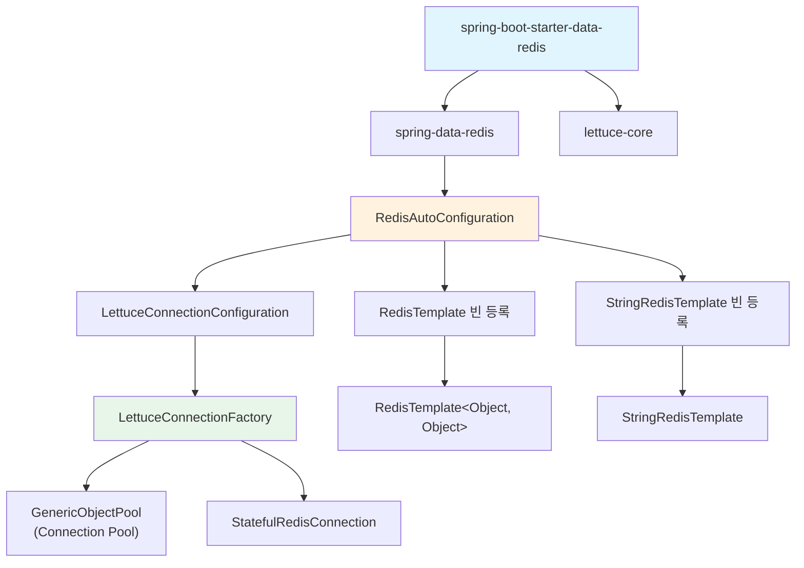
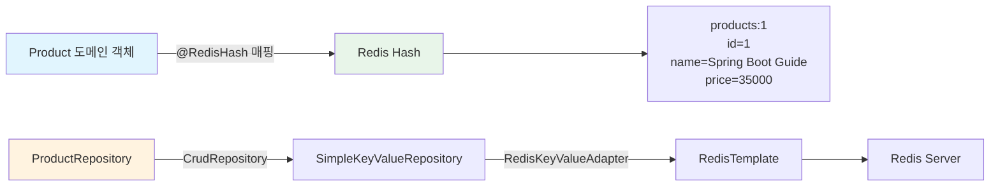

# Spring Data Redis 통합: RedisTemplate에서 Repository까지

Spring Boot에서 Redis를 사용하기 위한 `spring-boot-starter-data-redis` 의존성 구조, 자동 구성 원리, RedisTemplate 커스터마이징, 그리고 `@RedisHash` 기반 객체 매핑까지 전체 통합 과정을 분석한다.

## 목차

1. [핵심 개념 (What)](#1-핵심-개념-what)
2. [왜 알아야 하는가 (Why)](#2-왜-알아야-하는가-why)
3. [내부 구현 분석 (How)](#3-내부-구현-분석-how)
4. [실전 예제](#4-실전-예제)
5. [정리](#5-정리)

---

## 1. 핵심 개념 (What)

### Spring Data Redis란?

Spring Data Redis는 Redis에 대한 Spring 스타일의 추상화 계층이다. 저수준 Redis 클라이언트(Lettuce, Jedis)를 직접 다루지 않고, `RedisTemplate`과 `Repository` 패턴을 통해 일관된 방식으로 Redis를 사용할 수 있게 한다.

### 핵심 구성요소

| 구성요소 | 역할 |
|---------|------|
| `RedisConnectionFactory` | Redis 서버와의 물리적 연결을 관리하는 팩토리 |
| `LettuceConnectionFactory` | Lettuce 클라이언트 기반 기본 ConnectionFactory 구현체 |
| `RedisTemplate<K, V>` | Redis 명령을 실행하는 핵심 템플릿 클래스 |
| `StringRedisTemplate` | `RedisTemplate<String, String>` 특화 구현 |
| `RedisSerializer` | Java 객체와 Redis 바이트 배열 간 직렬화/역직렬화 전략 |
| `@RedisHash` | Redis Hash 구조에 도메인 객체를 매핑하는 어노테이션 |
| `RedisRepository` | `CrudRepository` 기반 Redis 데이터 접근 인터페이스 |

### RedisTemplate vs StringRedisTemplate

| 항목 | `RedisTemplate<K, V>` | `StringRedisTemplate` |
|------|----------------------|----------------------|
| 기본 Serializer | `JdkSerializationRedisSerializer` | `StringRedisSerializer` |
| 저장 형태 | 바이트 배열 (사람이 읽기 어려움) | 문자열 (redis-cli에서 확인 가능) |
| 사용 대상 | 복잡한 객체 저장 | 단순 문자열 키-값 저장 |
| 커스터마이징 | Serializer 변경 권장 | 그대로 사용 |

## 2. 왜 알아야 하는가 (Why)

### 실무에서 만나는 상황

1. **기본 Serializer의 함정**: `RedisTemplate`의 기본 `JdkSerializationRedisSerializer`는 클래스 정보를 포함한 바이너리 데이터를 저장하므로, redis-cli에서 값을 확인할 수 없고 다른 언어 클라이언트와 호환되지 않는다. JSON Serializer로 변경해야 하는 이유를 이해해야 한다.

2. **Connection Pool 튜닝**: 대규모 트래픽 환경에서 Redis 연결 고갈로 인한 타임아웃 문제가 발생할 수 있다. Lettuce의 connection pool 설정을 정확히 이해하고 조정해야 한다.

3. **Operations 인터페이스 선택**: `ValueOperations`, `HashOperations`, `ListOperations` 등 Redis 데이터 타입별 Operations 인터페이스를 적절히 선택해야 효율적인 데이터 모델링이 가능하다.

4. **RedisRepository vs RedisTemplate**: 단순 CRUD에는 `@RedisHash` + Repository 패턴이 편리하지만, 복잡한 쿼리나 트랜잭션이 필요하면 `RedisTemplate`을 직접 사용해야 한다. 각각의 적용 범위를 알아야 한다.

## 3. 내부 구현 분석 (How)

### 3.1 자동 구성 아키텍처



Spring Boot의 `RedisAutoConfiguration`은 classpath에 `spring-data-redis`와 `lettuce-core`가 존재하면 자동으로 다음 빈을 등록한다:

- `LettuceConnectionFactory`: Redis 연결 팩토리
- `RedisTemplate<Object, Object>`: 범용 템플릿 (`@ConditionalOnMissingBean`)
- `StringRedisTemplate`: 문자열 전용 템플릿 (`@ConditionalOnMissingBean`)

`@ConditionalOnMissingBean` 덕분에 개발자가 직접 `RedisTemplate` 빈을 정의하면 자동 구성이 대체된다.

### 3.2 LettuceConnectionFactory 설정

Lettuce는 Netty 기반 비동기 Redis 클라이언트로, 기본적으로 단일 커넥션을 공유한다. 높은 동시성이 필요할 경우 connection pool을 활성화해야 한다.

```yaml
# application.yml
spring:
  data:
    redis:
      host: localhost
      port: 6379
      password: my-secret
      timeout: 3000ms
      connect-timeout: 5000ms
      lettuce:
        pool:
          enabled: true
          max-active: 16      # 최대 활성 커넥션 수
          max-idle: 8          # 최대 유휴 커넥션 수
          min-idle: 2          # 최소 유휴 커넥션 수
          max-wait: 3000ms     # 커넥션 획득 대기 최대 시간
          time-between-eviction-runs: 60s  # 유휴 커넥션 정리 주기
```

### 3.3 RedisSerializer 전략 비교

| Serializer | 직렬화 결과 | 장점 | 단점 |
|-----------|-----------|------|------|
| `JdkSerializationRedisSerializer` | Java 바이너리 | 설정 불필요 (기본값) | 읽기 불가, 호환성 없음, 크기 큼 |
| `StringRedisSerializer` | UTF-8 문자열 | 가장 단순, redis-cli 호환 | 문자열만 처리 가능 |
| `Jackson2JsonRedisSerializer` | JSON 문자열 | 타입 지정으로 빠른 역직렬화 | 클래스별 Serializer 생성 필요 |
| `GenericJackson2JsonRedisSerializer` | JSON + `@class` | 범용 사용 가능 | `@class` 필드 추가로 크기 증가 |

`GenericJackson2JsonRedisSerializer`가 JSON에 `@class` 필드를 자동으로 포함하여 역직렬화 시 원래 타입을 복원한다:

```json
{
  "@class": "com.example.domain.Product",
  "id": 1,
  "name": "Spring Boot Guide",
  "price": 35000
}
```

### 3.4 Operations 인터페이스

`RedisTemplate`은 Redis 데이터 타입별로 전용 Operations 인터페이스를 제공한다:

| Operations | Redis 타입 | 주요 메서드 |
|-----------|-----------|-----------|
| `ValueOperations<K, V>` | String | `set()`, `get()`, `increment()` |
| `HashOperations<K, HK, HV>` | Hash | `put()`, `get()`, `entries()` |
| `ListOperations<K, V>` | List | `leftPush()`, `rightPop()`, `range()` |
| `SetOperations<K, V>` | Set | `add()`, `members()`, `intersect()` |
| `ZSetOperations<K, V>` | Sorted Set | `add()`, `rangeByScore()`, `rank()` |

```java
// Operations 획득 방법
ValueOperations<String, Object> valueOps = redisTemplate.opsForValue();
HashOperations<String, String, Object> hashOps = redisTemplate.opsForHash();
ListOperations<String, Object> listOps = redisTemplate.opsForList();
SetOperations<String, Object> setOps = redisTemplate.opsForSet();
ZSetOperations<String, Object> zSetOps = redisTemplate.opsForZSet();
```

### 3.5 @RedisHash 기반 객체 매핑

`@RedisHash`를 사용하면 JPA의 `@Entity`처럼 도메인 객체를 Redis Hash 구조에 매핑할 수 있다.



```java
@RedisHash(value = "products", timeToLive = 3600)
public class Product {

    @Id
    private String id;

    @Indexed  // Secondary Index 생성 -> findByCategory 가능
    private String category;

    private String name;
    private int price;

    @TimeToLive  // 개별 인스턴스 TTL (timeToLive보다 우선)
    private Long expiration;
}
```

`@Indexed`를 붙이면 보조 인덱스가 생성되어 해당 필드로 검색이 가능해진다. 내부적으로 Redis Set을 사용하여 인덱스를 관리한다.

## 4. 실전 예제

### 4.1 RedisTemplate 빈 커스터마이징

```java
@Configuration
public class RedisConfig {

    @Bean
    public RedisConnectionFactory redisConnectionFactory() {
        RedisStandaloneConfiguration serverConfig = new RedisStandaloneConfiguration();
        serverConfig.setHostName("localhost");
        serverConfig.setPort(6379);
        serverConfig.setPassword(RedisPassword.of("my-secret"));
        serverConfig.setDatabase(0);

        // Lettuce 클라이언트 설정
        LettucePoolingClientConfiguration clientConfig =
            LettucePoolingClientConfiguration.builder()
                .commandTimeout(Duration.ofSeconds(3))
                .poolConfig(buildPoolConfig())
                .build();

        return new LettuceConnectionFactory(serverConfig, clientConfig);
    }

    private GenericObjectPoolConfig<?> buildPoolConfig() {
        GenericObjectPoolConfig<?> poolConfig = new GenericObjectPoolConfig<>();
        poolConfig.setMaxTotal(16);
        poolConfig.setMaxIdle(8);
        poolConfig.setMinIdle(2);
        poolConfig.setMaxWait(Duration.ofSeconds(3));
        poolConfig.setTestOnBorrow(true);     // 커넥션 유효성 검사
        poolConfig.setTestWhileIdle(true);    // 유휴 커넥션 유효성 검사
        return poolConfig;
    }

    @Bean
    public RedisTemplate<String, Object> redisTemplate(
            RedisConnectionFactory connectionFactory) {
        RedisTemplate<String, Object> template = new RedisTemplate<>();
        template.setConnectionFactory(connectionFactory);

        // Key Serializer: 문자열
        template.setKeySerializer(new StringRedisSerializer());
        template.setHashKeySerializer(new StringRedisSerializer());

        // Value Serializer: JSON
        ObjectMapper objectMapper = new ObjectMapper();
        objectMapper.registerModule(new JavaTimeModule());
        objectMapper.activateDefaultTyping(
            objectMapper.getPolymorphicTypeValidator(),
            ObjectMapper.DefaultTyping.NON_FINAL,
            JsonTypeInfo.As.PROPERTY
        );

        GenericJackson2JsonRedisSerializer jsonSerializer =
            new GenericJackson2JsonRedisSerializer(objectMapper);

        template.setValueSerializer(jsonSerializer);
        template.setHashValueSerializer(jsonSerializer);

        template.afterPropertiesSet();
        return template;
    }
}
```

### 4.2 RedisRepository 기반 CRUD

```java
// 도메인 객체
@RedisHash(value = "sessions", timeToLive = 1800)
@Getter
@AllArgsConstructor
@NoArgsConstructor
public class UserSession {

    @Id
    private String sessionId;

    @Indexed
    private Long userId;

    private String username;
    private String ipAddress;
    private LocalDateTime lastAccessTime;

    @TimeToLive
    private Long ttl;

    public void refresh() {
        this.lastAccessTime = LocalDateTime.now();
        this.ttl = 1800L;  // 30분 연장
    }
}

// Repository 인터페이스
public interface UserSessionRepository extends CrudRepository<UserSession, String> {
    List<UserSession> findByUserId(Long userId);  // @Indexed 필드만 검색 가능
}

// 서비스 계층
@Service
@RequiredArgsConstructor
public class SessionService {

    private final UserSessionRepository sessionRepository;

    public UserSession createSession(Long userId, String username, String ip) {
        UserSession session = new UserSession(
            UUID.randomUUID().toString(),
            userId,
            username,
            ip,
            LocalDateTime.now(),
            1800L
        );
        return sessionRepository.save(session);
    }

    public Optional<UserSession> getSession(String sessionId) {
        return sessionRepository.findById(sessionId);
    }

    public void refreshSession(String sessionId) {
        sessionRepository.findById(sessionId).ifPresent(session -> {
            session.refresh();
            sessionRepository.save(session);
        });
    }

    public List<UserSession> getUserSessions(Long userId) {
        return sessionRepository.findByUserId(userId);
    }

    public void terminateSession(String sessionId) {
        sessionRepository.deleteById(sessionId);
    }
}
```

### 4.3 RedisTemplate을 활용한 랭킹 시스템

```java
@Service
@RequiredArgsConstructor
public class RankingService {

    private final RedisTemplate<String, Object> redisTemplate;
    private static final String RANKING_KEY = "game:ranking";

    public void addScore(String playerId, double score) {
        redisTemplate.opsForZSet().incrementScore(RANKING_KEY, playerId, score);
    }

    public Long getRank(String playerId) {
        // 0-based, 내림차순 (1위 = 0)
        Long rank = redisTemplate.opsForZSet().reverseRank(RANKING_KEY, playerId);
        return rank != null ? rank + 1 : null;
    }

    public List<RankEntry> getTopN(int n) {
        Set<ZSetOperations.TypedTuple<Object>> tuples =
            redisTemplate.opsForZSet().reverseRangeWithScores(RANKING_KEY, 0, n - 1);

        if (tuples == null) return List.of();

        AtomicInteger rank = new AtomicInteger(1);
        return tuples.stream()
            .map(tuple -> new RankEntry(
                rank.getAndIncrement(),
                (String) tuple.getValue(),
                tuple.getScore()
            ))
            .toList();
    }

    public record RankEntry(int rank, String playerId, double score) {}
}
```

## 5. 정리

| 항목 | 설명 |
|-----|------|
| 자동 구성 | `spring-boot-starter-data-redis`가 `LettuceConnectionFactory`, `RedisTemplate`, `StringRedisTemplate`을 자동 등록 |
| 기본 클라이언트 | Lettuce (Netty 기반, 비동기/논블로킹, 단일 커넥션 공유) |
| Connection Pool | `spring.data.redis.lettuce.pool.enabled=true`로 활성화, `max-active`, `max-idle` 등 설정 |
| Serializer 권장 | Key는 `StringRedisSerializer`, Value는 `GenericJackson2JsonRedisSerializer` 또는 `Jackson2JsonRedisSerializer` |
| Operations | `opsForValue()`, `opsForHash()`, `opsForList()`, `opsForSet()`, `opsForZSet()` |
| @RedisHash | 도메인 객체를 Redis Hash에 매핑, `@Id`, `@Indexed`, `@TimeToLive` 지원 |
| RedisRepository | `CrudRepository` 상속으로 기본 CRUD 제공, `@Indexed` 필드만 쿼리 메서드 지원 |

---
*참고: Spring Boot 3.x / Spring Data Redis 3.x 기준*
