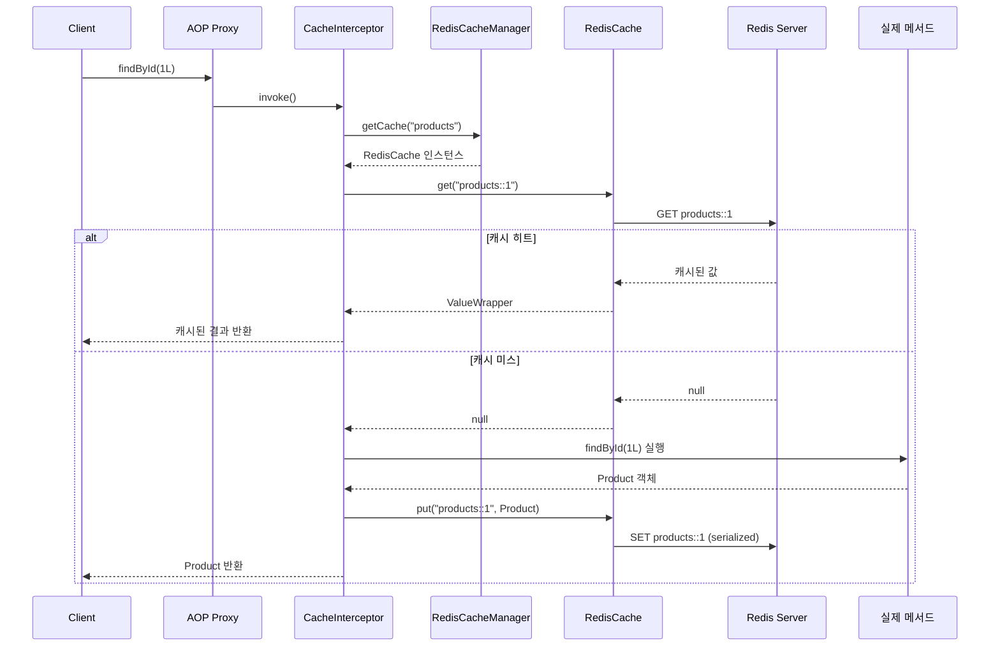
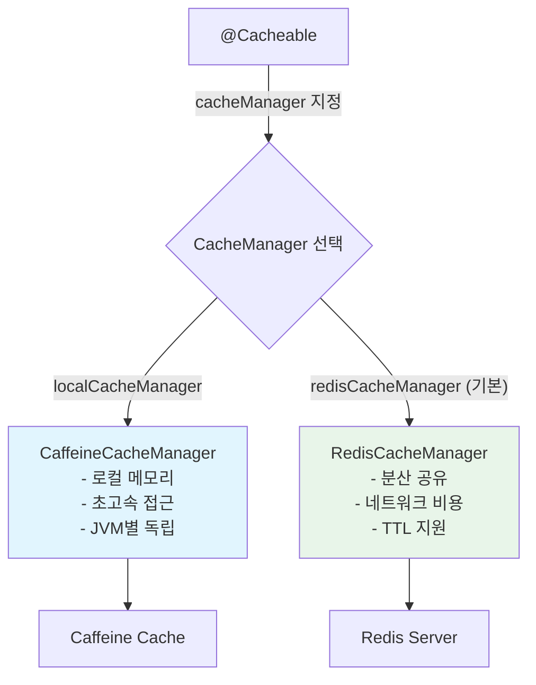

# Spring Cache 추상화와 Redis: 선언적 캐싱의 모든 것

Spring Cache Abstraction은 `@Cacheable`, `@CacheEvict` 등의 어노테이션을 통해 캐싱 로직을 비즈니스 코드에서 분리한다. 이 문서에서는 Redis를 캐시 저장소로 사용할 때의 `RedisCacheManager` 설정, 키 생성 전략, 멀티 캐시 매니저 구성까지 실무에 필요한 전체 내용을 다룬다.

## 목차

1. [핵심 개념 (What)](#1-핵심-개념-what)
2. [왜 알아야 하는가 (Why)](#2-왜-알아야-하는가-why)
3. [내부 구현 분석 (How)](#3-내부-구현-분석-how)
4. [실전 예제](#4-실전-예제)
5. [정리](#5-정리)

---

## 1. 핵심 개념 (What)

### Spring Cache Abstraction이란?

Spring Cache Abstraction은 메서드 수준의 캐싱을 선언적으로 적용하는 프레임워크다. AOP 기반으로 동작하며, 캐시 저장소(Redis, Caffeine, EhCache 등)에 독립적인 일관된 API를 제공한다.

### 핵심 어노테이션

| 어노테이션 | 역할 |
|-----------|------|
| `@EnableCaching` | Spring Cache 기능 활성화 (Configuration 클래스에 선언) |
| `@Cacheable` | 메서드 결과를 캐시에 저장, 캐시 히트 시 메서드 실행 생략 |
| `@CachePut` | 메서드를 항상 실행하고 결과를 캐시에 저장 (갱신용) |
| `@CacheEvict` | 캐시에서 항목 제거 |
| `@Caching` | 여러 캐시 어노테이션을 조합 |
| `@CacheConfig` | 클래스 레벨 공통 캐시 설정 |

### 핵심 인터페이스

| 인터페이스 | 역할 |
|-----------|------|
| `CacheManager` | `Cache` 인스턴스를 관리하는 최상위 인터페이스 |
| `Cache` | 개별 캐시 영역을 나타내는 인터페이스 |
| `KeyGenerator` | 캐시 키 생성 전략을 정의하는 인터페이스 |
| `CacheResolver` | 런타임에 사용할 캐시를 결정하는 인터페이스 |

## 2. 왜 알아야 하는가 (Why)

### 실무에서 만나는 상황

1. **TTL 전략 미설정**: 기본 `RedisCacheManager`에는 TTL이 없다. 캐시가 영구 저장되어 Redis 메모리가 계속 증가하는 문제를 겪게 된다. 캐시별로 적절한 TTL을 설정해야 한다.

2. **Serializer 불일치**: `RedisTemplate`에는 JSON Serializer를 설정했지만, `RedisCacheManager`에는 별도로 설정하지 않으면 기본 JDK Serializer가 적용된다. 두 경로의 Serializer를 일관되게 관리해야 한다.

3. **캐시 키 충돌**: 메서드 파라미터가 동일한 서로 다른 메서드에서 같은 캐시 이름을 사용하면 키 충돌이 발생한다. `KeyGenerator`와 prefix 설정으로 충돌을 방지해야 한다.

4. **로컬 + Redis 멀티 캐시**: 빈번하게 조회되는 데이터는 Caffeine 로컬 캐시로, 분산 환경에서 공유해야 하는 데이터는 Redis 캐시로 사용하는 멀티 캐시 구성이 필요하다.

## 3. 내부 구현 분석 (How)

### 3.1 캐시 처리 흐름



### 3.2 RedisCacheConfiguration 상세 설정

`RedisCacheConfiguration`은 개별 캐시 영역의 동작을 정의한다:

```java
RedisCacheConfiguration config = RedisCacheConfiguration.defaultCacheConfig()
    // TTL 설정
    .entryTtl(Duration.ofMinutes(30))

    // 키 prefix 설정 (기본: 캐시이름::)
    .prefixCacheNameWith("myapp:")

    // null 값 캐싱 허용 (기본: true)
    .disableCachingNullValues()

    // Key Serializer
    .serializeKeysWith(
        RedisSerializationContext.SerializationPair
            .fromSerializer(new StringRedisSerializer()))

    // Value Serializer
    .serializeValuesWith(
        RedisSerializationContext.SerializationPair
            .fromSerializer(new GenericJackson2JsonRedisSerializer()));
```

**null 값 캐싱이 중요한 이유**: DB에 존재하지 않는 ID로 반복 조회하면 매번 DB를 조회하게 된다(Cache Penetration). null 값을 캐싱하면 이 문제를 완화할 수 있다. 단, TTL을 짧게 설정해야 실제 데이터가 생성되었을 때 반영된다.

### 3.3 캐시 키 생성 전략

#### 기본 KeyGenerator (SimpleKeyGenerator)

Spring은 기본적으로 `SimpleKeyGenerator`를 사용한다:

| 파라미터 상황 | 생성되는 키 |
|-------------|-----------|
| 파라미터 없음 | `SimpleKey.EMPTY` |
| 파라미터 1개 | 해당 파라미터 값 |
| 파라미터 2개 이상 | `SimpleKey(params...)` |

#### SpEL 기반 키 설정

```java
// 단일 파라미터
@Cacheable(value = "products", key = "#id")
public Product findById(Long id) { ... }

// 객체 필드
@Cacheable(value = "products", key = "#request.category + ':' + #request.page")
public List<Product> search(SearchRequest request) { ... }

// 메서드 이름 포함
@Cacheable(value = "products", key = "#root.methodName + ':' + #id")
public Product findById(Long id) { ... }

// 조건부 캐싱
@Cacheable(value = "products", key = "#id",
    condition = "#id > 0",           // true일 때만 캐시 조회/저장
    unless = "#result == null")       // true일 때 결과를 캐시에 저장하지 않음
public Product findById(Long id) { ... }
```

**`condition` vs `unless` 차이점:**
- `condition`: 캐시 조회와 저장 모두를 제어 (false이면 캐시를 아예 사용하지 않음)
- `unless`: 저장만 제어 (true이면 캐시에 저장하지 않지만 조회는 수행)

#### 커스텀 KeyGenerator

```java
@Component
public class CustomKeyGenerator implements KeyGenerator {

    @Override
    public Object generate(Object target, Method method, Object... params) {
        return target.getClass().getSimpleName()
            + ":" + method.getName()
            + ":" + StringUtils.arrayToDelimitedString(params, "_");
    }
}

// 사용
@Cacheable(value = "products", keyGenerator = "customKeyGenerator")
public Product findById(Long id) { ... }
```

### 3.4 @CacheEvict와 @CachePut 동작

```java
// 데이터 갱신 후 캐시 갱신 (메서드 항상 실행)
@CachePut(value = "products", key = "#product.id")
public Product update(Product product) {
    return productRepository.save(product);
}

// 단일 항목 삭제
@CacheEvict(value = "products", key = "#id")
public void delete(Long id) {
    productRepository.deleteById(id);
}

// 전체 캐시 삭제
@CacheEvict(value = "products", allEntries = true)
public void clearProductCache() { }

// 메서드 실행 전에 캐시 삭제 (기본: 실행 후 삭제)
@CacheEvict(value = "products", key = "#id", beforeInvocation = true)
public void delete(Long id) {
    productRepository.deleteById(id);
}

// 여러 캐시 어노테이션 조합
@Caching(
    evict = {
        @CacheEvict(value = "products", key = "#product.id"),
        @CacheEvict(value = "productList", allEntries = true)
    },
    put = {
        @CachePut(value = "products", key = "#product.id")
    }
)
public Product update(Product product) {
    return productRepository.save(product);
}
```

### 3.5 멀티 캐시 매니저 구성



## 4. 실전 예제

### 4.1 캐시별 TTL이 다른 RedisCacheManager 구성

```java
@Configuration
@EnableCaching
public class CacheConfig {

    @Bean
    @Primary
    public RedisCacheManager redisCacheManager(RedisConnectionFactory connectionFactory) {
        // 기본 캐시 설정
        RedisCacheConfiguration defaultConfig = RedisCacheConfiguration.defaultCacheConfig()
            .entryTtl(Duration.ofMinutes(30))
            .disableCachingNullValues()
            .serializeKeysWith(
                SerializationPair.fromSerializer(new StringRedisSerializer()))
            .serializeValuesWith(
                SerializationPair.fromSerializer(new GenericJackson2JsonRedisSerializer()));

        // 캐시별 개별 TTL 설정
        Map<String, RedisCacheConfiguration> cacheConfigurations = Map.of(
            "products", defaultConfig.entryTtl(Duration.ofHours(1)),
            "userProfiles", defaultConfig.entryTtl(Duration.ofMinutes(10)),
            "categories", defaultConfig.entryTtl(Duration.ofHours(24)),
            "searchResults", defaultConfig.entryTtl(Duration.ofMinutes(5))
        );

        return RedisCacheManager.builder(connectionFactory)
            .cacheDefaults(defaultConfig)
            .withInitialCacheConfigurations(cacheConfigurations)
            .transactionAware()  // Spring 트랜잭션과 연동
            .build();
    }

    @Bean
    public CacheManager localCacheManager() {
        CaffeineCacheManager cacheManager = new CaffeineCacheManager();
        cacheManager.setCaffeine(Caffeine.newBuilder()
            .maximumSize(10_000)
            .expireAfterWrite(Duration.ofMinutes(5)));
        return cacheManager;
    }
}
```

### 4.2 서비스 레이어 캐싱 전략 구현

```java
@Service
@RequiredArgsConstructor
@CacheConfig(cacheNames = "products")  // 클래스 레벨 기본 캐시 이름
public class ProductService {

    private final ProductRepository productRepository;

    // 단건 조회: Redis 캐시
    @Cacheable(key = "#id", unless = "#result == null")
    public ProductDto findById(Long id) {
        Product product = productRepository.findById(id)
            .orElseThrow(() -> new NotFoundException("Product not found: " + id));
        return ProductDto.from(product);
    }

    // 카테고리별 조회: 짧은 TTL 캐시
    @Cacheable(cacheNames = "searchResults",
               key = "'category:' + #category + ':page:' + #pageable.pageNumber")
    public Page<ProductDto> findByCategory(String category, Pageable pageable) {
        return productRepository.findByCategory(category, pageable)
            .map(ProductDto::from);
    }

    // 수정: 캐시 갱신 + 목록 캐시 무효화
    @Caching(
        put = @CachePut(key = "#command.id()"),
        evict = @CacheEvict(cacheNames = "searchResults", allEntries = true)
    )
    public ProductDto update(UpdateProductCommand command) {
        Product product = productRepository.findById(command.id())
            .orElseThrow(() -> new NotFoundException("Product not found"));
        product.update(command.name(), command.price());
        return ProductDto.from(productRepository.save(product));
    }

    // 삭제: 캐시 무효화
    @Caching(evict = {
        @CacheEvict(key = "#id"),
        @CacheEvict(cacheNames = "searchResults", allEntries = true)
    })
    public void delete(Long id) {
        productRepository.deleteById(id);
    }

    // 인기 상품: 로컬 캐시 (빈번한 접근, 짧은 TTL)
    @Cacheable(cacheNames = "popularProducts",
               cacheManager = "localCacheManager",
               key = "'top:' + #limit")
    public List<ProductDto> getPopularProducts(int limit) {
        return productRepository.findTopByOrderByViewCountDesc(limit)
            .stream()
            .map(ProductDto::from)
            .toList();
    }
}
```

### 4.3 AOP 기반 캐시 로깅

```java
@Aspect
@Component
@Slf4j
public class CacheLoggingAspect {

    @Around("@annotation(cacheable)")
    public Object logCacheable(ProceedingJoinPoint joinPoint,
                                Cacheable cacheable) throws Throwable {
        String cacheName = String.join(",", cacheable.value());
        String methodName = joinPoint.getSignature().toShortString();
        long startTime = System.currentTimeMillis();

        Object result = joinPoint.proceed();

        long elapsed = System.currentTimeMillis() - startTime;

        // 캐시 히트 시 메서드가 실행되지 않으므로 elapsed가 매우 짧음
        if (elapsed < 5) {
            log.debug("[Cache HIT] {} cache={} ({}ms)", methodName, cacheName, elapsed);
        } else {
            log.debug("[Cache MISS] {} cache={} ({}ms)", methodName, cacheName, elapsed);
        }

        return result;
    }
}
```

## 5. 정리

| 항목 | 설명 |
|-----|------|
| @Cacheable | 캐시 조회 후 미스 시 메서드 실행, 결과를 캐시에 저장 |
| @CachePut | 메서드를 항상 실행하고 결과를 캐시에 저장 (갱신용) |
| @CacheEvict | 캐시 항목 삭제, `allEntries=true`로 전체 삭제 가능 |
| RedisCacheManager | `RedisCacheConfiguration`으로 TTL, prefix, serializer 설정 |
| Key 전략 | SpEL(`#id`, `#root.methodName`) 또는 커스텀 `KeyGenerator` |
| condition vs unless | `condition`은 캐시 사용 여부, `unless`는 저장 여부만 제어 |
| Null 캐싱 | Cache Penetration 방지를 위해 null 캐싱 활용, 짧은 TTL 설정 |
| 멀티 캐시 | `@Primary` + `cacheManager` 속성으로 로컬/Redis 캐시 병용 |

---
*참고: Spring Boot 3.x 기준*
