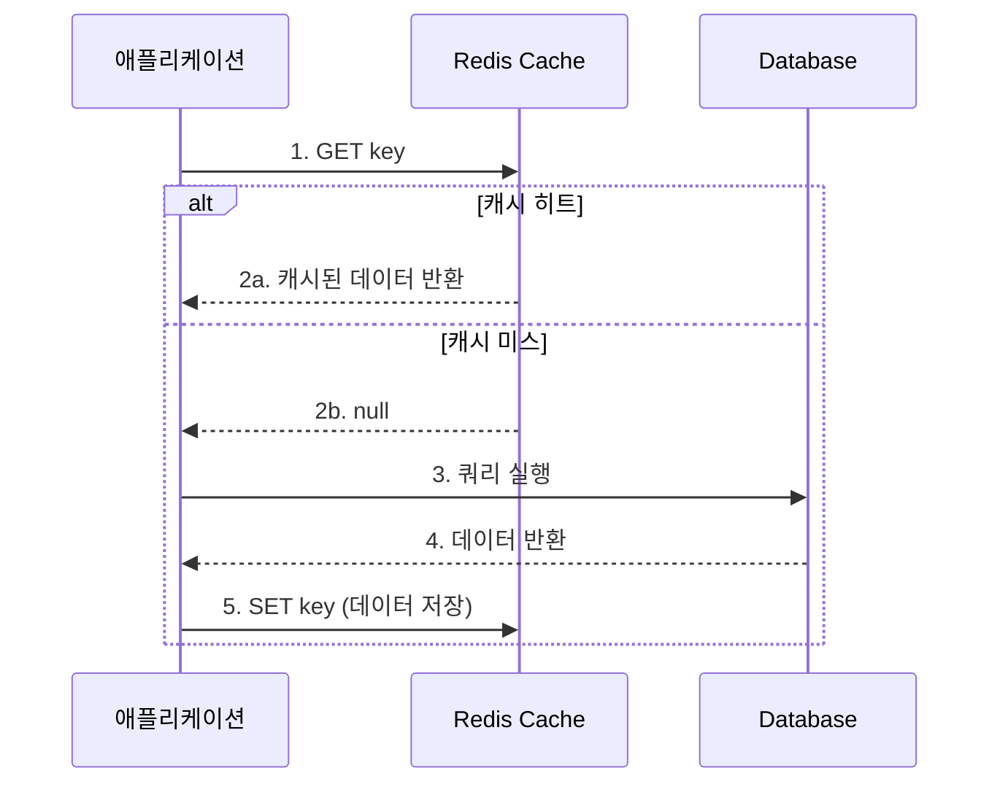
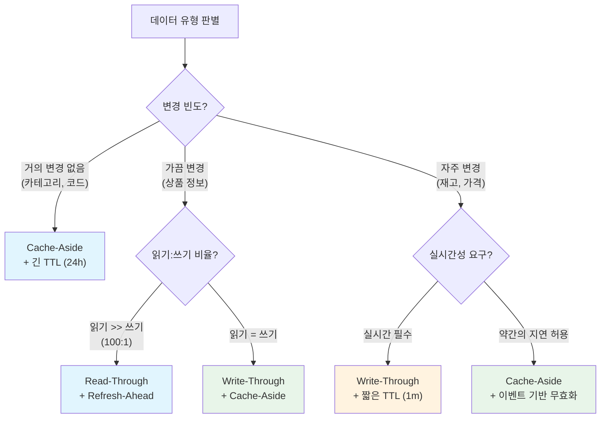

# 캐싱 패턴과 전략: 올바른 패턴 선택을 위한 가이드

캐싱은 단순히 데이터를 메모리에 올리는 것이 아니라, 데이터의 특성과 비즈니스 요구사항에 맞는 패턴을 선택하는 아키텍처 결정이다. 이 문서에서는 5가지 주요 캐싱 패턴의 동작 원리, 장단점, TTL 설계 전략, 그리고 캐시 워밍 기법을 분석한다.

## 목차

1. [핵심 개념 (What)](#1-핵심-개념-what)
2. [왜 알아야 하는가 (Why)](#2-왜-알아야-하는가-why)
3. [내부 구현 분석 (How)](#3-내부-구현-분석-how)
4. [실전 예제](#4-실전-예제)
5. [정리](#5-정리)

---

## 1. 핵심 개념 (What)

### 캐싱 패턴이란?

캐싱 패턴은 애플리케이션과 캐시, 데이터 소스(DB) 간의 데이터 흐름을 정의하는 설계 전략이다. 읽기와 쓰기 각각에 대해 캐시를 어떻게 활용할지 결정한다.

### 5가지 주요 패턴 개요

| 패턴 | 읽기/쓰기 | 캐시 관리 주체 | 핵심 특징 |
|------|----------|-------------|----------|
| Cache-Aside | 읽기 | 애플리케이션 | 가장 범용적, 느린 초기 로딩 |
| Read-Through | 읽기 | 캐시 라이브러리 | 캐시가 DB 조회를 대행 |
| Write-Through | 쓰기 | 캐시 라이브러리 | 캐시와 DB에 동시 기록 |
| Write-Behind | 쓰기 | 캐시 라이브러리 | 캐시에만 기록, DB는 비동기 |
| Refresh-Ahead | 읽기 | 백그라운드 | 만료 전 사전 갱신 |

## 2. 왜 알아야 하는가 (Why)

### 실무에서 만나는 상황

1. **잘못된 패턴 선택으로 인한 데이터 불일치**: 쓰기가 빈번한 데이터에 Cache-Aside만 사용하면 캐시와 DB 간 데이터 불일치가 자주 발생한다. 데이터 특성에 맞는 쓰기 패턴을 선택해야 한다.

2. **Cold Start 문제**: 서버 재시작 후 캐시가 비어있어 모든 요청이 DB로 직접 가는 상황이 발생한다. 캐시 워밍 전략이 없으면 서비스 초기에 심각한 성능 저하를 겪게 된다.

3. **TTL 설계 실패**: 너무 긴 TTL은 오래된 데이터를 보여주고, 너무 짧은 TTL은 캐시 효율을 떨어뜨린다. 데이터의 변경 빈도와 허용 가능한 지연 시간을 기반으로 TTL을 설계해야 한다.

4. **캐시 효율 최적화**: 캐시 히트율이 낮은데 원인을 찾지 못하는 경우, 패턴 자체를 재검토해야 한다. Refresh-Ahead 패턴으로 히트율을 높이거나 Write-Through로 읽기 시점의 캐시 미스를 줄일 수 있다.

## 3. 내부 구현 분석 (How)

### 3.1 Cache-Aside (Lazy Loading) 패턴

가장 일반적인 캐싱 패턴. 애플리케이션이 캐시를 직접 관리한다.



```java
@Service
@RequiredArgsConstructor
public class ProductCacheAsideService {

    private final RedisTemplate<String, Object> redisTemplate;
    private final ProductRepository productRepository;

    public Product findById(Long id) {
        String key = "product:" + id;

        // 1. 캐시 조회
        Product cached = (Product) redisTemplate.opsForValue().get(key);
        if (cached != null) {
            return cached;  // 캐시 히트
        }

        // 2. DB 조회 (캐시 미스)
        Product product = productRepository.findById(id)
            .orElseThrow(() -> new NotFoundException("Product not found"));

        // 3. 캐시에 저장
        redisTemplate.opsForValue().set(key, product, Duration.ofMinutes(30));
        return product;
    }

    public void update(Product product) {
        productRepository.save(product);
        redisTemplate.delete("product:" + product.getId());  // 캐시 무효화
    }
}
```

**장점**: 구현이 간단하고 범용적이며, 필요한 데이터만 캐싱하여 메모리를 효율적으로 사용한다.
**단점**: 초기 요청 시 캐시 미스로 지연이 발생하고, 캐시 무효화 시점과 DB 업데이트 사이에 불일치가 발생할 수 있다.

### 3.2 Read-Through 패턴

캐시 라이브러리가 캐시 미스 시 자동으로 DB를 조회하여 캐시에 로드한다. Spring의 `@Cacheable`이 Read-Through 패턴에 해당한다.

```java
@Cacheable(value = "products", key = "#id")
public Product findById(Long id) {
    // 캐시 미스 시에만 실행됨
    return productRepository.findById(id)
        .orElseThrow(() -> new NotFoundException("Product not found"));
}
```

Cache-Aside와의 차이: 애플리케이션 코드에 캐시 로직이 노출되지 않는다.

### 3.3 Write-Through 패턴

데이터를 캐시에 먼저 쓰고, 캐시가 동기적으로 DB에도 기록한다.

```java
@Service
@RequiredArgsConstructor
public class ProductWriteThroughService {

    private final RedisTemplate<String, Object> redisTemplate;
    private final ProductRepository productRepository;

    @Transactional
    public Product save(Product product) {
        Product saved = productRepository.save(product);
        String key = "product:" + saved.getId();
        redisTemplate.opsForValue().set(key, saved, Duration.ofHours(1));
        return saved;
    }
}
```

**장점**: 캐시와 DB의 일관성이 보장되고, 읽기 시 항상 캐시 히트가 가능하다.
**단점**: 쓰기 지연이 증가하고 (DB + 캐시 두 번 쓰기), 읽히지 않을 데이터도 캐시에 저장될 수 있다.

### 3.4 Write-Behind (Write-Back) 패턴

데이터를 캐시에만 즉시 기록하고, DB에는 비동기적으로 일괄 기록한다.

```java
@Service
@RequiredArgsConstructor
public class ProductWriteBehindService {

    private final RedisTemplate<String, Object> redisTemplate;
    private final StringRedisTemplate stringRedisTemplate;

    public Product save(Product product) {
        String key = "product:" + product.getId();
        redisTemplate.opsForValue().set(key, product, Duration.ofHours(1));
        // 변경된 키를 큐에 추가 (비동기 DB 기록 대상)
        stringRedisTemplate.opsForList().rightPush(
            "dirty:products", String.valueOf(product.getId()));
        return product;
    }

    @Scheduled(fixedDelay = 5000)
    public void flushToDatabase() {
        String id;
        while ((id = stringRedisTemplate.opsForList().leftPop("dirty:products")) != null) {
            Product product = (Product) redisTemplate.opsForValue().get("product:" + id);
            if (product != null) {
                productRepository.save(product);
            }
        }
    }
}
```

**장점**: 쓰기 성능이 매우 빠르고(캐시에만 기록), DB 부하를 분산할 수 있다.
**단점**: 캐시 장애 시 아직 DB에 기록되지 않은 데이터가 유실될 수 있으며, 구현 복잡도가 높다.

### 3.5 Refresh-Ahead 패턴

데이터가 만료되기 전에 백그라운드에서 사전 갱신하여 캐시 미스를 방지한다.

```java
@Service
@RequiredArgsConstructor
public class ProductRefreshAheadService {

    private final RedisTemplate<String, Object> redisTemplate;
    private final ProductRepository productRepository;
    private final ExecutorService executor = Executors.newFixedThreadPool(4);

    private static final long TTL_SECONDS = 3600;
    private static final double REFRESH_THRESHOLD = 0.2;  // TTL의 20% 남았을 때 갱신

    public Product findById(Long id) {
        String key = "product:" + id;
        Product cached = (Product) redisTemplate.opsForValue().get(key);

        if (cached != null) {
            Long remainTtl = redisTemplate.getExpire(key, TimeUnit.SECONDS);
            if (remainTtl != null && remainTtl < TTL_SECONDS * REFRESH_THRESHOLD) {
                executor.submit(() -> refreshCache(key, id));  // 비동기 갱신
            }
            return cached;
        }
        return loadAndCache(key, id);  // 캐시 미스: 동기 로드
    }

    private void refreshCache(String key, Long id) {
        Product product = productRepository.findById(id).orElse(null);
        if (product != null) {
            redisTemplate.opsForValue().set(key, product, Duration.ofSeconds(TTL_SECONDS));
        }
    }

    private Product loadAndCache(String key, Long id) {
        Product product = productRepository.findById(id)
            .orElseThrow(() -> new NotFoundException("Product not found"));
        redisTemplate.opsForValue().set(key, product, Duration.ofSeconds(TTL_SECONDS));
        return product;
    }
}
```

### 3.6 패턴 비교표

| 패턴 | 읽기 성능 | 쓰기 성능 | 데이터 일관성 | 구현 복잡도 | 메모리 효율 |
|------|----------|----------|-------------|-----------|-----------|
| Cache-Aside | 초기 미스 후 빠름 | 보통 | 보통 | 낮음 | 높음 (필요한 데이터만) |
| Read-Through | 초기 미스 후 빠름 | 보통 | 보통 | 낮음 | 높음 |
| Write-Through | 항상 빠름 | 느림 (2중 쓰기) | 높음 | 보통 | 낮음 (모든 쓰기 데이터) |
| Write-Behind | 항상 빠름 | 매우 빠름 | 낮음 (비동기) | 높음 | 낮음 |
| Refresh-Ahead | 항상 빠름 | 보통 | 보통 | 높음 | 보통 |

### 3.7 TTL 설계 전략

#### 고정 TTL vs 적응형 TTL

```java
// 적응형 TTL: 접근 빈도에 따라 TTL 조정
public Product findByIdWithAdaptiveTtl(Long id) {
    String key = "product:" + id;
    String hitCountKey = "hitcount:" + id;

    Product cached = (Product) redisTemplate.opsForValue().get(key);
    if (cached != null) {
        redisTemplate.opsForValue().increment(hitCountKey);
        return cached;
    }

    Product product = productRepository.findById(id)
        .orElseThrow(() -> new NotFoundException("Not found"));

    Long hitCount = (Long) redisTemplate.opsForValue().get(hitCountKey);
    Duration ttl = calculateTtl(hitCount != null ? hitCount : 0);
    redisTemplate.opsForValue().set(key, product, ttl);
    return product;
}

private Duration calculateTtl(long hitCount) {
    if (hitCount > 1000) return Duration.ofHours(24);   // 인기 데이터
    if (hitCount > 100)  return Duration.ofHours(4);    // 보통
    return Duration.ofMinutes(30);                       // 비인기
}
```

### 3.8 캐시 워밍(Cache Warming) 전략

```java
@Component
@RequiredArgsConstructor
@Slf4j
public class CacheWarmer implements ApplicationRunner {

    private final ProductRepository productRepository;
    private final RedisTemplate<String, Object> redisTemplate;

    @Override
    public void run(ApplicationArguments args) {
        log.info("캐시 워밍 시작...");
        List<Product> popularProducts = productRepository
            .findTop100ByOrderByViewCountDesc();

        popularProducts.forEach(product -> {
            String key = "product:" + product.getId();
            redisTemplate.opsForValue().set(key, product, Duration.ofHours(1));
        });
        log.info("캐시 워밍 완료: 상품 {}건", popularProducts.size());
    }
}
```

### 3.9 캐시 직렬화와 버전 호환

배포 시 엔티티의 필드를 추가하거나 삭제하면, Redis에 저장된 기존 캐시 데이터가 역직렬화에 실패하여 장애가 발생할 수 있다. 특히 무중단 배포(Rolling Update) 환경에서 구버전과 신버전 서버가 동시에 캐시를 읽고 쓰는 상황이 가장 위험하다.

**주요 장애 시나리오**:

| 시나리오 | 원인 | 증상 |
|---------|------|------|
| Jackson 역직렬화 실패 | 새 필드 추가 후 엄격 모드에서 `UnrecognizedPropertyException` 발생 | 캐시 히트인데 500 에러 |
| `@class` 타입 문제 | `GenericJackson2JsonRedisSerializer` 사용 시 패키지 리네이밍하면 역직렬화 불가 | 클래스 로딩 실패 |
| `serialVersionUID` 불일치 | Java Serialization 사용 시 필드 변경으로 UID가 바뀌면 `InvalidClassException` | 전체 캐시 무효화 필요 |

**해결 전략 1: Jackson Lenient 설정**

```java
@Configuration
public class RedisCacheConfig {

    @Bean
    public RedisTemplate<String, Object> redisTemplate(RedisConnectionFactory factory) {
        RedisTemplate<String, Object> template = new RedisTemplate<>();
        template.setConnectionFactory(factory);

        ObjectMapper mapper = new ObjectMapper();
        // 알 수 없는 필드 무시 (신규 필드가 추가되어도 구버전에서 에러 없이 역직렬화)
        mapper.configure(DeserializationFeature.FAIL_ON_UNKNOWN_PROPERTIES, false);
        mapper.registerModule(new JavaTimeModule());

        GenericJackson2JsonRedisSerializer serializer =
            new GenericJackson2JsonRedisSerializer(mapper);

        template.setValueSerializer(serializer);
        template.setHashValueSerializer(serializer);
        template.setKeySerializer(new StringRedisSerializer());
        return template;
    }
}
```

DTO 레벨에서도 방어:

```java
@JsonIgnoreProperties(ignoreUnknown = true)
public record ProductCacheDto(
    Long id,
    String name,
    BigDecimal price
    // 새 필드가 추가되어도 구버전 캐시 데이터 역직렬화 성공
) {}
```

**해결 전략 2: 캐시 키 버전 프리픽스**

스키마가 크게 변경(필드 타입 변경, 필드 제거 등)되는 경우, 캐시 키에 버전을 포함하여 구버전 캐시와 자연스럽게 분리한다.

```java
@Component
public class VersionedCacheKeyGenerator implements KeyGenerator {

    // 스키마 변경 시 버전을 올린다 (application.yml 또는 상수 관리)
    private static final String CACHE_VERSION = "v2";

    @Override
    public Object generate(Object target, Method method, Object... params) {
        return CACHE_VERSION + ":" + method.getName() + ":" +
               Arrays.stream(params).map(Object::toString).collect(Collectors.joining(":"));
    }

    /**
     * 직접 캐시 키를 생성할 때 사용
     * 예: "v2:product:123"
     */
    public static String key(String prefix, Object id) {
        return CACHE_VERSION + ":" + prefix + ":" + id;
    }
}
```

**해결 전략 3: 배포 시 캐시 무효화**

메이저 스키마 변경 시 배포 직후 해당 프리픽스의 캐시를 일괄 삭제한다. **KEYS 명령은 절대 사용하지 않고 SCAN을 사용**한다.

```java
@Component
@RequiredArgsConstructor
@Slf4j
public class CacheEvictionRunner implements ApplicationRunner {

    private final StringRedisTemplate redisTemplate;

    // 배포 시 무효화할 프리픽스 목록 (환경변수 또는 설정으로 관리)
    @Value("${cache.evict-prefixes:}")
    private List<String> evictPrefixes;

    @Override
    public void run(ApplicationArguments args) {
        if (evictPrefixes.isEmpty()) return;

        for (String prefix : evictPrefixes) {
            long deleted = evictByPrefix(prefix);
            log.info("캐시 무효화 완료: prefix={}, 삭제={}건", prefix, deleted);
        }
    }

    private long evictByPrefix(String prefix) {
        long deletedCount = 0;
        ScanOptions options = ScanOptions.scanOptions()
            .match(prefix + "*")
            .count(100)
            .build();

        try (Cursor<byte[]> cursor = redisTemplate.getConnectionFactory()
                .getConnection().scan(options)) {
            List<String> keysToDelete = new ArrayList<>();
            while (cursor.hasNext()) {
                keysToDelete.add(new String(cursor.next()));
                if (keysToDelete.size() >= 100) {
                    redisTemplate.delete(keysToDelete);
                    deletedCount += keysToDelete.size();
                    keysToDelete.clear();
                }
            }
            if (!keysToDelete.isEmpty()) {
                redisTemplate.delete(keysToDelete);
                deletedCount += keysToDelete.size();
            }
        }
        return deletedCount;
    }
}
```

**실무 권장 조합**: Jackson lenient 설정(기본 방어) + 키 버전 프리픽스(메이저 변경 시) + 배포 후 선택적 무효화. 대부분의 마이너 필드 추가는 lenient 설정만으로 충분하고, 필드 타입 변경이나 삭제 같은 호환 불가능한 변경 시에만 키 버전을 올린다.

## 4. 실전 예제

### 4.1 전자상거래 서비스에서 패턴 선택 가이드



### 4.2 멀티 레이어 캐시 구현

```java
@Service
@RequiredArgsConstructor
public class MultiLayerCacheService {

    private final Cache<Long, Product> localCache;  // Caffeine (L1)
    private final RedisTemplate<String, Object> redisTemplate;  // Redis (L2)
    private final ProductRepository productRepository;  // DB (Origin)

    public Product findById(Long id) {
        // L1: 로컬 캐시 조회
        Product product = localCache.getIfPresent(id);
        if (product != null) return product;

        // L2: Redis 캐시 조회
        String redisKey = "product:" + id;
        product = (Product) redisTemplate.opsForValue().get(redisKey);
        if (product != null) {
            localCache.put(id, product);  // L1에 승격
            return product;
        }

        // Origin: DB 조회
        product = productRepository.findById(id)
            .orElseThrow(() -> new NotFoundException("Product not found"));
        redisTemplate.opsForValue().set(redisKey, product, Duration.ofHours(1));
        localCache.put(id, product);
        return product;
    }

    public void evict(Long id) {
        localCache.invalidate(id);
        redisTemplate.delete("product:" + id);
    }
}
```

## 5. 정리

| 항목 | 설명 |
|-----|------|
| Cache-Aside | 가장 범용적, 필요한 데이터만 캐싱, Spring `@Cacheable`로 쉽게 구현 |
| Read-Through | 캐시 라이브러리가 DB 조회를 대행, 코드에서 캐시 로직 분리 |
| Write-Through | 쓰기 시 캐시와 DB 동시 기록, 일관성 높지만 쓰기 성능 저하 |
| Write-Behind | 캐시에만 즉시 기록 후 비동기 DB 반영, 쓰기 성능 극대화, 데이터 유실 위험 |
| Refresh-Ahead | 만료 전 사전 갱신으로 캐시 미스 방지, 인기 데이터에 효과적 |
| TTL 설계 | 데이터 변경 빈도와 허용 지연 시간 기반으로 고정 또는 적응형 TTL 선택 |
| 캐시 워밍 | `ApplicationRunner`로 서버 시작 시 인기 데이터를 사전 로드 |
| 멀티 레이어 | L1(로컬) + L2(Redis)로 네트워크 비용 절감과 분산 캐시 병용 |

---
*참고: Redis 7.x / Spring Boot 3.x 기준*
