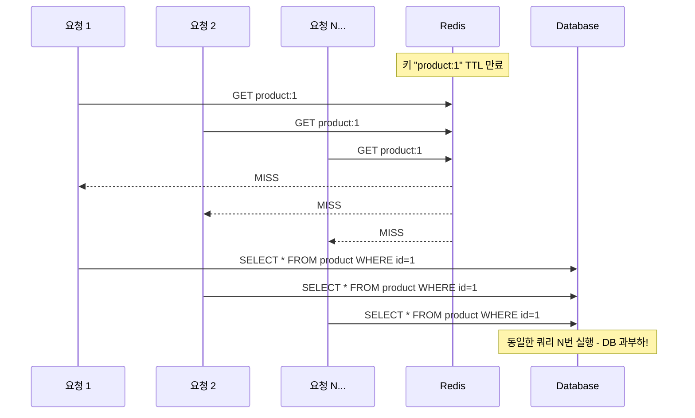
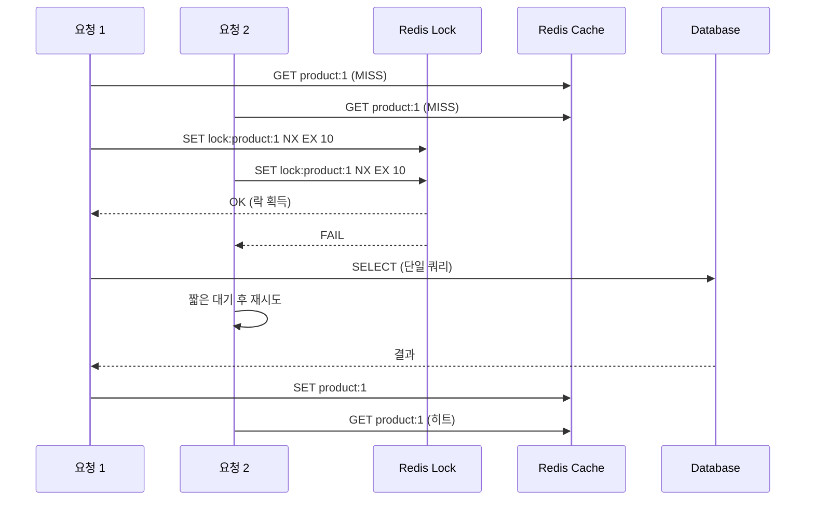
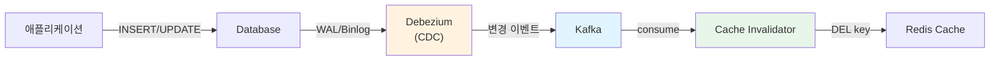

# 캐시 스탬피드와 일관성 문제: 대규모 트래픽에서의 방어 전략

캐시 만료 시 수백 개의 요청이 동시에 DB를 조회하는 Cache Stampede와 캐시-DB 간 데이터 불일치 문제는 대규모 서비스에서 반드시 해결해야 하는 과제다. 이 문서에서는 확률적 조기 만료, 분산 락, 논리적 만료 등의 방어 전략과 이벤트 기반 캐시 무효화까지 실무 구현 방법을 분석한다.

## 목차

1. [핵심 개념 (What)](#1-핵심-개념-what)
2. [왜 알아야 하는가 (Why)](#2-왜-알아야-하는가-why)
3. [내부 구현 분석 (How)](#3-내부-구현-분석-how)
4. [실전 예제](#4-실전-예제)
5. [정리](#5-정리)

---

## 1. 핵심 개념 (What)

### Cache Stampede(Thundering Herd)란?

Cache Stampede는 캐시의 특정 키가 만료되는 순간, 동일한 데이터를 요청하는 다수의 클라이언트가 동시에 캐시 미스를 경험하고, 모두가 DB에 동일한 쿼리를 실행하는 현상이다. 인기 데이터일수록 동시 요청 수가 많아 DB에 과부하를 일으킬 수 있다.

### 핵심 문제 분류

| 문제 | 설명 | 위험도 |
|------|------|-------|
| Cache Stampede | 캐시 만료 시 동시 다발 DB 조회 | 높음 |
| Cache Penetration | 존재하지 않는 데이터를 반복 조회하여 매번 DB 접근 | 중간 |
| Cache Breakdown | 핫 키 하나가 만료되어 대량 트래픽이 DB로 직행 | 높음 |
| Cache-DB 불일치 | 동시 업데이트로 인한 캐시와 DB 간 데이터 차이 | 중간 |
| 순서 역전 | 캐시 갱신 순서가 뒤바뀌어 오래된 데이터가 캐시에 잔류 | 중간 |

### 해결 전략 개요

| 전략 | 대상 문제 | 핵심 아이디어 |
|------|----------|-------------|
| 확률적 조기 만료 (PER) | Stampede | TTL 만료 전에 확률적으로 갱신 |
| 분산 락 | Stampede | 하나의 요청만 DB 조회, 나머지는 대기 |
| 논리적 만료 | Stampede | 물리적 TTL 없이 논리적 만료 시간으로 관리 |
| Cache Invalidation | 불일치 | 업데이트 시 캐시 삭제 (다음 읽기에서 재로드) |
| 이벤트 기반 무효화 | 불일치 | CDC로 DB 변경을 감지하여 캐시 자동 무효화 |

## 2. 왜 알아야 하는가 (Why)

### 실무에서 만나는 상황

1. **인기 상품 페이지 장애**: 인기 상품의 캐시 TTL이 만료되는 순간 수백 개의 동시 요청이 DB로 몰려 Connection Pool이 고갈되고 전체 서비스가 느려진다.

2. **할인 이벤트 중 가격 불일치**: 상품 가격을 변경했는데 캐시에는 이전 가격이 남아있어, 결제 시 실제 금액과 표시 금액이 다른 CS 이슈가 발생한다.

3. **동시 수정으로 인한 순서 역전**: 두 서버에서 동일한 데이터를 거의 동시에 수정하면, DB에는 최신 값이 저장되지만 캐시에는 먼저 완료된 (이전) 값이 남을 수 있다.

4. **캐시 서버 장애 후 복구**: Redis 서버가 재시작되면 모든 캐시가 비어있어 전체 트래픽이 DB로 집중된다. 캐시 워밍과 함께 Stampede 방어 메커니즘이 필수다.

## 3. 내부 구현 분석 (How)

### 3.1 Cache Stampede 발생 메커니즘



### 3.2 해결 전략 1: 확률적 조기 만료 (PER)

PER(Probabilistic Early Recomputation)은 TTL이 만료되기 전에, 남은 시간이 적을수록 높은 확률로 캐시를 갱신하는 알고리즘이다.

**수식**: `currentTime - (timeToCompute * beta * ln(random())) > expiry`

```java
@Service
@RequiredArgsConstructor
public class PERCacheService {

    private final RedisTemplate<String, Object> redisTemplate;
    private final ProductRepository productRepository;
    private static final double BETA = 1.0;

    public Product findById(Long id) {
        String key = "product:" + id;
        String metaKey = "meta:" + key;

        Product cached = (Product) redisTemplate.opsForValue().get(key);
        if (cached != null) {
            Map<Object, Object> meta = redisTemplate.opsForHash().entries(metaKey);
            if (!meta.isEmpty()) {
                long expiry = Long.parseLong(meta.get("expiry").toString());
                long computeTime = Long.parseLong(meta.get("computeTime").toString());
                double randomValue = -computeTime * BETA * Math.log(Math.random());

                if (System.currentTimeMillis() + (long) randomValue >= expiry) {
                    CompletableFuture.runAsync(() -> recompute(key, metaKey, id));
                }
            }
            return cached;
        }
        return recompute(key, metaKey, id);
    }

    private Product recompute(String key, String metaKey, Long id) {
        long startTime = System.currentTimeMillis();
        Product product = productRepository.findById(id)
            .orElseThrow(() -> new NotFoundException("Not found"));
        long computeTime = System.currentTimeMillis() - startTime;
        long ttlMillis = 3600_000L;

        redisTemplate.opsForValue().set(key, product, Duration.ofMillis(ttlMillis));
        redisTemplate.opsForHash().putAll(metaKey, Map.of(
            "expiry", String.valueOf(System.currentTimeMillis() + ttlMillis),
            "computeTime", String.valueOf(computeTime)));
        redisTemplate.expire(metaKey, Duration.ofMillis(ttlMillis));
        return product;
    }
}
```

### 3.3 해결 전략 2: 분산 락 기반 캐시 갱신

하나의 요청만 DB를 조회하고, 나머지 요청은 갱신이 완료될 때까지 대기한다.



```java
@Service
@RequiredArgsConstructor
public class DistributedLockCacheService {

    private final RedisTemplate<String, Object> redisTemplate;
    private final StringRedisTemplate stringRedisTemplate;
    private final ProductRepository productRepository;
    private static final Duration LOCK_TTL = Duration.ofSeconds(10);

    public Product findById(Long id) {
        String cacheKey = "product:" + id;
        String lockKey = "lock:" + cacheKey;

        Product cached = (Product) redisTemplate.opsForValue().get(cacheKey);
        if (cached != null) return cached;

        Boolean acquired = stringRedisTemplate.opsForValue()
            .setIfAbsent(lockKey, "locked", LOCK_TTL);

        if (Boolean.TRUE.equals(acquired)) {
            try {
                // Double-check: 락 대기 중 다른 스레드가 채웠을 수 있음
                cached = (Product) redisTemplate.opsForValue().get(cacheKey);
                if (cached != null) return cached;

                Product product = productRepository.findById(id)
                    .orElseThrow(() -> new NotFoundException("Not found"));
                redisTemplate.opsForValue().set(cacheKey, product, Duration.ofHours(1));
                return product;
            } finally {
                stringRedisTemplate.delete(lockKey);
            }
        } else {
            return waitForCache(cacheKey, id);
        }
    }

    private Product waitForCache(String cacheKey, Long id) {
        for (int i = 0; i < 50; i++) {
            try { Thread.sleep(100); }
            catch (InterruptedException e) { Thread.currentThread().interrupt(); break; }

            Product cached = (Product) redisTemplate.opsForValue().get(cacheKey);
            if (cached != null) return cached;
        }
        // Fallback: 직접 DB 조회
        return productRepository.findById(id)
            .orElseThrow(() -> new NotFoundException("Not found"));
    }
}
```

### 3.4 해결 전략 3: Singleflight 패턴

Go의 `singleflight` 패키지에서 유래한 패턴으로, **동일 키에 대한 동시 요청을 하나로 합쳐** 실제 DB 조회는 첫 번째 요청만 수행하고 나머지 요청은 같은 결과를 공유한다.

**핵심 원리**: `ConcurrentHashMap<String, CompletableFuture<V>>`를 사용하여 첫 번째 요청이 `computeIfAbsent`로 Future를 등록하면, 동시에 들어온 나머지 요청은 동일한 Future의 완료를 기다린다.

```java
@Service
@RequiredArgsConstructor
@Slf4j
public class SingleflightCacheService {

    private final RedisTemplate<String, Object> redisTemplate;
    private final ProductRepository productRepository;
    private final ConcurrentHashMap<String, CompletableFuture<Product>> inFlightRequests =
        new ConcurrentHashMap<>();

    public Product findById(Long id) {
        String cacheKey = "product:" + id;

        // 1. 캐시 히트 시 즉시 반환
        Product cached = (Product) redisTemplate.opsForValue().get(cacheKey);
        if (cached != null) return cached;

        // 2. Singleflight: 동일 키에 대해 하나의 요청만 DB 조회 수행
        CompletableFuture<Product> future = inFlightRequests.computeIfAbsent(cacheKey, key -> {
            return CompletableFuture.supplyAsync(() -> {
                try {
                    Product product = productRepository.findById(id)
                        .orElseThrow(() -> new NotFoundException("Not found"));
                    redisTemplate.opsForValue().set(cacheKey, product, Duration.ofHours(1));
                    return product;
                } finally {
                    // 완료 후 반드시 제거하여 메모리 누수 방지
                    inFlightRequests.remove(cacheKey);
                }
            });
        });

        try {
            return future.get(5, TimeUnit.SECONDS);
        } catch (Exception e) {
            inFlightRequests.remove(cacheKey); // 예외 시에도 정리
            throw new RuntimeException("캐시 조회 실패", e);
        }
    }
}
```

**분산 락과의 차이**:

| 항목 | Singleflight | 분산 락 |
|------|-------------|---------|
| 범위 | 단일 JVM (로컬) | 전체 클러스터 (글로벌) |
| 오버헤드 | ConcurrentHashMap만 사용 | Redis 네트워크 왕복 필요 |
| 적용 시점 | 1차 방어선 (가볍고 빠름) | 2차 방어선 (확실하지만 무거움) |

**1차 + 2차 방어선 조합 전략**: Singleflight로 로컬 JVM 내 중복 요청을 먼저 걸러내고, 여러 JVM 간 동시 요청은 분산 락으로 방어한다.

```java
public Product findByIdWithLayeredDefense(Long id) {
    String cacheKey = "product:" + id;

    Product cached = (Product) redisTemplate.opsForValue().get(cacheKey);
    if (cached != null) return cached;

    // 1차 방어선: Singleflight (로컬 JVM 내 중복 제거)
    CompletableFuture<Product> future = inFlightRequests.computeIfAbsent(cacheKey, key ->
        CompletableFuture.supplyAsync(() -> {
            try {
                // 2차 방어선: 분산 락 (클러스터 레벨 중복 제거)
                return executeWithDistributedLock(cacheKey, id);
            } finally {
                inFlightRequests.remove(cacheKey);
            }
        })
    );

    try {
        return future.get(5, TimeUnit.SECONDS);
    } catch (Exception e) {
        inFlightRequests.remove(cacheKey);
        throw new RuntimeException("캐시 조회 실패", e);
    }
}
```

### 3.5 해결 전략 4: 논리적 만료 (Logical Expiration)

물리적 TTL을 설정하지 않고, 캐시 값 내부에 만료 시각을 저장한다. 만료된 데이터는 이전 값을 즉시 반환하면서 백그라운드에서 갱신한다.

```java
@Getter
@AllArgsConstructor
@NoArgsConstructor
public class CacheWrapper<T> implements Serializable {
    private T data;
    private long logicalExpireAt;

    public boolean isLogicallyExpired() {
        return System.currentTimeMillis() > logicalExpireAt;
    }
}
```

핵심 동작: 물리적 TTL은 논리적 TTL보다 훨씬 길게 설정(예: 7일)하여 데이터가 Redis에서 삭제되지 않도록 한다. `isLogicallyExpired()`가 true이면 stale 데이터를 즉시 반환하고, 분산 락을 획득한 하나의 스레드만 백그라운드에서 갱신한다.

### 3.6 Cache-DB 일관성 패턴

#### Cache Invalidation vs Cache Update

| 전략 | 동작 | 장점 | 단점 |
|------|-----|------|------|
| Cache Invalidation | 업데이트 시 캐시 삭제 | 단순하고 안전 | 다음 읽기에서 캐시 미스 |
| Cache Update | 업데이트 시 캐시도 갱신 | 캐시 미스 없음 | 동시 업데이트 시 순서 역전 위험 |

**권장 패턴**: Cache Invalidation (삭제 후 재로드)

```java
// 권장: 업데이트 후 캐시 삭제
@Transactional
public Product update(UpdateCommand command) {
    Product product = productRepository.save(command.toEntity());
    redisTemplate.delete("product:" + product.getId());
    return product;
}

// 비권장: 순서 역전 위험
// Thread A: price=1000 저장 -> (지연) -> 캐시에 1000 저장
// Thread B: price=2000 저장 -> 캐시에 2000 저장 -> (Thread A가 덮어씀)
// 결과: DB=2000, 캐시=1000 (불일치!)
```

### 3.7 이벤트 기반 캐시 무효화 (CDC)



CDC(Change Data Capture)를 사용하면 DB 변경 사항을 실시간으로 감지하여 캐시를 무효화할 수 있다. 애플리케이션 코드에 캐시 무효화 로직을 넣을 필요가 없어 결합도가 낮아진다.

```java
@Component
@RequiredArgsConstructor
@Slf4j
public class CacheInvalidationConsumer {

    private final RedisTemplate<String, Object> redisTemplate;
    private final ObjectMapper objectMapper;

    @KafkaListener(topics = "dbserver1.public.products")
    public void handleProductChange(ConsumerRecord<String, String> record) {
        try {
            JsonNode payload = objectMapper.readTree(record.value()).get("payload");
            String operation = payload.get("op").asText();

            if ("u".equals(operation) || "d".equals(operation)) {
                Long productId = payload.get("before").get("id").asLong();
                redisTemplate.delete("product:" + productId);
                log.info("캐시 무효화: key=product:{}, op={}", productId, operation);
            }
        } catch (Exception e) {
            log.error("캐시 무효화 처리 실패", e);
        }
    }
}
```

## 4. 실전 예제

### 4.1 Redisson 분산 락 기반 Stampede 방어

```java
@Service
@RequiredArgsConstructor
@Slf4j
public class StampedeProtectedCacheService {

    private final RedissonClient redissonClient;
    private final RedisTemplate<String, Object> redisTemplate;
    private final ProductRepository productRepository;

    public Product findById(Long id) {
        String cacheKey = "product:" + id;

        Product cached = (Product) redisTemplate.opsForValue().get(cacheKey);
        if (cached != null) return cached;

        RLock lock = redissonClient.getLock("lock:" + cacheKey);
        try {
            if (lock.tryLock(5, 10, TimeUnit.SECONDS)) {
                try {
                    cached = (Product) redisTemplate.opsForValue().get(cacheKey);
                    if (cached != null) return cached;  // Double-check

                    Product product = productRepository.findById(id)
                        .orElseThrow(() -> new NotFoundException("Not found"));
                    redisTemplate.opsForValue().set(cacheKey, product, Duration.ofHours(1));
                    return product;
                } finally {
                    if (lock.isHeldByCurrentThread()) lock.unlock();
                }
            }
            log.warn("Lock timeout for key={}, falling back to DB", cacheKey);
            return productRepository.findById(id)
                .orElseThrow(() -> new NotFoundException("Not found"));
        } catch (InterruptedException e) {
            Thread.currentThread().interrupt();
            throw new RuntimeException("Lock interrupted", e);
        }
    }
}
```

### 4.2 Spring Cache + Stampede 방어 AOP

```java
@Target(ElementType.METHOD)
@Retention(RetentionPolicy.RUNTIME)
public @interface StampedeProtected {
    long lockWaitMs() default 5000;
    long lockLeaseMs() default 10000;
}

@Aspect
@Component
@RequiredArgsConstructor
@Order(Ordered.HIGHEST_PRECEDENCE)
public class StampedeProtectionAspect {

    private final RedissonClient redissonClient;

    @Around("@annotation(stampedeProtected) && @annotation(cacheable)")
    public Object protect(ProceedingJoinPoint joinPoint,
                          StampedeProtected stampedeProtected,
                          Cacheable cacheable) throws Throwable {
        String cacheName = cacheable.value().length > 0 ? cacheable.value()[0] : "default";
        String lockKey = "lock:" + cacheName + ":" + Arrays.toString(joinPoint.getArgs());

        RLock lock = redissonClient.getLock(lockKey);
        if (!lock.tryLock(stampedeProtected.lockWaitMs(),
                          stampedeProtected.lockLeaseMs(), TimeUnit.MILLISECONDS)) {
            throw new CacheStampedeException("Failed to acquire lock: " + lockKey);
        }
        try {
            return joinPoint.proceed();
        } finally {
            if (lock.isHeldByCurrentThread()) lock.unlock();
        }
    }
}

// 사용 예시
@StampedeProtected(lockWaitMs = 3000)
@Cacheable(value = "products", key = "#id")
public Product findById(Long id) {
    return productRepository.findById(id)
        .orElseThrow(() -> new NotFoundException("Not found"));
}
```

## 5. 정리

| 항목 | 설명 |
|-----|------|
| Cache Stampede | 캐시 만료 시 다수 요청이 동시에 DB를 조회하는 문제 |
| PER (확률적 조기 만료) | TTL 만료 전 확률적으로 백그라운드 갱신, 점진적 부하 분산 |
| 분산 락 | 하나의 요청만 DB 조회, 나머지는 대기 (Redisson `RLock` 활용) |
| 논리적 만료 | 물리적 TTL 없이 논리적 만료 시각으로 관리, stale 데이터 즉시 반환 |
| Cache Invalidation | 업데이트 시 캐시 삭제 (Cache Update보다 안전, 순서 역전 방지) |
| 이벤트 기반 무효화 | Debezium CDC로 DB 변경 감지 후 Kafka 통해 캐시 자동 무효화 |
| Double-check | 락 획득 후 캐시 재확인으로 불필요한 DB 조회 방지 |
| Fallback 전략 | 락 대기 시간 초과 시 직접 DB 조회로 가용성 확보 |

---
*참고: Redis 7.x / Spring Boot 3.x 기준*
