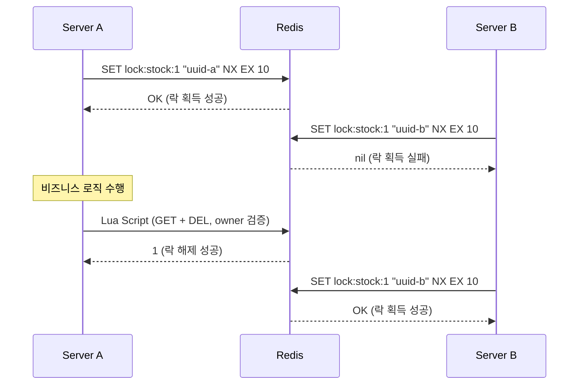
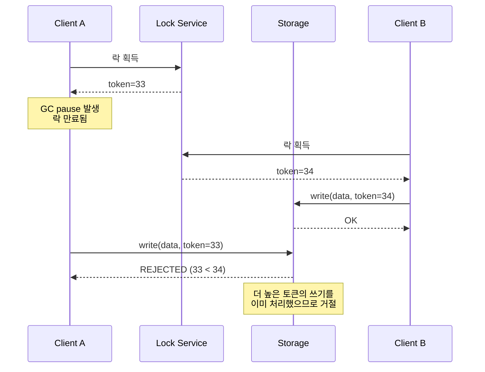

# 분산 락 기초: SETNX와 Lua 스크립트

분산 환경에서 여러 서버가 동일 자원에 동시 접근할 때 데이터 정합성을 보장하기 위한 Redis 기반 분산 락의 원리와 구현 방법을 분석한다. `SET NX EX` 명령, Lua 스크립트를 활용한 원자적 락 해제, Fencing Token 개념까지 다룬다.

## 목차

1. [핵심 개념 (What)](#1-핵심-개념-what)
2. [왜 알아야 하는가 (Why)](#2-왜-알아야-하는가-why)
3. [내부 구현 분석 (How)](#3-내부-구현-분석-how)
4. [실전 예제](#4-실전-예제)
5. [정리](#5-정리)

---

## 1. 핵심 개념 (What)

### 분산 락이란?

분산 락(Distributed Lock)은 여러 프로세스 또는 서버가 공유 자원에 대해 상호 배제(Mutual Exclusion)를 보장하는 동기화 메커니즘이다. 단일 JVM의 `synchronized`나 `ReentrantLock`은 프로세스 간 동기화가 불가능하므로, 외부 시스템(Redis, Zookeeper 등)을 활용하여 락을 구현한다.

### 핵심 구성요소

| 구성요소 | 역할 |
|---------|------|
| `SET key value NX EX ttl` | 키가 존재하지 않을 때만 값을 설정하고 TTL을 지정하는 원자적 명령 |
| Lock Owner (UUID) | 락 소유자를 식별하여 본인만 락을 해제할 수 있도록 보장 |
| Lua Script | GET + DEL을 원자적으로 실행하여 안전한 락 해제를 구현 |
| TTL (Time-To-Live) | 데드락 방지를 위한 락 자동 만료 시간 |
| Fencing Token | 락 만료 후 뒤늦게 도착하는 요청을 방어하기 위한 단조 증가 토큰 |

### SETNX 명령의 진화

```
# Redis 2.6 이전: 두 명령 분리 (비원자적 - 위험)
SETNX lock:order:123 "owner-uuid"
EXPIRE lock:order:123 10

# Redis 2.6.12 이후: 단일 원자적 명령 (안전)
SET lock:order:123 "owner-uuid" NX EX 10
```

`NX`는 키가 존재하지 않을 때만 설정, `EX`는 만료 시간(초)을 지정한다. 두 옵션을 하나의 명령으로 결합하여 원자성을 보장한다.

## 2. 왜 알아야 하는가 (Why)

### 실무에서 만나는 상황

1. **재고 차감 동시성 제어**: 여러 서버에서 동시에 재고를 조회하고 차감하면 오버셀링(overselling)이 발생한다. 분산 락으로 한 번에 하나의 서버만 재고를 처리하도록 제한해야 한다.

2. **중복 결제 방지**: 사용자가 결제 버튼을 빠르게 두 번 클릭하거나, 네트워크 재시도로 동일 결제 요청이 여러 서버에 도달할 수 있다. 분산 락으로 동일 주문에 대한 중복 처리를 방지한다.

3. **스케줄러 중복 실행 방지**: 여러 인스턴스에서 동일한 `@Scheduled` 작업이 동시에 실행되면 데이터 불일치가 발생한다. 분산 락으로 한 인스턴스만 작업을 수행하도록 보장한다.

4. **외부 API 호출 제한**: Rate Limit이 있는 외부 API를 여러 서버에서 호출할 때, 분산 락으로 동시 호출 수를 제어해야 한다.

### 왜 Redis인가?

- **빠른 응답 속도**: 인메모리 기반으로 수 마이크로초 내에 락 획득/해제 가능
- **TTL 기본 지원**: 데드락 방지를 위한 자동 만료 기능 내장
- **원자적 명령**: `SET NX EX`로 락 획득의 원자성 보장
- **높은 가용성**: Sentinel, Cluster를 통한 고가용성 구성 가능

## 3. 내부 구현 분석 (How)

### 3.1 분산 락 동작 흐름



### 3.2 안전하지 않은 락 해제 문제

단순 `DEL` 명령으로 락을 해제하면 다른 클라이언트의 락을 해제할 위험이 있다.

```
시간 흐름:
t1: Client A가 락 획득 (TTL 10초)
t2: Client A의 작업이 10초 이상 소요 (GC pause, 네트워크 지연 등)
t3: 락 자동 만료 → Client B가 새로운 락 획득
t4: Client A 작업 완료 → DEL 실행 → Client B의 락을 삭제!
t5: Client C가 락 획득 → Client B, C 동시 작업 (데이터 불일치)
```

### 3.3 Lua 스크립트 기반 안전한 락 해제

Redis는 Lua 스크립트를 원자적으로 실행한다. GET과 DEL을 하나의 스크립트로 묶어 소유자 검증과 삭제를 원자적으로 수행한다.

```lua
-- unlock.lua
-- KEYS[1]: 락 키
-- ARGV[1]: 락 소유자 식별값 (UUID)

if redis.call('GET', KEYS[1]) == ARGV[1] then
    return redis.call('DEL', KEYS[1])
else
    return 0
end
```

이 스크립트는 Redis 서버에서 단일 스레드로 실행되므로, GET과 DEL 사이에 다른 명령이 끼어들 수 없다.

### 3.4 스핀락 vs Pub/Sub 기반 대기

**스핀락 방식** (SETNX 직접 구현 시):

```
while (현재시간 < 대기만료시간) {
    if (SET key value NX EX ttl == OK) return true;
    Thread.sleep(100);  // 100ms마다 재시도
}
return false;
```

- 단점: 불필요한 Redis 요청 반복, CPU 낭비, Redis 부하 증가

**Pub/Sub 방식** (Redisson 등 라이브러리):

```
1. SET key value NX EX ttl 시도
2. 실패 시 → SUBSCRIBE lock_channel
3. 락 해제 시 → PUBLISH lock_channel "unlocked"
4. 메시지 수신 → 즉시 락 재시도
```

- 장점: 불필요한 폴링 제거, 효율적인 리소스 사용

#### 스핀락 재시도 시 지수 백오프 + Jitter

스핀락에서 고정 `sleep(100ms)`를 사용하면 **"thundering herd of retries"** 문제가 발생한다. 락이 해제되는 시점에 대기 중인 모든 클라이언트가 동시에 재시도하여 Redis에 순간적인 부하가 급증한다.

AWS의 "Exponential Backoff And Jitter" 블로그에서 권장하는 3가지 전략:

| 전략 | 수식 | 특징 |
|------|------|------|
| Full Jitter | `sleep = random(0, min(cap, base * 2^attempt))` | 가장 넓은 분산, 충돌 최소화 |
| Equal Jitter | `temp = min(cap, base * 2^attempt); sleep = temp/2 + random(0, temp/2)` | 최소 대기 보장 + 적당한 분산 |
| Decorrelated Jitter | `sleep = min(cap, random(base, sleep * 3))` | 이전 sleep 값 기반, 연속적 분산 |

**Full Jitter 구현** (기존 `tryLock` 메서드의 고정 `retryInterval`을 backoff + jitter로 교체):

```java
public Optional<LockHandle> tryLockWithBackoff(String key, Duration ttl,
                                                Duration waitTimeout, int maxRetries) {
    long base = 50;   // 초기 대기 50ms
    long cap = 5000;  // 최대 대기 5초

    for (int attempt = 0; attempt < maxRetries; attempt++) {
        Optional<LockHandle> handle = tryLock(key, ttl);
        if (handle.isPresent()) return handle;

        // Full Jitter: 지수적으로 증가하는 상한 내에서 랜덤 대기
        long expBackoff = Math.min(cap, base * (1L << attempt));
        long sleepMs = ThreadLocalRandom.current().nextLong(0, expBackoff);

        try {
            Thread.sleep(sleepMs);
        } catch (InterruptedException e) {
            Thread.currentThread().interrupt();
            return Optional.empty();
        }
    }
    return Optional.empty();
}
```

**기존 `tryLock` 메서드와의 비교**:

| 항목 | 고정 100ms 재시도 | Full Jitter 백오프 |
|------|------------------|-------------------|
| 1회차 대기 | 100ms | 0~50ms (랜덤) |
| 5회차 대기 | 100ms | 0~800ms (랜덤) |
| 10회차 대기 | 100ms | 0~5000ms (랜덤) |
| 동시 재시도 충돌 | 모든 클라이언트가 동일 시점에 재시도 | 클라이언트별로 다른 시점에 재시도 |
| Redis 부하 패턴 | 주기적 스파이크 | 균등 분산 |

### 3.5 Fencing Token 개념

Martin Kleppmann이 제안한 안전 장치로, 락 만료 후 뒤늦게 도착하는 쓰기 요청을 방어한다.



Fencing Token은 단조 증가하는 숫자로, 스토리지 계층에서 이전 토큰의 쓰기를 거부하여 데이터 정합성을 보장한다.

### 3.6 데드락 방지: TTL 기반 자동 만료

| 시나리오 | TTL 없을 때 | TTL 있을 때 |
|---------|------------|------------|
| 클라이언트 크래시 | 락 영원히 유지 (데드락) | TTL 만료 후 자동 해제 |
| 네트워크 단절 | 락 해제 불가 | TTL 만료 후 자동 해제 |
| 프로세스 종료 | 락 영원히 유지 | TTL 만료 후 자동 해제 |

TTL 설정 가이드라인:
- **너무 짧은 TTL**: 작업 완료 전 락 만료 → 동시 접근 발생
- **너무 긴 TTL**: 장애 시 복구 시간 증가
- **권장**: 예상 작업 시간의 2~3배로 설정

## 4. 실전 예제

### 4.1 Spring Boot에서 Redis 분산 락 직접 구현

```java
@Component
@RequiredArgsConstructor
public class RedisDistributedLock {

    private final StringRedisTemplate redisTemplate;

    private static final String UNLOCK_SCRIPT = """
        if redis.call('GET', KEYS[1]) == ARGV[1] then
            return redis.call('DEL', KEYS[1])
        else
            return 0
        end
        """;

    private final DefaultRedisScript<Long> unlockScript;

    @PostConstruct
    void init() {
        // 스크립트를 사전 로드하여 SHA1 해시로 캐싱 (EVALSHA 사용)
    }

    public RedisDistributedLock(StringRedisTemplate redisTemplate) {
        this.redisTemplate = redisTemplate;
        this.unlockScript = new DefaultRedisScript<>(UNLOCK_SCRIPT, Long.class);
    }

    /**
     * 락 획득 시도 (1회)
     */
    public Optional<LockHandle> tryLock(String key, Duration ttl) {
        String ownerId = UUID.randomUUID().toString();
        Boolean acquired = redisTemplate.opsForValue()
            .setIfAbsent(key, ownerId, ttl);

        if (Boolean.TRUE.equals(acquired)) {
            return Optional.of(new LockHandle(key, ownerId));
        }
        return Optional.empty();
    }

    /**
     * 락 획득 (재시도 포함)
     */
    public Optional<LockHandle> tryLock(String key, Duration ttl,
                                         Duration waitTimeout, Duration retryInterval) {
        long deadline = System.currentTimeMillis() + waitTimeout.toMillis();

        while (System.currentTimeMillis() < deadline) {
            Optional<LockHandle> handle = tryLock(key, ttl);
            if (handle.isPresent()) {
                return handle;
            }
            try {
                Thread.sleep(retryInterval.toMillis());
            } catch (InterruptedException e) {
                Thread.currentThread().interrupt();
                return Optional.empty();
            }
        }
        return Optional.empty();
    }

    /**
     * 락 해제 (소유자 검증)
     */
    public boolean unlock(LockHandle handle) {
        Long result = redisTemplate.execute(
            unlockScript,
            List.of(handle.key()),
            handle.ownerId()
        );
        return Long.valueOf(1L).equals(result);
    }

    public record LockHandle(String key, String ownerId) {}
}
```

### 4.2 Fencing Token을 활용한 안전한 쓰기

```java
@Component
@RequiredArgsConstructor
public class FencingTokenLock {

    private final StringRedisTemplate redisTemplate;

    private static final String ACQUIRE_WITH_TOKEN_SCRIPT = """
        if redis.call('SET', KEYS[1], ARGV[1], 'NX', 'EX', ARGV[2]) then
            local token = redis.call('INCR', KEYS[2])
            return token
        else
            return -1
        end
        """;

    /**
     * 락 획득 시 Fencing Token 반환
     * @return token > 0이면 성공, -1이면 실패
     */
    public long tryLockWithToken(String lockKey, String ownerId, Duration ttl) {
        DefaultRedisScript<Long> script =
            new DefaultRedisScript<>(ACQUIRE_WITH_TOKEN_SCRIPT, Long.class);

        Long token = redisTemplate.execute(
            script,
            List.of(lockKey, lockKey + ":token"),
            ownerId,
            String.valueOf(ttl.getSeconds())
        );
        return token != null ? token : -1;
    }
}

@Service
@RequiredArgsConstructor
public class SafeStorageService {

    private final FencingTokenLock fencingTokenLock;
    private final StockRepository stockRepository;

    @Transactional
    public void updateStock(Long productId, int quantity) {
        String lockKey = "lock:stock:" + productId;
        String ownerId = UUID.randomUUID().toString();

        long token = fencingTokenLock.tryLockWithToken(
            lockKey, ownerId, Duration.ofSeconds(10));

        if (token < 0) {
            throw new LockAcquisitionException("락 획득 실패");
        }

        // Fencing Token을 함께 저장하여 후속 검증 가능
        Stock stock = stockRepository.findByProductId(productId);
        if (stock.getLastFencingToken() >= token) {
            // 이전 토큰의 갱신이 이미 반영됨 → 무시
            return;
        }

        stock.decrease(quantity);
        stock.setLastFencingToken(token);
        stockRepository.save(stock);
    }
}
```

### 4.3 트랜잭션과 락 순서 주의사항

```java
/**
 * 올바른 패턴: 락 획득 → 트랜잭션 시작 → 비즈니스 로직 → 트랜잭션 커밋 → 락 해제
 */
@Service
@RequiredArgsConstructor
public class OrderService {

    private final RedisDistributedLock distributedLock;
    private final OrderTransactionService txService;

    public void createOrder(Long productId, int quantity) {
        String lockKey = "lock:stock:" + productId;

        RedisDistributedLock.LockHandle handle = distributedLock
            .tryLock(lockKey, Duration.ofSeconds(10),
                     Duration.ofSeconds(5), Duration.ofMillis(100))
            .orElseThrow(() -> new LockAcquisitionException("락 획득 실패"));

        try {
            // @Transactional 메서드를 별도 빈에서 호출
            txService.processOrder(productId, quantity);
        } finally {
            distributedLock.unlock(handle);
        }
    }
}

@Service
@RequiredArgsConstructor
public class OrderTransactionService {

    private final StockRepository stockRepository;

    @Transactional
    public void processOrder(Long productId, int quantity) {
        Stock stock = stockRepository.findByProductId(productId);
        stock.decrease(quantity);
        stockRepository.save(stock);
    }
}
```

**핵심**: `@Transactional` 메서드 내부에서 락을 해제하면, 트랜잭션 커밋 전에 다른 스레드가 락을 획득하여 커밋되지 않은 데이터를 읽을 수 있다. 반드시 트랜잭션 커밋 이후에 락을 해제해야 한다.

## 5. 정리

| 항목 | 설명 |
|-----|------|
| 락 획득 | `SET key value NX EX ttl` 단일 원자적 명령으로 획득 |
| 소유자 식별 | UUID 기반 owner 값으로 본인만 락 해제 가능하도록 보장 |
| 안전한 해제 | Lua 스크립트로 GET(소유자 검증) + DEL(삭제)을 원자적 실행 |
| 데드락 방지 | TTL 기반 자동 만료로 클라이언트 장애 시에도 락 자동 해제 |
| Fencing Token | 단조 증가 토큰으로 만료된 락의 지연 쓰기 방어 |
| 스핀락 한계 | 직접 구현 시 폴링 방식으로 Redis 부하 발생, Pub/Sub 기반 라이브러리 권장 |
| 트랜잭션 순서 | 락 획득 → 트랜잭션 시작 → 작업 → 트랜잭션 커밋 → 락 해제 순서 준수 |
| TTL 설정 | 예상 작업 시간의 2~3배, 너무 짧으면 동시 접근, 너무 길면 복구 지연 |

---
*참고: Redis 7.x 기준*
