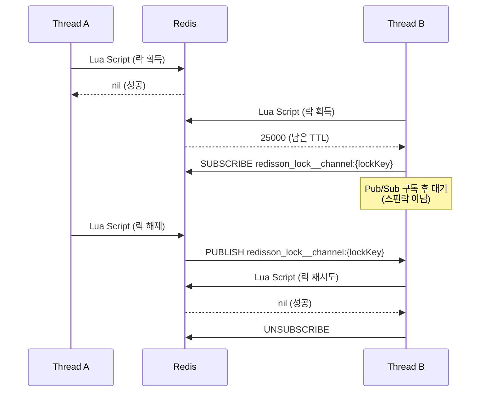
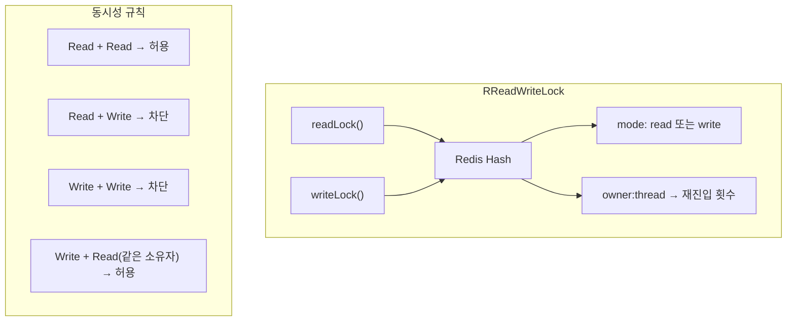

# Redisson 분산 락 심화

Redisson은 Redis 위에 구축된 고수준 Java 분산 동기화 라이브러리다. 이 문서에서는 RLock의 Pub/Sub 기반 대기 메커니즘, Watchdog 자동 TTL 연장, RReadWriteLock, RFairLock, RSemaphore 등 다양한 동기화 도구의 내부 구현과 활용 방법을 분석한다.

## 목차

1. [핵심 개념 (What)](#1-핵심-개념-what)
2. [왜 알아야 하는가 (Why)](#2-왜-알아야-하는가-why)
3. [내부 구현 분석 (How)](#3-내부-구현-분석-how)
4. [실전 예제](#4-실전-예제)
5. [정리](#5-정리)

---

## 1. 핵심 개념 (What)

### Redisson RLock 아키텍처

Redisson의 `RLock`은 단순한 `SET NX` 기반 구현을 넘어, Pub/Sub 기반 대기와 Watchdog 자동 갱신을 제공하는 재진입 가능(Reentrant) 분산 락이다. 내부적으로 Redis Hash 구조를 사용하여 락 소유자와 재진입 횟수를 관리한다.

### 핵심 구성요소

| 구성요소 | 역할 |
|---------|------|
| `RLock` | 기본 재진입 분산 락, Pub/Sub 기반 대기 |
| `RReadWriteLock` | 읽기-쓰기 분리 락, 읽기 동시 허용 / 쓰기 배타적 |
| `RFairLock` | FIFO 순서 보장 공정 락, Redis List로 대기열 관리 |
| `RSemaphore` | 동시 접근 수 제한, 분산 세마포어 |
| `RCountDownLatch` | 분산 환경의 카운트다운 래치 |
| Watchdog | `leaseTime` 미지정 시 30초마다 TTL 자동 갱신 |

### Redis 내부 저장 구조

```
# RLock은 Hash 타입으로 저장
HSET lock:order:123
    "owner-uuid:thread-1"    "1"     # 소유자ID:스레드ID → 재진입 횟수

# TTL 설정
PEXPIRE lock:order:123 30000        # 30초 (Watchdog 기본값)
```

## 2. 왜 알아야 하는가 (Why)

### 실무에서 만나는 상황

1. **스핀락 성능 문제 해결**: 직접 구현한 `SET NX` 기반 락은 폴링 방식으로 Redis에 불필요한 부하를 준다. Redisson의 Pub/Sub 기반 대기는 이 문제를 근본적으로 해결한다.

2. **작업 시간 예측 불가**: 비즈니스 로직의 수행 시간이 일정하지 않을 때, 고정 TTL은 위험하다. Watchdog이 자동으로 TTL을 연장하여 작업 완료 전 락 만료를 방지한다.

3. **읽기 성능 최적화**: 읽기가 많고 쓰기가 적은 시나리오에서 `RReadWriteLock`으로 읽기 동시성을 확보하면서 쓰기 일관성을 유지할 수 있다.

4. **동시 접근 수 제한**: 외부 API 호출이나 리소스 접근을 N개로 제한해야 할 때 `RSemaphore`가 유용하다.

### tryLock vs lock

| 메서드 | 동작 | 사용 시나리오 |
|-------|------|-------------|
| `lock()` | 락 획득까지 무한 대기, Watchdog 활성화 | 반드시 실행해야 하는 작업 |
| `lock(leaseTime, unit)` | 무한 대기, Watchdog 비활성화, 고정 TTL | TTL 직접 관리 |
| `tryLock()` | 즉시 반환 (성공/실패) | 빠른 실패가 필요한 경우 |
| `tryLock(waitTime, leaseTime, unit)` | waitTime 동안 대기, 실패 시 false | 타임아웃이 필요한 일반적 케이스 |
| `tryLock(waitTime, unit)` | waitTime 동안 대기, Watchdog 활성화 | 작업 시간이 가변적인 경우 |

## 3. 내부 구현 분석 (How)

### 3.1 RLock 락 획득 Lua 스크립트

Redisson은 내부적으로 Lua 스크립트를 사용하여 원자적 락 획득을 수행한다.

```lua
-- RLock 락 획득 스크립트 (간소화)
-- KEYS[1]: 락 키
-- ARGV[1]: 락 유지 시간 (밀리초)
-- ARGV[2]: 소유자 식별값 (UUID:threadId)

-- 락이 존재하지 않으면 새로 획득
if redis.call('EXISTS', KEYS[1]) == 0 then
    redis.call('HINCRBY', KEYS[1], ARGV[2], 1)
    redis.call('PEXPIRE', KEYS[1], ARGV[1])
    return nil
end

-- 이미 본인이 소유한 락이면 재진입 (카운트 증가)
if redis.call('HEXISTS', KEYS[1], ARGV[2]) == 1 then
    redis.call('HINCRBY', KEYS[1], ARGV[2], 1)
    redis.call('PEXPIRE', KEYS[1], ARGV[1])
    return nil
end

-- 다른 소유자가 보유 중 → 남은 TTL 반환
return redis.call('PTTL', KEYS[1])
```

- 반환값이 `nil`이면 락 획득 성공
- 반환값이 숫자(남은 TTL)이면 락 획득 실패

### 3.2 Pub/Sub 기반 대기 메커니즘



**핵심**: 락 획득 실패 시 Redis Pub/Sub 채널을 구독하고 대기한다. 락이 해제되면 `PUBLISH`로 알림을 받아 즉시 재시도한다. 스핀락 대비 Redis 부하를 대폭 줄인다.

### 3.3 Watchdog 메커니즘

Watchdog은 `leaseTime`을 명시하지 않았을 때 활성화되며, 락 소유 스레드가 살아 있는 동안 TTL을 자동으로 연장한다.

```
기본 설정:
- lockWatchdogTimeout: 30초 (Config에서 변경 가능)
- 갱신 주기: lockWatchdogTimeout / 3 = 10초마다

동작 흐름:
t=0s   : 락 획득, TTL=30s, Watchdog 스케줄링
t=10s  : Watchdog 실행 → TTL을 30s로 갱신
t=20s  : Watchdog 실행 → TTL을 30s로 갱신
t=30s  : Watchdog 실행 → TTL을 30s로 갱신
...
t=Ns   : unlock() 호출 → Watchdog 취소
```

```lua
-- Watchdog TTL 갱신 Lua 스크립트
-- KEYS[1]: 락 키
-- ARGV[1]: 갱신할 TTL (밀리초)
-- ARGV[2]: 소유자 식별값

if redis.call('HEXISTS', KEYS[1], ARGV[2]) == 1 then
    redis.call('PEXPIRE', KEYS[1], ARGV[1])
    return 1
end
return 0
```

**주의사항**: `leaseTime`을 명시적으로 지정하면 Watchdog이 활성화되지 않는다. 작업 시간이 가변적이라면 `leaseTime`을 지정하지 않는 것이 안전하다.

### 3.4 RLock 락 해제 Lua 스크립트

```lua
-- RLock 락 해제 스크립트 (간소화)
-- KEYS[1]: 락 키
-- KEYS[2]: Pub/Sub 채널
-- ARGV[1]: unlock 메시지
-- ARGV[2]: 락 유지 시간
-- ARGV[3]: 소유자 식별값

-- 소유자가 아니면 거부
if redis.call('HEXISTS', KEYS[1], ARGV[3]) == 0 then
    return nil
end

-- 재진입 카운트 감소
local counter = redis.call('HINCRBY', KEYS[1], ARGV[3], -1)

if counter > 0 then
    -- 아직 재진입이 남아 있으면 TTL만 갱신
    redis.call('PEXPIRE', KEYS[1], ARGV[2])
    return 0
else
    -- 카운트가 0이면 락 완전 해제
    redis.call('DEL', KEYS[1])
    redis.call('PUBLISH', KEYS[2], ARGV[1])
    return 1
end
```

### 3.5 RReadWriteLock 구조



- 읽기 락은 여러 스레드가 동시에 획득 가능
- 쓰기 락은 배타적이며, 읽기 락을 모두 기다린 후 획득
- 같은 소유자가 쓰기 락을 보유 중일 때 읽기 락으로 다운그레이드 가능

### 3.6 RFairLock: 대기열 기반 공정 락

일반 `RLock`은 락 해제 시 Pub/Sub를 통해 모든 대기자에게 알리며, 어떤 스레드가 먼저 획득할지 보장하지 않는다. `RFairLock`은 Redis List를 사용하여 FIFO 순서를 보장한다.

```
Redis 저장 구조:
HASH  lock:fair:order     # 락 상태 (소유자, 재진입 횟수)
LIST  redisson_lock_queue:{lock:fair:order}   # 대기열 (FIFO)
ZSET  redisson_lock_timeout:{lock:fair:order} # 대기자별 타임아웃
```

### 3.7 RSemaphore와 RCountDownLatch

```java
// RSemaphore: 동시 접근 수 제한
RSemaphore semaphore = redisson.getSemaphore("api:rate-limit");
semaphore.trySetPermits(5);  // 최대 5개 동시 접근

semaphore.acquire();
try {
    callExternalApi();
} finally {
    semaphore.release();
}

// RCountDownLatch: 분산 카운트다운
RCountDownLatch latch = redisson.getCountDownLatch("batch:complete");
latch.trySetCount(3);  // 3개 작업 완료 대기

// 각 워커에서
latch.countDown();

// 메인 스레드에서
latch.await();  // 모든 워커 완료까지 대기
```

## 4. 실전 예제

### 4.1 Spring AOP 기반 분산 락 어노테이션 구현

```java
@Target(ElementType.METHOD)
@Retention(RetentionPolicy.RUNTIME)
@Documented
public @interface DistributedLock {

    /**
     * 락 키 (SpEL 표현식 지원)
     * 예: "'lock:order:' + #orderId"
     */
    String key();

    /** 락 대기 시간 (밀리초). 기본 5초 */
    long waitTime() default 5_000;

    /**
     * 락 유지 시간 (밀리초). 기본 -1 (Watchdog 사용)
     * -1로 설정하면 Watchdog이 자동 갱신
     */
    long leaseTime() default -1;

    /** 락 획득 실패 시 예외 타입 */
    Class<? extends RuntimeException> failException()
        default LockAcquisitionException.class;
}
```

```java
@Aspect
@Component
@Order(Ordered.HIGHEST_PRECEDENCE)  // 트랜잭션보다 먼저 실행
@RequiredArgsConstructor
@Slf4j
public class DistributedLockAspect {

    private final RedissonClient redissonClient;
    private final ExpressionParser parser = new SpelExpressionParser();
    private final ParameterNameDiscoverer nameDiscoverer
        = new DefaultParameterNameDiscoverer();

    @Around("@annotation(distributedLock)")
    public Object around(ProceedingJoinPoint joinPoint,
                         DistributedLock distributedLock) throws Throwable {
        String lockKey = resolveKey(joinPoint, distributedLock.key());
        RLock lock = redissonClient.getLock(lockKey);

        boolean acquired = false;
        try {
            acquired = (distributedLock.leaseTime() == -1)
                ? lock.tryLock(distributedLock.waitTime(), TimeUnit.MILLISECONDS)
                : lock.tryLock(distributedLock.waitTime(),
                    distributedLock.leaseTime(), TimeUnit.MILLISECONDS);

            if (!acquired) {
                throw new LockAcquisitionException("분산 락 획득 실패: " + lockKey);
            }
            log.debug("분산 락 획득 성공: key={}", lockKey);
            return joinPoint.proceed();
        } catch (InterruptedException e) {
            Thread.currentThread().interrupt();
            throw new RuntimeException("락 획득 중 인터럽트 발생", e);
        } finally {
            if (acquired && lock.isHeldByCurrentThread()) {
                lock.unlock();
                log.debug("분산 락 해제: key={}", lockKey);
            }
        }
    }

    private String resolveKey(ProceedingJoinPoint joinPoint, String expression) {
        MethodSignature signature = (MethodSignature) joinPoint.getSignature();
        Object[] args = joinPoint.getArgs();
        String[] paramNames = nameDiscoverer.getParameterNames(signature.getMethod());
        StandardEvaluationContext context = new StandardEvaluationContext();
        if (paramNames != null) {
            for (int i = 0; i < paramNames.length; i++) {
                context.setVariable(paramNames[i], args[i]);
            }
        }
        return parser.parseExpression(expression).getValue(context, String.class);
    }
}
```

### 4.2 어노테이션 기반 분산 락 사용

```java
@Service
@RequiredArgsConstructor
public class StockService {

    private final StockRepository stockRepository;

    /**
     * Watchdog 활성화 (leaseTime 미지정)
     * 작업이 오래 걸려도 자동으로 TTL 연장
     */
    @DistributedLock(key = "'lock:stock:' + #productId")
    @Transactional
    public void decrease(Long productId, int quantity) {
        Stock stock = stockRepository.findByProductId(productId)
            .orElseThrow(() -> new NotFoundException("상품 없음: " + productId));

        if (stock.getQuantity() < quantity) {
            throw new InsufficientStockException("재고 부족");
        }
        stock.decrease(quantity);
    }

    /**
     * 고정 TTL 사용 (Watchdog 비활성화)
     * 작업이 leaseTime 내에 완료되어야 함
     */
    @DistributedLock(
        key = "'lock:stock:batch:' + #productId",
        waitTime = 10_000,
        leaseTime = 30_000
    )
    @Transactional
    public void batchDecrease(Long productId, List<OrderItem> items) {
        Stock stock = stockRepository.findByProductId(productId)
            .orElseThrow(() -> new NotFoundException("상품 없음"));

        int totalQuantity = items.stream()
            .mapToInt(OrderItem::getQuantity).sum();
        stock.decrease(totalQuantity);
    }
}
```

### 4.3 RReadWriteLock을 활용한 설정 캐시

```java
@Service
@RequiredArgsConstructor
public class ConfigCacheService {

    private final RedissonClient redissonClient;
    private final ConfigRepository configRepository;

    /** 설정 조회 - 읽기 락 (여러 스레드 동시 읽기 가능) */
    public Config getConfig(String configKey) {
        RReadWriteLock rwLock = redissonClient.getReadWriteLock("rwlock:config:" + configKey);
        RLock readLock = rwLock.readLock();
        try {
            readLock.lock();
            RBucket<Config> bucket = redissonClient.getBucket("config:" + configKey);
            Config cached = bucket.get();
            if (cached != null) return cached;
            readLock.unlock();
            return loadAndCacheConfig(configKey);
        } finally {
            if (readLock.isHeldByCurrentThread()) readLock.unlock();
        }
    }

    /** 설정 갱신 - 쓰기 락 (배타적 접근) */
    public void updateConfig(String configKey, Config newConfig) {
        RReadWriteLock rwLock = redissonClient.getReadWriteLock("rwlock:config:" + configKey);
        RLock writeLock = rwLock.writeLock();
        try {
            writeLock.lock();
            configRepository.save(newConfig);
            RBucket<Config> bucket = redissonClient.getBucket("config:" + configKey);
            bucket.set(newConfig, Duration.ofHours(1));
        } finally {
            if (writeLock.isHeldByCurrentThread()) writeLock.unlock();
        }
    }

    private Config loadAndCacheConfig(String configKey) {
        RReadWriteLock rwLock = redissonClient.getReadWriteLock("rwlock:config:" + configKey);
        RLock writeLock = rwLock.writeLock();
        try {
            writeLock.lock();
            // Double-check: 다른 스레드가 이미 캐시를 채웠을 수 있음
            RBucket<Config> bucket = redissonClient.getBucket("config:" + configKey);
            Config cached = bucket.get();
            if (cached != null) return cached;

            Config config = configRepository.findByKey(configKey);
            bucket.set(config, Duration.ofHours(1));
            return config;
        } finally {
            writeLock.unlock();
        }
    }
}
```

## 5. 정리

| 항목 | 설명 |
|-----|------|
| RLock | Pub/Sub 기반 대기, Hash 구조로 재진입 지원, Watchdog 자동 TTL 갱신 |
| Watchdog | `leaseTime` 미지정 시 활성화, 기본 30초 TTL을 10초마다 자동 갱신 |
| tryLock vs lock | `tryLock`은 타임아웃 후 false 반환, `lock`은 무한 대기 |
| RReadWriteLock | 읽기는 동시 허용, 쓰기는 배타적, 읽기 성능 최적화에 유용 |
| RFairLock | Redis List 기반 FIFO 대기열로 공정한 락 획득 순서 보장 |
| RSemaphore | 동시 접근 수를 N개로 제한하는 분산 세마포어 |
| RCountDownLatch | 분산 환경에서 N개의 작업 완료를 대기하는 카운트다운 래치 |
| AOP 통합 | `@Order(HIGHEST_PRECEDENCE)`로 트랜잭션 AOP보다 먼저 락 획득 |
| leaseTime=-1 | Watchdog 활성화, 작업 시간이 가변적일 때 권장 |

---
*참고: Redisson 3.x 기준*
