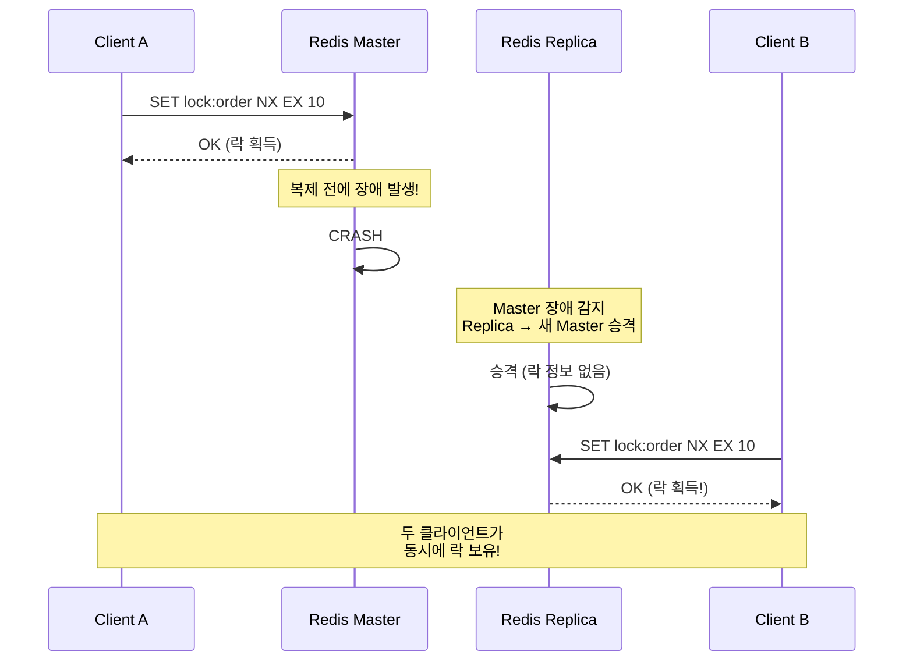
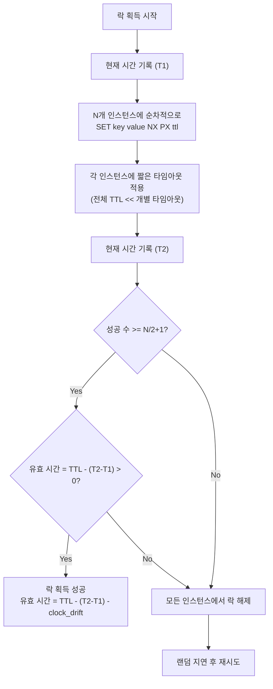

# Redlock 알고리즘과 분산 합의

단일 Redis 인스턴스 기반 분산 락은 Redis 장애 시 락 정보가 유실될 수 있다. Redlock 알고리즘은 N개의 독립 Redis 인스턴스 중 과반수(N/2+1)에 락을 획득하여 내결함성을 확보하는 분산 합의 기반 락 메커니즘이다. 이 문서에서는 Redlock의 동작 원리, Martin Kleppmann과 Antirez 간의 논쟁, 실전 적용 기준을 분석한다.

## 목차

1. [핵심 개념 (What)](#1-핵심-개념-what)
2. [왜 알아야 하는가 (Why)](#2-왜-알아야-하는가-why)
3. [내부 구현 분석 (How)](#3-내부-구현-분석-how)
4. [실전 예제](#4-실전-예제)
5. [정리](#5-정리)

---

## 1. 핵심 개념 (What)

### Redlock이란?

Redlock은 Redis 공식 문서에서 Salvatore Sanfilippo(Antirez)가 제안한 분산 락 알고리즘이다. 핵심 아이디어는 N개(권장 5개)의 독립된 Redis 인스턴스에 동시에 락 획득을 시도하고, 과반수 이상에서 성공하면 전체 락을 획득한 것으로 판단하는 것이다.

### 핵심 구성요소

| 구성요소 | 역할 |
|---------|------|
| N개의 독립 Redis 인스턴스 | 복제(Replication)가 아닌 완전히 독립적인 인스턴스 |
| 과반수 합의 (N/2+1) | 최소 과반수 노드에서 락 획득 성공 필요 |
| Clock Drift 보정 | 노드 간 시계 오차를 고려한 유효 시간 계산 |
| 유효 시간 계산 | 전체 TTL에서 락 획득에 소요된 시간을 차감 |
| 자동 릴리스 | 과반수 미달 시 이미 획득한 락을 모두 해제 |

### 단일 인스턴스 락 vs Redlock

| 항목 | 단일 인스턴스 | Redlock |
|------|-------------|---------|
| Redis 장애 시 | 락 유실 | 과반수 생존 시 정상 동작 |
| 복잡도 | 낮음 | 높음 (N개 인스턴스 관리) |
| 성능 | 빠름 (1회 네트워크 요청) | 느림 (N회 네트워크 요청) |
| 운영 비용 | 낮음 | 높음 (N개 인스턴스 운영) |
| 적합 시나리오 | 효율성(Efficiency) 목적 | 정확성(Correctness) 목적 |

## 2. 왜 알아야 하는가 (Why)

### 단일 인스턴스 락의 한계



**핵심 문제**: Redis Master-Replica 복제는 비동기다. Master에 락이 기록된 후 Replica에 복제되기 전에 Master가 장애를 일으키면, 새로 승격된 Replica에는 락 정보가 없어 다른 클라이언트가 동일 락을 획득할 수 있다.

### Redlock이 필요한 시나리오

1. **금융 거래**: 이중 결제, 이중 송금 등 절대 허용되지 않는 중복 처리 방지
2. **분산 선거**: 리더 선출 시 하나의 리더만 존재해야 하는 경우
3. **규제 준수**: 동시 처리가 법적으로 금지된 작업 (예: 동일 계좌 동시 출금)

### Redlock이 불필요한 시나리오

1. **캐시 갱신 최적화**: 중복 실행이 성능 낭비일 뿐 데이터 오류가 아닌 경우
2. **단순 멱등성 보장**: 결과가 동일한 작업의 중복 방지
3. **비용 대비 효과**: 단일 인스턴스 락으로도 충분한 정확성을 확보할 수 있는 경우

## 3. 내부 구현 분석 (How)

### 3.1 Redlock 알고리즘 상세



### 3.2 동작 과정 단계별 분석

**Step 1: 시간 기록**
```
T1 = 현재 밀리초 타임스탬프
```

**Step 2: 순차적 락 시도**
```
for each redis_instance in [Redis1, Redis2, Redis3, Redis4, Redis5]:
    result = SET lock_key random_value NX PX 30000
    timeout = 5~50ms (인스턴스당 개별 타임아웃)
```

각 인스턴스에 대한 개별 타임아웃을 짧게 설정(5~50ms)하여, 장애 인스턴스에서 오래 블로킹되는 것을 방지한다.

**Step 3: 유효성 검증**
```
T2 = 현재 밀리초 타임스탬프
elapsed = T2 - T1
clock_drift = TTL * 0.01  // 1% clock drift 보정

valid_time = TTL - elapsed - clock_drift

if (성공_수 >= 3) AND (valid_time > 0):
    락 획득 성공 (유효 시간 = valid_time)
else:
    모든 인스턴스에서 DEL lock_key 실행
```

**Step 4: 실패 시 처리**
```
랜덤 지연 (0 ~ TTL/N ms) 후 재시도
→ 여러 클라이언트가 동시에 재시도하여 분할 투표(split-brain)를 방지
```

### 3.3 Clock Drift 보정

분산 시스템에서 각 노드의 시계는 완벽히 동기화되지 않는다. Redlock은 Clock Drift를 보정하기 위해 유효 시간에서 일정 비율을 차감한다.

```
유효 시간 = TTL - (T2 - T1) - (TTL * CLOCK_DRIFT_FACTOR)

CLOCK_DRIFT_FACTOR = 0.01 (1%)

예시: TTL=30초, 락 획득 소요 시간=2초
유효 시간 = 30 - 2 - 0.3 = 27.7초
```

### 3.4 Martin Kleppmann의 비판

2016년 Martin Kleppmann은 블로그 포스트 "How to do distributed locking"에서 Redlock의 근본적 한계를 지적했다.

**비판 1: GC Pause 문제**

```
t0: Client A가 Redlock으로 락 획득 (유효 시간 30초)
t1: Client A에서 Full GC 발생 (30초 이상 정지)
t2: 락 자동 만료
t3: Client B가 동일 락 획득
t4: Client A GC 종료 → 자신이 아직 락을 보유한다고 판단
    → Client A, B 모두 임계 구역 진입
```

이 문제는 단일 인스턴스 락에서도 동일하게 발생하지만, Redlock이 이를 해결한다고 주장하는 것은 잘못된 기대라는 것이 Kleppmann의 주장이다.

**비판 2: 시계 동기화 의존성**

```
시나리오:
1. Client A가 Redis 1, 2, 3에서 락 획득 (3/5 과반수)
2. Redis 3의 시계가 앞으로 점프 → 락 조기 만료
3. Client B가 Redis 3, 4, 5에서 락 획득 (3/5 과반수)
4. Client A, B 모두 과반수 락 보유
```

**비판 3: Fencing Token 미지원**

Redlock은 단조 증가하는 Fencing Token을 생성하는 메커니즘이 없다. 따라서 스토리지 계층에서 만료된 락의 쓰기를 거부하는 안전 장치를 구현할 수 없다.

**Kleppmann의 결론**: 정확성이 중요하다면 합의 알고리즘(ZooKeeper, etcd)을 사용하고, 효율성 목적이라면 단일 인스턴스 락으로 충분하다.

### 3.5 Antirez(Salvatore Sanfilippo)의 반론

Antirez는 "Is Redlock safe?"라는 글로 반박했다.

**반론 1: GC Pause는 모든 분산 락의 공통 문제**

- GC Pause 문제는 Redlock뿐 아니라 ZooKeeper 기반 락에서도 동일하게 발생한다.
- 실제로 30초 이상의 GC Pause는 극히 드물며, 적절한 GC 튜닝으로 방지 가능하다.

**반론 2: 시계 점프 방지 가능**

- 현대 운영체제에서 NTP는 점진적 시간 조정(slew)을 사용하며, 갑작스러운 시간 점프는 설정으로 방지 가능하다.
- `ntpd`의 `-x` 옵션이나 `chrony`의 `makestep` 제한으로 시계 점프를 막을 수 있다.

**반론 3: Redlock은 중간 수준의 안전성 제공**

- ZooKeeper만큼 강하지 않지만, 단일 인스턴스보다 확실히 안전하다.
- 대부분의 실무 시나리오에서 충분한 수준의 안전성을 제공한다.

### 3.6 Redlock vs 대안 기술 비교

| 항목 | 단일 Redis | Redlock | ZooKeeper | etcd |
|------|-----------|---------|-----------|------|
| 합의 알고리즘 | 없음 | 과반수 투표 | ZAB | Raft |
| 장애 내성 | 없음 | N/2-1개 장애 | N/2-1개 장애 | N/2-1개 장애 |
| 정확성 보장 | 약함 | 중간 | 강함 | 강함 |
| 성능 | 매우 빠름 | 빠름 | 보통 | 보통 |
| 운영 복잡도 | 낮음 | 중간 | 높음 | 중간 |
| Fencing Token | 직접 구현 | 직접 구현 | 내장 (zxid) | 내장 (revision) |

## 4. 실전 예제

### 4.1 Redisson RedissonMultiLock을 활용한 Redlock 구현

Redisson 3.x에서 `RedissonRedLock`은 deprecated되었으며, `RedissonMultiLock`으로 대체되었다.

```java
@Configuration
public class RedlockConfig {

    @Bean("redissonClient1")
    public RedissonClient redissonClient1() {
        Config config = new Config();
        config.useSingleServer()
            .setAddress("redis://redis-node-1:6379")
            .setConnectionPoolSize(5)
            .setConnectionMinimumIdleSize(2)
            .setTimeout(3000)
            .setRetryAttempts(1);
        return Redisson.create(config);
    }

    @Bean("redissonClient2")
    public RedissonClient redissonClient2() {
        Config config = new Config();
        config.useSingleServer()
            .setAddress("redis://redis-node-2:6379")
            .setConnectionPoolSize(5)
            .setConnectionMinimumIdleSize(2)
            .setTimeout(3000)
            .setRetryAttempts(1);
        return Redisson.create(config);
    }

    @Bean("redissonClient3")
    public RedissonClient redissonClient3() {
        Config config = new Config();
        config.useSingleServer()
            .setAddress("redis://redis-node-3:6379")
            .setConnectionPoolSize(5)
            .setConnectionMinimumIdleSize(2)
            .setTimeout(3000)
            .setRetryAttempts(1);
        return Redisson.create(config);
    }

    @Bean("redissonClient4")
    public RedissonClient redissonClient4() {
        Config config = new Config();
        config.useSingleServer()
            .setAddress("redis://redis-node-4:6379")
            .setConnectionPoolSize(5)
            .setConnectionMinimumIdleSize(2)
            .setTimeout(3000)
            .setRetryAttempts(1);
        return Redisson.create(config);
    }

    @Bean("redissonClient5")
    public RedissonClient redissonClient5() {
        Config config = new Config();
        config.useSingleServer()
            .setAddress("redis://redis-node-5:6379")
            .setConnectionPoolSize(5)
            .setConnectionMinimumIdleSize(2)
            .setTimeout(3000)
            .setRetryAttempts(1);
        return Redisson.create(config);
    }
}
```

```java
@Service
@Slf4j
public class RedlockService {

    private final List<RedissonClient> redissonClients;

    public RedlockService(
            @Qualifier("redissonClient1") RedissonClient client1,
            @Qualifier("redissonClient2") RedissonClient client2,
            @Qualifier("redissonClient3") RedissonClient client3,
            @Qualifier("redissonClient4") RedissonClient client4,
            @Qualifier("redissonClient5") RedissonClient client5) {
        this.redissonClients = List.of(client1, client2, client3, client4, client5);
    }

    public <T> T executeWithRedlock(String lockKey, long waitTime,
                                     long leaseTime, Callable<T> task) {
        RLock[] locks = redissonClients.stream()
            .map(client -> client.getLock(lockKey))
            .toArray(RLock[]::new);

        RedissonMultiLock multiLock = new RedissonMultiLock(locks);

        try {
            boolean acquired = multiLock.tryLock(waitTime, leaseTime, TimeUnit.SECONDS);

            if (!acquired) {
                throw new LockAcquisitionException(
                    "Redlock 획득 실패: key=" + lockKey);
            }

            log.info("Redlock 획득 성공: key={}, instances={}", lockKey, locks.length);
            return task.call();

        } catch (InterruptedException e) {
            Thread.currentThread().interrupt();
            throw new RuntimeException("Redlock 획득 중 인터럽트", e);
        } catch (Exception e) {
            throw new RuntimeException("작업 실행 실패", e);
        } finally {
            try {
                multiLock.unlock();
                log.info("Redlock 해제: key={}", lockKey);
            } catch (Exception e) {
                log.warn("Redlock 해제 실패: key={}", lockKey, e);
            }
        }
    }
}
```

### 4.2 Redlock 모니터링

```java
@Component
@RequiredArgsConstructor
@Slf4j
public class RedlockHealthIndicator implements HealthIndicator {

    private final List<RedissonClient> redissonClients;

    @Override
    public Health health() {
        int aliveCount = 0;
        int totalCount = redissonClients.size();
        Map<String, String> details = new LinkedHashMap<>();

        for (int i = 0; i < totalCount; i++) {
            RedissonClient client = redissonClients.get(i);
            String nodeKey = "redis-node-" + (i + 1);
            try {
                client.getBucket("health-check").get();
                details.put(nodeKey, "UP");
                aliveCount++;
            } catch (Exception e) {
                details.put(nodeKey, "DOWN: " + e.getMessage());
            }
        }

        int quorum = totalCount / 2 + 1;
        details.put("alive", aliveCount + "/" + totalCount);
        details.put("quorum", String.valueOf(quorum));

        if (aliveCount >= quorum) {
            return Health.up().withDetails(details).build();
        } else {
            return Health.down()
                .withDetail("reason", "과반수 미달: " + aliveCount + " < " + quorum)
                .withDetails(details)
                .build();
        }
    }
}
```

### 4.3 Redlock vs 단일 인스턴스 선택 가이드

```java
/**
 * 프로젝트 요구사항에 따른 락 전략 팩토리
 */
@Component
@RequiredArgsConstructor
public class DistributedLockFactory {

    private final RedissonClient singleClient;
    private final RedlockService redlockService;

    /**
     * 효율성(Efficiency) 목적: 중복 작업 방지
     * → 단일 인스턴스 락으로 충분
     */
    public RLock createEfficiencyLock(String key) {
        return singleClient.getLock("eff:" + key);
    }

    /**
     * 정확성(Correctness) 목적: 데이터 정합성 필수
     * → Redlock 사용
     */
    public <T> T executeWithCorrectnessLock(String key, Callable<T> task) {
        return redlockService.executeWithRedlock(
            "cor:" + key, 5, 30, task);
    }
}
```

## 5. 정리

| 항목 | 설명 |
|-----|------|
| Redlock 핵심 | N개 독립 인스턴스 중 과반수(N/2+1)에 락 획득 시 전체 락 성공 |
| 유효 시간 | TTL - 락 획득 소요 시간 - Clock Drift 보정값 |
| Kleppmann 비판 | GC Pause, 시계 점프, Fencing Token 부재로 안전성 불완전 |
| Antirez 반론 | 현실적으로 시계 점프 방지 가능, 대부분 시나리오에서 충분한 안전성 |
| 적용 기준 | 효율성 목적이면 단일 인스턴스, 정확성 목적이면 Redlock 또는 ZooKeeper |
| RedissonMultiLock | Redisson 3.x에서 RedissonRedLock 대체, 과반수 기반 분산 락 |
| 모니터링 | 과반수(quorum) 이상 노드가 살아 있는지 상시 모니터링 필수 |
| 대안 | ZooKeeper(ZAB), etcd(Raft)는 합의 알고리즘 내장으로 더 강한 정확성 보장 |

---
*참고: Redis 7.x / Redisson 3.x 기준*
