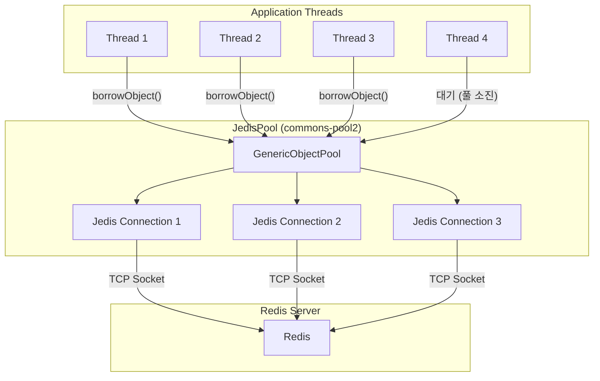
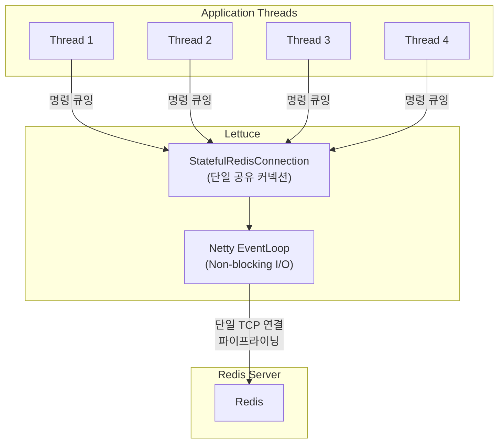
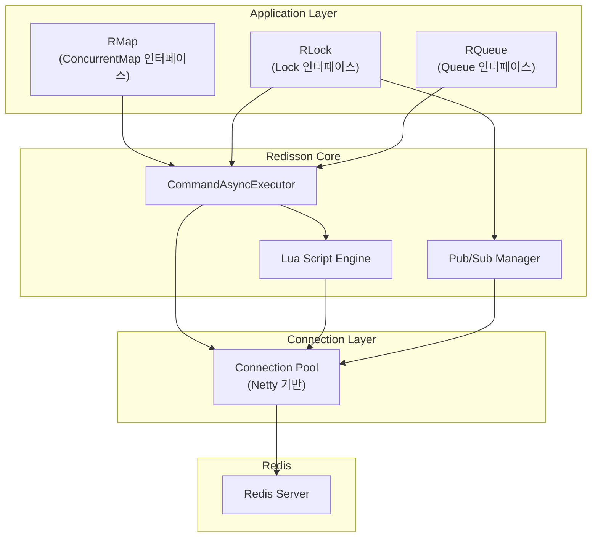

# Java Redis 클라이언트 비교

Java 애플리케이션에서 Redis를 사용할 때 선택할 수 있는 주요 클라이언트 라이브러리인 Jedis, Lettuce, Redisson의 아키텍처, 커넥션 관리 방식, 스레드 모델, 성능 특성을 분석하고 프로젝트 요구사항에 따른 선택 가이드를 제시한다.

## 목차

1. [핵심 개념 (What)](#1-핵심-개념-what)
2. [왜 알아야 하는가 (Why)](#2-왜-알아야-하는가-why)
3. [내부 구현 분석 (How)](#3-내부-구현-분석-how)
4. [실전 예제](#4-실전-예제)
5. [정리](#5-정리)

---

## 1. 핵심 개념 (What)

### Java Redis 클라이언트 개요

| 클라이언트 | I/O 모델 | 커넥션 관리 | 추상화 수준 | Spring Boot 기본 |
|-----------|----------|------------|------------|-----------------|
| **Jedis** | 동기 블로킹 | 커넥션 풀 (JedisPool) | 낮음 (Redis 명령 1:1 대응) | 아니오 (2.0 이전 기본) |
| **Lettuce** | 비동기/리액티브 (Netty) | 단일 연결 다중화 | 중간 | 예 (2.0부터 기본) |
| **Redisson** | 비동기 (Netty) | 커넥션 풀 | 높음 (분산 자료구조) | 아니오 (별도 starter) |

### 핵심 차이점 요약

| 항목 | Jedis | Lettuce | Redisson |
|------|-------|---------|----------|
| 스레드 안전성 | 인스턴스 비안전 (풀 필요) | 안전 (공유 가능) | 안전 (내부 풀) |
| 동기 API | O | O | O |
| 비동기 API | X | O (CompletableFuture) | O (RFuture) |
| 리액티브 API | X | O (Reactor/RxJava) | O (Reactor) |
| 분산 자료구조 | X | X | O |
| 분산 락 | X (직접 구현) | X (직접 구현) | O (RLock 내장) |

## 2. 왜 알아야 하는가 (Why)

### 실무에서 만나는 상황

1. **Spring Boot 기본 클라이언트 이해**: Spring Boot 2.0부터 기본 Redis 클라이언트가 Jedis에서 Lettuce로 변경되었다. 변경 이유를 이해하면 프로젝트에 맞는 클라이언트를 선택할 수 있다.

2. **커넥션 부족 장애 대응**: Jedis를 사용하면서 커넥션 풀 고갈로 장애가 발생하는 경우가 많다. 클라이언트별 커넥션 관리 방식을 이해하면 적절한 설정이 가능하다.

3. **성능 최적화**: 높은 처리량이 필요한 시스템에서 동기 블로킹 I/O의 한계를 알고, 비동기 클라이언트로 전환해야 하는 시점을 판단할 수 있다.

4. **분산 락/자료구조 필요성**: 프로젝트에서 분산 락이나 분산 자료구조가 필요할 때, Redisson을 도입할지 Lettuce 위에 직접 구현할지 판단해야 한다.

### Spring Boot가 Lettuce로 변경한 이유

```
Spring Boot 1.x: Jedis (기본)
Spring Boot 2.0+: Lettuce (기본)

변경 이유:
1. Jedis는 스레드 안전하지 않아 커넥션 풀이 필수 → 리소스 낭비
2. Lettuce는 Netty 기반으로 단일 커넥션을 여러 스레드가 공유 가능
3. Lettuce는 비동기/리액티브 API를 기본 지원 (WebFlux 호환)
4. Lettuce는 Redis Cluster 자동 재연결을 기본 지원
```

## 3. 내부 구현 분석 (How)

### 3.1 Jedis: 동기 블로킹 아키텍처



**특징**:
- 각 스레드가 풀에서 커넥션을 빌려 사용 후 반환
- 커넥션 수 = 동시 처리 가능한 스레드 수
- 풀이 소진되면 대기 또는 예외 발생
- Redis 명령과 1:1 대응되는 직관적 API

**JedisPool 주요 설정**:

```java
JedisPoolConfig config = new JedisPoolConfig();
config.setMaxTotal(128);        // 최대 커넥션 수
config.setMaxIdle(128);         // 최대 유휴 커넥션 수
config.setMinIdle(16);          // 최소 유휴 커넥션 수
config.setMaxWaitMillis(3000);  // 커넥션 대기 최대 시간
config.setTestOnBorrow(true);   // 커넥션 유효성 검사

JedisPool pool = new JedisPool(config, "localhost", 6379);
```

### 3.2 Lettuce: Netty 기반 비동기 아키텍처



**특징**:
- 단일 커넥션을 여러 스레드가 공유 (Redis는 단일 스레드로 명령 처리)
- Netty의 EventLoop가 Non-blocking I/O로 명령을 전송/수신
- 자동 파이프라이닝으로 여러 명령을 하나의 TCP 패킷에 묶어 전송
- 동기, 비동기(CompletableFuture), 리액티브(Mono/Flux) 세 가지 API 제공

**Lettuce 커넥션 공유 원리**:

```
Redis 프로토콜은 Request-Response 기반이 아닌 파이프라이닝을 지원한다.
클라이언트가 응답을 기다리지 않고 여러 명령을 연속 전송 가능하다.

Thread 1: SET key1 value1 →
Thread 2: GET key2        →   [단일 TCP 연결]   → Redis
Thread 3: INCR counter    →

Redis 응답 순서는 요청 순서와 동일하므로,
Lettuce가 내부적으로 응답을 올바른 요청에 매핑한다.
```

### 3.3 Redisson: 고수준 추상화 아키텍처



**특징**:
- Java 표준 인터페이스(`Map`, `Lock`, `Queue` 등) 구현체를 Redis 위에 제공
- 내부적으로 Lua 스크립트를 사용하여 복잡한 연산의 원자성 보장
- Pub/Sub 기반 이벤트 처리 (락 대기, 토픽 메시지 등)
- Netty 기반 커넥션 풀 관리

### 3.4 커넥션 풀 설정 비교

| 설정 항목 | Jedis (commons-pool2) | Lettuce | Redisson |
|----------|----------------------|---------|----------|
| 최대 커넥션 | `maxTotal` | 단일 연결 (풀 옵션) | `connectionPoolSize` |
| 최소 유휴 | `minIdle` | N/A | `connectionMinimumIdleSize` |
| 풀 라이브러리 | Apache Commons Pool 2 | 자체 (선택적) | Netty 내장 |
| 기본 동작 | 풀 필수 | 풀 불필요 (선택) | 내부 풀 자동 관리 |

**Lettuce 커넥션 풀 (선택적)**:

```java
// Lettuce에서 커넥션 풀이 필요한 경우 (트랜잭션, 블로킹 명령 등)
GenericObjectPoolConfig<StatefulRedisConnection<String, String>> poolConfig =
    new GenericObjectPoolConfig<>();
poolConfig.setMaxTotal(20);
poolConfig.setMaxIdle(10);
poolConfig.setMinIdle(5);

GenericObjectPool<StatefulRedisConnection<String, String>> pool =
    ConnectionPoolSupport.createGenericObjectPool(
        () -> redisClient.connect(), poolConfig);
```

### 3.5 Cluster/Sentinel 지원 비교

| 기능 | Jedis | Lettuce | Redisson |
|------|-------|---------|----------|
| Cluster 자동 검색 | O | O | O |
| Cluster 자동 리디렉션 | O | O | O |
| Cluster 재연결 | 수동 | 자동 | 자동 |
| Sentinel 페일오버 | O | O | O |
| Read from Replica | `JedisCluster` | `ReadFrom` 설정 | `readMode` 설정 |
| 토폴로지 자동 갱신 | X | O (`PeriodicTopologyRefresh`) | O |

**Lettuce Cluster 설정 예시**:

```java
RedisClusterClient clusterClient = RedisClusterClient.create(
    RedisURI.create("redis://cluster-node-1:6379"));

// 토폴로지 자동 갱신 설정
ClusterTopologyRefreshOptions topologyRefresh = ClusterTopologyRefreshOptions.builder()
    .enablePeriodicRefresh(Duration.ofMinutes(1))
    .enableAllAdaptiveRefreshTriggers()
    .build();

clusterClient.setOptions(ClusterClientOptions.builder()
    .topologyRefreshOptions(topologyRefresh)
    .build());

// Replica에서 읽기
StatefulRedisClusterConnection<String, String> connection = clusterClient.connect();
connection.setReadFrom(ReadFrom.REPLICA_PREFERRED);
```

### 3.6 성능 특성 비교

| 시나리오 | Jedis | Lettuce | Redisson |
|---------|-------|---------|----------|
| 단순 GET/SET | 빠름 | 매우 빠름 | 빠름 |
| 높은 동시성 (1000+ 스레드) | 커넥션 풀 한계 | 우수 (단일 연결 공유) | 우수 (내부 풀) |
| 대량 파이프라이닝 | 수동 구현 | 자동 파이프라이닝 | 자동 배치 |
| 분산 락 | 직접 구현 (비효율) | 직접 구현 (비효율) | 최적화된 내장 구현 |
| 메모리 사용량 | 낮음 | 중간 (Netty 버퍼) | 높음 (추상화 레이어) |
| JAR 크기 | ~500KB | ~1.5MB (Netty 포함) | ~5MB |

## 4. 실전 예제

### 4.1 Spring Boot에서 Jedis 설정

```xml
<dependency>
    <groupId>org.springframework.boot</groupId>
    <artifactId>spring-boot-starter-data-redis</artifactId>
    <exclusions>
        <exclusion>
            <groupId>io.lettuce</groupId>
            <artifactId>lettuce-core</artifactId>
        </exclusion>
    </exclusions>
</dependency>
<dependency>
    <groupId>redis.clients</groupId>
    <artifactId>jedis</artifactId>
</dependency>
```

```yaml
# application.yml
spring:
  data:
    redis:
      host: localhost
      port: 6379
      jedis:
        pool:
          max-active: 128
          max-idle: 128
          min-idle: 16
          max-wait: 3000ms
```

```java
@Configuration
public class JedisConfig {

    @Bean
    public RedisConnectionFactory redisConnectionFactory() {
        RedisStandaloneConfiguration config =
            new RedisStandaloneConfiguration("localhost", 6379);

        JedisPoolConfig poolConfig = new JedisPoolConfig();
        poolConfig.setMaxTotal(128);
        poolConfig.setMaxIdle(128);
        poolConfig.setMinIdle(16);
        poolConfig.setMaxWaitMillis(3000);
        poolConfig.setTestOnBorrow(true);
        poolConfig.setTestWhileIdle(true);
        poolConfig.setTimeBetweenEvictionRunsMillis(30000);

        JedisClientConfiguration clientConfig = JedisClientConfiguration.builder()
            .usePooling().poolConfig(poolConfig).and()
            .readTimeout(Duration.ofMillis(3000))
            .connectTimeout(Duration.ofMillis(3000))
            .build();

        return new JedisConnectionFactory(config, clientConfig);
    }
}
```

### 4.2 Spring Boot에서 Lettuce 설정 (기본)

```yaml
# application.yml - Lettuce는 Spring Boot 기본이므로 별도 설정 최소화
spring:
  data:
    redis:
      host: localhost
      port: 6379
      timeout: 3000ms
      lettuce:
        pool:
          enabled: true         # commons-pool2 의존성 필요 시
          max-active: 20
          max-idle: 10
          min-idle: 5
          max-wait: 3000ms
```

```java
@Configuration
public class LettuceConfig {

    @Bean
    public LettuceClientConfigurationBuilderCustomizer lettuceCustomizer() {
        return builder -> builder
            .readFrom(ReadFrom.REPLICA_PREFERRED)
            .clientOptions(ClientOptions.builder()
                .autoReconnect(true)
                .disconnectedBehavior(
                    ClientOptions.DisconnectedBehavior.REJECT_COMMANDS)
                .timeoutOptions(TimeoutOptions.builder()
                    .fixedTimeout(Duration.ofSeconds(3))
                    .build())
                .build());
    }

    @Bean
    public RedisTemplate<String, Object> redisTemplate(
            RedisConnectionFactory connectionFactory) {
        RedisTemplate<String, Object> template = new RedisTemplate<>();
        template.setConnectionFactory(connectionFactory);
        template.setKeySerializer(new StringRedisSerializer());
        template.setValueSerializer(new GenericJackson2JsonRedisSerializer());
        template.setHashKeySerializer(new StringRedisSerializer());
        template.setHashValueSerializer(new GenericJackson2JsonRedisSerializer());
        return template;
    }
}
```

### 4.3 프로젝트 요구사항별 클라이언트 선택 가이드

```java
/**
 * 클라이언트 선택 의사결정 트리
 */
public class RedisClientDecisionGuide {

    /*
     * Q1: 분산 락, 분산 자료구조가 필요한가?
     *   → Yes: Redisson 선택
     *   → No: Q2로
     *
     * Q2: WebFlux/리액티브 스택을 사용하는가?
     *   → Yes: Lettuce 선택 (리액티브 API 필수)
     *   → No: Q3으로
     *
     * Q3: 높은 동시성(수천 이상 동시 요청)이 필요한가?
     *   → Yes: Lettuce 선택 (커넥션 효율성)
     *   → No: Q4로
     *
     * Q4: 레거시 시스템 호환성이 필요한가?
     *   → Yes: Jedis 선택 (단순한 API)
     *   → No: Lettuce 선택 (Spring Boot 기본, 범용적)
     */
}
```

**시나리오별 권장 클라이언트**:

| 시나리오 | 권장 클라이언트 | 이유 |
|---------|--------------|------|
| Spring Boot + 단순 캐시 | Lettuce | 기본 클라이언트, 설정 최소화 |
| Spring WebFlux + Redis | Lettuce | 리액티브 API 필수 |
| 분산 락 + 동시성 제어 | Redisson | RLock, Pub/Sub 대기 내장 |
| 마이크로서비스 분산 자료구조 | Redisson | RMap, RQueue 등 Java 인터페이스 구현 |
| 높은 처리량 + 낮은 지연 | Lettuce | 단일 연결 다중화, 자동 파이프라이닝 |
| 레거시 마이그레이션 | Jedis | Redis 명령 1:1 대응, 학습 곡선 낮음 |
| Lettuce + 분산 락 조합 | Lettuce + Redisson 병용 | 각각의 장점 활용 |

### 4.4 Lettuce와 Redisson 병용 구성

```java
@Configuration
public class DualClientConfig {

    /**
     * 기본 캐시/데이터 조회: Lettuce (Spring Data Redis 기본)
     */
    @Bean
    public RedisConnectionFactory redisConnectionFactory() {
        LettuceConnectionFactory factory =
            new LettuceConnectionFactory("localhost", 6379);
        return factory;
    }

    @Bean
    public StringRedisTemplate stringRedisTemplate(
            RedisConnectionFactory connectionFactory) {
        return new StringRedisTemplate(connectionFactory);
    }

    /**
     * 분산 락/자료구조: Redisson
     */
    @Bean
    public RedissonClient redissonClient() {
        Config config = new Config();
        config.useSingleServer()
            .setAddress("redis://localhost:6379")
            .setConnectionPoolSize(10)
            .setConnectionMinimumIdleSize(5);
        return Redisson.create(config);
    }
}
```

```java
@Service
@RequiredArgsConstructor
public class ProductService {

    // 캐시 조회: Lettuce (비동기, 높은 처리량)
    private final StringRedisTemplate redisTemplate;

    // 분산 락: Redisson (Pub/Sub 대기, Watchdog)
    private final RedissonClient redissonClient;

    public Product getProduct(Long productId) {
        // Lettuce로 캐시 조회
        String cached = redisTemplate.opsForValue().get("product:" + productId);
        if (cached != null) {
            return objectMapper.readValue(cached, Product.class);
        }
        // 캐시 미스 시 DB 조회 후 캐시 저장
        return loadAndCache(productId);
    }

    public void decreaseStock(Long productId, int quantity) {
        // Redisson으로 분산 락
        RLock lock = redissonClient.getLock("lock:stock:" + productId);
        try {
            lock.lock();
            // 비즈니스 로직
        } finally {
            lock.unlock();
        }
    }
}
```

## 5. 정리

| 항목 | 설명 |
|-----|------|
| Jedis | 동기 블로킹, 커넥션 풀 필수, Redis 명령 1:1 대응, 가장 단순 |
| Lettuce | Netty 비동기, 단일 연결 다중화, Spring Boot 2.0+ 기본 클라이언트 |
| Redisson | 고수준 추상화, 분산 자료구조/락 내장, Lua 스크립트 기반 원자적 연산 |
| Spring Boot 기본 변경 이유 | Jedis의 스레드 비안전성과 커넥션 풀 한계 → Lettuce의 공유 커넥션 모델 |
| 커넥션 관리 | Jedis: commons-pool2, Lettuce: 단일 연결(선택적 풀), Redisson: 내부 Netty 풀 |
| Cluster 지원 | 세 라이브러리 모두 지원, Lettuce/Redisson은 자동 토폴로지 갱신 제공 |
| 병용 구성 | 캐시/조회는 Lettuce, 분산 락/자료구조는 Redisson 조합이 실무에서 일반적 |
| 선택 기준 | 분산 락 필요 → Redisson, 리액티브 → Lettuce, 단순/레거시 → Jedis |

---
*참고: Jedis 5.x / Lettuce 6.x / Redisson 3.x 기준*
