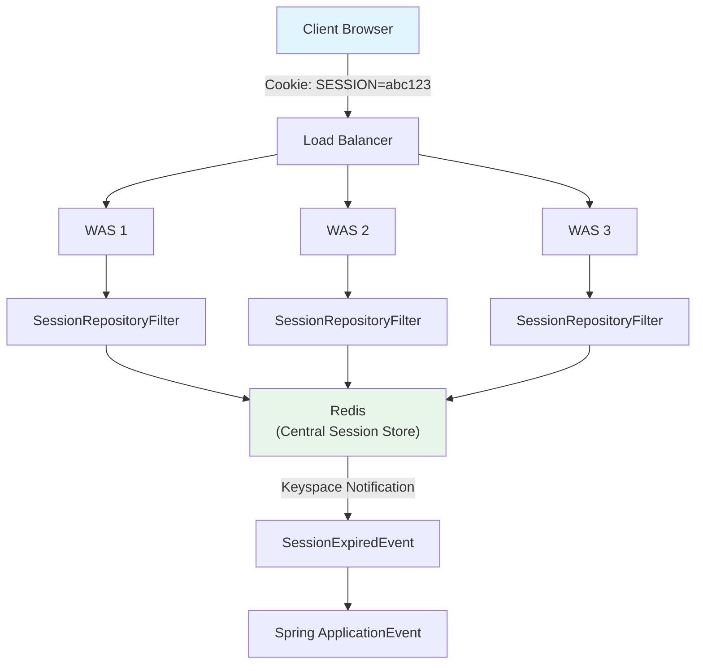

# 세션 관리와 보안: Redis 기반 중앙 집중식 세션과 보안 전략

분산 환경에서 HTTP 세션의 한계를 Spring Session + Redis로 해결하고, Redis 자체의 보안(AUTH, ACL, TLS)과 네트워크 보안 설정을 통해 운영 환경에서 안전한 세션 관리 시스템을 구축하는 방법을 분석한다.

## 목차

1. [핵심 개념 (What)](#1-핵심-개념-what)
2. [왜 알아야 하는가 (Why)](#2-왜-알아야-하는가-why)
3. [내부 구현 분석 (How)](#3-내부-구현-분석-how)
4. [실전 예제](#4-실전-예제)
5. [정리](#5-정리)

---

## 1. 핵심 개념 (What)

### HTTP 세션의 한계

다중 서버 환경에서 전통적인 서버 메모리 기반 HTTP 세션은 근본적인 문제를 갖고 있다. Sticky Session은 특정 서버에 장애가 발생하면 해당 서버의 모든 세션이 유실되고, Session Replication은 서버 수가 늘어날수록 네트워크 오버헤드가 기하급수적으로 증가한다.

### Spring Session + Redis 핵심 구성요소

| 구성요소 | 역할 |
|---------|------|
| `spring-session-data-redis` | Spring Session의 Redis 백엔드 구현 모듈 |
| `RedisSessionRepository` | Redis에 세션을 저장/조회/삭제하는 핵심 Repository |
| `SessionRepositoryFilter` | 서블릿 필터로 `HttpSession`을 Redis 기반 세션으로 교체 |
| `@EnableRedisHttpSession` | Redis 세션 자동 구성을 활성화하는 어노테이션 |
| Keyspace Notification | 세션 만료 이벤트를 Redis가 자동 발행하는 메커니즘 |

### Redis 보안 구성요소

| 구성요소 | 역할 |
|---------|------|
| AUTH (requirepass) | 단일 비밀번호 기반 인증 (Redis 5 이하) |
| ACL (Access Control List) | 사용자별 명령어/키 접근 제어 (Redis 6+) |
| TLS/SSL | 클라이언트-서버 간 암호화 통신 |
| `bind` / `protected-mode` | 네트워크 수준 접근 제한 |
| `rename-command` | 위험 명령어 비활성화 |

## 2. 왜 알아야 하는가 (Why)

### 실무에서 만나는 상황

1. **스케일 아웃 환경**: 로드밸런서 뒤에 여러 WAS를 배치하면, 사용자가 다른 서버로 라우팅될 때 세션이 유실된다. Sticky Session은 서버 장애 시 세션 전체를 잃게 되어 가용성이 떨어진다.
2. **세션 복제 비용**: Tomcat Session Replication이나 Hazelcast를 사용하면 서버 수(N)에 비례하여 O(N^2) 네트워크 통신이 발생하고, 메모리 사용량이 N배로 증가한다.
3. **보안 사고 대응**: Redis가 인터넷에 노출된 상태에서 인증 없이 운영하면 데이터 탈취, 랜섬웨어 감염, 크립토마이너 설치 등의 공격에 노출된다.
4. **동시 로그인 제어**: 한 계정으로 여러 디바이스에서 동시 로그인하는 것을 제한하려면 세션 저장소를 중앙에서 관리해야 한다.

## 3. 내부 구현 분석 (How)

### 3.1 Spring Session + Redis 아키텍처



어떤 WAS로 요청이 라우팅되든 동일한 Redis에서 세션을 조회하므로 Sticky Session이 불필요하다.

### 3.2 spring-session-data-redis 자동 구성

Spring Boot 3.x에서 의존성만 추가하면 자동 구성이 동작한다.

```groovy
// build.gradle
dependencies {
    implementation 'org.springframework.boot:spring-boot-starter-data-redis'
    implementation 'org.springframework.session:spring-session-data-redis'
}
```

```yaml
# application.yml
spring:
  data:
    redis:
      host: redis-cluster.internal
      port: 6379
      password: ${REDIS_PASSWORD}
  session:
    store-type: redis
    redis:
      namespace: myapp:session
      flush-mode: on-save        # IMMEDIATE 또는 ON_SAVE
      repository-type: default   # default 또는 indexed
    timeout: 30m
```

### 3.3 세션 저장 구조와 직렬화

Redis에 저장되는 세션 데이터 구조:

```
# Hash 구조
myapp:session:sessions:<sessionId>
  "creationTime"       -> "1708012800000"
  "lastAccessedTime"   -> "1708013400000"
  "maxInactiveInterval" -> "1800"
  "sessionAttr:username" -> (직렬화된 바이트)
  "sessionAttr:SPRING_SECURITY_CONTEXT" -> (직렬화된 바이트)

# 만료 관리용 키 (Indexed Repository 사용 시)
myapp:session:expirations:<roundedTimestamp>
  -> Set of sessionIds
```

기본 직렬화는 JDK Serialization이지만, 보안과 호환성을 위해 JSON 직렬화를 권장한다:

```java
@Configuration
@EnableRedisHttpSession
public class SessionConfig {

    @Bean
    public RedisSerializer<Object> springSessionDefaultRedisSerializer() {
        ObjectMapper mapper = new ObjectMapper();
        mapper.activateDefaultTyping(
            mapper.getPolymorphicTypeValidator(),
            ObjectMapper.DefaultTyping.NON_FINAL,
            JsonTypeInfo.As.PROPERTY
        );
        mapper.registerModule(new JavaTimeModule());
        return new GenericJackson2JsonRedisSerializer(mapper);
    }
}
```

### 3.4 세션 만료 처리: Keyspace Notification

Redis의 Keyspace Notification을 활용하여 세션 만료 이벤트를 감지한다.

```bash
# Redis 설정에서 Keyspace Notification 활성화
# redis.conf
notify-keyspace-events Egx
```

Spring Session은 `__keyevent@*__:expired`와 `__keyevent@*__:del` 채널을 구독하여 세션 만료를 감지하고, `SessionExpiredEvent`를 발행한다.

### 3.5 동시 세션 제어

Spring Security와 연동하여 최대 동시 세션 수를 제한할 수 있다:

```java
@Configuration
@EnableWebSecurity
public class SecurityConfig {

    @Bean
    public SecurityFilterChain filterChain(HttpSecurity http) throws Exception {
        http
            .sessionManagement(session -> session
                .maximumSessions(1)                    // 최대 1개 세션
                .maxSessionsPreventsLogin(false)       // 새 로그인 시 기존 세션 만료
                .sessionRegistry(sessionRegistry())
            );
        return http.build();
    }

    @Bean
    public SpringSessionBackedSessionRegistry<?> sessionRegistry(
            FindByIndexNameSessionRepository<?> sessionRepository) {
        return new SpringSessionBackedSessionRegistry<>(sessionRepository);
    }
}
```

### 3.6 Redis 보안 설정

#### AUTH와 ACL

```bash
# Redis 6+ ACL 설정
# redis.conf 또는 ACL 파일

# 관리자 계정
user admin on >strongPassword ~* &* +@all

# 애플리케이션 전용 계정 (세션 관련 키만 접근, 위험 명령 차단)
user session-app on >appSecret ~myapp:session:* &* +@read +@write +@connection -@admin -FLUSHALL -FLUSHDB -KEYS -CONFIG

# 기본 사용자 비활성화
user default off
```

#### TLS 암호화

```bash
# redis.conf - TLS 설정
tls-port 6380
port 0                          # 비암호화 포트 비활성화
tls-cert-file /etc/redis/tls/redis.crt
tls-key-file /etc/redis/tls/redis.key
tls-ca-cert-file /etc/redis/tls/ca.crt
tls-auth-clients optional      # 클라이언트 인증서 요구 여부
```

#### 네트워크 보안

```bash
# redis.conf
bind 10.0.1.0                  # 내부 네트워크 인터페이스만 바인딩
protected-mode yes              # 외부 접속 차단
rename-command FLUSHALL ""      # 위험 명령 비활성화
rename-command FLUSHDB ""
rename-command CONFIG "CONFIG_b840fc02d524045429941cc15f59e41cb7be6c52"
```

## 4. 실전 예제

### 4.1 Spring Security + Redis 세션 기반 인증 구현

```java
@Configuration
@EnableWebSecurity
@EnableRedisIndexedHttpSession(
    maxInactiveIntervalInSeconds = 1800,
    redisNamespace = "myapp:session"
)
public class SecuritySessionConfig {

    @Bean
    public SecurityFilterChain filterChain(HttpSecurity http) throws Exception {
        http
            .authorizeHttpRequests(auth -> auth
                .requestMatchers("/api/auth/**").permitAll()
                .requestMatchers("/api/admin/**").hasRole("ADMIN")
                .anyRequest().authenticated()
            )
            .sessionManagement(session -> session
                .sessionCreationPolicy(SessionCreationPolicy.IF_REQUIRED)
                .maximumSessions(2)
                .maxSessionsPreventsLogin(false)
                .expiredUrl("/api/auth/session-expired")
            )
            .csrf(csrf -> csrf
                .csrfTokenRepository(CookieCsrfTokenRepository.withHttpOnlyFalse())
            )
            .logout(logout -> logout
                .logoutUrl("/api/auth/logout")
                .deleteCookies("SESSION")
                .invalidateHttpSession(true)
            );
        return http.build();
    }
}
```

```java
@RestController
@RequestMapping("/api/auth")
@RequiredArgsConstructor
public class AuthController {

    private final AuthenticationManager authenticationManager;
    private final FindByIndexNameSessionRepository<? extends Session> sessionRepository;

    @PostMapping("/login")
    public ResponseEntity<LoginResponse> login(
            @RequestBody LoginRequest request,
            HttpSession session) {

        Authentication authentication = authenticationManager.authenticate(
            new UsernamePasswordAuthenticationToken(
                request.username(), request.password())
        );
        SecurityContextHolder.getContext().setAuthentication(authentication);

        // 세션에 사용자 정보 저장
        session.setAttribute(
            FindByIndexNameSessionRepository.PRINCIPAL_NAME_INDEX_NAME,
            request.username()
        );

        return ResponseEntity.ok(new LoginResponse(
            session.getId(),
            authentication.getName(),
            session.getMaxInactiveInterval()
        ));
    }

    @GetMapping("/sessions")
    public ResponseEntity<Map<String, ? extends Session>> getActiveSessions(
            @AuthenticationPrincipal UserDetails user) {
        // 현재 사용자의 모든 활성 세션 조회
        Map<String, ? extends Session> sessions =
            sessionRepository.findByPrincipalName(user.getUsername());
        return ResponseEntity.ok(sessions);
    }

    @DeleteMapping("/sessions/{sessionId}")
    public ResponseEntity<Void> invalidateSession(@PathVariable String sessionId) {
        sessionRepository.deleteById(sessionId);
        return ResponseEntity.noContent().build();
    }
}
```

### 4.2 세션 이벤트 리스너와 감사 로그

```java
@Component
@Slf4j
public class SessionEventListener {

    @EventListener
    public void onSessionCreated(SessionCreatedEvent event) {
        log.info("세션 생성: sessionId={}", event.getSessionId());
    }

    @EventListener
    public void onSessionExpired(SessionExpiredEvent event) {
        Session session = event.getSession();
        String username = session.getAttribute(
            FindByIndexNameSessionRepository.PRINCIPAL_NAME_INDEX_NAME
        );
        log.warn("세션 만료: sessionId={}, user={}", event.getSessionId(), username);
    }

    @EventListener
    public void onSessionDeleted(SessionDeletedEvent event) {
        log.info("세션 삭제(로그아웃): sessionId={}", event.getSessionId());
    }
}
```

### 4.3 Redis TLS 연결 설정 (Spring Boot)

```yaml
# application-prod.yml
spring:
  data:
    redis:
      host: redis-secure.internal
      port: 6380
      password: ${REDIS_PASSWORD}
      username: session-app
      ssl:
        enabled: true
      lettuce:
        pool:
          max-active: 16
          max-idle: 8
          min-idle: 4
```

```java
@Configuration
@Profile("prod")
public class RedisSecureConfig {

    @Bean
    public LettuceClientConfigurationBuilderCustomizer lettuceCustomizer() {
        return builder -> builder
            .useSsl()
            .and()
            .clientOptions(ClientOptions.builder()
                .socketOptions(SocketOptions.builder()
                    .connectTimeout(Duration.ofSeconds(3))
                    .keepAlive(true)
                    .build())
                .timeoutOptions(TimeoutOptions.builder()
                    .fixedTimeout(Duration.ofSeconds(5))
                    .build())
                .build());
    }
}
```

## 5. 정리

| 항목 | 설명 |
|-----|------|
| HTTP 세션 한계 | Sticky Session은 가용성 저하, Session Replication은 O(N^2) 비용 |
| Spring Session + Redis | `SessionRepositoryFilter`가 `HttpSession`을 Redis 기반 구현으로 교체 |
| 세션 직렬화 | 기본 JDK Serialization, 운영 환경에서는 JSON 직렬화 권장 |
| 세션 만료 | Redis Keyspace Notification 기반, `SessionExpiredEvent` 발행 |
| 동시 세션 제어 | `SpringSessionBackedSessionRegistry` + `maximumSessions()` |
| Redis 인증 | Redis 6+의 ACL로 사용자별 명령어/키 접근 제어 |
| 네트워크 보안 | `bind`, `protected-mode`, `rename-command`, TLS 암호화 |
| 세션 네임스페이스 | `redisNamespace`로 애플리케이션별 키 분리 |

---
*참고: Spring Boot 3.x / Spring Session 3.x / Redis 7.x 기준*
