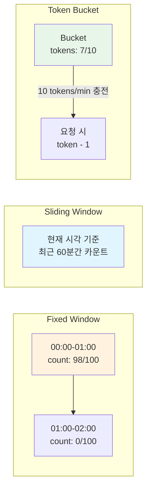
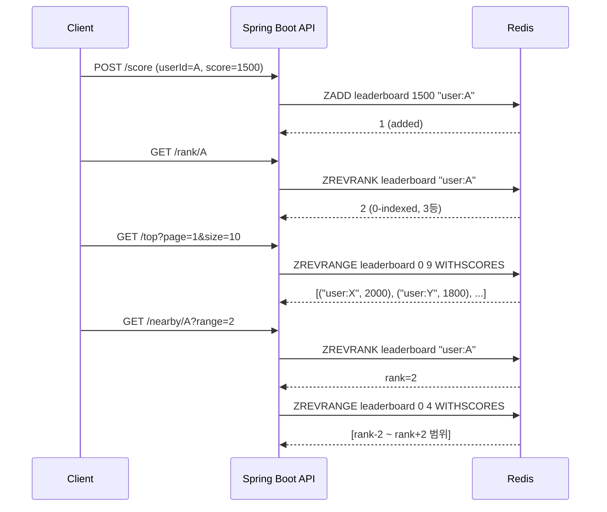

# 실전 패턴: Rate Limiting과 리더보드

Redis의 원자적 연산과 Sorted Set을 활용하여 Rate Limiter와 실시간 리더보드를 구현하는 방법을 분석한다. Fixed Window부터 Token Bucket까지 4가지 Rate Limiting 알고리즘의 Redis 구현과, Sorted Set 기반 리더보드의 순위 조회/페이지네이션/주변 순위 기능을 다룬다.

## 목차

1. [핵심 개념 (What)](#1-핵심-개념-what)
2. [왜 알아야 하는가 (Why)](#2-왜-알아야-하는가-why)
3. [내부 구현 분석 (How)](#3-내부-구현-분석-how)
4. [실전 예제](#4-실전-예제)
5. [정리](#5-정리)

---

## 1. 핵심 개념 (What)

### Rate Limiting 알고리즘

| 알고리즘 | 원리 | 장점 | 단점 |
|---------|------|------|------|
| Fixed Window | 고정 시간 창에서 요청 수 카운트 | 구현 단순, 메모리 효율적 | 창 경계에서 2배 트래픽 허용 |
| Sliding Window Log | 요청 타임스탬프를 모두 기록 | 정확한 제한 | 메모리 사용량 큼 |
| Sliding Window Counter | 이전/현재 창의 가중 합산 | 정확도와 효율의 균형 | 근사치 기반 |
| Token Bucket | 일정 속도로 토큰 충전, 요청 시 소비 | 버스트 허용, 유연함 | 구현 복잡도 높음 |

### 리더보드 핵심 연산

| Redis 명령 | 용도 | 시간복잡도 |
|-----------|------|----------|
| `ZADD` | 점수와 함께 멤버 추가/갱신 | O(log N) |
| `ZSCORE` | 특정 멤버의 점수 조회 | O(1) |
| `ZRANK` / `ZREVRANK` | 오름차순/내림차순 순위 조회 | O(log N) |
| `ZREVRANGE` | 상위 N명 조회 | O(log N + M) |
| `ZRANGEBYSCORE` | 점수 범위로 조회 | O(log N + M) |
| `ZINCRBY` | 점수 증가 | O(log N) |

## 2. 왜 알아야 하는가 (Why)

### 실무에서 만나는 상황

1. **API 남용 방지**: 외부 API를 제공할 때, 특정 클라이언트가 과도한 요청을 보내 서비스 전체에 영향을 주는 것을 방지해야 한다. 분산 환경에서는 서버 로컬 카운터로는 정확한 제한이 불가능하다.
2. **비용 제어**: 유료 API나 외부 서비스 호출 시, 플랜별 호출 한도를 정확히 관리해야 과금 누수를 방지할 수 있다.
3. **실시간 순위 시스템**: 게임 점수, 판매 순위, 인기 콘텐츠 등 실시간으로 변하는 순위를 수백만 건 데이터에서 밀리초 단위로 조회해야 한다.
4. **DDoS 방어 1차 방어선**: Application Layer에서 Rate Limiting을 적용하면 비정상 트래픽을 조기에 차단하여 백엔드 부하를 줄일 수 있다.

## 3. 내부 구현 분석 (How)

### 3.1 Rate Limiting 알고리즘 비교



### 3.2 Fixed Window Counter (INCR + EXPIRE)

가장 단순한 구현으로, 고정 시간 창에서 요청 수를 카운트한다.

```lua
-- fixed_window_rate_limit.lua
local key = KEYS[1]
local limit = tonumber(ARGV[1])
local window = tonumber(ARGV[2])

local current = redis.call('INCR', key)

if current == 1 then
    redis.call('EXPIRE', key, window)
end

if current > limit then
    return 0  -- 거부
end
return 1      -- 허용
```

키 구조: `rate_limit:{clientId}:{분 단위 timestamp}`

**한계점**: 창 경계(window boundary)에서 00:59에 100건, 01:00에 100건을 허용하여 실질적으로 1분간 200건이 처리될 수 있다.

### 3.3 Sliding Window Log (Sorted Set)

모든 요청의 타임스탬프를 Sorted Set에 기록하여 정확한 슬라이딩 윈도우를 구현한다.

```lua
-- sliding_window_log.lua
local key = KEYS[1]
local limit = tonumber(ARGV[1])
local window = tonumber(ARGV[2])
local now = tonumber(ARGV[3])
local window_start = now - window

-- 만료된 기록 제거
redis.call('ZREMRANGEBYSCORE', key, '-inf', window_start)

-- 현재 창의 요청 수 확인
local count = redis.call('ZCARD', key)

if count >= limit then
    return 0  -- 거부
end

-- 새 요청 기록 (score=timestamp, member=고유ID)
redis.call('ZADD', key, now, now .. ':' .. math.random(100000))
redis.call('EXPIRE', key, window)
return 1      -- 허용
```

### 3.4 Sliding Window Counter

이전 창과 현재 창의 카운트를 가중 평균하여 근사적 슬라이딩 윈도우를 구현한다.

```lua
-- sliding_window_counter.lua
local prev_key = KEYS[1]
local curr_key = KEYS[2]
local limit = tonumber(ARGV[1])
local window = tonumber(ARGV[2])
local now = tonumber(ARGV[3])

local curr_window_start = math.floor(now / window) * window
local elapsed = now - curr_window_start
local weight = (window - elapsed) / window

local prev_count = tonumber(redis.call('GET', prev_key) or '0')
local curr_count = tonumber(redis.call('GET', curr_key) or '0')

-- 가중 합산: 이전 창의 남은 비율 * 이전 카운트 + 현재 카운트
local estimated = math.floor(prev_count * weight) + curr_count

if estimated >= limit then
    return 0
end

redis.call('INCR', curr_key)
redis.call('EXPIRE', curr_key, window * 2)
return 1
```

### 3.5 Token Bucket (Hash + Lua)

일정 속도로 토큰이 충전되고, 요청마다 토큰을 소비하는 방식이다.

```lua
-- token_bucket.lua
local key = KEYS[1]
local capacity = tonumber(ARGV[1])      -- 버킷 최대 용량
local refill_rate = tonumber(ARGV[2])   -- 초당 충전 토큰 수
local now = tonumber(ARGV[3])           -- 현재 시각 (초)
local requested = tonumber(ARGV[4])     -- 소비할 토큰 수

local bucket = redis.call('HMGET', key, 'tokens', 'last_refill')
local tokens = tonumber(bucket[1]) or capacity
local last_refill = tonumber(bucket[2]) or now

-- 경과 시간에 비례하여 토큰 충전
local elapsed = math.max(0, now - last_refill)
local refilled = math.min(capacity, tokens + elapsed * refill_rate)

if refilled < requested then
    -- 토큰 부족: 상태만 갱신
    redis.call('HMSET', key, 'tokens', refilled, 'last_refill', now)
    redis.call('EXPIRE', key, math.ceil(capacity / refill_rate) * 2)
    return 0
end

-- 토큰 소비
local remaining = refilled - requested
redis.call('HMSET', key, 'tokens', remaining, 'last_refill', now)
redis.call('EXPIRE', key, math.ceil(capacity / refill_rate) * 2)
return 1
```

### 3.6 리더보드: Sorted Set 핵심 연산



**주변 순위(Nearby Ranking)** 구현 핵심:

1. `ZREVRANK`로 대상의 현재 순위를 조회
2. `ZREVRANGE`로 (순위-N) ~ (순위+N) 범위를 조회
3. 경계값 처리: start는 `max(0, rank - N)`, stop은 `rank + N`

## 4. 실전 예제

### 4.1 Spring Boot Rate Limiter 구현

```java
@Component
@RequiredArgsConstructor
public class RedisRateLimiter {

    private final StringRedisTemplate redisTemplate;
    private final RedisScript<Long> tokenBucketScript;

    /** Token Bucket 방식 Rate Limiting */
    public boolean isAllowed(String key, int capacity, double refillRate) {
        String bucketKey = "rate_limit:token_bucket:" + key;
        long now = Instant.now().getEpochSecond();

        Long result = redisTemplate.execute(
            tokenBucketScript, List.of(bucketKey),
            String.valueOf(capacity), String.valueOf(refillRate),
            String.valueOf(now), "1"
        );
        return result != null && result == 1L;
    }

    /** Sliding Window Counter 방식 Rate Limiting */
    public RateLimitResult checkSlidingWindow(String key, int limit, Duration window) {
        long now = System.currentTimeMillis();
        long windowMillis = window.toMillis();
        long currentWindow = now / windowMillis;
        String prevKey = "rate_limit:sw:" + key + ":" + (currentWindow - 1);
        String currKey = "rate_limit:sw:" + key + ":" + currentWindow;

        List<Object> results = redisTemplate.executePipelined(
            (RedisCallback<Object>) connection -> {
                connection.stringCommands().get(prevKey.getBytes());
                connection.stringCommands().get(currKey.getBytes());
                return null;
            });

        long prevCount = parseLong(results.get(0));
        long currCount = parseLong(results.get(1));
        long elapsed = now - (currentWindow * windowMillis);
        double weight = (double)(windowMillis - elapsed) / windowMillis;
        long estimated = (long)(prevCount * weight) + currCount;

        if (estimated >= limit) {
            return new RateLimitResult(false, limit - estimated, windowMillis - elapsed);
        }
        redisTemplate.opsForValue().increment(currKey);
        redisTemplate.expire(currKey, window.multipliedBy(2));
        return new RateLimitResult(true, limit - estimated - 1, 0);
    }

    public record RateLimitResult(boolean allowed, long remaining, long retryAfterMs) {}
}
```

```java
@Component
public class RateLimitInterceptor implements HandlerInterceptor {

    private final RedisRateLimiter rateLimiter;

    public RateLimitInterceptor(RedisRateLimiter rateLimiter) {
        this.rateLimiter = rateLimiter;
    }

    @Override
    public boolean preHandle(HttpServletRequest request,
                             HttpServletResponse response, Object handler) throws Exception {
        String clientKey = resolveClientKey(request);
        var result = rateLimiter.checkSlidingWindow(clientKey, 100, Duration.ofMinutes(1));

        response.setHeader("X-RateLimit-Limit", "100");
        response.setHeader("X-RateLimit-Remaining", String.valueOf(Math.max(0, result.remaining())));

        if (!result.allowed()) {
            response.setHeader("Retry-After", String.valueOf(result.retryAfterMs() / 1000));
            response.setStatus(HttpStatus.TOO_MANY_REQUESTS.value());
            return false;
        }
        return true;
    }

    private String resolveClientKey(HttpServletRequest request) {
        String apiKey = request.getHeader("X-API-Key");
        if (apiKey != null) return "api:" + apiKey;
        String forwarded = request.getHeader("X-Forwarded-For");
        if (forwarded != null) return "ip:" + forwarded.split(",")[0].trim();
        return "ip:" + request.getRemoteAddr();
    }
}
```

### 4.2 리더보드 API 구현

```java
@Service
@RequiredArgsConstructor
public class LeaderboardService {

    private final StringRedisTemplate redisTemplate;
    private static final String LEADERBOARD_KEY = "game:leaderboard:season1";

    /** 점수 업데이트 (최고 점수만 유지) */
    public void updateScore(String userId, double score) {
        Double current = redisTemplate.opsForZSet().score(LEADERBOARD_KEY, userId);
        if (current == null || score > current) {
            redisTemplate.opsForZSet().add(LEADERBOARD_KEY, userId, score);
        }
    }

    /** 상위 N명 조회 (페이지네이션) */
    public List<RankEntry> getTopRankers(int page, int size) {
        long start = (long) page * size;
        Set<ZSetOperations.TypedTuple<String>> tuples =
            redisTemplate.opsForZSet()
                .reverseRangeWithScores(LEADERBOARD_KEY, start, start + size - 1);
        if (tuples == null) return List.of();

        List<RankEntry> entries = new ArrayList<>();
        long rank = start + 1;
        for (var tuple : tuples) {
            entries.add(new RankEntry(rank++, tuple.getValue(), tuple.getScore()));
        }
        return entries;
    }

    /** 특정 사용자의 순위와 점수 조회 */
    public RankEntry getUserRank(String userId) {
        Long rank = redisTemplate.opsForZSet().reverseRank(LEADERBOARD_KEY, userId);
        Double score = redisTemplate.opsForZSet().score(LEADERBOARD_KEY, userId);
        if (rank == null || score == null) {
            throw new UserNotFoundException("User not in leaderboard: " + userId);
        }
        return new RankEntry(rank + 1, userId, score);
    }

    /** 주변 순위 조회 (자신 포함 앞뒤 N명) */
    public List<RankEntry> getNearbyRanks(String userId, int range) {
        Long rank = redisTemplate.opsForZSet().reverseRank(LEADERBOARD_KEY, userId);
        if (rank == null) throw new UserNotFoundException("User not in leaderboard");

        long start = Math.max(0, rank - range);
        Set<ZSetOperations.TypedTuple<String>> tuples =
            redisTemplate.opsForZSet()
                .reverseRangeWithScores(LEADERBOARD_KEY, start, rank + range);
        if (tuples == null) return List.of();

        List<RankEntry> entries = new ArrayList<>();
        long currentRank = start + 1;
        for (var tuple : tuples) {
            entries.add(new RankEntry(currentRank++, tuple.getValue(), tuple.getScore()));
        }
        return entries;
    }

    public record RankEntry(long rank, String userId, double score) {}
}
```

```java
@RestController
@RequestMapping("/api/leaderboard")
@RequiredArgsConstructor
public class LeaderboardController {

    private final LeaderboardService leaderboardService;

    @PostMapping("/score")
    public ResponseEntity<Void> submitScore(@RequestBody ScoreRequest request) {
        leaderboardService.updateScore(request.userId(), request.score());
        return ResponseEntity.ok().build();
    }

    @GetMapping("/top")
    public ResponseEntity<LeaderboardResponse> getTop(
            @RequestParam(defaultValue = "0") int page,
            @RequestParam(defaultValue = "10") int size) {
        List<RankEntry> entries = leaderboardService.getTopRankers(page, size);
        long total = leaderboardService.getTotalCount();
        return ResponseEntity.ok(new LeaderboardResponse(entries, total, page, size));
    }

    @GetMapping("/rank/{userId}")
    public ResponseEntity<RankEntry> getUserRank(@PathVariable String userId) {
        return ResponseEntity.ok(leaderboardService.getUserRank(userId));
    }

    @GetMapping("/nearby/{userId}")
    public ResponseEntity<List<RankEntry>> getNearby(
            @PathVariable String userId,
            @RequestParam(defaultValue = "5") int range) {
        return ResponseEntity.ok(
            leaderboardService.getNearbyRanks(userId, range));
    }
}
```

## 5. 정리

| 항목 | 설명 |
|-----|------|
| Fixed Window | `INCR` + `EXPIRE`로 가장 단순, 창 경계에서 2배 트래픽 허용 가능 |
| Sliding Window Log | Sorted Set으로 정확한 제한, 메모리 사용량이 요청 수에 비례 |
| Sliding Window Counter | 이전/현재 창 가중 합산으로 정확도와 효율의 균형 |
| Token Bucket | Hash + Lua로 버스트 허용, 일정 속도 제한에 최적 |
| Lua 스크립트 필수 | 모든 알고리즘에서 조회-판단-갱신이 원자적으로 실행되어야 Race Condition 방지 |
| 리더보드 핵심 | Sorted Set의 `ZADD`, `ZREVRANK`, `ZREVRANGE`로 O(log N) 순위 연산 |
| 주변 순위 | `ZREVRANK`로 순위 조회 후 `ZREVRANGE`로 범위 조회 (2회 호출) |
| HTTP 응답 헤더 | `X-RateLimit-Limit`, `X-RateLimit-Remaining`, `Retry-After` 포함 권장 |

---
*참고: Redis 7.x / Spring Boot 3.x 기준*
