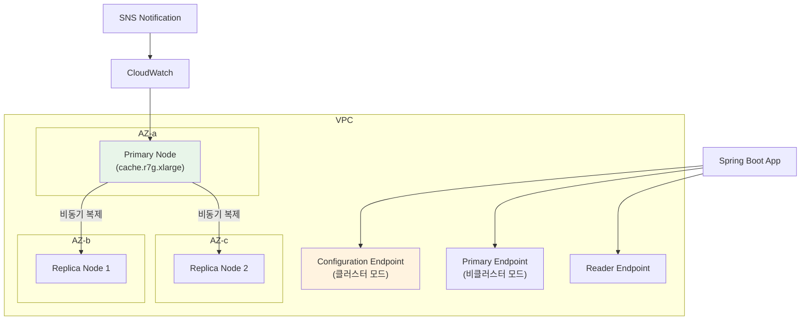
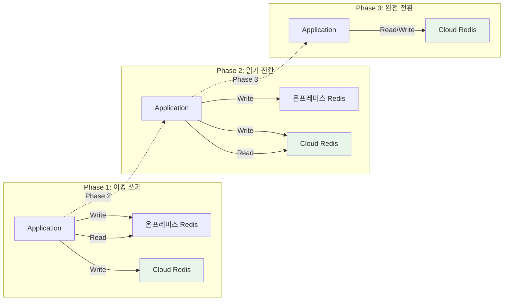

# 클라우드 Redis 서비스와 운영: ElastiCache, Azure Cache, Memorystore

AWS ElastiCache, Azure Cache for Redis, GCP Memorystore 등 주요 클라우드 관리형 Redis 서비스의 특성을 비교하고, 자체 호스팅 대비 장단점, 마이그레이션 전략, 비용 최적화 방법과 Spring Boot 연동 실전 패턴을 분석한다.

## 목차

1. [핵심 개념 (What)](#1-핵심-개념-what)
2. [왜 알아야 하는가 (Why)](#2-왜-알아야-하는가-why)
3. [내부 구현 분석 (How)](#3-내부-구현-분석-how)
4. [실전 예제](#4-실전-예제)
5. [정리](#5-정리)

---

## 1. 핵심 개념 (What)

### 주요 클라우드 Redis 서비스

| 서비스 | 클라우드 | 주요 특징 |
|--------|---------|----------|
| ElastiCache for Redis | AWS | 클러스터 모드, Multi-AZ, 자동 페일오버, Global Datastore |
| ElastiCache Serverless | AWS | 자동 스케일링, 용량 관리 불필요, ECU 기반 과금 |
| Azure Cache for Redis | Azure | 4개 서비스 티어, Enterprise 티어(Redis Enterprise 기반) |
| Memorystore for Redis | GCP | Managed 인스턴스, VPC 네이티브, 자동 페일오버 |
| Memorystore for Redis Cluster | GCP | Managed 클러스터, 최대 250 노드 |

### 자체 호스팅 vs 관리형 서비스

| 항목 | 자체 호스팅 | 관리형 서비스 |
|-----|-----------|-------------|
| 초기 설정 | 수동 설치, 구성, 보안 설정 | 콘솔/IaC로 수분 내 프로비저닝 |
| 패치/업그레이드 | 직접 계획, 다운타임 관리 | 유지보수 윈도우에 자동 패치 |
| 고가용성 | Sentinel/Cluster 직접 구성 | Multi-AZ, 자동 페일오버 내장 |
| 백업/복원 | 직접 RDB/AOF 관리 | 자동 스냅샷, PITR(Point-in-Time Recovery) |
| 모니터링 | Prometheus/Grafana 직접 구축 | CloudWatch/Azure Monitor 통합 |
| 비용 | 인스턴스 비용만 (관리 인력 비용 별도) | 20-40% 프리미엄, 관리 비용 절감 |
| 커스터마이징 | 모든 설정 변경 가능 | 일부 설정 제한 (BGSAVE, CONFIG 등) |

## 2. 왜 알아야 하는가 (Why)

### 실무에서 만나는 상황

1. **인프라 운영 부담 경감**: Redis Sentinel 구성, 장애 감지, 페일오버, 패치 등을 직접 관리하면 운영 팀의 부담이 크다. 관리형 서비스를 사용하면 이 부담을 클라우드에 위임할 수 있다.
2. **스케일링 요구**: 트래픽이 급증하는 이벤트 시 클러스터 노드를 빠르게 추가해야 하는데, 자체 호스팅에서는 프로비저닝부터 데이터 리밸런싱까지 수시간이 걸린다.
3. **규정 준수**: SOC2, HIPAA 등 규정에 따라 암호화(at-rest, in-transit), 감사 로그, 접근 제어를 요구받는 경우, 관리형 서비스의 내장 기능을 활용하면 준수 부담이 줄어든다.
4. **마이그레이션 의사결정**: 온프레미스 Redis에서 클라우드로 전환할 때, 서비스 선택 기준과 마이그레이션 전략을 이해해야 데이터 유실 없는 전환이 가능하다.

## 3. 내부 구현 분석 (How)

### 3.1 AWS ElastiCache 아키텍처



#### 클러스터 모드 활성화 vs 비활성화

| 항목 | 비클러스터 모드 | 클러스터 모드 |
|-----|--------------|-------------|
| 샤딩 | 없음 (단일 샤드) | 최대 500개 샤드 |
| 최대 메모리 | 노드 1개 메모리 한도 | 샤드 수 x 노드 메모리 |
| 엔드포인트 | Primary + Reader Endpoint | Configuration Endpoint |
| 스케일 아웃 | 불가 (스케일 업만 가능) | 온라인 리샤딩 가능 |
| Multi-AZ | 리플리카로 지원 | 샤드별 리플리카 배치 |

#### 파라미터 그룹 주요 설정

```
# ElastiCache 파라미터 그룹
maxmemory-policy         = allkeys-lru
maxmemory-samples        = 10
timeout                  = 0
tcp-keepalive            = 300
notify-keyspace-events   = ""     # 필요 시 "Egx" 설정
cluster-enabled          = yes    # 클러스터 모드
```

### 3.2 ElastiCache Serverless

ElastiCache Serverless는 용량 관리 없이 자동 스케일링되는 서비스다.

**과금 모델:**
- **ElastiCache Processing Units (ECPUs)**: 요청 처리에 사용된 vCPU 시간
- **데이터 스토리지**: 저장된 데이터 GB당 과금
- 최소 과금 단위 없이 사용한 만큼만 과금

**적합한 사용 사례:**
- 트래픽 패턴이 예측 불가능한 워크로드
- 개발/스테이징 환경
- 이벤트성 트래픽이 간헐적으로 발생하는 서비스

### 3.3 Azure Cache for Redis 서비스 티어

| 티어 | 메모리 | SLA | 주요 기능 |
|-----|-------|-----|----------|
| Basic | 250MB ~ 53GB | 없음 | 단일 노드, 개발/테스트용 |
| Standard | 250MB ~ 53GB | 99.9% | Primary/Replica, 자동 페일오버 |
| Premium | 6GB ~ 120GB | 99.9% | 클러스터링, VNet, 지역 복제, RDB 지속성 |
| Enterprise | 12GB ~ 2TB | 99.99% | Redis Enterprise 기반, RediSearch, RedisBloom, Active Geo-Replication |

### 3.4 GCP Memorystore for Redis

Memorystore는 GCP의 완전 관리형 Redis 서비스로, VPC 네이티브 연결을 제공한다.

**주요 특징:**
- Standard 티어: 리전 간 자동 복제, 자동 페일오버
- Basic 티어: 단일 노드, 복제 없음
- 최대 300GB 메모리
- VPC 피어링 기반 프라이빗 연결
- IAM 기반 접근 제어

### 3.5 마이그레이션 전략



**단계별 마이그레이션:**

1. **Phase 1 (이중 쓰기)**: 애플리케이션이 온프레미스와 클라우드 Redis 양쪽에 쓰기를 수행한다. 읽기는 기존 온프레미스에서 처리한다.
2. **Phase 2 (읽기 전환)**: 데이터 일관성 검증 후, 읽기를 클라우드 Redis로 전환한다. 쓰기는 양쪽 유지한다.
3. **Phase 3 (완전 전환)**: 충분한 검증 후 온프레미스 Redis 연결을 제거한다.

**대안: `redis-cli --rdb` 또는 `MIGRATE` 활용**

```bash
# RDB 스냅샷 기반 마이그레이션 (다운타임 허용 시)
redis-cli -h source-redis --rdb dump.rdb
# ElastiCache는 S3에서 RDB 파일을 임포트하는 기능 제공
aws elasticache create-replication-group \
  --snapshot-arns arn:aws:s3:::my-bucket/dump.rdb \
  --replication-group-id my-cluster \
  --replication-group-description "Migrated from on-prem"
```

### 3.6 비용 최적화

**인스턴스 사이징:**
- `INFO memory`의 `used_memory_dataset`으로 실제 데이터 크기 확인
- 메모리 사용률 50-70% 유지 권장 (BGSAVE, 복제 버퍼 고려)
- 데이터 크기의 2배 메모리를 확보하는 것이 안전

**Reserved Instance (RI):**
- 1년 예약: 약 30% 할인
- 3년 예약: 약 50% 할인
- 안정적인 워크로드에는 RI 적용, 변동성 높은 워크로드에는 On-Demand 유지

**Graviton 인스턴스 (AWS):**
- `cache.r7g.*` 타입은 동일 비용 대비 20-30% 더 나은 성능
- ARM 기반이므로 Redis 바이너리 호환성 문제 없음

## 4. 실전 예제

### 4.1 Spring Boot + ElastiCache 연동

```yaml
# application-prod.yml
spring:
  data:
    redis:
      cluster:
        nodes:
          - redis-cluster.abc123.clustercfg.apne2.cache.amazonaws.com:6379
        max-redirects: 3
      password: ${REDIS_AUTH_TOKEN}
      ssl:
        enabled: true
      lettuce:
        pool:
          max-active: 32
          max-idle: 16
          min-idle: 8
          max-wait: 3s
        cluster:
          refresh:
            adaptive: true         # 토폴로지 변경 시 자동 갱신
            period: 30s            # 주기적 토폴로지 갱신
```

```java
@Configuration
@Profile("prod")
public class ElastiCacheConfig {

    @Bean
    public LettuceClientConfigurationBuilderCustomizer lettuceCustomizer() {
        return builder -> builder
            .useSsl()
            .and()
            .clientOptions(ClusterClientOptions.builder()
                .topologyRefreshOptions(ClusterTopologyRefreshOptions.builder()
                    .enablePeriodicRefresh(Duration.ofSeconds(30))
                    .enableAllAdaptiveRefreshTriggers()
                    .adaptiveRefreshTriggersTimeout(Duration.ofSeconds(15))
                    .build())
                .socketOptions(SocketOptions.builder()
                    .connectTimeout(Duration.ofSeconds(3))
                    .keepAlive(SocketOptions.KeepAliveOptions.builder()
                        .enable()
                        .idle(Duration.ofSeconds(15))
                        .interval(Duration.ofSeconds(5))
                        .count(3)
                        .build())
                    .build())
                .timeoutOptions(TimeoutOptions.builder()
                    .fixedTimeout(Duration.ofSeconds(3))
                    .build())
                .autoReconnectLastAddress()
                .build());
    }
}
```

### 4.2 장애 대응: Circuit Breaker 패턴

ElastiCache 장애 시 애플리케이션 전체가 다운되지 않도록 Circuit Breaker를 적용한다.

```java
@Service
@RequiredArgsConstructor
@Slf4j
public class ResilientCacheService {

    private final StringRedisTemplate redisTemplate;

    @CircuitBreaker(name = "redis", fallbackMethod = "fallbackGet")
    @TimeLimiter(name = "redis")
    public CompletableFuture<String> get(String key) {
        return CompletableFuture.supplyAsync(() ->
            redisTemplate.opsForValue().get(key)
        );
    }

    @CircuitBreaker(name = "redis", fallbackMethod = "fallbackPut")
    @TimeLimiter(name = "redis")
    public CompletableFuture<Void> put(String key, String value, Duration ttl) {
        return CompletableFuture.runAsync(() ->
            redisTemplate.opsForValue().set(key, value, ttl)
        );
    }

    /** Redis 장애 시 폴백: DB 직접 조회 또는 로컬 캐시 */
    private CompletableFuture<String> fallbackGet(String key, Throwable t) {
        log.warn("Redis 장애 감지, 폴백 실행: key={}, error={}", key, t.getMessage());
        return CompletableFuture.completedFuture(null);
    }

    private CompletableFuture<Void> fallbackPut(
            String key, String value, Duration ttl, Throwable t) {
        log.warn("Redis 쓰기 실패, 무시: key={}, error={}", key, t.getMessage());
        return CompletableFuture.completedFuture(null);
    }
}
```

```yaml
# application.yml - Resilience4j 설정
resilience4j:
  circuitbreaker:
    instances:
      redis:
        slidingWindowType: COUNT_BASED
        slidingWindowSize: 10
        minimumNumberOfCalls: 5
        failureRateThreshold: 50
        waitDurationInOpenState: 30s
        permittedNumberOfCallsInHalfOpenState: 3
        automaticTransitionFromOpenToHalfOpenEnabled: true
  timelimiter:
    instances:
      redis:
        timeoutDuration: 2s
```

### 4.3 ElastiCache 헬스체크 엔드포인트

```java
@Component
public class RedisHealthIndicator implements HealthIndicator {

    private final StringRedisTemplate redisTemplate;

    public RedisHealthIndicator(StringRedisTemplate redisTemplate) {
        this.redisTemplate = redisTemplate;
    }

    @Override
    public Health health() {
        try {
            String result = redisTemplate.getConnectionFactory()
                .getConnection().ping();
            Properties info = redisTemplate.getConnectionFactory()
                .getConnection().serverCommands().info("memory");

            return Health.up()
                .withDetail("ping", result)
                .withDetail("used_memory_human",
                    info.getProperty("used_memory_human"))
                .withDetail("maxmemory_human",
                    info.getProperty("maxmemory_human"))
                .build();
        } catch (Exception e) {
            return Health.down()
                .withException(e)
                .build();
        }
    }
}
```

## 5. 정리

| 항목 | 설명 |
|-----|------|
| ElastiCache (노드 기반) | 클러스터 모드로 최대 500 샤드, Multi-AZ 자동 페일오버, 온라인 리샤딩 |
| ElastiCache Serverless | 용량 관리 불필요, ECPU + 스토리지 기반 과금, 예측 불가 트래픽에 적합 |
| Azure Cache for Redis | Basic/Standard/Premium/Enterprise 4개 티어, Enterprise는 Redis Enterprise 기반 |
| GCP Memorystore | VPC 네이티브, Standard 티어에서 리전 간 복제, 최대 300GB |
| 마이그레이션 | 이중 쓰기 -> 읽기 전환 -> 완전 전환 3단계, 또는 RDB 스냅샷 임포트 |
| 비용 최적화 | Reserved Instance(1년 30%, 3년 50% 할인), Graviton 인스턴스, 적정 사이징 |
| 장애 대응 | Circuit Breaker 패턴으로 Redis 장애 시 애플리케이션 보호 |
| 토폴로지 갱신 | Lettuce의 `adaptive-refresh` 활성화로 페일오버 시 자동 엔드포인트 갱신 |

---
*참고: AWS ElastiCache 2024 / Azure Cache for Redis / GCP Memorystore / Redis 7.x 기준*
