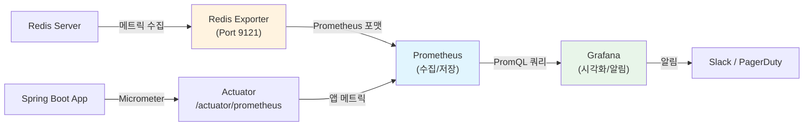

# 모니터링과 트러블슈팅: Redis 운영의 핵심

Redis `INFO` 명령어의 핵심 메트릭 분석, SLOWLOG/MONITOR를 활용한 성능 진단, Redis Exporter + Prometheus + Grafana 모니터링 스택 구축, 그리고 OOM, 높은 지연 시간, 복제 지연 등 일반적인 장애 패턴의 원인과 해결 방법을 다룬다.

## 목차

1. [핵심 개념 (What)](#1-핵심-개념-what)
2. [왜 알아야 하는가 (Why)](#2-왜-알아야-하는가-why)
3. [내부 구현 분석 (How)](#3-내부-구현-분석-how)
4. [실전 예제](#4-실전-예제)
5. [정리](#5-정리)

---

## 1. 핵심 개념 (What)

### Redis 진단 명령어

| 명령어 | 용도 | 주의사항 |
|--------|------|---------|
| `INFO [section]` | 서버 상태 전체 조회 | 섹션별 조회 권장 (전체 조회 시 응답이 큼) |
| `SLOWLOG GET [count]` | 느린 명령 이력 조회 | 네트워크 시간은 미포함, 순수 실행 시간만 기록 |
| `MONITOR` | 실시간 명령 추적 | **운영 환경 사용 금지** (50% 이상 성능 저하) |
| `MEMORY USAGE key` | 특정 키의 메모리 사용량 조회 | 샘플링 기반 추정치 |
| `MEMORY DOCTOR` | 메모리 관련 문제 자동 진단 | Redis 4.0+ |
| `CLIENT LIST` | 연결된 클라이언트 목록 | 클라이언트 수가 많으면 응답이 느림 |
| `LATENCY LATEST` | 최근 지연 이벤트 조회 | `latency-monitor-threshold` 설정 필요 |
| `DEBUG SLEEP` | 의도적 지연 (테스트용) | 운영 환경 사용 금지 |

### 핵심 모니터링 메트릭

| 메트릭 | 의미 | 임계값 (참고) |
|--------|------|-------------|
| `used_memory` | 현재 메모리 사용량 | maxmemory의 80% 초과 시 경고 |
| `used_memory_rss` | OS 관점 실제 메모리 (RSS) | used_memory 대비 1.5배 초과 시 단편화 의심 |
| `mem_fragmentation_ratio` | RSS / used_memory | 1.5 초과: 단편화, 1.0 미만: 스왑 사용 |
| `connected_clients` | 현재 연결된 클라이언트 수 | maxclients의 80% 초과 시 경고 |
| `instantaneous_ops_per_sec` | 초당 처리 명령 수 | 기준선 대비 급격한 변화 감지 |
| `keyspace_hits / misses` | 캐시 히트/미스 수 | 히트율 90% 미만 시 점검 |
| `rejected_connections` | 거부된 연결 수 | 0이 아니면 maxclients 증가 필요 |
| `evicted_keys` | 메모리 부족으로 제거된 키 수 | 지속적으로 증가 시 메모리 확장 필요 |

## 2. 왜 알아야 하는가 (Why)

### 실무에서 만나는 상황

1. **갑작스러운 응답 지연**: 특정 시점부터 Redis 응답이 느려지는데 원인을 모를 때, `SLOWLOG`와 `LATENCY` 명령으로 어떤 명령이 병목인지 정확히 진단할 수 있다.
2. **메모리 부족 장애**: `maxmemory`에 도달하여 키가 제거되거나 쓰기가 거부되는 상황에서, `INFO memory`와 `MEMORY USAGE`로 메모리 소비 패턴을 분석하고 대응할 수 있다.
3. **연결 폭증**: 애플리케이션 배포 후 `connected_clients`가 급증하여 `maxclients`에 도달하면, `CLIENT LIST`로 어떤 클라이언트가 연결을 점유하는지 파악해야 한다.
4. **복제 지연**: Primary-Replica 구조에서 복제 지연이 발생하면 읽기 일관성이 깨진다. `INFO replication`으로 복제 오프셋 차이를 모니터링해야 한다.

## 3. 내부 구현 분석 (How)

### 3.1 INFO 명령어 상세 분석

```bash
# 섹션별 조회
redis-cli INFO server      # Redis 서버 정보
redis-cli INFO memory      # 메모리 사용 현황
redis-cli INFO stats       # 통계 (명령 처리, 히트율 등)
redis-cli INFO replication # 복제 상태
redis-cli INFO clients     # 클라이언트 연결 정보
redis-cli INFO keyspace    # 데이터베이스별 키 수
```

#### INFO memory 핵심 필드

```
# Memory
used_memory:1073741824              # 1GB (Redis 할당기 기준)
used_memory_human:1.00G
used_memory_rss:1610612736          # 1.5GB (OS RSS)
used_memory_rss_human:1.50G
used_memory_peak:2147483648         # 최대 사용량 2GB
used_memory_dataset:858993459       # 순수 데이터 크기
mem_fragmentation_ratio:1.50        # RSS/used = 1.5 → 단편화 발생
maxmemory:2147483648                # 설정된 최대 메모리
maxmemory_policy:allkeys-lru        # 제거 정책
```

#### INFO stats 핵심 필드

```
# Stats
total_connections_received:150000   # 누적 연결 수
total_commands_processed:85000000   # 누적 명령 처리 수
instantaneous_ops_per_sec:12500     # 현재 초당 명령 수
keyspace_hits:76000000              # 캐시 히트
keyspace_misses:9000000             # 캐시 미스
# 히트율 = 76M / (76M + 9M) = 89.4%
evicted_keys:0                      # 제거된 키 (0이면 정상)
rejected_connections:0              # 거부된 연결
```

### 3.2 SLOWLOG: 느린 명령 추적

```bash
# 느린 명령 임계값 설정 (마이크로초, 10ms = 10000)
CONFIG SET slowlog-log-slower-than 10000

# 최대 기록 수
CONFIG SET slowlog-max-len 128

# 최근 느린 명령 10개 조회
SLOWLOG GET 10
```

SLOWLOG 출력 구조:

```
1) 1) (integer) 42          # ID
   2) (integer) 1708012800  # Unix timestamp
   3) (integer) 15230       # 실행 시간 (마이크로초, 15.2ms)
   4) 1) "KEYS"             # 명령어
      2) "user:*"           # 인자
   5) "10.0.1.5:52340"      # 클라이언트 IP:Port
   6) "app-session"         # 클라이언트 이름
```

**주의**: SLOWLOG는 순수 명령 실행 시간만 기록한다. 네트워크 왕복 시간, 큐 대기 시간은 포함되지 않는다.

### 3.3 MONITOR 명령

```bash
# 실시간 명령 스트림 (테스트 환경 전용)
redis-cli MONITOR
# 출력:
# 1708012800.123456 [0 10.0.1.5:52340] "SET" "user:123" "data..."
# 1708012800.123789 [0 10.0.1.5:52341] "GET" "user:456"
```

**절대 운영 환경에서 사용하지 말 것**: MONITOR는 모든 명령을 클라이언트로 전송하므로 Redis 처리량이 50% 이상 감소한다.

### 3.4 MEMORY 명령

```bash
# 특정 키의 메모리 사용량 (바이트)
MEMORY USAGE user:session:abc123
# (integer) 256

# 샘플 수를 지정하여 정확도 향상 (대규모 컬렉션)
MEMORY USAGE large-hash SAMPLES 100
# (integer) 1048576

# 메모리 문제 자동 진단
MEMORY DOCTOR
# "Sam, I have a few concerns..."
```

### 3.5 CLIENT LIST: 클라이언트 연결 분석

```bash
CLIENT LIST

# 출력 예시:
# id=5 addr=10.0.1.5:52340 fd=8 name=app-1 db=0 sub=0 psub=0
#   multi=-1 qbuf=26 qbuf-free=32742 argv-mem=10
#   obl=0 oll=0 omem=0 tot-mem=20512 events=r cmd=ping
#   user=default age=86400 idle=0 flags=N
```

핵심 필드:

| 필드 | 의미 |
|------|------|
| `age` | 연결 유지 시간 (초) |
| `idle` | 마지막 명령 이후 경과 시간 (초) |
| `cmd` | 마지막 실행 명령 |
| `qbuf` | 입력 버퍼 크기 |
| `omem` | 출력 버퍼 메모리 |
| `flags` | N=일반, S=Replica, M=Master, x=MULTI 실행 중 |

### 3.6 모니터링 스택 아키텍처



#### Redis Exporter 설정

```yaml
# docker-compose.yml
services:
  redis-exporter:
    image: oliver006/redis_exporter:latest
    environment:
      REDIS_ADDR: "redis://redis-primary:6379"
      REDIS_PASSWORD: "${REDIS_PASSWORD}"
    ports:
      - "9121:9121"

  prometheus:
    image: prom/prometheus:latest
    volumes:
      - ./prometheus.yml:/etc/prometheus/prometheus.yml
    ports:
      - "9090:9090"

  grafana:
    image: grafana/grafana:latest
    ports:
      - "3000:3000"
    environment:
      GF_SECURITY_ADMIN_PASSWORD: "${GRAFANA_PASSWORD}"
```

```yaml
# prometheus.yml
scrape_configs:
  - job_name: 'redis'
    scrape_interval: 15s
    static_configs:
      - targets: ['redis-exporter:9121']
    metric_relabel_configs:
      - source_labels: [__name__]
        regex: 'redis_(up|connected_clients|used_memory.*|instantaneous_ops_per_sec|keyspace_hits_total|keyspace_misses_total|evicted_keys_total|rejected_connections_total|slowlog_length)'
        action: keep

  - job_name: 'spring-boot'
    scrape_interval: 15s
    metrics_path: /actuator/prometheus
    static_configs:
      - targets: ['app:8080']
```

### 3.7 일반적인 장애 패턴과 해결

#### OOM (Out of Memory)

**증상**: `OOM command not allowed when used memory > maxmemory`

**원인 분석:**
```bash
INFO memory                    # used_memory vs maxmemory 확인
DBSIZE                        # 키 수 확인
# 대형 키 탐색 (Redis 4.0+)
redis-cli --bigkeys --memkeys  # 비동기 스캔으로 대형 키 식별
```

**해결:**
1. `maxmemory-policy`를 `allkeys-lru`로 설정 (캐시 용도)
2. TTL 없는 키에 만료 시간 추가
3. 대형 키를 분할 (Hash 필드 분산)
4. 메모리 확장 (스케일 업 또는 클러스터 샤딩)

#### 높은 지연 시간 (High Latency)

**증상**: P99 응답 시간이 수십 ms 이상

**원인 분석:**
```bash
SLOWLOG GET 20                # 느린 명령 확인
LATENCY LATEST                # 지연 이벤트 확인
INFO commandstats             # 명령별 평균 실행 시간
redis-cli --latency-history   # 지연 추이 확인
```

**일반적 원인과 해결:**

| 원인 | 진단 | 해결 |
|------|------|------|
| `KEYS *` 사용 | SLOWLOG에서 KEYS 명령 발견 | `SCAN`으로 교체 |
| 대형 키 연산 | SLOWLOG에서 O(N) 명령 확인 | 키 분할, `HSCAN`/`SSCAN` 사용 |
| BGSAVE 포크 | `latest_fork_usec`가 큰 값 | `save` 비활성화, AOF만 사용 |
| 메모리 스왑 | `used_memory_rss` < `used_memory` | 스왑 비활성화, 메모리 확장 |
| THP (Transparent Huge Pages) | OS 설정 확인 | `echo never > /sys/kernel/mm/transparent_hugepage/enabled` |

#### 복제 지연 (Replication Lag)

**증상**: Replica에서 읽은 데이터가 Primary와 다름

```bash
# Primary에서 확인
INFO replication
# master_repl_offset:1234567890
# slave0:ip=10.0.1.2,port=6379,state=online,offset=1234567800,lag=1

# offset 차이 = 1234567890 - 1234567800 = 90 bytes
```

## 4. 실전 예제

### 4.1 Micrometer + Redis 메트릭 통합 모니터링

```java
@Configuration
public class RedisMetricsConfig {

    @Bean
    public MeterRegistryCustomizer<MeterRegistry> redisMetricsCustomizer(
            StringRedisTemplate redisTemplate) {
        return registry -> {
            // Redis 커맨드 실행 시간 히스토그램
            Gauge.builder("redis.connected.clients", redisTemplate, template -> {
                try {
                    Properties info = template.getConnectionFactory()
                        .getConnection().serverCommands().info("clients");
                    return Double.parseDouble(
                        info.getProperty("connected_clients", "0"));
                } catch (Exception e) {
                    return 0.0;
                }
            }).description("Number of connected Redis clients")
              .register(registry);

            Gauge.builder("redis.memory.used", redisTemplate, template -> {
                try {
                    Properties info = template.getConnectionFactory()
                        .getConnection().serverCommands().info("memory");
                    return Double.parseDouble(
                        info.getProperty("used_memory", "0"));
                } catch (Exception e) {
                    return 0.0;
                }
            }).description("Redis used memory in bytes")
              .baseUnit("bytes")
              .register(registry);

            Gauge.builder("redis.hit.rate", redisTemplate, template -> {
                try {
                    Properties info = template.getConnectionFactory()
                        .getConnection().serverCommands().info("stats");
                    double hits = Double.parseDouble(
                        info.getProperty("keyspace_hits", "0"));
                    double misses = Double.parseDouble(
                        info.getProperty("keyspace_misses", "0"));
                    double total = hits + misses;
                    return total > 0 ? hits / total : 0.0;
                } catch (Exception e) {
                    return 0.0;
                }
            }).description("Redis cache hit rate")
              .register(registry);
        };
    }
}
```

### 4.2 Redis 상태 대시보드 API

```java
@RestController
@RequestMapping("/api/admin/redis")
@RequiredArgsConstructor
public class RedisMonitorController {

    private final StringRedisTemplate redisTemplate;

    @GetMapping("/info")
    public ResponseEntity<Map<String, Object>> getRedisInfo() {
        RedisConnection connection = redisTemplate.getConnectionFactory()
            .getConnection();

        Map<String, Object> result = new LinkedHashMap<>();

        // Memory 정보
        Properties memory = connection.serverCommands().info("memory");
        result.put("memory", Map.of(
            "usedMemory", memory.getProperty("used_memory_human"),
            "usedMemoryRss", memory.getProperty("used_memory_rss_human"),
            "usedMemoryPeak", memory.getProperty("used_memory_peak_human"),
            "maxMemory", memory.getProperty("maxmemory_human"),
            "fragmentationRatio", memory.getProperty("mem_fragmentation_ratio")
        ));

        // Stats 정보
        Properties stats = connection.serverCommands().info("stats");
        long hits = Long.parseLong(stats.getProperty("keyspace_hits", "0"));
        long misses = Long.parseLong(stats.getProperty("keyspace_misses", "0"));
        double hitRate = (hits + misses) > 0
            ? (double) hits / (hits + misses) * 100 : 0;

        result.put("stats", Map.of(
            "opsPerSec", stats.getProperty("instantaneous_ops_per_sec"),
            "keyspaceHits", hits,
            "keyspaceMisses", misses,
            "hitRate", String.format("%.2f%%", hitRate),
            "evictedKeys", stats.getProperty("evicted_keys"),
            "rejectedConnections", stats.getProperty("rejected_connections")
        ));

        // Client 정보
        Properties clients = connection.serverCommands().info("clients");
        result.put("clients", Map.of(
            "connectedClients", clients.getProperty("connected_clients"),
            "blockedClients", clients.getProperty("blocked_clients"),
            "maxClients", clients.getProperty("maxclients", "N/A")
        ));

        // Replication 정보
        Properties replication = connection.serverCommands().info("replication");
        result.put("replication", Map.of(
            "role", replication.getProperty("role"),
            "connectedSlaves", replication.getProperty("connected_slaves", "0")
        ));

        connection.close();
        return ResponseEntity.ok(result);
    }

    @GetMapping("/slowlog")
    public ResponseEntity<List<Map<String, Object>>> getSlowLog(
            @RequestParam(defaultValue = "10") int count) {
        RedisConnection connection = redisTemplate.getConnectionFactory()
            .getConnection();

        List<RedisServer.SlowLogEntry> slowLogs =
            connection.serverCommands().slowLogGet(count);

        List<Map<String, Object>> result = slowLogs.stream()
            .map(entry -> {
                Map<String, Object> log = new LinkedHashMap<>();
                log.put("id", entry.getId());
                log.put("timestamp", entry.getTimeStamp());
                log.put("executionTimeUs", entry.getExecutionTime());
                log.put("executionTimeMs",
                    entry.getExecutionTime() / 1000.0);
                log.put("command", String.join(" ", entry.getArgs()));
                return log;
            })
            .toList();

        connection.close();
        return ResponseEntity.ok(result);
    }
}
```

### 4.3 Prometheus Alert Rules

```yaml
# prometheus-alerts.yml
groups:
  - name: redis-alerts
    rules:
      - alert: RedisHighMemoryUsage
        expr: redis_memory_used_bytes / redis_memory_max_bytes > 0.8
        for: 5m
        labels:
          severity: warning
        annotations:
          summary: "Redis 메모리 사용률 80% 초과"
          description: >
            {{ $labels.instance }}의 메모리 사용률이
            {{ $value | humanizePercentage }}입니다.

      - alert: RedisHighLatency
        expr: redis_slowlog_length > 10
        for: 5m
        labels:
          severity: warning
        annotations:
          summary: "Redis SLOWLOG 항목 증가"

      - alert: RedisLowHitRate
        expr: >
          redis_keyspace_hits_total /
          (redis_keyspace_hits_total + redis_keyspace_misses_total) < 0.9
        for: 10m
        labels:
          severity: warning
        annotations:
          summary: "Redis 캐시 히트율 90% 미만"

      - alert: RedisRejectedConnections
        expr: increase(redis_rejected_connections_total[5m]) > 0
        labels:
          severity: critical
        annotations:
          summary: "Redis 연결 거부 발생"
          description: "maxclients 한도에 도달하여 연결이 거부되고 있습니다."

      - alert: RedisReplicationLag
        expr: redis_connected_slave_lag_seconds > 5
        for: 2m
        labels:
          severity: warning
        annotations:
          summary: "Redis 복제 지연 5초 초과"

      - alert: RedisDown
        expr: redis_up == 0
        for: 1m
        labels:
          severity: critical
        annotations:
          summary: "Redis 인스턴스 다운"
```

## 5. 정리

| 항목 | 설명 |
|-----|------|
| INFO 명령 | `memory`, `stats`, `replication`, `clients` 섹션으로 핵심 상태 파악 |
| 핵심 메트릭 4가지 | `used_memory`, `connected_clients`, `instantaneous_ops_per_sec`, 히트율 |
| SLOWLOG | 느린 명령 기록 (순수 실행 시간만, 네트워크 시간 미포함) |
| MONITOR | 실시간 명령 추적, 성능 50%+ 저하로 **운영 환경 사용 금지** |
| MEMORY USAGE | 특정 키의 바이트 단위 메모리 사용량 조회 |
| 모니터링 스택 | Redis Exporter -> Prometheus -> Grafana (+ Alert Manager) |
| OOM 대응 | maxmemory-policy 설정, TTL 추가, 대형 키 분할, 메모리 확장 |
| 지연 대응 | KEYS -> SCAN 교체, O(N) 명령 회피, BGSAVE 최적화, THP 비활성화 |
| 앱 메트릭 통합 | Micrometer로 Redis 메트릭을 Spring Boot Actuator에 통합 |

---
*참고: Redis 7.x / Prometheus Redis Exporter / Grafana / Spring Boot 3.x 기준*
