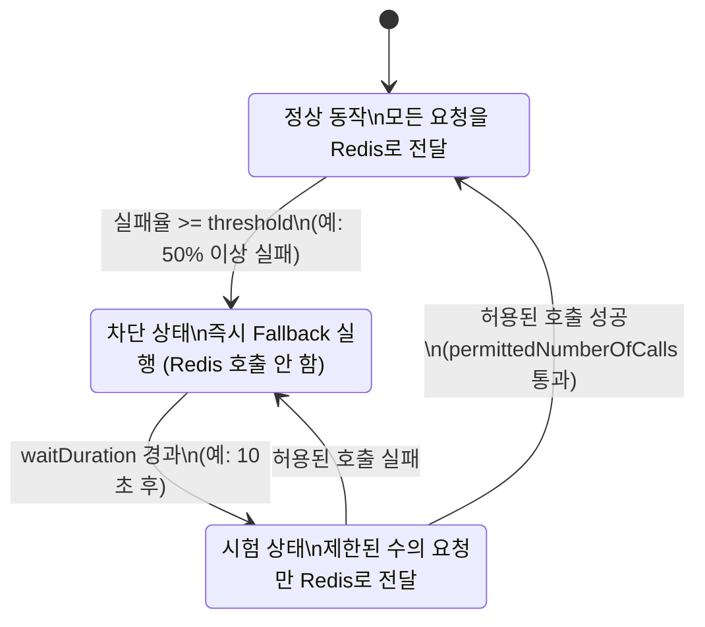
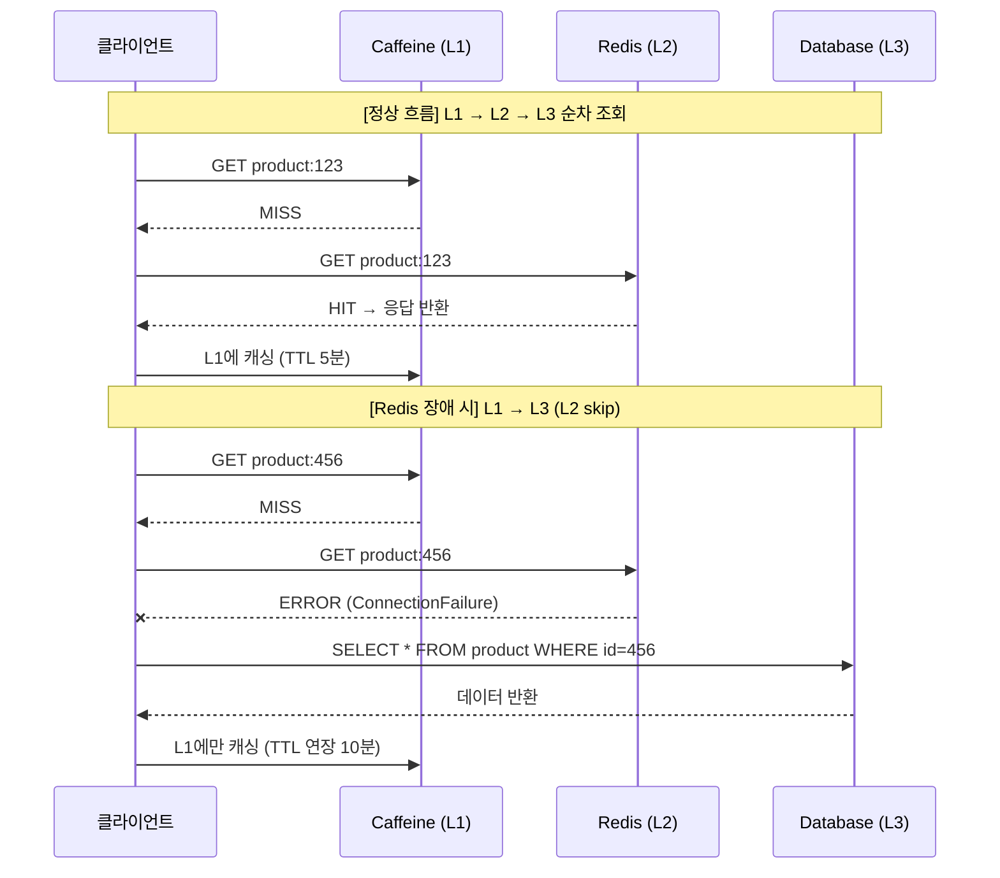
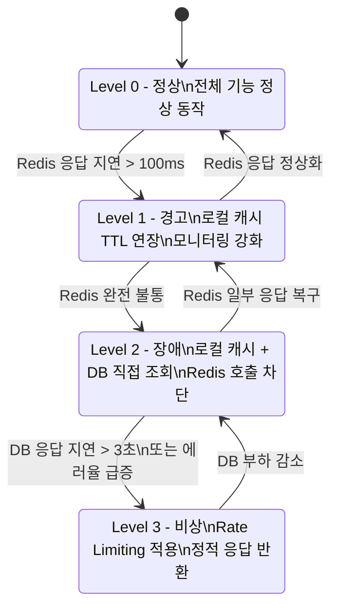

# Redis 장애 시 서비스 Fallback 전략: Graceful Degradation 실전 가이드

Redis 장애가 서비스 전체 장애로 전파되지 않도록 방어하는 Graceful Degradation 전략을 다룬다. Circuit Breaker와 Resilience4j 통합, Caffeine → Redis → DB 3-tier Fallback 구조, Health Check 기반 장애 감지, Degradation Level 설계, 그리고 복구 후 자동 캐시 워밍까지 프로덕션 환경에서 검증된 패턴을 분석한다.

## 목차

1. [핵심 개념 (What)](#1-핵심-개념-what)
2. [왜 알아야 하는가 (Why)](#2-왜-알아야-하는가-why)
3. [내부 구현 분석 (How)](#3-내부-구현-분석-how)
4. [실전 예제](#4-실전-예제)
5. [정리](#5-정리)

---

## 1. 핵심 개념 (What)

### Redis 장애 유형 분류

| 장애 유형 | 원인 | 영향 범위 | 복구 시간 |
|-----------|------|----------|----------|
| 네트워크 단절 | 방화벽 변경, 스위치 장애, DNS 문제 | 전체 캐시 접근 불가 | 수초 ~ 수분 |
| 메모리 부족(OOM) | `maxmemory` 도달, eviction 정책 미설정 | 쓰기 실패, 읽기는 가능 | 설정 변경 후 즉시 |
| Master-Slave Failover 지연 | Sentinel/Cluster 자동 장애 복구 중 | 3~30초 간 쓰기/읽기 불가 | 자동 복구 (10~30초) |
| Cluster 노드 다운 | 하드웨어 장애, 프로세스 크래시 | 해당 슬롯의 키만 접근 불가 | 자동 복구 또는 수동 개입 |
| 설정 변경에 의한 재시작 | 배포 중 redis.conf 변경, 버전 업그레이드 | 전체 캐시 소실 (RDB/AOF 없을 시) | 수초 (프로세스 재시작) |
| 느린 명령에 의한 블로킹 | `KEYS *`, 대용량 `SORT`, Lua 스크립트 | 전체 명령 지연 | 해당 명령 완료 시 |

### Graceful Degradation이란?

Graceful Degradation(우아한 성능 저하)은 시스템의 일부 구성요소에 장애가 발생해도 전체 서비스가 중단되지 않도록 점진적으로 기능을 축소하는 방어 전략이다. Redis 캐시가 실패하더라도 사용자는 약간 느린 응답을 받을 뿐, 서비스 자체는 계속 동작해야 한다.

**핵심 원칙**: 캐시는 성능 최적화 레이어이지, 서비스의 필수 의존성이 아니다.

### 핵심 구성요소

| 구성요소 | 역할 | 핵심 기술 |
|----------|------|----------|
| Circuit Breaker | 장애 감지 시 빠른 실패로 리소스 보호 | Resilience4j, failureRateThreshold 기반 상태 전이 |
| Fallback Cache | Redis 장애 시 대체 캐시 레이어 제공 | Caffeine(L1) → Redis(L2) → DB(L3) 다계층 구조 |
| Health Check | Redis 연결 상태를 주기적으로 감시 | Spring Actuator HealthIndicator, 연속 실패 카운트 |
| Cache Warming | 장애 복구 후 캐시를 점진적으로 재구축 | 이벤트 기반 비동기 워밍, RateLimiter로 속도 제어 |

## 2. 왜 알아야 하는가 (Why)

### 실무에서 만나는 시나리오

#### 시나리오 1: Redis OOM → 전체 서비스 다운

```
Redis 메모리 100% 도달
  → maxmemory-policy가 noeviction
  → 모든 SET/SETEX 명령 실패 (OOM command not allowed)
  → 캐시 갱신 불가 → 기존 캐시 TTL 순차 만료
  → 캐시 미스 폭주 → 전체 트래픽이 DB로 집중
  → DB Connection Pool 고갈 → 서비스 전체 다운
```

maxmemory-policy를 `allkeys-lru`로 설정하는 것만으로는 부족하다. 쓰기 실패 자체를 감지하고, 해당 시점부터 로컬 캐시로 전환하는 Fallback 로직이 필요하다.

#### 시나리오 2: Cluster 노드 다운 → 특정 사용자 그룹 장애

```
Redis Cluster 6노드 중 1노드(슬롯 0~5460) 다운
  → 해당 슬롯에 매핑된 키에만 접근 불가
  → 특정 사용자 ID 해시값이 해당 슬롯에 집중
  → 해당 사용자 그룹만 로그인/조회 실패
  → 나머지 사용자는 정상 → 장애 인지 지연
```

Cluster 환경에서는 부분 장애가 발생한다. 전체 장애보다 오히려 감지가 어렵고, 특정 고객군에만 영향이 가므로 Fallback 없이는 CS 폭주로 이어진다.

#### 시나리오 3: Sentinel Failover 중 3~10초 지연

```
Master 노드 프로세스 크래시
  → Sentinel이 장애 감지 (down-after-milliseconds: 5000)
  → Failover 시작 → Slave를 Master로 승격 (3~10초)
  → 그 사이 모든 쓰기 요청 실패
  → 읽기도 stale 데이터 또는 실패 가능
  → Failover 완료 후 클라이언트 재연결 필요
```

5~10초는 짧아 보이지만, 초당 1만 건의 요청을 처리하는 서비스라면 5~10만 건의 요청이 실패한다. Circuit Breaker 없이는 이 모든 요청이 타임아웃까지 대기하며 스레드를 점유한다.

#### 시나리오 4: 배포 중 Redis 재시작 → Cache Stampede

```
배포 스크립트에서 Redis 설정 변경 후 재시작
  → RDB/AOF 비활성화 상태 → 전체 캐시 소실
  → 서비스 인스턴스 N대에서 동시에 캐시 미스
  → 동일 키에 대해 N개의 DB 쿼리 동시 실행
  → Cache Stampede → DB CPU 100% → 연쇄 장애
```

## 3. 내부 구현 분석 (How)

### 3.1 Circuit Breaker + Redis 통합 (Resilience4j)

Circuit Breaker는 연속된 실패를 감지하여 더 이상의 호출을 차단하고, 빠르게 Fallback 경로로 전환하는 패턴이다.

#### 상태 전이 다이어그램



#### CircuitBreaker 설정

```java
@Configuration
public class CircuitBreakerConfig {

    @Bean
    public CircuitBreakerRegistry circuitBreakerRegistry() {
        io.github.resilience4j.circuitbreaker.CircuitBreakerConfig config =
            io.github.resilience4j.circuitbreaker.CircuitBreakerConfig.custom()
                // 슬라이딩 윈도우 내 실패율이 50% 이상이면 OPEN
                .failureRateThreshold(50)
                // OPEN 상태에서 10초 후 HALF_OPEN 전이
                .waitDurationInOpenState(Duration.ofSeconds(10))
                // 최근 10건의 호출을 기준으로 실패율 계산
                .slidingWindowType(SlidingWindowType.COUNT_BASED)
                .slidingWindowSize(10)
                // HALF_OPEN에서 허용할 시험 호출 수
                .permittedNumberOfCallsInHalfOpenState(3)
                // 최소 호출 수 미달 시 실패율 계산 안 함
                .minimumNumberOfCalls(5)
                // Redis 관련 예외만 실패로 집계
                .recordExceptions(
                    RedisConnectionFailureException.class,
                    RedisCommandTimeoutException.class,
                    QueryTimeoutException.class
                )
                // 비즈니스 예외는 실패로 집계하지 않음
                .ignoreExceptions(
                    RedisCommandExecutionException.class
                )
                .build();

        return CircuitBreakerRegistry.of(config);
    }
}
```

#### 어노테이션 기반 Fallback 구현

```java
@Service
@Slf4j
public class RedisCacheService {

    private final RedisTemplate<String, Object> redisTemplate;
    private final CacheManager caffeineCacheManager;

    public RedisCacheService(RedisTemplate<String, Object> redisTemplate,
                             @Qualifier("caffeineCacheManager") CacheManager caffeineCacheManager) {
        this.redisTemplate = redisTemplate;
        this.caffeineCacheManager = caffeineCacheManager;
    }

    @CircuitBreaker(name = "redis", fallbackMethod = "getFromLocalCache")
    public Object get(String key) {
        return redisTemplate.opsForValue().get(key);
    }

    @CircuitBreaker(name = "redis", fallbackMethod = "setToLocalCache")
    public void set(String key, Object value, Duration ttl) {
        redisTemplate.opsForValue().set(key, value, ttl);
    }

    /**
     * Redis 장애 시 Fallback: Caffeine 로컬 캐시에서 조회
     */
    private Object getFromLocalCache(String key, Throwable t) {
        log.warn("Redis 조회 실패, 로컬 캐시 Fallback 실행. key={}, error={}", key, t.getMessage());
        Cache cache = caffeineCacheManager.getCache("fallback");
        if (cache != null) {
            Cache.ValueWrapper wrapper = cache.get(key);
            return wrapper != null ? wrapper.get() : null;
        }
        return null;
    }

    /**
     * Redis 장애 시 Fallback: Caffeine 로컬 캐시에만 저장
     */
    private void setToLocalCache(String key, Object value, Duration ttl, Throwable t) {
        log.warn("Redis 저장 실패, 로컬 캐시에만 저장. key={}, error={}", key, t.getMessage());
        Cache cache = caffeineCacheManager.getCache("fallback");
        if (cache != null) {
            cache.put(key, value);
        }
    }
}
```

### 3.2 Caffeine → Redis → DB 3-tier Fallback

다계층 캐시 구조는 장애 시 상위 레이어가 하위 레이어를 자연스럽게 보완한다.

| 레이어 | 기술 | 용량 | TTL | 특성 |
|--------|------|------|-----|------|
| L1 (로컬) | Caffeine | 최대 10,000건 | 5분 | JVM 내 메모리, 네트워크 비용 없음 |
| L2 (분산) | Redis | 수십 GB | 1시간 | 네트워크 호출 필요, 인스턴스 간 공유 |
| L3 (원본) | Database | 무제한 | 없음 | 가장 느리지만 항상 최신 데이터 보장 |

#### 정상 흐름 vs 장애 시 Fallback 흐름



#### MultiLayerCacheService 구현

```java
@Service
@Slf4j
public class MultiLayerCacheService {

    private final Cache<String, Object> localCache;
    private final RedisTemplate<String, Object> redisTemplate;
    private final CircuitBreaker circuitBreaker;

    private static final Duration L1_TTL = Duration.ofMinutes(5);
    private static final Duration L1_FALLBACK_TTL = Duration.ofMinutes(10);
    private static final Duration L2_TTL = Duration.ofHours(1);

    public MultiLayerCacheService(RedisTemplate<String, Object> redisTemplate,
                                  CircuitBreakerRegistry circuitBreakerRegistry) {
        this.redisTemplate = redisTemplate;
        this.circuitBreaker = circuitBreakerRegistry.circuitBreaker("redis");

        this.localCache = Caffeine.newBuilder()
                .maximumSize(10_000)
                .expireAfterWrite(L1_TTL)
                .recordStats()
                .build();
    }

    public <T> T get(String key, Class<T> type, Supplier<T> dbFallback) {
        // L1: 로컬 캐시 조회
        Object localValue = localCache.getIfPresent(key);
        if (localValue != null) {
            log.debug("L1 캐시 히트: key={}", key);
            return type.cast(localValue);
        }

        // L2: Redis 조회 (Circuit Breaker 적용)
        try {
            T redisValue = circuitBreaker.executeSupplier(() -> {
                Object value = redisTemplate.opsForValue().get(key);
                return value != null ? type.cast(value) : null;
            });

            if (redisValue != null) {
                log.debug("L2 캐시 히트: key={}", key);
                localCache.put(key, redisValue);
                return redisValue;
            }
        } catch (Exception e) {
            log.warn("L2 Redis 조회 실패, DB Fallback 진행: key={}, error={}", key, e.getMessage());
        }

        // L3: DB 조회
        T dbValue = dbFallback.get();
        if (dbValue != null) {
            log.debug("L3 DB 조회 완료: key={}", key);
            // 로컬 캐시에 저장 (Redis 장애 시 TTL 연장)
            localCache.put(key, dbValue);

            // Redis에도 저장 시도 (실패해도 무시)
            trySetToRedis(key, dbValue);
        }
        return dbValue;
    }

    public <T> void put(String key, T value) {
        // L1에 즉시 저장
        localCache.put(key, value);

        // L2에 저장 시도 (Circuit Breaker 적용)
        trySetToRedis(key, value);
    }

    public void evict(String key) {
        localCache.invalidate(key);
        try {
            circuitBreaker.executeRunnable(() -> redisTemplate.delete(key));
        } catch (Exception e) {
            log.warn("Redis 키 삭제 실패: key={}, error={}", key, e.getMessage());
        }
    }

    private void trySetToRedis(String key, Object value) {
        try {
            circuitBreaker.executeRunnable(() ->
                redisTemplate.opsForValue().set(key, value, L2_TTL)
            );
        } catch (Exception e) {
            log.warn("Redis 저장 실패 (무시): key={}, error={}", key, e.getMessage());
        }
    }
}
```

### 3.3 Redis 장애 감지 (Health Check)

#### 커스텀 HealthIndicator 구현

```java
@Component
@Slf4j
public class RedisHealthIndicator implements HealthIndicator {

    private final LettuceConnectionFactory connectionFactory;
    private final AtomicInteger consecutiveFailures = new AtomicInteger(0);
    private final AtomicReference<Instant> lastFailureTime = new AtomicReference<>();

    private static final int FAILURE_THRESHOLD = 3;
    private static final Duration PING_TIMEOUT = Duration.ofSeconds(2);

    public RedisHealthIndicator(LettuceConnectionFactory connectionFactory) {
        this.connectionFactory = connectionFactory;
    }

    @Override
    public Health health() {
        try {
            RedisConnection connection = connectionFactory.getConnection();
            try {
                // PING 명령으로 연결 상태 확인
                String pong = connection.ping();
                if ("PONG".equals(pong)) {
                    consecutiveFailures.set(0);
                    return Health.up()
                            .withDetail("ping", "PONG")
                            .withDetail("consecutiveFailures", 0)
                            .build();
                }
                return buildDegradedHealth("Unexpected ping response: " + pong);
            } finally {
                connection.close();
            }
        } catch (Exception e) {
            int failures = consecutiveFailures.incrementAndGet();
            lastFailureTime.set(Instant.now());
            log.error("Redis health check 실패 (연속 {}회): {}", failures, e.getMessage());

            Health.Builder builder = failures >= FAILURE_THRESHOLD
                    ? Health.down() : Health.status("DEGRADED");

            return builder
                    .withDetail("error", e.getMessage())
                    .withDetail("consecutiveFailures", failures)
                    .withDetail("lastFailureTime", lastFailureTime.get())
                    .build();
        }
    }

    private Health buildDegradedHealth(String message) {
        int failures = consecutiveFailures.incrementAndGet();
        return Health.status("DEGRADED")
                .withDetail("message", message)
                .withDetail("consecutiveFailures", failures)
                .build();
    }

    /**
     * 외부에서 현재 Redis 상태를 간단히 확인하기 위한 메서드
     */
    public boolean isHealthy() {
        return consecutiveFailures.get() < FAILURE_THRESHOLD;
    }

    public int getConsecutiveFailures() {
        return consecutiveFailures.get();
    }
}
```

#### 주기적 Health Check 스케줄러

```java
@Component
@Slf4j
public class RedisHealthCheckScheduler {

    private final RedisHealthIndicator healthIndicator;
    private final ApplicationEventPublisher eventPublisher;
    private final AtomicBoolean wasHealthy = new AtomicBoolean(true);

    public RedisHealthCheckScheduler(RedisHealthIndicator healthIndicator,
                                     ApplicationEventPublisher eventPublisher) {
        this.healthIndicator = healthIndicator;
        this.eventPublisher = eventPublisher;
    }

    @Scheduled(fixedDelay = 5000) // 5초마다 체크
    public void checkHealth() {
        boolean currentlyHealthy = healthIndicator.isHealthy();
        boolean previouslyHealthy = wasHealthy.getAndSet(currentlyHealthy);

        if (previouslyHealthy && !currentlyHealthy) {
            log.error("Redis 장애 감지! Fallback 모드로 전환합니다.");
            eventPublisher.publishEvent(new RedisConnectionFailedEvent(this));
        }

        if (!previouslyHealthy && currentlyHealthy) {
            log.info("Redis 연결 복구 감지! 캐시 워밍을 시작합니다.");
            eventPublisher.publishEvent(new RedisConnectionRecoveredEvent(this));
        }
    }
}
```

#### 이벤트 클래스 정의

```java
public class RedisConnectionFailedEvent extends ApplicationEvent {
    public RedisConnectionFailedEvent(Object source) {
        super(source);
    }
}

public class RedisConnectionRecoveredEvent extends ApplicationEvent {
    public RedisConnectionRecoveredEvent(Object source) {
        super(source);
    }
}
```

### 3.4 Graceful Degradation 레벨 설계

단순히 "Redis가 죽었다/살았다"의 이분법이 아니라, 장애 정도에 따라 단계적으로 대응 수준을 조절해야 한다.



| Level | 상태 | 조건 | 대응 전략 |
|-------|------|------|----------|
| 0 | NORMAL | 모든 시스템 정상 | 전체 기능 정상 동작 |
| 1 | WARNING | Redis 응답 > 100ms 또는 간헐적 실패 | 로컬 캐시 TTL 2배 연장, 모니터링 알림 |
| 2 | FAILURE | Redis 완전 불통 (Circuit Breaker OPEN) | 로컬 캐시 + DB 직접 조회, Redis 호출 중단 |
| 3 | CRITICAL | DB도 과부하 상태 (응답 > 3초) | Rate Limiting 적용, 정적/기본값 응답 반환 |

#### DegradationLevel enum

```java
public enum DegradationLevel {

    NORMAL(0, "정상", "전체 기능 정상 동작"),
    WARNING(1, "경고", "로컬 캐시 TTL 연장, 모니터링 강화"),
    FAILURE(2, "장애", "로컬 캐시 + DB 직접 조회, Redis 차단"),
    CRITICAL(3, "비상", "Rate Limiting + 정적 응답");

    private final int level;
    private final String label;
    private final String description;

    DegradationLevel(int level, String label, String description) {
        this.level = level;
        this.label = label;
        this.description = description;
    }

    public int getLevel() { return level; }
    public String getLabel() { return label; }
    public String getDescription() { return description; }

    public boolean isWorseThan(DegradationLevel other) {
        return this.level > other.level;
    }
}
```

#### DegradationManager 구현

```java
@Component
@Slf4j
public class DegradationManager {

    private final AtomicReference<DegradationLevel> currentLevel =
            new AtomicReference<>(DegradationLevel.NORMAL);
    private final ApplicationEventPublisher eventPublisher;
    private final MeterRegistry meterRegistry;

    public DegradationManager(ApplicationEventPublisher eventPublisher,
                              MeterRegistry meterRegistry) {
        this.eventPublisher = eventPublisher;
        this.meterRegistry = meterRegistry;

        // 현재 레벨을 Gauge로 노출
        Gauge.builder("degradation.level", currentLevel, ref -> ref.get().getLevel())
                .description("Current degradation level (0=NORMAL, 3=CRITICAL)")
                .register(meterRegistry);
    }

    public void updateLevel(DegradationLevel newLevel) {
        DegradationLevel previous = currentLevel.getAndSet(newLevel);
        if (previous != newLevel) {
            log.warn("Degradation 레벨 변경: {} → {}", previous, newLevel);
            meterRegistry.counter("degradation.level.changes",
                    "from", previous.name(), "to", newLevel.name()).increment();
            eventPublisher.publishEvent(
                    new DegradationLevelChangedEvent(this, previous, newLevel));
        }
    }

    public DegradationLevel getCurrentLevel() {
        return currentLevel.get();
    }

    public boolean isNormal() {
        return currentLevel.get() == DegradationLevel.NORMAL;
    }

    public boolean shouldSkipRedis() {
        return currentLevel.get().getLevel() >= DegradationLevel.FAILURE.getLevel();
    }

    public boolean shouldApplyRateLimiting() {
        return currentLevel.get() == DegradationLevel.CRITICAL;
    }
}
```

#### Degradation Level 자동 판정 로직

```java
@Component
@Slf4j
public class DegradationLevelEvaluator {

    private final RedisHealthIndicator healthIndicator;
    private final DegradationManager degradationManager;
    private final CircuitBreakerRegistry circuitBreakerRegistry;

    // 최근 Redis 응답 시간 (슬라이딩 윈도우)
    private final Queue<Long> recentLatencies = new ConcurrentLinkedQueue<>();
    private static final int LATENCY_WINDOW_SIZE = 20;
    private static final long WARNING_LATENCY_MS = 100;

    public DegradationLevelEvaluator(RedisHealthIndicator healthIndicator,
                                     DegradationManager degradationManager,
                                     CircuitBreakerRegistry circuitBreakerRegistry) {
        this.healthIndicator = healthIndicator;
        this.degradationManager = degradationManager;
        this.circuitBreakerRegistry = circuitBreakerRegistry;
    }

    @Scheduled(fixedDelay = 3000) // 3초마다 평가
    public void evaluate() {
        CircuitBreaker cb = circuitBreakerRegistry.circuitBreaker("redis");
        CircuitBreaker.State cbState = cb.getState();

        if (cbState == CircuitBreaker.State.OPEN) {
            // Circuit Breaker가 열려 있으면 최소 FAILURE
            degradationManager.updateLevel(DegradationLevel.FAILURE);
            return;
        }

        if (!healthIndicator.isHealthy()) {
            degradationManager.updateLevel(DegradationLevel.FAILURE);
            return;
        }

        // 평균 응답 시간 기반 WARNING 판단
        double avgLatency = calculateAverageLatency();
        if (avgLatency > WARNING_LATENCY_MS) {
            degradationManager.updateLevel(DegradationLevel.WARNING);
            return;
        }

        degradationManager.updateLevel(DegradationLevel.NORMAL);
    }

    public void recordLatency(long latencyMs) {
        recentLatencies.add(latencyMs);
        while (recentLatencies.size() > LATENCY_WINDOW_SIZE) {
            recentLatencies.poll();
        }
    }

    private double calculateAverageLatency() {
        if (recentLatencies.isEmpty()) return 0;
        return recentLatencies.stream()
                .mapToLong(Long::longValue)
                .average()
                .orElse(0);
    }
}
```

### 3.5 Redis 복구 후 캐시 워밍 자동화

Redis가 복구되면 캐시가 비어있는 상태이므로, DB 부하를 방지하기 위해 인기 데이터부터 점진적으로 캐시를 채워야 한다.

```java
@Component
@Slf4j
public class CacheWarmingHandler implements ApplicationListener<RedisConnectionRecoveredEvent> {

    private final RedisTemplate<String, Object> redisTemplate;
    private final ProductRepository productRepository;
    private final UserRepository userRepository;
    private final RateLimiter warmingRateLimiter;
    private final MeterRegistry meterRegistry;

    private static final int WARMING_BATCH_SIZE = 100;
    private static final Duration WARMING_TTL = Duration.ofHours(1);

    public CacheWarmingHandler(RedisTemplate<String, Object> redisTemplate,
                               ProductRepository productRepository,
                               UserRepository userRepository,
                               MeterRegistry meterRegistry) {
        this.redisTemplate = redisTemplate;
        this.productRepository = productRepository;
        this.userRepository = userRepository;
        this.meterRegistry = meterRegistry;

        // 초당 50건으로 워밍 속도 제한 (DB 부하 방지)
        this.warmingRateLimiter = RateLimiter.create(50.0);
    }

    @Override
    @Async("cacheWarmingExecutor")
    public void onApplicationEvent(RedisConnectionRecoveredEvent event) {
        log.info("Redis 연결 복구 감지. 캐시 워밍을 시작합니다.");
        Counter warmingCounter = meterRegistry.counter("cache.warming.keys");

        try {
            // 1단계: 인기 상품 워밍 (조회수 상위)
            warmPopularProducts(warmingCounter);

            // 2단계: 최근 활성 사용자 세션 워밍
            warmActiveUserSessions(warmingCounter);

            log.info("캐시 워밍 완료. 총 {}건 워밍됨", warmingCounter.count());
        } catch (Exception e) {
            log.error("캐시 워밍 중 오류 발생", e);
        }
    }

    private void warmPopularProducts(Counter counter) {
        log.info("인기 상품 캐시 워밍 시작");
        int page = 0;

        while (true) {
            List<Product> products = productRepository
                    .findTopByOrderByViewCountDesc(PageRequest.of(page, WARMING_BATCH_SIZE));

            if (products.isEmpty()) break;

            for (Product product : products) {
                warmingRateLimiter.acquire(); // 속도 제한 적용
                try {
                    String key = "product:" + product.getId();
                    redisTemplate.opsForValue().set(key, product, WARMING_TTL);
                    counter.increment();
                } catch (Exception e) {
                    log.warn("워밍 실패: product:{}, error={}", product.getId(), e.getMessage());
                    return; // Redis 다시 문제 발생 시 워밍 중단
                }
            }

            page++;
            if (page >= 10) break; // 최대 1,000건까지만 워밍
        }
        log.info("인기 상품 캐시 워밍 완료");
    }

    private void warmActiveUserSessions(Counter counter) {
        log.info("활성 사용자 세션 캐시 워밍 시작");
        Instant since = Instant.now().minus(Duration.ofHours(1));
        List<User> activeUsers = userRepository.findByLastActiveAfter(since);

        for (User user : activeUsers) {
            warmingRateLimiter.acquire();
            try {
                String key = "user:session:" + user.getId();
                redisTemplate.opsForValue().set(key, user.getSessionData(), WARMING_TTL);
                counter.increment();
            } catch (Exception e) {
                log.warn("워밍 실패: user:{}, error={}", user.getId(), e.getMessage());
                return;
            }
        }
        log.info("활성 사용자 세션 워밍 완료: {}건", activeUsers.size());
    }
}
```

#### Async Executor 설정

```java
@Configuration
@EnableAsync
public class AsyncConfig {

    @Bean("cacheWarmingExecutor")
    public Executor cacheWarmingExecutor() {
        ThreadPoolTaskExecutor executor = new ThreadPoolTaskExecutor();
        executor.setCorePoolSize(2);
        executor.setMaxPoolSize(4);
        executor.setQueueCapacity(10);
        executor.setThreadNamePrefix("cache-warming-");
        executor.setRejectedExecutionHandler(new ThreadPoolExecutor.CallerRunsPolicy());
        executor.initialize();
        return executor;
    }
}
```

## 4. 실전 예제

### 4.1 ResilientCacheService 통합 구현

Circuit Breaker, 3-tier Fallback, Degradation Level을 하나의 서비스로 통합한다.

```java
@Service
@Slf4j
public class ResilientCacheService {

    private final Cache<String, CacheEntry> localCache;
    private final RedisTemplate<String, Object> redisTemplate;
    private final CircuitBreaker circuitBreaker;
    private final DegradationManager degradationManager;
    private final MeterRegistry meterRegistry;

    private static final Duration L1_NORMAL_TTL = Duration.ofMinutes(5);
    private static final Duration L1_EXTENDED_TTL = Duration.ofMinutes(15);
    private static final Duration L2_TTL = Duration.ofHours(1);

    public ResilientCacheService(RedisTemplate<String, Object> redisTemplate,
                                 CircuitBreakerRegistry circuitBreakerRegistry,
                                 DegradationManager degradationManager,
                                 MeterRegistry meterRegistry) {
        this.redisTemplate = redisTemplate;
        this.circuitBreaker = circuitBreakerRegistry.circuitBreaker("redis");
        this.degradationManager = degradationManager;
        this.meterRegistry = meterRegistry;

        this.localCache = Caffeine.newBuilder()
                .maximumSize(10_000)
                .expireAfter(new DynamicExpiry(degradationManager))
                .recordStats()
                .build();
    }

    /**
     * Degradation Level에 따라 조회 전략을 자동 전환하는 핵심 메서드
     */
    public <T> T get(String key, Class<T> type, Supplier<T> dbFallback) {
        // L1: 로컬 캐시 조회 (항상 시도)
        CacheEntry entry = localCache.getIfPresent(key);
        if (entry != null && !entry.isExpired()) {
            meterRegistry.counter("cache.hit", "layer", "L1").increment();
            return type.cast(entry.getValue());
        }

        // Degradation Level 2 이상이면 Redis 건너뜀
        if (!degradationManager.shouldSkipRedis()) {
            try {
                T redisValue = circuitBreaker.executeSupplier(() -> {
                    Object value = redisTemplate.opsForValue().get(key);
                    return value != null ? type.cast(value) : null;
                });

                if (redisValue != null) {
                    meterRegistry.counter("cache.hit", "layer", "L2").increment();
                    localCache.put(key, new CacheEntry(redisValue));
                    return redisValue;
                }
            } catch (Exception e) {
                meterRegistry.counter("cache.fallback", "reason", "redis_error").increment();
                log.warn("Redis 조회 실패: key={}, error={}", key, e.getMessage());
            }
        } else {
            meterRegistry.counter("cache.skip", "layer", "L2").increment();
        }

        // Rate Limiting 적용 (CRITICAL 레벨)
        if (degradationManager.shouldApplyRateLimiting()) {
            meterRegistry.counter("cache.rate_limited").increment();
            log.warn("CRITICAL 레벨: 정적 기본값 반환. key={}", key);
            return null; // 또는 정적 기본값 반환
        }

        // L3: DB 조회
        T dbValue = dbFallback.get();
        if (dbValue != null) {
            meterRegistry.counter("cache.hit", "layer", "L3").increment();
            localCache.put(key, new CacheEntry(dbValue));
            trySetToRedis(key, dbValue);
        }
        return dbValue;
    }

    public <T> void put(String key, T value) {
        localCache.put(key, new CacheEntry(value));
        trySetToRedis(key, value);
    }

    public void evict(String key) {
        localCache.invalidate(key);
        try {
            circuitBreaker.executeRunnable(() -> redisTemplate.delete(key));
        } catch (Exception e) {
            log.warn("Redis 삭제 실패 (무시): key={}", key, e.getMessage());
        }
    }

    private void trySetToRedis(String key, Object value) {
        if (degradationManager.shouldSkipRedis()) return;
        try {
            circuitBreaker.executeRunnable(() ->
                redisTemplate.opsForValue().set(key, value, L2_TTL));
        } catch (Exception e) {
            log.debug("Redis 저장 실패 (무시): key={}", key);
        }
    }

    /**
     * Degradation Level에 따라 L1 캐시 TTL을 동적으로 조절
     */
    private static class DynamicExpiry implements Expiry<String, CacheEntry> {
        private final DegradationManager degradationManager;

        DynamicExpiry(DegradationManager degradationManager) {
            this.degradationManager = degradationManager;
        }

        @Override
        public long expireAfterCreate(String key, CacheEntry value, long currentTime) {
            return getTtlNanos();
        }

        @Override
        public long expireAfterUpdate(String key, CacheEntry value,
                                       long currentTime, long currentDuration) {
            return getTtlNanos();
        }

        @Override
        public long expireAfterRead(String key, CacheEntry value,
                                     long currentTime, long currentDuration) {
            return currentDuration; // 읽기 시 TTL 변경 없음
        }

        private long getTtlNanos() {
            if (degradationManager.shouldSkipRedis()) {
                return L1_EXTENDED_TTL.toNanos(); // 장애 시 TTL 3배 연장
            }
            return L1_NORMAL_TTL.toNanos();
        }
    }

    /**
     * 캐시 엔트리 래퍼 (생성 시간 포함)
     */
    @Getter
    private static class CacheEntry {
        private final Object value;
        private final Instant createdAt;

        CacheEntry(Object value) {
            this.value = value;
            this.createdAt = Instant.now();
        }

        boolean isExpired() {
            return false; // Caffeine의 Expiry가 관리
        }
    }
}
```

### 4.2 application.yml 설정

```yaml
spring:
  # Redis (Lettuce) 설정
  data:
    redis:
      host: ${REDIS_HOST:localhost}
      port: ${REDIS_PORT:6379}
      password: ${REDIS_PASSWORD:}
      timeout: 2000ms           # 명령 타임아웃
      connect-timeout: 3000ms   # 연결 타임아웃
      lettuce:
        pool:
          max-active: 50        # 최대 활성 연결
          max-idle: 20          # 최대 유휴 연결
          min-idle: 5           # 최소 유휴 연결
          max-wait: 1000ms      # 연결 대기 타임아웃
        shutdown-timeout: 2000ms

  # Caffeine 로컬 캐시 설정
  cache:
    caffeine:
      spec: maximumSize=10000,expireAfterWrite=5m,recordStats

# Resilience4j Circuit Breaker 설정
resilience4j:
  circuitbreaker:
    instances:
      redis:
        failure-rate-threshold: 50          # 실패율 50% 초과 시 OPEN
        wait-duration-in-open-state: 10s    # OPEN 상태 유지 시간
        sliding-window-type: COUNT_BASED
        sliding-window-size: 10             # 최근 10건 기준
        permitted-number-of-calls-in-half-open-state: 3
        minimum-number-of-calls: 5          # 최소 5건 이후 평가 시작
        record-exceptions:
          - org.springframework.data.redis.RedisConnectionFailureException
          - org.springframework.data.redis.RedisSystemException
          - io.lettuce.core.RedisCommandTimeoutException
        ignore-exceptions:
          - org.springframework.data.redis.RedisCommandExecutionException
    metrics:
      enabled: true

# Actuator 설정
management:
  endpoints:
    web:
      exposure:
        include: health,metrics,circuitbreakers,caches
  endpoint:
    health:
      show-details: always
  health:
    redis:
      enabled: true
  metrics:
    tags:
      application: ${spring.application.name}
```

### 4.3 모니터링 메트릭 노출

```java
@Component
public class CacheMetricsExporter implements MeterBinder {

    private final CircuitBreakerRegistry circuitBreakerRegistry;
    private final DegradationManager degradationManager;

    public CacheMetricsExporter(CircuitBreakerRegistry circuitBreakerRegistry,
                                DegradationManager degradationManager) {
        this.circuitBreakerRegistry = circuitBreakerRegistry;
        this.degradationManager = degradationManager;
    }

    @Override
    public void bindTo(MeterRegistry registry) {
        CircuitBreaker cb = circuitBreakerRegistry.circuitBreaker("redis");

        // Circuit Breaker 상태 (0=CLOSED, 1=OPEN, 2=HALF_OPEN)
        Gauge.builder("redis.circuitbreaker.state", cb, breaker -> {
            return switch (breaker.getState()) {
                case CLOSED -> 0;
                case OPEN -> 1;
                case HALF_OPEN -> 2;
                default -> -1;
            };
        }).description("Redis Circuit Breaker state")
          .register(registry);

        // Circuit Breaker 실패율
        Gauge.builder("redis.circuitbreaker.failure_rate", cb,
                breaker -> breaker.getMetrics().getFailureRate())
                .description("Redis Circuit Breaker failure rate")
                .register(registry);

        // Circuit Breaker 호출 통계
        Gauge.builder("redis.circuitbreaker.buffered_calls", cb,
                breaker -> breaker.getMetrics().getNumberOfBufferedCalls())
                .description("Number of buffered calls")
                .register(registry);

        Gauge.builder("redis.circuitbreaker.failed_calls", cb,
                breaker -> breaker.getMetrics().getNumberOfFailedCalls())
                .description("Number of failed calls")
                .register(registry);

        // Degradation 레벨
        Gauge.builder("degradation.current_level", degradationManager,
                dm -> dm.getCurrentLevel().getLevel())
                .description("Current degradation level")
                .register(registry);
    }
}
```

#### Grafana 대시보드용 PromQL 예시

```
# Circuit Breaker 상태 패널
redis_circuitbreaker_state

# 캐시 레이어별 히트율 (5분 평균)
rate(cache_hit_total{layer="L1"}[5m]) /
(rate(cache_hit_total{layer="L1"}[5m]) + rate(cache_hit_total{layer="L2"}[5m]) + rate(cache_hit_total{layer="L3"}[5m]))

# Fallback 발동 횟수 (분당)
rate(cache_fallback_total[1m]) * 60

# Degradation 레벨 변화 히스토리
degradation_current_level

# Redis 장애 시 DB 직접 호출 증가 추이
rate(cache_hit_total{layer="L3"}[5m])
```

## 5. 정리

| 항목 | 설명 |
|------|------|
| Circuit Breaker | 연속 실패 감지 시 Redis 호출을 차단하고 Fallback으로 즉시 전환. Resilience4j의 상태 머신(CLOSED → OPEN → HALF_OPEN)으로 자동 복구 시도 |
| 3-tier Fallback | Caffeine(L1) → Redis(L2) → DB(L3) 다계층 구조. Redis 장애 시 L2를 건너뛰고 L1 + L3으로 서비스 지속 |
| Health Check | LettuceConnectionFactory 기반 PING 체크 + 연속 실패 카운트로 장애 판정. Spring Event로 상태 변경 전파 |
| Degradation Level | NORMAL → WARNING → FAILURE → CRITICAL 4단계. 장애 정도에 따라 TTL 연장, Redis 차단, Rate Limiting을 자동 적용 |
| Cache Warming | RedisConnectionRecoveredEvent 리스너로 복구 감지. RateLimiter(초당 50건)로 인기 데이터부터 점진적 워밍 |
| 모니터링 | MeterBinder로 Circuit Breaker 상태, 캐시 히트율, Fallback 횟수, Degradation 레벨을 Prometheus 메트릭으로 노출 |

> **실무 핵심 원칙**: Redis는 "있으면 빠른 것"이지 "없으면 안 되는 것"이 아니다. 캐시 레이어의 장애가 서비스 전체 장애로 이어지지 않도록 설계하는 것이 시니어 개발자의 역할이다.

---

*참고: Redis 7.x / Spring Boot 3.x 기준*
