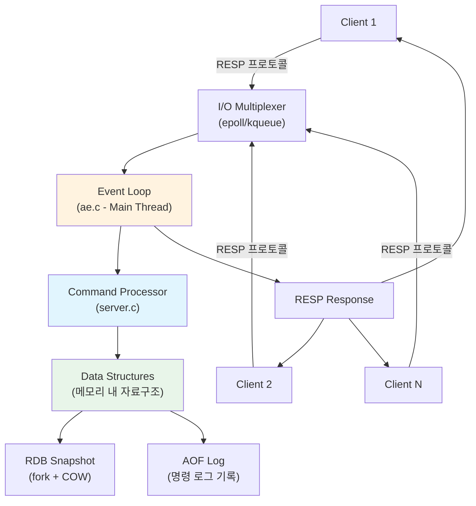
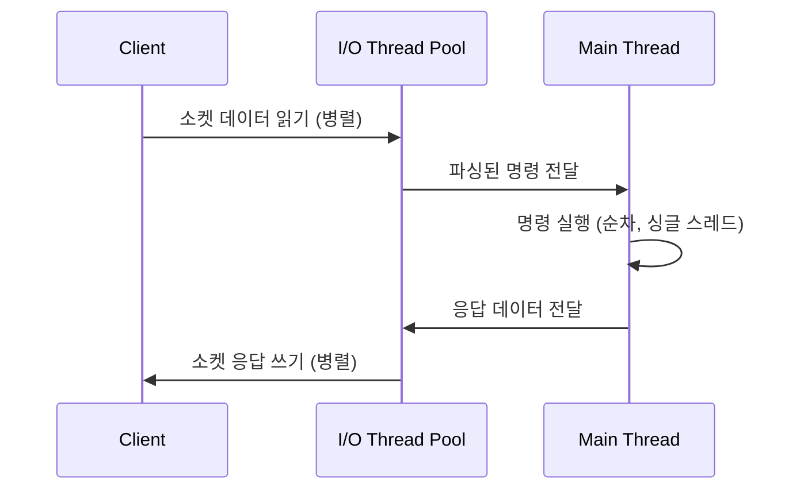

# Redis 기초와 아키텍처 개요

Redis(Remote Dictionary Server)는 C언어로 작성된 인메모리 데이터 구조 저장소로, 싱글 스레드 이벤트 루프 기반의 아키텍처를 통해 초당 수십만 건의 명령을 원자적으로 처리한다. 이 문서에서는 Redis가 왜 빠른지, 핵심 특성은 무엇인지, 그리고 서버 아키텍처의 전체 흐름을 분석한다.

## 목차

1. [핵심 개념 (What)](#1-핵심-개념-what)
2. [왜 알아야 하는가 (Why)](#2-왜-알아야-하는가-why)
3. [내부 구현 분석 (How)](#3-내부-구현-분석-how)
4. [실전 예제](#4-실전-예제)
5. [정리](#5-정리)

---

## 1. 핵심 개념 (What)

### Redis란?

Redis는 **키-값(Key-Value) 기반의 인메모리 데이터 구조 저장소**다. 단순한 캐시를 넘어 메시지 브로커, 세션 저장소, 실시간 분석 엔진 등 다양한 역할을 수행한다. 모든 데이터를 메모리에 저장하고, 싱글 스레드 이벤트 루프로 요청을 처리하여 마이크로초 단위의 응답 속도를 제공한다.

### 핵심 구성요소

| 구성요소 | 역할 |
|---------|------|
| **인메모리 저장** | 모든 데이터를 RAM에 저장하여 디스크 I/O 병목 제거 |
| **싱글 스레드 이벤트 루프** | `ae` 라이브러리 기반으로 I/O 멀티플렉싱을 통해 수천 개의 동시 연결 처리 |
| **원자적 명령 실행** | 각 명령이 중단 없이 완전히 실행되어 락 없는 동시성 보장 |
| **다양한 자료구조** | String, List, Set, Hash, Sorted Set, Stream 등 풍부한 내장 자료구조 |
| **영속성 옵션** | RDB 스냅샷과 AOF 로그를 통한 선택적 데이터 영속화 |
| **RESP 프로토콜** | 간단하고 효율적인 직렬화 프로토콜로 클라이언트-서버 통신 |

### Redis가 빠른 3가지 이유

1. **인메모리**: 디스크 대비 약 1000배 빠른 RAM 접근 속도 (RAM ~100ns vs SSD ~100us)
2. **C언어 구현**: 시스템 레벨 최적화, jemalloc 메모리 할당자 사용
3. **이벤트 기반 I/O**: epoll/kqueue를 사용한 논블로킹 I/O 멀티플렉싱

## 2. 왜 알아야 하는가 (Why)

### 실무에서 만나는 상황

1. **캐시 레이어 설계 시**: DB 앞단에 Redis를 캐시로 두어 읽기 성능을 수백 배 향상시킬 수 있다. 이때 Redis의 싱글 스레드 특성과 원자성을 이해해야 캐시 무효화 전략을 올바르게 설계할 수 있다.

2. **분산 락 구현 시**: `SETNX`와 TTL을 조합한 분산 락을 구현할 때, Redis 명령의 원자성이 보장되는 범위를 정확히 이해해야 레이스 컨디션을 방지할 수 있다.

3. **실시간 랭킹/카운터 시스템**: Sorted Set의 `O(log N)` 연산 특성과 INCR의 원자적 증가를 활용하려면 Redis의 내부 자료구조를 이해해야 한다.

4. **장애 대응과 용량 계획**: Redis가 싱글 스레드라는 것을 알아야 `KEYS *` 같은 블로킹 명령이 전체 서비스에 미치는 영향을 예측하고, 적절한 메모리 용량을 계획할 수 있다.

## 3. 내부 구현 분석 (How)

### 3.1 서버 아키텍처 다이어그램



### 3.2 싱글 스레드 이벤트 루프

Redis 서버의 핵심은 `ae` 라이브러리의 이벤트 루프다. 메인 스레드 하나가 모든 클라이언트 요청을 순차적으로 처리한다.

```c
// server.c - Redis 메인 진입점 (핵심 구조)
int main(int argc, char **argv) {
    initServerConfig();       // 설정 초기화
    initServer();             // 서버 자료구조 초기화

    // 이벤트 루프 생성
    server.el = aeCreateEventLoop(server.maxclients + CONFIG_FDSET_INCR);

    // TCP 리스닝 소켓에 이벤트 핸들러 등록
    aeCreateFileEvent(server.el, fd, AE_READABLE, acceptTcpHandler, NULL);

    // 메인 이벤트 루프 (여기서 블로킹)
    aeMain(server.el);
    return 0;
}

// ae.c - 메인 이벤트 루프
void aeMain(aeEventLoop *eventLoop) {
    eventLoop->stop = 0;
    while (!eventLoop->stop) {
        // beforeSleep: 응답 버퍼 플러시, 만료 키 정리 등
        if (eventLoop->beforesleep != NULL)
            eventLoop->beforesleep(eventLoop);

        // 이벤트 처리 (I/O 멀티플렉싱)
        aeProcessEvents(eventLoop, AE_ALL_EVENTS | AE_CALL_AFTER_SLEEP);
    }
}
```

**싱글 스레드의 장점:**

| 장점 | 설명 |
|------|------|
| 락 불필요 | 데이터 구조 접근 시 동기화 오버헤드 없음 |
| 컨텍스트 스위칭 없음 | CPU 캐시 효율 극대화 |
| 원자성 보장 | 모든 명령이 중단 없이 실행됨 |
| 예측 가능한 지연 시간 | 일관된 응답 속도 보장 |

### 3.3 RESP (REdis Serialization Protocol)

Redis 클라이언트와 서버는 RESP 프로토콜로 통신한다. 단순한 텍스트 기반 프로토콜이라 파싱이 빠르다.

```
# RESP 데이터 타입
+ Simple String:  +OK\r\n
- Error:          -ERR unknown command\r\n
: Integer:        :1000\r\n
$ Bulk String:    $5\r\nhello\r\n
* Array:          *2\r\n$3\r\nfoo\r\n$3\r\nbar\r\n

# 예시: SET mykey myvalue 명령
클라이언트 → 서버:
*3\r\n          (3개 원소 배열)
$3\r\nSET\r\n   (SET 명령)
$5\r\nmykey\r\n (키)
$7\r\nmyvalue\r\n (값)

서버 → 클라이언트:
+OK\r\n         (성공 응답)
```

### 3.4 Redis vs Memcached 비교

| 항목 | Redis | Memcached |
|------|-------|-----------|
| **자료구조** | String, List, Set, Hash, Sorted Set, Stream 등 | String만 지원 |
| **영속성** | RDB, AOF 지원 | 없음 (순수 캐시) |
| **복제** | 마스터-레플리카 지원 | 없음 (별도 구현 필요) |
| **클러스터링** | Redis Cluster 내장 | 클라이언트 측 샤딩 |
| **메모리 효율** | 자료구조별 최적화 인코딩 | 슬랩 할당자 |
| **스레딩** | 싱글 스레드 (I/O 멀티스레딩 가능) | 멀티스레드 |
| **Pub/Sub** | 내장 지원 | 없음 |
| **Lua 스크립팅** | 내장 지원 | 없음 |
| **최대 값 크기** | 512MB | 1MB |
| **사용 사례** | 캐시 + 데이터 저장소 + 메시지 브로커 | 순수 캐시 |

### 3.5 I/O 멀티스레딩 (Redis 6.0+)

Redis 6.0부터 네트워크 I/O 작업만 멀티스레드로 처리할 수 있다. **명령 실행은 여전히 싱글 스레드**이므로 원자성은 유지된다.



```conf
# redis.conf - I/O 스레딩 설정
io-threads 4              # I/O 스레드 수 (CPU 코어에 맞게)
io-threads-do-reads yes   # 읽기도 멀티스레드로 처리
```

## 4. 실전 예제

### 4.1 Docker를 이용한 Redis 설치와 기본 사용

```bash
# Redis 7.x 컨테이너 실행
docker run -d --name redis -p 6379:6379 redis:7-alpine

# redis-cli 접속
docker exec -it redis redis-cli

# 연결 확인
127.0.0.1:6379> PING
PONG

# 서버 정보 확인
127.0.0.1:6379> INFO server
# Server
redis_version:7.2.4
os:Linux 6.1.0 x86_64
tcp_port:6379
process_id:1

# 기본 명령어 실습
127.0.0.1:6379> SET greeting "Hello Redis"
OK
127.0.0.1:6379> GET greeting
"Hello Redis"
127.0.0.1:6379> DEL greeting
(integer) 1

# TTL 설정
127.0.0.1:6379> SET session:abc "user_data" EX 3600
OK
127.0.0.1:6379> TTL session:abc
(integer) 3598
```

### 4.2 Spring Boot에서 Redis 연동 기본 설정

```gradle
// build.gradle
dependencies {
    implementation 'org.springframework.boot:spring-boot-starter-data-redis'
}
```

```yaml
# application.yml
spring:
  data:
    redis:
      host: localhost
      port: 6379
      timeout: 2000ms
      lettuce:
        pool:
          max-active: 8
          max-idle: 8
          min-idle: 2
```

```java
@Configuration
public class RedisConfig {

    @Bean
    public RedisTemplate<String, Object> redisTemplate(
            RedisConnectionFactory connectionFactory) {

        RedisTemplate<String, Object> template = new RedisTemplate<>();
        template.setConnectionFactory(connectionFactory);

        // Key: String 직렬화
        template.setKeySerializer(new StringRedisSerializer());
        template.setHashKeySerializer(new StringRedisSerializer());

        // Value: JSON 직렬화
        GenericJackson2JsonRedisSerializer jsonSerializer =
            new GenericJackson2JsonRedisSerializer();
        template.setValueSerializer(jsonSerializer);
        template.setHashValueSerializer(jsonSerializer);

        template.afterPropertiesSet();
        return template;
    }
}
```

```java
@Service
@RequiredArgsConstructor
public class RedisHealthCheckService {

    private final RedisTemplate<String, Object> redisTemplate;

    /**
     * Redis 서버 연결 상태를 확인한다.
     * INFO 명령으로 서버 정보를 조회하여 버전과 메모리 사용량을 반환한다.
     */
    public Map<String, String> checkHealth() {
        RedisConnection connection = redisTemplate.getConnectionFactory()
            .getConnection();

        Properties info = connection.serverCommands().info();

        Map<String, String> health = new LinkedHashMap<>();
        health.put("redis_version", info.getProperty("redis_version"));
        health.put("used_memory_human", info.getProperty("used_memory_human"));
        health.put("connected_clients", info.getProperty("connected_clients"));
        health.put("uptime_in_days", info.getProperty("uptime_in_days"));

        connection.close();
        return health;
    }

    /**
     * PING 명령으로 Redis 연결을 확인한다.
     */
    public boolean ping() {
        try {
            String response = redisTemplate.getConnectionFactory()
                .getConnection().ping();
            return "PONG".equals(response);
        } catch (Exception e) {
            return false;
        }
    }
}
```

### 4.3 redis-cli 주요 명령 활용

```bash
# 서버 모니터링 (실시간 명령 로그)
redis-cli MONITOR

# 슬로우 로그 확인 (10ms 이상 걸린 명령)
redis-cli SLOWLOG GET 10

# 메모리 사용량 확인
redis-cli INFO memory

# 클라이언트 목록 확인
redis-cli CLIENT LIST

# 키 패턴 검색 (프로덕션에서는 SCAN 사용)
redis-cli --scan --pattern "user:*"

# 벤치마크 테스트
redis-cli --intrinsic-latency 10  # 10초간 레이턴시 측정
redis-benchmark -q -n 100000     # 10만건 벤치마크
```

## 5. 정리

| 항목 | 설명 |
|-----|------|
| **인메모리** | 모든 데이터를 RAM에 저장하여 마이크로초 수준의 응답 속도 달성 |
| **싱글 스레드** | 메인 이벤트 루프가 모든 명령을 순차 처리, 락 없이 원자성 보장 |
| **이벤트 루프** | `ae` 라이브러리 기반 epoll/kqueue I/O 멀티플렉싱으로 수천 연결 동시 처리 |
| **RESP 프로토콜** | 텍스트 기반의 단순하고 빠른 클라이언트-서버 통신 프로토콜 |
| **I/O 멀티스레딩** | Redis 6.0+에서 네트워크 I/O만 병렬화, 명령 실행은 여전히 싱글 스레드 |
| **vs Memcached** | Redis는 다양한 자료구조, 영속성, 복제, Pub/Sub을 제공하는 범용 데이터 저장소 |
| **영속성** | RDB(스냅샷) + AOF(명령 로그) 조합으로 데이터 안전성 확보 가능 |

---
*참고: Redis 7.x 기준*
