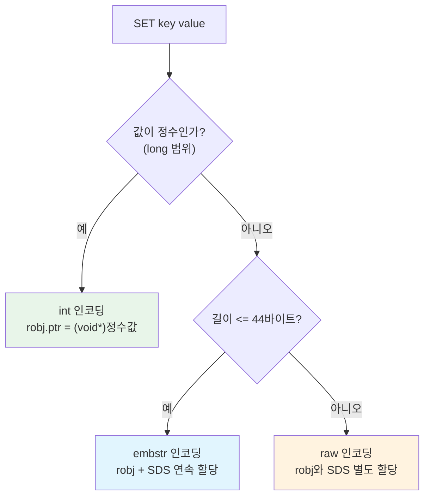

# 데이터 타입 (1): String과 List

Redis의 가장 기본적인 두 자료구조인 String과 List의 내부 구현을 분석한다. String은 SDS(Simple Dynamic String) 위에 int/embstr/raw 인코딩을 적용하고, List는 Quicklist(Listpack + 이중 연결 리스트) 구조로 메모리 효율과 성능을 동시에 달성한다.

## 목차

1. [핵심 개념 (What)](#1-핵심-개념-what)
2. [왜 알아야 하는가 (Why)](#2-왜-알아야-하는가-why)
3. [내부 구현 분석 (How)](#3-내부-구현-분석-how)
4. [실전 예제](#4-실전-예제)
5. [정리](#5-정리)

---

## 1. 핵심 개념 (What)

### String 타입

Redis에서 가장 기본적인 데이터 타입이다. 텍스트, 숫자, 바이너리 데이터를 모두 저장할 수 있으며 최대 크기는 512MB다. 내부적으로 저장되는 값의 특성에 따라 3가지 인코딩(int, embstr, raw) 중 하나를 자동 선택하여 메모리를 최적화한다.

### List 타입

순서가 있는 문자열의 연결 리스트다. 양 끝에서 O(1)으로 삽입/삭제가 가능하며, Redis 7.x에서는 내부적으로 Quicklist(Listpack 노드의 이중 연결 리스트) 구조를 사용한다.

### 주요 명령어 요약

| 타입 | 명령어 | 시간 복잡도 | 설명 |
|------|--------|------------|------|
| String | `SET key value` | O(1) | 값 저장 |
| String | `GET key` | O(1) | 값 조회 |
| String | `INCR key` | O(1) | 정수값 1 증가 (원자적) |
| String | `MGET key1 key2 ...` | O(N) | 여러 키 동시 조회 |
| String | `SETNX key value` | O(1) | 키가 없을 때만 저장 |
| String | `SETEX key seconds value` | O(1) | TTL과 함께 저장 |
| List | `LPUSH key value` | O(1) | 왼쪽에 삽입 |
| List | `RPUSH key value` | O(1) | 오른쪽에 삽입 |
| List | `LPOP key` | O(1) | 왼쪽에서 꺼내기 |
| List | `RPOP key` | O(1) | 오른쪽에서 꺼내기 |
| List | `LRANGE key start stop` | O(S+N) | 범위 조회 |
| List | `BLPOP key timeout` | O(1) | 블로킹 왼쪽 팝 |

## 2. 왜 알아야 하는가 (Why)

### 실무에서 만나는 상황

1. **캐시 설계 시 직렬화 선택**: String에 JSON을 저장할 때 embstr(44바이트 이하)과 raw 인코딩의 경계를 알면, 짧은 값은 별도 메모리 할당 없이 처리되어 성능이 향상된다는 사실을 활용할 수 있다.

2. **카운터 구현 시 정수 인코딩**: `INCR`/`DECR` 연산을 사용할 때, 값이 정수로 표현 가능하면 int 인코딩이 적용되어 문자열 파싱 없이 직접 산술 연산이 수행된다.

3. **메시지 큐 대체**: List의 `BLPOP`을 활용하면 별도 메시지 큐 없이도 간단한 작업 큐를 구현할 수 있다. Quicklist 구조를 이해해야 큰 리스트에서의 성능 특성을 예측할 수 있다.

4. **메모리 최적화**: 수백만 개의 키를 저장할 때, 인코딩 전환 임계값(`list-max-listpack-size` 등)을 조정하면 메모리 사용량을 크게 줄일 수 있다.

## 3. 내부 구현 분석 (How)

### 3.1 SDS (Simple Dynamic String) 내부 구조

Redis는 C 표준 문자열(`char*`) 대신 자체 구현한 SDS를 사용한다. SDS는 길이 정보를 헤더에 저장하여 O(1) 길이 조회, 바이너리 안전성, 버퍼 오버플로우 방지를 제공한다.

```c
// sds.h - SDS 헤더 구조체 (sdshdr8 예시)
struct __attribute__ ((__packed__)) sdshdr8 {
    uint8_t len;        // 사용 중인 바이트 수
    uint8_t alloc;      // 할당된 총 바이트 수 (헤더, 널 종료 제외)
    unsigned char flags; // 헤더 타입 (sdshdr5/8/16/32/64)
    char buf[];          // 실제 데이터 (유연한 배열 멤버)
};
```

```
C 문자열 vs SDS 비교:

C 문자열:   ['H']['e']['l']['l']['o']['\0']
            → strlen()은 O(N), 바이너리 안전하지 않음

SDS:        [len=5][alloc=10][flags][H][e][l][l][o][\0]
            → len 필드로 O(1) 길이 조회, 바이너리 안전
            → alloc - len = 5 (여유 공간, 재할당 최소화)
```

| SDS 헤더 타입 | len 필드 크기 | 최대 문자열 크기 |
|--------------|--------------|----------------|
| `sdshdr5` | 5비트 (flags 내) | 31바이트 |
| `sdshdr8` | 1바이트 | 255바이트 |
| `sdshdr16` | 2바이트 | 64KB |
| `sdshdr32` | 4바이트 | 4GB |
| `sdshdr64` | 8바이트 | 이론상 무제한 |

### 3.2 String 인코딩: int, embstr, raw

Redis는 저장되는 값의 특성에 따라 3가지 인코딩을 자동 선택한다.



```c
// object.c - 인코딩 결정 로직 (핵심)
robj *createStringObject(const char *ptr, size_t len) {
    if (len <= OBJ_ENCODING_EMBSTR_SIZE_LIMIT)  // 44바이트
        return createEmbeddedStringObject(ptr, len);
    else
        return createRawStringObject(ptr, len);
}

// int 인코딩: tryObjectEncoding()에서 정수 변환 시도
robj *tryObjectEncoding(robj *o) {
    long value;
    // 정수로 변환 가능하면 int 인코딩
    if (string2l(s, sdslen(s), &value)) {
        o->encoding = OBJ_ENCODING_INT;
        o->ptr = (void*)value;  // 포인터 자체에 값 저장
        return o;
    }
    // ...
}
```

**인코딩별 메모리 레이아웃:**

```
[int 인코딩]
  robj: type=STRING, encoding=INT, ptr=12345
  → 메모리 할당 1회, 추가 SDS 없음

[embstr 인코딩] (44바이트 이하)
  ┌──────────────────────────────────────┐
  │ robj (16B) │ sdshdr8 (3B) │ data │\0│  ← 연속된 1회 할당
  └──────────────────────────────────────┘
  → malloc 1회, CPU 캐시 친화적

[raw 인코딩] (45바이트 이상)
  ┌──────────┐     ┌─────────────────────┐
  │ robj (16B)│ ──→ │ sdshdr (3~9B) │ data │  ← 별도 2회 할당
  └──────────┘     └─────────────────────┘
  → malloc 2회, 수정 가능
```

### 3.3 Quicklist: List의 내부 구조

Redis 7.x에서 List는 Quicklist로 구현된다. Quicklist는 **Listpack 노드의 이중 연결 리스트**다. 이전 버전의 Ziplist를 대체한 Listpack은 연쇄 업데이트 문제를 해결했다.

```c
// quicklist.h - Quicklist 구조체
typedef struct quicklist {
    quicklistNode *head;    // 첫 번째 노드
    quicklistNode *tail;    // 마지막 노드
    unsigned long count;    // 전체 엔트리 수
    unsigned long len;      // Quicklist 노드 수
    signed int fill : QL_FILL_BITS;  // 노드당 최대 크기/개수
    unsigned int compress : QL_COMP_BITS; // 압축 깊이
} quicklist;

typedef struct quicklistNode {
    struct quicklistNode *prev;  // 이전 노드
    struct quicklistNode *next;  // 다음 노드
    unsigned char *entry;        // Listpack 데이터
    size_t sz;                   // Listpack 바이트 크기
    unsigned int count : 16;     // Listpack 내 엔트리 수
    unsigned int encoding : 2;   // RAW 또는 LZF 압축
} quicklistNode;
```

```
Quicklist 구조 (list-max-listpack-size = 3 예시):

  head                                              tail
   │                                                  │
   ▼                                                  ▼
┌─────────┐     ┌─────────┐     ┌─────────┐     ┌─────────┐
│ Node 1  │◄───►│ Node 2  │◄───►│ Node 3  │◄───►│ Node 4  │
│┌───────┐│     │┌───────┐│     │┌───────┐│     │┌───────┐│
││Listpck││     ││Listpck││     ││  LZF  ││     ││Listpck││
││ A,B,C ││     ││ D,E,F ││     ││압축됨 ││     ││ J,K,L ││
│└───────┘│     │└───────┘│     │└───────┘│     │└───────┘│
└─────────┘     └─────────┘     └─────────┘     └─────────┘
  (비압축)        (비압축)       (LZF 압축)       (비압축)
                            compress=1 → 양 끝 1개씩 비압축
```

### 3.4 Quicklist 설정 파라미터

```conf
# redis.conf
# 노드당 최대 엔트리 수 (양수) 또는 최대 바이트 크기 (음수)
#   -5: 최대 64KB, -4: 32KB, -3: 16KB, -2: 8KB (기본값), -1: 4KB
list-max-listpack-size -2

# 양 끝에서 압축하지 않을 노드 수 (0: 전부 비압축, 기본값)
list-compress-depth 0
```

| 설정값 | 의미 | 사용 시나리오 |
|--------|------|-------------|
| `-2` (기본) | 노드당 최대 8KB | 범용 |
| `-1` | 노드당 최대 4KB | 메모리 절약 우선 |
| `-5` | 노드당 최대 64KB | 대용량 요소 |
| `128` (양수) | 노드당 최대 128개 엔트리 | 엔트리 수 기반 제어 |

### 3.5 List 명령어 시간 복잡도

| 명령어 | 시간 복잡도 | 설명 |
|--------|------------|------|
| `LPUSH` / `RPUSH` | O(1) per element | 양 끝 삽입은 항상 상수 시간 |
| `LPOP` / `RPOP` | O(1) | 양 끝 제거도 상수 시간 |
| `LINDEX index` | O(N) | 중간 접근은 선형 탐색 필요 |
| `LRANGE start stop` | O(S+N) | S: 시작 위치까지 탐색, N: 반환 개수 |
| `LLEN` | O(1) | count 필드 직접 반환 |
| `LINSERT` | O(N) | 피벗 위치까지 탐색 후 삽입 |
| `LSET index value` | O(N) | 인덱스 위치까지 탐색 후 수정 |

## 4. 실전 예제

### 4.1 분산 카운터 구현 (String + INCR)

```java
@Service
@RequiredArgsConstructor
public class DistributedCounterService {

    private final StringRedisTemplate redisTemplate;

    private static final String COUNTER_PREFIX = "counter:";

    /**
     * 원자적 카운터 증가.
     * Redis INCR은 싱글 스레드에서 원자적으로 실행되므로
     * 별도의 분산 락 없이도 정확한 카운팅을 보장한다.
     */
    public long increment(String name) {
        String key = COUNTER_PREFIX + name;
        Long value = redisTemplate.opsForValue().increment(key);
        return value != null ? value : 0L;
    }

    /**
     * 일일 카운터: 자정에 자동 만료.
     * INCR + EXPIRE를 파이프라인으로 묶어 네트워크 왕복을 줄인다.
     */
    public long incrementDaily(String name) {
        String key = COUNTER_PREFIX + "daily:" + LocalDate.now() + ":" + name;

        List<Object> results = redisTemplate.executePipelined(
            (RedisCallback<Object>) connection -> {
                byte[] rawKey = key.getBytes();
                connection.stringCommands().incr(rawKey);
                // 키가 새로 생성된 경우에만 TTL 설정
                connection.keyCommands().expire(rawKey,
                    Duration.between(
                        LocalDateTime.now(),
                        LocalDate.now().plusDays(1).atStartOfDay()
                    ).getSeconds());
                return null;
            }
        );

        return (Long) results.get(0);
    }

    /**
     * 여러 카운터를 한번에 조회 (MGET 활용).
     * N개의 키를 1번의 네트워크 왕복으로 조회한다.
     */
    public Map<String, Long> getCounters(List<String> names) {
        List<String> keys = names.stream()
            .map(name -> COUNTER_PREFIX + name)
            .toList();

        List<String> values = redisTemplate.opsForValue().multiGet(keys);

        Map<String, Long> result = new LinkedHashMap<>();
        for (int i = 0; i < names.size(); i++) {
            String raw = values != null ? values.get(i) : null;
            result.put(names.get(i), raw != null ? Long.parseLong(raw) : 0L);
        }
        return result;
    }
}
```

### 4.2 최근 활동 목록과 간이 메시지 큐 (List)

```java
@Service
@RequiredArgsConstructor
public class RecentActivityService {

    private final StringRedisTemplate redisTemplate;
    private static final int MAX_ACTIVITIES = 50;

    /**
     * 최근 활동을 기록한다.
     * LPUSH로 왼쪽에 추가하고 LTRIM으로 최대 개수를 유지한다.
     */
    public void recordActivity(Long userId, String activityJson) {
        String key = "activity:recent:" + userId;
        redisTemplate.executePipelined((RedisCallback<Object>) connection -> {
            byte[] rawKey = key.getBytes();
            connection.listCommands().lPush(rawKey, activityJson.getBytes());
            connection.listCommands().lTrim(rawKey, 0, MAX_ACTIVITIES - 1);
            connection.keyCommands().expire(rawKey, 30 * 24 * 3600L);
            return null;
        });
    }

    /** LRANGE로 최근 활동 목록을 페이징하여 조회한다. */
    public List<String> getRecentActivities(Long userId, int page, int size) {
        String key = "activity:recent:" + userId;
        return redisTemplate.opsForList()
            .range(key, (long) page * size, (long) page * size + size - 1);
    }

    /**
     * 간이 메시지 큐: RPUSH(생산) + BLPOP(소비)으로 FIFO 큐를 구현한다.
     * BLPOP은 메시지가 올 때까지 블로킹하므로 폴링이 불필요하다.
     */
    public void enqueue(String queueName, String message) {
        redisTemplate.opsForList().rightPush("queue:" + queueName, message);
    }

    public String dequeue(String queueName, Duration timeout) {
        return redisTemplate.opsForList()
            .leftPop("queue:" + queueName, timeout);
    }
}
```

## 5. 정리

| 항목 | String | List |
|-----|--------|------|
| **내부 구조** | SDS (Simple Dynamic String) | Quicklist (Listpack + 이중 연결 리스트) |
| **인코딩** | int (정수), embstr (44B 이하), raw (45B 이상) | Quicklist (listpack 노드) |
| **최대 크기** | 512MB | 2^32 - 1개 요소 (약 42억) |
| **핵심 연산 복잡도** | GET/SET: O(1), MGET: O(N) | LPUSH/RPUSH/LPOP/RPOP: O(1), LRANGE: O(S+N) |
| **메모리 최적화** | int 인코딩은 추가 할당 없음, embstr은 1회 malloc | `list-max-listpack-size`로 노드 크기 제어, LZF 압축 |
| **원자성** | INCR/SETNX 등 원자적 연산 제공 | 개별 명령 원자적, 복합 연산은 Lua 스크립트 필요 |
| **주요 용도** | 캐시, 카운터, 분산 락, 세션 | 메시지 큐, 최근 목록, 타임라인 |

---
*참고: Redis 7.x 기준*
