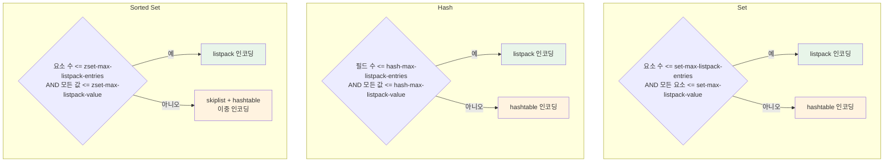

# 데이터 타입 (2): Set, Hash, Sorted Set

Redis의 Set, Hash, Sorted Set은 각각 고유한 내부 인코딩 전략을 통해 소규모 데이터에서는 메모리 효율적인 Listpack을, 대규모 데이터에서는 Hashtable이나 Skiplist를 사용한다. 이 문서에서는 세 자료구조의 내부 구현, 인코딩 전환 조건, 그리고 실전 활용 패턴을 분석한다.

## 목차

1. [핵심 개념 (What)](#1-핵심-개념-what)
2. [왜 알아야 하는가 (Why)](#2-왜-알아야-하는가-why)
3. [내부 구현 분석 (How)](#3-내부-구현-분석-how)
4. [실전 예제](#4-실전-예제)
5. [정리](#5-정리)

---

## 1. 핵심 개념 (What)

### 세 자료구조 개요

| 타입 | 설명 | 인코딩 | 핵심 특성 |
|------|------|--------|----------|
| **Set** | 중복 없는 문자열 집합 | listpack / hashtable | 교집합, 합집합, 차집합 연산 지원 |
| **Hash** | 필드-값 쌍의 컬렉션 | listpack / hashtable | 객체 모델링에 적합, 개별 필드 접근 가능 |
| **Sorted Set** | score로 정렬되는 유니크 집합 | listpack / skiplist+hashtable | 범위 쿼리와 순위 조회 O(log N) |

### 주요 명령어

| 타입 | 명령어 | 시간 복잡도 | 설명 |
|------|--------|------------|------|
| Set | `SADD key member` | O(1) | 멤버 추가 |
| Set | `SISMEMBER key member` | O(1) | 멤버 존재 확인 |
| Set | `SINTER key1 key2` | O(N*M) | 교집합 |
| Set | `SUNION key1 key2` | O(N) | 합집합 |
| Set | `SDIFF key1 key2` | O(N) | 차집합 |
| Hash | `HSET key field value` | O(1) | 필드 설정 |
| Hash | `HGET key field` | O(1) | 필드 조회 |
| Hash | `HGETALL key` | O(N) | 전체 조회 |
| Hash | `HINCRBY key field n` | O(1) | 정수 필드 증가 |
| Sorted Set | `ZADD key score member` | O(log N) | 멤버 추가 |
| Sorted Set | `ZRANGE key start stop` | O(log N + M) | 순위 범위 조회 |
| Sorted Set | `ZRANK key member` | O(log N) | 순위 조회 |
| Sorted Set | `ZRANGEBYSCORE key min max` | O(log N + M) | 점수 범위 조회 |

## 2. 왜 알아야 하는가 (Why)

### 실무에서 만나는 상황

1. **태그/카테고리 시스템 설계 시**: Set의 집합 연산(`SINTER`, `SUNION`)을 활용하면 "Java AND Spring" 같은 다중 태그 필터링을 DB 쿼리 없이 수행할 수 있다. 단, 대규모 Set 간의 `SINTER`는 O(N*M)이므로 성능 영향을 미리 파악해야 한다.

2. **사용자 프로필 캐싱 시**: Hash를 사용하면 사용자 객체의 개별 필드를 독립적으로 읽고 쓸 수 있어, JSON 전체를 직렬화/역직렬화하는 String 방식보다 효율적이다. 인코딩 전환 임계값을 이해해야 메모리 최적화가 가능하다.

3. **실시간 리더보드 구현 시**: Sorted Set은 skiplist 덕분에 `ZRANK`가 O(log N)으로 동작하여, 수백만 명 중 특정 사용자의 실시간 순위를 밀리초 내에 반환할 수 있다.

4. **인코딩 전환에 의한 메모리 급증 대응**: 128개 이하의 요소는 Listpack으로 저장되어 메모리 효율이 좋지만, 임계값을 초과하면 Hashtable로 전환되어 메모리 사용량이 크게 증가한다. 이 경계를 이해해야 용량 계획이 가능하다.

## 3. 내부 구현 분석 (How)

### 3.1 인코딩 전환 아키텍처



### 3.2 인코딩 전환 설정값

```conf
# redis.conf - 기본값 (Redis 7.x)

# Set 인코딩 전환
set-max-listpack-entries 128    # 요소 수 임계값
set-max-listpack-value 64      # 요소 크기 임계값 (바이트)

# Hash 인코딩 전환
hash-max-listpack-entries 128  # 필드 수 임계값
hash-max-listpack-value 64     # 값 크기 임계값 (바이트)

# Sorted Set 인코딩 전환
zset-max-listpack-entries 128  # 요소 수 임계값
zset-max-listpack-value 64     # 값 크기 임계값 (바이트)
```

**Listpack vs Hashtable 메모리 비교:**

| 요소 수 | Listpack | Hashtable | 절약률 |
|---------|----------|-----------|--------|
| 10 | ~200B | ~800B | 약 75% |
| 50 | ~900B | ~3.5KB | 약 74% |
| 100 | ~1.8KB | ~7KB | 약 74% |
| 128 초과 | (전환됨) | ~9KB+ | - |

### 3.3 Set 내부 구현

**Listpack 인코딩** (소규모): 연속된 메모리 블록에 요소를 순차 저장한다. 조회 시 선형 탐색(O(N))이지만, 128개 이하에서는 CPU 캐시 효율 덕분에 Hashtable보다 빠르다.

**Hashtable 인코딩** (대규모): Redis 내장 dict 구조를 사용한다. O(1) 조회를 보장하며, 점진적 리해싱(incremental rehashing)으로 해시 테이블 확장 시에도 블로킹이 발생하지 않는다.

```c
// t_set.c - SADD 구현 (핵심 로직)
void saddCommand(client *c) {
    robj *set = lookupKeyWrite(c->db, c->argv[1]);

    if (set == NULL) {
        // 새 Set 생성: 요소 수에 따라 인코딩 결정
        if (/* 조건 충족 */)
            set = createSetListpackObject();   // listpack
        else
            set = createSetObject();           // hashtable
        dbAdd(c->db, c->argv[1], set);
    }

    // 요소 추가 후 인코딩 전환 필요 여부 확인
    for (j = 2; j < c->argc; j++) {
        if (setTypeAdd(set, c->argv[j]->ptr)) {
            added++;
        }
    }
    // listpack -> hashtable 자동 전환
    setTypeMaybeConvert(set);
}
```

**Progressive Rehashing (점진적 리해싱):**

Set과 Hash가 Hashtable 인코딩을 사용할 때, 해시 테이블 확장/축소 시 Redis는 모든 엔트리를 한 번에 옮기지 않는다. 이는 O(N) 블로킹을 유발하므로, 대신 **두 개의 해시 테이블(ht[0], ht[1])을 동시에 유지하며 점진적으로 마이그레이션**한다.

```
Progressive Rehashing 과정:

단계 1: 확장 필요 (load factor > 1)
  ht[0]: [A][B][C][D]  (4 buckets, 가득 참)
  ht[1]: [ ][ ][ ][ ][ ][ ][ ][ ]  (8 buckets, 새로 할당)
  rehashidx = 0  ← 마이그레이션 시작 위치

단계 2: 명령 실행할 때마다 1개 bucket씩 이동
  ht[0]: [ ][B][C][D]  → bucket[0]의 A를 ht[1]으로 이동
  ht[1]: [ ][ ][A][ ][ ][ ][ ][ ]
  rehashidx = 1

단계 3: 모든 bucket 이동 완료
  ht[0]: (해제)
  ht[1] → ht[0]: [D][ ][A][ ][B][ ][C][ ]
  rehashidx = -1  ← 리해싱 완료
```

리해싱 진행 중에는 **조회 시 ht[0]과 ht[1]을 모두 검색**하고, **삽입은 항상 ht[1]에** 수행한다. 이로써 단일 명령의 지연 없이 백그라운드에서 테이블 확장이 진행된다.

### 3.4 Hash 내부 구현

Hash의 Listpack 인코딩에서는 `[field1][value1][field2][value2]...` 형태로 필드-값 쌍이 연속 저장된다.

```
Listpack 인코딩의 Hash:
┌──────┬────────┬──────┬────────┬──────┬────────┐
│field1│ value1 │field2│ value2 │field3│ value3 │
└──────┴────────┴──────┴────────┴──────┴────────┘
  → 연속 메모리, 선형 탐색 O(N)

Hashtable 인코딩의 Hash:
┌─────────────────────────┐
│  dict (해시 테이블)       │
│  ├─ bucket[0] → entry   │
│  ├─ bucket[1] → entry   │
│  ├─ bucket[2] → NULL    │
│  └─ ...                 │
└─────────────────────────┘
  → 해시 기반, O(1) 조회
```

```bash
# 인코딩 확인 방법
127.0.0.1:6379> HSET user:1 name "Kim" age "30"
(integer) 2
127.0.0.1:6379> OBJECT ENCODING user:1
"listpack"

# 128개 필드 초과 시 전환
127.0.0.1:6379> OBJECT ENCODING user:1
"hashtable"
```

### 3.5 Sorted Set 내부 구현: Skiplist + Hashtable 이중 구조

Sorted Set은 대규모일 때 **두 가지 자료구조를 동시에** 유지한다.

- **Skiplist**: score 기반 범위 쿼리와 순위 조회 (O(log N))
- **Hashtable**: member에서 score로의 O(1) 직접 조회

```c
// server.h - Sorted Set의 이중 구조
typedef struct zset {
    dict *dict;       // member -> score 매핑 (O(1) 조회)
    zskiplist *zsl;   // score 기반 정렬 (범위 쿼리, 순위)
} zset;

// server.h - Skiplist 구조
typedef struct zskiplist {
    struct zskiplistNode *header, *tail;
    unsigned long length;     // 노드 수
    int level;                // 현재 최대 레벨
} zskiplist;

typedef struct zskiplistNode {
    sds ele;                  // member 값
    double score;             // 정렬 점수
    struct zskiplistNode *backward;  // 역방향 포인터
    struct zskiplistLevel {
        struct zskiplistNode *forward; // 전방 포인터
        unsigned long span;            // 스팬 (순위 계산용)
    } level[];                // 유연한 배열 (레벨별 포인터)
} zskiplistNode;
```

```
Skiplist 구조 (ZADD leaderboard 100 A 200 B 300 C 400 D):

Level 3:  HEAD ─────────────────────────────────→ D(400) → NULL
Level 2:  HEAD ───────────→ B(200) ──────────────→ D(400) → NULL
Level 1:  HEAD → A(100) → B(200) → C(300) → D(400) → NULL

  + dict: { "A":100, "B":200, "C":300, "D":400 }

  ZRANK "C"  → skiplist에서 O(log N)으로 순위 계산 (span 합산)
  ZSCORE "C" → dict에서 O(1)으로 score 직접 조회
```

**Skiplist의 확률적 레벨 생성:**

Skiplist는 균형 이진 트리(AVL, Red-Black Tree)와 달리 **회전(rotation) 없이 확률적으로 균형을 유지**한다. 새 노드의 레벨은 동전 던지기처럼 결정된다.

```c
// t_zset.c - 레벨 생성 알고리즘
int zslRandomLevel(void) {
    int level = 1;
    // ZSKIPLIST_P = 0.25 (25% 확률로 레벨 상승)
    while ((random() & 0xFFFF) < (ZSKIPLIST_P * 0xFFFF))
        level += 1;
    return (level < ZSKIPLIST_MAXLEVEL) ? level : ZSKIPLIST_MAXLEVEL;
    // ZSKIPLIST_MAXLEVEL = 32
}
```

```
레벨별 노드 분포 (확률 p=0.25):
  Level 1: 100%  의 노드  ← 모든 노드
  Level 2: 25%   의 노드
  Level 3: 6.25% 의 노드
  Level 4: 1.56% 의 노드
  ...
  Level 32: 거의 0  ← 이론상 최대

예시 (10개 노드 삽입 후):
  L4: HEAD ──────────────────────────────→ G ─────────→ NULL
  L3: HEAD ──────────→ C ────────────────→ G ─────────→ NULL
  L2: HEAD ─→ A ─────→ C ────→ E ────────→ G ────→ I → NULL
  L1: HEAD → A → B → C → D → E → F → G → H → I → J → NULL

  "E"를 찾을 때:
  L4에서 → G보다 작으므로 L3으로 내려감
  L3에서 → C 다음이 G, G보다 작으므로 C에서 L2로 내려감
  L2에서 → C 다음이 E → 발견! (3번만에 도달)
```

**Redis가 균형 트리 대신 Skiplist를 선택한 이유:**

| 비교 항목 | Skiplist | Red-Black Tree |
|----------|----------|----------------|
| 범위 쿼리 (`ZRANGE`) | 시작점 찾은 후 순차 탐색 — 자연스럽고 빠름 | 중위 순회 필요 — 포인터 따라가며 이동 |
| 구현 복잡도 | 간단 (삽입/삭제가 포인터 조작만) | 복잡 (회전, 색상 규칙 유지) |
| 동시성 | 부분 잠금 가능 (레벨별 독립) | 회전 시 넓은 범위 잠금 필요 |
| 메모리 | 평균 노드당 1.33개 포인터 (p=0.25) | 노드당 2개 포인터 + 색상 비트 |
| span 기반 순위 | O(log N) 순위 계산 (span 합산) | 별도 서브트리 크기 관리 필요 |

**이중 구조를 사용하는 이유:**

| 연산 | Skiplist만 | Hashtable만 | 이중 구조 |
|------|-----------|-------------|----------|
| `ZADD` | O(log N) | O(1) | O(log N) |
| `ZSCORE` | O(log N) | **O(1)** | **O(1)** - dict 사용 |
| `ZRANK` | **O(log N)** | O(N) | **O(log N)** - skiplist 사용 |
| `ZRANGE` | **O(log N + M)** | O(N log N) | **O(log N + M)** - skiplist 사용 |

### 3.6 시간 복잡도 종합 분석

| 명령 | Set | Hash | Sorted Set |
|------|-----|------|------------|
| 추가 | `SADD` O(1) | `HSET` O(1) | `ZADD` O(log N) |
| 조회 | `SISMEMBER` O(1) | `HGET` O(1) | `ZSCORE` O(1) |
| 삭제 | `SREM` O(1) | `HDEL` O(1) | `ZREM` O(log N) |
| 전체 조회 | `SMEMBERS` O(N) | `HGETALL` O(N) | `ZRANGE 0 -1` O(N) |
| 개수 | `SCARD` O(1) | `HLEN` O(1) | `ZCARD` O(1) |
| 범위 조회 | - | - | `ZRANGEBYSCORE` O(log N + M) |
| 순위 | - | - | `ZRANK` O(log N) |

## 4. 실전 예제

### 4.1 태그 시스템 (Set)

```java
@Service
@RequiredArgsConstructor
public class TagService {

    private final StringRedisTemplate redisTemplate;

    /** 게시글에 태그를 추가한다. 양방향 인덱싱: post->tags, tag->posts */
    public void addTags(Long postId, Set<String> tags) {
        String postKey = "post:tags:" + postId;
        redisTemplate.executePipelined((RedisCallback<Object>) connection -> {
            for (String tag : tags) {
                connection.setCommands().sAdd(postKey.getBytes(), tag.getBytes());
                connection.setCommands().sAdd(
                    ("tag:posts:" + tag).getBytes(),
                    String.valueOf(postId).getBytes());
            }
            return null;
        });
    }

    /** 여러 태그를 모두 가진 게시글 조회 (SINTER = 교집합) */
    public Set<String> findPostsByAllTags(String... tags) {
        List<String> keys = Arrays.stream(tags)
            .map(tag -> "tag:posts:" + tag).toList();
        return redisTemplate.opsForSet()
            .intersect(keys.get(0), keys.subList(1, keys.size()));
    }

    /** 하나 이상의 태그를 가진 게시글 조회 (SUNION = 합집합) */
    public Set<String> findPostsByAnyTag(String... tags) {
        List<String> keys = Arrays.stream(tags)
            .map(tag -> "tag:posts:" + tag).toList();
        return redisTemplate.opsForSet()
            .union(keys.get(0), keys.subList(1, keys.size()));
    }
}
```

### 4.2 사용자 프로필 캐시 (Hash)

```java
@Service
@RequiredArgsConstructor
public class UserProfileCacheService {

    private final RedisTemplate<String, Object> redisTemplate;
    private static final String PREFIX = "user:profile:";

    /**
     * 사용자 프로필을 Hash로 캐싱한다. 개별 필드 단위 읽기/쓰기 가능.
     * putAll과 expire를 파이프라인으로 묶어 원자성을 보장한다.
     * (별도 실행 시 중간 실패로 TTL 없는 키가 남을 수 있다)
     */
    public void cacheProfile(UserProfile profile) {
        String key = PREFIX + profile.getId();
        Map<String, Object> fields = Map.of(
            "name", profile.getName(), "email", profile.getEmail(),
            "age", String.valueOf(profile.getAge()),
            "loginCount", String.valueOf(profile.getLoginCount()));
        redisTemplate.executePipelined((RedisCallback<Object>) connection -> {
            byte[] rawKey = key.getBytes();
            fields.forEach((field, value) ->
                connection.hashCommands().hSet(rawKey,
                    field.getBytes(), String.valueOf(value).getBytes()));
            connection.keyCommands().expire(rawKey,
                Duration.ofHours(2).getSeconds());
            return null;
        });
    }

    /** HINCRBY로 로그인 횟수를 원자적으로 증가. 전체 프로필 재기록 불필요. */
    public long incrementLoginCount(Long userId) {
        return redisTemplate.opsForHash()
            .increment(PREFIX + userId, "loginCount", 1);
    }

    /** HGETALL로 전체 프로필 조회. O(N)이지만 필드 수가 적으면 빠르다. */
    public Map<Object, Object> getFullProfile(Long userId) {
        return redisTemplate.opsForHash().entries(PREFIX + userId);
    }
}
```

### 4.3 실시간 리더보드 (Sorted Set)

```java
@Service
@RequiredArgsConstructor
public class LeaderboardService {

    private final StringRedisTemplate redisTemplate;
    private static final String KEY = "leaderboard:game";

    /** ZADD O(log N)으로 점수 갱신 */
    public void updateScore(String playerId, double score) {
        redisTemplate.opsForZSet().add(KEY, playerId, score);
    }

    /** ZINCRBY로 원자적 점수 증가 */
    public double addScore(String playerId, double delta) {
        Double score = redisTemplate.opsForZSet().incrementScore(KEY, playerId, delta);
        return score != null ? score : 0.0;
    }

    /** ZREVRANGE로 상위 N명 조회 (내림차순). O(log N + M) */
    public List<RankEntry> getTopPlayers(int count) {
        Set<ZSetOperations.TypedTuple<String>> tuples =
            redisTemplate.opsForZSet()
                .reverseRangeWithScores(KEY, 0, count - 1);
        if (tuples == null) return List.of();

        List<RankEntry> result = new ArrayList<>();
        int rank = 1;
        for (var tuple : tuples) {
            result.add(new RankEntry(rank++, tuple.getValue(), tuple.getScore()));
        }
        return result;
    }

    /** ZREVRANK + ZSCORE로 특정 플레이어의 순위와 점수 조회. O(log N) */
    public RankEntry getPlayerRank(String playerId) {
        Long rank = redisTemplate.opsForZSet().reverseRank(KEY, playerId);
        Double score = redisTemplate.opsForZSet().score(KEY, playerId);
        if (rank == null || score == null) return null;
        return new RankEntry(rank.intValue() + 1, playerId, score);
    }

    public record RankEntry(int rank, String playerId, double score) {}
}
```

### 4.4 좋아요 시스템과 공통 친구 추천 (Set)

```java
@Service
@RequiredArgsConstructor
public class SocialService {

    private final StringRedisTemplate redisTemplate;

    // ── 좋아요 ──

    /** SADD로 좋아요 추가. Set은 중복을 자동 제거하므로 이중 좋아요가 불가능하다. */
    public void like(Long postId, Long userId) {
        redisTemplate.opsForSet()
            .add("post:likes:" + postId, String.valueOf(userId));
    }

    /** SREM으로 좋아요 취소 */
    public void unlike(Long postId, Long userId) {
        redisTemplate.opsForSet()
            .remove("post:likes:" + postId, String.valueOf(userId));
    }

    /** SISMEMBER로 좋아요 여부 확인. O(1) */
    public boolean isLiked(Long postId, Long userId) {
        return Boolean.TRUE.equals(redisTemplate.opsForSet()
            .isMember("post:likes:" + postId, String.valueOf(userId)));
    }

    /** SCARD로 좋아요 수 조회. O(1) — 전체 순회 없이 카운트 반환 */
    public long getLikeCount(Long postId) {
        Long count = redisTemplate.opsForSet().size("post:likes:" + postId);
        return count != null ? count : 0L;
    }

    // ── 공통 친구 ──

    /** SADD로 친구 관계 추가 (양방향) */
    public void addFriend(Long userId, Long friendId) {
        redisTemplate.executePipelined((RedisCallback<Object>) connection -> {
            connection.setCommands().sAdd(
                ("user:friends:" + userId).getBytes(),
                String.valueOf(friendId).getBytes());
            connection.setCommands().sAdd(
                ("user:friends:" + friendId).getBytes(),
                String.valueOf(userId).getBytes());
            return null;
        });
    }

    /**
     * SINTER로 공통 친구를 조회한다.
     * A의 친구 Set과 B의 친구 Set의 교집합 = 공통 친구.
     * O(N*M)이므로 팔로워 수가 매우 많으면 SINTERCARD로 개수만 먼저 확인한다.
     */
    public Set<String> getCommonFriends(Long userId1, Long userId2) {
        return redisTemplate.opsForSet().intersect(
            "user:friends:" + userId1,
            "user:friends:" + userId2);
    }

    /**
     * SDIFF로 친구 추천: "B의 친구 중 A의 친구가 아닌 사람"
     * = B의 친구 Set - A의 친구 Set (차집합)
     */
    public Set<String> recommendFriends(Long userId, Long viaFriendId) {
        return redisTemplate.opsForSet().difference(
            "user:friends:" + viaFriendId,
            "user:friends:" + userId);
    }
}
```

### 4.5 장바구니 (Hash)

```java
@Service
@RequiredArgsConstructor
public class CartService {

    private final StringRedisTemplate redisTemplate;
    private static final String CART_PREFIX = "cart:";

    /**
     * Hash의 field=상품ID, value=수량으로 장바구니를 모델링한다.
     * HINCRBY로 수량을 원자적으로 변경할 수 있어,
     * 동시에 같은 상품을 담아도 정합성이 보장된다.
     */
    public long addItem(Long userId, String productId, int quantity) {
        String key = CART_PREFIX + userId;
        Long newQty = redisTemplate.opsForHash()
            .increment(key, productId, quantity);
        redisTemplate.expire(key, Duration.ofDays(7));
        return newQty != null ? newQty : 0L;
    }

    /** HDEL로 상품 제거 */
    public void removeItem(Long userId, String productId) {
        redisTemplate.opsForHash().delete(CART_PREFIX + userId, productId);
    }

    /**
     * HGETALL로 장바구니 전체 조회.
     * Hash 필드 수가 적으므로 (상품 수십 개) O(N)이어도 문제없다.
     * 필드 수가 128개 이하이면 Listpack 인코딩으로 메모리 효율도 좋다.
     */
    public Map<String, Integer> getCart(Long userId) {
        Map<Object, Object> entries = redisTemplate.opsForHash()
            .entries(CART_PREFIX + userId);

        Map<String, Integer> cart = new LinkedHashMap<>();
        entries.forEach((k, v) ->
            cart.put((String) k, Integer.parseInt((String) v)));
        return cart;
    }

    /** HLEN으로 장바구니 상품 종류 수 조회. O(1) */
    public long getItemCount(Long userId) {
        return redisTemplate.opsForHash().size(CART_PREFIX + userId);
    }

    /** 장바구니 비우기 — 키 자체를 삭제하면 모든 필드가 제거된다 */
    public void clearCart(Long userId) {
        redisTemplate.delete(CART_PREFIX + userId);
    }
}
```

### 4.6 슬라이딩 윈도우 Rate Limiter (Sorted Set)

```java
@Service
@RequiredArgsConstructor
public class RateLimiterService {

    private final StringRedisTemplate redisTemplate;

    /**
     * Sorted Set을 활용한 슬라이딩 윈도우 Rate Limiter.
     *
     * 구조: ZADD rate:{key} {timestamp} {unique_id}
     *   - score = 요청 시각 (밀리초)
     *   - member = 고유 식별자 (중복 방지)
     *
     * 동작 원리:
     *   1. ZREMRANGEBYSCORE로 윈도우 밖의 오래된 요청을 제거
     *   2. ZCARD로 현재 윈도우 내 요청 수를 확인
     *   3. 제한 이하이면 ZADD로 새 요청을 기록
     *
     * 고정 윈도우(fixed window) 방식과 달리 윈도우 경계에서의
     * 버스트를 방지한다.
     *
     * 예: 분당 100회 제한일 때
     *   고정 윈도우: 00:59에 100회 + 01:00에 100회 = 2초간 200회 가능
     *   슬라이딩:    어떤 60초 구간에서든 최대 100회 보장
     */
    public boolean isAllowed(String clientId, int maxRequests,
                             Duration window) {
        String key = "rate:" + clientId;
        long now = System.currentTimeMillis();
        long windowStart = now - window.toMillis();

        List<Object> results = redisTemplate.executePipelined(
            (RedisCallback<Object>) connection -> {
                byte[] rawKey = key.getBytes();
                // ① 윈도우 밖 요청 제거
                connection.zSetCommands()
                    .zRemRangeByScore(rawKey, 0, windowStart);
                // ② 현재 윈도우 내 요청 수 확인
                connection.zSetCommands().zCard(rawKey);
                // ③ 새 요청 추가 (member에 나노초로 고유성 보장)
                connection.zSetCommands().zAdd(rawKey, now,
                    (now + "-" + System.nanoTime()).getBytes());
                // ④ 키 만료 설정 (윈도우 크기 + 여유)
                connection.keyCommands()
                    .expire(rawKey, window.getSeconds() + 1);
                return null;
            }
        );

        long currentCount = (Long) results.get(1);
        if (currentCount >= maxRequests) {
            // 제한 초과 — 방금 추가한 요청도 제거
            redisTemplate.opsForZSet()
                .removeRangeByScore(key, now, now);
            return false;
        }
        return true;
    }
}
```

```
슬라이딩 윈도우 vs 고정 윈도우 비교:

고정 윈도우 (분당 5회 제한):
  |--- 00:00 ---||--- 01:00 ---|
  [  ] [  ] [xx] [xx] [xx] [  ]
                  ↑ 경계에서 xx 5회 연속 가능 (버스트)

슬라이딩 윈도우 (분당 5회 제한):
        |------ 60초 윈도우 ------|
  [ ] [x] [x] [x] [x] [x] [거부]
                              ↑ 어느 60초에서든 최대 5회
```

## 5. 정리

| 항목 | Set | Hash | Sorted Set |
|-----|-----|------|------------|
| **내부 구조** | listpack / hashtable | listpack / hashtable | listpack / skiplist+hashtable |
| **전환 임계값** | 128개 / 64바이트 | 128개 / 64바이트 | 128개 / 64바이트 |
| **핵심 연산** | 집합 연산 (교/합/차) | 필드 단위 읽기/쓰기 | 범위 쿼리, 순위 조회 |
| **조회 복잡도** | O(1) | O(1) | O(log N) |
| **고유 특성** | 중복 자동 제거, 랜덤 추출 | 부분 갱신 가능, 메모리 효율 | score 기반 자동 정렬 |
| **주요 용도** | 태그, 좋아요, 고유 방문자 | 사용자 프로필, 설정 저장 | 리더보드, 타임라인, 우선순위 큐 |
| **메모리 주의사항** | 128개 초과 시 hashtable 전환으로 메모리 증가 | 128개 초과 시 hashtable 전환 | 128개 초과 시 skiplist+dict 이중 구조로 메모리 증가 |

---
*참고: Redis 7.x 기준*
