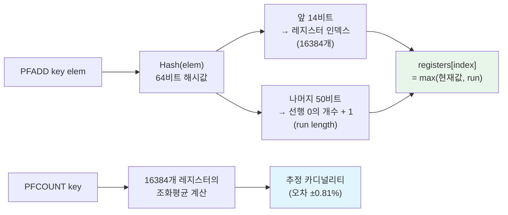
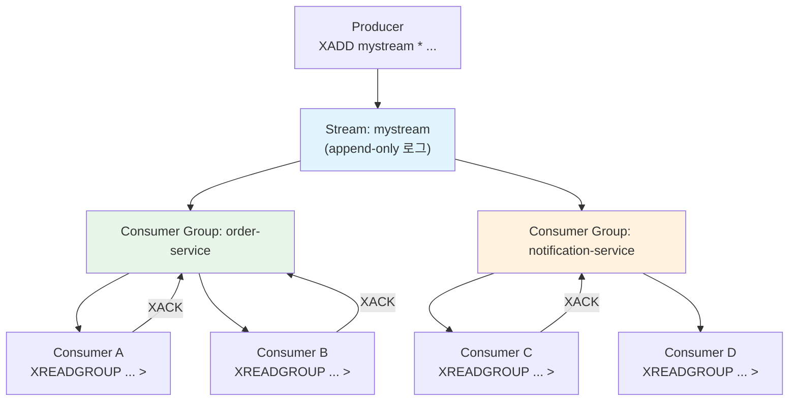

# 특수 데이터 타입: Bitmap, HyperLogLog, Stream

Redis는 기본 자료구조 외에도 특수 목적에 최적화된 데이터 타입을 제공한다. Bitmap은 비트 단위 연산으로 메모리를 극도로 절약하고, HyperLogLog는 12KB 고정 메모리로 수억 개의 고유 원소 수를 추정하며, Stream은 Kafka와 유사한 append-only 로그 구조로 Consumer Group 기반의 메시지 처리를 지원한다.

## 목차

1. [핵심 개념 (What)](#1-핵심-개념-what)
2. [왜 알아야 하는가 (Why)](#2-왜-알아야-하는가-why)
3. [내부 구현 분석 (How)](#3-내부-구현-분석-how)
4. [실전 예제](#4-실전-예제)
5. [정리](#5-정리)

---

## 1. 핵심 개념 (What)

### 특수 데이터 타입 개요

| 타입 | 설명 | 메모리 특성 | 정확도 |
|------|------|-----------|--------|
| **Bitmap** | String 위에 구현된 비트 단위 연산 | 1억 비트 = 약 12MB | 정확 (100%) |
| **HyperLogLog** | 카디널리티(고유 원소 수) 추정 | 고정 12KB | 근사값 (오차율 0.81%) |
| **Stream** | append-only 로그 + Consumer Group | 가변 (Radix Tree + Listpack) | 정확 (100%) |
| **Geospatial** | 좌표 기반 위치 데이터 | Sorted Set 기반 | Geohash 정밀도 |

### 주요 명령어

| 타입 | 명령어 | 시간 복잡도 | 설명 |
|------|--------|------------|------|
| Bitmap | `SETBIT key offset value` | O(1) | 특정 비트 설정 |
| Bitmap | `GETBIT key offset` | O(1) | 특정 비트 조회 |
| Bitmap | `BITCOUNT key [start end]` | O(N) | 1인 비트 개수 |
| Bitmap | `BITOP op dest key1 key2` | O(N) | 비트 논리 연산 |
| HyperLogLog | `PFADD key element` | O(1) | 원소 추가 |
| HyperLogLog | `PFCOUNT key` | O(1) | 고유 원소 수 추정 |
| HyperLogLog | `PFMERGE dest key1 key2` | O(N) | HLL 병합 |
| Stream | `XADD key * field value` | O(1) | 메시지 추가 |
| Stream | `XREAD COUNT n STREAMS key id` | O(N) | 메시지 읽기 |
| Stream | `XREADGROUP GROUP g c STREAMS key >` | O(1) | Consumer Group 읽기 |
| Stream | `XACK key group id` | O(1) | 메시지 처리 확인 |
| Geospatial | `GEOADD key lng lat member` | O(log N) | 위치 추가 |
| Geospatial | `GEOSEARCH key ... BYRADIUS` | O(N+log M) | 반경 내 검색 |

## 2. 왜 알아야 하는가 (Why)

### 실무에서 만나는 상황

1. **일일 활성 사용자(DAU) 추적**: 수천만 사용자의 출석 체크를 DB에 기록하면 테이블이 급격히 커진다. Bitmap을 사용하면 1억 명의 출석을 단 12MB로 추적할 수 있고, `BITCOUNT`로 즉시 DAU를 계산할 수 있다.

2. **고유 방문자(UV) 카운팅**: Set으로 UV를 추적하면 방문자 ID마다 수십 바이트씩 메모리를 차지한다. HyperLogLog를 사용하면 고정 12KB로 수억 명의 UV를 0.81% 오차 내로 추정할 수 있다.

3. **이벤트 소싱/로그 시스템**: 주문, 결제 등의 이벤트를 순서대로 기록하고 여러 Consumer가 독립적으로 처리해야 할 때, Stream의 Consumer Group이 Kafka 없이도 이를 지원한다.

4. **주변 매장 검색**: 사용자의 현재 위치에서 반경 5km 내의 매장을 검색하는 기능을 Geospatial 명령으로 간단하게 구현할 수 있다.

## 3. 내부 구현 분석 (How)

### 3.1 Bitmap: String 위의 비트 연산

Bitmap은 별도의 데이터 타입이 아니라 **String 타입 위에 비트 단위 연산을 수행하는 인터페이스**다. 내부적으로는 SDS(Simple Dynamic String)에 바이트 배열로 저장된다.

```
SETBIT attendance:2025-01-15 42 1

  → String 키의 바이트 5 (42 / 8 = 5), 비트 2 (42 % 8 = 2)에 1을 설정

  바이트 인덱스:  [0]  [1]  [2]  [3]  [4]  [5]  ...
  비트:          00000000 00000000 00000000 00000000 00000000 00100000
                                                            ↑
                                                         offset=42
```

```c
// bitops.c - SETBIT 구현 (핵심)
void setbitCommand(client *c) {
    robj *o;
    size_t bitoffset;
    ssize_t byte, bit;

    bitoffset = (size_t)getLongLongFromObject(c->argv[2]);

    // 바이트 위치와 비트 위치 계산
    byte = bitoffset >> 3;       // bitoffset / 8
    bit = 7 - (bitoffset & 0x7); // 비트 위치 (MSB first)

    // 필요시 String 확장 (자동으로 0으로 채움)
    o = lookupStringForBitCommand(c, bitoffset);

    // 비트 설정
    byteval = ((uint8_t*)o->ptr)[byte];
    bitval = byteval & (1 << bit);
    byteval &= ~(1 << bit);
    byteval |= ((on & 0x1) << bit);
    ((uint8_t*)o->ptr)[byte] = byteval;
}
```

**Bitmap 메모리 효율:**

| 사용자 수 | Set (ID 저장) | Bitmap | 절약률 |
|----------|---------------|--------|--------|
| 100만 | ~40MB | 125KB | 99.7% |
| 1000만 | ~400MB | 1.25MB | 99.7% |
| 1억 | ~4GB | 12.5MB | 99.7% |

### 3.2 HyperLogLog: 확률적 카디널리티 추정

HyperLogLog(HLL)는 고유 원소의 수(카디널리티)를 확률적으로 추정하는 알고리즘이다. Redis에서는 **12KB 고정 메모리**로 2^64개의 고유 원소 수를 0.81% 표준 오차로 추정한다.



**HLL 내부 구조:**

```
Redis HLL 구조 (12KB):
┌────────────────────────────────────────────────────────┐
│ HLL Header (16바이트)                                    │
│  - magic: "HYLL"                                        │
│  - encoding: DENSE(0) 또는 SPARSE(1)                     │
│  - cardinality cache                                     │
├────────────────────────────────────────────────────────┤
│ 16384개 레지스터 (각 6비트 = 12288바이트 ≈ 12KB)          │
│  [reg0: 5][reg1: 3][reg2: 0][reg3: 7]...[reg16383: 2]  │
└────────────────────────────────────────────────────────┘

SPARSE 인코딩: 대부분의 레지스터가 0일 때 RLE 압축으로 메모리 절약
DENSE 인코딩:  레지스터 값이 많아지면 16384*6bit = 12KB 고정
```

**카디널리티 추정 수식:**

HyperLogLog의 추정값은 레지스터들의 **조화평균(harmonic mean)** 에 기반한다.

```
         α_m · m²
E = ─────────────────
     Σ(j=1→m) 2^(-M[j])

  m     = 레지스터 수 (Redis: 16384)
  M[j]  = j번째 레지스터 값 (관측된 최대 선행 0 개수 + 1)
  α_m   = 보정 상수 (m=16384일 때 α ≈ 0.7213 / (1 + 1.079/m))

예시:
  registers = [3, 1, 4, 2, ...]  (16384개)
  → 각 레지스터의 2^(-M[j]): [0.125, 0.5, 0.0625, 0.25, ...]
  → 조화평균의 역수를 합산 → 보정 상수 적용 → 추정 카디널리티
```

조화평균은 산술평균보다 **큰 값의 영향을 줄여주므로**, 해시 충돌로 인한 비정상적으로 큰 레지스터 값이 전체 추정에 미치는 왜곡을 최소화한다. Redis는 여기에 더해 소규모(Linear Counting 전환)와 대규모(2^32 근접 보정)에서의 편향을 추가로 보정한다.

```bash
# HyperLogLog 사용 예시
127.0.0.1:6379> PFADD visitors:2025-01-15 "user1" "user2" "user3"
(integer) 1

127.0.0.1:6379> PFADD visitors:2025-01-15 "user1" "user4"  # user1 중복
(integer) 1

127.0.0.1:6379> PFCOUNT visitors:2025-01-15
(integer) 4  # 고유 원소 4개

# 여러 날의 UV 병합
127.0.0.1:6379> PFMERGE visitors:week visitors:mon visitors:tue visitors:wed
OK
127.0.0.1:6379> PFCOUNT visitors:week
(integer) 1530  # 주간 UV 추정값

# 메모리 사용량 확인
127.0.0.1:6379> MEMORY USAGE visitors:2025-01-15
(integer) 176   # SPARSE: 매우 작음
# 원소가 많아지면 최대 12KB (DENSE)
```

### 3.3 Stream: Append-only 로그와 Consumer Group

Stream은 Redis 5.0에서 도입된 Kafka-like 메시지 스트림이다. 내부적으로 Radix Tree + Listpack 구조를 사용하여 메시지 ID 기반의 효율적인 저장과 범위 조회를 지원한다.

```
Stream 내부 구조:

  Radix Tree (메시지 ID 인덱스)
  ├── 1674000000000-0 ──→ Listpack [field1,val1,field2,val2]
  ├── 1674000000001-0 ──→ Listpack [field1,val1,field2,val2]
  ├── 1674000000002-0 ──→ Listpack [field1,val1,field2,val2]
  └── ...

  메시지 ID 형식: <밀리초 타임스탬프>-<시퀀스 번호>
```

**Consumer Group 개념:**



**핵심 개념:**
- **Consumer Group**: 같은 Stream을 구독하는 Consumer의 논리적 그룹. 각 메시지는 그룹 내 하나의 Consumer에게만 전달된다.
- **PEL (Pending Entries List)**: 전달되었지만 아직 ACK되지 않은 메시지 목록. 장애 복구에 사용된다.
- **XACK**: Consumer가 메시지 처리 완료를 확인하는 명령. ACK 후 PEL에서 제거된다.

```bash
# Stream 기본 사용법
# 메시지 추가 (* = 자동 ID 생성)
127.0.0.1:6379> XADD orders * product "laptop" quantity "1" price "1200"
"1674000000000-0"

127.0.0.1:6379> XADD orders * product "mouse" quantity "2" price "25"
"1674000000001-0"

# 메시지 읽기 (처음부터)
127.0.0.1:6379> XRANGE orders - +
1) 1) "1674000000000-0"
   2) 1) "product" 2) "laptop" 3) "quantity" 4) "1" 5) "price" 6) "1200"
2) 1) "1674000000001-0"
   2) 1) "product" 2) "mouse" 3) "quantity" 4) "2" 5) "price" 6) "25"

# Consumer Group 생성 (0 = 처음부터, $ = 새 메시지부터)
127.0.0.1:6379> XGROUP CREATE orders order-processors 0

# Consumer Group으로 읽기 (> = 아직 전달되지 않은 메시지)
127.0.0.1:6379> XREADGROUP GROUP order-processors consumer-1 COUNT 1 STREAMS orders >
1) 1) "orders"
   2) 1) 1) "1674000000000-0"
         2) 1) "product" 2) "laptop" ...

# 처리 완료 확인
127.0.0.1:6379> XACK orders order-processors 1674000000000-0
(integer) 1

# 미처리 메시지 확인 (PEL)
127.0.0.1:6379> XPENDING orders order-processors - + 10
```

### 3.4 Geospatial: 위치 기반 데이터

Geospatial은 내부적으로 **Sorted Set** 위에 구현된다. 좌표를 Geohash로 변환하여 score로 저장하므로, Sorted Set의 모든 장점(O(log N) 삽입/조회)을 그대로 활용한다.

**Geohash 인코딩 원리:**

Geohash는 2차원 좌표(경도, 위도)를 1차원 정수로 변환하는 알고리즘이다. 경도와 위도를 각각 이진수로 표현한 후, 비트를 번갈아 끼워넣어(interleave) 하나의 52비트 정수를 만든다.

```
GEOADD stores 126.978 37.566 "강남점" 의 내부 동작:

① 경도(longitude) 이진 인코딩 (범위: -180 ~ +180)
   126.978 → 이진 분할 반복 → 11011010110...  (26비트)

② 위도(latitude) 이진 인코딩 (범위: -90 ~ +90)
   37.566  → 이진 분할 반복 → 10110001010...  (26비트)

③ 비트 인터리빙 (경도·위도 교대 배치)
   경도: 1 1 0 1 1 0 1 0 1 1 0 ...
   위도: 1 0 1 1 0 0 0 1 0 1 0 ...
         ↓ ↓ ↓ ↓ ↓ ↓ ↓ ↓ ↓ ↓ ↓
   결합: 11 10 01 11 10 00 01 10 01 11 00 ...

④ 52비트 정수 → Sorted Set의 score로 저장
   ZADD stores <geohash_52bit_integer> "강남점"
```

이 인코딩의 핵심 특성은 **지리적으로 가까운 좌표가 비슷한 정수값을 갖는다**는 점이다. 따라서 Sorted Set의 범위 쿼리(`ZRANGEBYSCORE`)로 근접 좌표를 효율적으로 검색할 수 있다.

| Geohash 비트 수 | 정밀도 | 셀 크기 |
|----------------|--------|---------|
| 26비트 (13+13) | 낮음 | ~630km × ~630km |
| 32비트 (16+16) | 중간 | ~39km × ~20km |
| 52비트 (26+26) | Redis 사용 | ~0.6m × ~0.6m |

> **주의**: Geohash는 지구를 평면으로 근사하므로, 극지방이나 날짜변경선 부근에서는 오차가 커진다. 또한 Geohash 셀 경계 근처의 두 점은 실제로 가깝지만 다른 셀에 속할 수 있어, `GEOSEARCH`는 내부적으로 인접 셀까지 함께 검색한다.

```bash
# 위치 추가
127.0.0.1:6379> GEOADD stores 126.9780 37.5665 "강남점"
127.0.0.1:6379> GEOADD stores 126.9770 37.5726 "종로점"
127.0.0.1:6379> GEOADD stores 127.0276 37.4979 "잠실점"

# 두 지점 사이의 거리
127.0.0.1:6379> GEODIST stores "강남점" "종로점" km
"0.6812"

# 반경 내 검색 (Redis 6.2+)
127.0.0.1:6379> GEOSEARCH stores FROMLONLAT 126.978 37.566 BYRADIUS 5 km ASC
1) "강남점"
2) "종로점"
3) "잠실점"

# 좌표 조회
127.0.0.1:6379> GEOPOS stores "강남점"
1) 1) "126.97800070047378540"
   2) "37.56649888644025041"
```

## 4. 실전 예제

### 4.1 출석 체크 시스템 (Bitmap)

```java
@Service
@RequiredArgsConstructor
public class AttendanceService {

    private final StringRedisTemplate redisTemplate;

    private static final String ATTENDANCE_PREFIX = "attendance:";

    /**
     * 출석 체크를 기록한다.
     * 사용자 ID를 비트 오프셋으로 사용하여 O(1) 시간에 기록.
     * 1억 명의 출석을 12.5MB로 관리할 수 있다.
     */
    public void checkIn(LocalDate date, long userId) {
        String key = ATTENDANCE_PREFIX + date;
        redisTemplate.opsForValue().setBit(key, userId, true);
    }

    /**
     * 특정 날짜의 출석 여부를 확인한다. O(1).
     */
    public boolean isCheckedIn(LocalDate date, long userId) {
        String key = ATTENDANCE_PREFIX + date;
        Boolean result = redisTemplate.opsForValue().getBit(key, userId);
        return Boolean.TRUE.equals(result);
    }

    /**
     * 특정 날짜의 총 출석자 수를 조회한다.
     * BITCOUNT로 1인 비트의 개수를 센다.
     */
    public long getDailyAttendanceCount(LocalDate date) {
        String key = ATTENDANCE_PREFIX + date;
        // Jedis/Lettuce를 통한 BITCOUNT 실행
        return redisTemplate.execute((RedisCallback<Long>) connection ->
            connection.stringCommands().bitCount(key.getBytes())
        );
    }

    /**
     * 연속 출석 일수를 계산한다.
     * 파이프라인으로 N일치의 GETBIT를 한 번에 조회하여
     * 개별 호출 N회 대신 네트워크 왕복 1회로 처리한다.
     */
    public long getConsecutiveAttendance(
            LocalDate startDate, int days, long userId) {

        List<Object> results = redisTemplate.executePipelined(
            (RedisCallback<Object>) connection -> {
                for (int i = 0; i < days; i++) {
                    String key = ATTENDANCE_PREFIX + startDate.minusDays(i);
                    connection.stringCommands().getBit(
                        key.getBytes(), userId);
                }
                return null;
            }
        );

        int count = 0;
        for (Object result : results) {
            if (Boolean.TRUE.equals(result)) {
                count++;
            } else {
                break;
            }
        }
        return count;
    }

    /**
     * 두 날짜 모두 출석한 사용자의 수를 계산한다.
     * BITOP AND로 교집합을 구한 후 BITCOUNT로 개수를 센다.
     */
    public long getCommonAttendanceCount(
            LocalDate date1, LocalDate date2) {

        String key1 = ATTENDANCE_PREFIX + date1;
        String key2 = ATTENDANCE_PREFIX + date2;
        String destKey = "attendance:temp:and:" + UUID.randomUUID();

        redisTemplate.execute((RedisCallback<Long>) connection -> {
            connection.stringCommands().bitOp(
                RedisStringCommands.BitOperation.AND,
                destKey.getBytes(),
                key1.getBytes(), key2.getBytes());
            return null;
        });

        Long count = redisTemplate.execute(
            (RedisCallback<Long>) connection ->
                connection.stringCommands().bitCount(destKey.getBytes())
        );

        redisTemplate.delete(destKey);
        return count != null ? count : 0L;
    }
}
```

### 4.2 UV(Unique Visitor) 카운팅 (HyperLogLog)

```java
@Service
@RequiredArgsConstructor
public class UniqueVisitorService {

    private final StringRedisTemplate redisTemplate;

    private static final String UV_PREFIX = "uv:";

    /**
     * 페이지 방문을 기록한다.
     * PFADD는 O(1)이며, 중복 방문은 자동으로 무시된다.
     * 12KB 고정 메모리로 수억 명의 UV를 추적할 수 있다.
     */
    public void recordVisit(String page, String visitorId) {
        String dailyKey = UV_PREFIX + "daily:" + LocalDate.now()
            + ":" + page;
        String monthlyKey = UV_PREFIX + "monthly:"
            + YearMonth.now() + ":" + page;

        // 일별, 월별 동시 기록 (파이프라인)
        redisTemplate.executePipelined((RedisCallback<Object>) connection -> {
            connection.hyperLogLogCommands().pfAdd(
                dailyKey.getBytes(), visitorId.getBytes());
            connection.hyperLogLogCommands().pfAdd(
                monthlyKey.getBytes(), visitorId.getBytes());

            // 일별 키는 2일 후 만료
            connection.keyCommands().expire(
                dailyKey.getBytes(), 2 * 24 * 3600L);
            return null;
        });
    }

    /**
     * 특정 페이지의 일별 UV를 조회한다.
     * PFCOUNT는 O(1)로 즉시 추정값을 반환한다.
     * 오차율: 표준 오차 0.81%
     */
    public long getDailyUV(LocalDate date, String page) {
        String key = UV_PREFIX + "daily:" + date + ":" + page;
        Long count = redisTemplate.opsForHyperLogLog().size(key);
        return count != null ? count : 0L;
    }

    /**
     * 여러 페이지의 합산 UV를 조회한다.
     * PFMERGE로 여러 HLL을 병합한 후 PFCOUNT로 카운트.
     * 중복 방문자는 자동으로 제거된다.
     */
    public long getTotalUV(LocalDate date, List<String> pages) {
        String destKey = UV_PREFIX + "temp:merge:" + UUID.randomUUID();

        String[] sourceKeys = pages.stream()
            .map(page -> UV_PREFIX + "daily:" + date + ":" + page)
            .toArray(String[]::new);

        redisTemplate.opsForHyperLogLog()
            .union(destKey, sourceKeys);

        Long count = redisTemplate.opsForHyperLogLog().size(destKey);
        redisTemplate.delete(destKey);

        return count != null ? count : 0L;
    }

    /**
     * 주간 UV 트렌드를 조회한다.
     * 파이프라인으로 7일치 PFCOUNT를 한 번에 조회하여
     * 네트워크 왕복을 7회에서 1회로 줄인다.
     */
    public Map<LocalDate, Long> getWeeklyTrend(String page) {
        LocalDate today = LocalDate.now();
        List<LocalDate> dates = new ArrayList<>();
        for (int i = 6; i >= 0; i--) {
            dates.add(today.minusDays(i));
        }

        List<Object> results = redisTemplate.executePipelined(
            (RedisCallback<Object>) connection -> {
                for (LocalDate date : dates) {
                    String key = UV_PREFIX + "daily:" + date + ":" + page;
                    connection.hyperLogLogCommands()
                        .pfCount(key.getBytes());
                }
                return null;
            }
        );

        Map<LocalDate, Long> trend = new LinkedHashMap<>();
        for (int i = 0; i < dates.size(); i++) {
            Long count = (Long) results.get(i);
            trend.put(dates.get(i), count != null ? count : 0L);
        }
        return trend;
    }
}
```

### 4.3 이벤트 로그 시스템 (Stream + Consumer Group)

```java
@Service
@RequiredArgsConstructor
@Slf4j
public class EventStreamService {

    private final StringRedisTemplate redisTemplate;
    private final ObjectMapper objectMapper;

    private static final String STREAM_KEY = "events:orders";
    private static final String GROUP_NAME = "order-processors";

    /**
     * 이벤트를 Stream에 발행한다 (Producer).
     * XADD는 O(1)로 메시지를 추가하며, 자동으로 고유 ID를 생성한다.
     * MAXLEN ~으로 Stream 크기를 제한하여 메모리를 관리한다.
     */
    /**
     * 이벤트를 Stream에 발행한다 (Producer).
     * XADD의 MAXLEN ~ 옵션으로 추가와 트리밍을 단일 명령으로 처리한다.
     * (~는 정확히 maxLen이 아닌 근사값으로 트리밍하여 성능을 최적화한다)
     */
    public String publishEvent(OrderEvent event) {
        Map<String, String> fields = new LinkedHashMap<>();
        fields.put("type", event.type());
        fields.put("orderId", event.orderId());
        fields.put("amount", String.valueOf(event.amount()));
        fields.put("timestamp", Instant.now().toString());

        try {
            StringRecord record = StreamRecords.string(fields)
                .withStreamKey(STREAM_KEY);

            // XADD + MAXLEN ~10000을 단일 명령으로 실행
            RecordId recordId = redisTemplate.opsForStream()
                .add(record, StreamAddOptions.makeNoStream(false)
                    .approximateTrimming(true)
                    .maxLen(10000));

            return recordId != null ? recordId.getValue() : null;
        } catch (Exception e) {
            log.error("이벤트 발행 실패: {}", event, e);
            throw new RuntimeException("이벤트 발행 실패", e);
        }
    }

    /**
     * Consumer Group을 생성한다.
     * 0 = Stream 처음부터, $ = 새 메시지부터
     */
    public void createConsumerGroup() {
        try {
            redisTemplate.opsForStream()
                .createGroup(STREAM_KEY, GROUP_NAME);
        } catch (Exception e) {
            // 이미 존재하는 경우 무시
            log.info("Consumer Group이 이미 존재합니다: {}", GROUP_NAME);
        }
    }

    /**
     * Consumer Group으로 메시지를 소비한다 (Consumer).
     * XREADGROUP으로 아직 전달되지 않은 메시지를 가져오고,
     * 처리 완료 후 XACK로 확인한다.
     */
    public List<OrderEvent> consumeEvents(String consumerId, int count) {
        List<MapRecord<String, Object, Object>> records =
            redisTemplate.opsForStream().read(
                Consumer.from(GROUP_NAME, consumerId),
                StreamReadOptions.empty().count(count),
                StreamOffset.create(STREAM_KEY,
                    ReadOffset.lastConsumed())
            );

        if (records == null || records.isEmpty()) {
            return List.of();
        }

        List<OrderEvent> events = new ArrayList<>();
        List<RecordId> processedIds = new ArrayList<>();

        for (MapRecord<String, Object, Object> record : records) {
            try {
                Map<Object, Object> body = record.getValue();
                OrderEvent event = new OrderEvent(
                    (String) body.get("type"),
                    (String) body.get("orderId"),
                    Double.parseDouble((String) body.get("amount")),
                    Instant.parse((String) body.get("timestamp"))
                );
                events.add(event);
                processedIds.add(record.getId());
            } catch (Exception e) {
                log.error("메시지 파싱 실패: {}", record.getId(), e);
            }
        }

        // 처리 완료된 메시지 ACK
        if (!processedIds.isEmpty()) {
            redisTemplate.opsForStream().acknowledge(
                STREAM_KEY, GROUP_NAME,
                processedIds.toArray(new RecordId[0])
            );
        }

        return events;
    }

    /**
     * 미처리(Pending) 메시지를 조회한다.
     * 장애 복구 시 처리되지 않은 메시지를 재처리하는 데 사용한다.
     */
    public long getPendingCount() {
        PendingMessagesSummary summary = redisTemplate.opsForStream()
            .pending(STREAM_KEY, GROUP_NAME);
        return summary != null ? summary.getTotalPendingMessages() : 0L;
    }

    public record OrderEvent(
        String type,
        String orderId,
        double amount,
        Instant timestamp
    ) {}
}
```

### 4.4 주변 매장 검색 (Geospatial)

```java
@Service
@RequiredArgsConstructor
public class NearbyStoreService {

    private final StringRedisTemplate redisTemplate;
    private static final String STORES_KEY = "geo:stores";

    /**
     * 매장 위치를 등록한다.
     * GEOADD는 내부적으로 Sorted Set의 ZADD를 실행하므로 O(log N).
     * Geohash로 변환된 52비트 정수가 score로 저장된다.
     */
    public void registerStore(String storeId, double lng, double lat) {
        redisTemplate.opsForGeo().add(STORES_KEY,
            new Point(lng, lat), storeId);
    }

    /** 여러 매장을 파이프라인으로 일괄 등록 */
    public void registerStores(List<StoreLocation> stores) {
        redisTemplate.executePipelined((RedisCallback<Object>) connection -> {
            for (StoreLocation store : stores) {
                connection.geoCommands().geoAdd(
                    STORES_KEY.getBytes(),
                    new Point(store.lng(), store.lat()),
                    store.id().getBytes());
            }
            return null;
        });
    }

    /**
     * 현재 위치에서 반경 내 매장을 거리순으로 검색한다.
     * GEOSEARCH는 내부적으로:
     *   1. 현재 좌표의 Geohash를 계산
     *   2. 해당 Geohash 범위 + 인접 8개 셀을 Sorted Set에서 범위 조회
     *   3. 각 후보의 실제 거리를 계산하여 반경 필터링
     *
     * 시간 복잡도: O(N+log M) — N=결과 수, M=전체 매장 수
     */
    public List<StoreDistance> findNearbyStores(
            double lng, double lat, double radiusKm, int limit) {

        GeoResults<RedisGeoCommands.GeoLocation<String>> results =
            redisTemplate.opsForGeo().search(STORES_KEY,
                GeoReference.fromCoordinate(lng, lat),
                new Distance(radiusKm, Metrics.KILOMETERS),
                RedisGeoCommands.GeoSearchCommandArgs.newArgs()
                    .sortAscending()
                    .limit(limit)
                    .includeDistance()
                    .includeCoordinates());

        if (results == null) return List.of();

        return results.getContent().stream()
            .map(r -> new StoreDistance(
                r.getContent().getName(),
                r.getDistance().getValue(),
                r.getContent().getPoint().getX(),
                r.getContent().getPoint().getY()))
            .toList();
    }

    /**
     * 두 매장 사이의 거리를 계산한다.
     * GEODIST는 Haversine 공식으로 대원 거리를 구한다. O(1).
     */
    public double getDistanceBetween(String storeId1, String storeId2) {
        Distance distance = redisTemplate.opsForGeo()
            .distance(STORES_KEY, storeId1, storeId2,
                Metrics.KILOMETERS);
        return distance != null ? distance.getValue() : 0.0;
    }

    public record StoreLocation(String id, double lng, double lat) {}
    public record StoreDistance(String id, double distanceKm,
                                double lng, double lat) {}
}
```

## 5. 정리

| 항목 | Bitmap | HyperLogLog | Stream | Geospatial |
|-----|--------|-------------|--------|------------|
| **기반 구조** | String (SDS) | 자체 구현 (16384 레지스터) | Radix Tree + Listpack | Sorted Set (Geohash) |
| **메모리 특성** | N비트 = N/8 바이트 | 고정 12KB (DENSE) | 가변 (메시지 수 비례) | Sorted Set과 동일 |
| **정확도** | 100% (정확) | 0.81% 표준 오차 | 100% (정확) | Geohash 정밀도 |
| **핵심 연산** | SETBIT/GETBIT O(1), BITCOUNT O(N) | PFADD/PFCOUNT O(1) | XADD O(1), XREADGROUP O(1) | GEOADD O(log N), GEOSEARCH O(N+log M) |
| **주요 용도** | 출석 체크, 기능 플래그, 불룸 필터 | UV 카운팅, 카디널리티 추정 | 이벤트 소싱, 메시지 큐 | 위치 기반 검색, 거리 계산 |
| **장점** | 극한의 메모리 효율 | 고정 메모리로 대규모 처리 | Consumer Group으로 분산 처리 | Sorted Set 재활용 |
| **주의사항** | 희소 데이터 시 낭비 (offset이 클 때) | 근사값이므로 정확한 카운트 불가 | 메시지 증가 시 트리밍 필요 | 2D 평면 근사 (지구 곡률 오차) |

---
*참고: Redis 7.x 기준*
