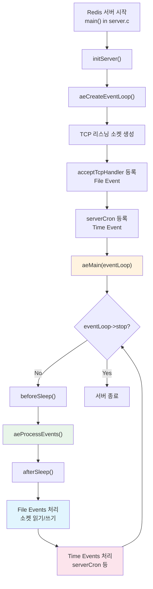
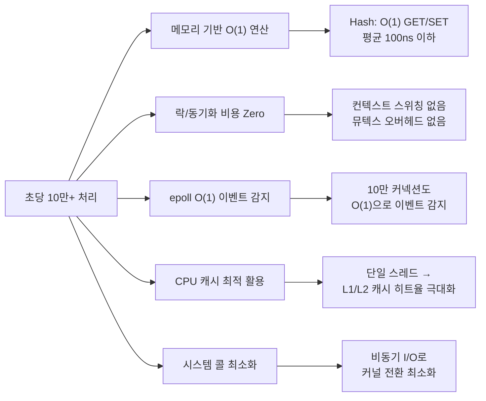

# 싱글 스레드와 이벤트 루프: Redis가 단일 스레드로 초당 10만 요청을 처리하는 원리

Redis는 메인 스레드 하나로 모든 클라이언트 명령을 처리하면서도 초당 10만 건 이상의 처리량을 달성한다. 이 문서에서는 ae 이벤트 라이브러리의 내부 구조, File Event와 Time Event의 처리 방식, 멀티플렉서 선택 전략, beforeSleep/afterSleep 콜백까지 소스 코드 레벨에서 분석한다.

## 목차

1. [핵심 개념 (What)](#1-핵심-개념-what)
2. [왜 알아야 하는가 (Why)](#2-왜-알아야-하는가-why)
3. [내부 구현 분석 (How)](#3-내부-구현-분석-how)
4. [실전 예제](#4-실전-예제)
5. [정리](#5-정리)

---

## 1. 핵심 개념 (What)

### 싱글 스레드 모델이란?

Redis는 **메인 스레드 하나**가 이벤트 루프를 돌며 모든 클라이언트의 명령을 순차적으로 처리한다. 멀티스레드 데이터베이스처럼 여러 요청을 동시에 실행하지 않으며, 한 번에 하나의 명령만 실행한다. 이 방식은 락(Lock) 없이도 데이터 일관성을 보장하고, 컨텍스트 스위칭 비용을 제거하여 높은 처리량을 달성한다.

### 핵심 구성요소

| 구성요소 | 역할 |
|---------|------|
| `aeEventLoop` | 이벤트 루프의 핵심 구조체. 파일 이벤트, 시간 이벤트, 멀티플렉서 상태를 관리 |
| `aeMain()` | 이벤트 루프의 진입점. `stop` 플래그가 설정될 때까지 무한 반복 |
| `aeProcessEvents()` | 파일 이벤트와 시간 이벤트를 실제로 처리하는 핵심 함수 |
| `aeFileEvent` | 소켓 I/O 이벤트. 클라이언트 읽기/쓰기를 처리 |
| `aeTimeEvent` | 주기적 작업 이벤트. `serverCron` 등 타이머 기반 작업을 실행 |
| `beforeSleep` / `afterSleep` | 매 루프 반복 전후에 실행되는 콜백. 응답 플러시, 만료 키 처리 등을 담당 |
| I/O 멀티플렉서 | `epoll`(Linux), `kqueue`(macOS/BSD), `select`(폴백) 중 최적의 것을 선택 |

## 2. 왜 알아야 하는가 (Why)

### 실무에서 만나는 상황

1. **느린 명령 한 개가 전체 서비스를 멈추는 현상**: `KEYS *`, `SMEMBERS`(대용량 Set) 같은 O(N) 명령은 싱글 스레드를 점유하여 다른 모든 클라이언트의 요청이 대기한다. 이벤트 루프 구조를 이해해야 왜 한 명령이 전체 서비스에 영향을 미치는지 파악할 수 있다.

2. **Latency Spike 원인 분석**: `beforeSleep`에서 AOF 쓰기가 지연되거나, `serverCron`의 만료 키 정리가 오래 걸리면 이벤트 루프 전체가 멈춘다. 루프 내부의 콜백 구조를 알아야 병목 지점을 진단할 수 있다.

3. **Redis 6.0+ I/O 스레딩 튜닝**: I/O 멀티스레딩을 활성화할 때, 명령 실행은 여전히 싱글 스레드라는 사실을 이해해야 올바른 스레드 수를 설정하고 기대 효과를 예측할 수 있다.

4. **초당 처리량 한계 예측**: CPU 바운드인 Redis의 한계를 이해하면, 샤딩이나 클러스터 확장 시점을 정확히 판단할 수 있다.

## 3. 내부 구현 분석 (How)

### 3.1 전체 이벤트 루프 아키텍처



### 3.2 왜 싱글 스레드인가

멀티스레드 시스템은 공유 데이터 접근 시 반드시 락이 필요하다. 락은 다음과 같은 비용을 발생시킨다.

```c
// 멀티스레드 시스템의 전형적인 패턴
pthread_mutex_lock(&hash_table_lock);    // 1. 락 획득 대기 (수 us ~ ms)
value = dictFind(db->dict, key);          // 2. 실제 작업 (수십 ns)
pthread_mutex_unlock(&hash_table_lock);   // 3. 락 해제
// 실제 작업보다 락 오버헤드가 더 크다!
```

Redis는 싱글 스레드이므로 이 모든 오버헤드가 없다.

| 비교 항목 | 멀티스레드 + 락 | Redis 싱글 스레드 |
|-----------|----------------|------------------|
| 락 획득/해제 비용 | 매 연산마다 발생 | 없음 |
| 컨텍스트 스위칭 | 스레드 수에 비례 | 없음 |
| CPU 캐시 효율 | 캐시 라인 바운싱 | L1/L2 캐시 최적 활용 |
| 데드락 위험 | 존재 | 불가능 |
| 코드 복잡도 | 높음 | 낮음 |

### 3.3 ae 이벤트 라이브러리 구조

Redis는 libev나 libuv 대신 자체 이벤트 라이브러리 `ae`를 사용한다. 의존성을 최소화하고 Redis에 최적화된 경량 구현이다.

```c
// ae.h - 핵심 구조체
typedef struct aeEventLoop {
    int maxfd;                          // 현재 등록된 최대 파일 디스크립터
    int setsize;                        // 추적 가능한 최대 fd 수
    long long timeEventNextId;          // 다음 시간 이벤트 ID
    aeFileEvent *events;                // 등록된 파일 이벤트 배열
    aeFiredEvent *fired;                // 발생한(fired) 이벤트 배열
    aeTimeEvent *timeEventHead;         // 시간 이벤트 연결 리스트 헤드
    int stop;                           // 루프 중지 플래그
    void *apidata;                      // 멀티플렉서별 내부 데이터 (epoll fd 등)
    aeBeforeSleepProc *beforesleep;     // 매 루프 전 콜백
    aeBeforeSleepProc *aftersleep;      // 매 루프 후 콜백
    int flags;                          // 이벤트 처리 플래그
} aeEventLoop;
```

### 3.4 aeMain과 aeProcessEvents

```c
// ae.c - 메인 이벤트 루프
void aeMain(aeEventLoop *eventLoop) {
    eventLoop->stop = 0;
    while (!eventLoop->stop) {
        // beforeSleep 콜백 실행
        if (eventLoop->beforesleep != NULL)
            eventLoop->beforesleep(eventLoop);
        // 모든 이벤트 처리 (파일 + 시간)
        aeProcessEvents(eventLoop, AE_ALL_EVENTS | AE_CALL_BEFORE_SLEEP | AE_CALL_AFTER_SLEEP);
    }
}
```

`aeProcessEvents`는 다음 순서로 동작한다.

```c
// ae.c - 이벤트 처리 핵심 로직 (간략화)
int aeProcessEvents(aeEventLoop *eventLoop, int flags) {
    int processed = 0;

    // 1. 가장 빨리 실행될 시간 이벤트의 남은 시간 계산
    aeTimeEvent *shortest = aeSearchNearestTimer(eventLoop);
    struct timeval tv;
    if (shortest) {
        // 시간 이벤트까지 남은 시간을 타임아웃으로 설정
        tv.tv_sec = shortest->when_sec - now_sec;
        tv.tv_usec = shortest->when_ms - now_ms;
    }

    // 2. I/O 멀티플렉서로 파일 이벤트 대기 (타임아웃 = 시간 이벤트까지 남은 시간)
    numevents = aeApiPoll(eventLoop, &tv);

    // 3. afterSleep 콜백 실행
    if (eventLoop->aftersleep != NULL)
        eventLoop->aftersleep(eventLoop);

    // 4. 발생한 파일 이벤트 처리
    for (j = 0; j < numevents; j++) {
        int fd = eventLoop->fired[j].fd;
        aeFileEvent *fe = &eventLoop->events[fd];

        if (fe->mask & AE_READABLE)
            fe->rfileProc(eventLoop, fd, fe->clientData, mask);  // 읽기 핸들러
        if (fe->mask & AE_WRITABLE)
            fe->wfileProc(eventLoop, fd, fe->clientData, mask);  // 쓰기 핸들러

        processed++;
    }

    // 5. 시간 이벤트 처리
    processed += processTimeEvents(eventLoop);

    return processed;
}
```

### 3.5 File Events와 Time Events

**File Events** (소켓 I/O):

| 이벤트 | 핸들러 | 역할 |
|--------|--------|------|
| 리스닝 소켓 READABLE | `acceptTcpHandler` | 새 클라이언트 연결 수락 |
| 클라이언트 소켓 READABLE | `readQueryFromClient` | 명령 데이터 읽기 |
| 클라이언트 소켓 WRITABLE | `sendReplyToClient` | 응답 데이터 쓰기 |

**Time Events** (주기 작업):

| 이벤트 | 주기 | 역할 |
|--------|------|------|
| `serverCron` | 기본 100ms (hz 설정) | 만료 키 삭제, RDB/AOF 백그라운드 작업 체크, 통계 갱신, 클라이언트 타임아웃 처리 |

```c
// server.c - serverCron 주요 작업
int serverCron(struct aeEventLoop *eventLoop, long long id, void *clientData) {
    // 1. 통계 갱신 (초당 명령 수, 메모리 사용량 등)
    trackInstantaneousMetric(STATS_METRIC_COMMAND, server.stat_numcommands);

    // 2. 만료 키 삭제 (점진적, 시간 제한 있음)
    activeExpireCycle(ACTIVE_EXPIRE_CYCLE_SLOW);

    // 3. 백그라운드 작업 체크 (BGSAVE, BGREWRITEAOF 완료 여부)
    if (hasActiveChildProcess()) checkChildrenDone();

    // 4. 클라이언트 타임아웃 처리
    clientsCron();

    // 5. 복제(Replication) 관련 작업
    replicationCron();

    return 1000 / server.hz;  // 다음 실행까지의 밀리초
}
```

### 3.6 I/O 멀티플렉서 선택

Redis는 컴파일 시 플랫폼에 따라 최적의 I/O 멀티플렉서를 자동 선택한다.

```c
// ae.c - 멀티플렉서 선택 (우선순위 순)
#ifdef HAVE_EVPORT
#include "ae_evport.c"      // Solaris event ports
#elif defined(HAVE_EPOLL)
#include "ae_epoll.c"       // Linux epoll (가장 일반적인 운영 환경)
#elif defined(HAVE_KQUEUE)
#include "ae_kqueue.c"      // macOS/FreeBSD kqueue
#else
#include "ae_select.c"      // POSIX select (폴백, fd 1024개 제한)
#endif
```

| 멀티플렉서 | 플랫폼 | 시간 복잡도 | 최대 fd |
|-----------|--------|------------|---------|
| `evport` | Solaris | O(1) | 무제한 |
| `epoll` | Linux | O(1) | 무제한 |
| `kqueue` | macOS/BSD | O(1) | 무제한 |
| `select` | 모든 POSIX | O(N) | 1024 |

`epoll` 기반 구현의 핵심:

```c
// ae_epoll.c
static int aeApiPoll(aeEventLoop *eventLoop, struct timeval *tvp) {
    aeApiState *state = eventLoop->apidata;

    // epoll_wait로 이벤트 대기 (타임아웃 지정)
    int retval = epoll_wait(state->epfd, state->events, eventLoop->setsize,
                            tvp ? (tvp->tv_sec * 1000 + tvp->tv_usec / 1000) : -1);

    if (retval > 0) {
        for (j = 0; j < retval; j++) {
            struct epoll_event *e = state->events + j;
            // epoll 이벤트를 ae 이벤트로 변환
            if (e->events & EPOLLIN) mask |= AE_READABLE;
            if (e->events & EPOLLOUT) mask |= AE_WRITABLE;
            eventLoop->fired[j].fd = e->data.fd;
            eventLoop->fired[j].mask = mask;
        }
    }
    return retval;
}
```

### 3.7 beforeSleep / afterSleep 콜백

`beforeSleep`는 매 이벤트 루프 반복에서 `aeApiPoll` 호출 **전**에 실행되며, 지연 처리가 필요한 작업을 일괄 수행한다.

```c
// server.c - beforeSleep 주요 작업
void beforeSleep(struct aeEventLoop *eventLoop) {
    // 1. 클라이언트 응답 버퍼 플러시
    handleClientsWithPendingWritesUsingThreads();

    // 2. AOF 버퍼를 디스크에 쓰기
    if (server.aof_state == AOF_ON)
        flushAppendOnlyFile(0);

    // 3. 만료 키 빠른 삭제 (시간 제한 짧음)
    activeExpireCycle(ACTIVE_EXPIRE_CYCLE_FAST);

    // 4. 클러스터 상태 업데이트
    if (server.cluster_enabled) clusterBeforeSleep();

    // 5. 블로킹 명령(BLPOP 등) 대기 클라이언트 처리
    handleClientsBlockedOnKeys();
}
```

`afterSleep`는 `aeApiPoll`에서 깨어난 **직후** 실행된다.

```c
// server.c - afterSleep
void afterSleep(struct aeEventLoop *eventLoop) {
    // I/O 스레딩 활성화 시: 대기 중인 읽기를 I/O 스레드에 분배
    handleClientsWithPendingReadsUsingThreads();

    // 모듈 콜백 실행
    moduleAcquireGIL();
}
```

### 3.8 초당 10만+ 처리가 가능한 이유



주요 요인을 정리하면 다음과 같다.

| 요인 | 설명 | 기여도 |
|------|------|--------|
| 인메모리 연산 | 디스크 I/O 없이 메모리에서 직접 처리 | 가장 큰 요인 |
| 효율적 자료구조 | Hash Table, Skip List 등 O(1)/O(log N) 연산 | 높음 |
| 락 없는 실행 | 뮤텍스, CAS 등 동기화 비용 제거 | 중간 |
| I/O 멀티플렉싱 | 단일 스레드에서 수만 커넥션 관리 | 중간 |
| 단순한 프로토콜 | RESP 프로토콜의 파싱 비용이 매우 낮음 | 낮음 |

## 4. 실전 예제

### 4.1 Spring Boot에서 느린 명령 모니터링

싱글 스레드 모델에서 느린 명령은 전체 서비스에 영향을 미친다. Slowlog를 활용한 모니터링 설정이다.

```java
@Configuration
public class RedisSlowlogMonitor {

    private final StringRedisTemplate redisTemplate;
    private final MeterRegistry meterRegistry;

    public RedisSlowlogMonitor(StringRedisTemplate redisTemplate, MeterRegistry meterRegistry) {
        this.redisTemplate = redisTemplate;
        this.meterRegistry = meterRegistry;
    }

    /**
     * Redis Slowlog를 주기적으로 수집하여 메트릭으로 노출한다.
     * 싱글 스레드 블로킹을 유발하는 느린 명령을 조기에 감지한다.
     */
    @Scheduled(fixedRate = 30_000)
    public void collectSlowlog() {
        // SLOWLOG GET 10: 최근 10개의 느린 명령 조회
        List<Object> slowlogs = redisTemplate.execute((RedisCallback<List<Object>>) connection ->
            connection.execute("SLOWLOG", "GET".getBytes(), "10".getBytes())
        );

        if (slowlogs == null || slowlogs.isEmpty()) {
            return;
        }

        for (Object entry : slowlogs) {
            List<Object> logEntry = (List<Object>) entry;
            long durationMicros = (Long) logEntry.get(2);
            List<byte[]> args = (List<byte[]>) logEntry.get(3);
            String command = new String(args.get(0));

            // Prometheus 메트릭으로 기록
            meterRegistry.timer("redis.slowlog",
                "command", command
            ).record(durationMicros, TimeUnit.MICROSECONDS);

            if (durationMicros > 10_000) { // 10ms 이상
                log.warn("Redis slow command detected: {} ({}us). "
                    + "싱글 스레드 블로킹 위험!", command, durationMicros);
            }
        }
    }
}
```

### 4.2 이벤트 루프 블로킹을 방지하는 SCAN 기반 배치 처리

```java
@Service
public class RedisBatchProcessor {

    private final StringRedisTemplate redisTemplate;

    public RedisBatchProcessor(StringRedisTemplate redisTemplate) {
        this.redisTemplate = redisTemplate;
    }

    /**
     * KEYS * 대신 SCAN을 사용하여 이벤트 루프 블로킹을 방지한다.
     * SCAN은 커서 기반으로 소량씩 처리하므로 싱글 스레드를 오래 점유하지 않는다.
     *
     * @param pattern 키 패턴 (예: "session:*")
     * @param batchSize 한 번에 처리할 키 수
     */
    public long deleteKeysByPattern(String pattern, int batchSize) {
        long deletedCount = 0;

        // SCAN 기반 순회: 이벤트 루프를 짧게 점유
        ScanOptions scanOptions = ScanOptions.scanOptions()
            .match(pattern)
            .count(batchSize)
            .build();

        try (Cursor<byte[]> cursor = redisTemplate.executeWithStickyConnection(
                connection -> connection.keyCommands().scan(scanOptions))) {

            List<String> batch = new ArrayList<>(batchSize);

            while (cursor.hasNext()) {
                batch.add(new String(cursor.next()));

                if (batch.size() >= batchSize) {
                    // Pipeline으로 일괄 삭제: 네트워크 왕복 최소화
                    deletedCount += deleteBatch(batch);
                    batch.clear();

                    // 다른 명령이 처리될 수 있도록 짧은 대기
                    Thread.sleep(10);
                }
            }

            if (!batch.isEmpty()) {
                deletedCount += deleteBatch(batch);
            }
        } catch (InterruptedException e) {
            Thread.currentThread().interrupt();
        }

        return deletedCount;
    }

    private long deleteBatch(List<String> keys) {
        List<Object> results = redisTemplate.executePipelined((RedisCallback<Object>) connection -> {
            for (String key : keys) {
                connection.keyCommands().unlink(key.getBytes());  // UNLINK: 비동기 삭제
            }
            return null;
        });
        return results.size();
    }
}
```

### 4.3 Redis INFO로 이벤트 루프 상태 확인

```java
@Component
public class RedisEventLoopHealthIndicator implements HealthIndicator {

    private final StringRedisTemplate redisTemplate;

    public RedisEventLoopHealthIndicator(StringRedisTemplate redisTemplate) {
        this.redisTemplate = redisTemplate;
    }

    @Override
    public Health health() {
        Properties info = redisTemplate.execute((RedisCallback<Properties>) connection ->
            connection.serverCommands().info("stats")
        );

        if (info == null) {
            return Health.down().withDetail("reason", "Cannot fetch Redis INFO").build();
        }

        long instantaneousOpsPerSec = Long.parseLong(
            info.getProperty("instantaneous_ops_per_sec", "0"));
        long totalCommandsProcessed = Long.parseLong(
            info.getProperty("total_commands_processed", "0"));
        long blockedClients = Long.parseLong(
            info.getProperty("blocked_clients", "0"));

        Health.Builder builder = instantaneousOpsPerSec > 0
            ? Health.up() : Health.unknown();

        return builder
            .withDetail("ops_per_sec", instantaneousOpsPerSec)
            .withDetail("total_commands", totalCommandsProcessed)
            .withDetail("blocked_clients", blockedClients)
            .build();
    }
}
```

## 5. 정리

| 항목 | 설명 |
|-----|------|
| 싱글 스레드 모델 | 메인 스레드 하나가 모든 명령을 순차 실행. 락 불필요, 원자성 자동 보장 |
| ae 이벤트 라이브러리 | Redis 자체 구현 경량 이벤트 루프. `aeMain` -> `aeProcessEvents` 반복 |
| File Events | 소켓 I/O 이벤트. 클라이언트 연결 수락, 명령 읽기, 응답 쓰기를 처리 |
| Time Events | 주기적 작업. `serverCron`이 만료 키 삭제, 백그라운드 작업 체크 등을 수행 |
| I/O 멀티플렉서 | `epoll`(Linux) > `kqueue`(macOS) > `select`(폴백) 순으로 자동 선택 |
| beforeSleep | 매 루프 전 실행. AOF 플러시, 응답 버퍼 전송, 빠른 만료 키 삭제 |
| afterSleep | 매 루프 후 실행. I/O 스레드 읽기 분배, 모듈 GIL 획득 |
| 고성능 비결 | 인메모리 + 락 없음 + O(1) 자료구조 + epoll + CPU 캐시 최적화 |

---
*참고: Redis 7.x 소스 기준*
