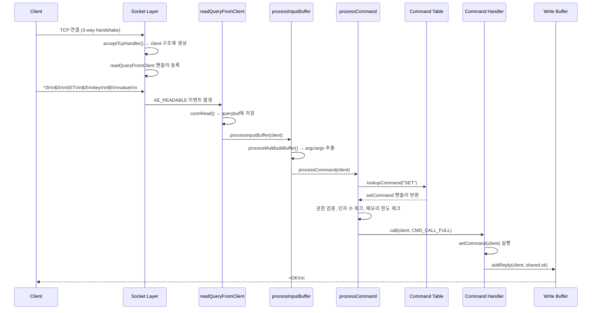
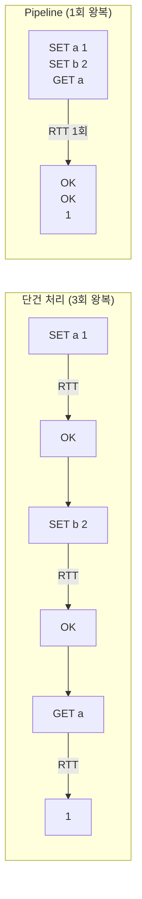

# 명령 처리 파이프라인: 클라이언트 연결부터 응답까지의 전체 흐름

Redis가 클라이언트의 TCP 연결을 수락하고, RESP 프로토콜로 명령을 파싱하고, 명령 테이블에서 핸들러를 찾아 실행한 뒤 응답을 반환하는 전체 파이프라인을 소스 코드 레벨에서 추적한다. Pipeline 모드와 MULTI/EXEC 트랜잭션의 내부 처리 방식도 함께 분석한다.

## 목차

1. [핵심 개념 (What)](#1-핵심-개념-what)
2. [왜 알아야 하는가 (Why)](#2-왜-알아야-하는가-why)
3. [내부 구현 분석 (How)](#3-내부-구현-분석-how)
4. [실전 예제](#4-실전-예제)
5. [정리](#5-정리)

---

## 1. 핵심 개념 (What)

### 명령 처리 파이프라인이란?

Redis 서버가 클라이언트의 요청을 받아 처리하는 전체 경로를 말한다. TCP 연결 수립 -> RESP 프로토콜 파싱 -> 명령 조회 -> 권한/인자 검증 -> 명령 실행 -> 응답 직렬화 -> 네트워크 전송의 단계를 거친다.

### 핵심 구성요소

| 구성요소 | 역할 |
|---------|------|
| `acceptTcpHandler` | TCP 연결을 수락하고 `client` 구조체를 생성 |
| RESP 프로토콜 | Redis 클라이언트-서버 통신의 직렬화 프로토콜 |
| `readQueryFromClient` | 소켓에서 데이터를 읽어 클라이언트 입력 버퍼에 저장 |
| `processInputBuffer` | 입력 버퍼를 파싱하여 명령 인자(argc/argv)를 추출 |
| `processCommand` | 명령 테이블 조회, 권한 검증, 명령 실행을 총괄 |
| `redisCommandTable` | 모든 Redis 명령의 메타데이터(핸들러 함수, 인자 수, 플래그 등)를 보유한 배열 |
| `addReply*` | 응답 데이터를 클라이언트 출력 버퍼에 기록 |
| Pipeline 모드 | 여러 명령을 한 번에 전송하여 네트워크 왕복 비용을 줄이는 방식 |
| MULTI/EXEC | 여러 명령을 큐에 쌓았다가 한 번에 원자적으로 실행하는 트랜잭션 |

## 2. 왜 알아야 하는가 (Why)

### 실무에서 만나는 상황

1. **RESP 프로토콜 디버깅**: 클라이언트 라이브러리에서 예기치 않은 오류가 발생하면 와이어 레벨에서 RESP 메시지를 해석할 수 있어야 한다. `redis-cli --resp3`이나 `tcpdump`로 원시 프로토콜을 분석할 때 RESP 구조를 이해해야 한다.

2. **Pipeline 최적화**: 단건 명령과 Pipeline의 성능 차이는 최대 10배 이상이다. 내부적으로 Pipeline이 어떻게 처리되는지 알면 적절한 배치 크기를 결정할 수 있다.

3. **트랜잭션(MULTI/EXEC) 한계 인식**: Redis 트랜잭션은 RDBMS 트랜잭션과 달리 롤백이 불가능하다. 내부 동작을 이해해야 올바른 사용 패턴을 적용할 수 있다.

4. **대용량 값 전송 시 메모리 문제**: 응답 버퍼 구조를 알면 `client-output-buffer-limit` 설정의 의미를 이해하고 OOM을 방지할 수 있다.

## 3. 내부 구현 분석 (How)

### 3.1 전체 명령 처리 흐름



### 3.2 RESP(REdis Serialization Protocol) 상세

RESP는 Redis의 와이어 프로토콜이다. 타입 접두어 한 바이트로 데이터 종류를 구분한다.

**RESP2 타입:**

| 접두어 | 타입 | 예시 | 설명 |
|--------|------|------|------|
| `+` | Simple String | `+OK\r\n` | 상태 응답 |
| `-` | Error | `-ERR unknown command\r\n` | 에러 메시지 |
| `:` | Integer | `:1000\r\n` | 정수 값 |
| `$` | Bulk String | `$5\r\nhello\r\n` | 바이너리 안전 문자열 |
| `*` | Array | `*2\r\n$3\r\nfoo\r\n$3\r\nbar\r\n` | 배열 |

**RESP3 추가 타입 (Redis 6.0+):**

| 접두어 | 타입 | 설명 |
|--------|------|------|
| `_` | Null | Null 값 |
| `#` | Boolean | `#t\r\n` 또는 `#f\r\n` |
| `,` | Double | 부동 소수점 |
| `%` | Map | 키-값 쌍 |
| `~` | Set | 집합 |

실제 명령 인코딩 예시:

```
# SET mykey myvalue 명령
클라이언트 → 서버:
*3\r\n        ← 배열 3개 요소
$3\r\n        ← Bulk String 3바이트
SET\r\n       ← 명령어
$5\r\n        ← Bulk String 5바이트
mykey\r\n     ← 키
$7\r\n        ← Bulk String 7바이트
myvalue\r\n   ← 값

서버 → 클라이언트:
+OK\r\n       ← Simple String 응답
```

### 3.3 명령 파싱: readQueryFromClient -> processInputBuffer

```c
// networking.c - 소켓에서 데이터 읽기
void readQueryFromClient(connection *conn) {
    client *c = connGetPrivateData(conn);
    int nread, readlen;

    readlen = PROTO_IOBUF_LEN;  // 기본 16KB

    // 쿼리 버퍼 크기 조절
    if (c->querybuf_peak < readlen)
        c->querybuf_peak = readlen;

    c->querybuf = sdsMakeRoomFor(c->querybuf, readlen);

    // 소켓에서 읽기
    nread = connRead(c->conn, c->querybuf + sdslen(c->querybuf), readlen);

    if (nread == -1) {
        // 에러 처리
        return;
    }

    sdsIncrLen(c->querybuf, nread);
    c->lastinteraction = server.unixtime;

    // 쿼리 버퍼 크기 제한 체크
    if (sdslen(c->querybuf) > server.client_max_querybuf_len) {
        freeClientAsync(c);
        return;
    }

    // 명령 파싱 및 실행
    processInputBuffer(c);
}
```

```c
// networking.c - 입력 버퍼 파싱
void processInputBuffer(client *c) {
    while (c->qb_pos < sdslen(c->querybuf)) {
        // RESP 프로토콜 파싱 (Multibulk 형식)
        if (c->reqtype == PROTO_REQ_MULTIBULK) {
            if (processMultibulkBuffer(c) != C_OK) break;
        } else {
            // 인라인 명령 파싱 (redis-cli의 직접 입력)
            if (processInlineBuffer(c) != C_OK) break;
        }

        // argc/argv가 준비되면 명령 실행
        if (c->argc == 0) {
            resetClient(c);
        } else {
            // MULTI 큐잉 중이면 큐에 추가, 아니면 바로 실행
            if (processCommandAndResetClient(c) == C_ERR) {
                return;
            }
        }
    }
}
```

### 3.4 명령 테이블과 명령 조회

Redis의 모든 명령은 `redisCommandTable` 배열에 정의되어 있다. 서버 시작 시 이 배열을 해시 테이블(`server.commands`)에 등록한다.

```c
// server.c - 명령 테이블 (구조 예시)
struct redisCommand redisCommandTable[] = {
    // 명령명, 핸들러, 인자수, 플래그
    {"get",      getCommand,     2, "read-only fast @string",  .key_specs = ...},
    {"set",      setCommand,    -3, "write deny-oom @string",  .key_specs = ...},
    {"del",      delCommand,    -2, "write @keyspace",         .key_specs = ...},
    {"mget",     mgetCommand,   -2, "read-only fast @string",  .key_specs = ...},
    {"lpush",    lpushCommand,  -3, "write deny-oom fast @list", .key_specs = ...},
    {"subscribe",subscribeCommand,-2,"pub-sub",                .key_specs = ...},
    // ... 수백 개의 명령 정의
};
```

명령 조회와 실행 흐름:

```c
// server.c - 명령 처리 핵심
int processCommand(client *c) {
    // 1. 명령 이름으로 명령 구조체 조회
    c->cmd = c->lastcmd = c->realcmd = lookupCommand(c->argv, c->argc);

    if (!c->cmd) {
        // 알 수 없는 명령
        addReplyError(c, "unknown command");
        return C_OK;
    }

    // 2. 인자 수 검증
    if ((c->cmd->arity > 0 && c->cmd->arity != c->argc) ||
        (c->argc < -c->cmd->arity)) {
        addReplyError(c, "wrong number of arguments");
        return C_OK;
    }

    // 3. 인증(AUTH) 체크
    if (server.requirepass && !c->authenticated) {
        addReplyError(c, "NOAUTH Authentication required");
        return C_OK;
    }

    // 4. 메모리 한도 체크 (deny-oom 플래그인 경우)
    if (server.maxmemory && !server.loading) {
        int out_of_memory = freeMemoryIfNeededAndSafe() == C_ERR;
        if (out_of_memory && c->cmd->flags & CMD_DENYOOM) {
            addReplyError(c, "OOM command not allowed when used memory > maxmemory");
            return C_OK;
        }
    }

    // 5. MULTI 트랜잭션 큐잉 중이면 큐에 추가
    if (c->flags & CLIENT_MULTI &&
        c->cmd->proc != execCommand &&
        c->cmd->proc != discardCommand &&
        c->cmd->proc != multiCommand &&
        c->cmd->proc != watchCommand) {
        queueMultiCommand(c);
        addReply(c, shared.queued);
        return C_OK;
    }

    // 6. 명령 실행
    call(c, CMD_CALL_FULL);
    return C_OK;
}
```

### 3.5 Pipeline 처리

Pipeline은 프로토콜 레벨의 최적화로, 클라이언트가 응답을 기다리지 않고 여러 명령을 연속으로 전송한다. 서버 입장에서는 특별한 처리가 필요 없다.



서버 내부에서 Pipeline이 처리되는 방식:

```
querybuf에 3개 명령이 한 번에 도착:
"*3\r\n$3\r\nSET\r\n$1\r\na\r\n$1\r\n1\r\n*3\r\n$3\r\nSET\r\n$1\r\nb\r\n$1\r\n2\r\n*2\r\n$3\r\nGET\r\n$1\r\na\r\n"

processInputBuffer의 while 루프:
  반복 1: processMultibulkBuffer → SET a 1 → processCommand → addReply(OK)
  반복 2: processMultibulkBuffer → SET b 2 → processCommand → addReply(OK)
  반복 3: processMultibulkBuffer → GET a   → processCommand → addReplyBulk("1")

beforeSleep에서 3개 응답을 한 번에 flush:
"+OK\r\n+OK\r\n$1\r\n1\r\n"
```

### 3.6 MULTI/EXEC 트랜잭션 처리

```c
// multi.c - MULTI 명령: 트랜잭션 시작
void multiCommand(client *c) {
    if (c->flags & CLIENT_MULTI) {
        addReplyError(c, "MULTI calls can not be nested");
        return;
    }
    c->flags |= CLIENT_MULTI;  // 트랜잭션 모드 플래그 설정
    addReply(c, shared.ok);
}

// multi.c - 명령 큐잉
void queueMultiCommand(client *c) {
    multiCmd *mc;
    // 명령 큐 확장
    c->mstate.commands = zrealloc(c->mstate.commands,
        sizeof(multiCmd) * (c->mstate.count + 1));
    mc = c->mstate.commands + c->mstate.count;
    mc->cmd = c->cmd;
    mc->argc = c->argc;
    mc->argv = c->argv;
    c->mstate.count++;
}

// multi.c - EXEC 명령: 큐에 쌓인 명령 일괄 실행
void execCommand(client *c) {
    if (!(c->flags & CLIENT_MULTI)) {
        addReplyError(c, "EXEC without MULTI");
        return;
    }

    // WATCH된 키가 변경되었으면 트랜잭션 실패
    if (c->flags & CLIENT_DIRTY_CAS) {
        addReply(c, shared.nullarray);
        discardTransaction(c);
        return;
    }

    // 큐에 쌓인 모든 명령을 순차 실행
    addReplyArrayLen(c, c->mstate.count);
    for (j = 0; j < c->mstate.count; j++) {
        c->argc = c->mstate.commands[j].argc;
        c->argv = c->mstate.commands[j].argv;
        c->cmd = c->mstate.commands[j].cmd;

        call(c, CMD_CALL_FULL);  // 개별 명령 실행 (실패해도 롤백 없음!)
    }

    discardTransaction(c);
}
```

### 3.7 응답 버퍼링과 write 이벤트

Redis는 응답을 즉시 전송하지 않고 버퍼에 쌓았다가 `beforeSleep`에서 일괄 전송한다.

```c
// networking.c - 응답 쓰기
void addReply(client *c, robj *obj) {
    if (prepareClientToWrite(c) != C_OK) return;

    if (sdsEncodedObject(obj)) {
        // 고정 크기 버퍼(buf)에 먼저 시도
        if (_addReplyToBuffer(c, obj->ptr, sdslen(obj->ptr)) != C_OK)
            // 넘치면 reply 연결 리스트에 추가
            _addReplyProtoToList(c, obj->ptr, sdslen(obj->ptr));
    }
}

// client 구조체의 출력 버퍼
typedef struct client {
    // 고정 크기 응답 버퍼 (16KB)
    char buf[PROTO_REPLY_CHUNK_BYTES];  // 작은 응답용
    int bufpos;

    // 동적 응답 리스트 (대용량 응답용)
    list *reply;                         // clientReplyBlock 연결 리스트
    unsigned long long reply_bytes;      // reply 리스트의 총 바이트
} client;
```

## 4. 실전 예제

### 4.1 Spring Boot Pipeline 활용

```java
@Service
public class RedisPipelineService {

    private final StringRedisTemplate redisTemplate;

    public RedisPipelineService(StringRedisTemplate redisTemplate) {
        this.redisTemplate = redisTemplate;
    }

    /**
     * Pipeline으로 여러 키를 일괄 조회한다.
     * 단건 GET N회 = RTT * N, Pipeline = RTT * 1
     *
     * @param keys 조회할 키 목록
     * @return 키-값 맵
     */
    public Map<String, String> multiGet(List<String> keys) {
        // Pipeline 실행: 모든 명령이 하나의 네트워크 왕복으로 처리
        List<Object> results = redisTemplate.executePipelined(
            (RedisCallback<Object>) connection -> {
                for (String key : keys) {
                    connection.stringCommands().get(key.getBytes());
                }
                return null;  // Pipeline 콜백은 null 반환 필수
            }
        );

        Map<String, String> resultMap = new HashMap<>();
        for (int i = 0; i < keys.size(); i++) {
            Object value = results.get(i);
            if (value != null) {
                resultMap.put(keys.get(i), value.toString());
            }
        }
        return resultMap;
    }

    /**
     * Pipeline으로 대량 쓰기를 수행한다.
     * 배치 크기를 제한하여 서버 메모리 부담을 줄인다.
     */
    public void bulkSet(Map<String, String> entries, int batchSize) {
        List<Map.Entry<String, String>> entryList = new ArrayList<>(entries.entrySet());

        for (int i = 0; i < entryList.size(); i += batchSize) {
            int end = Math.min(i + batchSize, entryList.size());
            List<Map.Entry<String, String>> batch = entryList.subList(i, end);

            redisTemplate.executePipelined((RedisCallback<Object>) connection -> {
                for (Map.Entry<String, String> entry : batch) {
                    connection.stringCommands().set(
                        entry.getKey().getBytes(),
                        entry.getValue().getBytes()
                    );
                }
                return null;
            });
        }
    }
}
```

### 4.2 MULTI/EXEC 트랜잭션을 활용한 재고 차감

```java
@Service
public class InventoryService {

    private final StringRedisTemplate redisTemplate;

    public InventoryService(StringRedisTemplate redisTemplate) {
        this.redisTemplate = redisTemplate;
    }

    /**
     * WATCH + MULTI/EXEC를 사용한 낙관적 락 기반 재고 차감.
     *
     * WATCH된 키가 EXEC 전에 다른 클라이언트에 의해 변경되면
     * EXEC는 null을 반환하고 트랜잭션이 실패한다 (CAS 패턴).
     *
     * @return 차감 성공 여부
     */
    public boolean decrementStock(String productId, int quantity) {
        String stockKey = "stock:" + productId;

        // SessionCallback으로 WATCH ~ MULTI ~ EXEC를 하나의 연결에서 처리
        List<Object> results = redisTemplate.execute(new SessionCallback<>() {
            @Override
            @SuppressWarnings("unchecked")
            public List<Object> execute(RedisOperations operations) throws DataAccessException {
                operations.watch(stockKey);

                String currentStock = (String) operations.opsForValue().get(stockKey);
                if (currentStock == null) {
                    operations.unwatch();
                    return null;
                }

                int stock = Integer.parseInt(currentStock);
                if (stock < quantity) {
                    operations.unwatch();
                    return null;
                }

                // MULTI 시작: 이후 명령은 큐에 쌓임
                operations.multi();
                operations.opsForValue().set(stockKey, String.valueOf(stock - quantity));
                operations.opsForHash().put("stock:log:" + productId,
                    String.valueOf(System.currentTimeMillis()),
                    "-" + quantity);

                // EXEC 실행: WATCH된 키가 변경되지 않았으면 성공
                return operations.exec();
            }
        });

        return results != null && !results.isEmpty();
    }
}
```

## 5. 정리

| 항목 | 설명 |
|-----|------|
| 연결 수립 | `acceptTcpHandler`가 TCP 연결을 수락하고 `client` 구조체를 생성 |
| RESP 프로토콜 | 타입 접두어(`+`, `-`, `:`, `$`, `*`) 기반의 경량 직렬화 프로토콜 |
| 명령 파싱 | `readQueryFromClient` -> `processInputBuffer` -> `processMultibulkBuffer`로 argc/argv 추출 |
| 명령 조회 | `lookupCommand`로 `redisCommandTable` 해시 테이블에서 핸들러 조회 |
| 명령 실행 | `processCommand`에서 인증/인자/메모리 검증 후 `call()`로 핸들러 실행 |
| Pipeline | 프로토콜 레벨 최적화. 서버는 `processInputBuffer`의 while 루프에서 연속 처리 |
| MULTI/EXEC | 명령을 `mstate.commands` 큐에 쌓았다가 EXEC 시 일괄 실행. 롤백 불가 |
| 응답 버퍼 | 고정 버퍼(`buf[16KB]`) + 동적 리스트(`reply`)의 2단 구조. `beforeSleep`에서 일괄 전송 |

---
*참고: Redis 7.x 소스 기준*
