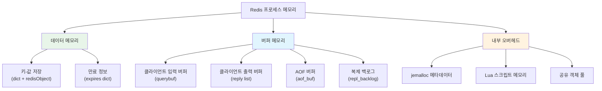

# 메모리 관리와 Eviction 정책: Redis 메모리 아키텍처부터 LRU/LFU 근사 알고리즘까지

Redis는 인메모리 데이터 스토어이므로 메모리 관리가 성능과 안정성의 핵심이다. 이 문서에서는 jemalloc 기반 메모리 할당, 오브젝트 인코딩 최적화, 8가지 Eviction 정책의 내부 구현, LRU/LFU 근사 알고리즘의 동작 원리, 메모리 단편화 대응 전략을 소스 코드 레벨에서 분석한다.

## 목차

1. [핵심 개념 (What)](#1-핵심-개념-what)
2. [왜 알아야 하는가 (Why)](#2-왜-알아야-하는가-why)
3. [내부 구현 분석 (How)](#3-내부-구현-분석-how)
4. [실전 예제](#4-실전-예제)
5. [정리](#5-정리)

---

## 1. 핵심 개념 (What)

### Redis 메모리 관리란?

Redis는 모든 데이터를 메모리에 저장하므로, 메모리가 부족해지면 새로운 쓰기 명령을 거부하거나(`noeviction`) 기존 키를 제거(`eviction`)하여 공간을 확보한다. `maxmemory` 설정으로 메모리 한도를 지정하고, `maxmemory-policy`로 한도 초과 시 어떤 키를 제거할지 결정한다.

### 핵심 구성요소

| 구성요소 | 역할 |
|---------|------|
| `jemalloc` | Redis의 기본 메모리 할당자. 단편화를 줄이고 멀티스레드 할당 성능을 최적화 |
| `robj` (redisObject) | Redis 값의 래퍼 구조체. 타입, 인코딩, LRU/LFU 클록, 참조 카운트를 보유 |
| `maxmemory` | 메모리 사용 한도 (바이트) |
| `maxmemory-policy` | 한도 초과 시 적용할 eviction 정책 (8가지) |
| `maxmemory-samples` | LRU/LFU 근사 알고리즘의 샘플링 크기 (기본 5) |
| `activedefrag` | 능동적 메모리 단편화 해소 기능 |
| 공유 객체 | 0~9999 정수, 자주 쓰는 응답 문자열 등을 공유하여 메모리 절약 |

## 2. 왜 알아야 하는가 (Why)

### 실무에서 만나는 상황

1. **OOM(Out of Memory) 장애**: `maxmemory`를 설정하지 않으면 Redis가 시스템 메모리를 모두 소진하여 OOM Killer에 의해 프로세스가 종료된다. eviction 정책을 올바르게 설정해야 서비스 가용성을 유지할 수 있다.

2. **캐시 히트율 저하**: 잘못된 eviction 정책을 선택하면 자주 접근하는 핫 키가 제거되어 캐시 히트율이 급격히 떨어진다. LRU와 LFU의 차이를 이해하고 워크로드에 맞는 정책을 선택해야 한다.

3. **메모리 단편화**: `INFO memory`에서 `mem_fragmentation_ratio`가 1.5 이상이면 실제 데이터보다 50% 이상의 메모리가 낭비된다. 단편화 원인과 해소 방법을 알아야 비용을 절감할 수 있다.

4. **인코딩 최적화 미인식**: 같은 데이터라도 인코딩 방식에 따라 메모리 사용량이 수배 차이난다. `OBJECT ENCODING` 명령으로 확인하고 최적 인코딩을 유도해야 한다.

## 3. 내부 구현 분석 (How)

### 3.1 Redis 메모리 구조 전체 아키텍처



### 3.2 redisObject와 인코딩 최적화

모든 Redis 값은 `redisObject` 구조체로 감싸진다.

```c
// server.h
typedef struct redisObject {
    unsigned type:4;        // 데이터 타입 (STRING, LIST, SET, ZSET, HASH)
    unsigned encoding:4;    // 내부 인코딩 방식
    unsigned lru:LRU_BITS;  // LRU: 24비트 타임스탬프 / LFU: 8비트 빈도 + 16비트 시간
    int refcount;           // 참조 카운트
    void *ptr;              // 실제 데이터 포인터
} robj;  // 총 16바이트
```

인코딩별 메모리 사용 비교:

| 타입 | 컴팩트 인코딩 | 일반 인코딩 | 전환 조건 |
|------|-------------|------------|----------|
| String | `OBJ_ENCODING_INT` (정수) | `OBJ_ENCODING_RAW` / `EMBSTR` | 정수가 아니거나 > 20자리 |
| List | `OBJ_ENCODING_LISTPACK` | `OBJ_ENCODING_QUICKLIST` | 요소 수 > 128 또는 요소 > 64B |
| Hash | `OBJ_ENCODING_LISTPACK` | `OBJ_ENCODING_HASHTABLE` | 필드 수 > 128 또는 값 > 64B |
| Set | `OBJ_ENCODING_LISTPACK` / `INTSET` | `OBJ_ENCODING_HASHTABLE` | 요소 수 > 128 또는 비정수 포함 |
| Sorted Set | `OBJ_ENCODING_LISTPACK` | `OBJ_ENCODING_SKIPLIST` | 요소 수 > 128 또는 요소 > 64B |

**공유 객체**: Redis는 0~9999 범위의 정수 객체를 미리 생성하여 공유한다.

```c
// server.c - 공유 객체 초기화
void createSharedObjects(void) {
    // 0~9999 정수 공유 객체 생성
    for (j = 0; j < OBJ_SHARED_INTEGERS; j++) {
        shared.integers[j] = makeObjectShared(createObject(OBJ_STRING, (void*)(long)j));
        shared.integers[j]->encoding = OBJ_ENCODING_INT;
    }
    // "+OK\r\n", "+PONG\r\n" 등 공통 응답도 공유
    shared.ok = createObject(OBJ_STRING, sdsnew("+OK\r\n"));
}
```

### 3.3 8가지 Eviction 정책

`maxmemory`에 도달했을 때 적용되는 정책:

| 정책 | 대상 범위 | 알고리즘 | 설명 |
|------|----------|---------|------|
| `noeviction` | - | 없음 | 쓰기 거부, 읽기만 허용 |
| `allkeys-lru` | 모든 키 | LRU 근사 | 가장 오래 사용되지 않은 키 제거 |
| `volatile-lru` | TTL 설정된 키 | LRU 근사 | TTL 키 중 가장 오래 미사용된 키 제거 |
| `allkeys-lfu` | 모든 키 | LFU 근사 | 가장 적게 사용된 키 제거 |
| `volatile-lfu` | TTL 설정된 키 | LFU 근사 | TTL 키 중 가장 적게 사용된 키 제거 |
| `allkeys-random` | 모든 키 | 랜덤 | 무작위 키 제거 |
| `volatile-random` | TTL 설정된 키 | 랜덤 | TTL 키 중 무작위 제거 |
| `volatile-ttl` | TTL 설정된 키 | TTL 기반 | 남은 TTL이 가장 짧은 키 제거 |

### 3.4 LRU 근사 알고리즘

Redis는 정확한 LRU를 구현하지 않는다. 전체 키를 연결 리스트로 관리하면 메모리와 CPU 비용이 크기 때문이다. 대신 **샘플링 기반 근사 LRU**를 사용한다.

```c
// evict.c - Eviction 핵심 로직 (간략화)
int freeMemoryIfNeeded(void) {
    while (mem_used > server.maxmemory) {
        // 1. 후보 풀(eviction pool) 채우기
        for (i = 0; i < server.dbnum; i++) {
            dict *dict = (server.maxmemory_policy & MAXMEMORY_FLAG_ALLKEYS)
                ? db->dict : db->expires;

            // maxmemory-samples 개의 키를 랜덤 샘플링
            evictionPoolPopulate(i, dict, db->dict, pool);
        }

        // 2. 풀에서 가장 적합한 키 선택 (유휴 시간이 가장 큰 키)
        bestkey = NULL;
        for (k = EVPOOL_SIZE - 1; k >= 0; k--) {
            if (pool[k].key == NULL) continue;
            bestkey = pool[k].key;
            break;
        }

        // 3. 키 삭제
        if (bestkey) {
            dbDelete(db, keyobj);
            // AOF, 복제 노드에 DEL 전파
            propagateDel(db, keyobj);
        }
    }
    return C_OK;
}
```

LRU 클록 동작 방식:

```c
// server.h - LRU 클록 (24비트, 초 단위, 약 194일 주기)
#define LRU_BITS 24
#define LRU_CLOCK_MAX ((1 << LRU_BITS) - 1)  // 16777215
#define LRU_CLOCK_RESOLUTION 1000             // 1초 단위

// evict.c - 유휴 시간 계산
unsigned long long estimateObjectIdleTime(robj *o) {
    unsigned long long lruclock = LRU_CLOCK();
    if (lruclock >= o->lru) {
        return (lruclock - o->lru) * LRU_CLOCK_RESOLUTION;
    } else {
        // 클록 오버플로 처리 (194일 주기)
        return (lruclock + (LRU_CLOCK_MAX - o->lru)) * LRU_CLOCK_RESOLUTION;
    }
}
```

`maxmemory-samples` 값에 따른 정확도:

| samples 값 | 정확도 | CPU 비용 |
|-----------|--------|---------|
| 1 | 낮음 (무작위에 가까움) | 최소 |
| 5 (기본) | 실제 LRU에 근접 | 낮음 |
| 10 | 실제 LRU와 거의 동일 | 중간 |
| 20+ | 실제 LRU와 사실상 동일 | 높음 |

### 3.5 LFU 구현: Morris Counter와 감쇄(Decay)

LFU는 `robj.lru` 24비트를 다르게 해석한다.

```
LRU 모드: [        24비트 타임스탬프          ]
LFU 모드: [ 16비트 마지막 감쇄 시간 ][ 8비트 로그 카운터 ]
```

```c
// evict.c - LFU 카운터 증가 (Morris Counter)
uint8_t LFULogIncr(uint8_t counter) {
    if (counter == 255) return 255;  // 최댓값
    double r = (double)rand() / RAND_MAX;
    double baseval = counter - LFU_INIT_VAL;  // LFU_INIT_VAL = 5
    if (baseval < 0) baseval = 0;
    // 카운터가 높을수록 증가 확률이 낮아짐
    double p = 1.0 / (baseval * server.lfu_log_factor + 1);
    if (r < p) counter++;
    return counter;
}
```

Morris Counter는 확률적 카운터로, 접근 횟수가 많아질수록 카운터 증가 확률이 줄어든다. `lfu-log-factor`에 따른 카운터 포화 접근 횟수:

| lfu-log-factor | counter=10 도달 | counter=100 도달 | counter=255 도달 |
|----------------|----------------|-----------------|-----------------|
| 0 | 1회 | 10회 | 255회 |
| 1 | 2회 | 100회 | ~10,000회 |
| 10 (기본) | 10회 | 1,000회 | ~1,000,000회 |
| 100 | 100회 | 10,000회 | ~10,000,000회 |

감쇄(Decay):

```c
// evict.c - LFU 카운터 감쇄
unsigned long LFUDecrAndReturn(robj *o) {
    unsigned long ldt = o->lru >> 8;           // 마지막 감쇄 시간 (분 단위)
    unsigned long counter = o->lru & 255;      // 현재 카운터
    unsigned long num_periods = LFUTimeElapsed(ldt) / server.lfu_decay_time;
    if (num_periods)
        counter = (num_periods > counter) ? 0 : counter - num_periods;
    return counter;
}
```

`lfu-decay-time`은 카운터가 1 감소하는 데 걸리는 시간(분)이다. 기본값은 1분이다.

### 3.6 메모리 단편화

```c
// INFO memory 출력 항목
used_memory: 1073741824           // Redis가 할당한 메모리 (1GB)
used_memory_rss: 1610612736       // OS가 보고하는 실제 사용 메모리 (1.5GB)
mem_fragmentation_ratio: 1.50     // RSS / used_memory = 1.5 (50% 단편화)
```

단편화 대응:

```conf
# redis.conf - 능동적 단편화 해소 (Active Defrag)
activedefrag yes
active-defrag-enabled yes
active-defrag-ignore-bytes 100mb          # 단편화가 100MB 이상일 때만 실행
active-defrag-threshold-lower 10          # 단편화 비율 10% 이상일 때 시작
active-defrag-threshold-upper 100         # 단편화 비율 100% 이상이면 최대 노력
active-defrag-cycle-min 1                 # CPU 최소 사용 비율 (%)
active-defrag-cycle-max 25                # CPU 최대 사용 비율 (%)
active-defrag-max-scan-fields 1000        # Set/Hash/ZSet 스캔 최대 필드 수
```

## 4. 실전 예제

### 4.1 Spring Boot에서 메모리 상태 모니터링

```java
@Component
public class RedisMemoryMonitor {

    private final StringRedisTemplate redisTemplate;
    private final MeterRegistry meterRegistry;

    private static final Logger log = LoggerFactory.getLogger(RedisMemoryMonitor.class);

    public RedisMemoryMonitor(StringRedisTemplate redisTemplate, MeterRegistry meterRegistry) {
        this.redisTemplate = redisTemplate;
        this.meterRegistry = meterRegistry;
    }

    @Scheduled(fixedRate = 60_000)
    public void monitorMemory() {
        Properties memoryInfo = redisTemplate.execute(
            (RedisCallback<Properties>) connection -> connection.serverCommands().info("memory")
        );

        if (memoryInfo == null) return;

        long usedMemory = Long.parseLong(memoryInfo.getProperty("used_memory", "0"));
        long maxMemory = Long.parseLong(memoryInfo.getProperty("maxmemory", "0"));
        double fragRatio = Double.parseDouble(
            memoryInfo.getProperty("mem_fragmentation_ratio", "1.0"));
        long evictedKeys = Long.parseLong(
            memoryInfo.getProperty("evicted_keys", "0"));

        // Prometheus 메트릭 등록
        meterRegistry.gauge("redis.memory.used", usedMemory);
        meterRegistry.gauge("redis.memory.max", maxMemory);
        meterRegistry.gauge("redis.memory.fragmentation_ratio", fragRatio);
        meterRegistry.gauge("redis.memory.evicted_keys", evictedKeys);

        // 메모리 사용률 경고
        if (maxMemory > 0) {
            double usagePercent = (double) usedMemory / maxMemory * 100;
            if (usagePercent > 85) {
                log.warn("Redis 메모리 사용률 {:.1f}% (used: {}MB / max: {}MB). "
                    + "Eviction 발생 가능!", usagePercent,
                    usedMemory / 1024 / 1024, maxMemory / 1024 / 1024);
            }
        }

        // 단편화 경고
        if (fragRatio > 1.5) {
            log.warn("Redis 메모리 단편화 비율 {:.2f}. "
                + "activedefrag 활성화 또는 재시작 검토!", fragRatio);
        }
    }
}
```

### 4.2 Eviction 정책에 따른 캐시 설계

```java
@Configuration
public class RedisCacheConfiguration {

    /**
     * 워크로드 특성에 따른 maxmemory-policy 선택 가이드:
     *
     * 1. 일반 캐시 (대부분의 경우): allkeys-lru
     *    - 모든 키가 캐시 대상
     *    - 오래 사용되지 않은 키부터 제거
     *
     * 2. 인기 콘텐츠 캐시: allkeys-lfu
     *    - 접근 빈도가 중요한 경우 (뉴스, 상품 등)
     *    - 자주 접근되는 키를 보존
     *
     * 3. 캐시 + 영구 데이터 혼용: volatile-lru / volatile-lfu
     *    - TTL이 설정된 키만 eviction 대상
     *    - TTL 없는 키는 항상 보존
     *
     * 4. 세션 스토어: volatile-ttl
     *    - 만료 임박한 세션부터 제거
     */
    @Bean
    public LettuceConnectionFactory redisConnectionFactory() {
        RedisStandaloneConfiguration config = new RedisStandaloneConfiguration();
        config.setHostName("localhost");
        config.setPort(6379);
        return new LettuceConnectionFactory(config);
    }

    /**
     * TTL 기반 캐시 설정.
     * volatile-lfu 정책과 함께 사용하면 인기 키가 보존된다.
     */
    @Bean
    public RedisCacheManager cacheManager(RedisConnectionFactory connectionFactory) {
        RedisCacheConfiguration defaultConfig = RedisCacheConfiguration.defaultCacheConfig()
            .entryTtl(Duration.ofMinutes(30))
            .serializeValuesWith(
                RedisSerializationContext.SerializationPair
                    .fromSerializer(new GenericJackson2JsonRedisSerializer()));

        // 캐시별 TTL 차등 설정
        Map<String, RedisCacheConfiguration> cacheConfigs = Map.of(
            "hotProducts", defaultConfig.entryTtl(Duration.ofHours(2)),    // 인기 상품: 긴 TTL
            "userSessions", defaultConfig.entryTtl(Duration.ofMinutes(30)),// 세션: 중간 TTL
            "searchResults", defaultConfig.entryTtl(Duration.ofMinutes(5)) // 검색: 짧은 TTL
        );

        return RedisCacheManager.builder(connectionFactory)
            .cacheDefaults(defaultConfig)
            .withInitialCacheConfigurations(cacheConfigs)
            .build();
    }
}
```

## 5. 정리

| 항목 | 설명 |
|-----|------|
| 메모리 할당 | jemalloc 기본 사용. 사이즈 클래스 기반 할당으로 단편화 최소화 |
| redisObject | 16바이트 래퍼. type(4b) + encoding(4b) + lru(24b) + refcount + ptr |
| 인코딩 최적화 | 소량 데이터에 listpack/intset 사용, 임계치 초과 시 hashtable/skiplist로 전환 |
| 공유 객체 | 0~9999 정수, 공통 응답을 사전 생성하여 메모리 절약 |
| Eviction 정책 | 8가지. 캐시 전용은 `allkeys-lru/lfu`, 혼용은 `volatile-*` 계열 권장 |
| LRU 근사 | 샘플링 기반. `maxmemory-samples=5`이면 실제 LRU에 근접, 10이면 거의 동일 |
| LFU | Morris Counter(확률적 로그 카운터) + 시간 감쇄. `lfu-log-factor`와 `lfu-decay-time`으로 조절 |
| 단편화 관리 | `mem_fragmentation_ratio` > 1.5이면 `activedefrag` 활성화 또는 재시작 검토 |

---
*참고: Redis 7.x 기준*
