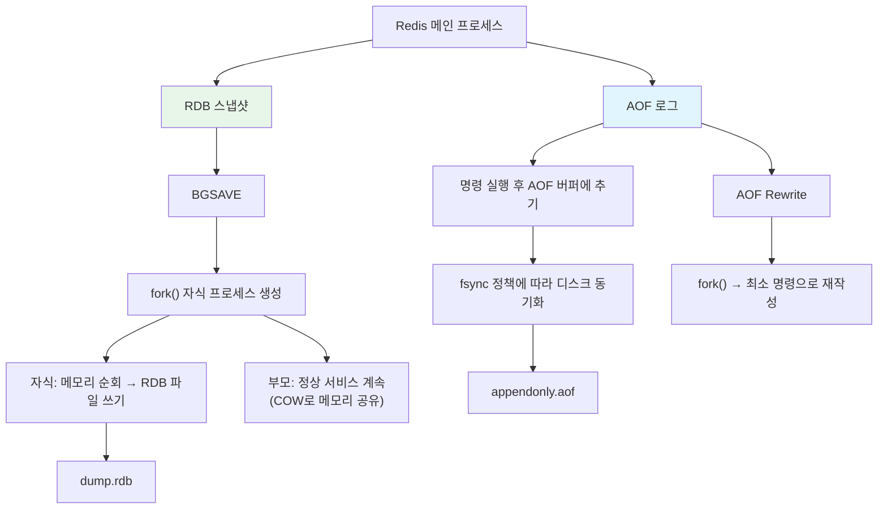

# 영속성: RDB와 AOF - Redis 데이터를 디스크에 안전하게 보존하는 메커니즘

Redis는 인메모리 데이터 스토어이지만 RDB 스냅샷과 AOF 로그 두 가지 방식으로 데이터를 디스크에 영속화한다. 이 문서에서는 BGSAVE의 fork()+COW 메커니즘, AOF의 fsync 정책과 Rewrite 과정, Redis 7의 Multi Part AOF, 그리고 하이브리드 모드까지 소스 코드 레벨에서 분석한다.

## 목차

1. [핵심 개념 (What)](#1-핵심-개념-what)
2. [왜 알아야 하는가 (Why)](#2-왜-알아야-하는가-why)
3. [내부 구현 분석 (How)](#3-내부-구현-분석-how)
4. [실전 예제](#4-실전-예제)
5. [정리](#5-정리)

---

## 1. 핵심 개념 (What)

### Redis 영속성이란?

Redis는 모든 데이터를 메모리에 보유하지만, 서버 재시작 시 데이터 손실을 방지하기 위해 디스크에 데이터를 기록하는 영속성 메커니즘을 제공한다. RDB(Redis Database)는 특정 시점의 전체 스냅샷을, AOF(Append Only File)는 쓰기 명령의 연속 로그를 저장한다.

### 핵심 구성요소

| 구성요소 | 역할 |
|---------|------|
| RDB (Redis Database) | 메모리의 전체 상태를 바이너리 스냅샷으로 저장. `BGSAVE` 명령으로 트리거 |
| AOF (Append Only File) | 모든 쓰기 명령을 텍스트 로그로 순차 기록. 재시작 시 재실행(replay)으로 복원 |
| `fork()` + COW | 자식 프로세스가 스냅샷을 생성하는 동안 부모는 계속 서비스. Copy-on-Write로 메모리 효율 확보 |
| `fsync` 정책 | AOF 쓰기를 디스크에 동기화하는 시점: `always`, `everysec`, `no` |
| AOF Rewrite | 커진 AOF 파일을 최소한의 명령으로 재작성하여 크기를 줄임 |
| Multi Part AOF | Redis 7에서 도입. AOF를 base + incremental 파일로 분리하여 Rewrite 안정성 향상 |
| 하이브리드 모드 | AOF 파일 앞부분에 RDB 스냅샷을, 뒷부분에 이후 명령을 기록. 빠른 로딩 + 완전한 복원 |

## 2. 왜 알아야 하는가 (Why)

### 실무에서 만나는 상황

1. **서버 재시작 후 데이터 손실**: 영속성을 설정하지 않으면 Redis 재시작 시 모든 데이터가 사라진다. RDB와 AOF의 특성을 이해하고 적절히 조합해야 데이터 안전성을 확보할 수 있다.

2. **BGSAVE 시 메모리 급증**: `fork()` 후 부모 프로세스에서 쓰기가 많으면 COW로 인해 메모리가 최대 2배까지 증가한다. 이 메커니즘을 이해해야 물리 메모리를 적절히 확보할 수 있다.

3. **AOF 파일 비대화**: AOF는 모든 쓰기 명령을 누적하므로 파일이 끝없이 커진다. AOF Rewrite의 자동 트리거 조건과 동작을 이해해야 디스크 용량 문제를 예방할 수 있다.

4. **fsync 정책에 따른 성능-내구성 트레이드오프**: `always`는 안전하지만 느리고, `no`는 빠르지만 데이터 손실 위험이 있다. 서비스 요구사항에 맞는 정책을 선택해야 한다.

## 3. 내부 구현 분석 (How)

### 3.1 RDB와 AOF 전체 아키텍처



### 3.2 RDB 스냅샷: BGSAVE와 fork()+COW

BGSAVE는 `fork()` 시스템 콜로 자식 프로세스를 생성하고, 자식이 메모리 전체를 스캔하여 RDB 파일을 작성한다.

```c
// rdb.c - BGSAVE 핵심 로직
int rdbSaveBackground(char *filename, rdbSaveInfo *rsi) {
    if (hasActiveChildProcess()) return C_ERR;  // 이미 자식 프로세스 존재

    // fork() 전 메모리 사용량 기록
    server.stat_fork_time = 0;
    long long start = ustime();

    if ((childpid = redisFork(CHILD_TYPE_RDB)) == 0) {
        // === 자식 프로세스 ===
        closeListeningSockets(0);

        // RDB 파일 쓰기
        retval = rdbSave(server.rdb_filename, rsi);

        exitFromChild((retval == C_OK) ? 0 : 1);
    } else {
        // === 부모 프로세스 ===
        server.stat_fork_time = ustime() - start;
        server.stat_fork_rate = (double)zmalloc_used_memory() * 1000000 /
                                 server.stat_fork_time /
                                 (1024 * 1024 * 1024);  // GB/sec
        server.child_type = CHILD_TYPE_RDB;
    }
    return C_OK;
}
```

**Copy-on-Write(COW) 동작 원리:**

```
fork() 직후:
┌──────────────────────┐     ┌──────────────────────┐
│    부모 프로세스       │     │    자식 프로세스       │
│  페이지 테이블        │     │  페이지 테이블        │
│  ┌───┬───┬───┬───┐   │     │  ┌───┬───┬───┬───┐   │
│  │ A │ B │ C │ D │───┼──┐  │  │ A │ B │ C │ D │───┤
│  └───┴───┴───┴───┘   │  │  │  └───┴───┴───┴───┘   │
└──────────────────────┘  │  └──────────────────────┘
                           │
                    ┌──────▼──────┐
                    │ 물리 메모리   │
                    │ (공유)       │
                    │ [A][B][C][D] │
                    └─────────────┘

부모에서 페이지 C에 쓰기 발생 시:
┌──────────────────────┐     ┌──────────────────────┐
│    부모 프로세스       │     │    자식 프로세스       │
│  ┌───┬───┬───┬───┐   │     │  ┌───┬───┬───┬───┐   │
│  │ A │ B │C' │ D │   │     │  │ A │ B │ C │ D │   │
│  └───┴───┴─│─┴───┘   │     │  └───┴───┴─│─┴───┘   │
└────────────│─────────┘     └────────────│─────────┘
             │                            │
      ┌──────▼──────┐              ┌──────▼──────┐
      │ C' (복사본)  │              │ [A][B][C][D] │
      │ 새 물리 페이지│              │ 원본 유지     │
      └─────────────┘              └─────────────┘
```

쓰기가 발생한 페이지만 복사되므로, 읽기 위주 워크로드에서는 메모리 오버헤드가 적다.

### 3.3 RDB 파일 포맷

```
┌─────────────┬──────────┬───────────┬─────────────┬──────────┐
│ "REDIS"     │ RDB      │ Auxiliary │ Database    │ EOF +    │
│ 매직 넘버    │ 버전(4B) │ 필드들     │ 데이터      │ CRC64    │
│ (5 bytes)   │ "0011"   │          │             │ 체크섬    │
└─────────────┴──────────┴───────────┴─────────────┴──────────┘

Database 섹션 상세:
┌──────────┬───────────┬────────────────────────────────────┐
│ DB 번호   │ Dict 크기  │ 키-값 쌍들                          │
│ (SELECTDB │ (RESIZEDB │ [만료시간][타입][키][값] ...        │
│ opcode)  │ opcode)   │                                    │
└──────────┴───────────┴────────────────────────────────────┘
```

로딩 과정:

```c
// rdb.c - RDB 파일 로딩 (간략화)
int rdbLoad(char *filename, rdbSaveInfo *rsi, int rdbflags) {
    // 1. 매직 넘버 확인: "REDIS0011"
    if (rioRead(&rdb, buf, 9) == 0) goto eoferr;
    if (memcmp(buf, "REDIS", 5) != 0) goto eoferr;

    // 2. Auxiliary 필드 읽기 (redis-ver, used-mem 등)
    // 3. 각 DB에 대해 키-값 쌍 복원
    while (1) {
        type = rdbLoadType(&rdb);
        if (type == RDB_OPCODE_EXPIRETIME_MS) {
            expiretime = rdbLoadMillisecondTime(&rdb, rdbver);
            type = rdbLoadType(&rdb);
        }
        if (type == RDB_OPCODE_EOF) break;

        key = rdbLoadStringObject(&rdb);
        val = rdbLoadObject(type, &rdb, key, db->id, &error);
        dbAdd(db, key, val);
        if (expiretime != -1) setExpire(NULL, db, key, expiretime);
    }

    // 4. CRC64 체크섬 검증
    cksum = rdb.cksum;
    rioRead(&rdb, &expected, 8);
    if (cksum != expected) goto eoferr;

    return C_OK;
}
```

### 3.4 AOF: 명령 로깅과 fsync 정책

AOF는 모든 쓰기 명령을 RESP 형식으로 파일에 추가(append)한다.

```c
// aof.c - 명령을 AOF 버퍼에 추기
void feedAppendOnlyFile(int dictid, robj **argv, int argc) {
    sds buf = sdsempty();

    // DB 선택 명령 추가 (필요 시)
    if (dictid != server.aof_selected_db) {
        buf = sdscatprintf(buf, "*2\r\n$6\r\nSELECT\r\n$%d\r\n%d\r\n",
                          digits, dictid);
        server.aof_selected_db = dictid;
    }

    // 명령을 RESP 형식으로 직렬화
    buf = catAppendOnlyGenericCommand(buf, argc, argv);

    // AOF 버퍼에 추가 (나중에 fsync)
    server.aof_buf = sdscatsds(server.aof_buf, buf);
}
```

fsync 정책 비교:

| 정책 | 동작 | 데이터 손실 위험 | 성능 영향 |
|------|------|----------------|----------|
| `always` | 매 명령마다 fsync | 거의 없음 (1명령) | 높음 (IOPS 제한) |
| `everysec` (기본) | 1초마다 별도 스레드에서 fsync | 최대 1초 분량 | 낮음 |
| `no` | OS에 위임 (보통 30초) | 최대 30초 분량 | 없음 |

```c
// aof.c - AOF 쓰기 및 fsync
void flushAppendOnlyFile(int force) {
    // 1. AOF 버퍼를 파일에 write()
    nwritten = aofWrite(server.aof_fd, server.aof_buf, sdslen(server.aof_buf));

    // 2. fsync 정책에 따라 디스크 동기화
    if (server.aof_fsync == AOF_FSYNC_ALWAYS) {
        // 즉시 fsync (메인 스레드에서 실행, 블로킹)
        redis_fsync(server.aof_fd);
    } else if (server.aof_fsync == AOF_FSYNC_EVERYSEC) {
        // 백그라운드 스레드에 fsync 요청
        if (time(NULL) - server.aof_last_fsync >= 1) {
            aof_background_fsync(server.aof_fd);
        }
    }
    // AOF_FSYNC_NO: OS가 알아서 처리
}
```

### 3.5 AOF Rewrite

AOF 파일은 시간이 지나면 중복 명령으로 비대해진다. Rewrite는 현재 메모리 상태를 최소 명령으로 재작성한다.

```
Rewrite 전 AOF:
SET counter 1
INCR counter
INCR counter
INCR counter
DEL tempkey
SET name "alice"
SET name "bob"
SET name "charlie"

Rewrite 후 AOF:
SET counter 4
SET name "charlie"
```

자동 트리거 조건:

```conf
# redis.conf
auto-aof-rewrite-percentage 100    # AOF 파일이 마지막 Rewrite 후 100% 이상 커지면
auto-aof-rewrite-min-size 64mb     # 최소 64MB 이상일 때만 트리거
```

```c
// aof.c - AOF Rewrite 트리거 판단
if (server.aof_rewrite_perc &&                              // 설정이 활성화됐고
    server.aof_current_size > server.aof_rewrite_min_size)  // 최소 크기 이상이고
{
    long long base = server.aof_rewrite_base_size ?
                     server.aof_rewrite_base_size : 1;
    long long growth = (server.aof_current_size * 100 / base) - 100;
    if (growth >= server.aof_rewrite_perc) {
        // Rewrite 시작
        rewriteAppendOnlyFileBackground();
    }
}
```

### 3.6 Redis 7의 Multi Part AOF (MP-AOF)

Redis 7 이전에는 Rewrite 중 새로운 명령이 AOF Rewrite 버퍼에 쌓이고, Rewrite 완료 후 이 버퍼를 새 AOF 파일에 추가했다. 이 과정에서 대량 쓰기가 발생하면 메모리와 I/O 부담이 컸다.

Redis 7에서는 AOF를 여러 파일로 분리한다.

```
appendonlydir/
├── appendonly.aof.1.base.rdb       ← Base 파일 (RDB 또는 AOF 형식)
├── appendonly.aof.1.incr.aof       ← Incremental 파일 1 (Rewrite 이후 명령)
├── appendonly.aof.2.incr.aof       ← Incremental 파일 2 (현재 기록 중)
└── appendonly.aof.manifest         ← 매니페스트 (파일 목록과 순서)
```

```
manifest 파일 내용:
file appendonly.aof.1.base.rdb seq 1 type b
file appendonly.aof.1.incr.aof seq 1 type i
file appendonly.aof.2.incr.aof seq 2 type i
```

Multi Part AOF의 장점:

| 개선 항목 | 이전 방식 | Multi Part AOF |
|-----------|----------|----------------|
| Rewrite 중 메모리 | AOF Rewrite 버퍼에 누적 | 별도 incr 파일에 직접 기록 |
| Rewrite 완료 시 | 대량 write + rename (위험) | manifest 파일만 갱신 (원자적) |
| 실패 복구 | AOF 파일 손상 가능 | base + incr 파일 독립적 |

### 3.7 하이브리드 모드: aof-use-rdb-preamble

AOF Rewrite 시 명령 대신 RDB 스냅샷을 앞부분에 기록하고, 이후 명령만 AOF 형식으로 추가한다.

```conf
# redis.conf (Redis 4.0+, Redis 7에서 기본 활성화)
aof-use-rdb-preamble yes
```

```
하이브리드 AOF 파일 구조:
┌─────────────────────────────┬──────────────────────────┐
│  RDB 스냅샷 (바이너리)        │  AOF 명령 (RESP 텍스트)   │
│  - 빠른 로딩 (바이너리 파싱)   │  - Rewrite 이후 명령만    │
│  - 전체 상태 포함             │  - 적은 양                │
└─────────────────────────────┴──────────────────────────┘
```

로딩 속도 비교:

| 방식 | 1GB 데이터 로딩 시간 | 데이터 완전성 |
|------|-------------------|-------------|
| RDB만 | ~10초 | 마지막 스냅샷까지 |
| AOF만 (RESP) | ~60초 | 거의 완전 |
| 하이브리드 | ~12초 | 거의 완전 |

### 3.8 RDB vs AOF 비교표

| 비교 항목 | RDB | AOF |
|-----------|-----|-----|
| 저장 형식 | 바이너리 스냅샷 | RESP 텍스트 명령 로그 |
| 저장 시점 | 주기적 (BGSAVE) | 매 쓰기 명령 |
| 파일 크기 | 작음 (압축) | 큼 (명령 누적) |
| 로딩 속도 | 빠름 | 느림 (명령 재실행) |
| 데이터 손실 | 마지막 스냅샷 이후 전체 | fsync 정책에 따라 0~30초 |
| CPU 부하 | fork() 시 일시적 | Rewrite 시 fork() |
| 메모리 부하 | COW로 최대 2배 | Rewrite 시 COW |
| 사람 가독성 | 없음 (바이너리) | 있음 (RESP 텍스트) |

## 4. 실전 예제

### 4.1 운영 환경 영속성 설정 권장 사항

```conf
# redis.conf - 운영 환경 권장 설정

# === RDB 설정 ===
# 자동 스냅샷 조건 (3600초 내 1건 이상 변경 시)
save 3600 1
save 300 100
save 60 10000

# RDB 파일명과 경로
dbfilename dump.rdb
dir /var/lib/redis

# RDB 저장 실패 시 쓰기 거부 (데이터 보호)
stop-writes-on-bgsave-error yes

# RDB 압축 (LZF, CPU 약간 사용하지만 디스크 절약)
rdbcompression yes
rdbchecksum yes

# === AOF 설정 ===
appendonly yes
appendfilename "appendonly.aof"
appenddirname "appendonlydir"

# fsync 정책: everysec (성능과 안전성의 균형)
appendfsync everysec

# Rewrite 중 fsync 지연 (Rewrite 성능 향상, 약간의 위험)
no-appendfsync-on-rewrite no

# AOF Rewrite 자동 트리거
auto-aof-rewrite-percentage 100
auto-aof-rewrite-min-size 64mb

# 하이브리드 모드 (빠른 로딩 + AOF 안전성)
aof-use-rdb-preamble yes

# === 메모리 보호 ===
# fork() 시 COW를 고려하여 maxmemory를 물리 메모리의 45% 이하로 설정
# (최악의 경우 2배 메모리 필요)
maxmemory 6gb
```

### 4.2 Spring Boot에서 영속성 상태 모니터링

```java
@Component
public class RedisPersistenceMonitor {

    private final StringRedisTemplate redisTemplate;
    private static final Logger log = LoggerFactory.getLogger(RedisPersistenceMonitor.class);

    public RedisPersistenceMonitor(StringRedisTemplate redisTemplate) {
        this.redisTemplate = redisTemplate;
    }

    /**
     * Redis 영속성 상태를 주기적으로 확인한다.
     * RDB/AOF 마지막 성공 시간, 상태, AOF 크기를 모니터링한다.
     */
    @Scheduled(fixedRate = 300_000)  // 5분마다
    public void checkPersistenceHealth() {
        Properties persistence = redisTemplate.execute(
            (RedisCallback<Properties>) connection ->
                connection.serverCommands().info("persistence")
        );

        if (persistence == null) {
            log.error("Redis INFO persistence 조회 실패");
            return;
        }

        // RDB 상태 확인
        String rdbLastStatus = persistence.getProperty("rdb_last_bgsave_status");
        long rdbLastSaveTime = Long.parseLong(
            persistence.getProperty("rdb_last_save_time", "0"));
        long rdbChangesSinceLastSave = Long.parseLong(
            persistence.getProperty("rdb_changes_since_last_save", "0"));

        if (!"ok".equals(rdbLastStatus)) {
            log.error("RDB 마지막 BGSAVE 실패! 상태: {}", rdbLastStatus);
        }

        long timeSinceLastSave = System.currentTimeMillis() / 1000 - rdbLastSaveTime;
        if (timeSinceLastSave > 7200) {  // 2시간 이상 스냅샷 없음
            log.warn("RDB 마지막 스냅샷 {}분 전. 변경 건수: {}",
                timeSinceLastSave / 60, rdbChangesSinceLastSave);
        }

        // AOF 상태 확인
        String aofEnabled = persistence.getProperty("aof_enabled");
        if ("1".equals(aofEnabled)) {
            String aofLastStatus = persistence.getProperty("aof_last_bgrewrite_status");
            long aofCurrentSize = Long.parseLong(
                persistence.getProperty("aof_current_size", "0"));
            long aofBaseSize = Long.parseLong(
                persistence.getProperty("aof_base_size", "0"));

            if (!"ok".equals(aofLastStatus)) {
                log.error("AOF 마지막 Rewrite 실패! 상태: {}", aofLastStatus);
            }

            // AOF 크기 증가율 체크
            if (aofBaseSize > 0) {
                double growthPercent = (double)(aofCurrentSize - aofBaseSize)
                    / aofBaseSize * 100;
                if (growthPercent > 80) {
                    log.warn("AOF 크기 {}% 증가 (base: {}MB, current: {}MB). "
                        + "Rewrite 임박!",
                        (int) growthPercent,
                        aofBaseSize / 1024 / 1024,
                        aofCurrentSize / 1024 / 1024);
                }
            }
        }
    }

    /**
     * 수동 BGSAVE 트리거 (배포 전, 유지보수 전 사용).
     */
    public void triggerBgsave() {
        redisTemplate.execute((RedisCallback<Object>) connection -> {
            connection.execute("BGSAVE");
            return null;
        });
        log.info("BGSAVE 명령 실행. 백그라운드 스냅샷 시작.");
    }
}
```

### 4.3 fork() COW 메모리 사용량 추적

```java
@Component
public class RedisForkMonitor {

    private final StringRedisTemplate redisTemplate;
    private final MeterRegistry meterRegistry;

    public RedisForkMonitor(StringRedisTemplate redisTemplate,
                            MeterRegistry meterRegistry) {
        this.redisTemplate = redisTemplate;
        this.meterRegistry = meterRegistry;
    }

    /**
     * fork() 시 COW 메모리 사용량을 모니터링한다.
     * COW가 크면 쓰기 워크로드가 많다는 의미이며,
     * maxmemory를 물리 메모리의 50% 이하로 낮추는 것을 검토해야 한다.
     */
    @Scheduled(fixedRate = 60_000)
    public void monitorForkStats() {
        Properties info = redisTemplate.execute(
            (RedisCallback<Properties>) connection ->
                connection.serverCommands().info("stats")
        );

        if (info == null) return;

        long forkUsec = Long.parseLong(
            info.getProperty("latest_fork_usec", "0"));

        Properties memInfo = redisTemplate.execute(
            (RedisCallback<Properties>) connection ->
                connection.serverCommands().info("memory")
        );

        if (memInfo != null) {
            long cowSize = Long.parseLong(
                memInfo.getProperty("rdb_last_cow_size", "0"));

            meterRegistry.gauge("redis.fork.duration_usec", forkUsec);
            meterRegistry.gauge("redis.fork.cow_size_bytes", cowSize);

            if (forkUsec > 500_000) {  // fork()가 500ms 이상
                log.warn("Redis fork() 소요 시간 {}ms. "
                    + "데이터셋이 크면 latency spike 발생 가능!",
                    forkUsec / 1000);
            }

            if (cowSize > 1024L * 1024 * 1024) {  // COW 1GB 이상
                log.warn("Redis COW 메모리 {}MB. "
                    + "쓰기 부하가 높으면 메모리 초과 위험!",
                    cowSize / 1024 / 1024);
            }
        }
    }
}
```

## 5. 정리

| 항목 | 설명 |
|-----|------|
| RDB 스냅샷 | `BGSAVE`로 fork() 후 자식 프로세스가 바이너리 스냅샷 생성. 빠른 로딩, 주기적 손실 가능 |
| fork() + COW | 부모-자식 메모리 공유, 쓰기 시만 페이지 복사. 쓰기 부하 시 메모리 최대 2배 |
| RDB 파일 포맷 | 매직 넘버 + 버전 + Aux 필드 + DB 데이터 + EOF + CRC64 체크섬 |
| AOF 로그 | 쓰기 명령을 RESP 형식으로 추기. fsync 정책으로 내구성-성능 조절 |
| fsync 정책 | `always`(매 명령), `everysec`(1초 주기, 기본), `no`(OS 위임) |
| AOF Rewrite | 누적된 AOF를 최소 명령으로 재작성. 자동 트리거: 크기 100% 증가 + 64MB 이상 |
| Multi Part AOF | Redis 7. base(RDB) + incremental(AOF) 파일 분리. Rewrite 안정성 향상 |
| 하이브리드 모드 | AOF 앞부분 RDB + 뒷부분 AOF. 빠른 로딩 + 높은 내구성 |

---
*참고: Redis 7.x 기준*
