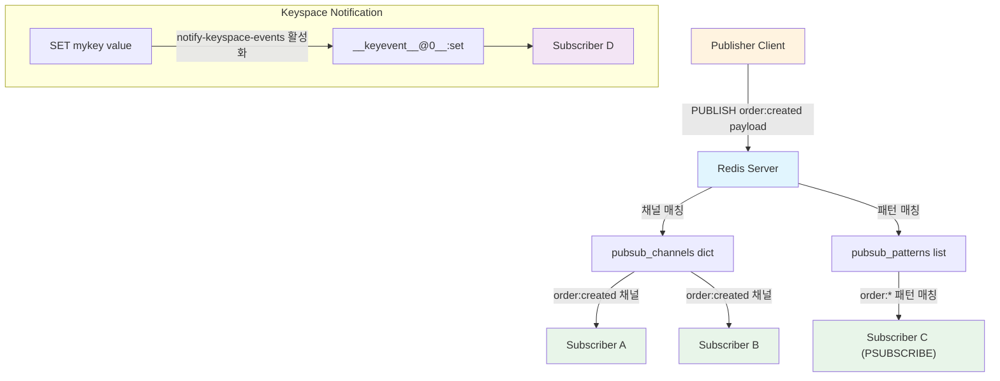
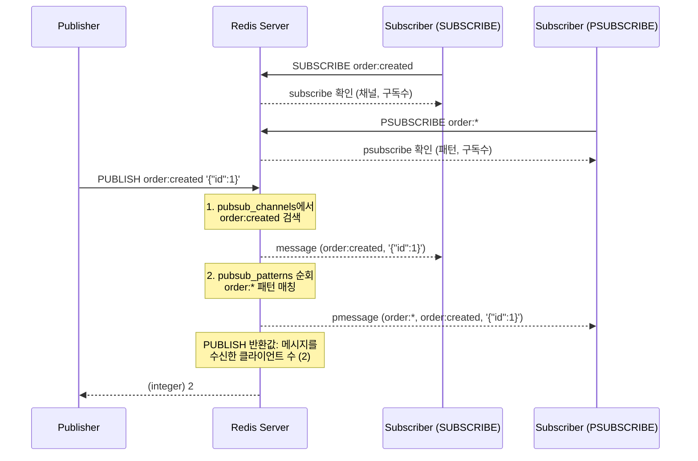
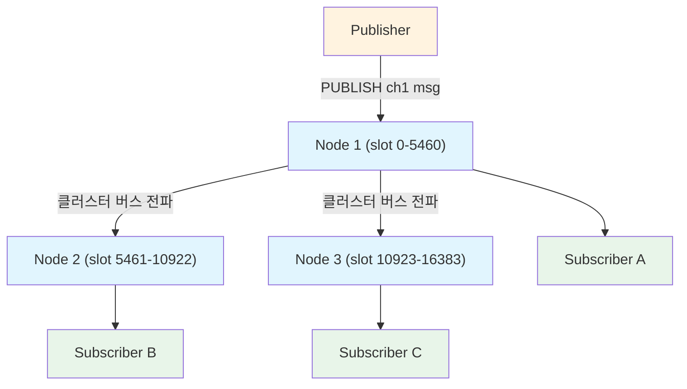

# Pub/Sub과 Keyspace Notification: 실시간 메시징의 내부 동작

Redis Pub/Sub은 발행-구독 패턴을 통해 클라이언트 간 실시간 메시지를 전달하며, Keyspace Notification은 키의 상태 변화를 이벤트로 감지할 수 있게 해준다. 이 문서에서는 Pub/Sub의 내부 구현 구조, 메시지 전달 보장 수준, 클러스터 모드별 동작 차이, Keyspace Notification 설정과 활용, 그리고 Stream과의 비교를 분석한다.

## 목차

1. [핵심 개념 (What)](#1-핵심-개념-what)
2. [왜 알아야 하는가 (Why)](#2-왜-알아야-하는가-why)
3. [내부 구현 분석 (How)](#3-내부-구현-분석-how)
4. [실전 예제](#4-실전-예제)
5. [정리](#5-정리)

---

## 1. 핵심 개념 (What)

### Pub/Sub이란?

Pub/Sub(Publish/Subscribe)은 메시지 발행자(Publisher)와 구독자(Subscriber)가 직접 연결되지 않고, **채널(Channel)**을 매개로 메시지를 주고받는 비동기 메시징 패턴이다. Redis는 이 패턴을 서버 레벨에서 네이티브로 지원한다.

### 핵심 구성요소

| 구성요소 | 역할 |
|---------|------|
| `SUBSCRIBE` | 특정 채널을 구독하여 메시지를 수신 대기 |
| `PUBLISH` | 특정 채널에 메시지를 발행 |
| `PSUBSCRIBE` | glob 패턴으로 여러 채널을 동시에 구독 |
| `UNSUBSCRIBE` / `PUNSUBSCRIBE` | 채널 또는 패턴 구독 해제 |
| `pubsub_channels` | 채널명을 키, 구독 클라이언트 리스트를 값으로 갖는 dict |
| `pubsub_patterns` | 패턴-클라이언트 매핑을 저장하는 linked list |
| Keyspace Notification | 키에 대한 명령 실행 시 `__keyevent__@<db>__` 채널로 이벤트 발행 |

### 메시지 전달 보장 수준

| 보장 수준 | 설명 |
|----------|------|
| **At-most-once** | 메시지는 최대 한 번 전달되며, 유실 가능 |
| 구독자 부재 시 | 해당 메시지는 **영구적으로 유실**됨 |
| 재연결 시 | 연결 끊김 동안의 메시지를 **복구할 수 없음** |
| 버퍼 초과 시 | 느린 구독자의 output buffer가 초과하면 연결이 강제 종료됨 |

## 2. 왜 알아야 하는가 (Why)

### 실무에서 만나는 상황

1. **실시간 알림 시스템**: 채팅, 실시간 대시보드, 알림 푸시 등에서 Pub/Sub을 활용하면 별도의 메시지 브로커 없이 빠른 실시간 통신이 가능하다.

2. **캐시 무효화 전파**: 분산 환경에서 하나의 노드가 캐시를 갱신하면 다른 노드에게 즉시 알려 로컬 캐시를 무효화해야 한다. Pub/Sub은 이 용도에 적합하다.

3. **캐시 만료 감지**: TTL이 설정된 키가 만료되었을 때 후속 처리(DB 동기화, 로그 기록 등)를 해야 하는 경우 Keyspace Notification이 필수적이다.

4. **Stream과의 선택**: 메시지 유실이 허용되는 Fire-and-forget 시나리오와 메시지 보존이 필요한 시나리오를 구분하여 Pub/Sub과 Stream 중 올바른 선택을 해야 한다.

## 3. 내부 구현 분석 (How)

### 3.1 전체 아키텍처 다이어그램



### 3.2 채널 기반 구독: pubsub_channels dict

Redis 서버 내부에서 `pubsub_channels`는 딕셔너리(해시테이블)로 관리된다. 채널명이 키이고, 해당 채널을 구독 중인 클라이언트 리스트가 값이다.

```c
// Redis 서버 내부 구조 (server.h 기반)
struct redisServer {
    dict *pubsub_channels;    // 채널명 -> 구독 클라이언트 리스트
    list *pubsub_patterns;    // 패턴-클라이언트 매핑 리스트
    dict *pubsubshard_channels; // Redis 7+ 샤드 채널
};
```

`SUBSCRIBE` 명령이 실행되면:

1. `pubsub_channels` dict에서 채널명을 검색한다
2. 채널이 없으면 새로 생성하고, 클라이언트를 리스트에 추가한다
3. 이미 존재하면 기존 리스트에 클라이언트를 추가한다

`PUBLISH` 명령이 실행되면:

1. `pubsub_channels`에서 해당 채널을 찾아 모든 구독 클라이언트에게 메시지를 전송한다 (O(N))
2. `pubsub_patterns`를 순회하며 패턴이 일치하는 클라이언트에게도 전송한다 (O(N+M))

### 3.3 패턴 기반 구독: pubsub_patterns list

`PSUBSCRIBE` 명령은 glob 스타일 패턴을 사용하여 여러 채널을 한 번에 구독한다.

```bash
# 패턴 구독 예시
PSUBSCRIBE order:*           # order:created, order:updated 등 모두 수신
PSUBSCRIBE __keyevent@0__:* # 0번 DB의 모든 keyevent 수신
```

패턴 매칭은 `PUBLISH` 시마다 `pubsub_patterns` 전체를 순회하므로, 패턴이 많아지면 성능에 영향을 줄 수 있다. Redis 7.0에서는 이를 최적화하기 위해 내부적으로 패턴을 dict로 관리하는 개선이 적용되었다.

### 3.4 Keyspace Notification 설정

Keyspace Notification은 기본적으로 **비활성화** 상태이다. `notify-keyspace-events` 설정으로 활성화한다.

```bash
# redis.conf 또는 CONFIG SET으로 설정
CONFIG SET notify-keyspace-events Ex
```

| 문자 | 의미 |
|------|------|
| `K` | `__keyspace@<db>__` 접두사 이벤트 활성화 |
| `E` | `__keyevent@<db>__` 접두사 이벤트 활성화 |
| `g` | DEL, EXPIRE, RENAME 등 일반 명령 |
| `$` | String 명령 |
| `l` | List 명령 |
| `s` | Set 명령 |
| `h` | Hash 명령 |
| `z` | Sorted Set 명령 |
| `x` | 만료(expired) 이벤트 |
| `e` | 퇴출(evicted) 이벤트 |
| `A` | `g$lshzxe`의 별칭 (모든 이벤트) |

`Ex` 설정은 `__keyevent@<db>__:expired` 채널로 키 만료 이벤트를 발행한다.

### 3.5 메시지 전달 흐름



### 3.6 클러스터 모드별 Pub/Sub 동작 비교

Redis의 배포 형태(Standalone, Sentinel, Cluster)에 따라 Pub/Sub의 메시지 전파 범위와 동작 방식이 크게 달라진다. 특히 Redis Cluster에서는 메시지 브로드캐스팅으로 인한 네트워크 오버헤드가 발생하므로 이를 이해하고 적절한 방식을 선택해야 한다.

#### 모드별 비교표

| 비교 항목 | Standalone | Sentinel | Cluster |
|----------|-----------|----------|---------|
| **메시지 전파 범위** | 단일 노드 내 | 단일 마스터 노드 내 | **모든 노드에 브로드캐스트** |
| **PUBLISH 네트워크 비용** | O(N) 구독자 수 | O(N) 구독자 수 | O(N) 구독자 + **노드 간 전파 비용** |
| **구독자 연결 위치** | 단일 서버 | 마스터 노드 | **어떤 노드든 가능** (메시지가 전파되므로) |
| **Failover 시 동작** | 서비스 중단 | 자동 승격, 재구독 필요 | 슬롯 마이그레이션, 재구독 필요 |
| **Keyspace Notification** | 정상 동작 | 정상 동작 | **해당 키가 위치한 노드에서만 발생** |
| **Sharded Pub/Sub** | 해당 없음 | 해당 없음 | Redis 7.0+ 지원 (SSUBSCRIBE) |

#### Standalone 모드

가장 단순한 구조로, 모든 Publisher와 Subscriber가 동일 노드에 연결된다. `PUBLISH` 시 해당 노드의 `pubsub_channels`만 검색하면 되므로 추가 네트워크 비용이 없다.

```
┌─────────────────────────────┐
│        Redis Server         │
│  pubsub_channels dict       │
│  ┌─────────┬────────────┐   │
│  │ channel │ subscribers│   │
│  └─────────┴────────────┘   │
│  Publisher → 채널 → 구독자   │
└─────────────────────────────┘
```

#### Sentinel 모드

Pub/Sub은 **마스터 노드에서만** 동작한다. Replica는 Pub/Sub 메시지를 전달하지 않는다. Sentinel 자체가 내부적으로 `__sentinel__:hello` 채널을 사용해 Sentinel 인스턴스 간 상태를 교환한다.

**Failover 시 주의사항:**
- 마스터가 교체되면 기존 Pub/Sub 연결이 끊어진다
- 클라이언트는 새 마스터에 **재구독**해야 한다
- Failover 동안 발행된 메시지는 **유실**된다 (At-most-once 특성)

```
┌──────────┐    ┌──────────┐    ┌──────────┐
│Sentinel 1│    │Sentinel 2│    │Sentinel 3│
└────┬─────┘    └────┬─────┘    └────┬─────┘
     │   __sentinel__:hello 채널     │
     └──────────────┼────────────────┘
                    │
              ┌─────┴─────┐
              │  Master    │ ← Pub/Sub 처리
              │  (Active)  │
              └─────┬─────┘
           ┌────────┴────────┐
      ┌────┴────┐      ┌────┴────┐
      │Replica 1│      │Replica 2│  ← Pub/Sub 미지원
      └─────────┘      └─────────┘
```

#### Cluster 모드 — 일반 Pub/Sub (PUBLISH/SUBSCRIBE)

Redis Cluster에서 `PUBLISH`를 실행하면, 해당 노드가 **클러스터 내 모든 노드에 메시지를 전파(broadcast)**한다. 구독자가 어떤 노드에 연결되어 있든 메시지를 수신할 수 있지만, 이로 인해 노드 수에 비례하는 네트워크 오버헤드가 발생한다.



**문제점:** 노드가 N개일 때, 하나의 `PUBLISH`가 N-1번의 클러스터 버스 메시지를 추가로 발생시킨다. 대규모 클러스터에서 Pub/Sub 트래픽이 많으면 클러스터 버스가 병목이 될 수 있다.

#### Cluster 모드 — Sharded Pub/Sub (Redis 7.0+)

Redis 7.0에서 도입된 **Sharded Pub/Sub**은 채널명을 해시 슬롯에 매핑하여, 해당 슬롯을 소유한 노드(와 그 Replica)에서만 메시지를 처리한다. 브로드캐스트가 발생하지 않으므로 네트워크 효율이 크게 향상된다.

| 비교 항목 | 일반 Pub/Sub (PUBLISH) | Sharded Pub/Sub (SPUBLISH) |
|----------|----------------------|---------------------------|
| **명령어** | SUBSCRIBE / PUBLISH | SSUBSCRIBE / SPUBLISH |
| **메시지 전파** | 모든 노드에 브로드캐스트 | 해당 슬롯의 노드에만 전달 |
| **네트워크 비용** | O(클러스터 노드 수) | O(1) — 슬롯 소유 노드만 |
| **구독자 연결 위치** | 아무 노드 | 해당 슬롯을 소유한 노드(또는 Replica) |
| **패턴 구독** | PSUBSCRIBE 지원 | 미지원 |
| **슬롯 마이그레이션** | 영향 없음 | 구독자가 새 노드로 재연결 필요 |

```bash
# Sharded Pub/Sub 사용 예시
# 채널 "order:events"는 CRC16("order:events") % 16384 슬롯에 매핑

# 구독 (해당 슬롯 노드에 연결해야 함)
SSUBSCRIBE order:events

# 발행 (해당 슬롯 노드에서만 처리)
SPUBLISH order:events '{"orderId": 1, "status": "created"}'
```

#### Cluster에서의 Keyspace Notification 주의사항

Keyspace Notification은 키가 저장된 노드에서만 발생한다. Cluster 모드에서는 키가 해시 슬롯에 따라 분산되므로:

- 특정 키의 만료 이벤트를 감지하려면 **해당 키가 위치한 노드에 구독**해야 한다
- 모든 키의 이벤트를 수신하려면 **모든 마스터 노드에 각각 구독**해야 한다
- Keyspace Notification은 클러스터 버스를 통해 전파되지 **않는다**

```java
// Cluster 환경에서 모든 노드의 Keyspace Notification 구독
@Configuration
public class ClusterKeyspaceNotificationConfig {

    @Bean
    public List<RedisMessageListenerContainer> keyspaceListenerContainers(
            RedisClusterConnection clusterConnection,
            RedisConnectionFactory connectionFactory,
            CacheExpirationHandler handler) {

        List<RedisMessageListenerContainer> containers = new ArrayList<>();

        // 클러스터의 모든 마스터 노드에 대해 리스너 등록
        for (RedisClusterNode masterNode : clusterConnection
                .clusterGetNodes()
                .stream()
                .filter(n -> n.isMaster())
                .toList()) {

            // 각 노드별 ConnectionFactory 생성 후 리스너 등록
            RedisMessageListenerContainer container =
                new RedisMessageListenerContainer();
            container.setConnectionFactory(
                createNodeConnectionFactory(masterNode));
            container.addMessageListener(
                handler,
                new PatternTopic("__keyevent@0__:expired"));
            containers.add(container);
        }
        return containers;
    }
}
```

#### 배포 모드 선택 가이드

```
Pub/Sub 사용 시 배포 모드 결정 흐름:

메시지 유실 허용? ──No──→ Stream 사용 고려
       │Yes
       ▼
단일 노드로 충분? ──Yes──→ Standalone
       │No
       ▼
HA만 필요? ──Yes──→ Sentinel (읽기 분산 불필요 시)
       │No
       ▼
대규모 데이터 분산 필요? ──Yes──→ Cluster
       │                          │
       │                  채널 수가 많고 트래픽이 높은가?
       │                    │Yes              │No
       │                    ▼                 ▼
       │            Sharded Pub/Sub     일반 Pub/Sub
       │            (Redis 7.0+)
       ▼
Sentinel + 애플리케이션 레벨 샤딩
```

### 3.7 Pub/Sub vs Stream 비교

| 비교 항목 | Pub/Sub | Stream |
|----------|---------|--------|
| 메시지 보존 | 보존 안 됨 (Fire-and-forget) | 영구 보존 (XADD로 저장) |
| 전달 보장 | At-most-once | At-least-once (XACK 기반) |
| 구독자 부재 시 | 메시지 유실 | 이후 XREAD로 읽기 가능 |
| Consumer Group | 지원 안 함 | XGROUP으로 지원 |
| 메시지 되감기 | 불가 | XRANGE로 과거 메시지 조회 가능 |
| 오버헤드 | 낮음 (메모리 미사용) | 높음 (메시지 저장 필요) |
| 적합한 시나리오 | 실시간 알림, 캐시 무효화 | 작업 큐, 이벤트 소싱 |

## 4. 실전 예제

### 4.1 Spring Boot에서 Pub/Sub 메시지 발행/구독

```java
// Redis Pub/Sub 설정
@Configuration
public class RedisPubSubConfig {

    @Bean
    public RedisMessageListenerContainer redisMessageListenerContainer(
            RedisConnectionFactory connectionFactory,
            OrderEventSubscriber orderEventSubscriber) {

        RedisMessageListenerContainer container = new RedisMessageListenerContainer();
        container.setConnectionFactory(connectionFactory);

        // 채널 기반 구독
        container.addMessageListener(
            orderEventSubscriber,
            new ChannelTopic("order:created")
        );

        // 패턴 기반 구독
        container.addMessageListener(
            orderEventSubscriber,
            new PatternTopic("order:*")
        );

        return container;
    }

    @Bean
    public RedisTemplate<String, Object> redisTemplate(
            RedisConnectionFactory connectionFactory) {
        RedisTemplate<String, Object> template = new RedisTemplate<>();
        template.setConnectionFactory(connectionFactory);
        template.setKeySerializer(new StringRedisSerializer());
        template.setValueSerializer(new GenericJackson2JsonRedisSerializer());
        return template;
    }
}
```

```java
// 메시지 구독자 (Subscriber)
@Slf4j
@Component
public class OrderEventSubscriber implements MessageListener {

    private final ObjectMapper objectMapper;

    public OrderEventSubscriber(ObjectMapper objectMapper) {
        this.objectMapper = objectMapper;
    }

    @Override
    public void onMessage(Message message, byte[] pattern) {
        try {
            String channel = new String(message.getChannel());
            String body = new String(message.getBody());

            log.info("Received message on channel [{}]: {}", channel, body);

            OrderEvent event = objectMapper.readValue(body, OrderEvent.class);
            processOrderEvent(event);

        } catch (JsonProcessingException e) {
            log.error("Failed to deserialize message", e);
        }
    }

    private void processOrderEvent(OrderEvent event) {
        // 주문 이벤트 처리 로직
        log.info("Processing order event: orderId={}, status={}",
            event.getOrderId(), event.getStatus());
    }
}
```

```java
// 메시지 발행자 (Publisher)
@Service
@RequiredArgsConstructor
public class OrderEventPublisher {

    private final RedisTemplate<String, Object> redisTemplate;

    public void publishOrderCreated(Order order) {
        OrderEvent event = new OrderEvent(
            order.getId(),
            "CREATED",
            LocalDateTime.now()
        );
        redisTemplate.convertAndSend("order:created", event);
    }

    public void publishOrderStatusChanged(Order order, String newStatus) {
        OrderEvent event = new OrderEvent(
            order.getId(),
            newStatus,
            LocalDateTime.now()
        );
        redisTemplate.convertAndSend("order:" + newStatus.toLowerCase(), event);
    }
}
```

### 4.2 Keyspace Notification으로 캐시 만료 감지

```java
// Keyspace Notification 설정 및 리스너
@Configuration
public class KeyspaceNotificationConfig {

    @Bean
    public RedisMessageListenerContainer keyspaceListenerContainer(
            RedisConnectionFactory connectionFactory,
            CacheExpirationHandler cacheExpirationHandler) {

        // Keyspace Notification 활성화 (Ex: expired 이벤트)
        RedisConnection connection = connectionFactory.getConnection();
        connection.serverCommands().setConfig(
            "notify-keyspace-events", "Ex"
        );
        connection.close();

        RedisMessageListenerContainer container = new RedisMessageListenerContainer();
        container.setConnectionFactory(connectionFactory);

        // 0번 DB의 만료 이벤트 구독
        container.addMessageListener(
            cacheExpirationHandler,
            new PatternTopic("__keyevent@0__:expired")
        );

        return container;
    }
}
```

```java
// 캐시 만료 핸들러
@Slf4j
@Component
@RequiredArgsConstructor
public class CacheExpirationHandler implements MessageListener {

    private final SessionRepository sessionRepository;
    private final NotificationService notificationService;

    @Override
    public void onMessage(Message message, byte[] pattern) {
        String expiredKey = new String(message.getBody());
        log.info("Key expired: {}", expiredKey);

        // 세션 키 만료 처리
        if (expiredKey.startsWith("session:")) {
            String sessionId = expiredKey.substring("session:".length());
            handleSessionExpired(sessionId);
        }

        // 캐시 키 만료 시 DB에서 재로드
        if (expiredKey.startsWith("cache:user:")) {
            String userId = expiredKey.substring("cache:user:".length());
            handleUserCacheExpired(userId);
        }
    }

    private void handleSessionExpired(String sessionId) {
        log.warn("Session expired: {}", sessionId);
        sessionRepository.markExpired(sessionId);
        notificationService.notifySessionExpired(sessionId);
    }

    private void handleUserCacheExpired(String userId) {
        log.info("User cache expired, scheduling reload: userId={}", userId);
        // 비동기로 캐시 재로드 예약
    }
}
```

### 4.3 Output Buffer 설정으로 느린 구독자 보호

```bash
# redis.conf - Pub/Sub 클라이언트의 output buffer 제한
# <class> <hard-limit> <soft-limit> <soft-seconds>
client-output-buffer-limit pubsub 256mb 64mb 60
```

위 설정은 Pub/Sub 구독자의 출력 버퍼가 256MB를 초과하면 즉시 연결을 끊고, 64MB를 60초 이상 유지하면 연결을 끊는다.

## 5. 정리

| 항목 | 설명 |
|-----|------|
| 채널 구독 | `SUBSCRIBE`로 특정 채널 구독, `pubsub_channels` dict에 저장 |
| 패턴 구독 | `PSUBSCRIBE`로 glob 패턴 구독, `pubsub_patterns` list에 저장 |
| 메시지 발행 | `PUBLISH`로 채널에 메시지 전송, 채널+패턴 모두 매칭하여 전달 |
| 전달 보장 | At-most-once, 구독자 부재 시 메시지 유실 |
| Keyspace Notification | `notify-keyspace-events` 설정으로 키 이벤트 구독 가능 |
| 만료 감지 | `Ex` 설정 후 `__keyevent@0__:expired` 채널 구독 |
| Stream과 차이 | Pub/Sub은 Fire-and-forget, Stream은 메시지 보존 및 Consumer Group 지원 |
| Cluster 일반 Pub/Sub | 모든 노드에 브로드캐스트, 노드 수에 비례하는 네트워크 비용 |
| Sharded Pub/Sub | Redis 7.0+, 채널을 해시 슬롯에 매핑하여 해당 노드에서만 처리 |
| Cluster Keyspace | 키가 위치한 노드에서만 이벤트 발생, 전파되지 않음 |
| Output Buffer | `client-output-buffer-limit pubsub`으로 느린 구독자 보호 |

---
*참고: Redis 7.x 기준*
