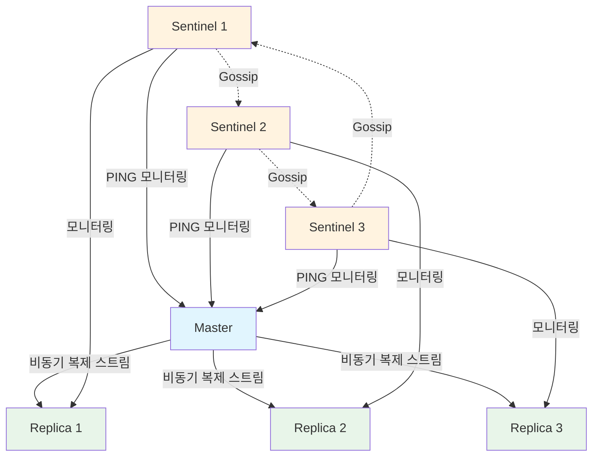
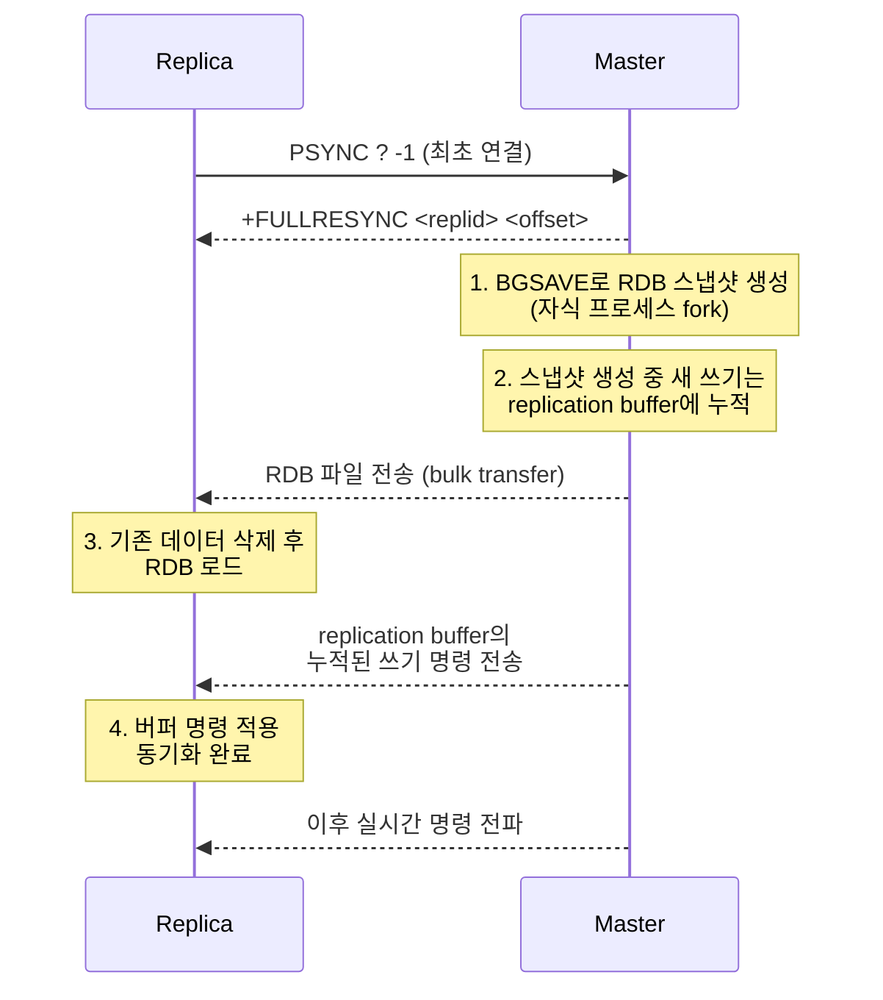
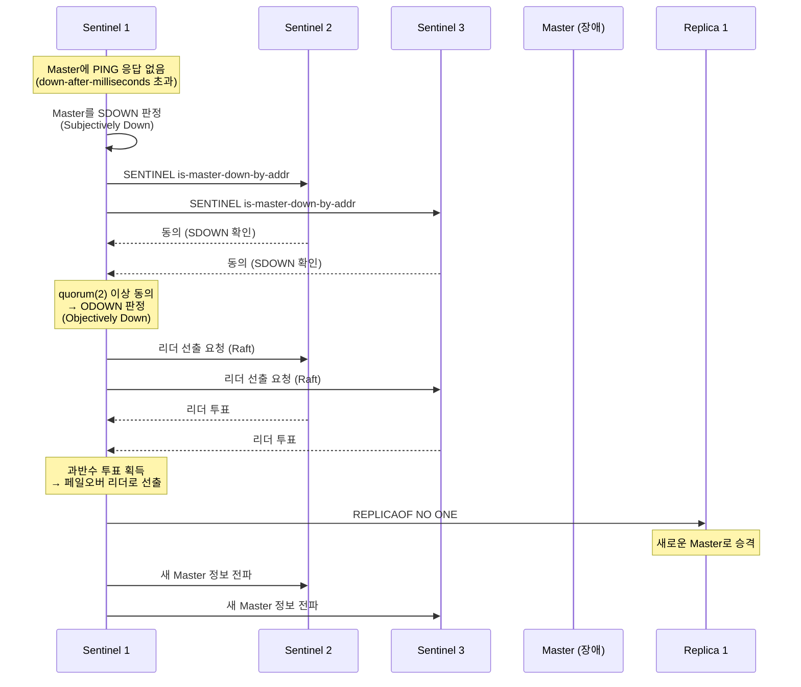

# 복제와 Sentinel 고가용성: 마스터-레플리카 동기화와 자동 페일오버

Redis 복제는 마스터의 데이터를 실시간으로 레플리카에 전파하여 읽기 분산과 데이터 안정성을 제공하며, Sentinel은 마스터 장애를 자동으로 감지하고 페일오버를 수행한다. 이 문서에서는 전체/부분 동기화 메커니즘, repl_backlog 구조, 비동기 복제의 한계, 그리고 Sentinel의 합의 기반 페일오버 과정을 분석한다.

## 목차

1. [핵심 개념 (What)](#1-핵심-개념-what)
2. [왜 알아야 하는가 (Why)](#2-왜-알아야-하는가-why)
3. [내부 구현 분석 (How)](#3-내부-구현-분석-how)
4. [실전 예제](#4-실전-예제)
5. [정리](#5-정리)

---

## 1. 핵심 개념 (What)

### 복제(Replication)란?

Redis 복제는 마스터 노드의 데이터를 하나 이상의 레플리카(replica) 노드에 실시간으로 전파하는 메커니즘이다. 레플리카는 마스터의 정확한 복사본을 유지하며, 읽기 요청을 분산 처리하거나 장애 시 대체 노드로 활용된다.

### 핵심 구성요소

| 구성요소 | 역할 |
|---------|------|
| `REPLICAOF` | 레플리카가 마스터를 지정하는 명령 |
| Full Sync (전체 동기화) | RDB 스냅샷 전체를 전송하여 초기 동기화 수행 |
| Partial Sync (부분 동기화) | repl_backlog에서 누락된 부분만 전송 |
| `repl_backlog` | 마스터가 보관하는 최근 쓰기 명령의 원형 버퍼 |
| Replication ID | 데이터셋의 고유 식별자, 부분 동기화 판단에 사용 |
| Replication Offset | 복제 스트림에서의 현재 위치 (바이트 단위) |
| `WAIT` | 지정된 수의 레플리카가 쓰기를 확인할 때까지 대기 |
| Sentinel | 마스터 모니터링, 장애 감지, 자동 페일오버를 수행하는 프로세스 |

### Sentinel 핵심 기능

| 기능 | 설명 |
|-----|------|
| **모니터링 (Monitoring)** | 마스터와 레플리카의 상태를 주기적으로 확인 |
| **알림 (Notification)** | 장애 감지 시 관리자 또는 애플리케이션에 알림 |
| **자동 페일오버 (Automatic Failover)** | 마스터 장애 시 레플리카를 새로운 마스터로 승격 |
| **설정 제공자 (Configuration Provider)** | 클라이언트에게 현재 마스터 주소를 제공 |

## 2. 왜 알아야 하는가 (Why)

### 실무에서 만나는 상황

1. **서비스 무중단 운영**: 마스터 장애 시 수동 개입 없이 자동으로 레플리카가 승격되어야 한다. Sentinel 없이는 장애 복구에 수 분에서 수십 분이 걸릴 수 있다.

2. **비동기 복제에 의한 데이터 유실**: 마스터에 쓰기 후 레플리카에 전파되기 전에 마스터가 죽으면 해당 쓰기는 유실된다. `WAIT` 명령의 한계와 트레이드오프를 이해해야 한다.

3. **읽기 분산 설계**: 레플리카에서 읽기를 수행할 때, 비동기 복제로 인해 stale data를 읽을 가능성이 있다. 이 지연의 정도와 대응 방법을 알아야 한다.

4. **네트워크 파티션 대응**: Split-brain 상황에서 두 마스터가 동시에 존재하는 문제를 방지하려면 Sentinel quorum과 `min-replicas-to-write` 설정을 올바르게 구성해야 한다.

## 3. 내부 구현 분석 (How)

### 3.1 전체 복제 아키텍처



### 3.2 전체 동기화 (Full Synchronization)

레플리카가 처음 연결되거나 부분 동기화가 불가능할 때 전체 동기화가 발생한다.



**전체 동기화의 비용:**
- 마스터에서 `fork()` 호출로 인한 메모리 오버헤드
- RDB 파일 크기만큼의 네트워크 전송
- 레플리카가 데이터 로딩 중 서비스 불가

### 3.3 부분 동기화 (Partial Synchronization)

레플리카가 일시적으로 연결이 끊겼다 재연결될 때, `repl_backlog`를 활용하여 누락된 명령만 전송한다.

```bash
# repl_backlog 크기 설정 (기본 1MB)
repl-backlog-size 256mb

# backlog 유지 시간 (레플리카 연결이 없을 때)
repl-backlog-ttl 3600
```

부분 동기화의 조건:
1. 레플리카가 보낸 Replication ID가 마스터의 현재 또는 이전 ID와 일치
2. 레플리카의 offset이 `repl_backlog` 범위 안에 존재

```bash
# 레플리카 재연결 시
PSYNC <replid> <offset>

# 마스터 응답 (부분 동기화 가능)
+CONTINUE <replid>

# 마스터 응답 (부분 동기화 불가 -> 전체 동기화)
+FULLRESYNC <replid> <offset>
```

### 3.4 비동기 복제와 WAIT 명령

Redis 복제는 기본적으로 **비동기**이다. 마스터는 쓰기 명령을 실행한 즉시 클라이언트에 응답하고, 레플리카로의 전파는 나중에 일어난다.

```bash
# WAIT: N개 레플리카가 offset까지 따라올 때까지 대기
# WAIT <numreplicas> <timeout_ms>
SET critical:data "important_value"
WAIT 2 5000  # 2개 레플리카 확인, 최대 5초 대기
# 반환값: 확인된 레플리카 수
```

**WAIT의 한계:**
- 타임아웃이 발생해도 마스터의 쓰기는 취소되지 않는다 (롤백 없음)
- 진정한 동기 복제가 아니라 "동기 대기"에 가깝다
- 네트워크 파티션 시 마스터가 쓰기를 계속 받아들이는 것을 막지 못한다

### 3.5 Split-brain 방지 설정

```bash
# 최소 레플리카 수가 충족되지 않으면 쓰기 거부
min-replicas-to-write 1

# 레플리카의 최대 허용 지연 시간 (초)
min-replicas-max-lag 10
```

이 설정은 마스터가 네트워크 파티션으로 격리되었을 때, 쓰기를 받지 않도록 하여 데이터 불일치를 최소화한다.

### 3.6 Sentinel 페일오버 과정



**페일오버 단계:**

1. **SDOWN (Subjective Down)**: 개별 Sentinel이 `down-after-milliseconds` 동안 마스터 응답을 받지 못하면 주관적 판정
2. **ODOWN (Objective Down)**: `quorum` 수 이상의 Sentinel이 SDOWN에 동의하면 객관적 판정
3. **리더 선출**: Raft 기반 알고리즘으로 페일오버를 수행할 Sentinel 리더를 선출
4. **레플리카 승격**: 리더 Sentinel이 가장 적합한 레플리카를 선택하여 `REPLICAOF NO ONE` 실행
5. **구성 전파**: 다른 레플리카들에게 새 마스터 정보를 전파하고, Sentinel 설정을 업데이트

### 3.7 레플리카 선택 기준

Sentinel이 승격할 레플리카를 선택하는 우선순위:

1. `replica-priority` 값이 낮은 레플리카 (0이면 승격 대상에서 제외)
2. Replication offset이 가장 큰 레플리카 (데이터가 가장 최신)
3. Run ID가 사전순으로 가장 작은 레플리카 (동률 시 타이브레이커)

## 4. 실전 예제

### 4.1 Sentinel 구성 파일

```bash
# sentinel.conf
port 26379
sentinel monitor mymaster 192.168.1.100 6379 2
sentinel down-after-milliseconds mymaster 5000
sentinel failover-timeout mymaster 60000
sentinel parallel-syncs mymaster 1

# 인증 설정
sentinel auth-pass mymaster mypassword

# 페일오버 알림 스크립트
sentinel notification-script mymaster /opt/redis/notify.sh
sentinel client-reconfig-script mymaster /opt/redis/reconfig.sh
```

| 설정 | 설명 |
|-----|------|
| `sentinel monitor` | 모니터링 대상 마스터, quorum=2 |
| `down-after-milliseconds` | SDOWN 판정까지 응답 대기 시간 |
| `failover-timeout` | 페일오버 전체 타임아웃 |
| `parallel-syncs` | 페일오버 후 동시에 새 마스터를 동기화하는 레플리카 수 |

### 4.2 Spring Boot에서 Sentinel 연결 설정

```yaml
# application.yml
spring:
  data:
    redis:
      sentinel:
        master: mymaster
        nodes:
          - 192.168.1.101:26379
          - 192.168.1.102:26379
          - 192.168.1.103:26379
        password: mypassword
      password: mypassword
      timeout: 3000ms
      lettuce:
        pool:
          max-active: 16
          max-idle: 8
          min-idle: 4
          max-wait: 3000ms
```

```java
// Sentinel 연결 설정 (Lettuce 기반)
@Configuration
public class RedisSentinelConfig {

    @Bean
    public LettuceConnectionFactory redisConnectionFactory() {
        RedisSentinelConfiguration sentinelConfig = new RedisSentinelConfiguration()
            .master("mymaster")
            .sentinel("192.168.1.101", 26379)
            .sentinel("192.168.1.102", 26379)
            .sentinel("192.168.1.103", 26379);

        sentinelConfig.setPassword(RedisPassword.of("mypassword"));

        LettuceClientConfiguration clientConfig = LettuceClientConfiguration.builder()
            .commandTimeout(Duration.ofSeconds(3))
            .readFrom(ReadFrom.REPLICA_PREFERRED)  // 읽기는 레플리카 우선
            .build();

        return new LettuceConnectionFactory(sentinelConfig, clientConfig);
    }

    @Bean
    public RedisTemplate<String, Object> redisTemplate(
            LettuceConnectionFactory connectionFactory) {
        RedisTemplate<String, Object> template = new RedisTemplate<>();
        template.setConnectionFactory(connectionFactory);
        template.setKeySerializer(new StringRedisSerializer());
        template.setValueSerializer(new GenericJackson2JsonRedisSerializer());
        template.setHashKeySerializer(new StringRedisSerializer());
        template.setHashValueSerializer(new GenericJackson2JsonRedisSerializer());
        return template;
    }
}
```

### 4.3 WAIT 명령을 활용한 중요 데이터 보호

```java
@Service
@RequiredArgsConstructor
public class CriticalDataService {

    private final StringRedisTemplate redisTemplate;

    /**
     * 중요 데이터는 최소 1개 레플리카에 복제 확인 후 반환
     */
    public void saveCriticalData(String key, String value) {
        redisTemplate.opsForValue().set(key, value);

        // Lettuce의 WAIT 명령 실행
        Long replicasConfirmed = redisTemplate.execute((RedisCallback<Long>) connection ->
            connection.serverCommands().waitForReplication(1, 5000)
        );

        if (replicasConfirmed == null || replicasConfirmed < 1) {
            throw new ReplicationException(
                "Failed to confirm replication: confirmed=" + replicasConfirmed);
        }
    }
}
```

### 4.4 복제 상태 모니터링

```bash
# 마스터에서 복제 상태 확인
redis-cli INFO replication

# 주요 출력 항목
# role:master
# connected_slaves:2
# slave0:ip=192.168.1.101,port=6379,state=online,offset=1234567,lag=0
# slave1:ip=192.168.1.102,port=6379,state=online,offset=1234560,lag=1
# master_replid:abc123...
# master_repl_offset:1234567
# repl_backlog_active:1
# repl_backlog_size:268435456
```

## 5. 정리

| 항목 | 설명 |
|-----|------|
| 전체 동기화 | RDB 스냅샷 전체 전송, 초기 연결이나 backlog 범위 초과 시 발생 |
| 부분 동기화 | repl_backlog에서 누락된 명령만 전송, Replication ID와 offset으로 판단 |
| 비동기 복제 | 마스터는 쓰기 즉시 응답, 레플리카 전파는 비동기 (데이터 유실 가능) |
| WAIT 명령 | N개 레플리카 확인까지 대기하지만, 진정한 동기 복제는 아님 |
| SDOWN | 개별 Sentinel의 주관적 장애 판정 |
| ODOWN | quorum 이상 Sentinel의 객관적 장애 판정 |
| 페일오버 | ODOWN 판정 -> 리더 선출 (Raft) -> 레플리카 승격 -> 구성 전파 |
| Split-brain 방지 | `min-replicas-to-write`, `min-replicas-max-lag` 설정 |

---
*참고: Redis 7.x 기준*
