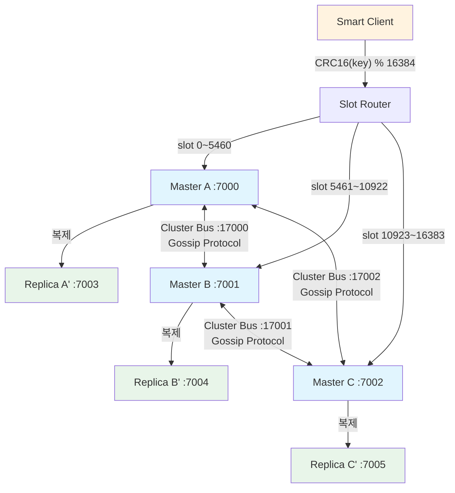
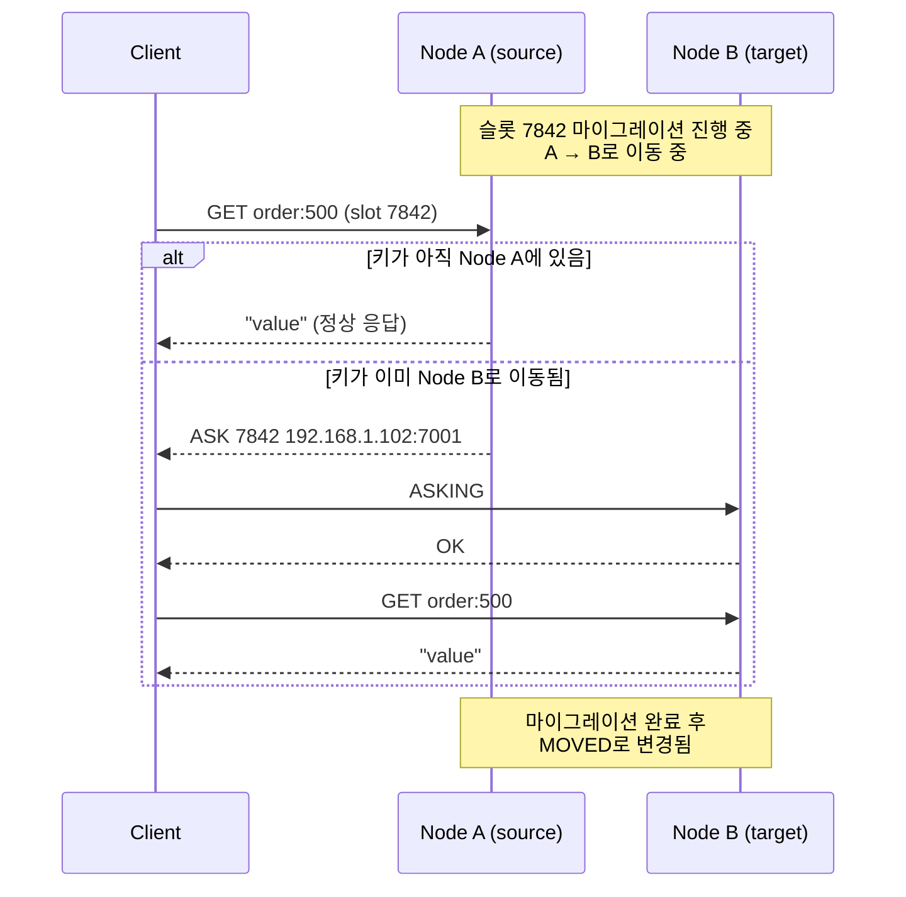

# Redis Cluster 아키텍처: 수평 확장과 자동 샤딩의 원리

Redis Cluster는 데이터를 16384개의 해시 슬롯으로 분할하여 여러 노드에 자동 분산하며, 노드 간 Gossip 프로토콜로 클러스터 상태를 관리한다. 이 문서에서는 해시 슬롯 매핑, MOVED/ASK 리다이렉션, 리샤딩 과정, 클러스터 페일오버, 그리고 멀티키 명령의 제약사항을 분석한다.

## 목차

1. [핵심 개념 (What)](#1-핵심-개념-what)
2. [왜 알아야 하는가 (Why)](#2-왜-알아야-하는가-why)
3. [내부 구현 분석 (How)](#3-내부-구현-분석-how)
4. [실전 예제](#4-실전-예제)
5. [정리](#5-정리)

---

## 1. 핵심 개념 (What)

### Redis Cluster란?

Redis Cluster는 Redis의 분산 구현으로, 데이터를 여러 노드에 자동으로 샤딩하여 수평 확장을 가능하게 한다. 별도의 프록시 없이 클라이언트가 직접 올바른 노드에 연결하는 클라이언트 사이드 샤딩 방식을 사용한다.

### 핵심 구성요소

| 구성요소 | 역할 |
|---------|------|
| Hash Slot | 키를 분산하는 단위, 총 16384개 (0~16383) |
| CRC16 해싱 | 키의 해시값을 계산하는 알고리즘 |
| Cluster Bus | 노드 간 통신을 위한 내부 프로토콜 (port + 10000) |
| Gossip Protocol | 클러스터 상태 정보를 노드 간 전파하는 프로토콜 |
| MOVED 리다이렉션 | 키가 다른 노드에 있을 때 올바른 노드로 안내 |
| ASK 리다이렉션 | 리샤딩 진행 중 임시 리다이렉션 |
| Hash Tag | `{tag}key` 형태로 같은 슬롯에 키를 강제 배치 |
| Epoch | 클러스터 설정 버전 번호, 충돌 해결에 사용 |

### 슬롯 분배 예시 (3 마스터 구성)

| 노드 | 슬롯 범위 | 키 예시 |
|-----|----------|--------|
| Master A | 0 ~ 5460 | user:100 (CRC16 % 16384 = 2301) |
| Master B | 5461 ~ 10922 | order:500 (CRC16 % 16384 = 7842) |
| Master C | 10923 ~ 16383 | product:99 (CRC16 % 16384 = 13109) |

## 2. 왜 알아야 하는가 (Why)

### 실무에서 만나는 상황

1. **메모리 한계 돌파**: 단일 Redis 노드의 메모리 한계(수십~수백 GB)를 넘는 데이터셋을 처리해야 할 때 Cluster로 수평 확장한다.

2. **CROSSSLOT 에러 대응**: 멀티키 명령(MGET, MSET, 트랜잭션)이 서로 다른 슬롯의 키를 참조하면 에러가 발생한다. Hash Tag로 해결하거나 애플리케이션 레벨에서 분할 처리해야 한다.

3. **리샤딩 계획**: 노드를 추가하거나 제거할 때 슬롯 마이그레이션 과정을 이해해야 서비스 중단 없이 클러스터를 확장/축소할 수 있다.

4. **클라이언트 라이브러리 설정**: Smart Client(Lettuce, Jedis)가 MOVED/ASK 리다이렉션을 처리하는 방식을 이해해야 최적의 성능을 얻을 수 있다.

## 3. 내부 구현 분석 (How)

### 3.1 클러스터 토폴로지 다이어그램



### 3.2 해시 슬롯 계산

Redis Cluster는 키의 해시 슬롯을 다음과 같이 계산한다:

```bash
HASH_SLOT = CRC16(key) mod 16384
```

Hash Tag가 있는 경우 `{}`안의 문자열만 해시에 사용한다:

```bash
# 일반 키: 전체 문자열로 해시
CRC16("user:100") % 16384 = 2301

# Hash Tag 키: {} 안의 문자열로 해시
CRC16("100") % 16384   # {100}:profile과 {100}:orders가 같은 슬롯
```

```bash
# 같은 슬롯에 배치되는 키 예시
SET {user:100}:profile "..."
SET {user:100}:orders "..."
SET {user:100}:cart "..."

# Hash Tag 활용 시 멀티키 명령 가능
MGET {user:100}:profile {user:100}:orders {user:100}:cart
```

### 3.3 MOVED 리다이렉션

클라이언트가 잘못된 노드에 요청하면 MOVED 응답을 받는다.

```bash
# 클라이언트가 Node A에 요청했지만, 키는 Node B가 담당
> GET order:500
(error) MOVED 7842 192.168.1.102:7001
```

Smart Client는 MOVED 응답을 받으면:
1. 슬롯-노드 매핑 테이블을 갱신한다
2. 올바른 노드로 요청을 재전송한다
3. 이후 같은 슬롯의 요청은 직접 올바른 노드로 전송한다

### 3.4 ASK 리다이렉션과 리샤딩

리샤딩(슬롯 마이그레이션) 진행 중에는 ASK 리다이렉션이 발생한다.



**MOVED vs ASK 차이:**

| 항목 | MOVED | ASK |
|-----|-------|-----|
| 의미 | 슬롯이 영구적으로 다른 노드에 있음 | 슬롯이 마이그레이션 중이며 일시적 리다이렉션 |
| 클라이언트 동작 | 슬롯 매핑 테이블 갱신 | 다음 요청만 대상 노드로, 매핑은 갱신하지 않음 |
| ASKING 필요 | 불필요 | 대상 노드에 ASKING 명령 선행 필요 |

### 3.5 슬롯 마이그레이션 과정

```bash
# 1. 대상 노드에서 슬롯 가져오기 준비
redis-cli -c -h target CLUSTER SETSLOT 7842 IMPORTING <source-node-id>

# 2. 소스 노드에서 슬롯 내보내기 준비
redis-cli -c -h source CLUSTER SETSLOT 7842 MIGRATING <target-node-id>

# 3. 소스 노드에서 해당 슬롯의 키 목록 조회
redis-cli -c -h source CLUSTER GETKEYSINSLOT 7842 100

# 4. 키를 하나씩 또는 배치로 마이그레이션
redis-cli -c -h source MIGRATE target_host target_port "" 0 5000 KEYS key1 key2 key3

# 5. 모든 키 마이그레이션 완료 후, 모든 노드에 슬롯 할당 알림
redis-cli -c -h node CLUSTER SETSLOT 7842 NODE <target-node-id>
```

실제 운영에서는 `redis-cli --cluster reshard` 명령으로 자동화한다:

```bash
redis-cli --cluster reshard 192.168.1.100:7000 \
    --cluster-from <source-node-id> \
    --cluster-to <target-node-id> \
    --cluster-slots 1000 \
    --cluster-yes
```

### 3.6 클러스터 페일오버

마스터 노드 장애 시 해당 마스터의 레플리카가 자동으로 승격된다.

1. **장애 감지**: 과반수 마스터가 특정 노드를 PFAIL(Probable Failure)로 판정하면 FAIL 상태로 전환
2. **레플리카 선출**: 해당 마스터의 레플리카가 다른 마스터들에게 투표를 요청
3. **과반수 투표**: 전체 마스터 노드 과반수의 투표를 받은 레플리카가 새 마스터로 승격
4. **Epoch 증가**: 새 마스터는 configEpoch를 증가시키고 새로운 구성을 전파

```bash
# 수동 페일오버 (유지보수 시 사용)
redis-cli -h replica CLUSTER FAILOVER

# 강제 페일오버 (마스터 응답 없을 때)
redis-cli -h replica CLUSTER FAILOVER FORCE
```

### 3.7 크로스 슬롯 제약사항

```bash
# 에러: 서로 다른 슬롯의 키를 멀티키 명령으로 사용
> MGET user:100 order:500
(error) CROSSSLOT Keys in request don't hash to the same slot

# 해결: Hash Tag 사용
> MGET {entity}:user:100 {entity}:order:500
OK

# 트랜잭션도 동일한 제약
> MULTI
> SET user:100 "..."   # slot 2301
> SET order:500 "..."  # slot 7842
> EXEC
(error) CROSSSLOT Keys in request don't hash to the same slot
```

**제한되는 명령:**
- `MGET`, `MSET`, `DEL` (여러 키)
- `SUNION`, `SINTER`, `SDIFF` 등 집합 연산
- `RENAME`, `RENAMENX`
- `MULTI/EXEC` 트랜잭션 (다른 슬롯의 키 포함 시)
- Lua 스크립트 (다른 슬롯의 키 접근 시)

## 4. 실전 예제

### 4.1 Redis Cluster 구성

```bash
# 6개 노드 (3 마스터 + 3 레플리카) 클러스터 생성
redis-cli --cluster create \
    192.168.1.100:7000 192.168.1.101:7001 192.168.1.102:7002 \
    192.168.1.103:7003 192.168.1.104:7004 192.168.1.105:7005 \
    --cluster-replicas 1

# 클러스터 상태 확인
redis-cli -c -h 192.168.1.100 -p 7000 CLUSTER INFO

# 노드 목록 및 슬롯 배분 확인
redis-cli -c -h 192.168.1.100 -p 7000 CLUSTER NODES

# 슬롯 분배 확인
redis-cli -c -h 192.168.1.100 -p 7000 CLUSTER SLOTS
```

### 4.2 Spring Boot에서 Redis Cluster 연동

```yaml
# application.yml
spring:
  data:
    redis:
      cluster:
        nodes:
          - 192.168.1.100:7000
          - 192.168.1.101:7001
          - 192.168.1.102:7002
          - 192.168.1.103:7003
          - 192.168.1.104:7004
          - 192.168.1.105:7005
        max-redirects: 3
      password: mypassword
      timeout: 3000ms
      lettuce:
        pool:
          max-active: 16
          max-idle: 8
          min-idle: 4
        cluster:
          refresh:
            adaptive: true
            period: 30s
```

```java
// Redis Cluster 설정 (Lettuce 기반)
@Configuration
public class RedisClusterConfig {

    @Value("${spring.data.redis.cluster.nodes}")
    private List<String> clusterNodes;

    @Bean
    public LettuceConnectionFactory redisConnectionFactory() {
        RedisClusterConfiguration clusterConfig = new RedisClusterConfiguration(clusterNodes);
        clusterConfig.setMaxRedirects(3);
        clusterConfig.setPassword(RedisPassword.of("mypassword"));

        // Adaptive Topology Refresh: 클러스터 변경 자동 감지
        ClusterTopologyRefreshOptions topologyRefreshOptions =
            ClusterTopologyRefreshOptions.builder()
                .enableAdaptiveRefreshTrigger(
                    ClusterTopologyRefreshOptions.RefreshTrigger.MOVED_REDIRECT,
                    ClusterTopologyRefreshOptions.RefreshTrigger.ASK_REDIRECT,
                    ClusterTopologyRefreshOptions.RefreshTrigger.PERSISTENT_RECONNECTS)
                .enablePeriodicRefresh(Duration.ofSeconds(30))
                .build();

        ClusterClientOptions clientOptions = ClusterClientOptions.builder()
            .topologyRefreshOptions(topologyRefreshOptions)
            .autoReconnect(true)
            .build();

        LettuceClientConfiguration clientConfig = LettuceClientConfiguration.builder()
            .clientOptions(clientOptions)
            .readFrom(ReadFrom.REPLICA_PREFERRED)
            .commandTimeout(Duration.ofSeconds(3))
            .build();

        return new LettuceConnectionFactory(clusterConfig, clientConfig);
    }

    @Bean
    public RedisTemplate<String, Object> redisTemplate(
            LettuceConnectionFactory connectionFactory) {
        RedisTemplate<String, Object> template = new RedisTemplate<>();
        template.setConnectionFactory(connectionFactory);
        template.setKeySerializer(new StringRedisSerializer());
        template.setValueSerializer(new GenericJackson2JsonRedisSerializer());
        template.setHashKeySerializer(new StringRedisSerializer());
        template.setHashValueSerializer(new GenericJackson2JsonRedisSerializer());
        return template;
    }
}
```

### 4.3 Hash Tag를 활용한 관련 데이터 동일 슬롯 배치

```java
@Service
@RequiredArgsConstructor
public class UserProfileService {

    private final RedisTemplate<String, Object> redisTemplate;

    /**
     * Hash Tag로 사용자 관련 데이터를 같은 슬롯에 배치
     * {user:100}:profile, {user:100}:orders, {user:100}:cart
     * 모두 CRC16("user:100") % 16384 = 같은 슬롯
     */
    public void saveUserData(Long userId, UserProfile profile, List<Order> orders) {
        String profileKey = "{user:" + userId + "}:profile";
        String ordersKey = "{user:" + userId + "}:orders";
        String cartKey = "{user:" + userId + "}:cart";

        // 같은 슬롯이므로 파이프라이닝 가능
        redisTemplate.executePipelined((RedisCallback<Object>) connection -> {
            StringRedisSerializer serializer = new StringRedisSerializer();
            GenericJackson2JsonRedisSerializer valueSerializer =
                new GenericJackson2JsonRedisSerializer();

            connection.stringCommands().set(
                serializer.serialize(profileKey),
                valueSerializer.serialize(profile)
            );
            connection.stringCommands().set(
                serializer.serialize(ordersKey),
                valueSerializer.serialize(orders)
            );
            return null;
        });
    }

    /**
     * 같은 슬롯의 키에 대해 Lua 스크립트로 원자적 연산
     */
    public boolean atomicCartCheckout(Long userId) {
        String cartKey = "{user:" + userId + "}:cart";
        String ordersKey = "{user:" + userId + "}:orders";

        DefaultRedisScript<Boolean> script = new DefaultRedisScript<>();
        script.setScriptText("""
            local cart = redis.call('GET', KEYS[1])
            if cart then
                redis.call('RPUSH', KEYS[2], cart)
                redis.call('DEL', KEYS[1])
                return true
            end
            return false
            """);
        script.setResultType(Boolean.class);

        return Boolean.TRUE.equals(
            redisTemplate.execute(script, List.of(cartKey, ordersKey))
        );
    }
}
```

### 4.4 노드 추가 및 리샤딩

```bash
# 새 노드를 클러스터에 추가 (마스터)
redis-cli --cluster add-node \
    192.168.1.106:7006 192.168.1.100:7000

# 새 노드를 레플리카로 추가
redis-cli --cluster add-node \
    192.168.1.107:7007 192.168.1.100:7000 \
    --cluster-slave \
    --cluster-master-id <master-node-id>

# 슬롯 리밸런싱 (자동 분배)
redis-cli --cluster rebalance 192.168.1.100:7000 \
    --cluster-use-empty-masters

# 클러스터 상태 점검
redis-cli --cluster check 192.168.1.100:7000
```

## 5. 정리

| 항목 | 설명 |
|-----|------|
| 해시 슬롯 | 16384개 슬롯, CRC16(key) % 16384로 키-슬롯 매핑 |
| Gossip Protocol | Cluster Bus(port+10000)를 통해 노드 상태 정보 전파 |
| MOVED | 슬롯이 영구적으로 다른 노드에 있음을 알림, 클라이언트가 매핑 갱신 |
| ASK | 리샤딩 중 임시 리다이렉션, 매핑은 갱신하지 않음 |
| Hash Tag | `{tag}key` 형태로 같은 슬롯 강제 배치, 멀티키 명령 허용 |
| 크로스 슬롯 제약 | 서로 다른 슬롯의 키에 대한 멀티키/트랜잭션/Lua 불가 |
| 클러스터 페일오버 | 과반수 마스터 투표로 레플리카 승격, configEpoch 기반 |
| Topology Refresh | Lettuce의 Adaptive Refresh로 클러스터 변경 자동 감지 |

---
*참고: Redis 7.x 기준*
