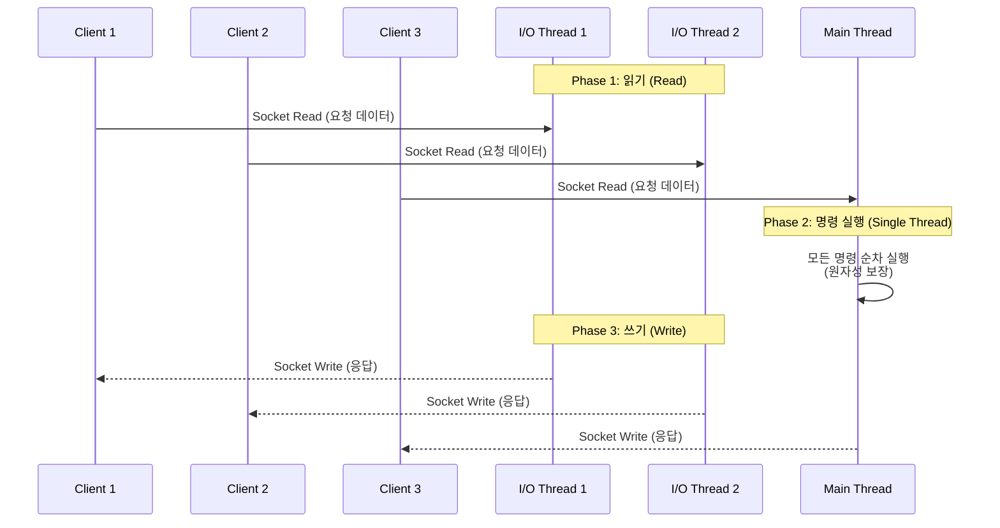
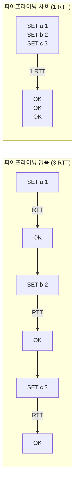

# I/O 스레딩과 성능 최적화: 멀티스레드 I/O와 운영 튜닝

Redis 6부터 도입된 I/O 멀티스레딩은 네트워크 읽기/쓰기를 여러 스레드로 분산하면서도 명령 실행의 단일 스레드 원자성을 유지한다. 이 문서에서는 I/O 스레드의 동작 방식, 성능 벤치마크 도구, 지연 시간 진단, 파이프라이닝 최적화, 메모리 최적화, 그리고 운영 환경 설정 튜닝을 분석한다.

## 목차

1. [핵심 개념 (What)](#1-핵심-개념-what)
2. [왜 알아야 하는가 (Why)](#2-왜-알아야-하는가-why)
3. [내부 구현 분석 (How)](#3-내부-구현-분석-how)
4. [실전 예제](#4-실전-예제)
5. [정리](#5-정리)

---

## 1. 핵심 개념 (What)

### I/O 멀티스레딩이란?

Redis는 전통적으로 단일 스레드로 모든 작업을 처리했다. Redis 6.0부터 도입된 I/O 멀티스레딩은 네트워크 I/O(읽기/쓰기)를 별도 스레드로 분산하여 처리량을 향상시킨다. 단, **명령 실행(computation)은 여전히 메인 스레드에서만** 이루어지므로 데이터 구조의 스레드 안전성이 보장된다.

### 핵심 구성요소

| 구성요소 | 역할 |
|---------|------|
| `io-threads` | I/O 스레드 수 (기본값 1, 즉 비활성화) |
| `io-threads-do-reads` | 읽기도 I/O 스레드에서 처리할지 여부 (기본 no) |
| Main Thread | 명령 파싱, 실행, 응답 생성을 담당 |
| I/O Threads | 소켓 읽기/쓰기를 병렬 처리 |
| `redis-benchmark` | Redis 성능 측정 내장 도구 |
| `SLOWLOG` | 실행 시간이 긴 명령을 기록하는 로그 |
| Pipeline | 여러 명령을 한 번에 전송하여 RTT 감소 |

### 성능 최적화 계층

| 계층 | 최적화 대상 | 도구/설정 |
|-----|-----------|----------|
| **네트워크** | I/O 처리 분산 | `io-threads`, 파이프라이닝 |
| **명령 실행** | 느린 명령 탐지 | `SLOWLOG`, `LATENCY` |
| **메모리** | 인코딩, 키 설계 | `OBJECT ENCODING`, `MEMORY USAGE` |
| **시스템** | OS/Redis 튜닝 | `tcp-backlog`, `hz`, `vm.overcommit_memory` |

## 2. 왜 알아야 하는가 (Why)

### 실무에서 만나는 상황

1. **높은 QPS 요구**: 초당 수십만 이상의 요청을 처리해야 하는 시스템에서 단일 스레드 I/O가 병목이 될 수 있다. I/O 멀티스레딩으로 2~3배의 처리량 향상이 가능하다.

2. **지연 시간 급증 원인 분석**: p99 레이턴시가 갑자기 상승할 때 SLOWLOG와 LATENCY 도구로 원인을 특정해야 한다. O(N) 명령, 큰 키 삭제, fork 등이 원인일 수 있다.

3. **메모리 비용 절감**: 동일한 데이터를 더 적은 메모리로 저장하려면 객체 인코딩(ziplist, listpack 등)의 동작 원리와 임계값 설정을 이해해야 한다.

4. **운영 안정성**: `tcp-backlog`, `maxclients`, `hz` 등의 설정을 서비스 특성에 맞게 조정하지 않으면 연결 실패, CPU 낭비 등의 문제가 발생할 수 있다.

## 3. 내부 구현 분석 (How)

### 3.1 I/O 스레드 동작 방식



**핵심 원리:**
- I/O 스레드는 소켓에서 데이터를 읽거나 응답을 쓰는 작업만 담당한다
- 명령 파싱과 실행은 반드시 메인 스레드에서 수행된다
- 각 Phase 사이에 배리어(barrier)가 존재하여 동기화된다
- 따라서 Lock이나 Mutex 없이도 스레드 안전성이 보장된다

### 3.2 I/O 스레드 설정

```bash
# redis.conf

# I/O 스레드 수 설정 (CPU 코어 수에 따라 조정)
# 권장: 4코어 -> 2~3, 8코어 -> 4~6
io-threads 4

# 읽기도 I/O 스레드에서 처리 (쓰기는 기본 활성화)
io-threads-do-reads yes
```

**주의사항:**
- `io-threads 1`은 I/O 스레딩 비활성화 (기본값)
- 코어 수를 초과하는 스레드 설정은 성능 저하를 유발한다
- SSL/TLS 사용 시 I/O 스레딩의 효과가 더 크다 (암복호화 병렬 처리)

### 3.3 redis-benchmark를 사용한 성능 측정

```bash
# 기본 벤치마크 (GET/SET 100,000 요청)
redis-benchmark -h 127.0.0.1 -p 6379 -n 100000

# SET 명령 벤치마크 (50 클라이언트, 파이프라이닝 16)
redis-benchmark -h 127.0.0.1 -p 6379 \
    -t set -n 1000000 -c 50 -P 16 -d 256

# GET 명령만 벤치마크 (키 범위 지정)
redis-benchmark -h 127.0.0.1 -p 6379 \
    -t get -n 1000000 -c 100 -r 100000

# 커스텀 명령 벤치마크
redis-benchmark -h 127.0.0.1 -p 6379 \
    -n 100000 -- HSET myhash field1 value1
```

| 옵션 | 설명 |
|-----|------|
| `-c` | 동시 접속 클라이언트 수 (기본 50) |
| `-n` | 총 요청 수 (기본 100000) |
| `-P` | 파이프라이닝 요청 수 |
| `-d` | SET/GET 값의 바이트 크기 |
| `-r` | 랜덤 키 범위 (keyspacelen) |
| `-t` | 테스트할 명령 (set,get,incr 등) |
| `--csv` | CSV 형식 출력 |

### 3.4 지연 시간 진단

```bash
# 기본 레이턴시 측정 (100회 PING)
redis-cli --latency -h 127.0.0.1 -p 6379

# 레이턴시 히스토리 (15초 간격)
redis-cli --latency-history -h 127.0.0.1 -p 6379

# 내부 레이턴시 측정 (커널 스케줄링 지연)
redis-cli --intrinsic-latency 5

# SLOWLOG 설정 및 조회
CONFIG SET slowlog-log-slower-than 10000  # 10ms 이상 기록
CONFIG SET slowlog-max-len 128            # 최대 128개 항목 유지

# 느린 명령 조회
SLOWLOG GET 10      # 최근 10개 항목
SLOWLOG LEN          # 총 항목 수
SLOWLOG RESET        # 로그 초기화
```

SLOWLOG 출력 예시:

```bash
redis> SLOWLOG GET 2
1) 1) (integer) 14           # SLOWLOG ID
   2) (integer) 1708012345   # Unix 타임스탬프
   3) (integer) 15230        # 실행 시간 (마이크로초)
   4) 1) "KEYS"              # 실행된 명령
      2) "*"
   5) "192.168.1.100:52340"  # 클라이언트 주소
   6) ""                     # 클라이언트 이름
```

### 3.5 파이프라이닝 최적화

파이프라이닝은 여러 명령을 한 번의 네트워크 왕복으로 전송하여 RTT(Round-Trip Time) 오버헤드를 줄인다.



파이프라이닝 없이 3개 명령: `3 x RTT` 소요
파이프라이닝 사용 시: `1 x RTT`로 3개 명령 전송

### 3.6 메모리 최적화: 객체 인코딩

Redis는 데이터 크기에 따라 메모리 효율적인 인코딩을 자동 선택한다.

| 데이터 타입 | 소규모 인코딩 | 대규모 인코딩 | 전환 임계값 (기본) |
|-----------|-------------|-------------|-----------------|
| String | int, embstr | raw | 44 bytes |
| List | listpack | quicklist | 128개 항목, 64 bytes/항목 |
| Hash | listpack | hashtable | 128개 필드, 64 bytes/값 |
| Set | listpack / intset | hashtable | 128개 항목, 64 bytes/항목 |
| Sorted Set | listpack | skiplist + hashtable | 128개 항목, 64 bytes/항목 |

```bash
# 인코딩 확인
OBJECT ENCODING mykey

# 메모리 사용량 확인
MEMORY USAGE mykey

# 임계값 조정 (Hash의 경우)
CONFIG SET hash-max-listpack-entries 256
CONFIG SET hash-max-listpack-value 128
```

**키 설계 모범 사례:**

```bash
# 나쁜 예: 긴 키 이름
SET user:profile:details:full_name:last_updated:12345 "value"

# 좋은 예: 짧지만 의미 있는 키 이름
SET u:12345:profile "value"

# 나쁜 예: 작은 Hash를 여러 String으로 분산
SET user:100:name "Alice"
SET user:100:email "alice@example.com"
SET user:100:age "30"

# 좋은 예: Hash로 통합 (listpack 인코딩 활용)
HSET user:100 name "Alice" email "alice@example.com" age "30"
```

### 3.7 CONFIG 튜닝

```bash
# TCP 연결 대기열 크기 (높은 연결 수 환경)
tcp-backlog 511

# 내부 작업 빈도 (기본 10, 범위 1~500)
# 높을수록 TTL 만료, 이벤트 처리가 빨라지지만 CPU 사용 증가
hz 100

# Dynamic hz: 연결된 클라이언트 수에 따라 자동 조절
dynamic-hz yes

# 최대 클라이언트 수
maxclients 10000

# 최대 메모리 및 퇴출 정책
maxmemory 8gb
maxmemory-policy allkeys-lru

# Lazy Free: 큰 키 삭제 시 백그라운드에서 처리
lazyfree-lazy-expire yes
lazyfree-lazy-server-del yes
lazyfree-lazy-user-del yes
replica-lazy-flush yes

# 클라이언트 타임아웃 (비활성 연결 정리)
timeout 300

# TCP keepalive (초)
tcp-keepalive 300
```

## 4. 실전 예제

### 4.1 Spring Boot에서 파이프라이닝 활용

```java
@Service
@RequiredArgsConstructor
public class BatchCacheService {

    private final RedisTemplate<String, Object> redisTemplate;

    /**
     * 파이프라이닝을 사용한 대량 읽기 (100개 키를 1 RTT로 조회)
     */
    public List<Object> batchGet(List<String> keys) {
        List<Object> results = redisTemplate.executePipelined(
            (RedisCallback<Object>) connection -> {
                StringRedisSerializer keySerializer = new StringRedisSerializer();
                for (String key : keys) {
                    connection.stringCommands().get(keySerializer.serialize(key));
                }
                return null;  // 파이프라인에서는 null 반환 필수
            }
        );
        return results;
    }

    /**
     * 파이프라이닝을 사용한 대량 쓰기 (TTL 포함)
     */
    public void batchSet(Map<String, Object> entries, Duration ttl) {
        redisTemplate.executePipelined((RedisCallback<Object>) connection -> {
            StringRedisSerializer keySerializer = new StringRedisSerializer();
            GenericJackson2JsonRedisSerializer valueSerializer =
                new GenericJackson2JsonRedisSerializer();

            for (Map.Entry<String, Object> entry : entries.entrySet()) {
                byte[] key = keySerializer.serialize(entry.getKey());
                byte[] value = valueSerializer.serialize(entry.getValue());
                connection.stringCommands().setEx(
                    key, ttl.getSeconds(), value
                );
            }
            return null;
        });
    }
}
```

### 4.2 SLOWLOG 모니터링 서비스

```java
@Slf4j
@Service
@RequiredArgsConstructor
public class RedisSlowLogMonitor {

    private final StringRedisTemplate redisTemplate;

    /**
     * 주기적으로 SLOWLOG를 확인하여 느린 명령을 로깅
     */
    @Scheduled(fixedRate = 60_000)
    public void checkSlowLog() {
        List<Object> slowLogs = redisTemplate.execute((RedisCallback<List<Object>>) connection -> {
            // SLOWLOG GET 10
            return connection.serverCommands().slowLogGet(10);
        });

        if (slowLogs != null && !slowLogs.isEmpty()) {
            for (Object entry : slowLogs) {
                if (entry instanceof SlowLogEntry slowLog) {
                    log.warn(
                        "SlowLog - id: {}, duration: {}us, command: {}, client: {}",
                        slowLog.getId(),
                        slowLog.getDuration(),
                        slowLog.getCommand(),
                        slowLog.getClientAddress()
                    );

                    // 10ms 이상이면 알림 발송
                    if (slowLog.getDuration() > 10_000) {
                        alertSlowCommand(slowLog);
                    }
                }
            }
        }
    }

    private void alertSlowCommand(SlowLogEntry slowLog) {
        log.error("ALERT: Slow Redis command detected! " +
            "Duration: {}ms, Command: {}",
            slowLog.getDuration() / 1000,
            slowLog.getCommand());
    }
}
```

### 4.3 운영 환경 성능 체크리스트

```bash
#!/bin/bash
# Redis 운영 환경 성능 점검 스크립트

REDIS_HOST=127.0.0.1
REDIS_PORT=6379
CLI="redis-cli -h $REDIS_HOST -p $REDIS_PORT"

echo "=== Redis 성능 체크리스트 ==="

# 1. 메모리 사용량 확인
echo "[1] Memory Usage"
$CLI INFO memory | grep -E "used_memory_human|maxmemory_human|mem_fragmentation_ratio"

# 2. 연결된 클라이언트 수
echo "[2] Connected Clients"
$CLI INFO clients | grep -E "connected_clients|blocked_clients|maxclients"

# 3. 초당 명령 처리량
echo "[3] Commands Per Second"
$CLI INFO stats | grep instantaneous_ops_per_sec

# 4. 키스페이스 히트율
echo "[4] Keyspace Hit Rate"
$CLI INFO stats | grep -E "keyspace_hits|keyspace_misses"

# 5. 복제 지연
echo "[5] Replication Lag"
$CLI INFO replication | grep -E "role|connected_slaves|slave.*lag"

# 6. SLOWLOG 최근 항목
echo "[6] Recent Slow Commands"
$CLI SLOWLOG GET 5

# 7. I/O 스레드 설정 확인
echo "[7] I/O Thread Configuration"
$CLI CONFIG GET io-threads
$CLI CONFIG GET io-threads-do-reads

# 8. 메모리 단편화 비율 점검
FRAG=$($CLI INFO memory | grep mem_fragmentation_ratio | cut -d: -f2 | tr -d '\r')
echo "[8] Memory Fragmentation: $FRAG"
if (( $(echo "$FRAG > 1.5" | bc -l) )); then
    echo "  WARNING: High fragmentation. Consider MEMORY PURGE or restart."
fi

# 9. 큰 키 탐지
echo "[9] Big Keys Scan"
$CLI --bigkeys --no-auth-warning 2>/dev/null | tail -20

echo "=== 점검 완료 ==="
```

### 4.4 메모리 최적화 적용 예시

```java
@Configuration
public class RedisMemoryOptimizationConfig {

    /**
     * 애플리케이션 시작 시 Redis 메모리 최적화 설정 적용
     */
    @Bean
    public CommandLineRunner redisOptimizer(StringRedisTemplate redisTemplate) {
        return args -> {
            RedisCallback<Void> optimizer = connection -> {
                var serverCommands = connection.serverCommands();

                // Hash: listpack 임계값 조정
                // 대부분의 Hash가 128 필드 이하일 때 메모리 절약
                serverCommands.setConfig("hash-max-listpack-entries", "256");
                serverCommands.setConfig("hash-max-listpack-value", "128");

                // Sorted Set: listpack 임계값 조정
                serverCommands.setConfig("zset-max-listpack-entries", "256");
                serverCommands.setConfig("zset-max-listpack-value", "128");

                // Lazy Free 활성화 (큰 키 삭제 시 블로킹 방지)
                serverCommands.setConfig("lazyfree-lazy-expire", "yes");
                serverCommands.setConfig("lazyfree-lazy-server-del", "yes");

                // SLOWLOG 설정
                serverCommands.setConfig("slowlog-log-slower-than", "10000");
                serverCommands.setConfig("slowlog-max-len", "256");

                return null;
            };

            redisTemplate.execute(optimizer);
        };
    }
}
```

## 5. 정리

| 항목 | 설명 |
|-----|------|
| I/O 멀티스레딩 | `io-threads`로 네트워크 읽기/쓰기 병렬 처리, 명령 실행은 메인 스레드 |
| 스레드 안전성 | Phase 간 배리어 동기화, Lock 없이 원자성 보장 |
| redis-benchmark | 내장 벤치마크 도구, `-P` 파이프라이닝으로 최대 처리량 측정 |
| SLOWLOG | `slowlog-log-slower-than`으로 느린 명령 탐지 (마이크로초 단위) |
| 파이프라이닝 | 여러 명령을 1 RTT로 전송, 네트워크 오버헤드 대폭 감소 |
| 객체 인코딩 | listpack, intset 등 소규모 인코딩으로 메모리 절약 |
| 키 설계 | 짧은 키 이름, Hash 통합, 적절한 TTL 설정 |
| 운영 튜닝 | `tcp-backlog`, `hz`, `lazyfree`, `maxmemory-policy` 등 |

---
*참고: Redis 7.x 기준*
