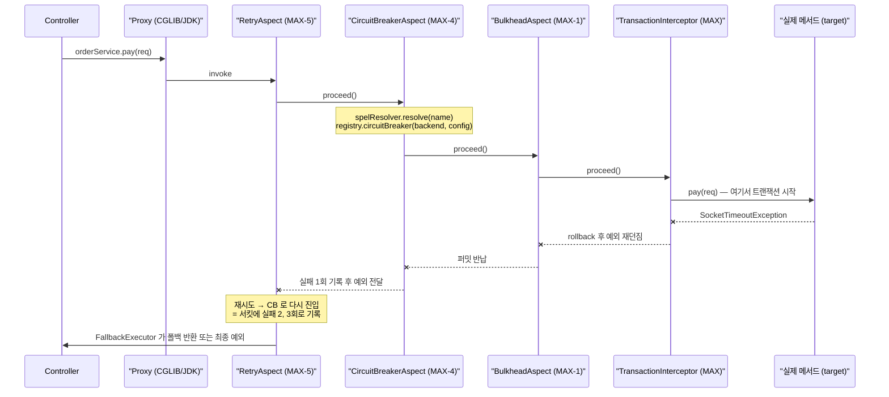
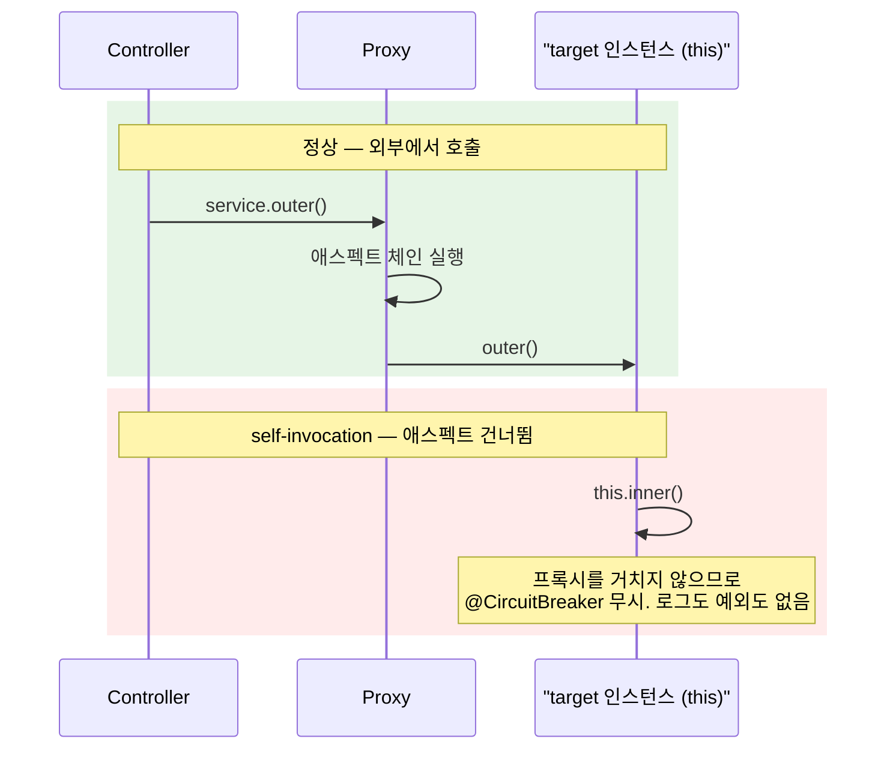

# 애스펙트 동작과 프록시의 한계

`@CircuitBreaker` 한 줄이 실제로 무엇을 하는지 — `@Around` 어드바이스의 흐름, 애스펙트 5개의 실행 순서(실제 숫자로), 그리고 **프록시 기반이라서 생기는 한계** 를 정리합니다. self-invocation 문제가 이 문서의 핵심입니다.

## 목차
- [1. 핵심 개념 (What)](#1-핵심-개념-what)
- [2. 왜 알아야 하는가 (Why)](#2-왜-알아야-하는가-why)
- [3. 내부 구현 분석 (How)](#3-내부-구현-분석-how)
- [4. 실전 예제](#4-실전-예제)
- [5. 정리](#5-정리)

---

## 1. 핵심 개념 (What)

Resilience4j 의 애너테이션 지원은 **Spring AOP 런타임 프록시 + `@Around` 어드바이스** 로 구현돼 있습니다. AspectJ 컴파일 타임 위빙이 아닙니다. `resilience4j-annotations` 에 애너테이션이, `resilience4j-spring6` 에 Aspect 가 있습니다.

```java
// resilience4j-annotations — 5개가 모두 이 형태
@Retention(RetentionPolicy.RUNTIME) @Target({ElementType.METHOD, ElementType.TYPE}) @Documented
public @interface CircuitBreaker {
    String name();                            // 필수. SpEL 가능
    String configuration() default "";        // 설정 키를 인스턴스 이름과 분리
    String fallbackMethod() default "";       // SpEL 가능
}
```

| 애너테이션 | `name` | `configuration` | `fallbackMethod` | 추가 속성 |
|---|---|---|---|---|
| `@CircuitBreaker` | 필수 | O | O | — |
| `@Retry` | 필수 | O | O | — |
| `@RateLimiter` | 필수 | O | O | `int permits() default 1` |
| `@Bulkhead` | 필수 | O | O | `Type type() default Type.SEMAPHORE` (`SEMAPHORE`/`THREADPOOL`) |
| `@TimeLimiter` | 필수 | O | O | — |

> **`@RateLimiter(permits = N)` 는 v2.4.0(커밋 7e3ab525)에서 아무도 읽지 않습니다.** 레포 전체에서 `.permits()` 호출이 0건입니다(`grep -rn "\.permits()"`). 호출당 N개 퍼밋을 쓰려면 `RateLimiter.decorateCheckedSupplier(rateLimiter, permits, supplier)` 를 코드로 직접 써야 합니다. 리뷰에서 `permits = 5` 를 보면 지적할 지점입니다.

`configuration` 은 **인스턴스 이름과 설정 키를 분리** 합니다. `@CircuitBreaker(name = "#{#tenantId}", configuration = "externalApi")` 로 테넌트별 인스턴스 + 설정 하나 공유가 됩니다.

---

## 2. 왜 알아야 하는가 (Why)

- **self-invocation.** 같은 빈 안에서 `this.method()` 로 호출하면 애너테이션이 **전혀 동작하지 않습니다.** 예외도 경고도 로그도 없습니다. 테스트는 통과하고(직접 호출하니까) 운영은 무방비가 됩니다. 메서드를 같은 클래스로 옮기는 리팩터링에 조용히 깨지는 유형입니다.
- **애스펙트 순서.** `@Retry` + `@CircuitBreaker` 를 같이 붙였을 때 "재시도 3번이 서킷에 3번 기록되는가 1번인가"는 순서가 결정합니다. 기본값은 "3번"입니다.
- **`@Transactional` 과의 조합.** 서킷이 열려 `CallNotPermittedException` 이 났을 때 트랜잭션이 롤백되는지 — 근거를 숫자로 댈 수 있어야 합니다.

---

## 3. 내부 구현 분석 (How)

### 3.1 `@Around` 어드바이스의 흐름

`CircuitBreakerAspect` 발췌. 5개 Aspect 가 모두 이 형태를 공유합니다.

```java
@Pointcut(value = "@within(circuitBreaker) || @annotation(circuitBreaker)", argNames = "circuitBreaker")
public void matchAnnotatedClassOrMethod(CircuitBreaker circuitBreaker) {
}

@Around(value = "matchAnnotatedClassOrMethod(circuitBreakerAnnotation)",
        argNames = "proceedingJoinPoint, circuitBreakerAnnotation")
public Object circuitBreakerAroundAdvice(ProceedingJoinPoint proceedingJoinPoint,
    @Nullable CircuitBreaker circuitBreakerAnnotation) throws Throwable {
    Method method = ((MethodSignature) proceedingJoinPoint.getSignature()).getMethod();
    String methodName = method.getDeclaringClass().getName() + "#" + method.getName();
    if (circuitBreakerAnnotation == null) {
        circuitBreakerAnnotation = getCircuitBreakerAnnotation(proceedingJoinPoint);
    }
    if (circuitBreakerAnnotation == null) { //because annotations wasn't found
        return proceedingJoinPoint.proceed();
    }
    String backend = spelResolver.resolve(method, proceedingJoinPoint.getArgs(),
        circuitBreakerAnnotation.name());
    String configKey = circuitBreakerAnnotation.configuration().isEmpty()
        ? backend : circuitBreakerAnnotation.configuration();
    var circuitBreaker = getOrCreateCircuitBreaker(methodName, backend, configKey);
    final CheckedSupplier<Object> circuitBreakerExecution = () ->
        proceed(proceedingJoinPoint, methodName, circuitBreaker, method.getReturnType());
    return fallbackExecutor.execute(proceedingJoinPoint, method,
        circuitBreakerAnnotation.fallbackMethod(), circuitBreakerExecution);
}
```

- **1~3행 `@Pointcut`**: `@within` 은 클래스 레벨, `@annotation` 은 메서드 레벨. **클래스에 애너테이션을 붙이면 그 클래스의 모든 public 메서드가 대상** 입니다. 의도치 않은 전면 적용 사고가 여기서 납니다.
- **11~16행**: 포인트컷 바인딩이 `null` 이면 `AnnotationExtractor` 로 재탐색하고, 그래도 못 찾으면 그냥 `proceed()` — **아무 보호 없이 통과** 합니다. 예외를 던지지 않는 쪽을 택한 설계입니다.
- **17~20행**: `spelResolver.resolve(...)` 로 이름 해석(호출마다 평가되므로 인자 기반 동적 이름 가능). `configuration()` 이 비면 인스턴스 이름을 설정 키로도 씁니다.
- **22~25행**: 실제 실행을 `CheckedSupplier` 로 **지연 평가** 하도록 감싸 `FallbackExecutor` 에 넘깁니다. 즉 **폴백이 가장 바깥** 이고, 서킷·재시도가 모두 소진된 뒤 돕니다([Fallback 문서](./03-fallback.md)).

레지스트리 조회는 lazy 생성입니다.

```java
CircuitBreakerConfig config = circuitBreakerRegistry.getConfiguration(configKey)
    .orElseGet(circuitBreakerRegistry::getDefaultConfig);
var circuitBreaker = circuitBreakerRegistry.circuitBreaker(backend, config);
```

`getConfiguration(configKey)` 가 비면 **조용히 `getDefaultConfig()` 로 떨어집니다.** `instances.payment` 를 `paymant` 로 오타 냈을 때 에러 대신 기본값(실패율 50%, 윈도 100, `minimumNumberOfCalls` 100)이 적용되는 이유 — 설정이 "안 먹는" 가장 흔한 원인입니다.

`AnnotationExtractor` 는 프록시를 따로 처리하며, 인터페이스가 여럿이면 `extractAnnotationFromClosestMatch()` 가 `getInterfaces()` **선언 순서대로** 처음 찾은 것을 씁니다. 인터페이스에 애너테이션을 다는 경우 `implements A, B` 순서를 바꾸면 동작이 바뀔 수 있습니다.

### 3.2 반환 타입 분기와 `*AspectExt`

```java
private Object proceed(ProceedingJoinPoint proceedingJoinPoint, String methodName,
    CircuitBreaker circuitBreaker, Class<?> returnType) throws Throwable {
    if (circuitBreakerAspectExtList != null && !circuitBreakerAspectExtList.isEmpty()) {
        for (CircuitBreakerAspectExt circuitBreakerAspectExt : circuitBreakerAspectExtList) {
            if (circuitBreakerAspectExt.canHandleReturnType(returnType)) {
                return circuitBreakerAspectExt
                    .handle(proceedingJoinPoint, circuitBreaker, methodName);
            }
        }
    }
    if (CompletionStage.class.isAssignableFrom(returnType)) {
        return handleJoinPointCompletableFuture(proceedingJoinPoint, circuitBreaker);
    }
    return defaultHandling(proceedingJoinPoint, circuitBreaker);
}
```

확장점은 `CircuitBreakerAspectExt` 로 `canHandleReturnType(Class)` + `handle(jp, circuitBreaker, methodName)` 2메서드뿐입니다. `ReactorCircuitBreakerAspectExt.handle()` 의 핵심 3줄:

```java
Object returnValue = proceedingJoinPoint.proceed();
if (Mono.class.isAssignableFrom(returnValue.getClass())) {
    Mono<?> monoReturnValue = (Mono<?>) returnValue;
    return monoReturnValue.transformDeferred(CircuitBreakerOperator.of(circuitBreaker));
}   // Flux 도 동일, 그 외에는 IllegalArgumentException
```

**`proceed()` 로 파이프라인 객체를 먼저 받고 거기에 오퍼레이터를 붙여 되돌려 줍니다.** `proceed()` 는 체인 조립일 뿐이라 실패하지 않습니다. `transformDeferred` 는 구독 시점마다 서킷 상태를 다시 보기 위함입니다([Reactor 오퍼레이터](./08-reactor-operators.md)). `RxJava2CircuitBreakerAspectExt` 는 지원 타입을 `AspectUtil.newHashSet(ObservableSource, SingleSource, CompletableSource, MaybeSource, Flowable)` 로 들고 `instanceof` 분기 후 `.compose(operator)` 를 적용합니다.

**분기 순서가 Aspect 마다 다릅니다.**

| Aspect | 분기 순서 | 비고 |
|---|---|---|
| `CircuitBreakerAspect`, `RateLimiterAspect` | `AspectExt` → `CompletionStage` → 블로킹 | |
| `BulkheadAspect` | (`THREADPOOL` 분기 먼저) → `AspectExt` → `CompletionStage` → 블로킹 | `Bulkhead.Type` 최우선 |
| `TimeLimiterAspect` | `AspectExt` → `CompletionStage` → **예외** | 블로킹 경로 없음 |
| `RetryAspect` | **`CompletionStage` → `AspectExt`** → 블로킹 | 순서가 뒤집혀 있다 |

```java
// TimeLimiterAspect.proceed()
if (!CompletionStage.class.isAssignableFrom(returnType)) {
    throw new IllegalReturnTypeException(returnType, methodName, "CompletionStage expected.");
}
```

**`@TimeLimiter` 를 동기 메서드에 붙이면 `IllegalReturnTypeException`** 입니다. 블로킹에 타임아웃을 걸려면 `@Bulkhead(type = THREADPOOL)` 과 조합하거나 `CompletableFuture` 로 바꿔야 합니다. `RetryAspect` 만 `CompletionStage` 를 먼저 보므로, 커스텀 `RetryAspectExt` 에는 `CompletionStage` 타입이 오지 않습니다.

### 3.3 실행 순서 — 실제 숫자

각 Aspect 는 `Ordered` 를 구현하고 `getOrder()` 에서 프로퍼티를 돌려줍니다(`return circuitBreakerProperties.getCircuitBreakerAspectOrder();`). 기본값은 `spring6` 의 `<X>ConfigurationProperties` 에 하드코딩돼 있고, `Ordered.LOWEST_PRECEDENCE` = `Integer.MAX_VALUE` = `2147483647` 입니다.

| Aspect | 필드 선언 | 실제 숫자 | yml 키 |
|---|---|---|---|
| `RetryAspect` | `LOWEST_PRECEDENCE - 5` | `2147483642` | `resilience4j.retry.retry-aspect-order` |
| `CircuitBreakerAspect` | `LOWEST_PRECEDENCE - 4` | `2147483643` | `resilience4j.circuitbreaker.circuit-breaker-aspect-order` |
| `RateLimiterAspect` | `LOWEST_PRECEDENCE - 3` | `2147483644` | `resilience4j.ratelimiter.rate-limiter-aspect-order` |
| `TimeLimiterAspect` | `LOWEST_PRECEDENCE - 2` | `2147483645` | `resilience4j.timelimiter.time-limiter-aspect-order` |
| `BulkheadAspect` | `LOWEST_PRECEDENCE - 1` | `2147483646` | `resilience4j.bulkhead.bulkhead-aspect-order` |
| `TimerAspect` | `LOWEST_PRECEDENCE` | `2147483647` | `resilience4j.micrometer.timer.timer-aspect-order` |

Spring AOP 는 **order 값이 작을수록 우선순위가 높고 더 바깥** 입니다. 따라서 `Retry( CircuitBreaker( RateLimiter( TimeLimiter( Bulkhead( 실제 메서드 )))))` 이며, 이는 [TimeLimiter 와 조합](../main/12-timelimiter-and-composition.md) 의 `Decorators` 체인과 **정확히 대응** 합니다. 애너테이션으로 쓰든 `Decorators.ofSupplier(...)` 로 쓰든 같은 결과가 나오게 숫자를 맞춰 둔 것입니다.

실무적 함의: **재시도가 서킷보다 바깥** 이라 재시도 3회는 서킷에 **3번의 실패로 기록** 됩니다(장애 감지는 빨라지지만 일시적 흔들림에 과민). **Bulkhead 가 가장 안쪽** 이라 재시도마다 퍼밋을 새로 얻고, 꽉 찬 상태에서는 `BulkheadFullException` 이 재시도 횟수만큼 납니다. **`TimeLimiter` 가 `Bulkhead` 보다 바깥** 이라 타임아웃이 걸려도 안쪽 퍼밋이 바로 안 돌아올 수 있습니다(`cancelRunningFuture` 의존). 그리고 **`TimerAspect` 는 `LOWEST_PRECEDENCE`** = Spring `@Transactional` 어드바이저 기본 order(`@EnableTransactionManagement(order = Ordered.LOWEST_PRECEDENCE)`)와 **같은 숫자** 라 상대 순서가 정의되지 않습니다.

### 3.4 호출 경로 시퀀스



서킷이 **이미 열려 있으면** `CircuitBreakerAspect` 가 `acquirePermission()` 단계에서 `CallNotPermittedException` 을 던져 `BulkheadAspect` 이하가 **전혀 호출되지 않습니다.** 트랜잭션도 시작되지 않습니다.

### 3.5 프록시의 한계 (가장 중요)



왜 그런지: Spring AOP 는 **빈을 감싼 별도 객체(프록시)** 를 컨테이너에 등록합니다. 주입받는 쪽은 프록시를 들고 있고, 프록시가 어드바이스를 돌린 뒤 내부에 보관한 **target 인스턴스** 의 메서드를 호출합니다. target 안의 `this` 는 target 자신이지 프록시가 아니므로, `this.inner()` 는 평범한 자바 호출이고 프록시 코드를 전혀 지나가지 않습니다.

| 해결책 | 코드 | 권장도 | 이유 |
|---|---|---|---|
| **빈 분리** | 보호가 필요한 호출을 별도 빈으로 추출 | ★★★ | "외부 I/O 경계"가 클래스로 명시된다 |
| 자기 주입 | `@Lazy` + 자기 자신 주입 후 `self.inner()` | ★★ | 동작하지만 순환 의존을 드러내는 냄새. 급한 수정용 |
| `AopContext.currentProxy()` | `((MyService) AopContext.currentProxy()).inner()` | ★ | `@EnableAspectJAutoProxy(exposeProxy = true)` 필요. 비즈니스 코드가 AOP API 에 묶이고 테스트가 깨진다 |

**적용 불가 메서드**

| 종류 | 이유 |
|---|---|
| `private` | 어떤 프록시도 가로챌 수 없다. 외부 호출 경로가 없어 항상 self-invocation → **항상 무시** |
| `final` 메서드 / `final` 클래스 | CGLIB 프록시는 대상 클래스를 **상속해 오버라이드** 한다. `final` 은 오버라이드 불가 |
| `static` | 인스턴스 메서드가 아니라 프록시 대상이 아니다 |
| Kotlin 메서드 | **기본 `final`**. `open` 또는 인터페이스 또는 `kotlin-spring`(all-open) 필요. Kotlin 의 "아무 일도 안 일어남" 1순위 원인 |

**`@Transactional` 과의 순서** — 3.3 의 숫자가 답을 줍니다. Resilience4j 는 `2147483642`~`2147483646`, `@Transactional` 은 `2147483647`. 숫자가 작은 Resilience4j 가 **전부 트랜잭션보다 바깥** 입니다. 결과 셋:

1. **서킷이 열려 `CallNotPermittedException` 이 나면 트랜잭션은 시작조차 안 됩니다.** 롤백을 따질 대상이 없습니다 — "서킷 때문에 롤백됐나요?"라는 질문 자체가 성립하지 않습니다.
2. **폴백은 트랜잭션 밖에서 실행됩니다.** 폴백에서 DB 를 쓰면 별도 트랜잭션이 열리고 원래 트랜잭션은 이미 롤백돼 있습니다.
3. **재시도는 트랜잭션을 매번 새로 엽니다.** 1차 시도의 커밋/롤백이 끝난 뒤 2차가 새 트랜잭션으로 들어갑니다. **멱등성 없는 쓰기에 `@Retry` 를 붙이면 중복 저장** 이 발생합니다 — 실무에서 가장 비싼 사고입니다.

순서를 뒤집어 재시도를 트랜잭션 안쪽에 두는 건 보통 나쁜 선택입니다. 긴 트랜잭션 안에서 재시도하면 DB 커넥션과 락을 재시도 내내 붙듭니다. 재시도는 트랜잭션 **밖** 이 맞고, 대신 멱등 키로 풀어야 합니다.

---

## 4. 실전 예제

### 4.1 self-invocation 버그 재현과 수정

**Before — 동작하지 않는 코드**

```java
@Service
public class OrderService {

    private final RestClient paymentClient;   // 생성자 생략

    public List<OrderView> listOrders(long userId) {
        // 버그: this 로 호출 → 프록시를 거치지 않음 → @CircuitBreaker 무시
        return loadOrders(userId).stream()
            .map(o -> new OrderView(o, fetchPaymentStatus(o.paymentId())))
            .toList();
    }

    @CircuitBreaker(name = "paymentApi", fallbackMethod = "unknownStatus")
    public PaymentStatus fetchPaymentStatus(String paymentId) { /* 외부 호출 */ }

    private PaymentStatus unknownStatus(String paymentId, Throwable t) {
        return PaymentStatus.UNKNOWN;
    }
}
```

증상: 결제 API 가 죽어도 서킷이 **절대 열리지 않고**, `/actuator/metrics/resilience4j.circuitbreaker.calls` 에 `paymentApi` 가 나타나지 않습니다. 폴백도 돌지 않아 예외가 그대로 올라옵니다. `curl -s localhost:8080/actuator/circuitbreakers | jq '.circuitBreakers'` 로 인스턴스가 생겼는지 확인하면 바로 드러납니다 — 없으면 애스펙트가 한 번도 안 돈 것입니다.

**After — 빈 분리 (권장)**

```java
package com.example.order;

import io.github.resilience4j.circuitbreaker.annotation.CircuitBreaker;
import org.springframework.stereotype.Component;
import org.springframework.web.client.RestClient;

/**
 * 외부 I/O 경계를 별도 빈으로 분리한다.
 * 이 클래스의 public 메서드는 항상 프록시를 통해 호출되므로
 * @CircuitBreaker 가 반드시 적용된다.
 */
@Component
public class PaymentApiClient {

    private final RestClient paymentClient;   // 생성자 생략

    @CircuitBreaker(name = "paymentApi", fallbackMethod = "unknownStatus")
    public PaymentStatus fetchPaymentStatus(String paymentId) {
        return paymentClient.get().uri("/payments/{id}", paymentId)
            .retrieve().body(PaymentStatus.class);
    }

    /** 폴백은 같은 클래스 안에 있어야 한다 (private 허용). */
    private PaymentStatus unknownStatus(String paymentId, Throwable t) {
        return PaymentStatus.UNKNOWN;
    }
}

@Service
public class OrderService {
    private final PaymentApiClient paymentApiClient;   // 프록시가 주입된다

    public List<OrderView> listOrders(long userId) {
        return loadOrders(userId).stream()
            .map(o -> new OrderView(o,
                paymentApiClient.fetchPaymentStatus(o.paymentId())))   // 프록시 경유
            .toList();
    }
}
```

급할 때의 **자기 주입(차선)** 은 `public OrderService(@Lazy OrderService self)` 로 받아 `self.fetchPaymentStatus(...)` 를 호출합니다. `@Lazy` 가 없으면 순환 참조로 기동이 실패합니다.

이 버그를 테스트로 고정하는 법 — **프록시가 적용됐는지를 검증** 합니다. `AopUtils.isAopProxy(client)` 가 `true` 인지, 그리고 한 번 호출한 뒤 `registry.find("paymentApi")` 가 `isPresent()` 이고 `getMetrics().getNumberOfBufferedCalls()` 가 0 보다 큰지 보면 애스펙트가 실제로 돌았음을 확인할 수 있습니다.

### 4.2 애스펙트 순서를 바꿔야 하는 상황

**상황**: 네트워크 흔들림으로 인한 1~2회 실패가 서킷을 열어 장애를 과장합니다. "재시도를 모두 소진한 뒤의 최종 실패만 서킷에 기록"하려면 **CircuitBreaker 가 Retry 보다 바깥** 이어야 합니다.

```yaml
resilience4j:
  circuitbreaker:
    # 기본 2147483643 → Retry(2147483642) 보다 작게 만들어 더 바깥으로
    circuit-breaker-aspect-order: 2147483640
    configs:
      default:
        sliding-window-type: COUNT_BASED
        sliding-window-size: 50
        minimum-number-of-calls: 20
        failure-rate-threshold: 50
        wait-duration-in-open-state: 30s
        permitted-number-of-calls-in-half-open-state: 5
        automatic-transition-from-open-to-half-open-enabled: true
    instances:
      paymentApi: { base-config: default }

  retry:
    configs:                          # order 는 기본값 유지 (2147483642)
      default:
        max-attempts: 3
        wait-duration: 200ms
        enable-exponential-backoff: true
        exponential-backoff-multiplier: 2
        retry-exceptions: [java.net.SocketTimeoutException]
        # 서킷이 열렸을 때 재시도하면 의미 없이 두드리기만 한다
        ignore-exceptions: [io.github.resilience4j.circuitbreaker.CallNotPermittedException]
    instances:
      paymentApi: { base-config: default }
```

```java
@Component
public class PaymentApiClient {

    /**
     * 변경된 order 로 중첩 구조가 CircuitBreaker( Retry( 실제 호출 ) ) 이 된다.
     * → 재시도 3회를 전부 실패한 뒤 "1회의 실패"로만 서킷에 기록된다.
     */
    @CircuitBreaker(name = "paymentApi", fallbackMethod = "unknownStatus")
    @Retry(name = "paymentApi")
    public PaymentStatus fetchPaymentStatus(String paymentId) { /* ... */ }

    private PaymentStatus unknownStatus(String paymentId, Throwable t) {
        return PaymentStatus.UNKNOWN;
    }
}
```

> **트레이드오프를 분명히.** 이 설정은 서킷을 **덜 민감하게** 만듭니다. 전면 장애 시 감지가 `max-attempts × wait-duration` 만큼 늦어지고 그동안 재시도가 죽은 서버를 계속 두드립니다. 기본값(Retry 바깥)이 "빨리 포기"에 유리한 설계라는 걸 알고 선택해야 합니다.

순서가 실제로 적용됐는지는 `List<Ordered>` 를 주입받아 확인합니다. 기동 시 바깥 → 안쪽 순으로 찍힙니다.

```java
@Component
public class AspectOrderLogger {
    public AspectOrderLogger(List<Ordered> orderedBeans) {
        orderedBeans.stream()
            .filter(b -> b.getClass().getName().contains("resilience4j"))
            .sorted(Comparator.comparingInt(Ordered::getOrder))
            .forEach(b -> log.info("aspect order {} -> {}",
                b.getOrder(), b.getClass().getSimpleName()));
        // 2147483640 -> CircuitBreakerAspect, 2147483642 -> RetryAspect,
        // 2147483644 -> RateLimiterAspect ... 2147483646 -> BulkheadAspect
    }
}
```

### 4.3 커스텀 `AspectExt` 구현

**상황**: 내부 공통 래퍼 `Result<T>` 가 실패를 예외가 아니라 `Result.failure(...)` 로 돌려줍니다. 기본 Aspect 는 예외만 보므로 서킷이 실패를 전혀 인식하지 못합니다.

```java
package com.example.resilience;

import io.github.resilience4j.circuitbreaker.CircuitBreaker;
import io.github.resilience4j.spring6.circuitbreaker.configure.CircuitBreakerAspectExt;
import org.aspectj.lang.ProceedingJoinPoint;
import org.springframework.stereotype.Component;

/**
 * Result<T> 반환 타입을 서킷브레이커에 연결하는 확장.
 * @Component 로 등록만 하면 circuitBreakerAspect(...) 가
 * List<CircuitBreakerAspectExt> 로 수집하므로 자동 포함된다.
 */
@Component
public class ResultCircuitBreakerAspectExt implements CircuitBreakerAspectExt {

    @Override
    public boolean canHandleReturnType(Class returnType) {
        return Result.class.isAssignableFrom(returnType);
    }

    @Override
    public Object handle(ProceedingJoinPoint proceedingJoinPoint,
                         CircuitBreaker circuitBreaker, String methodName) throws Throwable {
        circuitBreaker.acquirePermission();          // OPEN 이면 CallNotPermittedException
        long start = circuitBreaker.getCurrentTimestamp();
        try {
            Result<?> result = (Result<?>) proceedingJoinPoint.proceed();
            long duration = circuitBreaker.getCurrentTimestamp() - start;
            if (result.isFailure()) {
                // 예외가 아니어도 실패로 기록한다 (스택트레이스를 끈 내부 예외를 쓴다)
                circuitBreaker.onError(duration, circuitBreaker.getTimestampUnit(),
                    new ResultFailureException(result.errorCode(), methodName));
            } else {
                circuitBreaker.onSuccess(duration, circuitBreaker.getTimestampUnit());
            }
            return result;
        } catch (Throwable t) {
            circuitBreaker.onError(circuitBreaker.getCurrentTimestamp() - start,
                circuitBreaker.getTimestampUnit(), t);
            throw t;
        }
    }
}
```

세 가지를 짚어 둡니다.

1. **루프는 첫 매칭에서 끝납니다.** 라이브러리의 `ReactorCircuitBreakerAspectExt` 등과 타입이 겹치면 `List` 순서가 승자를 결정하므로, `canHandleReturnType` 을 좁게 쓰고 필요하면 `@Order` 로 명시하세요.
2. **`acquirePermission()`/`onSuccess()`/`onError()` 를 직접 불러야 합니다.** `executeCheckedSupplier` 같은 편의 메서드를 쓰지 않는 대가입니다. 빠뜨리면 메트릭이 조용히 빕니다.
3. 같은 목적을 `recordResultPredicate` 로 달성할 수도 있습니다. **yml 로 되는지 먼저 확인** 하는 게 낫습니다([설정 계층](./04-config-hierarchy.md) 3.5).

---

## 5. 정리

| 항목 | 내용 |
|---|---|
| 구현 방식 | Spring AOP 런타임 프록시 + `@Around`. AspectJ 위빙 아님 |
| 포인트컷 | `@within(X) \|\| @annotation(X)` — 클래스에 붙이면 모든 public 메서드 대상 |
| 흐름 | 애너테이션 추출 → `SpelResolver` 이름 해석 → `registry.getConfiguration(configKey)` → 반환 타입 분기 → `FallbackExecutor.execute()` |
| 설정 키 못 찾으면 | 예외 없이 `getDefaultConfig()` 폴백. 이름 오타가 조용히 묻힌다 |
| 반환 타입 분기 | `*AspectExt` 루프(첫 매칭) → `CompletionStage` → 블로킹. **`RetryAspect` 만 `CompletionStage` 가 먼저**. `@TimeLimiter` + 동기 메서드는 `IllegalReturnTypeException` |
| `@RateLimiter(permits)` | v2.4.0 에서 **읽히지 않는다** (`.permits()` 호출 0건) |
| 기본 order (바깥→안쪽) | Retry `2147483642` → CircuitBreaker `2147483643` → RateLimiter `2147483644` → TimeLimiter `2147483645` → Bulkhead `2147483646`. Timer 는 `2147483647` = `@Transactional` 기본값과 동일 → 비결정 |
| order 변경 | `resilience4j.<component>.<x>-aspect-order`. 기본 순서는 "재시도 N회 = 서킷 실패 N회" = 빨리 포기 |
| self-invocation | `this.method()` 는 프록시를 거치지 않아 **애너테이션이 완전히 무시**. 로그·예외 없음 |
| 해결 권장도 | 빈 분리 ★★★ > `@Lazy` 자기 주입 ★★ > `AopContext.currentProxy()` ★ |
| 적용 불가 | `private`, `final`, `static`, `final` 클래스. Kotlin 은 기본 `final` |
| `@Transactional` 관계 | Resilience4j 가 **바깥**. `CallNotPermittedException` 시 트랜잭션은 시작조차 안 됨 → 롤백 대상 없음. 폴백도 트랜잭션 밖 |
| 재시도 + 트랜잭션 | 시도마다 트랜잭션이 새로 열린다. 멱등성 없는 쓰기에 `@Retry` 는 중복 저장 위험 |
| 커스텀 확장 | `*AspectExt` 구현 + `@Component`. `acquirePermission`/`onSuccess`/`onError` 직접 호출 |

---

## 관련 문서
- 선행: [Spring Boot 3 자동 구성 추적](./01-spring-boot-autoconfiguration.md)
- 선행: [TimeLimiter 와 조합](../main/12-timelimiter-and-composition.md)
- 후행: [Fallback — 폴백 메서드는 어떻게 선택되나](./03-fallback.md)
- 후행: [Reactor 오퍼레이터](./08-reactor-operators.md)

---
*Resilience4j v2.4.0 기준 · 소스 커밋 7e3ab525*
