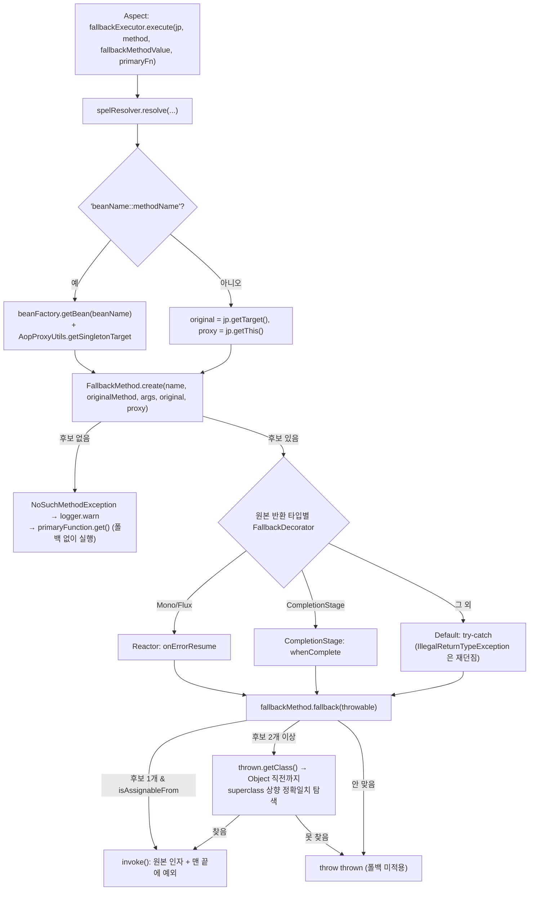

# Fallback — 폴백 메서드는 어떻게 선택되나

`fallbackMethod = "unknownStatus"` 라고 적었을 때 리플렉션이 어떤 규칙으로 메서드를 찾고, 예외 타입이 여러 개일 때 무엇을 고르는지 소스로 확인합니다. 그리고 폴백을 **써야 할 때와 쓰면 안 될 때** 를 구분합니다.

## 목차
- [1. 핵심 개념 (What)](#1-핵심-개념-what)
- [2. 왜 알아야 하는가 (Why)](#2-왜-알아야-하는가-why)
- [3. 내부 구현 분석 (How)](#3-내부-구현-분석-how)
- [4. 실전 예제](#4-실전-예제)
- [5. 정리](#5-정리)

---

## 1. 핵심 개념 (What)

폴백(fallback)은 **보호 장치가 실패를 반환했을 때 대신 돌려줄 값을 만드는 메서드** 입니다 — `@CircuitBreaker(name = "paymentApi", fallbackMethod = "unknownStatus")` 를 붙이고 같은 클래스에 `PaymentStatus unknownStatus(String paymentId, Throwable t)` 를 두는 형태입니다. 구현은 `resilience4j-spring6` 의 `io.github.resilience4j.spring6.fallback` 패키지입니다.

| 클래스 | 역할 |
|---|---|
| `FallbackExecutor` | 애스펙트가 호출하는 진입점. 이름 해석 → `FallbackMethod` 생성 → 데코레이터 위임 |
| `FallbackMethod` | 리플렉션으로 후보를 찾고(`create`), 예외 타입에 맞는 하나를 골라 실행(`fallback`) |
| `FallbackDecorators` / `FallbackDecorator` | 반환 타입별 데코레이터 선택기 / `supports` + `decorate` 2메서드 인터페이스 |
| `DefaultFallbackDecorator` / `CompletionStageFallbackDecorator` / `ReactorFallbackDecorator` / `RxJava2·3FallbackDecorator` | `try-catch` / `whenComplete` / `onErrorResume` / RxJava 경로 |
| `FallbackConfiguration` | 위 빈들을 등록하는 `@Configuration` |
| `SpelResolver` / `DefaultSpelResolver` / `SpelRootObject` | `name`·`fallbackMethod` 의 SpEL 평가 |

**애스펙트 체인에서 폴백은 가장 바깥** 입니다. 서킷·재시도·레이트리미터가 전부 소진된 뒤에 돕니다([애스펙트 문서](./02-aop-aspects.md) 3.1).

---

## 2. 왜 알아야 하는가 (Why)

- **폴백 메서드를 못 찾아도 기동은 성공하고 호출도 성공합니다.** `FallbackExecutor` 는 `NoSuchMethodException` 을 잡아 `logger.warn` 한 줄만 남기고 원본을 그대로 실행합니다. 오타 하나로 폴백이 **영구히 죽은 상태** 가 되는데 평시에는 증상이 없고, 장애가 터진 순간에야 발견됩니다.
- **폴백이 또 외부 호출을 하면 장애가 전파됩니다.** "결제 API 가 죽으면 레거시 결제 API 호출" 같은 폴백은 장애 시 두 시스템에 동시에 부하를 가합니다. 폴백은 "다른 호출"이 아니라 **"싼 대안"** 이어야 합니다.

---

## 3. 내부 구현 분석 (How)

### 3.1 전체 흐름



### 3.2 `FallbackExecutor.execute()` — 진입점

```java
String fallbackMethodName = spelResolver.resolve(method, jp.getArgs(), fallbackMethodValue);
FallbackMethod fallbackMethod = null;
if (StringUtils.hasLength(fallbackMethodName)) {
    try {   // beanName::methodName 파싱(3.3) 또는 jp.getTarget()/getThis()
        fallbackMethod = FallbackMethod.create(fallbackMethodName, method, jp.getArgs(), original, proxy);
    } catch (NoSuchMethodException ex) {
        logger.warn("No fallback method match found", ex);
    } catch (NoSuchBeanDefinitionException | BeanNotOfRequiredTypeException ex) {
        logger.warn("Failed to resolve fallback bean '{}'", beanName, ex);
    }
}
if (fallbackMethod == null) {
    return primaryFunction.get();          // ← 폴백 없이 원본 실행
}
return fallbackDecorators.decorate(fallbackMethod, primaryFunction).get();
```

**해석이 실패하면 `warn` 뒤에 원본을 그대로 실행합니다.** 그래서 이 로그 한 줄을 모니터링에 걸어 두는 게 실무적으로 유용합니다. 메시지는 `FallbackMethod.create()` 가 `String.format("%s %s.%s(%s,%s)", returnType, targetClass, name, params, Throwable.class)` 로 만들어 **기대한 시그니처를 그대로 찍어 줍니다.**

```
WARN i.g.r.s.fallback.FallbackExecutor - No fallback method match found
java.lang.NoSuchMethodException: class com.example.PaymentStatus com.example.PaymentApiClient.unknwonStatus(java.lang.String,class java.lang.Throwable)
```

### 3.3 `beanName::methodName` — 다른 빈의 메서드를 폴백으로

구분자 `BEAN_METHOD_SEPARATOR = "::"` 가 있으면 `beanFactory.getBean(beanName)` 으로 폴백 빈을 꺼내고 `AopProxyUtils.getSingletonTarget(fallbackBean)` 으로 프록시를 벗겨 `original` 을 잡습니다(폴백 빈이 `@Transactional` 등으로 프록시돼 있어도 `private` 폴백을 찾기 위한 처리). 따라서 `@CircuitBreaker(fallbackMethod = "recommendationFallback::popular")` 로 **폴백 로직을 별도 클래스로 분리** 할 수 있습니다. `::` 가 2개 이상이거나 한쪽이 비면 `NoSuchMethodException`, `beanFactory` 미주입은 `"...requires BeanFactory but it was not injected"`, 빈을 못 찾으면 `"Failed to resolve fallback bean '{}'"` — **전부 `warn` 만 남기고 삼켜집니다.**

### 3.4 후보 탐색 규칙 — `filter()`

```java
private static boolean filter(Method method, MethodMeta methodMeta) {
    if (!method.getName().equals(methodMeta.fallbackMethodName)) return false;            // ①
    if (!methodMeta.returnType.isAssignableFrom(method.getReturnType())) return false;    // ②
    if (method.getParameterCount() == 1) {                                                // ③
        return Throwable.class.isAssignableFrom(method.getParameterTypes()[0]);
    }
    if (method.getParameterCount() != methodMeta.params.length + 1) return false;         // ④
    Class[] targetParams = method.getParameterTypes();
    for (int i = 0; i < methodMeta.params.length; i++) {
        if (methodMeta.params[i] != targetParams[i]) return false;                        // ⑤
    }
    return Throwable.class.isAssignableFrom(targetParams[methodMeta.params.length]);      // ⑥
}
```

| # | 규칙 |
|---|---|
| ① | **이름이 정확히 같아야** 한다 |
| ② | 폴백 반환 타입이 원본에 **대입 가능** (`원본.isAssignableFrom(폴백)`) — 같거나 **서브타입** |
| ③ | 파라미터가 **1개면 `Throwable` 하위** — 원본 인자를 받지 않는 폴백도 허용 |
| ④⑤ | 그 외에는 개수가 **원본 + 1**, 앞쪽은 원본과 **정확히 동일한 타입**(`!=` — 상속 불허) |
| ⑥ | 마지막은 `Throwable` 하위 |

주의할 비대칭: **반환 타입은 서브타입 허용(`isAssignableFrom`), 파라미터 타입은 정확히 일치(`!=`)** 입니다 — 원본이 `List<Item>` 을 받는데 폴백이 `Collection<Item>` 을 받으면 매칭되지 않습니다. `ReflectionUtils.doWithMethods()` 는 **상속 계층 전체** 를 돌고 접근 수준 필터가 없어 **`private` 폴백도, 부모 클래스의 폴백도 찾습니다**(호출 시 `makeAccessible`). 탐색 결과는 `ConcurrentReferenceHashMap` 에 `MethodMeta(name, params, returnType, targetClass)` 키로 캐시되므로 리플렉션 비용은 첫 호출 한 번뿐입니다.

### 3.5 예외 타입별 오버로딩 — 선택 알고리즘

후보들은 **마지막 파라미터(예외) 타입을 키로** 하는 맵에 담깁니다. `merge()` 에서 같은 예외 타입을 두 메서드가 커버하면 `IllegalStateException("You have more that one fallback method that cover the same exception type " + exception.getName())` 입니다.

```java
public Object fallback(Throwable thrown) throws Throwable {
    if (fallbackMethods.size() == 1) {                    // 경로 A
        Map.Entry<Class<?>, Method> entry = fallbackMethods.entrySet().iterator().next();
        if (entry.getKey().isAssignableFrom(thrown.getClass())) {
            return invoke(entry.getValue(), thrown);
        }
        throw thrown;
    }
    Method fallback = null;                               // 경로 B
    Class<?> thrownClass = thrown.getClass();
    while (fallback == null && thrownClass != Object.class) {
        fallback = fallbackMethods.get(thrownClass);      // 정확 일치 조회
        thrownClass = thrownClass.getSuperclass();        // 한 단계 상향
    }
    if (fallback != null) {
        return invoke(fallback, thrown);
    }
    throw thrown;
}
```

- **경로 A (후보 1개)**: `isAssignableFrom` 한 번만 검사. `fallback(..., IOException e)` 하나만 있고 `IllegalStateException` 이 나면 → **폴백 미적용, 원본 예외 전파**. 모두 받으려면 `Throwable e` 로 선언합니다.
- **경로 B (후보 2개 이상)**: `thrown.getClass()` 부터 `Object` 직전까지 **정확 일치 맵 조회로 상향 탐색**. 후보가 `fb(String, RuntimeException)` 과 `fb(String, IllegalArgumentException)` 일 때 `NumberFormatException` 이 던져지면 `NumberFormatException`(없음) → `IllegalArgumentException`(**발견**) 에서 멈춥니다 — **가장 가까운 상위 타입이 이깁니다**(클래스 Javadoc 에도 같은 예가 있습니다). `getSuperclass()` 만 따라가므로 **인터페이스 타입 폴백은 절대 매칭되지 않습니다.**

### 3.6 `invoke()` — 인자 조립과 호출 대상

```java
Object target = getTarget(fallback);
Object[] newArgs = Arrays.copyOf(args, args.length + 1);
newArgs[args.length] = throwable;          // 원본 인자 + 맨 끝에 예외
return fallback.invoke(target, newArgs);
// ...
} catch (InvocationTargetException e) {
    // We want the original fallback-method exception to propagate instead:
    throw e.getCause();
}

private Object getTarget(Method fallback) {
    if (Modifier.isPrivate(fallback.getModifiers())) return original;
    if (Proxy.isProxyClass(proxy.getClass())) return original;
    return proxy;
}
```

원본 인자 배열을 복사해 **맨 끝에 예외를 덧붙입니다** — 시그니처 규칙의 근거입니다. `InvocationTargetException` 을 벗겨 `e.getCause()` 를 던지므로 **폴백 안에서 예외가 나면 그 예외가 전파되고 원본 예외는 사라집니다** — 원인 추적이 끊기는 지점이라 폴백 안에서 원본 예외를 꼭 로깅하세요. `getTarget()` 은 `private` 이면 target, `public` 이면 가능하면 **프록시** 로 호출하므로 **`public` 폴백은 그 메서드에 붙은 다른 애너테이션(`@Transactional` 등)이 적용되고 `private` 폴백은 적용되지 않습니다.**

### 3.7 데코레이터 — `IllegalReturnTypeException` 이 나는 조건

`FallbackDecorators.get(returnType)` 이 `supports(returnType)` 첫 매칭을 고르고 없으면 `defaultFallbackDecorator` 입니다(판정 기준은 **원본 메서드의 반환 타입**). `DefaultFallbackDecorator` 에 중요한 디테일이 있습니다.

```java
return () -> {
    try {
        return supplier.get();
    } catch (IllegalReturnTypeException e) {
        throw e;                                   // ← 유일하게 흡수하지 않는 예외
    } catch (Throwable throwable) {
        return fallbackMethod.fallback(throwable);
    }
};
```

이 예외는 `io.github.resilience4j.spring6.timelimiter.configure.IllegalReturnTypeException` 으로, **`@TimeLimiter` 를 `CompletionStage` 가 아닌 반환 타입에 붙였을 때** `TimeLimiterAspect` 가 던지는 **설정 오류** 입니다. 설정 오류를 폴백으로 덮으면 영원히 모르게 되므로 의도적으로 뚫어 둔 것입니다. **따라서 "폴백 반환 타입 불일치"와는 무관합니다** — 폴백 반환 타입이 안 맞으면 `filter()` 에서 후보에서 빠져 `NoSuchMethodException` → `warn` 로그가 됩니다. 혼동하는 글이 많으니 구분해 두세요.

`CompletionStageFallbackDecorator` 는 `whenComplete` 안에서 `CompletionException`/`ExecutionException` 을 벗겨 `getCause()` 를 폴백에 넘기므로 **비동기 메서드의 폴백도 `SocketTimeoutException` 같은 원인 예외로 선언** 합니다(래핑 예외로 선언하면 매칭 실패). 또 `tryRecover()` 가 `Objects.requireNonNull(completionStage)` 를 적용하므로 **`null` 을 돌려주면 NPE** 입니다 — `CompletableFuture.completedFuture(null)` 을 쓰세요. `ReactorFallbackDecorator` 는 `onErrorResume` 을 붙여 폴백의 예외도 `Mono.error`/`Flux.error` 로 유지합니다.

### 3.8 SpEL — `name` 과 `fallbackMethod`

`DefaultSpelResolver` 는 패턴 4개를 정규식(`^\$\{.+}$`, `.*#\{.+}.*`, `^#.+$`, `^@.+`)으로 구분합니다.

| 패턴 | 형태 | 평가 방식 | 빈 참조 |
|---|---|---|---|
| 플레이스홀더 | `${app.cb.name}` | `StringValueResolver` | — |
| SpEL 템플릿 | `payment-#{#tenantId}` | `TemplateParserContext` + `MethodBasedEvaluationContext` | 가능 |
| 메서드 SpEL | `#tenantId`, `#root.args[0]` | `MethodBasedEvaluationContext` | **불가** (`BeanResolver` 미설정) |
| 빈 SpEL | `@tenantResolver.resolve(#req)` | + `BeanFactoryResolver` | 가능 |
| 그 외 | `payment` | 그대로 반환 | — |

`SpelRootObject` 가 노출하는 것은 `getClassName()`, `getMethodName()`, `getArgs()` 3개뿐이라 `#root.className`, `#root.methodName`, `#root.args[0]` 을 쓸 수 있습니다.

| 주의 | 내용 |
|---|---|
| 파라미터 이름 | `#tenantId` 는 `StandardReflectionParameterNameDiscoverer` 에 의존. 컴파일 시 `-parameters` 가 없으면 `arg0` 이 되어 **평가 실패**(Boot 빌드 플러그인은 기본 ON). 안 되면 `#root.args[0]` 으로 우회 |
| 타입 | 메서드/빈 SpEL 은 결과를 **`(String)` 캐스팅** → `Long` 이면 `ClassCastException`. `#userId.toString()` 또는 템플릿(`tenant-#{#userId}`) 사용 |
| 카디널리티 | **호출마다 평가** 된다. 사용자 ID 같은 값을 쓰면 인스턴스가 무한히 쌓이고 메트릭 태그가 폭발. 테넌트·리전처럼 **값 집합이 유한한 것** 에만 |

### 3.9 폴백 설계 원칙

**좋은 폴백** — 외부 의존이 없거나 매우 가볍습니다: 로컬 캐시(Caffeine)의 직전 성공 응답, 정적 기본값(`PaymentStatus.UNKNOWN`), 빈 목록(섹션만 비워 렌더), 축소된 응답(개인화 추천 → 미리 계산된 인기 목록), 기능 플래그 off.

| 안티패턴 | 왜 문제인가 |
|---|---|
| 폴백에서 또 다른 외부 API 호출 | 장애 시 두 시스템에 동시 부하. 폴백 자체가 타임아웃 → 응답 시간 2배 |
| 폴백에서 DB 조회 | 애스펙트가 트랜잭션 **밖** 이라 새 커넥션을 쓴다. 풀 고갈 시 동반 사망 |
| 폴백에서 원격 캐시(Redis) 호출 | 네트워크 의존. Redis 가 같이 느려지면 무의미 |
| 예외를 삼키고 `null` 반환 | 호출자에서 NPE. 원인 추적 불가 |
| 폴백 안에서 로깅 없음 | `invoke()` 가 원본 예외를 교체하므로 원인이 영구 소실 |

**폴백을 쓰면 안 되는 경로**: **결제 승인/취소·포인트 차감·재고 차감** 에 폴백으로 "성공처럼 보이는 값"을 반환하면, 실제로는 돈이 움직이지 않았는데 주문이 완료된 것으로 처리됩니다 — 조용한 데이터 불일치입니다. 실패를 그대로 올려 보내 재시도를 요청하거나 비동기 보상 트랜잭션으로 설계해야 합니다. **인증·인가** 는 폴백 통과가 곧 보안 사고이므로 fail-closed 가 맞고, **쓰기 작업 일반** 은 멱등 키 없이는 "실패했지만 서버에는 반영됨"을 구분할 수 없습니다.

판단 기준 하나로 압축하면: **"이 폴백 값으로 응답했을 때, 나중에 정정하지 않아도 되는가?"** 아니라면 폴백을 쓰지 말고 실패를 전파하세요.

---

## 4. 실전 예제

### 4.1 추천 API 3단 폴백 (캐시 → 인기목록 → 빈 배열)

```java
@Component
public class RecommendationClient {
    // RestClient recommendApi, Cache<Long,List<ItemId>> lastSuccess (로컬 캐시),
    // PopularItemsHolder popularItems (배치가 갱신, 메모리 상주) — 생성자·import 생략

    @TimeLimiter(name = "recommendApi")
    @CircuitBreaker(name = "recommendApi", fallbackMethod = "degraded")
    public CompletionStage<List<ItemId>> recommend(long userId) {
        return CompletableFuture.supplyAsync(() -> {
            List<ItemId> items = recommendApi.get().uri("/recommendations?userId={id}", userId)
                .retrieve().body(RecommendResponse.class).items();
            lastSuccess.put(userId, items);
            return items;
        });
    }

    // 3단 폴백. 외부 호출은 단 하나도 하지 않는다.
    // CompletionStageFallbackDecorator 가 CompletionException 을 벗겨 원인 예외를 넘기므로
    // Throwable 로 받으면 전부 잡힌다. 반환은 반드시 non-null CompletionStage.
    private CompletionStage<List<ItemId>> degraded(long userId, Throwable t) {
        log.warn("recommendApi degraded userId={} cause={}", userId, t.toString());
        List<ItemId> cached = lastSuccess.getIfPresent(userId);              // 1단
        if (cached != null && !cached.isEmpty()) {
            return CompletableFuture.completedFuture(cached);
        }
        List<ItemId> popular = popularItems.snapshot();                      // 2단
        return CompletableFuture.completedFuture(
            popular.isEmpty() ? List.of() : popular);                        // 3단: 섹션만 빈다
    }
}
```

```yaml
resilience4j:
  timelimiter:
    instances:
      recommendApi: { timeout-duration: 300ms, cancel-running-future: true }
  circuitbreaker:
    instances:
      recommendApi:
        sliding-window-type: TIME_BASED
        sliding-window-size: 20              # 초 단위
        minimum-number-of-calls: 20
        failure-rate-threshold: 40
        slow-call-duration-threshold: 250ms  # 타임아웃보다 낮게 → 먼저 감지
        slow-call-rate-threshold: 50
        wait-duration-in-open-state: 20s
```

`@TimeLimiter` 가 `@CircuitBreaker` 보다 **안쪽**(order `2147483645` > `2147483643`)이라 타임아웃이 서킷의 실패로 기록됩니다 — 의도한 동작입니다. 폴백 3단 전부 메모리 접근뿐이라 추천 API 가 완전히 죽어도 마이크로초 단위로 끝납니다.

### 4.2 예외 타입별 폴백 오버로딩

```java
@Component
public class ShippingFeeClient {

    private static final ShippingFee DEFAULT_FEE = ShippingFee.of(3_000, "default");

    @Retry(name = "shippingApi")
    @CircuitBreaker(name = "shippingApi", fallbackMethod = "feeFallback")
    public ShippingFee calculate(String zipCode, int weightGram) {
        return shippingApi.post().uri("/fees")
            .body(new FeeRequest(zipCode, weightGram)).retrieve().body(ShippingFee.class);
    }

    // --- 이름은 전부 feeFallback, 마지막 파라미터 타입만 다르다 ---

    // 서킷이 열린 상태. CallNotPermittedException 클래스 자체로 매칭된다.
    private ShippingFee feeFallback(String zipCode, int weightGram, CallNotPermittedException e) {
        return DEFAULT_FEE.withReason("circuit-open");
    }

    // 4xx — 우리 요청이 잘못됐다. 기본값으로 가리면 버그를 숨긴다 → 그대로 전파.
    private ShippingFee feeFallback(String zipCode, int weightGram, HttpClientErrorException e) {
        log.error("shipping api rejected zip={} status={}", zipCode, e.getStatusCode());
        throw e;   // 폴백에서 던진 예외는 invoke() 가 그대로 전파한다
    }

    // 타임아웃 — 재시도까지 소진. 기본 배송비로 degrade.
    private ShippingFee feeFallback(String zipCode, int weightGram, SocketTimeoutException e) {
        return DEFAULT_FEE.withReason("timeout");
    }

    // 최종 안전망. 상향 탐색이 Object 직전까지 올라오므로 나머지는 여기로 온다.
    private ShippingFee feeFallback(String zipCode, int weightGram, Throwable t) {
        log.error("shipping api unexpected failure zip={}", zipCode, t);
        return DEFAULT_FEE.withReason("unknown");
    }
}
```

주의 3개: ① **인터페이스 타입으로는 매칭되지 않습니다** (`getSuperclass()` 만 따라감) — `feeFallback(..., Serializable e)` 는 절대 호출되지 않습니다. ② `HttpClientErrorException.NotFound` 처럼 구체 서브클래스로 던져지는 예외는 상향 탐색 1단계에서 `HttpClientErrorException` 폴백에 잡힙니다. ③ 같은 예외 타입을 두 메서드가 커버하면 `merge()` 가 `IllegalStateException` 을 던지므로, 부모 클래스에서 상속받은 폴백과 겹치지 않게 주의하세요.

```yaml
resilience4j:
  retry:
    instances:
      shippingApi:
        max-attempts: 3
        wait-duration: 150ms
        enable-exponential-backoff: true
        retry-exceptions: [java.net.SocketTimeoutException]
        ignore-exceptions:            # 재시도하지 않을 예외
          - org.springframework.web.client.HttpClientErrorException
          - io.github.resilience4j.circuitbreaker.CallNotPermittedException
  circuitbreaker:
    instances:
      shippingApi:
        sliding-window-size: 50
        minimum-number-of-calls: 20
        failure-rate-threshold: 50
        wait-duration-in-open-state: 30s
        # 실패로 세지 않을 예외 — 4xx 는 상대 서버 장애가 아니다
        ignore-exceptions: [org.springframework.web.client.HttpClientErrorException]
```

### 4.3 SpEL 로 테넌트별 인스턴스 이름 만들기

```java
@Component
public class TenantApiClient {

    // name: SpEL 템플릿 → "erp-acme" 처럼 테넌트별 인스턴스 / configuration: 설정 하나 공유.
    // 템플릿(#{...})은 getValue(ctx, String.class) 로 변환되므로 String 이 아니어도 안전.
    @CircuitBreaker(name = "erp-#{#tenantId}", configuration = "externalErp",
                    fallbackMethod = "cachedSnapshot")
    public ErpData fetch(String tenantId, String docNo) {
        return client.get().uri("/tenants/{t}/docs/{d}", tenantId, docNo)
            .retrieve().body(ErpData.class);
    }

    // 빈 SpEL(^@.+) — BeanFactoryResolver 가 붙어 빈 참조 가능. 반환은 String 이어야 한다.
    @CircuitBreaker(name = "@erpInstanceNamer.resolve(#region, #tier)",
                    configuration = "externalErp", fallbackMethod = "cachedSnapshot")
    public ErpData fetchByRegion(String region, String tier, String docNo) { /* ... */ }

    // -parameters 가 없는 환경이면 name = "erp-#{#root.args[0]}" 로 우회할 수 있다.

    private ErpData cachedSnapshot(String tenantId, String docNo, Throwable t) {
        return ErpData.empty(tenantId);
    }
}

/** 카디널리티를 유한하게 유지하는 것이 이 빈의 책임이다. */
@Component("erpInstanceNamer")
class ErpInstanceNamer {
    public String resolve(String region, String tier) {
        String safeRegion = switch (region) {
            case "ap-northeast-2", "us-east-1", "eu-west-1" -> region;
            default -> "other";
        };
        return "erp-" + safeRegion + "-" + ("premium".equals(tier) ? "premium" : "standard");
    }
}
```

```yaml
resilience4j:
  circuitbreaker:
    configs:
      externalErp:                      # 모든 테넌트 인스턴스가 공유
        sliding-window-size: 50
        minimum-number-of-calls: 20
        failure-rate-threshold: 50
        wait-duration-in-open-state: 30s
        event-consumer-buffer-size: 20  # 인스턴스가 많아지므로 버퍼는 작게
    # instances 블록이 없어도 동작한다 — Aspect 의 getOrCreateCircuitBreaker() 가
    # getConfiguration("externalErp") 로 설정을 찾아 circuitBreaker("erp-acme", config) 를 lazy 생성.
```

**가드레일**: 새 이름마다 인스턴스가 추가되고, 각각이 슬라이딩 윈도 + 이벤트 버퍼 메모리와 **메트릭 태그 하나** 를 차지합니다. `ErpInstanceNamer` 처럼 **허용 목록으로 좁히는 레이어** 를 두고, `curl -s localhost:8080/actuator/circuitbreakers | jq '.circuitBreakers | length'` 로 인스턴스 수를 감시하세요.

---

## 5. 정리

| 항목 | 내용 |
|---|---|
| 진입점 | `FallbackExecutor.execute(...)` — 애스펙트 체인의 **가장 바깥** |
| 폴백을 못 찾으면 | `logger.warn("No fallback method match found", ex)` 뒤 **원본 그대로 실행**. 기동·호출 모두 성공. 에러 메시지에 **기대 시그니처가 그대로** 찍힌다 |
| 시그니처 규칙 | 이름 정확히 일치 + (원본 파라미터와 **타입 정확히 일치**) + 마지막에 `Throwable` 하위. 또는 **예외 1개만**. 반환 타입은 `원본.isAssignableFrom(폴백)` = 같거나 **서브타입** |
| 이름 확장 | `beanName::methodName` 으로 **다른 빈의 메서드** 지정 가능 |
| 접근 수준 | `private` 가능(`ReflectionUtils.doWithMethods` 가 **상속 계층 전체** 탐색). `private` → target 직접, `public` → **프록시 경유** 하므로 폴백의 다른 애너테이션이 적용됨 |
| 후보 1개 | `isAssignableFrom` 1회 검사. 안 맞으면 **원본 예외 전파** |
| 후보 2개 이상 | `getSuperclass()` 상향 **정확 일치 탐색** → 가장 가까운 상위 타입이 이긴다. **인터페이스 타입은 절대 매칭 안 됨** |
| 같은 예외 중복 | `IllegalStateException("...more that one fallback method that cover the same exception type")` |
| 폴백 안에서 예외 | `InvocationTargetException` 을 벗겨 **그 예외가 전파**. 원본 예외 소실 → 반드시 로깅. 탐색 결과는 `ConcurrentReferenceHashMap` 캐시 |
| `IllegalReturnTypeException` | **폴백 반환 타입과 무관.** `@TimeLimiter` + 비(非)`CompletionStage` 반환 시 발생하며 `DefaultFallbackDecorator` 가 **재던진다** |
| `CompletionStage` 폴백 | `CompletionException`/`ExecutionException` 을 벗겨 **원인 예외** 를 넘김. **`null` 반환 금지**(NPE). Reactor 는 `onErrorResume` 으로 예외도 리액티브 신호 유지 |
| SpEL | `${...}` / `#{...}` / `#param` / `@bean...` — **메서드 SpEL 만 빈 참조 불가**. 루트는 `#root.className`/`methodName`/`args[n]`. `(String)` 캐스팅 / `-parameters` 필요 / **호출마다 평가 → 카디널리티 폭발 위험** |
| 좋은 폴백 / 안티패턴 | 로컬 캐시·정적 기본값·빈 목록·축소된 응답·기능 플래그 off / 폴백에서 외부 API·DB·Redis 호출, 예외 삼키고 `null`, 로깅 없음 |
| 폴백 금지 경로 | 결제·포인트·재고 등 정합성 경로, 인증·인가, 멱등성 없는 쓰기 |
| 판단 기준 | "이 값으로 응답해도 나중에 정정할 필요가 없는가?" 아니면 실패를 전파하라 |

---

## 관련 문서
- 선행: [애스펙트 동작과 프록시의 한계](./02-aop-aspects.md)
- 선행: [Spring Boot 3 자동 구성 추적](./01-spring-boot-autoconfiguration.md)
- 후행: [설정 계층과 Customizer](./04-config-hierarchy.md)
- 후행: [프로덕션 설계](./12-production-design.md)

---
*Resilience4j v2.4.0 기준 · 소스 커밋 7e3ab525*
