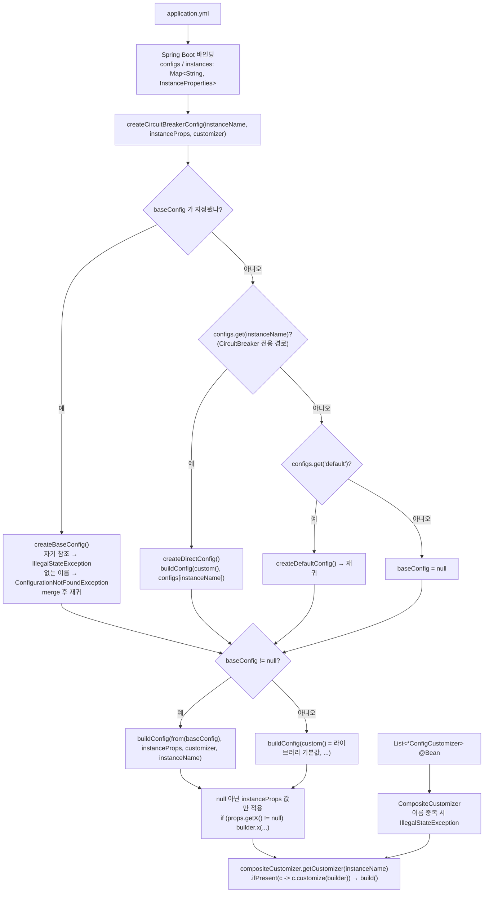

# 설정 계층과 Customizer — yml 로 다 되는 것과 안 되는 것

`configs:` / `instances:` 2계층이 실제로 어떻게 병합되는지 `ConfigUtils` 와 `Common*ConfigurationProperties` 로 확인하고, **컴포넌트마다 상속 규칙이 다르다는 사실** 을 소스로 짚습니다. 그리고 yml 의 경계 — `*ConfigCustomizer` 로만 되는 것 — 를 정확히 가릅니다.

## 목차
- [1. 핵심 개념 (What)](#1-핵심-개념-what)
- [2. 왜 알아야 하는가 (Why)](#2-왜-알아야-하는가-why)
- [3. 내부 구현 분석 (How)](#3-내부-구현-분석-how)
- [4. 실전 예제](#4-실전-예제)
- [5. 정리](#5-정리)

---

## 1. 핵심 개념 (What)

```yaml
resilience4j:
  circuitbreaker:
    configs:            # 재사용 가능한 "설정 템플릿"
      default: { ... }  # 특별 취급되는 이름
      strict:  { ... }
    instances:          # 실제 인스턴스
      paymentApi:
        base-config: strict          # 템플릿 상속
        failure-rate-threshold: 40   # 일부만 덮어쓰기
```

관련 클래스는 전부 `resilience4j-framework-common` 에 있습니다. `CommonProperties`(부모, `tags` 만 보유)를 상속한 `CommonCircuitBreakerConfigurationProperties`(844행)·`CommonRetryConfigurationProperties`(535행)·`CommonRateLimiterConfigurationProperties`(320행)·`CommonThreadPoolBulkheadConfigurationProperties`(251행)·`CommonBulkheadConfigurationProperties`(188행)·`CommonTimeLimiterConfigurationProperties`(167행) 가 `configs`/`instances` 맵과 `create<X>Config()` 조립 로직을 들고, `ConfigUtils`(`mergePropertiesIfAny()` 오버로드 7개)·`CompositeCustomizer<T>`/`CustomizerWithName`·`*ConfigCustomizer`(`customize(Builder)` + `of(name, consumer)`)가 함께 씁니다.

**결론부터**: 상속은 **서로 다른 두 메커니즘** 이 합쳐진 결과입니다.

1. `<X>Config.from(baseConfig)` — 완성된 base `Config` 로 빌더를 **시드** 하고 인스턴스의 `null` 아닌 값만 덮어씁니다. 상속의 본체입니다.
2. `ConfigUtils.mergePropertiesIfAny()` — `Config` 객체에 들어가지 **않는** 부가 필드(헬스 플래그, 이벤트 버퍼 크기, Retry 백오프 플래그)만 `null` 일 때 복사합니다.

---

## 2. 왜 알아야 하는가 (Why)

"설정이 안 먹는다"는 티켓의 대부분이 이 계층에서 나오고, **컴포넌트마다 규칙이 다릅니다.** CircuitBreaker 에서 통하던 패턴을 Retry 에 썼다가 조용히 틀립니다.

- **`configs.default` 상속 여부가 컴포넌트마다 다릅니다.** `configs.strict` 를 만들었을 때 Retry 는 `configs.default` 를 자동 상속하고 **CircuitBreaker 는 하지 않습니다.**
- **`configs.<이름>` 을 인스턴스 이름과 똑같이 지으면 CircuitBreaker 만 자동 적용됩니다.** 나머지는 `base-config` 를 명시해야 합니다.
- **인스턴스에 `record-exceptions` 를 적으면 base 의 `record-failure-predicate` 가 무효화됩니다.** 소스에 `builder.recordException(null)` 이 명시돼 있습니다 — 좁히려고 쓴 설정이 넓히는 결과를 냅니다.

---

## 3. 내부 구현 분석 (How)

### 3.1 병합 파이프라인



### 3.2 `ConfigUtils.mergePropertiesIfAny()` — 실제로 무엇을 병합하나

이름이 거창하지만 **하는 일은 아주 좁습니다.** 서킷브레이커 버전 발췌:

```java
public static void mergePropertiesIfAny(
    CommonCircuitBreakerConfigurationProperties.InstanceProperties instanceProperties,
    CommonCircuitBreakerConfigurationProperties.InstanceProperties baseProperties) {
    if (instanceProperties.getRegisterHealthIndicator() == null &&
        baseProperties.getRegisterHealthIndicator() != null) {
        instanceProperties.setRegisterHealthIndicator(baseProperties.getRegisterHealthIndicator());
    }
    // allowHealthIndicatorToFail, eventConsumerBufferSize, ignoreClassBindingExceptions 동일 패턴
}
```

**"인스턴스 값이 `null` 이고 base 값이 있을 때만 복사"** — 이게 "지정하지 않은 값만 상속된다"의 한쪽 절반입니다.

| 컴포넌트 | 복사되는 필드 |
|---|---|
| CircuitBreaker | `registerHealthIndicator`, `allowHealthIndicatorToFail`, `eventConsumerBufferSize`, `ignoreClassBindingExceptions` |
| RateLimiter | `registerHealthIndicator`, `allowHealthIndicatorToFail`, `subscribeForEvents`, `eventConsumerBufferSize` |
| Retry | `enableExponentialBackoff`, `enableRandomizedWait`, `exponentialBackoffMultiplier`, `exponentialMaxWaitDuration`, `eventConsumerBufferSize` |
| Bulkhead / ThreadPoolBulkhead / TimeLimiter / Timer | `eventConsumerBufferSize` |

왜 이것들만인가 — **`<X>Config` 에 들어가지 않는 Spring 전용 메타데이터** 이기 때문입니다. `slidingWindowSize`, `maxAttempts` 같은 값은 `from(baseConfig)` 시드가 이미 가져옵니다.

> **파라미터 순서 주의.** CircuitBreaker 오버로드는 `(instanceProperties, baseProperties)`, Retry/Bulkhead/RateLimiter/TimeLimiter 오버로드는 `(baseProperties, instanceProperties)` 순입니다. 동작(인스턴스가 base 값을 흡수)은 같지만 선언 순서가 뒤집혀 있습니다.
>
> **`ignoreClassBindingExceptions` 는 v2.4.0 에서 동작하지 않습니다.** 바인딩되고 병합되지만 `buildConfig()` 어디에서도 읽지 않습니다(`grep -rn "getIgnoreClassBindingExceptions"` → `ConfigUtils` 와 getter/setter 뿐).

### 3.3 `createCircuitBreakerConfig()` — 분기 3개와 컴포넌트별 비대칭

```java
CircuitBreakerConfig baseConfig = null;
if (instanceProperties != null && StringUtils.isNotEmpty(instanceProperties.getBaseConfig())) {
    baseConfig = createBaseConfig(instanceName, instanceProperties, customizer);
} else if (configs.get(instanceName) != null) {          // ← CircuitBreaker 에만 있는 경로
    baseConfig = createDirectConfig(instanceName, instanceProperties, customizer);
} else if (configs.get(DEFAULT) != null) {
    baseConfig = createDefaultConfig(instanceProperties, customizer);
}
return buildConfig(baseConfig != null ? from(baseConfig) : custom(),
    instanceProperties, customizer, instanceName);
```

마지막 두 줄이 핵심입니다 — base 가 있으면 `from(baseConfig)` 로, 없으면 `custom()`(라이브러리 기본값)으로 빌더를 시드합니다. `createBaseConfig()` 가 검증 2개를 담당합니다.

```java
String baseConfigName = instanceProperties.getBaseConfig();
if (instanceName.equals(baseConfigName)) {
    throw new IllegalStateException("Circular reference detected in instance config: " + instanceName);
}
InstanceProperties baseProperties = configs.get(baseConfigName);
if (baseProperties == null) {
    throw new ConfigurationNotFoundException(baseConfigName);
}
ConfigUtils.mergePropertiesIfAny(instanceProperties, baseProperties);
return createCircuitBreakerConfig(baseConfigName, baseProperties, customizer);   // 재귀
```

자기 참조는 `IllegalStateException`, 없는 이름은 `ConfigurationNotFoundException`(`"Configuration with name '%s' does not exist"`) → **기동 실패** 입니다. `base-config` 오타는 조용히 넘어가지 않지만 애너테이션 `name` 오타는 넘어갑니다(3.6). 마지막 줄의 **재귀** 덕에 `base-config` 는 체인으로 이어지지만(`instances.a` → `configs.b` → `configs.c`), 순환 검사가 1단계 직접 비교뿐이어서 `configs.b.base-config: c` + `configs.c.base-config: b` 같은 **2단 순환은 `StackOverflowError`** 입니다.

Retry 쪽은 분기가 **2개** 뿐입니다 — `baseConfig` 가 있으면 그것을, 없고 `!instanceName.equals(DEFAULT) && configs.get(DEFAULT) != null` 이면 `default` 를 base 로 삼습니다. RateLimiter / Bulkhead / ThreadPoolBulkhead / TimeLimiter 도 모두 이 형태입니다(`createBulkheadConfig`, `createRateLimiterConfig` 동일 구조). **여기서 두 개의 비대칭이 나옵니다.**

| 질문 | CircuitBreaker | Retry / RateLimiter / Bulkhead / TimeLimiter |
|---|---|---|
| `instances.X` + `configs.X` (base-config 미지정) | `configs.X` 가 **자동으로 base** (`createDirectConfig`) | 무시. `base-config: X` 를 적어야 한다 |
| `configs.strict` 가 `configs.default` 를 상속하나 | **아니다.** `createDirectConfig` 가 `buildConfig(custom(), ...)` 로 시작 | **그렇다.** `configs.get(DEFAULT)` 분기에 걸린다 |

두 번째가 특히 중요합니다. `configs.default` 에 `writable-stack-trace-enabled: false`, `configs.strict` 에 `failure-rate-threshold: 30` 을 두고 `instances.a: { base-config: strict }` 로 쓰면 — **CircuitBreaker 는 `writable-stack-trace-enabled` 가 `true`(라이브러리 기본값)** 가 됩니다(단 `event-consumer-buffer-size` 는 `ConfigUtils` 가 복사하므로 상속됩니다 — `Config` 객체 밖의 필드라서). 같은 구조를 Retry 로 쓰면 `configs.default` 의 값이 그대로 상속됩니다. 헷갈릴 여지를 없애려면 **`configs.<name>` 에도 `base-config: default` 를 명시** 하세요.

### 3.4 `buildConfig()` — 덮어쓰기 규칙과 위험한 두 줄

```java
if (properties != null) {
    if (properties.enableExponentialBackoff != null && properties.enableExponentialBackoff
        && properties.enableRandomizedWait != null && properties.enableRandomizedWait) {
        throw new IllegalStateException("you can not enable Exponential backoff policy and "
            + "randomized delay at the same time , please enable only one of them");
    }
    configureCircuitBreakerOpenStateIntervalFunction(properties, builder);
    if (properties.getFailureRateThreshold() != null) {               // 모든 필드가 같은 패턴
        builder.failureRateThreshold(properties.getFailureRateThreshold());
    }
    // ...
    if (properties.recordExceptions != null) {
        builder.recordExceptions(properties.recordExceptions);
        // if instance config has set recordExceptions, then base config's recordExceptionPredicate is useless.
        builder.recordException(null);                 // ← base 의 predicate 를 지운다
    }
    if (properties.ignoreExceptions != null) {
        builder.ignoreExceptions(properties.ignoreExceptions);
        builder.ignoreException(null);                 // ← 같은 쌍
    }
}
compositeCircuitBreakerCustomizer.getCustomizer(instanceName)
    .ifPresent(customizer -> customizer.customize(builder));          // yml 보다 우선
return builder.build();
```

- **`if (properties.getX() != null) builder.x(...)` 패턴** — 상속의 나머지 절반입니다. yml 에 **키를 쓰지 않으면** 필드가 `null` 로 남아 `from(baseConfig)` 로 시드된 값이 살아남습니다.
- 지수 백오프와 랜덤 지연을 동시에 켜면 기능 실패가 아니라 **기동 실패** 입니다.
- **`record-exceptions` 가 함정입니다.** 인스턴스에 적으면 `builder.recordException(null)` 로 **base 의 `record-failure-predicate` 를 지웁니다**(주석에도 의도가 적혀 있음). "공통 템플릿에 predicate 를 걸고 인스턴스에서 예외 목록만 추가"는 **동작하지 않습니다.**
- **마지막 2줄**: `Customizer` 는 `build()` **직전** 이라 yml 모든 값보다 우선합니다.
- `configureCircuitBreakerOpenStateIntervalFunction()` 의 진입 조건이 `waitDurationInOpenState != null && toMillis() > 0` 이므로, **`enable-exponential-backoff: true` 만 적고 `wait-duration-in-open-state` 를 안 적으면 아무 일도 일어나지 않습니다.**

### 3.5 yml 로 되는 것과 안 되는 것

흔히 "`recordExceptionPredicate` 는 yml 로 못 한다"고들 하는데 **정확하지 않습니다.** yml 은 **클래스 이름(FQCN)** 을 받고, `ClassUtils.instantiatePredicateClass()` 가 리플렉션으로 생성합니다.

```java
public static <T> Predicate<T> instantiatePredicateClass(Class<? extends Predicate<T>> clazz) {
    try {
        Constructor<? extends Predicate<T>> c = clazz.getConstructor();   // public 무인자 생성자
        if (c != null) return c.newInstance();
        throw new InstantiationException(INSTANTIATION_ERROR_PREFIX + clazz.getName());
    } catch (Exception e) {
        throw new InstantiationException(INSTANTIATION_ERROR_PREFIX + clazz.getName(), e);
    }
}
```


`getConstructor()` 가 **public 무인자 생성자** 를 요구하므로 정확한 경계는 이렇습니다.

| yml 로 **되는** 것 (FQCN 으로) | 타입 |
|---|---|
| `record-failure-predicate`, `ignore-exception-predicate` | `Class<Predicate<Throwable>>` |
| `record-result-predicate` | `Class<Predicate<Object>>` |
| `retry-exception-predicate` / `result-predicate` (Retry) | `Class<? extends Predicate<Throwable>>` / `<Object>` |
| `interval-bi-function` (Retry) | `Class<? extends IntervalBiFunction<Object>>` |
| `consume-result-before-retry-attempt` (Retry) | `Class<? extends BiConsumer<Integer, Object>>` |
| `context-propagators` (ThreadPoolBulkhead) | `Class<? extends ContextPropagator>[]` |

| yml 로 **안 되는** 것 → `*ConfigCustomizer` 필요 | 왜 |
|---|---|
| **Spring 빈을 주입받는 predicate** | 리플렉션 무인자 생성자로 만들어 DI 불가. `@Value`·다른 빈·피처 플래그 참조 불가 |
| 람다/클로저로 조건 작성 | 클래스 파일이 필요하다 |
| 임의의 `IntervalFunction`(`waitIntervalFunctionInOpenState`) | yml 은 `enable-exponential-backoff`/`enable-randomized-wait` 프리셋 2개만 |
| `transitionOnResult`, `slidingWindowSynchronizationStrategy`, `currentTimestampFunction`, `clock`, `ignoreExceptionsPrecedenceEnabled` | `buildConfig()` 가 호출하지 않는다 |
| `RetryConfig.Builder.intervalFunction(IntervalFunction)` | `InstanceProperties` 에 대응 필드가 없다 |
| 런타임에 값이 바뀌는 설정 | 기동 시 한 번 조립된다 |

커스터마이저 인터페이스는 `customize(Builder)` 하나에 `of(name, consumer)` 정적 팩터리뿐이라 람다 한 줄로 끝납니다. 이름 매칭은 `CompositeCustomizer.getCustomizer(instanceName)` → `Optional.ofNullable(customizerMap.get(instanceName))` 이므로 **`name()` 이 인스턴스 이름과 정확히 같아야** 하고 오타는 조용히 무시됩니다. `name()` 을 `"default"` 로 하면 **`configs.default` 를 base 로 쓰는 모든 인스턴스** 에 적용되고(`createDefaultConfig()` 가 `buildConfig(..., "default")` 로 재귀), 같은 이름이 2개면 생성자에서 `IllegalStateException("It is not possible to define more than one customizer per instance name ...")` 로 기동이 실패합니다. `instanceNames()` 는 자동 구성이 "yml 에 없는데 커스터마이저만 있는 이름"을 인스턴스로 만들 때 씁니다([자동 구성](./01-spring-boot-autoconfiguration.md) 3.4).

### 3.6 적용 우선순위와 "안 먹는" 원인

| 순위 | 출처 | 적용 방식 | 비고 |
|---|---|---|---|
| 1 (가장 약함) | 라이브러리 기본값 | `CircuitBreakerConfig.custom()` → 실패율 50, 윈도 100, `minimumNumberOfCalls` 100, open 대기 60s, 반열림 10회 | Retry: `maxAttempts` 3, `waitDuration` 500ms |
| 2 | `configs.default` | `from(defaultConfig)` 시드 | **CircuitBreaker 는 `configs.<다른이름>` 에 상속되지 않음** |
| 3 | `configs.<baseConfig>` | `from(baseConfig)` 시드 (재귀 체인 가능) | 없는 이름 → `ConfigurationNotFoundException` |
| 4 | `instances.<name>` | `null` 아닌 필드만 `builder.x(...)` | `record-exceptions` 는 base predicate 를 **지운다** |
| 5 (가장 강함) | `*ConfigCustomizer` 빈 | `builder.build()` **직전** | 이름 정확히 일치 필요 |

부가 필드(`eventConsumerBufferSize` 등)는 이 경로와 **별도로** `ConfigUtils` 가 `null` 일 때만 복사합니다.

| 증상 | 원인 |
|---|---|
| 기본값(실패율 50%, 윈도 100, `minCalls` 100)으로 동작 | 애너테이션 `name` 과 `instances.<key>` 불일치. `getConfiguration(configKey).orElseGet(registry::getDefaultConfig)` 가 **조용히** 폴백 |
| 기동 실패 `Configuration with name 'xxx' does not exist` | `base-config` 오타 |
| 기동 실패 `Circular reference detected in instance config: x` | `instances.x.base-config: x` |
| `StackOverflowError` | 2단 순환(`a`→`b`, `b`→`a`). 순환 검사는 1단계뿐 |
| 기동 실패 `you can not enable Exponential backoff policy and randomized delay at the same time` | 두 플래그 동시 `true` |
| 기동 실패 `It is not possible to define more than one customizer per instance name x` | 같은 이름 Customizer 2개 |
| `enable-exponential-backoff` 무시 | `wait-duration-in-open-state` 미지정 |
| base 의 predicate 가 사라짐 | 인스턴스에 `record-exceptions` 를 적었다 |
| `configs.strict` 가 `default` 를 못 받음 (CircuitBreaker) | named config 는 `default` 를 상속하지 않는다 |
| 기동 실패 `Unable to create instance of class: ...` | predicate 클래스에 public 무인자 생성자가 없다(내부 클래스는 `static` 필요) |
| `IllegalArgumentException` on `failureRateThreshold` | 세터가 `1 < x <= 100` 을 검증. 퍼센트 값이다 (0.5 가 아니라 50) |
| 시간이 1000배 짧음 | **단위 없는 숫자는 밀리초**. `@DurationUnit` 이 없다 |

**바인딩 주의.** 필드명은 relaxed binding 이 적용되지만(`failure-rate-threshold` ≡ `failureRateThreshold`), `instances`/`configs` 는 `Map<String, InstanceProperties>` 라 **키는 소스의 문자열이 그대로** 들어갑니다. YAML 에서는 `paymentApi` 가 그대로 키라 `@CircuitBreaker(name = "paymentApi")` 와 맞지만, 같은 설정을 환경변수(`RESILIENCE4J_CIRCUITBREAKER_INSTANCES_PAYMENTAPI_...`)로 넘기면 대소문자가 사라져 매칭에 실패합니다. **애너테이션 이름과 yml 키를 모두 kebab-case 로 통일** 하는 것이 가장 안전합니다. 시간 단위는 `30s`=30초, `500ms`=500밀리초, `PT30S`=30초, **`30`=30밀리초** 입니다.

### 3.7 `resilience4j-commons-configuration` — Commons Configuration 경로

Spring 이 아닌 환경(또는 `.properties`/XML/INI)용 모듈입니다. 진입점은 `CommonsConfiguration<X>Registry.of(Configuration, customizer)` 이고, 핵심은 **`CommonsConfigurationCircuitBreakerConfiguration extends CommonCircuitBreakerConfigurationProperties`** — **파서만 교체하고 병합 로직을 100% 재사용** 합니다. 3.1~3.6 의 모든 규칙이 그대로 적용되고, 읽는 prefix 도 Spring 과 동일(`resilience4j.circuitbreaker.configs`, `...instances`)합니다.

```properties
# 키는 camelCase (Constants.BASE_CONFIG = "baseConfig") — relaxed binding 없음
resilience4j.circuitbreaker.configs.default.slidingWindowSize=50
resilience4j.circuitbreaker.configs.default.failureRateThreshold=50
resilience4j.circuitbreaker.instances.paymentApi.baseConfig=default
resilience4j.circuitbreaker.instances.paymentApi.waitDurationInOpenState=30s
```

주의: ① 키는 **camelCase** 입니다. ② `of()` 는 **`instances` 만** 레지스트리에 넣습니다 — `configs` 는 `baseConfig` 참조용일 뿐 named config 로 등록되지 않습니다(Spring 경로는 `configs` 도 등록). ③ 파싱 실패는 `ConfigParseException("Error creating circuitbreaker configuration", ex)` 로 감싸집니다.

---

## 4. 실전 예제

### 4.1 `configs.default` + 3개 인스턴스 오버라이드

```yaml
resilience4j:
  circuitbreaker:
    configs:
      default:
        sliding-window-type: COUNT_BASED
        sliding-window-size: 100
        minimum-number-of-calls: 20
        failure-rate-threshold: 50           # 퍼센트. 1 초과 100 이하
        slow-call-duration-threshold: 2s
        slow-call-rate-threshold: 100
        wait-duration-in-open-state: 30s
        permitted-number-of-calls-in-half-open-state: 5
        automatic-transition-from-open-to-half-open-enabled: true
        writable-stack-trace-enabled: false  # 운영 스택트레이스 비용 절감
        register-health-indicator: true
        event-consumer-buffer-size: 50
        ignore-exceptions: [org.springframework.web.client.HttpClientErrorException]
      # CircuitBreaker 는 named config 가 configs.default 를 자동 상속하지 않는다(3.3)
      aggressive:
        base-config: default
        minimum-number-of-calls: 10
        failure-rate-threshold: 30
        wait-duration-in-open-state: 60s
      lenient:
        base-config: default
        sliding-window-type: TIME_BASED
        sliding-window-size: 60              # 초
        minimum-number-of-calls: 50
        failure-rate-threshold: 70
    instances:
      payment-api:            # 돈이 걸린 경로. 빨리 열고 늦게 닫는다
        base-config: aggressive
        slow-call-duration-threshold: 1s
      recommend-api:          # 품질 저하가 허용되는 경로
        base-config: lenient
        slow-call-duration-threshold: 300ms
        slow-call-rate-threshold: 50
      shipping-api:           # base-config 없이 configs.default 만 쓰고 일부 조정
        wait-duration-in-open-state: 10s
        event-consumer-buffer-size: 20

  retry:
    configs:
      default:
        max-attempts: 3
        wait-duration: 200ms
        enable-exponential-backoff: true
        exponential-backoff-multiplier: 2
        exponential-max-wait-duration: 3s
        retry-exceptions: [java.net.SocketTimeoutException]
        ignore-exceptions:
          - io.github.resilience4j.circuitbreaker.CallNotPermittedException
          - org.springframework.web.client.HttpClientErrorException
      once:
        base-config: default   # Retry 는 자동 상속하지만 명시해 읽는 방식을 통일
        max-attempts: 1
    instances:
      payment-api:   { base-config: once }      # 멱등 키 없는 결제 재시도는 위험하다
      recommend-api: { base-config: default }
      shipping-api:  { base-config: default, max-attempts: 5 }

  timelimiter:
    configs:   { default: { timeout-duration: 2s, cancel-running-future: true } }
    instances: { recommend-api: { timeout-duration: 300ms } }
  bulkhead:                                     # max-wait-duration 0 = 즉시 거부
    configs:   { default: { max-concurrent-calls: 25, max-wait-duration: 0 } }
    instances: { payment-api: { max-concurrent-calls: 10 },
                 recommend-api: { max-concurrent-calls: 50 } }
  thread-pool-bulkhead:
    configs:   { default: { core-thread-pool-size: 8, max-thread-pool-size: 16,
                            queue-capacity: 50, keep-alive-duration: 20ms } }
    instances: { report-export: { core-thread-pool-size: 2, queue-capacity: 100 } }
  ratelimiter:
    configs:   { default: { limit-for-period: 100, limit-refresh-period: 1s,
                            timeout-duration: 0, register-health-indicator: false } }
    instances: { external-sms: { limit-for-period: 10, limit-refresh-period: 1s } }
```

`instances.shipping-api` 의 최종 `failure-rate-threshold` 가 **50** 인 근거: `base-config` 가 없고 `configs.shipping-api` 도 없으므로 `createDefaultConfig()` 경로 → `configs.default` 시드 → 인스턴스가 해당 키를 안 적었으므로 `null` → 덮어쓰지 않음.

### 4.2 yml 로 못 하는 조건을 `CircuitBreakerConfigCustomizer` 로

**요구사항**: 결제 API 는 5xx·타임아웃만 실패로 세고 4xx 는 무시하며, **응답 본문 `status` 가 `DEGRADED` 인 200 응답도 실패로** 세야 합니다. 판정 기준은 **피처 플래그 빈** 에 따라 달라집니다 — 리플렉션 무인자 생성자로는 DI 가 안 되므로 yml 로는 불가능합니다.

```java
@Configuration(proxyBeanMethods = false)
public class ResilienceCustomizers {

    /**
     * name() 이 yml 의 instances 키와 정확히 같아야 적용된다. 오타는 조용히 무시된다.
     * 적용 시점: buildConfig() 의 builder.build() 직전 → yml 보다 우선.
     */
    @Bean
    public CircuitBreakerConfigCustomizer paymentApiCustomizer(
            DegradedResponsePolicy policy) {            // ← 빈 주입. yml 로는 불가능
        return CircuitBreakerConfigCustomizer.of("payment-api", builder -> builder
            .recordResult(policy::shouldRecordAsFailure)   // 200 응답도 내용에 따라 실패
            .recordException(t -> t instanceof HttpServerErrorException
                                  || t instanceof SocketTimeoutException)
            .ignoreException(t -> t instanceof HttpClientErrorException)
            .ignoreExceptionsPrecedenceEnabled(true)       // yml 에 대응 키가 없다
            .waitIntervalFunctionInOpenState(IntervalFunction.ofExponentialRandomBackoff(
                Duration.ofSeconds(10), 2.0, 0.5, Duration.ofMinutes(2)))   // 임의 함수
        );
    }

    /**
     * IntervalBiFunction<T> extends BiFunction<Integer, Either<Throwable, T>, Long>
     * → Either 의 left = 예외, right = 결과값 (RetryImpl 이 Either.left/right 로 넣는다).
     * Retry-After 헤더 같은 런타임 정보를 쓰려면 Customizer 가 필요하다.
     */
    @Bean
    public RetryConfigCustomizer paymentApiRetryCustomizer() {
        return RetryConfigCustomizer.of("payment-api", builder -> builder
            .intervalBiFunction((attempt, either) -> {
                if (either != null && either.isLeft()) {
                    Long retryAfter = retryAfterOf(either.getLeft());   // 헤더 파싱
                    if (retryAfter != null) return retryAfter;
                }
                return IntervalFunction
                    .ofExponentialBackoff(Duration.ofMillis(200), 2.0).apply(attempt);
            })
        );
    }
}

/** 피처 플래그로 판정 기준을 바꾸는 빈. Customizer 가 이걸 주입받는다. */
@Component
@ConfigurationProperties(prefix = "payment.degraded-policy")
public class DegradedResponsePolicy {
    private boolean treatDegradedAsFailure = true;   // 세터 생략

    public boolean shouldRecordAsFailure(Object result) {
        return treatDegradedAsFailure
            && result instanceof PaymentResponse r && "DEGRADED".equals(r.status());
    }
}
```

빈 주입이 필요 없다면 yml 쪽이 더 선언적입니다 — **public, 무인자 생성자** 만 지키면 `record-failure-predicate: com.example.ServerErrorOnlyPredicate` 처럼 FQCN 으로 지정할 수 있습니다. 단 같은 인스턴스에 `record-exceptions` 를 함께 쓰면 `recordException(null)` 로 그 predicate 가 지워집니다(3.4).

### 4.3 기동 시 실제 적용된 설정을 로그로 덤프

Actuator 는 상태·이벤트 중심이라 **조립된 설정값 전체를 노출하지 않습니다.** 레지스트리에서 직접 꺼내는 것이 유일한 근거입니다.

```java
/**
 * 기동 완료 후 각 레지스트리의 "최종 조립 결과"를 덤프한다.
 * yml → configs → baseConfig → instances → Customizer 를 모두 거친 값이다.
 */
@Component
public class ResilienceConfigDumper {

    private final CircuitBreakerRegistry circuitBreakers;
    private final RetryRegistry retries;
    // Bulkhead/RateLimiter/TimeLimiterRegistry 도 같은 방식 — 생성자·로거 생략

    @EventListener(ApplicationReadyEvent.class)
    public void dump() {
        circuitBreakers.getAllCircuitBreakers().stream()
            .sorted(Comparator.comparing(cb -> cb.getName()))
            .forEach(cb -> {
                var c = cb.getCircuitBreakerConfig();
                log.info("circuitbreaker[{}] windowType={} windowSize={} minCalls={} "
                        + "failureRate={}% slowThreshold={} waitInOpen={}ms writableStackTrace={}",
                    cb.getName(), c.getSlidingWindowType(), c.getSlidingWindowSize(),
                    c.getMinimumNumberOfCalls(), c.getFailureRateThreshold(),
                    c.getSlowCallDurationThreshold(),
                    c.getWaitIntervalFunctionInOpenState().apply(1),   // 함수 → 1회차 값
                    c.isWritableStackTraceEnabled());
            });

        retries.getAllRetries().forEach(r -> {
            var c = r.getRetryConfig();
            // IntervalBiFunction 은 (attempt, Either<Throwable,T>) 를 받는다.
            // 결과값 없는 상태를 Either.right(null) 로 넘겨 1·2회차 대기값만 본다.
            log.info("retry[{}] maxAttempts={} firstWait={}ms secondWait={}ms failAfterMax={}",
                r.getName(), c.getMaxAttempts(),
                c.getIntervalBiFunction().apply(1, Either.right(null)),
                c.getIntervalBiFunction().apply(2, Either.right(null)),
                c.isFailAfterMaxAttempts());
        });
    }
}
```

4.1 + 4.2 를 함께 적용하면 `payment-api` 의 `waitInOpen` 이 **yml 의 `60s` 가 아니라 `10000ms`** 로 찍힙니다 — 4.2 의 `paymentApiCustomizer` 가 `waitIntervalFunctionInOpenState` 를 덮어썼기 때문입니다. **Customizer 가 yml 보다 우선한다는 것을 눈으로 확인하는 지점** 이고, 이 덤프가 없으면 알아채기 어렵습니다. 운영에서는 `@Profile` 이나 로그 레벨로 제어하세요.

---

## 5. 정리

| 항목 | 내용 |
|---|---|
| 2계층 | `configs:`(템플릿) + `instances:`(인스턴스). `base-config` 로 연결 |
| 상속 ① | `<X>Config.from(baseConfig)` 로 시드 → `null` 아닌 인스턴스 값만 덮어씀 = **"안 적은 값만 상속"** |
| 상속 ② | `ConfigUtils.mergePropertiesIfAny()` 는 `Config` 밖 필드(헬스 플래그, `eventConsumerBufferSize`, Retry 백오프 플래그)만 `null` 일 때 복사 |
| `ConfigUtils` 파라미터 순서 | CircuitBreaker 는 `(instance, base)`, 나머지는 `(base, instance)`. 동작은 동일 |
| **비대칭 1** | `configs.X` + `instances.X`(base-config 미지정): **CircuitBreaker 만 자동 적용** |
| **비대칭 2** | `configs.<named>` 의 `configs.default` 상속: **CircuitBreaker 는 안 한다**, 나머지는 한다 |
| 안전한 작성법 | `configs.<named>` 에도 `base-config: default` 를 **항상 명시** |
| 우선순위 | 기본값 → `configs.default` → `configs.<baseConfig>` → `instances.<name>` → **`*ConfigCustomizer`**(최강, `build()` 직전) |
| 라이브러리 기본값 | CB: 실패율 50%, 윈도 100, `minCalls` 100, open 대기 60s, 반열림 10회. Retry: 3회, 500ms |
| yml 로 **되는** 고급 설정 | predicate·`IntervalBiFunction`·`BiConsumer`·`ContextPropagator` 를 **FQCN** 으로 (public 무인자 생성자 필수) |
| yml 로 **안 되는** 것 | 빈 주입 predicate, 람다, 임의 `IntervalFunction`, `transitionOnResult`/`clock`/`currentTimestampFunction`/`slidingWindowSynchronizationStrategy`/`ignoreExceptionsPrecedenceEnabled`, 런타임 변경 |
| Customizer 이름 | 정확히 일치. 오타는 조용히 무시, 중복은 `IllegalStateException`. `"default"` 는 default 기반 모든 인스턴스에 적용 |
| 두 가지 함정 | 인스턴스의 `record-exceptions` 는 `recordException(null)` 로 **base predicate 를 지운다**(`ignore-exceptions` 동일) / `enable-exponential-backoff` 는 `wait-duration-in-open-state` 가 없으면 **무효** |
| 기동 실패 4종 | `ConfigurationNotFoundException`(base-config 오타) / `Circular reference detected`(자기 참조) / 백오프+랜덤 동시 활성화 / Customizer 이름 중복. **2단 순환은 `StackOverflowError`**(검사는 1단계뿐) |
| 애너테이션 이름 오타 | **에러 없이** `getDefaultConfig()` 폴백. 가장 찾기 어려운 버그 |
| 바인딩·단위 | 필드명 relaxed binding O, **맵 키는 문자열 그대로**(환경변수 경로에서 대소문자 소실 → **kebab-case 통일**). `30s`/`500ms`/`PT30S` 지원, **단위 없는 숫자는 밀리초** |
| `ignoreClassBindingExceptions` | v2.4.0 에서 `buildConfig()` 가 읽지 않는다 = **무효** |
| commons-configuration | 파서만 교체, **병합 로직 100% 재사용**. 키는 **camelCase**, `configs` 는 레지스트리에 등록되지 않음 |
| 검증 방법 | 기동 후 레지스트리에서 `get<X>Config()` 덤프. Actuator 는 설정값 전체를 노출하지 않는다 |

---

## 관련 문서
- 선행: [Spring Boot 3 자동 구성 추적](./01-spring-boot-autoconfiguration.md)
- 선행: [Registry 와 Config](../main/02-registry-and-config.md)
- 선행: [CircuitBreaker 설정](../main/07-circuitbreaker-config.md)
- 후행: [Actuator 와 헬스](./05-actuator-and-health.md)
- 후행: [프로덕션 설계](./12-production-design.md)

---
*Resilience4j v2.4.0 기준 · 소스 커밋 7e3ab525*
