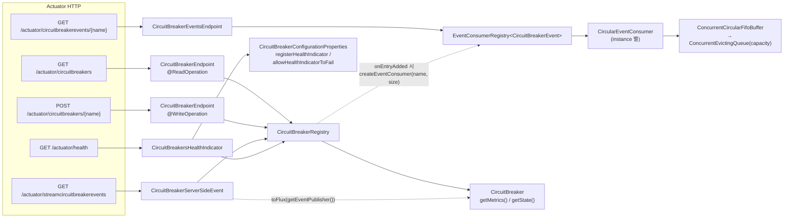

# Actuator 엔드포인트와 HealthIndicator

Resilience4j 가 Spring Boot Actuator 에 심어두는 엔드포인트의 실제 경로·메서드·응답 구조를 소스에서 확인하고, HealthIndicator 를 운영에 그대로 켜면 왜 전체 장애로 번지는지를 짚습니다.

## 목차
- [1. 핵심 개념 (What)](#1-핵심-개념-what)
- [2. 왜 알아야 하는가 (Why)](#2-왜-알아야-하는가-why)
- [3. 내부 구현 분석 (How)](#3-내부-구현-분석-how)
- [4. 실전 예제](#4-실전-예제)
- [5. 정리](#5-정리)

---

## 1. 핵심 개념 (What)

Resilience4j 의 관측 표면(observability surface)은 세 갈래입니다.

1. **상태 조회 엔드포인트** — Registry 를 직접 읽어 현재 스냅샷을 돌려줍니다. `CircuitBreakerEndpoint`, `RetryEndpoint`, `RateLimiterEndpoint`, `BulkheadEndpoint`, `TimeLimiterEndpoint`, `TimerEndpoint`.
2. **이벤트 조회 엔드포인트** — `EventConsumerRegistry` 에 쌓인 **최근 N건**의 링버퍼를 읽습니다. `CircuitBreakerEventsEndpoint` 등 `*EventsEndpoint`.
3. **HealthIndicator** — 서킷/레이트리미터 상태를 Spring Boot health 로 환산합니다. `CircuitBreakersHealthIndicator`, `RateLimitersHealthIndicator`.

여기에 SSE 스트림 두 개(`CircuitBreakerServerSideEvent`, `CircuitBreakerHystrixServerSideEvent`)가 더 붙습니다.

중요한 것 하나. `CircuitBreakerEndpoint` 에는 `@WriteOperation` 이 있습니다. 즉 **HTTP POST 로 서킷 상태를 바꿀 수 있습니다.** 읽기 전용이라고 생각하고 Actuator 를 열어두면 외부에서 서킷을 강제로 열 수 있습니다.

### 실제 엔드포인트 표

`@Endpoint(id = ...)` 값과 `@Selector` 개수에서 그대로 뽑은 것입니다. 추측이 아닙니다.

| 엔드포인트 id | 메서드 | 경로 | 응답 타입 |
|---|---|---|---|
| `circuitbreakers` | GET | `/actuator/circuitbreakers` | `CircuitBreakerEndpointResponse` |
| `circuitbreakers` | **POST** | `/actuator/circuitbreakers/{name}` | `CircuitBreakerUpdateStateResponse` |
| `circuitbreakerevents` | GET | `/actuator/circuitbreakerevents` | `CircuitBreakerEventsEndpointResponse` |
| `circuitbreakerevents` | GET | `/actuator/circuitbreakerevents/{name}` | 동일 |
| `circuitbreakerevents` | GET | `/actuator/circuitbreakerevents/{name}/{eventType}` | 동일 |
| `streamcircuitbreakerevents` | GET (SSE) | `/actuator/streamcircuitbreakerevents[/{name}[/{eventType}]]` | `Flux<ServerSentEvent<String>>` |
| `hystrixstreamcircuitbreakerevents` | GET (SSE) | `/actuator/hystrixstreamcircuitbreakerevents[/{name}[/{eventType}]]` | 동일 |
| `retries` | GET | `/actuator/retries` | `RetryEndpointResponse` (이름 목록) |
| `retryevents` | GET | `/actuator/retryevents[/{name}[/{eventType}]]` | `RetryEventsEndpointResponse` |
| `ratelimiters` | GET | `/actuator/ratelimiters` | `RateLimiterEndpointResponse` |
| `ratelimiterevents` | GET | `/actuator/ratelimiterevents[/{name}[/{eventType}]]` | `RateLimiterEventsEndpointResponse` |
| `bulkheads` | GET | `/actuator/bulkheads` | `BulkheadEndpointResponse` |
| `bulkheadevents` | GET | `/actuator/bulkheadevents[/{bulkheadName}[/{eventType}]]` | `BulkheadEventsEndpointResponse` |
| `timelimiters` | GET | `/actuator/timelimiters` | `TimeLimiterEndpointResponse` |
| `timelimiterevents` | GET | `/actuator/timelimiterevents[/{name}[/{eventType}]]` | `TimeLimiterEventsEndpointResponse` |
| `timers` | GET | `/actuator/timers` | `TimerEndpointResponse` |
| `timerevents` | GET | `/actuator/timerevents[/{name}[/{eventType}]]` | `TimerEventsEndpointResponse` |

Hystrix 스트림 경로를 `/actuator/hystrix-stream` 으로 기억하고 있다면 고쳐야 합니다. 소스의 id 는 `hystrixstreamcircuitbreakerevents` 입니다.

`/actuator/circuitbreakers` 만 상세 지표를 담은 Map 을 돌려주고(`CircuitBreakerDetails`), **retries · ratelimiters · bulkheads · timelimiters · timers 는 이름 목록(List&lt;String&gt;)만** 돌려줍니다. 상세 수치는 Micrometer 로 보라는 설계입니다.

---

## 2. 왜 알아야 하는가 (Why)

### 운영 중 서킷 상태를 눈으로 확인할 유일한 수단

Prometheus 는 스크랩 주기(보통 15~60초)만큼 늦습니다. 장애 대응 중 "지금 이 순간 backendA 서킷이 열려 있나"를 확인하려면 `/actuator/circuitbreakers` 가 가장 빠릅니다. `bufferedCalls`, `failedCalls`, `notPermittedCalls` 까지 한 번에 보여주므로 "임계에 얼마나 가까운가"도 즉시 판단됩니다.

### 이벤트 엔드포인트는 "직전 100건의 블랙박스"

지표는 집계값이라 "어떤 예외로 열렸는지"를 알려주지 않습니다. `/actuator/circuitbreakerevents/backendA/ERROR` 는 각 실패의 `throwable` 과 `duration` 을 그대로 보여줍니다. 장애 원인 규명에서 Micrometer 로는 대체가 안 되는 정보입니다.

### 상태 수동 변경은 칼이면서 흉기

배포 직후 하류가 아직 안 뜬 상황에서 서킷을 미리 `FORCE_OPEN` 해 트래픽을 막거나, 복구 확인 후 `CLOSE` 로 즉시 되돌리는 건 유용합니다. 그런데 같은 엔드포인트가 인증 없이 열려 있으면 **누구나 POST 한 번으로 서비스 경로를 끊을 수 있습니다.** `management.endpoints.web.exposure.include: "*"` 를 무심코 쓴 프로젝트가 정확히 이 상태입니다.

### HealthIndicator 는 기본값이 꺼져 있다 — 그 이유를 알아야 한다

`CircuitBreakersHealthIndicatorAutoConfiguration` 의 빈 조건은 `@ConditionalOnProperty(prefix = "management.health.circuitbreakers", name = "enabled")` 이고 `additional-spring-configuration-metadata.json` 의 `defaultValue` 는 `false` 입니다. `matchIfMissing` 이 없으므로 **명시적으로 켜지 않으면 빈 자체가 안 만들어집니다.** 이건 실수가 아니라 의도입니다. 3절에서 다룹니다.

---

## 3. 내부 구현 분석 (How)

### 엔드포인트가 데이터를 얻는 두 경로



핵심은 **Registry 경로와 EventConsumer 경로가 완전히 분리되어 있다**는 점입니다. 상태 조회는 Registry 를 직접 읽고, 이벤트 조회는 별도 링버퍼를 읽습니다.

### 이벤트 버퍼가 꽂히는 지점

`CircuitBreakerConfiguration.registerEventConsumer()` (resilience4j-spring6) 가 Registry 이벤트에 구독을 걸어 인스턴스마다 버퍼를 만듭니다.

```java
public void registerEventConsumer(CircuitBreakerRegistry circuitBreakerRegistry,
                                  EventConsumerRegistry<CircuitBreakerEvent> eventConsumerRegistry) {
    circuitBreakerRegistry.getEventPublisher()
        .onEntryAdded(event -> registerEventConsumer(eventConsumerRegistry, event.getAddedEntry()))
        .onEntryReplaced(event -> registerEventConsumer(eventConsumerRegistry, event.getNewEntry()))
        .onEntryRemoved(event -> unregisterEventConsumer(eventConsumerRegistry, event.getRemovedEntry()));
}

private void registerEventConsumer(
    EventConsumerRegistry<CircuitBreakerEvent> eventConsumerRegistry,
    CircuitBreaker circuitBreaker) {
    int eventConsumerBufferSize = circuitBreakerProperties
        .findCircuitBreakerProperties(circuitBreaker.getName())
        .map(InstanceProperties::getEventConsumerBufferSize)
        .orElse(100);
    circuitBreaker.getEventPublisher().onEvent(eventConsumerRegistry
        .createEventConsumer(circuitBreaker.getName(), eventConsumerBufferSize));
}
```

- `onEntryAdded` — 인스턴스가 **동적으로** 생겨도 (처음 `circuitBreaker("foo")` 호출 시점) 버퍼가 자동 등록됩니다.
- `onEntryRemoved` → `removeEventConsumer` — Registry 에서 제거되면 버퍼도 함께 사라집니다. 메모리 누수 방지 지점입니다.
- `.orElse(100)` — `eventConsumerBufferSize` 기본값 **100** 이 여기 하드코딩되어 있습니다. 설정 클래스가 아니라 이 메서드가 진짜 기본값입니다.

버퍼 자체는 `CircularEventConsumer` → `ConcurrentCircularFifoBuffer` → `ConcurrentEvictingQueue` 체인입니다. `ConcurrentEvictingQueue` 는 `StampedLock` 기반 링버퍼로, 쓰기는 write lock, 읽기는 `tryOptimisticRead` 를 최대 5회(`RETRIES = 5`) 스핀한 뒤 read lock 으로 떨어집니다. 이벤트 쓰기가 호출 경로에 있으므로 읽기 쪽을 낙관적으로 처리해 쓰기 지연을 최소화한 설계입니다. **용량을 넘으면 가장 오래된 이벤트가 조용히 밀려 나갑니다.** 그래서 엔드포인트가 "최근 N건"만 보여줍니다.

### 상태 수동 변경 — `UpdateState`

```java
@WriteOperation
public CircuitBreakerUpdateStateResponse updateCircuitBreakerState(@Selector String name, UpdateState updateState) {
    final CircuitBreaker circuitBreaker = circuitBreakerRegistry.circuitBreaker(name);
    final String message = "%s state has been changed successfully";
    switch (updateState) {
        case CLOSE:
            circuitBreaker.transitionToClosedState();
            return createCircuitBreakerUpdateStateResponse(name, circuitBreaker.getState().toString(), String.format(message, name));
        case FORCE_OPEN:
            circuitBreaker.transitionToForcedOpenState();
            return ...;
        case DISABLE:
            circuitBreaker.transitionToDisabledState();
            return ...;
        default:
            return createCircuitBreakerUpdateStateResponse(name, circuitBreaker.getState().toString(),
                "State change value is not supported please use only " + Arrays.toString(UpdateState.values()));
    }
}
```

- `UpdateState` enum 은 `CLOSE, FORCE_OPEN, DISABLE` **세 값뿐**입니다. `OPEN` 은 없습니다 — 자연스러운 OPEN 은 상태 기계가 결정할 일이고, 수동 개방은 자동 복구가 없는 `FORCE_OPEN` 이어야 하기 때문입니다.
- `circuitBreakerRegistry.circuitBreaker(name)` — **존재하지 않는 이름이면 새로 만듭니다.** 오타를 내도 404 가 아니라 200 이 돌아오고 쓸모없는 인스턴스가 Registry 에 남습니다.
- `DISABLE` 은 서킷을 완전히 무력화합니다(모든 호출 통과, 지표 기록 안 함). 되돌리려면 `CLOSE` 를 다시 POST 해야 합니다.

`CircuitBreakerActuatorTest` 가 실제 호출 형태를 보여줍니다.

```java
HttpEntity<String> forceOpenRequest = new HttpEntity<>("{\"updateState\":\"FORCE_OPEN\"}", headers);
restTemplate.postForEntity("/actuator/circuitbreakers/backendA", forceOpenRequest,
    CircuitBreakerUpdateStateResponse.class);
```

### HealthIndicator 의 상태 매핑 — 함정의 정체

`CircuitBreakersHealthIndicator.mapBackendMonitorState()` 입니다.

```java
private Health mapBackendMonitorState(CircuitBreaker circuitBreaker) {
    switch (circuitBreaker.getState()) {
        case CLOSED:
            return addDetails(Health.up(), circuitBreaker).build();
        case OPEN:
            boolean allowHealthIndicatorToFail = allowHealthIndicatorToFail(circuitBreaker);
            return addDetails(allowHealthIndicatorToFail
                ? Health.down() : Health.status("CIRCUIT_OPEN"), circuitBreaker).build();
        case HALF_OPEN:
            return addDetails(Health.status("CIRCUIT_HALF_OPEN"), circuitBreaker).build();
        default:
            return addDetails(Health.unknown(), circuitBreaker).build();
    }
}
```

줄 단위로 읽어보면,

- `OPEN` 인데 `allowHealthIndicatorToFail` 이 **false(기본값)** 면 `Status.DOWN` 이 아니라 **커스텀 상태 `CIRCUIT_OPEN`** 을 냅니다. Spring Boot 의 기본 `StatusAggregator` 는 알려지지 않은 상태를 `UNKNOWN` 보다 뒤로 두지 않으므로, 전체 health 는 DOWN 으로 떨어지지 않습니다.
- `allowHealthIndicatorToFail: true` 로 바꾸면 `Health.down()` 이 되어 **전체 health 가 DOWN** 입니다.
- `health()` 는 `filter(this::isRegisterHealthIndicator)` 로 **`registerHealthIndicator: true` 인 인스턴스만** 집계합니다. 기본값은 `orElse(false)` — 아무것도 켜지 않으면 details 가 비고 상태는 `statusAggregator` 가 빈 집합에 대해 내는 값이 됩니다.

여기서 운영 사고 시나리오가 나옵니다.

> 결제 게이트웨이가 죽는다 → 모든 인스턴스의 `payment` 서킷이 OPEN → `allowHealthIndicatorToFail: true` 라면 **모든 인스턴스가 동시에 DOWN** → Kubernetes readiness probe 가 전부 실패 → Service 의 엔드포인트가 0개 → 결제와 무관한 상품 조회 API 까지 전부 죽는다.

서킷의 목적은 "하류 장애를 내 서비스의 장애로 만들지 않는 것"인데, HealthIndicator 를 저렇게 켜면 정확히 반대로 **하류 장애를 전사 장애로 증폭**합니다. `allowHealthIndicatorToFail` 의 기본값이 false 인 이유입니다.

### readiness 와 liveness 중 어디에 넣을까

**둘 다 아닙니다.** `liveness` 는 재시작으로 고쳐지는 문제만 담아야 하는데 하류 장애는 재시작으로 안 고쳐집니다(무한 재시작 루프). `readiness` 는 트래픽 수용 가능 여부인데, 결제 서킷이 열려도 상품 조회는 정상이므로 이 인스턴스는 여전히 트래픽을 받아야 합니다. `management.endpoint.health.group.*` 으로 양쪽에서 빼고 사람이 보는 상세 health 에만 남기는 방식만 안전합니다.

### RateLimitersHealthIndicator — 더 미묘함

`mapRateLimiterHealth()` 의 판정 순서입니다. permit 이 남았거나(`availablePermissions > 0`) 대기 스레드가 없으면(`numberOfWaitingThreads == 0`) UP. 둘 다 아니고 구현체가 `AtomicRateLimiter` 이며 `getDetailedMetrics().getNanosToWait()` 가 설정 timeout 을 넘었을 때만 `RATE_LIMITED`(또는 `allowHealthIndicatorToFail: true` 면 `DOWN`). 그 외는 `UNKNOWN` 입니다. **레이트리미터 포화는 정상 동작**이므로 이것을 DOWN 으로 올리는 건 거의 항상 잘못된 선택입니다.

### SSE 스트림

`CircuitBreakerServerSideEvent.publishEvents()` 는 `onBackpressureDrop()` + `delayElements(Duration.ofMillis(100))` 입니다. 즉 **초당 최대 10건**으로 throttle 하고 넘치면 버립니다. 그리고 `Flux.interval(Duration.ofSeconds(1))` 로 `ping` 이벤트를 섞어 커넥션을 살려둡니다. 장애 중 이벤트가 폭주할 때 스트림 자체가 서버를 괴롭히지 않게 만든 장치인데, 바꿔 말하면 **SSE 스트림은 전수 관측용이 아닙니다.** 감시 눈요기용이고, 집계는 Micrometer 가 합니다.

Hystrix 쪽(`CircuitBreakerHystrixServerSideEvent`)은 같은 구조에 DTO 만 `CircuitBreakerHystrixStreamEventsDTO` 로 바꿔 Hystrix Dashboard 가 읽을 수 있는 형태로 직렬화합니다. 레거시 대시보드를 그대로 쓰고 있다면 이 경로를 가리키면 되지만, 새로 만드는 시스템이라면 쓸 이유가 없습니다.

---

## 4. 실전 예제

### Actuator 를 최소 노출로 묶는 설정

```yaml
management:
  server:
    port: 9090                      # 서비스 트래픽과 분리. LB 에 이 포트를 노출하지 않는다
    address: 127.0.0.1              # 사이드카/노드 로컬에서만 접근 (환경에 맞게 조정)
  endpoints:
    web:
      exposure:
        include: health,info,prometheus,circuitbreakers,circuitbreakerevents
        exclude: "*"                # 화이트리스트 외 전부 차단
      base-path: /internal
  endpoint:
    health:
      show-details: when-authorized
      group:
        liveness:
          include: livenessState    # 서킷 상태를 절대 넣지 않는다
        readiness:
          include: readinessState,db
  health:
    circuitbreakers:
      enabled: false                # 기본값이지만 명시해 의도를 남긴다
    ratelimiters:
      enabled: false

resilience4j:
  circuitbreaker:
    configs:
      default:
        registerHealthIndicator: false
        allowHealthIndicatorToFail: false
        eventConsumerBufferSize: 100
    instances:
      payment:
        baseConfig: default
        eventConsumerBufferSize: 300   # 장애 분석이 중요한 경로는 버퍼를 키운다
```

`@WriteOperation` 을 가진 `circuitbreakers` 를 노출한다면 **쓰기를 반드시 막아야** 합니다. Spring Security 로:

```java
@Configuration
@EnableWebSecurity
class ActuatorSecurityConfig {

    @Bean
    @Order(0)
    SecurityFilterChain actuatorChain(HttpSecurity http) throws Exception {
        http.securityMatcher(EndpointRequest.toAnyEndpoint())
            .authorizeHttpRequests(auth -> auth
                // 상태 변경은 운영자 권한만
                .requestMatchers(HttpMethod.POST, "/internal/circuitbreakers/**").hasRole("SRE")
                .requestMatchers(EndpointRequest.to(HealthEndpoint.class, InfoEndpoint.class)).permitAll()
                .anyRequest().hasRole("SRE"))
            .csrf(csrf -> csrf.disable())      // 내부 포트 전용, 토큰 인증 가정
            .httpBasic(Customizer.withDefaults());
        return http.build();
    }
}
```

`POST` 를 아예 쓸 생각이 없다면 더 단순하게 — `include` 목록에서 `circuitbreakers` 를 빼고 `circuitbreakerevents` 만 남기면 됩니다. 이벤트 엔드포인트는 `@ReadOperation` 뿐입니다.

### HealthIndicator 를 끄고 지표 알럿으로 가는 쪽

health 를 통한 "자동 격리"를 포기하는 대신, 사람과 알럿으로 판단합니다.

```yaml
management:
  health:
    circuitbreakers:
      enabled: false
  metrics:
    distribution:
      percentiles-histogram:
        resilience4j.circuitbreaker.calls: true
  prometheus:
    metrics:
      export:
        enabled: true
```

```promql
# 서킷이 OPEN/FORCED_OPEN 으로 들어간 인스턴스가 하나라도 있으면 경고
max by (name) (resilience4j_circuitbreaker_state{state=~"open|forced_open"}) == 1

# 차단된 호출이 실제로 발생하고 있는가 (사용자 영향 확인)
sum by (name) (rate(resilience4j_circuitbreaker_not_permitted_calls_total[1m])) > 0
```

지표 기반 알럿의 구체적 설계는 [06-micrometer-metrics](./06-micrometer-metrics.md) 에서 다룹니다.

### 운영 중 서킷 상태를 조회하는 스크립트

```bash
#!/usr/bin/env bash
# cb-status.sh — 서킷 상태와 임계 근접도를 한 줄로 요약
set -euo pipefail

BASE="${ACTUATOR_BASE:-http://127.0.0.1:9090/internal}"
AUTH="${ACTUATOR_AUTH:-}"          # 예: -u sre:$ACTUATOR_PASSWORD

curl -sf ${AUTH} "${BASE}/circuitbreakers" \
  | jq -r '
      .circuitBreakers
      | to_entries
      | map("\(.key)\t\(.value.state)\tfail=\(.value.failureRate)/\(.value.failureRateThreshold)\tslow=\(.value.slowCallRate)/\(.value.slowCallRateThreshold)\tbuf=\(.value.bufferedCalls)\tblocked=\(.value.notPermittedCalls)")
      | .[]' \
  | column -t

echo
echo "--- 최근 실패 이벤트 (payment) ---"
curl -sf ${AUTH} "${BASE}/circuitbreakerevents/payment/ERROR" \
  | jq -r '.circuitBreakerEvents | sort_by(.creationTime) | reverse | .[:5]
           | map("\(.creationTime)  \(.errorMessage // "-")  \(.durationInMs)ms") | .[]'
```

`CircuitBreakerDetails` 의 필드명(`failureRate`, `failureRateThreshold`, `slowCallRate`, `slowCallRateThreshold`, `bufferedCalls`, `slowCalls`, `slowFailedCalls`, `failedCalls`, `notPermittedCalls`, `state`)과 `CircuitBreakerEventDTO` 가 내려주는 키에 맞춘 jq 입니다. 비율 필드는 `metrics.getFailureRate() + "%"` 로 만들어지므로 **문자열에 `%` 가 붙어 있습니다.** 수치 비교를 하려면 `sub("%";"")|tonumber` 가 필요합니다.

상태를 바꿔야 할 때 (사람이 판단한 뒤에만):

```bash
# 하류 점검 창구 동안 강제 개방
curl -sf -X POST ${AUTH} -H 'Content-Type: application/json' \
  -d '{"updateState":"FORCE_OPEN"}' "${BASE}/circuitbreakers/payment" | jq .

# 복구 확인 후 되돌리기
curl -sf -X POST ${AUTH} -H 'Content-Type: application/json' \
  -d '{"updateState":"CLOSE"}' "${BASE}/circuitbreakers/payment" | jq .
```

이름을 틀리면 새 인스턴스가 조용히 생긴다는 걸 기억하세요. 스크립트에서 이름을 변수로 받지 말고 상수 목록에서 고르게 하는 편이 안전합니다.

---

## 5. 정리

| 항목 | 사실 | 운영 판단 |
|---|---|---|
| 상태 조회 | `/actuator/circuitbreakers` 만 상세 수치, 나머지는 이름 목록 | 상세 수치는 Micrometer 에서 본다 |
| 상태 변경 | `POST /actuator/circuitbreakers/{name}` + `{"updateState":"CLOSE\|FORCE_OPEN\|DISABLE"}` | 인증 필수. 없는 이름이면 새로 생성되는 함정 |
| 이벤트 버퍼 | `CircularEventConsumer` → `ConcurrentEvictingQueue(capacity)`, 기본 100 | `eventConsumerBufferSize` 로 조정, 핵심 경로만 키운다 |
| 버퍼 생명주기 | Registry `onEntryAdded/Replaced/Removed` 에 연동 | 동적 인스턴스도 자동 등록·해제 |
| SSE | `onBackpressureDrop` + `delayElements(100ms)` + 1초 ping | 전수 관측용 아님. 눈으로 보는 용도 |
| Hystrix 스트림 | id 는 `hystrixstreamcircuitbreakerevents` | 레거시 대시보드 호환 목적만 |
| CB HealthIndicator | 기본 OFF. OPEN → `CIRCUIT_OPEN`(기본) 또는 `DOWN`(`allowHealthIndicatorToFail: true`) | **readiness/liveness 에 넣지 않는다** |
| 집계 대상 | `registerHealthIndicator: true` 인 인스턴스만 | 기본 false — 켠 기억이 없으면 안 켜져 있다 |
| RateLimiter Health | 포화 시 `RATE_LIMITED`(기본) 또는 `DOWN` | 포화는 정상 동작. DOWN 으로 올리지 않는다 |
| 왜 위험한가 | 서킷 OPEN 원인은 하류 → 전 인스턴스 동시 DOWN → 전체 장애 | 격리는 서킷이 하고, 판단은 지표 알럿이 한다 |

한 줄로: **Actuator 는 장애 때 사람이 들여다보는 창구로 쓰고, 자동 판단은 health 가 아니라 지표 알럿에 맡긴다.**

---

## 관련 문서
- 선행: [설정 계층 — default, configs, instances](./04-config-hierarchy.md)
- 후행: [Micrometer 지표 — 무엇을 보고 알럿을 걸까](./06-micrometer-metrics.md)
- 참고: [CircuitBreaker 상태 기계](../main/06-circuitbreaker-state-machine.md) · [EventProcessor](../main/03-event-processor.md)

---
*Resilience4j v2.4.0 기준 · 소스 커밋 7e3ab525*
