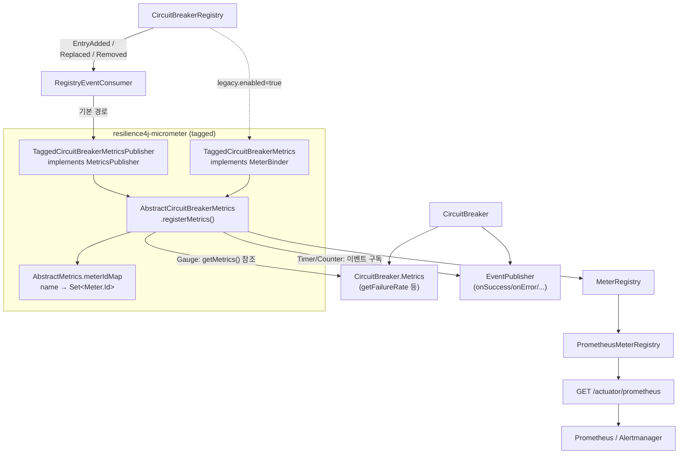

# Micrometer 지표 — 무엇을 보고 알럿을 걸까

`resilience4j-micrometer` 가 등록하는 지표 이름·타입·태그를 소스 상수에서 그대로 꺼내 정리하고, 그중 **실제로 알럿을 걸어야 하는 5가지**와 임계값 근거를 PromQL 로 제시합니다.

## 목차
- [1. 핵심 개념 (What)](#1-핵심-개념-what)
- [2. 왜 알아야 하는가 (Why)](#2-왜-알아야-하는가-why)
- [3. 내부 구현 분석 (How)](#3-내부-구현-분석-how)
- [4. 실전 예제](#4-실전-예제)
- [5. 정리](#5-정리)

---

## 1. 핵심 개념 (What)

Resilience4j 는 **지표를 직접 들고 있지 않습니다.** 각 컴포넌트는 `getMetrics()` 로 현재 수치를 노출하고 `getEventPublisher()` 로 이벤트를 내보낼 뿐이고, 이것을 Micrometer `MeterRegistry` 에 옮기는 일은 `resilience4j-micrometer` 의 어댑터가 합니다. 어댑터는 두 종류입니다.

| 경로 | 클래스 | 동작 방식 |
|---|---|---|
| **MetricsPublisher** (기본) | `Tagged*MetricsPublisher` | `RegistryEventConsumer` 로서 Registry 에 등록. 인스턴스 생성/교체/삭제 이벤트에 반응해 미터를 등록·제거 |
| **MeterBinder** (레거시) | `Tagged*Metrics` | `bindTo(registry)` 시점에 기존 인스턴스를 순회하고, 추가로 Registry 이벤트도 구독 |

둘 다 같은 `Abstract*Metrics` 를 상속하므로 **등록되는 지표는 완전히 동일**합니다. 차이는 "누가 언제 등록을 트리거하는가"뿐입니다.

### 지표 전체 표 (소스 상수값 그대로)

`*MetricNames` 의 `DEFAULT_*` 상수와 `Abstract*Metrics.registerMetrics()` 빌더 호출을 대조한 결과입니다.

#### CircuitBreaker — `CircuitBreakerMetricNames`

| 지표 이름 | 타입 | 태그 | 값 |
|---|---|---|---|
| `resilience4j.circuitbreaker.state` | Gauge | `name`, `state`={closed,open,half_open,disabled,forced_open,metrics_only} | 해당 state 면 1, 아니면 0 |
| `resilience4j.circuitbreaker.calls` | **Timer** | `name`, `kind`={successful,failed,ignored} | 호출 duration 기록 |
| `resilience4j.circuitbreaker.not.permitted.calls` | Counter | `name`, `kind`=`not_permitted` | 차단된 호출 수 |
| `resilience4j.circuitbreaker.buffered.calls` | Gauge | `name`, `kind`={successful,failed} | 슬라이딩 윈도 내 버퍼 호출 수 |
| `resilience4j.circuitbreaker.slow.calls` | Gauge | `name`, `kind`={successful,failed} | 느린 호출 수 |
| `resilience4j.circuitbreaker.failure.rate` | Gauge | `name` | 실패율(%) |
| `resilience4j.circuitbreaker.slow.call.rate` | Gauge | `name` | 느린 호출 비율(%) |

`state` 게이지는 `CircuitBreaker.State.values()` 를 순회해 **상태마다 시계열 하나**를 만듭니다. 태그 키가 `kind` 가 아니라 `state` 인 것에 주의 — `AbstractCircuitBreakerMetrics.KIND_STATE = "state"` 입니다.

#### Retry · RateLimiter · Bulkhead · TimeLimiter

| 지표 이름 | 타입 | 태그 | 출처 상수 클래스 |
|---|---|---|---|
| `resilience4j.retry.calls` | **FunctionCounter** | `name`, `kind`={successful_without_retry, successful_with_retry, failed_without_retry, failed_with_retry} | `RetryMetricNames` |
| `resilience4j.ratelimiter.available.permissions` | Gauge | `name` | `RateLimiterMetricNames` |
| `resilience4j.ratelimiter.waiting_threads` | Gauge | `name` | 동일 — 유일하게 점 대신 밑줄 |
| `resilience4j.bulkhead.available.concurrent.calls` | Gauge | `name` | `BulkheadMetricNames` |
| `resilience4j.bulkhead.max.allowed.concurrent.calls` | Gauge | `name` | 동일 |
| `resilience4j.timelimiter.calls` | Counter | `name`, `kind`={successful,failed,timeout} | `TimeLimiterMetricNames` |

#### ThreadPoolBulkhead — `ThreadPoolBulkheadMetricNames`

접두사가 `resilience4j.bulkhead` 로 **SemaphoreBulkhead 와 같습니다.** 이름만으로는 구분이 안 됩니다. 전부 Gauge, 태그는 `name` 하나입니다.

| 지표 이름 |
|---|
| `resilience4j.bulkhead.queue.depth` / `...queue.capacity` |
| `resilience4j.bulkhead.thread.pool.size` / `...max.thread.pool.size` / `...core.thread.pool.size` |
| `resilience4j.bulkhead.active.thread.count` / `...available.thread.count` |

#### Timer / Thread

| 지표 이름 | 타입 | 태그 |
|---|---|---|
| `resilience4j.timer.calls` | Timer | `name`, `kind`={successful,failed}, `failure` — `TimerConfig` 기본값 ([07-timer-module](./07-timer-module.md)) |
| `resilience4j.thread.virtual_thread_enabled` | Gauge | `ThreadMetrics` — 가상 스레드 사용 여부 1/0 |

`TagNames` 에 선언된 상수는 `NAME = "name"`, `KIND = "kind"` **딱 두 개**입니다. `state`, `failure` 같은 키는 각 어댑터 내부의 private 상수에서 옵니다.

---

## 2. 왜 알아야 하는가 (Why)

### Prometheus 에서는 이름이 변형된다

Micrometer 의 Prometheus 레지스트리는 점을 밑줄로 바꾸고 타입별 접미사를 붙입니다.

| 원래 이름 (타입) | Prometheus 시계열 |
|---|---|
| `resilience4j.circuitbreaker.calls` (Timer) | `resilience4j_circuitbreaker_calls_seconds_count` / `_seconds_sum` / `_seconds_max` |
| `resilience4j.circuitbreaker.not.permitted.calls` (Counter) | `resilience4j_circuitbreaker_not_permitted_calls_total` |
| `resilience4j.retry.calls` (FunctionCounter) | `resilience4j_retry_calls_total` |
| `resilience4j.timelimiter.calls` (Counter) | `resilience4j_timelimiter_calls_total` |
| `resilience4j.circuitbreaker.state` (Gauge) | `resilience4j_circuitbreaker_state` |

Timer 에 `_total` 을 붙이거나 Counter 에 `_count` 를 쓰면 쿼리가 조용히 빈 결과를 냅니다. **알럿이 영원히 울리지 않는 가장 흔한 원인**입니다.

### 어떤 것은 알럿이 되고 어떤 것은 안 된다

`available.permissions` 가 0 인 건 레이트리미터가 **제 일을 하고 있다**는 뜻입니다. 알럿으로 걸면 밤에 깨어나 "정상입니다"를 확인하게 됩니다. 반대로 `state{state="open"}` 이 1이 되는 순간은 사용자가 이미 에러를 받고 있다는 뜻입니다. 경계는 하나 — **사용자 영향이 이미 발생했으면 page, 임계에 다가가는 중이면 ticket.**

### 태그 카디널리티는 실제로 서비스를 죽인다

`name` 태그는 인스턴스 이름입니다. 인스턴스를 테넌트/사용자 단위로 만들면 시계열이 그만큼 늘어납니다. CircuitBreaker 하나당 시계열 수를 세어 보면:

- `state` 6개 (State enum 전체) + `calls` 3종 × (count/sum/max) 9개 + `not.permitted.calls` 1개 + `buffered.calls` 2개 + `slow.calls` 2개 + `failure.rate` 1개 + `slow.call.rate` 1개 = **약 22개**

여기에 커스텀 태그와 히스토그램 버킷이 곱해집니다. 테넌트 1,000개면 인스턴스 하나에서 **2만 개 이상**, 이게 파드 수만큼 곱해집니다. Prometheus 가 먼저 쓰러지거나 그 전에 `MeterRegistry` 의 맵이 힙을 먹습니다.

---

## 3. 내부 구현 분석 (How)

### 컴포넌트에서 Prometheus 까지



### 어느 경로가 쓰이는가 — `*MetricsAutoConfiguration`

`CircuitBreakerMetricsAutoConfiguration` 전문입니다.

```java
@ConditionalOnProperty(value = "resilience4j.circuitbreaker.metrics.enabled", matchIfMissing = true)
public class CircuitBreakerMetricsAutoConfiguration {

    @Bean
    @ConditionalOnProperty(value = "...metrics.legacy.enabled", havingValue = "true")
    @ConditionalOnMissingBean
    public TaggedCircuitBreakerMetrics registerCircuitBreakerMetrics(CircuitBreakerRegistry r) {
        return TaggedCircuitBreakerMetrics.ofCircuitBreakerRegistry(r);
    }

    @Bean
    @ConditionalOnBean(MeterRegistry.class)
    @ConditionalOnProperty(value = "...metrics.legacy.enabled", havingValue = "false", matchIfMissing = true)
    @ConditionalOnMissingBean
    public TaggedCircuitBreakerMetricsPublisher taggedCircuitBreakerMetricsPublisher(MeterRegistry mr) {
        return new TaggedCircuitBreakerMetricsPublisher(mr);
    }
}
```

- `resilience4j.circuitbreaker.metrics.enabled` 는 `matchIfMissing = true` — **기본 켜짐**.
- `legacy.enabled` 는 기본 `false` 이므로 **`Publisher` 가 기본 경로**입니다. `true` 로 바꾸면 `MeterBinder` 쪽으로 갑니다. 둘은 상호 배타적입니다.
- `MeterBinder` 쪽에는 `@ConditionalOnBean(MeterRegistry.class)` 가 없습니다. `MeterRegistry` 빈이 없어도 생성되는데, Spring Boot 가 `MeterBinder` 를 바인딩할 때가 되어야 실제 등록이 일어나므로 문제는 없습니다.

Publisher 빈이 Registry 에 닿는 경로는 **타입 추론**입니다. `MetricsPublisher<E> extends RegistryEventConsumer<E>` 이고, `AbstractCircuitBreakerConfigurationOnMissingBean` 이

```java
@Bean
@Primary
public RegistryEventConsumer<CircuitBreaker> circuitBreakerRegistryEventConsumer(
    Optional<List<RegistryEventConsumer<CircuitBreaker>>> optionalRegistryEventConsumers) {
    return circuitBreakerConfiguration.circuitBreakerRegistryEventConsumer(optionalRegistryEventConsumers);
}
```

로 모든 `RegistryEventConsumer<CircuitBreaker>` 빈을 `CompositeRegistryEventConsumer` 로 모읍니다. `TaggedCircuitBreakerMetricsPublisher` 가 자동으로 여기 들어갑니다. **별도 배선 코드 없이 동작하는 이유**가 이 타입 관계입니다.

수명주기는 `MetricsPublisher` 의 default 메서드가 처리합니다 — `onEntryAddedEvent` → `publishMetrics`, `onEntryRemovedEvent` → `removeMetrics`, `onEntryReplacedEvent` → `removeMetrics(old)` 후 `publishMetrics(new)`.

### 동적 인스턴스의 등록·제거 시점

`AbstractMetrics` 가 이름별 미터 ID 집합을 들고 있습니다.

```java
protected ConcurrentMap<String, Set<Meter.Id>> meterIdMap;   // name → 등록한 미터 ID

void removeMetrics(MeterRegistry registry, String name) {
    Set<Meter.Id> ids = meterIdMap.get(name);
    if (ids != null) ids.forEach(registry::remove);
    meterIdMap.remove(name);
}
```

그리고 `registerMetrics()` 의 첫 줄이 `removeMetrics(meterRegistry, circuitBreaker.getName())` 입니다. **같은 이름으로 다시 등록하면 이전 미터를 먼저 지웁니다.** 설정 교체 시 고아 미터가 남지 않도록 한 장치입니다.

정리는 **Registry 에서 엔트리가 빠질 때만** 일어납니다. `circuitBreaker("tenant-42")` 로 만든 인스턴스는 명시적으로 Registry 에서 제거하지 않으면 영원히 남고, 미터도 함께 남습니다. 동적 이름을 쓰면서 제거를 안 하는 것이 카디널리티 누적의 진짜 원인입니다.

주의할 점 하나. Gauge 는 `CircuitBreaker` 객체를 강하게 참조하는 lambda(`cb -> cb.getMetrics().getFailureRate()`)로 등록됩니다. `registry.remove(id)` 로 미터를 지워야 이 참조가 끊어집니다.

### 태그 카디널리티 — 실무 가이드

1. **`name` 은 "의존성 단위"로 둔다.** `paymentGateway`, `userService`. 테넌트·사용자·요청 ID 를 넣지 않습니다.
2. 테넌트별 격리가 필요하면 인스턴스 이름이 아니라 **커스텀 태그**로 분리하고 값 집합을 유한하게(상위 N개 + `other`) 묶습니다. `Abstract*Metrics.mapToTagsList()` 가 `getTags()` 를 그대로 올리므로 여기도 같은 규율이 필요합니다.
3. 애플리케이션을 못 고치는 상황이면 Prometheus `metric_relabel_configs` 로 drop — 최후 수단입니다.
4. `percentiles-histogram` 은 **필요한 지표에만.** 전역으로 켜면 Timer 하나가 수십 개 버킷 시계열이 됩니다.

### Dropwizard 모듈과의 차이

별도 모듈 `resilience4j-metrics` 가 Dropwizard 용 어댑터(`CircuitBreakerMetrics`, `RetryMetrics`, `BulkheadMetrics`, `TimeLimiterMetrics` 등 + `publisher` 패키지)를 제공합니다. 구조는 같지만 **태그(dimension) 개념이 없어** 이름에 인스턴스명을 밀어 넣습니다. Prometheus 환경에서는 쓸 이유가 없습니다.

---

## 4. 실전 예제

### 지표 노출 설정

```yaml
management:
  server:
    port: 9090
  endpoints:
    web:
      exposure:
        include: health,prometheus
  prometheus:
    metrics:
      export:
        enabled: true
  metrics:
    tags:
      application: ${spring.application.name}   # 대시보드 변수용
    distribution:
      percentiles-histogram:
        resilience4j.circuitbreaker.calls: true # 필요한 것만, 전역 all 금지
      slo:
        resilience4j.circuitbreaker.calls: 100ms,300ms,1s,3s

resilience4j:
  circuitbreaker:
    metrics:
      enabled: true             # 기본값 true (matchIfMissing)
      legacy:
        enabled: false          # Publisher 경로 (기본값)
```

`retry`, `ratelimiter`, `bulkhead`, `thread-pool-bulkhead`, `timelimiter` 도 동일한 `metrics.enabled` / `metrics.legacy.enabled` 쌍을 가지며 기본값이 같습니다. 끄고 싶은 것만 `false` 로 명시하면 됩니다.

지표 이름을 바꿔야 한다면(기존 대시보드 호환 등) `CircuitBreakerMetricNames.custom().callsMetricName(...).stateMetricName(...).build()` 로 조립해 `new TaggedCircuitBreakerMetricsPublisher(names, registry)` 빈을 직접 등록하면 됩니다. 자동 설정에 `@ConditionalOnMissingBean` 이 붙어 있어 내 빈이 이깁니다.

### 핵심 알럿 5종

```yaml
groups:
  - name: resilience4j
    rules:

      # 1) 서킷 개방 — 사용자 영향이 이미 발생. page
      - alert: CircuitBreakerOpen
        expr: |
          max by (application, name) (
            resilience4j_circuitbreaker_state{state=~"open|forced_open"}
          ) == 1
        for: 1m
        labels: { severity: critical }
        annotations:
          summary: "{{ $labels.name }} 서킷 개방 (app={{ $labels.application }})"
          runbook: "차단량은 resilience4j_circuitbreaker_not_permitted_calls_total 로 확인"

      # 2) 실패율이 임계의 80% 도달 — 아직 안 열렸지만 곧. ticket
      - alert: CircuitBreakerFailureRateApproaching
        expr: |
          resilience4j_circuitbreaker_failure_rate >= 40
          and resilience4j_circuitbreaker_failure_rate < 50
          and on (application, name) (
            sum by (application, name) (resilience4j_circuitbreaker_buffered_calls) >= 20
          )
        for: 5m
        labels: { severity: warning }

      # 3) slow call 비율 상승 — 타임아웃 임계가 현실과 안 맞거나 하류가 느려짐
      - alert: CircuitBreakerSlowCallRateHigh
        expr: |
          resilience4j_circuitbreaker_slow_call_rate >= 50
          and on (application, name) (
            sum by (application, name) (resilience4j_circuitbreaker_buffered_calls) >= 20
          )
        for: 10m
        labels: { severity: warning }

      # 4) 재시도 급증 — 재시도로 '가려진' 하류 열화
      - alert: RetryRateSurge
        expr: |
          (
            sum by (application, name) (
              rate(resilience4j_retry_calls_total{kind=~"successful_with_retry|failed_with_retry"}[5m])
            )
            /
            clamp_min(sum by (application, name) (rate(resilience4j_retry_calls_total[5m])), 0.001)
          ) > 0.2
        for: 10m
        labels: { severity: warning }

      # 5) Bulkhead 포화 — 동시성 한계에 붙어 있음
      - alert: BulkheadSaturated
        expr: |
          (
            1 - (
              resilience4j_bulkhead_available_concurrent_calls
              / clamp_min(resilience4j_bulkhead_max_allowed_concurrent_calls, 1)
            )
          ) >= 0.9
        for: 5m
        labels: { severity: warning }
```

**임계값 근거:**

1. **CircuitBreakerOpen / `== 1`, `for: 1m`** — `state` 는 0/1 게이지입니다. `for: 1m` 은 HALF_OPEN 왕복으로 인한 깜빡임을 걸러냅니다. 1분 이상 열려 있으면 자가 복구에 실패한 것이므로 사람이 봐야 합니다.
2. **실패율 40% (기본 `failureRateThreshold` 50% 의 80%)** — 열리기 전에 개입할 창입니다. `buffered_calls >= 20` 조건이 핵심 — 3건 중 2건 실패면 실패율 66% 지만 `minimumNumberOfCalls` 미달이라 서킷은 안 열립니다. 표본이 적을 때의 거짓 알럿을 이 조건이 막습니다.
3. **slowCallRate 50% (기본 `slowCallRateThreshold` 100%)** — 느린 호출은 즉각 장애가 아니라 **임계 설정이 현실과 어긋났다는 신호**입니다. 절반이 느리면 `slowCallDurationThreshold` 를 재산정할 때입니다(역산 방법은 [07-timer-module](./07-timer-module.md)).
4. **재시도 비율 20%** — 재시도가 섞인 호출이 전체의 20% 를 넘으면 하류가 이미 불안정한데 재시도가 그것을 가리고 있는 상태입니다. 동시에 하류 부하를 증폭시키므로(retry storm) 방치하면 서킷 개방으로 이어집니다. `clamp_min` 은 트래픽 없는 시간대의 0 나누기를 막습니다.
5. **Bulkhead 사용률 90%** — `available / max` 로 여유를 보고 1에서 뺍니다. 90% 에서 5분 머문다면 `maxConcurrentCalls` 가 부족하거나 하류 응답이 느려져 permit 이 반납되지 않고 있습니다. 100% 를 기준으로 삼으면 이미 거절이 시작된 뒤에 알게 됩니다.

### 알럿을 걸지 말아야 할 것

```promql
# 이렇게 걸지 마세요
resilience4j_ratelimiter_available_permissions == 0
```

permit 고갈은 레이트리미터가 설계대로 동작하는 상태입니다. 대신 **대기가 쌓이는지**를 보세요.

```promql
# rate limiter 때문에 스레드가 실제로 막혀 있다
resilience4j_ratelimiter_waiting_threads > 0
```

그리고 거절 자체는 `CallNotPermittedException`/`RequestNotPermitted` 가 애플리케이션 에러율에 반영되므로, 서비스 SLO 알럿이 잡아 줍니다.

### Grafana 대시보드 — 레포의 `grafana_dashboard.json`

레포 루트에 공식 대시보드(title: `Resilience4j`)가 있습니다. 구성은 4개 row 입니다.

| Row | 패널 | 쿼리 요지 |
|---|---|---|
| Summary | closed / open / half_open 개수 (stat) | `sum(resilience4j_circuitbreaker_state{state="closed"})`, `{state=~"open\|forced_open"}`, `{state="half_open"}` |
| Summary | CircuitBreaker States (timeseries) | `resilience4j_circuitbreaker_state{instance=~"$instance"}` |
| CircuitBreaker | Failure Rate / Call rate / Buffered calls | `..._failure_rate`, `rate(..._calls_seconds_count[1m])`, `..._buffered_calls` |
| CircuitBreaker | Average call durations | `increase(..._calls_seconds_sum[1m]) / increase(..._calls_seconds_count[1m])` |
| Retry | Rate retryable calls | `rate(resilience4j_retry_calls_total{...,name=~"$retry_name"}[1m])` |
| Bulkhead | Bulkhead | `..._available_concurrent_calls`, `..._max_allowed_concurrent_calls` |

그대로 임포트하기 전에 두 가지를 확인하세요.

- **`resilience4j_circuitbreaker_max_buffered_calls` 패널은 비어 있습니다.** Buffered calls 패널의 두 번째 쿼리가 이 이름을 쓰는데, v2.4.0 의 `AbstractCircuitBreakerMetrics` 에는 이 미터를 등록하는 코드가 없습니다. 대시보드가 과거 버전 기준입니다.
- **변수 라벨이 혼용돼 있습니다.** CircuitBreaker 패널은 `instance=~"$instance"`, Retry/Bulkhead 패널은 `application=~"$application"` 을 씁니다. `management.metrics.tags.application` 을 설정해 두지 않으면 Retry/Bulkhead 패널이 비어 보입니다(위 `application.yml` 에 넣어 둔 이유).

실무에서는 여기에 두 패널을 더 붙이는 걸 권합니다. `rate(resilience4j_circuitbreaker_not_permitted_calls_total[1m])` (차단량 = 사용자 영향)과 `histogram_quantile(0.99, sum by (le, name) (rate(resilience4j_circuitbreaker_calls_seconds_bucket[5m])))` (p99 — `percentiles-histogram` 을 켠 경우).

---

## 5. 정리

| 질문 | 답 |
|---|---|
| 지표는 누가 등록하나 | 기본은 `Tagged*MetricsPublisher`(= `RegistryEventConsumer`). `*.metrics.legacy.enabled=true` 면 `Tagged*Metrics`(MeterBinder) |
| Publisher 가 어떻게 Registry 에 붙나 | `MetricsPublisher extends RegistryEventConsumer` → `circuitBreakerRegistryEventConsumer` 가 자동 수집 |
| 동적 인스턴스 | `onEntryAdded` 로 즉시 등록. `onEntryRemoved` 로 제거되며 `meterIdMap` 기반으로 미터도 삭제 |
| 재등록 시 중복 | `registerMetrics()` 첫 줄에서 `removeMetrics()` 선행 — 고아 미터 없음 |
| 상태 지표 모양 | `resilience4j.circuitbreaker.state` 가 **State 값마다 0/1 게이지**, 태그 키는 `state` |
| 태그 상수 | `TagNames` 는 `name`, `kind` 둘뿐. `state`/`failure` 는 각 어댑터 private 상수 |
| Prometheus 이름 | Timer → `_seconds_count/_sum/_max`, Counter → `_total`. 혼동하면 알럿이 안 울린다 |
| 카디널리티 | CB 하나당 약 22 시계열. `name` 에 테넌트/사용자를 넣지 않는다 |
| Dropwizard | `resilience4j-metrics` 모듈. 태그 개념 없음 — Prometheus 환경에서는 쓰지 않는다 |
| 알럿 걸 것 | 상태 전이(page) / 실패율 80% 도달 / slow call 비율 / 재시도 비율 / bulkhead 사용률 |
| 알럿 걸지 말 것 | `available.permissions == 0` — 정상 동작. 대신 `waiting_threads` 를 본다 |

핵심은 **표본 조건을 같이 걸라는 것**입니다. 비율 지표는 분모가 작으면 무의미하게 튑니다. `buffered_calls >= minimumNumberOfCalls` 수준의 조건 없이 비율만 보는 알럿은 신뢰를 잃고, 신뢰를 잃은 알럿은 꺼지고, 꺼진 알럿은 없는 알럿입니다.

---

## 관련 문서
- 선행: [Actuator 엔드포인트와 HealthIndicator](./05-actuator-and-health.md)
- 후행: [Timer 모듈 — 데코레이터로 들어온 관측](./07-timer-module.md)
- 참고: [Registry 와 설정](../main/02-registry-and-config.md) · [CircuitBreaker 설정](../main/07-circuitbreaker-config.md) · [프로덕션 설계](./12-production-design.md)

---
*Resilience4j v2.4.0 기준 · 소스 커밋 7e3ab525*
