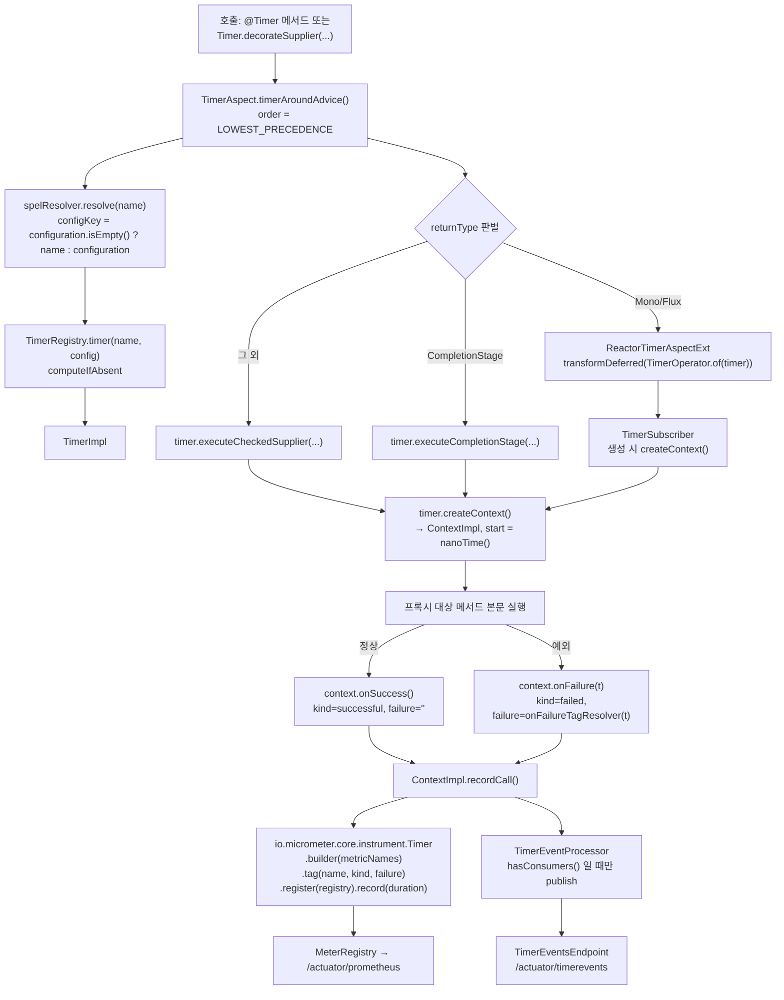

# Timer 모듈 — 데코레이터로 들어온 관측

Resilience4j 의 여섯 번째 컴포넌트는 막는 게 아니라 **재는** 역할입니다. 나머지 다섯과 똑같은 데코레이터·애너테이션 문법으로 메서드 실행 시간을 Micrometer 에 기록합니다.

## 목차
- [1. 핵심 개념 (What)](#1-핵심-개념-what)
- [2. 왜 알아야 하는가 (Why)](#2-왜-알아야-하는가-why)
- [3. 내부 구현 분석 (How)](#3-내부-구현-분석-how)
- [4. 실전 예제](#4-실전-예제)
- [5. 정리](#5-정리)

---

## 1. 핵심 개념 (What)

CircuitBreaker, Retry, RateLimiter, Bulkhead, TimeLimiter 는 모두 "조건에 따라 호출을 막거나 되돌리는" 장치입니다. `Timer` 는 호출을 **통과시키면서 측정만** 합니다. 제어 흐름을 바꾸지 않습니다.

그런데도 같은 모듈 구조를 그대로 따릅니다.

| 구성 요소 | Timer 의 대응물 | 위치 |
|---|---|---|
| 인터페이스 | `Timer` (`decorate*` / `execute*` 정적·기본 메서드) | `resilience4j-micrometer` |
| 설정 | `TimerConfig` + Builder | 동일 |
| 구현체 | `TimerImpl` + 내부 `ContextImpl` | `...micrometer.internal` |
| Registry | `TimerRegistry` / `InMemoryTimerRegistry` (`AbstractRegistry` 상속) | 동일 |
| 이벤트 | `TimerEvent`, `AbstractTimerEvent`, `TimerOnStartEvent`, `TimerOnSuccessEvent`, `TimerOnFailureEvent` | `...micrometer.event` |
| 이벤트 처리 | `TimerEventProcessor` (`EventProcessor` 상속) | `...micrometer.internal` |
| 애너테이션 | `@Timer(name, configuration, fallbackMethod)` | `resilience4j-annotations` |
| 애스펙트 | `TimerAspect` + `TimerAspectExt` (Reactor / RxJava2 / RxJava3) | `resilience4j-spring6` |
| 자동 설정 | `TimerAutoConfiguration`, `TimerProperties`, `AbstractTimerConfigurationOnMissingBean` | `resilience4j-spring-boot3` |
| 엔드포인트 | `TimerEndpoint`(`timers`), `TimerEventsEndpoint`(`timerevents`) | 동일 |
| Reactor / Kotlin | `TimerOperator`·`TimerSubscriber`·`MonoTimer`·`FluxTimer` / `executeSuspendFunction`·`Flow.timer()`·`TimerConfig { }` | `resilience4j-reactor`, `-kotlin` |

### 언제 생겼나

`RELEASENOTES.adoc` 에는 Timer 항목이 없습니다 (릴리즈 노트 자체가 2.3.0 까지만 기록되어 있고 Timer 를 언급하지 않습니다). 추적 가능한 사실은 git 이력입니다.

```
19b509e5  Wed Jul 26 18:36:55 2023 +0200  Micrometer Timer decorator (#1989)
```

이 커밋을 포함하는 첫 태그는 **v2.2.0** 입니다. PR 제목 "Micrometer Timer decorator" 가 의도를 그대로 말해줍니다 — Micrometer 측정을 **Resilience4j 데코레이터 문법 안으로 끌어온 것**입니다.

### `TimerConfig` 의 전 항목

딱 두 개입니다.

| 옵션 | 타입 | 기본값 | 의미 |
|---|---|---|---|
| `metricNames` | `String` | `"resilience4j.timer.calls"` (`DEFAULT_METRIC_NAMES`) | Micrometer 에 등록할 Timer 미터 이름 |
| `onFailureTagResolver` | `Function<Throwable, String>` | `throwable -> throwable.getClass().getSimpleName()` | 실패 시 `failure` 태그 값을 만드는 함수 |

Spring 설정에서는 `onFailureTagResolver` 를 **클래스 이름**으로 줍니다 (`Class<? extends Function<Throwable, String>>`). `CommonTimerConfigurationProperties.buildConfig()` 가 `instantiateFunction()` 으로 인스턴스화합니다. 세 번째 설정 항목인 `eventConsumerBufferSize` 는 `TimerConfig` 가 아니라 `InstanceProperties` 에만 있습니다 — 미터가 아니라 이벤트 엔드포인트용이라서입니다.

---

## 2. 왜 알아야 하는가 (Why)

### `slowCallDurationThreshold` 를 숫자로 정할 근거가 생긴다

CircuitBreaker 의 `slowCallDurationThreshold` 를 "일단 2초"로 넣어 두고 왜 2초인지 설명 못 하는 경우가 많습니다. Timer 는 그 근거를 만들어 줍니다. 호출을 Timer 로 감싸고 p99 를 측정하면, "정상 상태의 p99 가 420ms 니까 임계는 그 2~3배인 1초"라는 식의 역산이 가능합니다. 4절에서 구체적인 루프를 제시합니다.

### CircuitBreaker 의 `calls` Timer 로는 부족한 경우가 있다

`resilience4j.circuitbreaker.calls` 도 Timer 입니다. 그러나 이것은 **서킷이 permission 을 준 호출만** 측정하고, `kind` 가 successful/failed/ignored 로만 나뉩니다. Timer 는 `failure` 태그에 **예외 종류별** 값을 담을 수 있어 "어떤 예외일 때 얼마나 느렸나"를 분리할 수 있습니다. 또 서킷을 아예 안 걸고 측정만 하고 싶은 경로(읽기 전용 조회 등)에서는 Timer 만 쓰면 됩니다.

### 애스펙트 순서상 가장 안쪽이다

`TimerConfigurationProperties` 의 기본 order 가 `Ordered.LOWEST_PRECEDENCE` 입니다. 다른 컴포넌트와 비교하면,

| 애스펙트 | 기본 order | 위치 |
|---|---|---|
| `RetryAspect` | `LOWEST_PRECEDENCE - 5` | 가장 바깥 |
| `CircuitBreakerAspect` | `LOWEST_PRECEDENCE - 4` | |
| `RateLimiterAspect` | `LOWEST_PRECEDENCE - 3` | |
| `TimeLimiterAspect` | `LOWEST_PRECEDENCE - 2` | |
| `BulkheadAspect` | `LOWEST_PRECEDENCE - 1` | |
| **`TimerAspect`** | **`LOWEST_PRECEDENCE`** | **가장 안쪽** |

즉 Timer 는 **실제 메서드 본문만** 측정합니다. 재시도 대기 시간, bulkhead 큐 대기, rate limiter 대기는 포함되지 않습니다. 이것이 좋은 기본값입니다 — "하류가 얼마나 걸리는가"가 임계값 산정의 입력이고, "내 호출이 끝까지 얼마나 걸렸나"는 서비스 SLI 쪽에서 재면 됩니다. 단, `@Timer` 에 재시도 포함 시간을 재려는 의도였다면 `timerAspectOrder` 를 `-6` 으로 낮춰 Retry 바깥으로 빼야 합니다.

---

## 3. 내부 구현 분석 (How)

### 호출이 감싸지고 기록되는 흐름



### `TimerImpl.ContextImpl.recordCall()` — 측정의 전부

```java
@Override
public void onSuccess() {
    recordCall(KIND_SUCCESSFUL, null, duration -> new TimerOnSuccessEvent(name, duration));
}

@Override
public void onFailure(Throwable throwable) {
    recordCall(KIND_FAILED, throwable, duration -> new TimerOnFailureEvent(name, duration));
}

private void recordCall(String resultKind, @Nullable Throwable throwable,
                        Function<Duration, TimerEvent> eventCreator) {
    Duration duration = ofNanos(nanoTime() - start);
    io.micrometer.core.instrument.Timer.Builder calls = builder(timerConfig.getMetricNames())
            .description("Timed decorated operation calls")
            .tag(NAME, name)
            .tag(KIND, resultKind)
            .tag(FAILURE_TAG, throwable == null ? "" : timerConfig.getOnFailureTagResolver().apply(throwable));
    calls.tags(tags)
            .register(registry)
            .record(duration);
    if (eventProcessor.hasConsumers()) {
        publishEvent(eventCreator.apply(duration));
    }
}
```

줄 단위로:

- **`start` 은 `ContextImpl` 생성자에서** `nanoTime()` 으로 찍힙니다. 즉 `createContext()` 호출 시점이 측정 시작입니다.
- **성공/실패 분기는 `kind` 태그 하나**입니다. `KIND_SUCCESSFUL = "successful"`, `KIND_FAILED = "failed"`.
- **`failure` 태그는 항상 붙습니다.** 성공이면 빈 문자열입니다. Micrometer 는 같은 이름의 미터에 태그 키 집합이 달라지면 예외를 던지므로, 키를 없애는 대신 빈 값을 넣어 일관성을 지킨 것입니다.
- **`.register(registry)` 가 매 호출마다 불립니다.** Micrometer 의 `register` 는 동일 id 면 기존 미터를 반환하므로 중복 생성은 아니지만, 태그 조립과 맵 조회 비용이 호출당 발생합니다. `onFailureTagResolver` 가 무거우면(예: 스택 추적 파싱) 그 비용도 호출 경로에 올라갑니다.
- **이벤트는 `hasConsumers()` 일 때만** 만들어집니다. 구독자가 없으면 `TimerOnSuccessEvent` 객체 자체를 할당하지 않습니다. `ZonedDateTime.now()` 를 쓰는 `AbstractTimerEvent` 생성자를 피하는 효과가 큽니다.
- `publishEvent()` 는 `RuntimeException` 을 잡아 `LOGGER.warn` 으로 넘깁니다. **이벤트 소비자가 터져도 측정과 비즈니스 호출은 안 죽습니다.**

`MeterRegistry` 가 null 이면 `TimerImpl` 생성자가 경고를 찍고 `LoggingMeterRegistry` 로 대체합니다. `AbstractTimerConfigurationOnMissingBean.timerRegistry(...)` 가 `@Autowired(required = false) MeterRegistry` 로 받으므로 Micrometer 없이도 기동은 되고, 대신 지표가 로그로 나갑니다. 조용한 함정이니 기동 로그를 확인하세요.

### `Observations` 의 현재 위치 — 아직 연결되지 않았다

`Observations` 는 Micrometer **Observation API** 로의 브리지 유틸리티입니다 (`ofObservationRegistry(name, registry)` → `Observation.createNotStarted(...)`, `decorateSupplier(observation, supplier)` → `observation.observe(supplier)` 등).

여기서 정확히 말해야 할 사실이 있습니다. **v2.4.0 의 프로덕션 코드 어디에서도 `Observations` 를 호출하지 않습니다.** 레포 전체에서 이 클래스를 참조하는 파일은 자기 자신과 `ObservationsTest` 뿐이고, 모든 메서드가 package-private(`static`, 수정자 없음)입니다. `TimerImpl` 은 `MeterRegistry` 에 직접 기록하며 `Observation` 을 쓰지 않습니다.

의미는 이렇습니다. Observation API 는 하나의 "관측" 안에 메트릭과 **트레이스 스팬**을 함께 담아 Micrometer Tracing → OpenTelemetry/Zipkin 으로 흘려보내는 상위 추상입니다. `Observations` 는 Timer 를 그 위에 올리기 위해 **준비된 발판**이고, 아직 배선되지 않았습니다. 따라서 "Resilience4j Timer 를 쓰면 분산 트레이싱에 스팬이 생긴다"는 기대는 v2.4.0 에서 성립하지 않습니다. 트레이싱 스팬이 필요하면 지금은 `ObservationRegistry` 를 직접 쓰거나 `@Observed` 를 써야 합니다.

### `@Timer` 애너테이션과 이름 해석

```java
String name = spelResolver.resolve(method, proceedingJoinPoint.getArgs(), timerAnnotation.name());
String configKey = timerAnnotation.configuration().isEmpty() ? name : timerAnnotation.configuration();
var timer = getOrCreateTimer(methodName, name, configKey);
```

- `name` 은 **SpEL 이 해석됩니다.** `@Timer(name = "#{@props.timerName}")` 이나 인자 기반 이름이 가능하지만, **인자 값으로 이름을 만들면 카디널리티가 폭발합니다.** 미터의 `name` 태그가 그 값이 되기 때문입니다.
- `configuration()` 이 비면 **인스턴스 이름을 config 키로 재사용**합니다. `resilience4j.micrometer.timer.configs.<name>` 이 있으면 그것이, 없으면 `getDefaultConfig()` 가 쓰입니다.
- `getOrCreateTimer()` → `timerRegistry.timer(name, config)` → `InMemoryTimerRegistry.computeIfAbsent(name, ...)`. 즉 **첫 호출 시점에 생성**되고 이후 재사용됩니다.

`TimerAspect` 는 `FallbackExecutor` 도 받습니다. `@Timer(fallbackMethod = "...")` 가 동작하는데, Timer 자체는 예외를 던지지 않으므로 이 폴백은 **대상 메서드가 던진 예외**를 받습니다. 측정 컴포넌트에 폴백을 붙이는 건 책임이 섞이는 쪽이라 권하지 않습니다 — 폴백은 CircuitBreaker 쪽에 두는 게 맞습니다.

### Spring `@Timed` / Observation 과의 구분

| 기준 | Resilience4j `@Timer` | Micrometer `@Timed` | `@Observed` / Observation API |
|---|---|---|---|
| 측정 대상 | 임의 메서드 | 임의 메서드 | 임의 메서드 |
| 지표 이름 | `TimerConfig.metricNames` (기본 `resilience4j.timer.calls`) | 애너테이션 `value` | Observation 이름 |
| 성공/실패 구분 | `kind` + `failure` 태그 | `exception` 태그 | KeyValues + 스팬 상태 |
| 설정 외부화 | `application.yml` 의 `configs`/`instances` 계층 | 애너테이션 하드코딩 | ObservationConvention 빈 |
| 동적 인스턴스 | Registry + SpEL 이름 | 없음 | 없음 |
| 트레이싱 스팬 | **없음** (v2.4.0) | 없음 | **있음** |
| 다른 R4j 컴포넌트와 체인 | 데코레이터로 자연스럽게 결합 | 불가 | 불가 |

선택 기준: Resilience4j 데코레이터 체인을 이미 쓰고 설정을 `application.yml` 로 외부화하고 싶으면 **Timer**, 메서드 하나 간단히 재려면 **`@Timed`**, 트레이스 스팬이 필요하면 **Observation(`@Observed`)**.

**중복 측정 주의.** 같은 메서드에 `@Timer` 와 `@Timed` 를 함께 붙이면 미터가 두 개 생기고, 둘의 `count` 가 미세하게 다릅니다(애스펙트 순서가 달라 경계가 다름). 대시보드에서 어느 쪽을 봐야 할지 헷갈리는 비용이 측정 비용보다 큽니다. 하나를 고르세요. 그리고 `resilience4j.circuitbreaker.calls` 가 이미 Timer 이므로, CircuitBreaker 를 건 호출에 Timer 를 또 거는 것은 **서킷이 permission 을 준 호출의 duration** 과 **메서드 본문의 duration** 을 따로 보려는 명확한 이유가 있을 때만 하세요.

---

## 4. 실전 예제

### 외부 API 호출을 Timer 로 감싸 p99 를 재고 임계를 역산한다

실무 루프는 "먼저 재고, 그 다음 막는다"입니다.

**1단계 — 아무것도 막지 않고 측정만.**

```java
@Service
public class ProductCatalogClient {

    private final RestClient restClient;   // baseUrl: https://catalog.internal

    @Timer(name = "catalogLookup")
    public ProductResponse lookup(String sku) {
        return restClient.get().uri("/products/{sku}", sku).retrieve().body(ProductResponse.class);
    }
}
```

```yaml
resilience4j:
  micrometer:
    timer:
      configs:
        default:
          metricNames: resilience4j.timer.calls
          eventConsumerBufferSize: 100
      instances:
        catalogLookup:
          baseConfig: default
          onFailureTagResolver: com.example.obs.HttpStatusOnFailureTagResolver

management:
  metrics:
    distribution:
      percentiles-histogram:
        resilience4j.timer.calls: true          # p99 를 뽑기 위해 필수
      maximum-expected-value:
        resilience4j.timer.calls: 10s
```

`onFailureTagResolver` 는 `Function<Throwable, String>` 구현 클래스입니다.

```java
public class HttpStatusOnFailureTagResolver implements Function<Throwable, String> {
    @Override
    public String apply(Throwable t) {
        if (t instanceof HttpStatusCodeException e) return "http_" + e.getStatusCode().value();
        if (t instanceof ResourceAccessException) return "io_error";
        return t.getClass().getSimpleName();              // 기본 동작과 동일
    }
}
```

반환 값 집합을 **유한하게** 유지하는 것이 핵심입니다. 예외 메시지를 그대로 넣으면 `failure` 태그 카디널리티가 터집니다.

**2단계 — 정상 상태의 분포를 PromQL 로 읽는다.**

```promql
# 성공 호출만의 p99 (1주일)
histogram_quantile(0.99,
  sum by (le) (
    rate(resilience4j_timer_calls_seconds_bucket{name="catalogLookup", kind="successful"}[5m])
  )
)

# 실패 사유 분포 — failure 태그가 여기서 값을 한다
topk(5, sum by (failure) (rate(resilience4j_timer_calls_seconds_count{name="catalogLookup", kind="failed"}[1h])))
```

**3단계 — 측정값으로 임계를 정한다.**

p50 = 80ms, p99 = 420ms 가 나왔다고 하면,

| 설정 | 값 | 근거 |
|---|---|---|
| `slowCallDurationThreshold` | `1s` | p99 의 2~3배. 정상 범위의 롱테일을 slow 로 세지 않되, 열화는 즉시 잡는 선 |
| `slowCallRateThreshold` | `50` | 절반이 1초를 넘으면 명백한 열화 |
| TimeLimiter `timeoutDuration` | `2s` | `slowCallDurationThreshold` 보다 넉넉하게. 타임아웃은 최후 방어선 |

그리고 이 숫자를 **분기마다 재검증**합니다. 하류가 개선되면 임계도 낮춰야 의미가 있습니다. 측정을 코드에 남겨 두는 이유입니다. 임계값 자체의 의미는 [main/07-circuitbreaker-config](../main/07-circuitbreaker-config.md) 를 보세요.

### 다른 컴포넌트와 함께 쓴 데코레이터 체인

애너테이션을 쌓는 대신 프로그래매틱하게 조립하면 순서가 눈에 보입니다.

`Decorators` 체인에는 Timer 전용 메서드가 없으므로, 가장 안쪽을 직접 감쌉니다.

```java
Timer timer = timerRegistry.timer("catalogLookup");
Bulkhead bulkhead = bulkheadRegistry.bulkhead("catalog");
CircuitBreaker cb = cbRegistry.circuitBreaker("catalog");
Retry retry = retryRegistry.retry("catalog");

// 안쪽부터: Timer(본문만 측정) → Bulkhead → CircuitBreaker → Retry(가장 바깥)
Supplier<ProductResponse> timed = Timer.decorateSupplier(timer, () -> client.lookupRaw("SKU-1"));
Supplier<ProductResponse> decorated = Decorators.ofSupplier(timed)
    .withBulkhead(bulkhead)
    .withCircuitBreaker(cb)
    .withRetry(retry)
    .decorate();
```

이 순서면 Timer 가 **재시도 1회분의 본문 시간**을 각각 기록합니다. `resilience4j_timer_calls_seconds_count` 가 `resilience4j_retry_calls_total` 보다 큰 게 정상이고, 그 비율이 평균 시도 횟수입니다.

Reactor 라면 `@Timer` 가 자동으로 `ReactorTimerAspectExt` 를 타서 `transformDeferred(TimerOperator.of(timer))` 가 적용됩니다. 직접 쓸 때도 같은 형태입니다.

```java
Mono<ProductResponse> mono = webClient.get().uri("/products/{sku}", sku)
    .retrieve().bodyToMono(ProductResponse.class)
    .transformDeferred(TimerOperator.of(timer))                 // 가장 안쪽
    .transformDeferred(BulkheadOperator.of(bulkhead))
    .transformDeferred(CircuitBreakerOperator.of(cb))
    .transformDeferred(RetryOperator.of(retry));                // 가장 바깥
```

`TimerSubscriber` 는 `hookOnComplete` 와 `hookOnCancel` 모두에서 `context.onSuccess()` 를 부릅니다. **취소도 성공으로 집계된다**는 뜻이니, 타임아웃으로 인한 취소가 많은 경로에서는 성공 분포가 짧은 쪽으로 왜곡됩니다. 자세한 신호 흐름은 [08-reactor-operators](./08-reactor-operators.md) 를 보세요.

### Kotlin — `executeSuspendFunction`

```kotlin
import io.github.resilience4j.kotlin.micrometer.executeSuspendFunction
import io.github.resilience4j.kotlin.micrometer.timer

@Service
class CatalogService(timerRegistry: TimerRegistry, private val client: CatalogHttpClient) {

    private val timer: Timer = timerRegistry.timer("catalogLookup")

    suspend fun lookup(sku: String): ProductResponse =
        timer.executeSuspendFunction { client.get(sku) }

    // Flow 는 onStart 에서 context 를 열고 onCompletion 에서 닫는다
    fun stream(skus: List<String>): Flow<ProductResponse> =
        skus.asFlow().map { client.get(it) }.timer(timer)
}
```

`Timer.kt` 의 `decorateSuspendFunction` 은 `createContext()` → `block()` → `onSuccess()`, 예외면 `onFailure(e)` 후 재던짐입니다. 코루틴 취소(`CancellationException`)도 `Throwable` 이므로 **`onFailure` 로 기록**됩니다 — Reactor 쪽(`TimerSubscriber.hookOnCancel` → `onSuccess`)과 **반대**입니다. 같은 취소를 Kotlin 은 실패로, Reactor 는 성공으로 집계하니 두 스택을 섞어 쓰면 대시보드가 어긋납니다.

`FlowTimer.kt` 의 `Flow.timer()` 는 `onStart` 에서 context 하나를 열고 `onCompletion` 에서 닫으므로, **스트림 전체의 수명**을 한 번 기록합니다. 원소당 측정이 아닙니다.

설정을 코드로 조립할 때는 Kotlin DSL 이 있습니다.

```kotlin
val config = timerConfigOf {
    metricNames("catalog.lookup.calls")
    onFailureTagResolver { t -> if (t is TimeoutException) "timeout" else t::class.simpleName ?: "unknown" }
}
val timer = Timer.of("catalogLookup", meterRegistry, config)
```

### 운영 중 확인

```bash
curl -s http://127.0.0.1:9090/internal/timers | jq .                  # 인스턴스 이름 목록
curl -s http://127.0.0.1:9090/internal/timerevents/catalogLookup | jq '.timerEvents[-5:]'
```

`TimerEndpoint` 는 `TimerRegistry.getAllTimers()` 의 **이름 목록만** 돌려줍니다(`TimerEndpointResponse`). 수치는 Micrometer 쪽에서 봅니다.

---

## 5. 정리

| 항목 | 내용 |
|---|---|
| 역할 | 막지 않고 **재기만** 한다. 제어 흐름 불변 |
| 도입 | 커밋 `19b509e5` (2023-07-26, PR #1989 "Micrometer Timer decorator"), 첫 태그 **v2.2.0**. `RELEASENOTES.adoc` 에는 기재 없음 |
| 설정 항목 | `metricNames`(기본 `resilience4j.timer.calls`), `onFailureTagResolver`(기본 `getClass().getSimpleName()`). 끝 |
| 기록 지점 | `TimerImpl.ContextImpl.recordCall()` — `name` / `kind`(successful\|failed) / `failure` 태그로 duration 기록 |
| 측정 시작 | `createContext()` 시점의 `nanoTime()` |
| `failure` 태그 | 성공 시에도 빈 문자열로 **항상** 붙는다 (태그 키 집합 일관성) |
| 이벤트 비용 | `eventProcessor.hasConsumers()` 일 때만 이벤트 객체 생성 |
| MeterRegistry 없으면 | `LoggingMeterRegistry` 로 대체 + 경고 로그. 지표가 로그로 나간다 |
| `Observations` | Observation API 브리지 유틸이지만 **v2.4.0 프로덕션 코드에서 미사용** (자체 테스트만 참조). 트레이싱 스팬 기대 불가 |
| 애스펙트 order | `LOWEST_PRECEDENCE` = **가장 안쪽**. 재시도/대기 시간 제외, 메서드 본문만 측정 |
| `@Timed` 와 비교 | 설정 외부화·데코레이터 체인 결합이 필요하면 Timer, 단순 측정은 `@Timed`, 스팬이 필요하면 Observation |
| 중복 측정 | `@Timer` + `@Timed` 동시 사용 금지. `circuitbreaker.calls` 와의 중복도 목적이 분명할 때만 |
| 취소 집계 | Reactor `TimerSubscriber` 는 취소를 **성공**으로, Kotlin `decorateSuspendFunction` 은 **실패**로 기록 — 섞어 쓰면 어긋난다 |
| Kotlin | `executeSuspendFunction` / `decorateSuspendFunction` / `Flow.timer()`(스트림 전체 1회) / `TimerConfig { }` DSL |
| 실무 루프 | Timer 로 p99 측정 → `slowCallDurationThreshold` = p99 × 2~3 → 분기마다 재검증 |

---

## 관련 문서
- 선행: [Micrometer 지표 — 무엇을 보고 알럿을 걸까](./06-micrometer-metrics.md)
- 후행: [Reactor 연동 — 배압과 취소를 지키는 오퍼레이터](./08-reactor-operators.md)
- 참고: [AOP 애스펙트](./02-aop-aspects.md) · [CircuitBreaker 설정](../main/07-circuitbreaker-config.md) · [Kotlin 코루틴](./09-kotlin-coroutines.md)

---
*Resilience4j v2.4.0 기준 · 소스 커밋 7e3ab525*
